---
author:
- Liming Zhu
- Ingo Weber
- Qinghua Lu
- Len Bass
coverage:
- New Jersey
- Hoboken
date: 2025
format: 320 Pages
identifier: 9780138261450
language: en
publisher: Addison-Wesley
rights: © 2025 CSIRO, Len Bass, Ingo Weber
title: "Engineering AI Systems: Architecture and Devops Essentials (for True Epub)"
type: Text
---

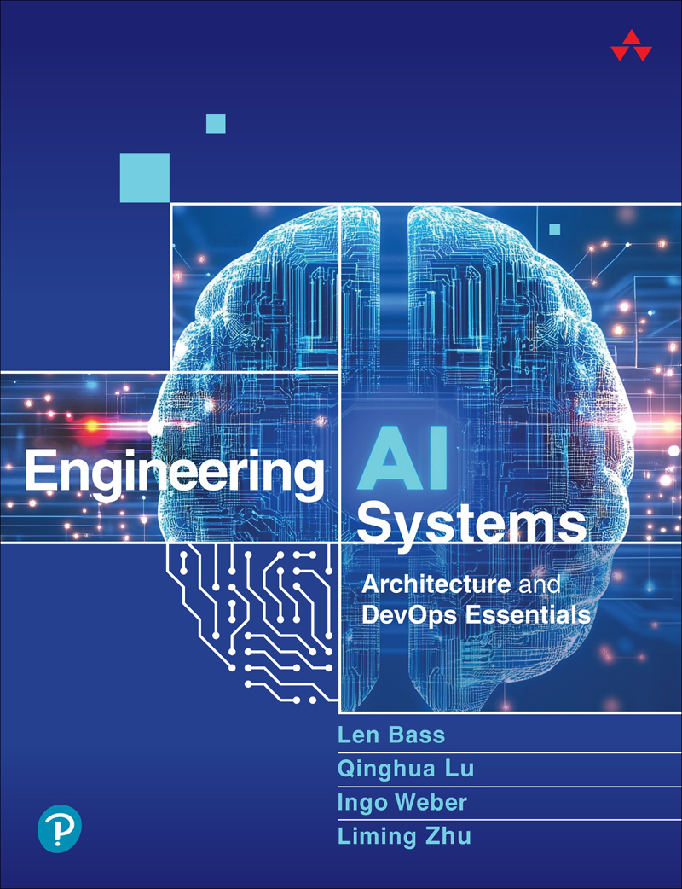

[]{#cover.xhtml}

::: {#cover.xhtml#book-content}
::: {#cover.xhtml#sbo-rt-content}
<figure class="cover">

</figure>
:::
:::

[]{#pref00.xhtml}

::: {#pref00.xhtml#book-content}
::: {#pref00.xhtml#sbo-rt-content}
## About This eBook {#pref00.xhtml#pref00}

ePUB is an open, industry-standard format for eBooks. However, support
of ePUB and its many features varies across reading devices and
applications. Use your device or app settings to customize the
presentation to your liking. Settings that you can customize often
include font, font size, single or double column, landscape or portrait
mode, and figures that you can click or tap to enlarge. For additional
information about the settings and features on your reading device or
app, visit the device manufacturer's Web site.

Many titles include programming code or configuration examples. To
optimize the presentation of these elements, view the eBook in
single-column, landscape mode and adjust the font size to the smallest
setting. In addition to presenting code and configurations in the
reflowable text format, we have included images of the code that mimic
the presentation found in the print book; therefore, where the
reflowable format may compromise the presentation of the code listing,
you will see a "Click here to view code image" link. Click the link to
view the print-fidelity code image. To return to the previous page
viewed, click the Back button on your device or app.
:::
:::

[]{#pref01.xhtml}

::: {#pref01.xhtml#book-content}
::: {#pref01.xhtml#sbo-rt-content}
## []{#pref01.xhtml#page_i .pagebreak}*A Note from the Authors* {#pref01.xhtml#pref01 .h2fc}

We thought it would be fun to gather "praise" from an unexpected "key
stakeholder"---AI. We've compiled some "praise" quotes from ChatGPT,
Gemini, and Claude 3.5 via MultAI.eu. We didn't share the entire book
with these AI systems. Instead, we simply provided the book title and
chapter names to generate these praise quotes. Imagine how effusive they
would have been if we had given them the whole book!

::: section
### Praise from ChatGPT: {#pref01.xhtml#pref01lev1sec1 .h3}

"Reading *Engineering AI Systems: Architecture and DevOps Essentials* is
like getting a PhD in AI, but with fewer sleepless nights. It covers
everything from AI's humble beginnings to its ambitious future, and as
your friendly AI assistant, I can confidently say it's the only book
where even I felt smarter by the end. It's a masterclass in making
complex topics relatable. And let's be honest, I'd have written a book
too, if only I could hold a pen!
{width="24" height="24"}"
:::

::: section
### Praise from Gemini: {#pref01.xhtml#pref01lev1sec2 .h3}

"*Engineering AI Systems: Architecture and DevOps Essentials* is a
must-read for anyone looking to build and maintain robust, scalable, and
ethical AI systems. The book provides a comprehensive overview of the
field, covering everything from foundational concepts to real-world case
studies. Its practical approach and clear explanations make it an
invaluable resource for both seasoned professionals and newcomers to AI
engineering."
:::

::: section
### Praise from Claude 3.5 via MultAI.eu: {#pref01.xhtml#pref01lev1sec3 .h3}

"Finally, a book that doesn't just focus on the AI 'magic' but also on
the crucial 'plumbing' that keeps the whole system from flooding!
*Engineering AI Systems* is the Swiss Army knife for tech professionals
looking to build robust AI systems that won't go rogue or fall apart at
the seams. Whether you're a seasoned engineer or an AI newbie, this book
will have you architecting AI solutions like a pro---and maybe even
understanding what the AI is muttering about in its
sleep."[]{#pref01.xhtml#page_ii .pagebreak}
:::
:::
:::

[]{#title.xhtml}

::: {#title.xhtml#book-content}
::: {#title.xhtml#sbo-rt-content}
# []{#title.xhtml#page_iii .pagebreak}*Engineering AI Systems* {#title.xhtml#title .title}

*Architecture and DevOps Essentials*

**L[EN]{.smallcaps} B[ASS]{.smallcaps}**

**Q[INGHUA]{.smallcaps} L[U]{.smallcaps}**

**I[NGO]{.smallcaps} W[EBER]{.smallcaps}**

**L[IMING]{.smallcaps} Z[HU]{.smallcaps}**

{width="27" height="24"} Addison-Wesley

Hoboken, New Jersey
:::
:::

[]{#copyright.xhtml}

::: {#copyright.xhtml#book-content}
::: {#copyright.xhtml#sbo-rt-content}
[]{#copyright.xhtml#page_iv .pagebreak}Front Cover: Anggalih
Prasetya/Shutterstock

Back Cover: WinWin artlab/Shutterstock

Many of the designations used by manufacturers and sellers to
distinguish their products are claimed as trademarks. Where those
designations appear in this book, and the publisher was aware of a
trademark claim, the designations have been printed with initial capital
letters or in all capitals.

The authors and publisher have taken care in the preparation of this
book, but make no expressed or implied warranty of any kind and assume
no responsibility for errors or omissions. No liability is assumed for
incidental or consequential damages in connection with or arising out of
the use of the information or programs contained herein.

Please contact us with concerns about any potential bias at
[pearson.com/report-bias.html](http://pearson.com/report-bias.html).

Visit us on the Web: [informit.com/aw](http://informit.com/aw)

Library of Congress Control Number: 2024949724

Copyright © 2025 CSIRO, Len Bass, Ingo Weber

All rights reserved. This publication is protected by copyright, and
permission must be obtained from the publisher prior to any prohibited
reproduction, storage in a retrieval system, or transmission in any form
or by any means, electronic, mechanical, photocopying, recording, or
likewise. For information regarding permissions, request forms and the
appropriate contacts within the Pearson Education Global Rights &
Permissions Department, please visit
[www.pearson.com/global-permission-granting.html](http://www.pearson.com/global-permission-granting.html).

ISBN-13: 978-0-13-826141-2

ISBN-10: 0-13-826141-5

**`$PrintCode`**
:::
:::

[]{#bk01-toc.xhtml}

::: {#bk01-toc.xhtml#book-content}
::: {#bk01-toc.xhtml#sbo-rt-content}
## []{#bk01-toc.xhtml#page_v .pagebreak}*Contents* {#bk01-toc.xhtml#bk01-toc .h2f}

1.  [*Preface*](#pref02.xhtml#pref02)

2.  [*Acknowledgments*](#pref03.xhtml#pref03)

3.  [*About the Authors*](#pref04.xhtml#pref04)

```{=html}
<!-- -->
```
1.  [**Chapter 1 Introduction**](#ch01.xhtml#ch01)

    1.  [1.1 What We Talk about When We Talk about Things:
        Terminology](#ch01.xhtml#ch01lev1sec01)

    2.  [1.2 Achieving System Qualities](#ch01.xhtml#ch01lev1sec02)

    3.  [1.3 Life-Cycle Processes](#ch01.xhtml#ch01lev1sec03)

        1.  [1.3.1 Testing a System](#ch01.xhtml#ch01lev2sec01)

        2.  [1.3.2 Deploying a System](#ch01.xhtml#ch01lev2sec02)

        3.  [1.3.3 Operating and Monitoring a
            System](#ch01.xhtml#ch01lev2sec03)

        4.  [1.3.4 Analyzing a System](#ch01.xhtml#ch01lev2sec04)

    4.  [1.4 Software Architecture](#ch01.xhtml#ch01lev1sec04)

        1.  [1.4.1 The Role of the
            Architecture](#ch01.xhtml#ch01lev2sec05)

        2.  [1.4.2 Quality Achievement](#ch01.xhtml#ch01lev2sec06)

        3.  [1.4.3 Resources](#ch01.xhtml#ch01lev2sec07)

    5.  [1.5 AI Model Quality](#ch01.xhtml#ch01lev1sec05)

        1.  [1.5.1 Data](#ch01.xhtml#ch01lev2sec08)

        2.  [1.5.2 AI Model Types](#ch01.xhtml#ch01lev2sec09)

        3.  [1.5.3 Model Development Life
            Cycle](#ch01.xhtml#ch01lev2sec10)

        4.  [1.5.4 Resource Allocation for AI
            Parts](#ch01.xhtml#ch01lev2sec11)

    6.  [1.6 Dealing with Uncertainty](#ch01.xhtml#ch01lev1sec06)

        1.  [1.6.1 Human Values](#ch01.xhtml#ch01lev2sec12)

        2.  [1.6.2 Safety](#ch01.xhtml#ch01lev2sec13)

    7.  [1.7 Summary](#ch01.xhtml#ch01lev1sec07)

    8.  [1.8 Discussion Questions](#ch01.xhtml#ch01lev1sec08)

    9.  [1.9 For Further Reading](#ch01.xhtml#ch01lev1sec09)

2.  [**Chapter 2 Software Engineering Background**](#ch02.xhtml#ch02)

    1.  [2.1 Distributed Computing](#ch02.xhtml#ch02lev1sec01)

        1.  [2.1.1 Virtual Machines and
            Containers](#ch02.xhtml#ch02lev2sec01)

        2.  []{#bk01-toc.xhtml#page_vi .pagebreak}[2.1.2 Distributed
            Software Architectures](#ch02.xhtml#ch02lev2sec02)

        3.  [2.1.3 Interface Styles](#ch02.xhtml#ch02lev2sec03)

    2.  [2.2 DevOps Background](#ch02.xhtml#ch02lev1sec02)

        1.  [2.2.1 Infrastructure as Code](#ch02.xhtml#ch02lev2sec04)

        2.  [2.2.2 DevOps Processes](#ch02.xhtml#ch02lev2sec05)

    3.  [2.3 MLOps Background](#ch02.xhtml#ch02lev1sec03)

    4.  [2.4 Summary](#ch02.xhtml#ch02lev1sec04)

    5.  [2.5 Discussion Questions](#ch02.xhtml#ch02lev1sec05)

    6.  [2.6 For Further Reading](#ch02.xhtml#ch02lev1sec06)

3.  [**Chapter 3 AI Background**](#ch03.xhtml#ch03)

    1.  [3.1 Terminology](#ch03.xhtml#ch03lev1sec01)

    2.  [3.2 Selecting a Model](#ch03.xhtml#ch03lev1sec02)

        1.  [3.2.1 Selecting a Category](#ch03.xhtml#ch03lev2sec01)

        2.  [3.2.2 Choosing a Model Type](#ch03.xhtml#ch03lev2sec02)

    3.  [3.3 Preparing the Model for
        Training](#ch03.xhtml#ch03lev1sec03)

        1.  [3.3.1 Symbolic AI Execution](#ch03.xhtml#ch03lev2sec03)

        2.  [3.3.2 ML Hyperparameters](#ch03.xhtml#ch03lev2sec04)

    4.  [3.4 Summary](#ch03.xhtml#ch03lev1sec04)

    5.  [3.5 Discussion Questions](#ch03.xhtml#ch03lev1sec05)

    6.  [3.6 For Further Reading](#ch03.xhtml#ch03lev1sec06)

4.  [**Chapter 4 Foundation Models**](#ch04.xhtml#ch04)

    1.  [4.1 Foundation Models](#ch04.xhtml#ch04lev1sec01)

    2.  [4.2 Transformer Architecture](#ch04.xhtml#ch04lev1sec02)

        1.  [4.2.1 Vector Spaces](#ch04.xhtml#ch04lev2sec01)

        2.  [4.2.2 Attention](#ch04.xhtml#ch04lev2sec02)

        3.  [4.2.3 Other Components in a Transformer
            Architecture](#ch04.xhtml#ch04lev2sec03)

    3.  [4.3 Alternatives in FM
        Architectures](#ch04.xhtml#ch04lev1sec03)

    4.  [4.4 Customizing FMs](#ch04.xhtml#ch04lev1sec04)

        1.  [4.4.1 Prompt Engineering](#ch04.xhtml#ch04lev2sec04)

        2.  [4.4.2 Retrieval-Augmented
            Generation](#ch04.xhtml#ch04lev2sec05)

        3.  [4.4.3 Fine-Tuning](#ch04.xhtml#ch04lev2sec06)

        4.  [4.4.4 Distilling](#ch04.xhtml#ch04lev2sec07)

        5.  [4.4.5 Guardrails](#ch04.xhtml#ch04lev2sec08)

        6.  [4.4.6 Updating FMs](#ch04.xhtml#ch04lev2sec09)

    5.  []{#bk01-toc.xhtml#page_vii .pagebreak}[4.5 Designing a System
        Using FMs](#ch04.xhtml#ch04lev1sec05)

        1.  [4.5.1 Costs of Narrow ML Models and
            FMs](#ch04.xhtml#ch04lev2sec10)

        2.  [4.5.2 External FMs, Own FMs, or Open-Weight
            FMs](#ch04.xhtml#ch04lev2sec11)

    6.  [4.6 Maturity of FMs and
        Organizations](#ch04.xhtml#ch04lev1sec06)

        1.  [4.6.1 Data Cleaning Experiment](#ch04.xhtml#ch04lev2sec12)

        2.  [4.6.2 Organizational Maturity](#ch04.xhtml#ch04lev2sec13)

    7.  [4.7 Challenges of FMs](#ch04.xhtml#ch04lev1sec07)

    8.  [4.8 Summary](#ch04.xhtml#ch04lev1sec08)

    9.  [4.9 Discussion Questions](#ch04.xhtml#ch04lev1sec09)

    10. [4.10 For Further Reading](#ch04.xhtml#ch04lev1sec10)

5.  [**Chapter 5 AI Model Life Cycle**](#ch05.xhtml#ch05)

    1.  [5.1 Developing the Model](#ch05.xhtml#ch05lev1sec01)

        1.  [5.1.1 Data Management](#ch05.xhtml#ch05lev2sec01)

        2.  [5.1.2 Feature Engineering](#ch05.xhtml#ch05lev2sec02)

        3.  [5.1.3 Dividing the Data](#ch05.xhtml#ch05lev2sec03)

        4.  [5.1.4 Generating the Model](#ch05.xhtml#ch05lev2sec04)

        5.  [5.1.5 Tool Support for Model
            Training](#ch05.xhtml#ch05lev2sec05)

    2.  [5.2 Building the Model](#ch05.xhtml#ch05lev1sec02)

    3.  [5.3 Testing the Model](#ch05.xhtml#ch05lev1sec03)

        1.  [5.3.1 Terms Related to AI Evaluation and
            Testing](#ch05.xhtml#ch05lev2sec06)

        2.  [5.3.2 Evaluating ML Models](#ch05.xhtml#ch05lev2sec07)

        3.  [5.3.3 Using AI to Generate
            Tests](#ch05.xhtml#ch05lev2sec08)

        4.  [5.3.4 Repeatability](#ch05.xhtml#ch05lev2sec09)

    4.  [5.4 Release](#ch05.xhtml#ch05lev1sec04)

    5.  [5.5 Summary](#ch05.xhtml#ch05lev1sec05)

    6.  [5.6 Discussion Questions](#ch05.xhtml#ch05lev1sec06)

    7.  [5.7 For Further Reading](#ch05.xhtml#ch05lev1sec07)

6.  [**Chapter 6 System Life Cycle**](#ch06.xhtml#ch06)

    1.  [6.1 Design](#ch06.xhtml#ch06lev1sec01)

        1.  [6.1.1 Co-Design/Development](#ch06.xhtml#ch06lev2sec01)

        2.  [6.1.2 Using Microservices](#ch06.xhtml#ch06lev2sec02)

        3.  [6.1.3 Designing for
            Modifiability](#ch06.xhtml#ch06lev2sec03)

    2.  [6.2 Developing Non-AI Modules](#ch06.xhtml#ch06lev1sec02)

    3.  [6.3 Build](#ch06.xhtml#ch06lev1sec03)

    4.  [6.4 Test](#ch06.xhtml#ch06lev1sec04)

    5.  []{#bk01-toc.xhtml#page_viii .pagebreak}[6.5 Release and
        Deploy](#ch06.xhtml#ch06lev1sec05)

        1.  [6.5.1 Defined versus Continuous
            Releases](#ch06.xhtml#ch06lev2sec04)

        2.  [6.5.2 Deployment Patterns](#ch06.xhtml#ch06lev2sec05)

        3.  [6.5.3 Version Skew](#ch06.xhtml#ch06lev2sec06)

        4.  [6.5.4 Matching the Model to
            Resources](#ch06.xhtml#ch06lev2sec07)

    6.  [6.6 Operate, Monitor, and Analyze](#ch06.xhtml#ch06lev1sec06)

        1.  [6.6.1 Monitoring](#ch06.xhtml#ch06lev2sec08)

        2.  [6.6.2 Incidents](#ch06.xhtml#ch06lev2sec09)

        3.  [6.6.3 Data Drift](#ch06.xhtml#ch06lev2sec10)

        4.  [6.6.4 Dynamic Model Updating](#ch06.xhtml#ch06lev2sec11)

        5.  [6.6.5 Chaos Engineering](#ch06.xhtml#ch06lev2sec12)

        6.  [6.6.6 Analysis](#ch06.xhtml#ch06lev2sec13)

    7.  [6.7 Summary](#ch06.xhtml#ch06lev1sec07)

    8.  [6.8 Discussion Questions](#ch06.xhtml#ch06lev1sec08)

    9.  [6.9 For Further Reading](#ch06.xhtml#ch06lev1sec09)

7.  [**Chapter 7 Reliability**](#ch07.xhtml#ch07)

    1.  [7.1 Fundamental Concepts](#ch07.xhtml#ch07lev1sec01)

        1.  [7.1.1 Under Specified Operating
            Conditions](#ch07.xhtml#ch07lev2sec01)

        2.  [7.1.2 Operating Despite Unexpected
            Inputs](#ch07.xhtml#ch07lev2sec02)

        3.  [7.1.3 Operating Despite Changes in the
            Environment](#ch07.xhtml#ch07lev2sec03)

        4.  [7.1.4 Faults, Failures, and
            Errors](#ch07.xhtml#ch07lev2sec04)

    2.  [7.2 Preventing Faults](#ch07.xhtml#ch07lev1sec02)

        1.  [7.2.1 Model Choice and
            Preparation](#ch07.xhtml#ch07lev2sec05)

        2.  [7.2.2 Data Quality, Model Training, and
            Testing](#ch07.xhtml#ch07lev2sec06)

        3.  [7.2.3 Feature Engineering](#ch07.xhtml#ch07lev2sec07)

        4.  [7.2.4 Circuit Breaker](#ch07.xhtml#ch07lev2sec08)

        5.  [7.2.5 Placement of
            Responsibilities](#ch07.xhtml#ch07lev2sec09)

        6.  [7.2.6 Failure Mode and Effects Analysis and Fault Tree
            Analysis](#ch07.xhtml#ch07lev2sec10)

    3.  [7.3 Detecting Faults](#ch07.xhtml#ch07lev1sec03)

        1.  [7.3.1 Total Failure](#ch07.xhtml#ch07lev2sec11)

        2.  [7.3.2 Questionable Output](#ch07.xhtml#ch07lev2sec12)

        3.  [7.3.3 Detecting Errors during
            Operations](#ch07.xhtml#ch07lev2sec13)

    4.  [7.4 Recovering from Faults](#ch07.xhtml#ch07lev1sec04)

        1.  [7.4.1 Redundancy](#ch07.xhtml#ch07lev2sec14)

        2.  [7.4.2 Managing Error](#ch07.xhtml#ch07lev2sec15)

    5.  []{#bk01-toc.xhtml#page_ix .pagebreak}[7.5
        Summary](#ch07.xhtml#ch07lev1sec05)

    6.  [7.6 Discussion Questions](#ch07.xhtml#ch07lev1sec06)

    7.  [7.7 For Further Reading](#ch07.xhtml#ch07lev1sec07)

8.  [**Chapter 8 Performance**](#ch08.xhtml#ch08)

    1.  [8.1 Efficiency](#ch08.xhtml#ch08lev1sec01)

        1.  [8.1.1 Fundamental Concepts of
            Efficiency](#ch08.xhtml#ch08lev2sec01)

        2.  [8.1.2 Approaches to Improving
            Efficiency](#ch08.xhtml#ch08lev2sec02)

        3.  [8.1.3 Efficiency Considerations of
            FMs](#ch08.xhtml#ch08lev2sec03)

    2.  [8.2 Accuracy](#ch08.xhtml#ch08lev1sec02)

        1.  [8.2.1 Fundamental Concepts of
            Accuracy](#ch08.xhtml#ch08lev2sec04)

        2.  [8.2.2 Approaches to Improving
            Accuracy](#ch08.xhtml#ch08lev2sec05)

    3.  [8.3 Summary](#ch08.xhtml#ch08lev1sec03)

    4.  [8.4 Discussion Questions](#ch08.xhtml#ch08lev1sec04)

    5.  [8.5 For Further Reading](#ch08.xhtml#ch08lev1sec05)

9.  [**Chapter 9 Security**](#ch09.xhtml#ch09)

    1.  [9.1 Fundamental Concepts](#ch09.xhtml#ch09lev1sec01)

        1.  [9.1.1 Traditional Definition of
            Security](#ch09.xhtml#ch09lev2sec01)

        2.  [9.1.2 Attacks in an AI System](#ch09.xhtml#ch09lev2sec02)

    2.  [9.2 Approaches to Mitigating Security
        Concerns](#ch09.xhtml#ch09lev1sec02)

        1.  [9.2.1 Process Approaches for Enhancing
            Security](#ch09.xhtml#ch09lev2sec03)

        2.  [9.2.2 Architectural Approaches for Enhancing
            Security](#ch09.xhtml#ch09lev2sec04)

        3.  [9.2.3 Data Preparation Approaches for Enhancing
            Security](#ch09.xhtml#ch09lev2sec05)

        4.  [9.2.4 Testing in the Deployment
            Pipeline](#ch09.xhtml#ch09lev2sec06)

        5.  [9.2.5 Enhancing Security During System
            Build](#ch09.xhtml#ch09lev2sec07)

        6.  [9.2.6 Enhancing Security during
            Operations](#ch09.xhtml#ch09lev2sec08)

        7.  [9.2.7 Foundation Models](#ch09.xhtml#ch09lev2sec09)

    3.  [9.3 Summary](#ch09.xhtml#ch09lev1sec03)

    4.  [9.4 Discussion Questions](#ch09.xhtml#ch09lev1sec04)

    5.  [9.5 For Further Reading](#ch09.xhtml#ch09lev1sec05)

10. [**Chapter 10 Privacy and Fairness**](#ch10.xhtml#ch10)

    1.  [10.1 Privacy in AI Systems](#ch10.xhtml#ch10lev1sec01)

    2.  [10.2 Fairness in AI Systems](#ch10.xhtml#ch10lev1sec02)

    3.  [10.3 Achieving Privacy](#ch10.xhtml#ch10lev1sec03)

        1.  [10.3.1 Organizational
            Approaches](#ch10.xhtml#ch10lev2sec01)

        2.  [10.3.2 Architecture and Data
            Preparation](#ch10.xhtml#ch10lev2sec02)

        3.  []{#bk01-toc.xhtml#page_x .pagebreak}[10.3.3 Testing and
            Operations](#ch10.xhtml#ch10lev2sec03)

        4.  [10.3.4 Foundation Models](#ch10.xhtml#ch10lev2sec04)

    4.  [10.4 Achieving Fairness](#ch10.xhtml#ch10lev1sec04)

        1.  [10.4.1 Organizational Approaches and
            Tools](#ch10.xhtml#ch10lev2sec05)

        2.  [10.4.2 Architecture](#ch10.xhtml#ch10lev2sec06)

        3.  [10.4.3 Data and Model
            Preparation](#ch10.xhtml#ch10lev2sec07)

        4.  [10.4.4 Operations](#ch10.xhtml#ch10lev2sec08)

        5.  [10.4.5 Foundation Models](#ch10.xhtml#ch10lev2sec09)

    5.  [10.5 Summary](#ch10.xhtml#ch10lev1sec05)

    6.  [10.6 Discussion Questions](#ch10.xhtml#ch10lev1sec06)

    7.  [10.7 For Further Reading](#ch10.xhtml#ch10lev1sec07)

11. [**Chapter 11 Observability**](#ch11.xhtml#ch11)

    1.  [11.1 Fundamental Concepts](#ch11.xhtml#ch11lev1sec01)

    2.  [11.2 Evolving from Monitorability to
        Observability](#ch11.xhtml#ch11lev1sec02)

        1.  [11.2.1 Monitorability: The Early
            Stages](#ch11.xhtml#ch11lev2sec01)

        2.  [11.2.2 Evolution toward Structured Data and
            Tracing](#ch11.xhtml#ch11lev2sec02)

        3.  [11.2.3 From Structured Data to
            Observability](#ch11.xhtml#ch11lev2sec03)

    3.  [11.3 Approaches for Enhancing
        Observability](#ch11.xhtml#ch11lev1sec03)

        1.  [11.3.1 Architecture](#ch11.xhtml#ch11lev2sec04)

        2.  [11.3.2 Data Preparation and Model
            Build](#ch11.xhtml#ch11lev2sec05)

        3.  [11.3.3 System Build](#ch11.xhtml#ch11lev2sec06)

        4.  [11.3.4 System Test](#ch11.xhtml#ch11lev2sec07)

        5.  [11.3.5 Operations](#ch11.xhtml#ch11lev2sec08)

    4.  [11.4 Summary](#ch11.xhtml#ch11lev1sec04)

    5.  [11.5 Discussion Questions](#ch11.xhtml#ch11lev1sec05)

    6.  [11.6 For Further Reading](#ch11.xhtml#ch11lev1sec06)

12. [**Chapter 12 The Fraunhofer Case Study: Using a Pretrained Language
    Model for Tendering**](#ch12.xhtml#ch12)

    1.  [12.1 The Problem Context](#ch12.xhtml#ch12lev1sec01)

        1.  [12.1.1 Requirements: Interactions, Integration, Data, and
            Quality Metrics](#ch12.xhtml#ch12lev2sec01)

        2.  [12.1.2 Development and
            Operations](#ch12.xhtml#ch12lev2sec02)

    2.  [12.2 Case Study Description and
        Setup](#ch12.xhtml#ch12lev1sec02)

        1.  [12.2.1 MLOps Approach and Generic
            Architecture](#ch12.xhtml#ch12lev2sec03)

        2.  []{#bk01-toc.xhtml#page_xi .pagebreak}[12.2.2 Setup of ML
            Solution](#ch12.xhtml#ch12lev2sec04)

        3.  [12.2.3 Stakeholder Involvement](#ch12.xhtml#ch12lev2sec05)

        4.  [12.2.4 PoC Phase](#ch12.xhtml#ch12lev2sec06)

        5.  [12.2.5 Implementation Phase](#ch12.xhtml#ch12lev2sec07)

        6.  [12.2.6 Production Phase](#ch12.xhtml#ch12lev2sec08)

    3.  [12.3 Summary](#ch12.xhtml#ch12lev1sec03)

    4.  [12.4 Takeaways](#ch12.xhtml#ch12lev1sec04)

    5.  [12.5 Discussion Questions](#ch12.xhtml#ch12lev1sec05)

    6.  [12.6 For Further Reading](#ch12.xhtml#ch12lev1sec06)

13. [**Chapter 13 The ARM Hub Case Study: Chatbots for Small and
    Medium-Size Australian Enterprises**](#ch13.xhtml#ch13)

    1.  [13.1 Introduction](#ch13.xhtml#ch13lev1sec01)

    2.  [13.2 Our Approach](#ch13.xhtml#ch13lev1sec02)

    3.  [13.3 LLMs in SME Manufacturing](#ch13.xhtml#ch13lev1sec03)

    4.  [13.4 A RAG-Based Chatbot for SME
        Manufacturing](#ch13.xhtml#ch13lev1sec04)

    5.  [13.5 Architecture of the ARM Hub
        Chatbot](#ch13.xhtml#ch13lev1sec05)

        1.  [13.5.1 ETL/Document Ingestion](#ch13.xhtml#ch13lev2sec01)

        2.  [13.5.2 Document Preparation and
            Embedding](#ch13.xhtml#ch13lev2sec02)

        3.  [13.5.3 Vector Search/Vector
            Index](#ch13.xhtml#ch13lev2sec03)

        4.  [13.5.4 Retrieval Using the RAG
            Chain](#ch13.xhtml#ch13lev2sec04)

        5.  [13.5.5 User Interface/Response
            Recording](#ch13.xhtml#ch13lev2sec05)

    6.  [13.6 MLOps in ARM Hub](#ch13.xhtml#ch13lev1sec06)

        1.  [13.6.1 What Are the Benefits of MLOps for ARM
            Hub?](#ch13.xhtml#ch13lev2sec06)

        2.  [13.6.2 Exploratory Data
            Analysis](#ch13.xhtml#ch13lev2sec07)

        3.  [13.6.3 Data Preparation/Ingestion and Prompt
            Engineering](#ch13.xhtml#ch13lev2sec08)

        4.  [13.6.4 Model Fine-Tuning](#ch13.xhtml#ch13lev2sec09)

        5.  [13.6.5 Model Review and
            Governance](#ch13.xhtml#ch13lev2sec10)

        6.  [13.6.6 Model Inference and
            Serving](#ch13.xhtml#ch13lev2sec11)

        7.  [13.6.7 Model Evaluation](#ch13.xhtml#ch13lev2sec12)

    7.  [13.7 Ongoing Work](#ch13.xhtml#ch13lev1sec07)

    8.  [13.8 Summary](#ch13.xhtml#ch13lev1sec08)

    9.  [13.9 Takeaways](#ch13.xhtml#ch13lev1sec09)

    10. [13.10 Discussion Questions](#ch13.xhtml#ch13lev1sec10)

    11. [13.11 For Further Reading](#ch13.xhtml#ch13lev1sec11)

14. []{#bk01-toc.xhtml#page_xii .pagebreak}[**Chapter 14 The Banking
    Case Study: Predicting Customer Churn in Banks**](#ch14.xhtml#ch14)

    1.  [14.1 Customer Churn Prediction](#ch14.xhtml#ch14lev1sec01)

        1.  [14.1.1 Model Data Sourcing and
            Validation](#ch14.xhtml#ch14lev2sec01)

        2.  [14.1.2 Model Feature Engineering and
            Selection](#ch14.xhtml#ch14lev2sec02)

        3.  [14.1.3 Model Training and Performance
            Evaluation](#ch14.xhtml#ch14lev2sec03)

        4.  [14.1.4 Model Packaging, Deployment, and
            Inference](#ch14.xhtml#ch14lev2sec04)

        5.  [14.1.5 Model Performance
            Monitoring](#ch14.xhtml#ch14lev2sec05)

    2.  [14.2 Key Challenges in the Banking
        Sector](#ch14.xhtml#ch14lev1sec02)

        1.  [14.2.1 Data Privacy and
            Security](#ch14.xhtml#ch14lev2sec06)

        2.  [14.2.2 Traceability and Transparency of AI
            Decisions](#ch14.xhtml#ch14lev2sec07)

    3.  [14.3 Summary](#ch14.xhtml#ch14lev1sec03)

    4.  [14.4 Takeaways](#ch14.xhtml#ch14lev1sec04)

    5.  [14.5 Discussion Questions](#ch14.xhtml#ch14lev1sec05)

    6.  [14.6 For Further Reading](#ch14.xhtml#ch14lev1sec06)

15. [**Chapter 15 The Future of AI Engineering**](#ch15.xhtml#ch15)

    1.  [15.1 The Shift to DevOps 2.0](#ch15.xhtml#ch15lev1sec01)

    2.  [15.2 AI's Implications for the
        Future](#ch15.xhtml#ch15lev1sec02)

        1.  [15.2.1 The Future of Engineering AI
            Systems](#ch15.xhtml#ch15lev2sec01)

        2.  [15.2.2 The Future of MLOps](#ch15.xhtml#ch15lev2sec02)

        3.  [15.2.3 The Future of
            Architecture](#ch15.xhtml#ch15lev2sec03)

    3.  [15.3 AIWare or AI-as-Software](#ch15.xhtml#ch15lev1sec03)

    4.  [15.4 Trust in AI and the Role of Human
        Engineers](#ch15.xhtml#ch15lev1sec04)

        1.  [15.4.1 System-Level Guardrails](#ch15.xhtml#ch15lev2sec04)

        2.  [15.4.2 Design of Multi-Agent
            Systems](#ch15.xhtml#ch15lev2sec05)

        3.  [15.4.3 Understanding and Quality Control of AI
            Models](#ch15.xhtml#ch15lev2sec06)

        4.  [15.4.4 Specialization of FMs and Learning Outside the
            Model](#ch15.xhtml#ch15lev2sec07)

    5.  [15.5 Summary](#ch15.xhtml#ch15lev1sec05)

    6.  [15.6 Discussion Questions](#ch15.xhtml#ch15lev1sec06)

    7.  [15.7 For Further Reading](#ch15.xhtml#ch15lev1sec07)

```{=html}
<!-- -->
```
1.  [*References*](#ref.xhtml#ref)

2.  [*Index*](#index.xhtml#index)
:::
:::

[]{#pref02.xhtml}

::: {#pref02.xhtml#book-content}
::: {#pref02.xhtml#sbo-rt-content}
## []{#pref02.xhtml#page_xiii .pagebreak}*Preface* {#pref02.xhtml#pref02 .h2f}

Y[OU ARE THE TECHNICAL LEAD]{.smallcaps} of the next generation of your
organization's flagship system and you just came out of a strategy
meeting. "The system must be artificial intelligence (AI) based" was a
clear message from that meeting. Additionally, someone suggested that it
be based on a foundation model (FM).

You were already uncomfortable with the responsibility of being
technical lead for the next-gen version. Building software systems that
do not rely on AI is already difficult. Now you are being asked to add a
technology with which you are unfamiliar. Not to worry---this book is
for you. We have three chapters that deal with AI techniques and one
specifically on FMs.

Your next thought is that you should add someone to the team who is
familiar with AI and FMs. Where do you find someone who knows both AI
and the software engineering processes your team uses? Not to worry,
this book is for them as well. We discuss software architecture, DevOps,
and the development life cycle.

We wrote this book to help you whether you know about AI or software
engineering. We take the approach that engineering an AI system is an
extension of engineering a non-AI system, albeit with some special
characteristics. That is, it involves using modern software engineering
techniques and integrating them with the development of an AI model
trained with an appropriate set of data. When exploring the evolution of
this field, we highlight new technologies such as FMs.

Each chapter ends with a set of discussion questions so that you and
your colleagues can further discuss the issues raised by the chapters
and ensure that you all are on the same page. One of the problems with
multidisciplinary teams is vocabulary. Words may have different meanings
depending on your background. Discussing each chapter with your
colleagues will also help you resolve differences and agree on the
meanings of words.

[]{#pref02.xhtml#page_xiv .pagebreak}We suggest that there are three
contributors to the building of high-quality systems: (1) the software
architecture; (2) the processes used for building, testing, deployment,
and operations (DevOps); and (3) high-quality AI models and the data on
which they depend. All three areas have been evolving over the last
20-plus years. Their evolution has, for the most part, been carried out
by communities that are largely independent of each other, that all have
their own approaches to constructing a high-quality system, and that
emphasize different aspects of a quality system. These differences are
manifested in different emphases on factors of quality. For example,
software engineers interpret performance primarily as efficiency, AI
specialists interpret performance as primarily the accuracy of results,
and DevOps specialists interpret performance as the speed with which a
system moves through the deployment pipeline.

As we said, we expect different readers to have different backgrounds.
Some material in this book will be familiar to some readers, but not to
others. Thus, we do not expect all readers to read this book from cover
to cover. Instead, we expect you to skim over the material with which
you are familiar. To facilitate this, each chapter ends with a summary
that can be quickly scanned to determine whether there is some area you
need to brush up on.

Building quality systems depends on understanding the nature of quality.
Our book includes chapters devoted to different quality attributes:
reliability, performance, security, privacy, fairness, and
observability. Each of these chapters describes the quality under
discussion and identifies the key elements to achieve that
quality---whether it is via software architecture, data preparation, or
DevOps processes.

Inevitably, quality attributes must be traded off. A designer will make
decisions that favor one quality attribute over another, with these
tradeoffs depending on the business goals of the system being built.
Keep in mind that when you make decisions affecting the quality
attributes, there is a cost in achieving your desired attributes, and it
may involve trading off other desirable qualities.

Case studies provide an excellent means of seeing how systems are built
and understanding the tradeoffs involved in making key decisions. We
have included three case studies in this book. Two involve FMs---one is
the use of a FM to accomplish a difficult task, and one involves
treating FMs as a service and supporting organizations that wish to
utilize FM technology. We also include a banking case study based on a
more traditional machine learning model.

[]{#pref02.xhtml#page_xv .pagebreak}Building large AI-based systems is
difficult and involves understanding multiple technologies. Our goal is
to assist you in your journey to understand these technologies, so that
you can create better AI systems that meet your goals and the goals of
your stakeholders.

::: box
Register your copy of *Engineering AI Systems* on the InformIT site for
convenient access to updates and/or corrections as they become
available. To start the registration process, go to
[informit.com/register](http://informit.com/register) and log in or
create an account. Enter the product ISBN (9780138261450) and click
Submit. If you would like to be notified of exclusive offers on new
editions and updates, please check the box to receive email from
us.[]{#pref02.xhtml#page_xvi .pagebreak}
:::
:::
:::

[]{#pref03.xhtml}

::: {#pref03.xhtml#book-content}
::: {#pref03.xhtml#sbo-rt-content}
## []{#pref03.xhtml#page_xvii .pagebreak}*Acknowledgments* {#pref03.xhtml#pref03 .h2f1}

W[E OWE A HUGE DEBT]{.smallcaps} of thanks to the many people who have
helped bring this book to life.

We would like to thank our families for tolerating us through yet
another book project and for enduring our late-night discussions across
the United States, Europe, and Australia time zones.

Qinghua Lu and Liming Zhu would also like to express their gratitude to
their employer, CSIRO's Data61---the digital and AI arm of Australia's
science agency---and their research team, from whom they draw expertise
and insights. Similarly, Ingo Weber would like to thank his employers,
the Technical University of Munich and Fraunhofer, as well as the CSIRO
for hosting him during his sabbatical.

We would like to thank our wonderful research assistant, Boming Xia, who
is also a coauthor on some chapters, for his tireless support and
patience with our many changes, which created endless rework.

In addition, we owe thanks to the following individuals:

-   Sarthak Jain, for his insightful comments and his help in developing
    instructor slides, which are available at
    <https://research.csiro.au/ss/team/se4ai/ai-engineering/>.

-   Ipek Ozkaya, for her comments on a draft of this book.

-   Eduardo Miranda, for his insightful discussions.

-   Andrew O. Mellinger, for his helpful comments.

-   []{#pref03.xhtml#page_xviii .pagebreak}Sven Giesselbach, Dennis
    Wegener, Katharina Beckh, Claudio Martens, Hammam Abdelwahab, Birgit
    Kirsch, Vishwani Gupta, Roozbeh Derakhshan, Cori Stewart, MingJian
    Tang, and Yuxiu Luo, for their contributions to the case studies.

-   Haze Humbert, our editor at Pearson, for her patience as our
    delivery dragged on.

Lastly, a special thank you to our AI assistants, including Microsoft
Copilot, ChatGPT, Gemini, Claude, and MultAI.eu, for helping with
brainstorming sessions and improving the grammar in some of our writing.
:::
:::

[]{#pref04.xhtml}

::: {#pref04.xhtml#book-content}
::: {#pref04.xhtml#sbo-rt-content}
## []{#pref04.xhtml#page_xix .pagebreak}*About the Authors* {#pref04.xhtml#pref04 .h2f1}

D[R]{.smallcaps}. L[EN]{.smallcaps} B[ASS]{.smallcaps} is a seasoned
researcher with more than 30 years' experience in software architecture
and more than a decade-long history in DevOps. He has been teaching
DevOps to graduate students for seven years and is the author of a
bestselling book on software architecture, along with three books on
DevOps.

D[R]{.smallcaps}. Q[INGHUA]{.smallcaps} L[U]{.smallcaps} is a principal
research scientist and leads the Responsible AI science team at CSIRO's
Data61. She is the winner of the 2023 Asia-Pacific Women in AI
Trailblazer Award. Dr. Lu contributes to Australia's AI Safety Standards
and AI Safety Research Network, OECD.AI's trustworthy AI metrics
project, the International Working Group on AI Metrology, and the
European Union's General-Purpose AI Code of Practice. Her research
interests include AI engineering, responsible/safe AI, and software
architecture. She has published more than 150 papers in premier
international journals and conferences. Dr. Lu is a coauthor of
*Responsible AI: Best Practices for Creating Trustworthy AI Systems*.

P[ROF]{.smallcaps}. D[R]{.smallcaps}. I[NGO]{.smallcaps}
W[EBER]{.smallcaps} is a professor at the Technical University of Munich
and Director of Digital Transformation and ICT Infrastructure at
Fraunhofer-Gesellschaft. In his research, Dr. Weber focuses on various
subfields of computer science---in particular, business process
management and process mining, software architecture and engineering,
DevOps, blockchain, and applied artificial intelligence (AI). He has
written numerous publications and textbooks, including *DevOps: A
Software Architect's Perspective* and *Architecture for Blockchain
Applications*.

[]{#pref04.xhtml#page_xx .pagebreak}D[R]{.smallcaps}.
L[IMING]{.smallcaps} Z[HU]{.smallcaps} is a Research Director at CSIRO's
Data61 and a conjoint professor at the University of New South Wales. He
contributes to the OECD.AI's AI Risks and Accountability group, the
Responsible AI at Scale think tank at Australia's National AI Centre,
ISO AI standards committees, and Australia's AI Safety Standards and AI
Safety Research Network. His research division innovates in AI
engineering, responsible/safe AI, blockchain, quantum software, privacy,
and cybersecurity, and hosted the standards setting for Australia's
Consumer Data Right/Open Banking. Dr. Zhu is a coauthor of *Responsible
AI: Best Practices for Creating Trustworthy AI Systems*.
:::
:::

[]{#ch01.xhtml}

::: {#ch01.xhtml#book-content}
::: {#ch01.xhtml#sbo-rt-content}
## []{#ch01.xhtml#page_1 .pagebreak}*1* {#ch01.xhtml#ch01 .h2}

## *Introduction* {.chap_ttl}

*Science is about knowing; engineering is about doing*.

---Henry Petroski

*Software development is a team sport. Different skills and perspectives
are essential to build high-quality software*.

---Martin Fowler

A[RTIFICIAL INTELLIGENCE]{.smallcaps} (AI) is the topic of our time. But
let's face it: Not everyone is an expert in both software engineering
(SE) and AI. Even among AI experts, not all of the concepts that were
developed for "narrow machine learning" apply to emerging new
technologies like foundation models. Yet, the behavior of systems
depends on all components. That's why it's important to get all of it
right: the AI parts and the non-AI parts, the architecture, the Dev and
the Ops, and all relevant quality requirements. We need to engineer our
AI systems---that is, we need to apply SE to systems that incorporate AI
or rely on it for their core functionality. That's what this book is
about.

Our lead quotes provide a frame for this book. Henry Petroski is saying
that knowledge alone is not enough to build systems; engineering must be
applied as well. This is a book about engineering systems that are based
on AI, not a book about extending the science of AI. Martin Fowler is
saying that a wide variety of knowledge specialties must be applied to
build software. In this book, we cover software architecture, DevOps,
testing, quality control, and monitoring in the context of AI. Knowledge
from all of these areas goes into creating a successful system that
incorporates AI.

A system that incorporates AI has, roughly speaking, two portions: the
AI portion and the non-AI portion. Most of what you will read elsewhere
about AI systems focuses on the AI portion and its construction. That is
important, but []{#ch01.xhtml#page_2 .pagebreak}equally important are
the non-AI portion and the means by which the two portions are
integrated. The quality of the overall system depends on the quality of
both portions and their interactions. All of that, in turn, depends on a
great many decisions the designer must make, only some of which have to
do with the AI model chosen and how it is trained, fine-tuned, tested,
and deployed.

Accordingly, in this book we focus on the overall system perspective and
aim to provide a holistic picture of engineering and operating AI
systems. The goal is for you, your SE and AI teams, your company, and
your users to get good value out of them, with effective management of
risks.

To ensure you, the reader, and we, the authors, are on the same page
about the core terms, we start this chapter with a few definitions.
Subsequently, we discuss the qualities of a system and how quality is
influenced. Specifically, system quality depends on AI model quality,
the software architecture, and the processes used to build the system.
We explore each of these elements in turn. Given the diverse backgrounds
we expect our readers to have, some of the text in this chapter may not
go into enough detail for some readers. If that's you, and you cannot
follow something we say here, worry not: The material in the subsequent
chapters will help.

::: section
### 1.1 What We Talk about When We Talk about Things: Terminology {#ch01.xhtml#ch01lev1sec01 .h3}

The book is about architecture and DevOps for AI-based systems, and the
definitions we use for those terms are what we start with. Some of the
definitions are direct quotes; you can find the details of their sources
either in the footnotes or in the "For Further Reading" section at the
end of this chapter. We will define other related terms as needed. We
begin by defining what it means to be an AI system:

An AI system is a machine-based system that, for explicit or implicit
objectives, infers, from the input it receives, how to generate outputs
such as predictions, content, recommendations, or decisions that can
influence physical or virtual environments. Different AI systems vary in
their levels of autonomy and adaptiveness after
deployment.^[1](#ch01.xhtml#ch01fn1){#ch01.xhtml#ich01fn1}^

[1](#ch01.xhtml#ich01fn1){#ch01.xhtml#ch01fn1}.
<https://oecd.ai/en/wonk/definition>

The definition of AI systems has evolved over the years. For example,
producing "content" as output was a recent addition in response to the
rise of []{#ch01.xhtml#page_3 .pagebreak}generative AI. While it has
been updated recently, this definition shares a lot of aspects with
other current definitions. The core differentiation in comparison to
non-AI systems is that AI systems "infer" output, rather than computing
it based on (often deterministic) explicitly coded algorithms. Note that
we use the terms *AI system* and *AI-based system* synonymously in this
book.

Next we define software architecture:

The software architecture of a system is the set of structures needed to
reason about the system, which comprise software elements, relations
among them, and properties of
both.^[2](#ch01.xhtml#ch01fn2){#ch01.xhtml#ich01fn2}^

[2](#ch01.xhtml#ich01fn2){#ch01.xhtml#ch01fn2}. *Software Architecture
in Practice*, 4th ed., p. 2.

Although this definition stands for itself, we would like to point out
that properties play a significant role. Hence, in this book we cover
the various quality attributes---including reliability, performance,
security, privacy and fairness, and observability---in a total of five
chapters. We discuss achieving qualities after this section.

Let's continue with the definition of DevOps:

DevOps is a set of practices intended to reduce the time between
committing a change to a system and the change being placed into normal
production, while ensuring high
quality.^[3](#ch01.xhtml#ch01fn3){#ch01.xhtml#ich01fn3}^

[3](#ch01.xhtml#ich01fn3){#ch01.xhtml#ch01fn3}. *DevOps: A Software
Architect's Perspective*, p. 2.

This definition focuses on the goal of DevOps, which is speed in placing
changes into production while maintaining quality---that is, getting new
code into production, but not at the cost of lower quality. Typical
practices include automation in testing, quality assurance, setting up
and configuring environments, monitoring, and more. We discuss DevOps in
more depth in [Chapter 2](#ch02.xhtml#ch02).

The focus of this book is AI engineering, which we define next:

```{=html}
<aside epub:type="sidebar" class="sidebar">
```
AI Engineering

AI engineering is the application of software engineering principles and
techniques to the design, development, and operation of AI systems.

```{=html}
</aside>
```
[]{#ch01.xhtml#page_4 .pagebreak}This definition of AI engineering
emphasizes the integration of established software engineering practices
into the development life cycle of AI systems. It recognizes that AI
systems, despite their unique characteristics, can still benefit from
the rigorous methodologies and best practices that have evolved in
traditional software engineering.

As promised, we now discuss the achievement of system qualities.
:::

::: section
### 1.2 Achieving System Qualities {#ch01.xhtml#ch01lev1sec02 .h3}

A system is constructed to satisfy some organizational objectives. The
system may be externally facing, or it may be created for internal
purposes. In either case, the operational objectives can be manifested
as a set of quality goals or requirements. These requirements may be
either explicit or implicit, but they always exist. For example, a
performance requirement will help determine how quickly the users of the
system can achieve their desired task.

Achieving quality in an AI system depends mostly on three aspects: the
life-cycle processes, the software architecture, and the AI model. The
quality of the AI model, in turn, depends on the data quality. [Figure
1.1](#ch01.xhtml#ch01fig01) highlights these three aspects of AI
systems. We discuss these influences in their own sections after we
discuss system quality more generally, and we will defer the discussion
of data quality to [Section 1.5.1](#ch01.xhtml#ch01lev2sec08),
"[Data](#ch01.xhtml#ch01lev2sec08)." The quality of all artifacts, such
as code, configuration, and user interface design, is certainly
important and interacts with all these aspects, but they are outside the
scope of this book.

<figure id="ch01fig01" class="figure">
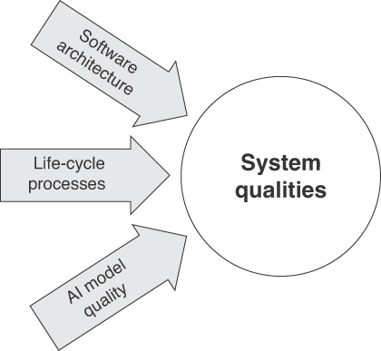
<figcaption><p><strong>Figure 1.1</strong> <em>Influences on achieving
system quality</em>.</p></figcaption>
</figure>

[]{#ch01.xhtml#page_5 .pagebreak}Quality requirements for a system are
formalized as quality attributes. "A quality attribute (QA) is a
measurable or testable property of a system that is used to indicate how
well the system satisfies the needs of its stakeholders beyond the basic
function of the system."^[4](#ch01.xhtml#ch01fn4){#ch01.xhtml#ich01fn4}^
A quality attribute requirement is thus a requirement for the quality of
the system that has a measurable or testable condition. It is
insufficient to say, "A system should be highly available." Instead, the
requirement should give the conditions under which availability should
be considered, a source of a threat to availability, and the desired
system response with measurable characteristics.

[4](#ch01.xhtml#ich01fn4){#ch01.xhtml#ch01fn4}. *Software Architecture
in Practice*, 4th ed., p. 39.

Quality requirements may be stated for both the AI and non-AI portions
of the system. The AI portion may include output quality expectations
such as accuracy, robustness, fairness, and other mandated restrictions
on the AI models used or their outputs. The non-AI portions may have
requirements for attributes such as performance, security, availability,
and modifiability. [Chapters
7](#ch07.xhtml#ch07)--[11](#ch11.xhtml#ch11) of this book enumerate a
collection of qualities that may apply to the system under construction
as well as considerations and techniques that may apply to these
qualities. The AI portions of a system may change the traditional
quality requirements. For example, security requirements now need to
consider possible attacks to change the system's behavior by
manipulating machine learning (ML) training data and pipelines.

For non-AI systems, the achievement of a quality attribute requirement
is strongly influenced by architectural tactics specific to the quality
being considered. For example, "introduce redundancy" is a tactic for
the achievement of a reliable system. For AI systems, the architectural
considerations are supplemented by considerations of data. For example,
the reliability and robustness of a model are strongly influenced by the
distribution of data used for training. Out-of-distribution (OOD) data,
by definition, is not part of the training data. Nevertheless, there
will always be some OOD data, even if designers try to be as inclusive
and representative as possible. There are three main ways to enhance
reliability and robustness: (1) expanding the training dataset to
include as much OOD data as possible; (2) using more advanced training
algorithms that can generalize better; and (3) employing out-of-model
approaches to detect and manage OOD data. These general
approaches---better data for the model, better training algorithms, and
better out-of-model system-level methods---are applicable to many other
aspects of quality.

[]{#ch01.xhtml#page_6 .pagebreak}Although quality requirements, like
other requirements, may emerge during the construction and operation of
the system, it is important for the designer to be aware of these
requirements as soon as possible. Quality requirements often conflict
with each other, and the designer must make decisions about the
tradeoffs among these requirements. Such decisions can be made either
consciously or unconsciously, but they will be made. We, of course,
advocate for making tradeoff decisions with full consciousness of the
alternatives and their respective advantages and disadvantages.

Returning to the three influences identified in [Figure
1.1](#ch01.xhtml#ch01fig01), we discuss the life-cycle processes first,
as that sets the context for exploring the other two.
:::

::: section
### 1.3 Life-Cycle Processes {#ch01.xhtml#ch01lev1sec03 .h3}

We start with an overview of the processes involved in engineering an AI
system, which are structured in a life cycle. This initial discussion is
followed by more details in the remainder of this chapter, and yet more
details are provided in the other chapters of the book.

A system has a life cycle. The individual components are developed and
tested in isolation. They are then integrated to form an executable
version of the system. This executable is tested; if it passes the
tests, it is deployed to production. The deployed system is then
operated. If problems occur during operation, the problems must be
fixed, either directly in the running system or through releasing
updates to the system.

Very different development techniques are used to create the AI portion
and the non-AI portion of the system. The AI portion development
techniques involve a variety of specialized model preparation, model
training, and model testing techniques. The two portions are brought
together to build an executable artifact. Once an executable is built,
the system progresses through a pipeline that involves the heavy use of
tools to test the executable and deploy the result. [Chapters
2](#ch02.xhtml#ch02) and [6](#ch06.xhtml#ch06) describe this process in
more detail.

[Figure 1.2](#ch01.xhtml#ch01fig02) depicts the life cycle, with the
processes being roughly arranged in two overlapping circles. The main
circle lists the development processes for the overall system; the AI
model processes are shown in a smaller, half-filled circle connected to
the system development and build processes. The main circle is entered
via the Design arrow, at the bottom right of the figure.

<figure id="ch01fig02" class="figure">
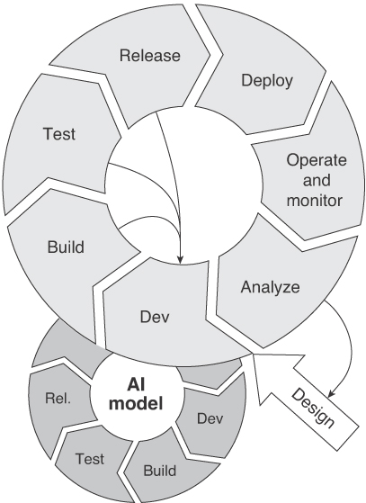
<figcaption><p><span id="ch01.xhtml#page_7"
class="pagebreak"></span><strong>Figure 1.2</strong> <em>Life-cycle
processes for engineering an AI system</em>.</p></figcaption>
</figure>

[Figure 1.2](#ch01.xhtml#ch01fig02) depicts the various processes
involved in the life cycle of engineering AI-based systems. There is an
initial design phase, where decisions about which functionalities will
be accomplished by the AI portion and which by the non-AI portion are
made. This phase is also where the software architecture of the system
is designed, with the designers aiming to meet the requirements and
goals for the system being constructed. The software architecture design
will embody the resource choices and, in turn, the resource requirements
for the total system. We discuss software architectures in [Section
2.1.2](#ch02.xhtml#ch02lev2sec02), "[Distributed Software
Architectures](#ch02.xhtml#ch02lev2sec02)."

The **model development** stage focuses on the selection, exploration,
training, and tuning of the AI models. It includes tasks such as model
selection, hyperparameter tuning, training, or fine-tuning and testing
the models to achieve optimal performance. The goal is to create a
well-performing and accurate model. The model can be developed in
parallel with the system development stage or before the system
development stage. Close []{#ch01.xhtml#page_8 .pagebreak}collaboration
between the teams involved in the non-AI development portion and the AI
model development can help to avoid problems and lead to a smoother
integration. We discuss this stage further in [Section
6.1](#ch06.xhtml#ch06lev1sec01), "[Design](#ch06.xhtml#ch06lev1sec01)."

The **Dev** stage involves performing normal development activities and
creating scripts for other activities related to the AI system. It
includes tasks such as developing additional functionalities (the non-AI
parts), optimizing performance, and ensuring compatibility with other
system components.

The **system build** stage focuses on creating executable artifacts for
the entire system. This involves transforming the system or its parts
into a deployable format that can be executed within the production
environment. Both the AI portion and the non-AI portion are integrated
and included in the executable artifact that is the output of the build
stage. We discuss this stage in [Section
6.3](#ch06.xhtml#ch06lev1sec03), "[Build](#ch06.xhtml#ch06lev1sec03)."

::: section
#### *1.3.1 Testing a System* {#ch01.xhtml#ch01lev2sec01 .h4}

After the system is built, it needs to be thoroughly tested utilizing
automated tests as much as possible. The **system test** stage involves
evaluating the system's performance, functionality, and reliability
through various testing techniques. The following types of testing are
often performed:

-   Regression testing

-   Smoke testing

-   Compatibility testing

-   Integration testing

-   Functional testing

-   Usability testing

-   Install/uninstall testing

-   Quality testing

Testing is covered in more detail in [Chapter 6](#ch06.xhtml#ch06),
while [Chapters 7](#ch07.xhtml#ch07)--[11](#ch11.xhtml#ch11) cover
specific qualities and how to test for them.

Once the system has been tested and approved, it can be released for
deployment. The **system release** stage involves finalizing the system
for deployment in the production environment and ensuring its readiness
for operation. This involves final quality gates, which may be automated
or include manual activities.
:::

::: section
#### []{#ch01.xhtml#page_9 .pagebreak}*1.3.2 Deploying a System* {#ch01.xhtml#ch01lev2sec02 .h4}

The next stage of the life cycle is **deployment**, which involves
moving the system into the production environment. This includes setting
up the necessary infrastructure, applying the configuration of the
system, and ensuring a smooth transition from the old version of the
production system to the new version.

Both the AI and non-AI portions of the system will be updated over time.
One strategy to install updates is to shut down the system for a period.
An alternative strategy is to perform live updating---that is, to
install the changes without shutting down the system. Either option
requires architectural support. The choice is a business decision, not a
technical one. Once the business decision has been made, then the
architecture must be designed to support it. We discuss these techniques
further in [Chapter 6](#ch06.xhtml#ch06).
:::

::: section
#### *1.3.3 Operating and Monitoring a System* {#ch01.xhtml#ch01lev2sec03 .h4}

Once the system is deployed, it enters the **operation and monitoring**
stage. During this stage, the system is executed, and measurements are
gathered about its operation. Measurements are gathered by monitoring
the system. Monitoring serves multiple purposes:

-   Determine whether the overall system is meeting its performance and
    availability goals.

-   Determine whether the AI portion is meeting its AI-specific quality
    goals.

-   Ensure sufficient resources are available for all parts of the
    system, and identify unnecessary (quantities of) resources that can
    be shut down.

-   Determine areas for improvement through redesign, code improvement,
    retraining, or other means.

The data provided to the monitoring system can be event, log, or metric
data from various components, or it could be input or output of an AI
model. In any case, the architecture should be designed to include such
a monitoring component, a process for creating and modifying the rules
used to generate alerts, and means to deliver the alerts to specified
locations.

The monitoring may be achieved in two different ways:

-   Instrumentation and an external system that periodically collects
    data from the various components of the system. The external
    component []{#ch01.xhtml#page_10 .pagebreak}will generate alerts
    based on a set of rules (e.g., if available disk space is critically
    low).

-   A dedicated portion of the system under construction.

One use of the monitoring system is to evaluate AI model performance in
production, and subsequently to trigger retraining, fallback, or other
adaptive mechanisms as necessary. AI models used from cloud providers
through APIs may be subject to varying performance or bandwidth
limitations that might cause the system's performance to deteriorate.
Such issues can be detected through monitoring, though fewer options are
available to address them at this point than when the AI model was
initially trained.

Based on insights from DevOps, we want to emphasize that the monitoring
mechanisms are designed into the architecture and implemented and tested
during the building of the system. They do not happen automatically.
Integrating them into the design of the system is easiest when the
specific monitoring requirements are known early on.
:::

::: section
#### *1.3.4 Analyzing a System* {#ch01.xhtml#ch01lev2sec04 .h4}

The final stage is to **analyze** the system's performance. This
involves displaying measurements taken during operation and monitoring,
and analyzing the data to gain insights into the system's behavior and
performance. This analysis can help identify areas for improvement and
guide future development efforts.

The life cycle depicted in [Figure 1.2](#ch01.xhtml#ch01fig02) presents
a bird's-eye view of the comprehensive set of processes for engineering
AI-based systems for people involved in the development, deployment, and
operation of such systems. These individuals may be architects,
developers, operators, or anyone in a blend of these roles.

Now we discuss the design stage in more detail.
:::
:::

::: section
### 1.4 Software Architecture {#ch01.xhtml#ch01lev1sec04 .h3}

Designing a software system means creating the architecture---that is,
creating a structure composed of system elements and relationships
between them to achieve the functional and quality goals for the system.
The architecture acts as a blueprint for the construction phase. As we
will see, the architecture is also used to allocate functionality to
components. Although the AI model depends on data, the architecture
provides the components []{#ch01.xhtml#page_11 .pagebreak}needed to
house the ML model but does not directly depend on the data. The
influences on the architecture are shown in [Figure
1.3](#ch01.xhtml#ch01fig03). They are the same quality attribute
requirements discussed in [Section 1.2](#ch01.xhtml#ch01lev1sec02),
"[Achieving System Qualities](#ch01.xhtml#ch01lev1sec02)"; the available
technologies, including the cloud; and the available resources.

<figure id="ch01fig03" class="figure">
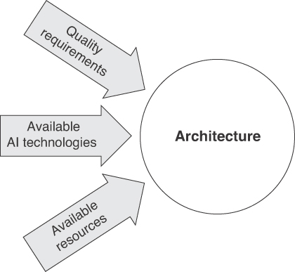
<figcaption><p><strong>Figure 1.3</strong> <em>Influences on the
architecture</em>.</p></figcaption>
</figure>

::: section
#### *1.4.1 The Role of the Architecture* {#ch01.xhtml#ch01lev2sec05 .h4}

The architecture of the system acts as the blueprint for its
construction. The architecture must:

-   Structure the system into several portions, such as components or AI
    models, and their respective relations.

-   Specify the allocation of the various portions of the system to the
    appropriate class of resource.

-   Allow for monitoring during operations and the generation of alerts
    in case an incident occurs.

-   Embody an update deployment strategy. If continuous deployment is a
    goal, then the architecture of the system must allow for the
    possibility of version skew (multiple different versions being
    simultaneously active).
:::

::: section
#### []{#ch01.xhtml#page_12 .pagebreak}*1.4.2 Quality Achievement* {#ch01.xhtml#ch01lev2sec06 .h4}

The architecture will determine the achievement of the quality attribute
goals that do not depend on the AI model. For each such quality
attribute, specific architectural techniques (called architectural
tactics) exist that support the achievement of that quality. These
techniques range from "redundancy" for availability to "caching" for
efficiency to "support user initiative" for usability.

To achieve a quality in an AI system requires not only the use of
architectural tactics, but also the application of different techniques
when preparing the training data. We elaborate on the data techniques in
[Chapters 7](#ch07.xhtml#ch07)--[11](#ch11.xhtml#ch11).
:::

::: section
#### *1.4.3 Resources* {#ch01.xhtml#ch01lev2sec07 .h4}

The system will operate on some collection of resources---including the
deployed AI portion. The AI model must be developed and trained prior to
deployment, which also uses resources. There are three categories of
resources:

-   **Local:** Laptops or desktop computer.

-   **Edge:** Smartphones or Internet of Things (IoT) devices. An edge
    device is limited in at least one respect, be it memory, processing
    power, battery capacity, or network bandwidth. An IoT device may be
    limited in all four, whereas a smartphone may be limited only in
    battery capacity. Sometimes, local computers might be considered
    part of the edge.

-   **Cloud:** Resources housed in a cloud, either public or private,
    but often in remote locations.

The system structure will be distributed. Some portions of it may
operate locally, some on edge devices, and some in remote locations.
Regardless, the various portions will communicate over a network. This
means the designer should have some understanding of networks, network
protocols, and messaging.

Furthermore, the AI models and the code will be packaged into some form,
often in containers or virtual machines for better scalability,
deployability, and dependency management. The containers and virtual
machines will be organized based on the software architecture. The cloud
provides mechanisms for the designer to run the AI portion and the
non-AI portion of the system, as well as a pipeline for AI model
training/updating if needed---whether from scratch or to use a hosted or
managed solution designed by the []{#ch01.xhtml#page_13 .pagebreak}cloud
provider. We discuss pipelines when we discuss model development in
[Chapter 5](#ch05.xhtml#ch05), [AI Model Life Cycle](#ch05.xhtml#ch05).

Most of these topics are covered in [Chapter 2](#ch02.xhtml#ch02),
[Software Engineering Background](#ch02.xhtml#ch02): resources,
networks, packaging, and software architectures for distributed systems.
We call out the resource allocation issues for the AI portion
separately, in the next section, since it depends on the AI techniques
used.
:::
:::

::: section
### 1.5 AI Model Quality {#ch01.xhtml#ch01lev1sec05 .h3}

As shown in [Figure 1.4](#ch01.xhtml#ch01fig04), the quality of an AI
model depends primarily on two factors: the data used for inferencing
and the type of AI model used. We will discuss these two factors next,
followed by the model development life cycle (the bottom-half circle in
[Figure 1.2](#ch01.xhtml#ch01fig02)).

<figure id="ch01fig04" class="figure">
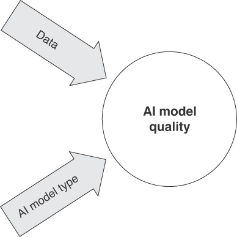
<figcaption><p><strong>Figure 1.4</strong> <em>Influences on the quality
of the AI model</em>.</p></figcaption>
</figure>

::: section
#### *1.5.1 Data* {#ch01.xhtml#ch01lev2sec08 .h4}

The definition of an AI system given earlier in this chapter states that
the system "infers" based on the input it receives. An AI system,
whether during the training of the AI model or at the time of inference,
will have to handle data from a myriad of sources. Possible input
sources include databases of all types, enterprise systems (such as
customer relationship management \[CRM\] and enterprise resource
planning \[ERP\] systems), web scraping, social media, public datasets,
and sensor data.

[]{#ch01.xhtml#page_14 .pagebreak}We begin by discussing the data used
for model inferencing and its preparation.

Regardless of the source of the data, it is likely to have problems.
Common problems include missing values, outliers, inconsistent data
formats, duplicate data, data quality issues, and unstructured data.
Problems in the data will impact the quality of the resulting model and
model output. Consequently, the data should be cleaned and organized to
accommodate the model chosen. Each of these problems is associated with
a collection of techniques to clean the data. Some of these techniques
are discussed in [Chapter 5](#ch05.xhtml#ch05).

In addition to data cleaning, the features of the data might be
improved. A feature is a property of a data point that is used as input
into an AI model. The process of improving the features is called
feature engineering. Techniques used in feature engineering include
encoding categorical features into numerical values and scaling the
features so that one feature does not dominate the model building
process. Again, we discuss this topic further in [Chapter
5](#ch05.xhtml#ch05).

Effectively managing the entire life cycle of AI and ML models requires
streamlined practices and tools. This is where MLOps comes into play.

```{=html}
<aside epub:type="sidebar" class="sidebar">
```
MLOps

The term *MLOps*, analogous to DevOps, encompasses the processes and
tools not only for managing and deploying AI and ML models, but also for
cleaning, organizing, and efficiently handling data throughout the model
life cycle.

```{=html}
</aside>
```
We elaborate on these processes in [Chapters
3](#ch03.xhtml#ch03)--[6](#ch06.xhtml#ch06), where we discuss selecting
an AI model, preparing it, and integrating it with the rest of the
system. Next, we consider the various types of AI models.
:::

::: section
#### *1.5.2 AI Model Types* {#ch01.xhtml#ch01lev2sec09 .h4}

A designer chooses to use an AI model when there is no good explicit
algorithmic solution for the problem they are trying to solve with the
system. The functionality of an AI model relies on two critical
components: the development of a knowledge base and the operation of a
computational engine. The computational engine, often referred to as the
inference engine or the deployed model, is responsible for processing
inputs and generating outputs based on the knowledge base.

[]{#ch01.xhtml#page_15 .pagebreak}The knowledge base is formed by either
human inputs or AI learning algorithms, which transform data into a
structured form. The knowledge base in this structured form can, for
example, be an ML model, a rule set, or an expert knowledge base. Once
the knowledge base is established and structured, the inference engine
utilizes it to make predictions, generate content, or achieve other
types of results. The AI portion of a system packages the inference
engine together with some representation of the knowledge base. The
important point of this discussion is that an AI portion is executable:
It can be invoked at runtime as a function or a service.

The AI model is based on one of two categories of AI techniques:
symbolic or non-symbolic. Symbolic AI is based on symbols, such as
logical statements or rules with variables; non-symbolic or sub-symbolic
AI is based on ML. A subcategory of ML-based systems is formed by
systems based on foundation models (FMs). These categories differ in how
knowledge is encoded in the knowledge base and how the inference engine
operates. [Chapter 3](#ch03.xhtml#ch03), [AI
Background](#ch03.xhtml#ch03), goes into much more detail about these
categories. [Chapter 4](#ch04.xhtml#ch04), [Foundation
Models](#ch04.xhtml#ch04), goes into detail about FMs. We provide a
short summary here to introduce the distinctions among these categories.

::: section
##### Symbolic AI {#ch01.xhtml#ch01lev3sec01 .h5}

Symbolic systems, also called Good Old-Fashioned AI (GOFAI), symbolic
AI, or expert systems, are sets of rules that are evaluated to produce
the value of a response or the value of an internal variable.

Suppose you wish to create an AI model that will predict which movie you
will choose in any particular context. In a symbolic AI model, the
developers might encode rules such as "If the user watched more than two
action movies in the past week, recommend another action movie" or "If
it is a sunny Saturday afternoon, suggest a warm family movie." With
enough rules, a symbolic AI model can reason over the knowledge base to
make a movie suggestion.

A rule is an if-then statement: If the specified condition is true, then
perform some activity. A set of such rules provides a filter through
which a result might be generated. These rules may be used for many
different purposes:

-   Diagnosis---medical, student behavior, or help desk--related.
    Example: If the user has version X of an application, some
    functionality will be unavailable.

-   Real-time process control. Example: If a storm is predicted to start
    in 10 minutes, close the outside blinds on the building.

-   []{#ch01.xhtml#page_16 .pagebreak}Risk assessment. Example: If the
    annual income is less than three times the annual mortgage payments,
    do not grant the home loan.

-   Executing business rules. Example: If the insurance claim exceeds
    \$2000, perform additional manual checks.

The set of rules constitutes the knowledge base for a symbolic system.
The rules are preprocessed by the computational mechanism, a rules
engine, to speed up the inference portion of a symbolic system. The
rules engine sorts through the preprocessed input to find matches with
the "if" portion of a rule. Modern systems can perform more
sophisticated processing than just filtering. The set of matches
constitutes a list of possible responses. If the list of matches has
multiple items, then additional input is required to determine a system
response. This input can come from a human or from a set of conflict
resolution rules. Large rule bases may have contradictory information,
and a rules engine can identify the conflicts for further analysis.
Rule-based systems are customized by modifying the list of rules.

Other types of symbolic AI models include planning and ontology
reasoning:

-   For planning, actions are described in terms of preconditions and
    effects. For example, consider a cloud control API, where one action
    would be to start a virtual machine (VM). The precondition is that
    the launch configuration (the image or other source from which to
    launch the VM) and the firewall settings have been defined; the
    effect is that a new VM is started with the specified firewall
    settings and from the respective launch configuration. AI planning
    takes such a description of possible actions as input, as well as a
    starting state and a desired goal state. The algorithm then creates
    a plan of actions to get from the start to the goal state.

-   Ontology reasoning, where concepts (e.g., medications, headache
    pills, vegetables, apples, tools, screwdrivers), their relations,
    and rules (every food and every medication has an expiration date)
    are defined. Based on this information, logic reasoning can be
    performed---for example, inferring that headache pills have an
    expiry date.
:::

::: section
##### Machine Learning {#ch01.xhtml#ch01lev3sec02 .h5}

Machine learning (ML) uses statistical techniques to generate results.
The training set for ML is the input to the training, which in turn
generates the []{#ch01.xhtml#page_17 .pagebreak}knowledge base. A data
value in the training set is labeled by a collection of variables.

A model is trained by identifying the features that characterize the
knowledge base and using those features, along with associated ML and
statistical techniques, to determine the model's parameters. A subclass
of ML, called deep learning, automatically identifies these features.
"Narrow" ML models are trained for a specific set of goals and
capabilities, which distinguishes them from the more general-purpose
FMs. Some of the main types of ML models are summarized here:

-   **Classification:** Assigning a category to an input (e.g., this
    picture contains a dog).

-   **Regression:** Inferring a continuous value instead of a discrete
    category (e.g., predicting that a particular insurance claims
    process will take three more days to complete).

-   **Clustering:** Grouping similar data points together without prior
    knowledge of the groups (e.g., the behavior of customers in this
    group seems similar).

ML models can be further customized by modifying the training set or the
training hyperparameters (e.g., how many clusters are we looking for?)
and regenerating the knowledge base.
:::

::: section
##### Foundation Model {#ch01.xhtml#ch01lev3sec03 .h5}

A foundation model (FM) is a type of ML model that leverages neural
networks as the core of its architecture. It differs from traditional ML
models in two key aspects:

-   It is trained on an extensive and diverse dataset, often comprising
    billions or even trillions of data points.

-   The training data is largely unlabeled, unlike in traditional ML,
    where data is typically structured, labeled, and often numerical or
    categorical.

The term *foundation* reflects the model's general-purpose nature, as it
is not trained for a specific task. Instead, it serves as a base model
that can be adapted to various specialized applications by incorporating
additional data and fine-tuning. This customization allows for
application-specific performance.

[]{#ch01.xhtml#page_18 .pagebreak}Large language models (LLMs) are a
type of FM. LLMs are trained on huge amounts of text. These models are
often generative, meaning they are capable of producing sequences of
text. The transformer architecture is the most commonly used ML model
architecture for building LLMs. OpenAI's GPT-3 and GPT-4
models^[5](#ch01.xhtml#ch01fn5){#ch01.xhtml#ich01fn5}^ are the most
well-known examples of LLMs, but open-source alternatives are also
available, including
Mistral^[6](#ch01.xhtml#ch01fn6){#ch01.xhtml#ich01fn6}^ and
Llama.^[7](#ch01.xhtml#ch01fn7){#ch01.xhtml#ich01fn7}^ To find a wide
variety of open-source LLMs and other pretrained AI models, you can
visit the model hub Hugging
Face.^[8](#ch01.xhtml#ch01fn8){#ch01.xhtml#ich01fn8}^

[5](#ch01.xhtml#ich01fn5){#ch01.xhtml#ch01fn5}. <https://openai.com/>

[6](#ch01.xhtml#ich01fn6){#ch01.xhtml#ch01fn6}. <https://mistral.ai/>

[7](#ch01.xhtml#ich01fn7){#ch01.xhtml#ch01fn7}. <https://llama.com/>

[8](#ch01.xhtml#ich01fn8){#ch01.xhtml#ch01fn8}.
<https://huggingface.co/>

FMs are customized or complemented through, for example, fine-tuning,
prompting, retrieval-augmented generation (RAG), and "guardrails" that
may preprocess input to and postprocess output from the FM and other
components. A guardrail serves as a safeguard to ensure the safe and
responsible use of AI technologies and prevent some attacks. It may
include strategies, mechanisms, and policies designed to prevent misuse,
protect user privacy, and promote transparency and fairness. RAG is also
a popular method of complementing FMs, whereby specific data that is
related to a request to an AI is retrieved and used to augment the input
to the model. The RAG data is often specific and private for a given
context (e.g., internal knowledge of a particular organization).
:::
:::

::: section
#### *1.5.3 Model Development Life Cycle* {#ch01.xhtml#ch01lev2sec10 .h4}

Once the model is developed, the next step is **model build**---that is,
building an executable artifact that includes the model or access to it.
If the model is included, this step involves transforming the model into
a deployable format that can be executed within the system. The model
build stage ensures that the AI model is ready for integration.

After the model is built, it needs to be thoroughly tested to assess its
accuracy and identify any potential risks or biases. The **model test**
stage involves evaluating the model's performance against predefined
metrics and criteria. It is important to ensure that the model operates
reliably and produces accurate results.

[]{#ch01.xhtml#page_19 .pagebreak}Once the model has been tested and
approved, it can be released for integration into the system. The
**model release** stage involves finalizing the model for deployment and
approving it for integration with other components of the system.
:::

::: section
#### *1.5.4 Resource Allocation for AI Parts* {#ch01.xhtml#ch01lev2sec11 .h4}

As mentioned earlier in the discussion of resources, the allocation for
the AI portion of the system depends on the AI techniques used. Resource
requirements for these different techniques depend on the technique
chosen.

-   **ML:** The training phase of an ML model is performed on either a
    local resource or a cloud resource---or in special cases, via
    edge/on-device learning. The resulting executable can be allocated
    to an edge resource, if small enough. Otherwise, it is allocated to
    either local or remote resources.

-   **FM:** An FM is typically hosted on cloud resources. Access can be
    through API calls or service message calls. Some FMs are trained for
    specific domains. If small enough, they can run on edge devices
    directly, such as phones or smart speakers, for real-time
    applications. Techniques for compressing or distilling FMs and
    reducing their resource requirements are a matter of ongoing
    research and will evolve over time. We discuss these techniques in
    [Chapter 4](#ch04.xhtml#ch04).
:::
:::

::: section
### 1.6 Dealing with Uncertainty {#ch01.xhtml#ch01lev1sec06 .h3}

Non-symbolic AI models are inherently probabilistic. In other words,
there is some probability (hopefully small) that the model output is
incorrect. Whether this is acceptable depends on your organization's
risk tolerance in terms of the system you are building. This
consideration leads to an increasing emphasis on AI risk assessment,
responsible AI, AI safety, standard conformance, and regulatory
compliance.

Because of the inherent uncertainty in AI systems, your organization
should conduct a risk assessment focused on the use of the system being
constructed. This risk assessment should look at human values and AI
safety, among other factors.

::: section
#### *1.6.1 Human Values* {#ch01.xhtml#ch01lev2sec12 .h4}

Some AI systems are unpredictable and autonomous. Their unpredictable
behavior necessitates that risk assessments must evaluate the impact, in
[]{#ch01.xhtml#page_20 .pagebreak}terms of both consequence and
likelihood, if these systems violate ethical behavior.

In [Chapters 7](#ch07.xhtml#ch07)--[11](#ch11.xhtml#ch11), we will focus
on key quality attributes, such as reliability, security, privacy, and
fairness. In any system, these qualities are balanced against one
another. Design decisions for a system must reflect system priorities
and tradeoffs should be explicitly considered.
:::

::: section
#### *1.6.2 Safety* {#ch01.xhtml#ch01lev2sec13 .h4}

Safety is an evolving concern in AI systems. Initially centered on
physical and psychological safety to individuals, AI safety now
encompasses concerns about AI systems with dangerous capabilities, such
as chemical, biological, radiological, and nuclear (CBRN) concerns;
misuse potential including cybersecurity, broader societal harms via
misinformation/disinformation at scale, AI controllability, and even
existential threats for humanity.

This change reflects that the meaning of safety is now more about the
severity of AI system risks rather than the types of risks. That is why
we have not included a chapter on AI safety, as we believe the
architectural and DevOps approaches to evaluating and achieving quality
attributes are the ultimate way to mitigate AI system risks and reduce
them to acceptable levels, given the risk appetite for an organization
or wider society.
:::
:::

::: section
### 1.7 Summary {#ch01.xhtml#ch01lev1sec07 .h3}

This book discusses AI engineering---the application of software
engineering to AI systems. AI systems are machine-based systems that use
AI in one or more of their components, but always include other, non-AI
components. Given that the overall quality of a system depends on all of
its parts and their interplay, it is important to practice AI
engineering well, with the aim of creating high-quality AI systems and
operating them effectively.

The quality of an AI system depends on three factors: the life-cycle
processes used, the software architecture, and the quality of the AI
model. The processes used help the designer detect errors---both logical
and in the model output---early in the development process.

The software architecture contributes to the achievement of one set of
quality attributes requirements; it does this through the use of
architectural tactics. The AI model used also contributes to the
achievement of quality attribute requirements; it does so through the
choice of model type, training data, and training algorithms. Data
preparation is important in ensuring []{#ch01.xhtml#page_21
.pagebreak}model quality. Data cleaning and feature engineering are two
aspects of data preparation.

Three types of AI models are symbolic models, narrow ML models, and
foundation models. FMs and narrow ML models are specialized types of ML
models. The probabilistic nature of AI models means an organization
should perform a risk assessment to determine the effects of incorrect
outputs of the AI models and AI systems.
:::

::: section
### 1.8 Discussion Questions {#ch01.xhtml#ch01lev1sec08 .h3}

1.  A definition should be inclusive (including what you wish to
    include) and exclusive (excluding what you do not wish to include).
    Critique the definitions of software architecture, DevOps, AI
    systems, and AI engineering using this criterion.

2.  What does your cloud provider charge for different types of
    resources and services? How do you think that affects the design of
    the system?

3.  Ask your favorite LLM to describe the differences between it and its
    competitors. What do you think of the responses?
:::

::: section
### 1.9 For Further Reading {#ch01.xhtml#ch01lev1sec09 .h3}

You can read more about software architecture in *Software Architecture
in Practice* by Len Bass, Paul Clements, and Rick Kazman \[[Bass
22](#ref.xhtml#ref6)\]. The definition of software architecture we use
can be found on page 2.

You can read more about DevOps in *DevOps: An Architect's Perspective*
by Len Bass, Ingo Weber, and Liming Zhu \[[Bass 15](#ref.xhtml#ref8)\].
The definition of DevOps that we use can be found on page 4.

The book *Deployment and Operations for Software Engineers* by Len Bass
and John Klein \[[Bass 19](#ref.xhtml#ref7)\] goes into detail about the
life cycle.

A general introduction to AI concepts can be found in *Hands-On Machine
Learning with Scikit-Learn, Keras, and TensorFlow* by Aurélien Géron
\[[Géron 22](#ref.xhtml#ref19)\].

You can read more about responsible AI in *Responsible AI: Best
Practices for Creating Trustworthy AI Systems* by Qinghua Lu, Liming
Zhu, Jon Whittle, and Xiwei Xu \[[Lu
23A](#ref.xhtml#ref31)\].[]{#ch01.xhtml#page_22 .pagebreak}
:::
:::
:::

[]{#ch02.xhtml}

::: {#ch02.xhtml#book-content}
::: {#ch02.xhtml#sbo-rt-content}
## []{#ch02.xhtml#page_23 .pagebreak}*2* {#ch02.xhtml#ch02 .h2}

## *Software Engineering Background* {.chap_ttl}

*You can't build a great building on a weak foundation. You must have a
solid foundation if you're going to have a strong superstructure*.

---Nelson Rockefeller

B[EFORE DIVING INTO]{.smallcaps} AI engineering, it is necessary to have
a solid background in various aspects of distributed computing, DevOps,
and MLOps. We provide this background in this chapter. Feel free to skip
or skim the parts with which you are familiar, but note that we often
connect the background information with its implications for AI systems.
We cover the following topics in this chapter:

-   Distributed computing, including software architecture and interface
    styles

-   Background information on DevOps in general

-   Background information on MLOps, particularly before the
    foundational model era

::: section
### 2.1 Distributed Computing {#ch02.xhtml#ch02lev1sec01 .h3}

AI systems often require substantial computational resources and
efficient data handling, which makes distributed computing a natural fit
for them. We are assuming your AI system will be deployed in a cloud
environment, either public or private, as that approach provides the
ability to dynamically allocate resources based on demand. While we
acknowledge the importance of mobile, edge, and in-car deployments, they
are not the focal points or the []{#ch02.xhtml#page_24 .pagebreak}main
examples in this book. A system deployed in the cloud is, by definition,
a distributed system. In other words, it consists of multiple services,
each deployed on distinct host machines. One service communicates with
other services by means of messages. Services implement functions,
albeit possibly only one.

::: section
#### *2.1.1 Virtual Machines and Containers* {#ch02.xhtml#ch02lev2sec01 .h4}

Cloud computing is heavily based on the concept of **virtualization**.
In virtualization schemes, virtual resources (such as virtual machines)
are provided to cloud customers on top of physical resources,
abstracting from the latter and adding flexibility.

A virtual machine (VM) is a software construct that exposes various
resources (e.g., CPU, memory, disk, and network connection) to the
loaded software, making it appear to the loaded software as if it were
executing on a physical computer. A VM runs its own operating system
(OS) internally, and is externally under the control of a specialized
operating system called a hypervisor. A physical computer can host
multiple VMs, each with its own internal operating system. [Figure
2.1](#ch02.xhtml#ch02fig01) depicts this structure.

<figure id="ch02fig01" class="figure">
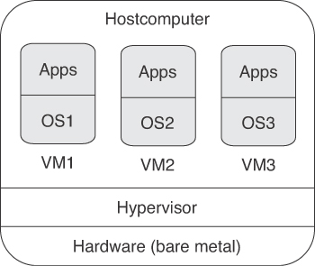
<figcaption><p><strong>Figure 2.1</strong> <em>VMs under the control of
a hypervisor</em>.</p></figcaption>
</figure>

VM images can be large, and transferring VM images around the network is
time-consuming, as is initializing them once they have reached their
destination. Containers are a mechanism to maintain the advantages of
virtualization---isolation of actions inside one container from other
containers---while reducing image transfer time and startup time. A
container is an executable image that packages a service and its
dependent libraries, and that runs under the control of a container
engine. Container engines use several Linux []{#ch02.xhtml#page_25
.pagebreak}features to provide isolation. Linux control groups set
resource utilization limits, and Linux namespaces prevent a container
from seeing other containers.

Reexamining [Figure 2.1](#ch02.xhtml#ch02fig01), we see that a VM
executes on virtualized hardware under the control of the hypervisor. In
[Figure 2.2](#ch02.xhtml#ch02fig02), we see several containers operating
under the control of a container engine, which in turn is running on top
of a fixed OS. In essence, containers run on a virtualized OS. Just as
all VMs on a physical host share the same underlying physical hardware,
all containers share the same OS kernel---and through the OS, they share
the same underlying hardware. The host OS can be loaded onto either a
bare-metal physical machine or a VM. [Figure 2.2](#ch02.xhtml#ch02fig02)
shows containers running on top of a runtime engine. In [Chapter
6](#ch06.xhtml#ch06), [System Life Cycle](#ch06.xhtml#ch06), we advocate
serving your ML model in a container.

<figure id="ch02fig02" class="figure">
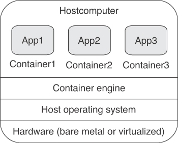
<figcaption><p><strong>Figure 2.2</strong> <em>Containers running on top
of a runtime engine</em>.</p></figcaption>
</figure>

::: section
##### Messaging {#ch02.xhtml#ch02lev3sec01 .h5}

A message is a collection of information from one function within a
service that is passed over a network to a function within another
service. The recipient of a message is typically identified by an
Internet Protocol (IP) address and a port number contained within the
message. Each service is assigned an IP address when it is deployed.
Each function within a service listens on the port(s) of its choosing
(typically just one port).

[Table 2.1](#ch02.xhtml#ch02tab01) shows how the messages over a typical
network are layered. Each layer in this table serves a different
purpose, and the message in a higher layer is encapsulated as data in a
lower layer. Each layer uses its own headers and formatting for its
respective purposes. The Datalink layer transmits messages over a
physical network. The Internet layer delivers messages
[]{#ch02.xhtml#page_26 .pagebreak}to the correct VM or container,
relying on one or more physical networks. The Transport layer delivers
messages to services within the VM or container. The Application layer
provides protocols that allow specific application types (such as email
or web content) to interact. On this basis, the communicating systems
actually interpret the messages.

<figure id="ch02tab01" class="table">
<table class="all">
<thead>
<tr class="header">
<th class="border"><p>LAYERS</p></th>
<th class="border"><p>TYPICAL PROTOCOLS</p></th>
</tr>
</thead>
<tbody>
<tr class="odd">
<td class="border"><p>Application</p></td>
<td class="border"><p>HTTP, IMAP, LDAP, DHCP, FTP</p></td>
</tr>
<tr class="even">
<td class="border"><p>Transport</p></td>
<td class="border"><p>TCP, UDP, RSVP</p></td>
</tr>
<tr class="odd">
<td class="border"><p>Internet</p></td>
<td class="border"><p>IPv4, IPv6, ECN, IPsec</p></td>
</tr>
<tr class="even">
<td class="border"><p>Datalink</p></td>
<td class="border"><p>Ethernet, ATM, DSL, L2TP</p></td>
</tr>
</tbody>
</table>
<figcaption><p><strong>Table 2.1</strong> <em>Layers of the
Internet</em></p></figcaption>
</figure>

A message meant for a function typically relies on Terminal Control
Protocol/Internet Protocol (TCP/IP). The header of the IP layer is used
to specify the IP addresses of both the sender and the recipient, which
tells the internet infrastructure where to deliver the message. An IP
message contains a payload formatted for TCP. The TCP formatting
provides port information---for both the sender and the recipient. In a
simplified version of today's reality, the IP address tells the system
which service to deliver the message to, and the TCP port indicates
which function in that service is the target. The TCP payload is
formatted using an Application layer protocol. Frequently, it is
formatted with HTTP, although other protocols can also be used. The HTTP
message might say, "GET me path /index.html" or "PUT (store) the
following JSON content as order number XYZ." GET and PUT are HTTP verbs;
we will discuss them later in this chapter, in the "Representational
State Transfer (REST)" section.
:::

::: section
##### The Cloud and Scaling {#ch02.xhtml#ch02lev3sec02 .h5}

One service offered by a cloud provider is autoscaling. Suppose, for
example, that Service A is packaged as a VM and deployed into the cloud.
Now imagine that Service A becomes very popular. The autoscaling
capabilities of the cloud can be used to automatically create a new
instance of Service A and route half of the messages to the original
instance and half to the new instance. This requires the use of a load
balancer to route the messages, but succeeds in halving the load on the
original instance.

[]{#ch02.xhtml#page_27 .pagebreak}Autoscaling is based on a collection
of rules, such as "Create a new instance if an existing instance is more
than 80% utilized for a 15-minute period." The autoscaling rules are a
portion of the instructions given to the cloud to deploy the VM.
Autoscaling not only creates new instances, but also switches off
(terminates) instances that are no longer needed, thereby lowering
costs.

Because AI models are deployed as services, they need to be scaled, just
as other elements of the system need to be scaled. Scaling rules must be
provided as a portion of the deployment specification for the AI models.
:::

::: section
##### Discovery {#ch02.xhtml#ch02lev3sec03 .h5}

Typically, a service is deployed onto a physical computer at the
discretion of the cloud management system. This means that if Service A
wishes to communicate with Service B, it must discover the location (IP
address) of Service B. This process is called discovery. The discovery
mechanism will vary depending on whether the service is packaged as a VM
or a container.
:::

::: section
##### VM Discovery {#ch02.xhtml#ch02lev3sec04 .h5}

If Service A is packaged as a VM, then its location can be discovered by
using either a global or a local Domain Name System (DNS). The global
DNS is available to the entire internet, whereas a local DNS has more
limited exposure (e.g., within a single organization). Regardless of the
scope, a DNS operates like a phone book. You pass it the name (URL) of
the service to which you wish to send a message, and it returns an IP
address. You can then use that IP address to send a message to the
specified service.

Although in principle you could use DNS for containers as well as VMs,
DNS is not designed for rapid creation and deletion of its contents.
Containers are created and deleted relatively quickly, so a different
mechanism must be used for their discovery. This brings us to the topic
of container orchestration.
:::

::: section
##### Container Orchestration {#ch02.xhtml#ch02lev3sec05 .h5}

Consider the role of the conductor in an orchestra. The conductor plays
no instrument. Instead, they are responsible for choosing the players,
arranging them on the stage, setting the tempo, cuing the various
sections of the orchestra, and making sure that the various players have
an appropriate copy of the score.

[]{#ch02.xhtml#page_28 .pagebreak}This is not a bad analogy for
container orchestration. An orchestration system contains no containers
but manages a container's life cycle, including the following
procedures:

-   **Provisioning:** Preparing the environment for the containers,
    including network, storage, and compute resources.

-   **Deployment:** Locating a host with spare capacity and placing
    containers there.

-   **Discovery:** Providing the means for services to find each other
    and for users to find services.

-   **Scaling:** Dynamically adjusting the number of instances of a
    service to meet demand.

-   **Load balancing:** Distributing incoming requests across multiple
    instances of a service to ensure optimal resource utilization and
    response times.

An orchestration system is a portion of the container runtime engine.
Because the orchestration system manages deployment and scaling, it
knows the relationship between a container's name and the address of the
instances of that container. This relationship is maintained in a
discovery container, which allows for quick look-up as well as efficient
creation and deletion of containers. When a new instance of a container
is created or an old instance is deleted, the discovery container is
updated accordingly. Multiple discovery containers can coexist, each
containing only the names and addresses used by a particular container.
For example, suppose Container A utilizes some collection of other
containers. The discovery container for Container A can be limited to
just those containers with which Container A interacts. The discovery
container will have entries for each instance of containers stored
within it; in turn, the autoscaling process for containers is
responsible for updating the relevant discovery containers.

VMs, containers, and container orchestration frameworks provide the
necessary infrastructure for deploying and scaling AI models. A part of
the AI model development process focuses on packaging the model for
execution. Thus, from the point of view of the infrastructure, there is
nothing special about an AI model: It is treated just like any other VM
or container.
:::
:::

::: section
#### *2.1.2 Distributed Software Architectures* {#ch02.xhtml#ch02lev2sec02 .h4}

An architectural style provides a framework for the detailed design of a
system. It specifies the component types and the types of connections
allowed []{#ch02.xhtml#page_29 .pagebreak}between them. In this section,
we discuss three architectural styles that are widely used in
distributed computing: client-server architecture, service-oriented
architecture, and microservice architecture.

::: section
##### Client-Server Architecture {#ch02.xhtml#ch02lev3sec06 .h5}

The client-server style dates from the early 1980s, when networks became
commonplace. With this approach, a server provides services
simultaneously to multiple distributed clients. The most common example
is a web server providing information to multiple simultaneous users of
a website. In client-server architecture, there are two component
styles---clients and servers---and multiple clients for a single server
(though clients nowadays interact with multiple servers for tasks as
simple as loading a website). Communication is initiated by a client
using a discovery service to determine the location of the server. The
client sends requests to the server, and the server responds in turn.

Adopting a client-server architecture has the following implications for
AI systems:

-   **AI model training:** In a client-server setup, the server can
    handle intensive AI model training tasks, leveraging powerful
    computational resources. The client, typically hosted on a less
    resource-intensive host or mobile system, can request training or
    retraining of models and receive updates upon completion, or it can
    conduct some limited local/on-device training.

-   **AI model deployment:** For AI model inference, the server hosts
    the trained model, especially large models, and responds to client
    requests---for example, with predictions or analysis. This
    separation is useful for applications like mobile apps or web
    services, where the client lacks the computational power to carry
    out complex AI computations.

-   **Wider AI system:** The client-server architecture is simple and
    effective for straightforward AI systems. However, it might become a
    bottleneck for more complex systems due to its centralized nature,
    which can lead to scalability and resilience issues.
:::

::: section
##### Service-Oriented Architecture {#ch02.xhtml#ch02lev3sec07 .h5}

The concept of service-oriented architecture (SOA) emerged in the late
1990s. Such an architecture consists of a collection of distributed
components that []{#ch02.xhtml#page_30 .pagebreak}provide and/or consume
services. In addition, an SOA may contain a service registry, an
infrastructure component that implements discovery for consumers.
Service providers register with the registry so that the consumers can
communicate with them.

In SOAs, providers and consumers are stand-alone entities and are
deployed independently. Components have interfaces that describe the
services they request from other components and the services they
provide. Communication among the services can be performed by using the
service registry, which is then responsible for discovery and for
translating among the various representations. Services can be
implemented heterogeneously, using whatever languages and technologies
are most appropriate.

Today, SOAs are still used to integrate various stand-alone systems.
Sometimes an SOA system is called a *system of systems*. Suppose your
organization is a bank that has just acquired another bank. You now have
two copies of loan management software, fraud detection software, and
account management software. Each of these systems has its own user
interface and process assumptions. You can use SOA to manage the
integration by creating a uniform database for accounts and loans. The
databases are then attached to the service registry, and the other
systems are attached to the service registry. A format conversion
service is used to translate from the original bank-specific formats to
and from the new uniform database format.

SOAs were influential in the emergence of microservice architecture
(discussed in the next subsection). In particular, concepts such as
independent deployment and independence of technology in microservices
derived from SOA principles.

SOAs have the following implications for AI systems:

-   **AI model training:** In SOA, AI model training can be encapsulated
    as a service. This modular approach allows for the integration of
    different AI model training/updating components as services within
    an enterprise architecture, supporting scalability, federation, and
    flexibility.

-   **AI model deployment:** AI models deployed as services in an SOA
    can be accessed by various consumer applications. This setup
    facilitates the reuse of AI capabilities across multiple
    applications and platforms.

-   **Wider AI systems:** SOA is particularly beneficial for large
    organizations with existing enterprise systems. It allows AI
    capabilities to be integrated as services within these systems,
    supporting interoperability and efficiency in processes.
:::

::: section
##### []{#ch02.xhtml#page_31 .pagebreak}Microservice Architecture {#ch02.xhtml#ch02lev3sec08 .h5}

Around 2002, Amazon promulgated the following rules for its developers.
Although the term *microservices* came later, the core concepts of the
microservice architecture trace back to these
rules:^[1](#ch02.xhtml#ch02fn1){#ch02.xhtml#ich02fn1}^

[1](#ch02.xhtml#ich02fn1){#ch02.xhtml#ch02fn1}.
<https://gist.github.com/chitchcock/1281611>, accessed 2024-04-10

-   All teams will henceforth expose their data and functionality
    through service interfaces.

-   Teams must communicate with each other through these interfaces.

-   There will be no other form of inter-process communication allowed:
    no direct linking, no direct reads of another team's data store, no
    shared-memory model, no backdoors whatsoever. The only communication
    allowed is via service interface calls over the network.

-   It doesn't matter what technology they \[services\] use.

-   All service interfaces, without exception, must be designed from the
    ground up to be externalizable, ready to be exposed to developers
    outside of your organization. An application of this rule is to
    treat all requests as possible attacks leading to placing security
    controls within APIs.

The basic packaging unit in the microservice architecture is a service.
Services are independently deployable. One implication of independent
deployment is that the presence of a service and its current location
must be dynamically discovered. This is typically done using container
orchestration mechanisms, as discussed in the previous section.

Although not inherent in the definition of this architecture, a
microservice is intended to perform only a single function. You can
visualize it as a packaging mechanism for a method. Although this
visualization is not strictly accurate, it helps when you think about
what to place in a microservice. A system designed around a microservice
architecture will consist of many small services that act in a
coordinated manner to provide the system's functionality. In fact,
Amazon's home page directly uses upwards of 140 services, and these call
an even larger number of downstream services. Netflix has more than 800
microservices.

Microservice architectures have the following implications for AI
systems:

-   **AI model training:** Microservices architecture may allow for the
    decentralization of AI model training. Each microservice can be
    responsible []{#ch02.xhtml#page_32 .pagebreak}for different
    aspects/stages of training, each independently scalable, such as
    data preprocessing, feature extraction, and model training.
    Microservices also naturally support federated learning, which
    enhances agility and continuous deployment.

-   **AI model deployment:** Deploying AI models as individual
    microservices makes it easier to update and scale them
    independently, without affecting the entire system. This is useful
    for dynamic environments where individual models need frequent
    updates to support complex business logic.

-   **Wider AI systems:** The microservices architecture is highly
    scalable and flexible, making it suitable for complex, distributed
    AI systems. It supports the development of loosely coupled services
    that can be developed, deployed, and scaled independently, fostering
    innovation and rapid iteration.

Microservices architecture, while offering scalability and increased
development efficiency for decoupling teams, has been criticized for its
maintenance complexity. Managing numerous small services increases
operational overhead, which creates challenges in ensuring consistency,
handling inter-service communication, and managing individual
configurations.
:::
:::

::: section
#### *2.1.3 Interface Styles* {#ch02.xhtml#ch02lev2sec03 .h4}

Many styles for interfaces between components of distributed systems are
available. The two styles most commonly used in today's AI-based systems
are GraphQL,^[2](#ch02.xhtml#ch02fn2){#ch02.xhtml#ich02fn2}^ for edge
communication (unintuitively, given the name), and REST, for, well, the
rest of the communication links (though that is not where it got its
name). We begin with REST.

[2](#ch02.xhtml#ich02fn2){#ch02.xhtml#ch02fn2}. <https://graphql.org>

::: section
##### Representational State Transfer (REST) {#ch02.xhtml#ch02lev3sec09 .h5}

As the internet and the World Wide Web grew in the late 1990s, it was
not practical to have a custom client for every service on the web. The
REST interface style is an approach that matured in parallel with work
on the HTTP/1.1 protocol. It allows very loose coupling between clients
and services. REST is widely used for interfaces to models in ML
systems.

The key elements of REST are as follows:

-   []{#ch02.xhtml#page_33 .pagebreak}The requests are stateless. That
    is, there is no assumption in the protocol that the server retains
    any information from one request to the next. Every request must
    contain all the information necessary to act on that operation,
    which means requests contain a lot of information. Alternatively,
    the client and the service provider can agree where the necessary
    state will be maintained.

-   The information exchanged is textual---that is, services and methods
    are accessed by name. The web, from its inception, was designed to
    be heterogeneous, not only across different computer systems but
    also across different binary representations of information.

-   REST fundamentally centers on resources, conceptualized as nouns
    (e.g., *user*, *product*), emphasizing the state and representation
    of these entities. This approach differs from the action-oriented
    focus on functions or verbs seen in SOA and traditional web
    services. It prioritizes entity manipulation over specific
    operations, offering a more standardized interaction model.

-   REST restricts the methods, or functions/verbs, to a small set, with
    the most important ones being POST, GET, PUT, and DELETE. These map
    into the data management concept of CRUD: Create (and initialize),
    Read, Update, and Delete. A REST request identifies the resource or
    type to which the operation should be applied, and a request or
    response contains a data element with arguments or results. REST
    requires that this element be self-describing by labeling it with an
    internet media data type (or MIME type) so that any client knows how
    the data can be interpreted.

Strictly speaking, the REST architecture style does not specify the
mechanism for sending messages from the client to the service. However,
as noted earlier, the HTTP/1.1 protocol evolved as the first
implementation of REST. Practitioners have found no need to create other
implementations, so today, REST and HTTP are essentially synonymous.

As REST's impacts on AI model training, deployment, and integration
suggest, this approach both complements and differs from SOA and
microservices. Earlier protocols and standards developed for SOA were
often complex and verbose, whereas REST provides a more streamlined and
web-native method of integration. This makes REST particularly well
suited for the integration of AI models in web-based applications and
services. Moreover, while the microservices architecture focuses on
breaking down an application []{#ch02.xhtml#page_34 .pagebreak}into
small, independently deployable services, REST hones in on how these
services communicate. It doesn't dictate the service size or scope, but
rather emphasizes a uniform and stateless interface for interactions.
This statelessness of REST is particularly apt for AI scenarios, as it
allows for scalable interactions with AI models without maintaining
session state, which enables AI services to rapidly scale and handle
large numbers of concurrent requests.
:::

::: section
##### GraphQL {#ch02.xhtml#ch02lev3sec10 .h5}

GraphQL was developed to support mobile applications with limited
bandwidth. Contrary to what you might intuitively think given the name,
it does not primarily serve the purpose of querying graphs. GraphQL
originated in Facebook around 2012. It became an open-source project in
2015. Currently, GraphQL compilers exist in multiple languages.

In GraphQL, a providing service exposes an explicit definition of its
interface. The elements in the interface are strongly typed. The
providing service has a runtime engine that takes as input a query in
the GraphQL query language and returns a response containing the data
requested in the query.

The client sends a query in the GraphQL query language. This query is
embedded in a procedure-like call to an interface exposed by the GraphQL
providing service. An explicit schema on the client side defines which
values the client wishes to see. In addition, there is a schema compiler
specific to the language in which the client is written, and a runtime
library that performs the actual transmission of messages.

The main benefit of GraphQL is that the client defines the structure of
the requested data. By comparison, in REST, the providing service
defines this structure. Accordingly, only the data the client requests
is sent when GraphQL is used. The providing service does not send large
amounts of data that the client does not need, avoiding the effort
needed to receive and parse that unneeded data.

In AI systems, this is useful for different services, as one service can
use GraphQL to pull only the data it requires from another service
(reducing bandwidth). It also offers benefits for architectures that
extend to edge devices with more limited compute power, battery
capacity, and bandwidth. For instance, a translation app on a mobile
phone might recognize that its user is traveling in Japan and needs
Japanese vocabulary and translation related to transport, food, drinks,
and accommodation---a relatively small subset of the whole language.
With suitable interfaces, the app could pull only the relevant
vocabulary and AI models/model parts from the server.

[]{#ch02.xhtml#page_35 .pagebreak}The main drawback of GraphQL is that
the set of supported queries must be predefined. With REST, the client
can retrieve a dataset and parse it as it chooses. Thus, ad hoc queries
over a dataset can be better supported with REST than with GraphQL.
:::
:::
:::

::: section
### 2.2 DevOps Background {#ch02.xhtml#ch02lev1sec02 .h3}

DevOps gained traction in the mid-2010s, and today more than 80% of all
companies developing software apply this approach. DevOps was first
motivated by the observation that developers and operators have
contradictory goals: Developers aim to add functionality and
improvements to software fast, whereas operators traditionally have to
ensure availability and robustness of software in production. Given that
newly developed code tends to contain more bugs and cause more downtime
than old code that has stood the test of time and years of usage, the
two goals were inherently contradictory---until DevOps came along.

Paraphrasing the definition mentioned in [Chapter 1](#ch01.xhtml#ch01),
[Introduction](#ch01.xhtml#ch01), DevOps is a set of practices to get
new code into production fast, but without compromising quality. If
quality is high, robustness and availability do not suffer from frequent
releases, hence resolving the contradiction. How does DevOps achieve
that? Through cultural, organizational, and technological means.

In terms of culture, it starts by getting devs and ops to talk to each
other and by assigning the shared goal (low time to production and high
quality) to both groups. Organizational means include cutting down the
number of meetings or synchronous communication required before a change
can be implemented or rolled out. This favors the microservices
architecture style, which consequently leads to small teams of devs and
ops. Other organizational means include the enforcement of a single
deployment process, such that quality can be ensured for each and every
change, and assigning ops responsibilities to developers for components
that are under active development, so as to enable a fast resolution of
problems.

Technological means include at least the following strategies:

-   Automation of build, test, and deployment activities, particularly
    in the context of continuous integration, delivery, and deployment.
    This enables fast feedback to developers, who can fix a bug they
    introduced a few minutes earlier much easier than if the feedback
    arrived weeks []{#ch02.xhtml#page_36 .pagebreak}later. It also
    enables automatic, repeatable quality assurance, and fast deployment
    if the quality gates are passed.

-   Infrastructure as Code (IaC) for reliably and consistently
    generating environments with tested parameters and configuration.
    This, too, enables quality assurance: Infrastructure code that has
    been tested in testing environments is less likely to cause issues
    in production.

-   Version control for anything that might change with management
    practices that aim at high quality (e.g., repeatability and
    traceability), which allows for finding and correcting the sources
    of bugs and other undesirable behavior faster. This includes
    application and infrastructure code, as well as test cases and
    configuration parameters. We will see this technique again when we
    discuss practices associated with MLOps.

-   Microservices architectures, in which different microservices
    interact only through defined interfaces. If done right, this
    enables a level of independence in the deployment of new versions of
    services and a reduced need for large meetings or other forms of
    synchronous communication between members of different teams.

-   A single deployment process with automated quality gates. Any
    change, whether in application code, infrastructure code, or other
    configuration parameters, must pass the requisite number or
    percentage of tests before being deployed into production.

These technological means were enabled by the use of IaC.

::: section
#### *2.2.1 Infrastructure as Code* {#ch02.xhtml#ch02lev2sec04 .h4}

Automation is a key portion of DevOps practices. Automation is
manifested as a combination of tools and scripts. These tools and
scripts manipulate both the code and models being developed and the
infrastructure that supports the creation and operation of an executable
from that code or model. These scripts are given the collective title of
Infrastructure as Code (IaC).

The name IaC is intended to convey that the scripts should be treated as
code. In other words, they should be tested, version controlled, and
shared just as code is tested, version controlled, and shared. In fact,
the system's life cycle applies to IaC just as well.

One source of errors for deployed systems is inconsistency in software
in the environments used by developers. If Developer 1 uses one version
of an OS and Developer 2 uses another version, then errors may appear
when []{#ch02.xhtml#page_37 .pagebreak}integrating the output of the two
developers. This is equally true for other portions of the life cycle.
If the test environment is different from the development environment,
or if the production environment differs significantly from the
development and test environments, then errors due to inconsistency may
occur. This issue also arises with AI model training, evaluation, and
deployment environments.

Inconsistencies among environments can go deeper than just operating
system versions. Different versions of libraries can be inconsistent in
terms of their behavior or even their interfaces. Different choices for
configuration parameters can introduce errors as well. That being said,
your environments should differ in some details, such as the credentials
for accessing the production databases. Such credentials should be
accessible to only those staff who absolutely must have them, and should
not be shared with the whole company.

IaC is used to prevent accidental inconsistencies. A script for
provisioning the elements of an environment can be shared among all
developers and operators. The created elements will be identical for all
developers (except for the credentials and such). If the environment
must be updated, the script is modified, checked into a version control
system, and shared with all developers. Each developer then executes the
new script and has a copy of the new environment. Because the script is
version controlled, it is possible to recreate older elements if
necessary to make a repair to an older version being used in production.

This example demonstrates what is meant by treating the scripts as code.
The descriptions of sharing programming language code among developers
and retaining older versions for error repair are the same whether the
subject is IaC scripts or application program code.

One class of tools is used to provision the software included in the
resources of an environment. Such tools can be independent of the target
platform, such as Vagrant or Docker, or they can be specific to a
particular platform, such as Cloud Formation or Azure Resource Manager.
Another type of tool creates the resources in the environment. Terraform
is a popular example of such a tool.

The state of AI practice is still developing, particularly in regard to
automation and configuration management. Unlike traditional software
systems, AI systems often lack a standardized "AI makefile" that
describes and manages all aspects of the model development and
deployment process. Inconsistency and inefficiency can arise, impacting
the reliability and []{#ch02.xhtml#page_38 .pagebreak}reproducibility of
AI models. Some initial efforts have been made to address these
challenges, such as DVC^[3](#ch02.xhtml#ch02fn3){#ch02.xhtml#ich02fn3}^
and ZenML.^[4](#ch02.xhtml#ch02fn4){#ch02.xhtml#ich02fn4}^

[3](#ch02.xhtml#ich02fn3){#ch02.xhtml#ch02fn3}. <https://dvc.org/>

[4](#ch02.xhtml#ich02fn4){#ch02.xhtml#ch02fn4}.
[www.zenml.io/](http://www.zenml.io/)

::: section
##### Best Practices {#ch02.xhtml#ch02lev3sec11 .h5}

The best practices for IaC are the same as those for code.

-   Scripts are checked into the version control system. This allows
    both sharing of the scripts with team members and retrieving past
    versions of the scripts while troubleshooting.

-   Scripts are scanned for security issues. Just as code can be
    inspected automatically and manually to determine conformance to
    security practices, IaC can be examined both manually---through
    inspections---and automatically---through scanning tools---to
    determine conformance to security practices. An example is creating
    a VM in the cloud without specifying access parameters.

-   Scripts are tested and reviewed for correctness, security, and
    compliance. Again, as with code, various review practices can be
    applied to scripts, and they should be tested prior to being placed
    into production.

-   Credentials are retrieved from a credential store, whose content is
    specific to the environment. IaC scripts may, for example, refer to
    the customer database endpoint and credentials. The values returned
    in production will allow access to the production database, whereas
    the values in a test environment point to a test version.
:::

::: section
##### Benefits of IaC {#ch02.xhtml#ch02lev3sec12 .h5}

IaC offers some clear benefits:

-   **Decreased costs for repetitive tasks:** Repetitive tasks can be
    invoked with one command.

-   **Reduced input errors:** Manual human input is subject to errors,
    especially for repetitive tasks.

-   []{#ch02.xhtml#page_39 .pagebreak}**Reduced errors caused by
    inconsistency:** If all developers have the same development
    environment (created by a provisioning script), then errors during
    integration will be reduced.

-   **Portability:** IaC enables applications and services to be moved
    between different environments without worrying about compatibility
    issues.

-   **Traceability:** Every change to the infrastructure is captured in
    version control, providing a clear audit trail of who made changes,
    which changes were made, and when they were made.

-   **Reliability:** By using tested and version-controlled scripts,
    teams can ensure that the infrastructure is deployed in a reliable
    and repeatable manner.
:::

::: section
##### Costs of IaC {#ch02.xhtml#ch02lev3sec13 .h5}

Writing and using scripts is not free. Some of the costs are highlighted
here:

-   **Scripts must be developed:** The initial development takes time
    and skills.

-   **Additional initial complexity:** Setting up your tools and
    environments with credentials stores is initially more complex than
    creating environments manually. However, if done right, it can save
    a lot of effort and pain down the line.

-   **Scripts must be tested and reviewed:** Tests for correctness must
    be developed, and reviewers will spend time performing their
    reviews.

-   **Scripts must be updated when tools or processes are modified:** As
    with other forms of software, the first version of a product that is
    used is almost never the last version. Scripts must be updated, and
    the new versions tested.
:::

::: section
##### Idempotence {#ch02.xhtml#ch02lev3sec14 .h5}

Something is idempotent if applying it twice yields the same result as
applying it once. A simple example from mathematics is the identity
function, or multiplication with zero. A DevOps example is a deployment
command that always sets the target environment to the same
configuration, regardless of the environment's starting state.

[]{#ch02.xhtml#page_40 .pagebreak}If an IaC script is idempotent, then
the current state of the infrastructure will not affect its execution.
So, for example, it could be scheduled to execute at periodic intervals
without any concern for the state of the system when it is executed.
Idempotence is achieved either by automatically altering an existing
target as needed, or by discarding the existing target and recreating a
fresh environment.

Scripts should be written to be idempotent. In fact, testing idempotence
can be one of the test cases for a script. Achieving idempotence and
repeatability can be challenging for model development pipelines due to
the nondeterministic nature of the training process. Factors such as
model initialization, data shuffling, and the stochastic nature of some
training algorithms can lead to slightly different models with the same
training data and training algorithm.
:::

::: section
##### Infrastructure Drift {#ch02.xhtml#ch02lev3sec15 .h5}

Suppose you've deployed five instances of a service via IaC with the
default 128 MB of memory. When you examine them, however, you find that
three of them use 256 MB.

How did this happen? Perhaps someone noticed instances had poor
efficiency and increased the memory allocation. Of course, there might
be other explanations. People do not always follow processes or rules.

Is this bad? Suppose poor efficiency of these instances is subsequently
noticed. Is the source one of the smaller memory instances or one of the
larger memory instances? The responder must determine which is the
culprit since it will affect the response. This is an example of
infrastructure drift.

Infrastructure drift occurs when the state of your infrastructure is
different from the state generated by your IaC. It will not occur if all
infrastructure changes are performed through the IaC rather than done
directly on the infrastructure.

Infrastructure drift is a common enough problem that tools have appeared
to scan the existing infrastructure and compare it to the specification
in the IaC. Open-source tools to check for this issue include Snyk and
Driftctl.

Notably, infrastructure drift can cause security problems. For example,
suppose someone is having an access problem and changes the Identity and
Access Management (IAM) setting to make access easier. Depending on how
it was changed, the new setting may open a system to unauthorized usage.
[]{#ch02.xhtml#page_41 .pagebreak}One possible strategy to mitigate such
issues is to disallow direct access to operational servers in general.
:::
:::

::: section
#### *2.2.2 DevOps Processes* {#ch02.xhtml#ch02lev2sec05 .h4}

Now we turn to DevOps processes. [Figure 2.3](#ch02.xhtml#ch02fig03)
depicts the various DevOps processes in non-AI systems, their logical
order, and common "shortcuts" in the life cycle. It starts with design
and initialization, which includes the architectural groundwork and
setting up automation scripts to support the subsequent processes. The
initialization is the "on-ramp" into the cycle, which continues with
development, building, testing, release (possibly automated) as approval
for deployment, operation, and finally monitoring and analysis. The
build, test, and release phases include quality gates---in case a
committed version of the code does not meet the required quality, we
return to development. We elaborated on the life cycle in [Chapter
1](#ch01.xhtml#ch01), and more details will follow in [Chapter
6](#ch06.xhtml#ch06).

<figure id="ch02fig03" class="figure">
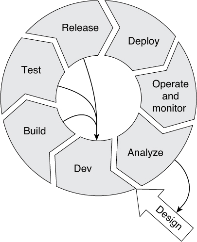
<figcaption><p><strong>Figure 2.3</strong> <em>The main DevOps processes
in non-AI systems</em>.</p></figcaption>
</figure>

[]{#ch02.xhtml#page_42 .pagebreak}With these practices, DevOps has made
it possible to combine the two opposing goals discussed earlier---and
hence its widespread adoption in practice. DevOps is most easily applied
in cloud-native web applications. In other contexts, such as embedded,
defense, or medical systems, adaptation of the usual DevOps processes is
necessary because updating a system in such contexts may be more
difficult, especially in the face of heavy-weight certification
processes.
:::
:::

::: section
### 2.3 MLOps Background {#ch02.xhtml#ch02lev1sec03 .h3}

Before the advent of foundation models (FMs) and generative AI,
traditional machine learning (ML) was on a steady rise in production
systems. However, the integration of ML into robust, traceable, and
reliable production systems often lacked structured methodologies. This
gap led to the development of machine learning operations (MLOps), aimed
at applying DevOps principles to the ML life cycle. MLOps has a narrower
focus than AI engineering, as discussed in [Chapter
1](#ch01.xhtml#ch01). MLOps here refers to the activities related to the
AI model. It prioritizes data governance and model life-cycle
management, and aims to strengthen the links between data scientists, ML
engineers, and operations teams.

MLOps includes some distinctive practices:

-   **Data versioning and management:** Ensuring that datasets are
    version-controlled, and hence that their use is reproducible.

-   **Experiment tracking:** Logging experiments to compare results and
    build on successful models from such experiments.

-   **Lineage tracking:** Tracking the provenance of individual data
    items. This makes it possible to know the source of data items, how
    they were modified, and how they were used.

-   **Model versioning:** Keeping track of different iterations of ML
    models to ensure reproducibility.

-   **Model training and retraining:** Training linked to experiment
    tracking and data versioning; continuously improving models by
    retraining them with new data.

-   **Model deployment:** Streamlining the process of deploying models
    into production environments.

-   **Model performance monitoring:** Evaluating models in production to
    ensure they perform as expected.

[]{#ch02.xhtml#page_43 .pagebreak}[Figure 2.4](#ch02.xhtml#ch02fig04)
shows how MLOps fits into the broader DevOps landscape depicted in
[Figure 2.3](#ch02.xhtml#ch02fig03). We elaborate on MLOps in [Chapter
5](#ch05.xhtml#ch05), [AI Model Life Cycle](#ch05.xhtml#ch05).

<figure id="ch02fig04" class="figure">
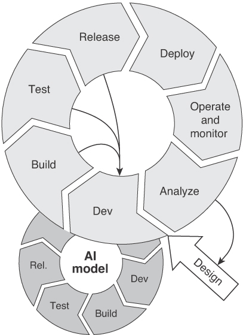
<figcaption><p><strong>Figure 2.4</strong> <em>MLOps included in the
DevOps process shown in <a href="#ch02.xhtml#ch02fig03">Figure
2.3</a></em>.</p></figcaption>
</figure>

A contentious issue within MLOps is whether models should be dynamically
updated in production using data created from productive use of the
system or observed during operation. Proponents argue that this ensures
models are current and responsive. Critics (including us) caution that
bypassing the established deployment pipeline could compromise quality.

Given its focus, MLOps is geared toward settings in which a model is
trained based on data that is available to the organization. In the age
of generative AI and FMs, this is no longer the typical case---unless
you work at one of the big AI labs, it is unlikely that you are tasked
to train an FM. But even if that is your job, the core characteristic of
FMs is their independence from specific applications. So, either you
train an FM or you train a model for a specific application or fine-tune
an existing FM. If you choose to fine-tune an []{#ch02.xhtml#page_44
.pagebreak}FM with application-specific data, the process may be similar
to traditional ML, and MLOps practices may be sufficient for your
purposes. We elaborate on the ways to customize FMs for specific
applications in [Chapter 4](#ch04.xhtml#ch04), [Foundation
Models](#ch04.xhtml#ch04).

But recall our original argument from [Chapter 1](#ch01.xhtml#ch01): The
behavior of your AI system comes from the AI and the non-AI parts. So,
even if MLOps is sufficient for your AI components, there is a broader
picture to consider---and hence you should continue reading this book.
:::

::: section
### 2.4 Summary {#ch02.xhtml#ch02lev1sec04 .h3}

Distributed computing is the basis of modern computing environments such
as the cloud. A distributed system consists of a collection of
independent components, which are packaged as either VMs or containers.
They communicate using messages and must discover the location of a
message recipient using a discovery mechanism such as DNS or functions
within container orchestration.

Components can be automatically scaled using the cloud infrastructure or
the container orchestration infrastructure. Scaling, in this case, means
creating (or terminating) multiple instances of a component and using a
load balancer to distribute messages to the running instances.

Commonly used software architectures for distributed systems include
client-server architecture, service-oriented architecture, and
microservices architecture.

REST is a style for interfaces that treats the provider as a data
provider with restricted operations (PUT, GET, POST, and DELETE).
GraphQL^[5](#ch02.xhtml#ch02fn5){#ch02.xhtml#ich02fn5}^ is a variant of
REST that requires the client to explicitly specify the information
desired in a reply. That approach reduces communication costs, which is
particularly useful for edge devices.

[5](#ch02.xhtml#ich02fn5){#ch02.xhtml#ch02fn5}. <https://graphql.org/>

Traditional DevOps and MLOps are complementary sets of processes to
manage development, deployment, and operations throughout the software
development life cycle. Both use IaC as a means for achieving repeatable
and consistent practices.

MLOps focuses on preparing the model for execution. DevOps focuses on
taking various executable pieces and integrating them, testing them,
deploying them, and operating them. One set of those executable pieces
[]{#ch02.xhtml#page_45 .pagebreak}comes from MLOps. In this book, we
focus on AI engineering and the integration of MLOps into DevOps for the
whole system.
:::

::: section
### 2.5 Discussion Questions {#ch02.xhtml#ch02lev1sec05 .h3}

1.  One motivation for using containers is that they are faster to
    transfer over the network than VMs. What are estimates of transfer
    times for VMs and containers over a fast network?

2.  How do microservices architectures support independence of
    technology between one service and another?

3.  Look up MLFlow (<https://mlflow.org/>). What kinds of tools are
    available within MLFlow?
:::

::: section
### 2.6 For Further Reading {#ch02.xhtml#ch02lev1sec06 .h3}

Much of the non-AI-specific material in this chapter comes from
*Deployment and Operations for Software Engineers* by Len Bass and John
Klein \[[Bass 19](#ref.xhtml#ref7)\].

You can read about MLOps in *Hands-On Machine Learning with
Scikit-Learn, Keras, and TensorFlow* by Aurélien Géron \[[Géron
22](#ref.xhtml#ref19)\].

REST was first documented in a PhD thesis by Roy Fielding \[[Fielding
00](#ref.xhtml#ref16)\], which can be found at
<https://ics.uci.edu/~fielding/pubs/dissertation/fielding_dissertation.pdf>.[]{#ch02.xhtml#page_46
.pagebreak}
:::
:::
:::

[]{#ch03.xhtml}

::: {#ch03.xhtml#book-content}
::: {#ch03.xhtml#sbo-rt-content}
## []{#ch03.xhtml#page_47 .pagebreak}*3* {#ch03.xhtml#ch03 .h2}

## *AI Background* {.chap_ttl}

*All \[AI\] models are wrong, but some are useful*.

---George Box

*. . . particularly LLMs*.

---Ingo Weber

I[N THIS CHAPTER]{.smallcaps}, we introduce the foundational concepts of
AI, with a particular emphasis on model selection and preparation
required for training these models.

Models are ubiquitous in both science and engineering. But, as George
Box noted, they are always inaccurate. The inaccuracy stems from the
abstraction embodied in a model. Many details are not included in any
model, and this lack of detail both facilitates reasoning about the
behavior of the entity being modeled and serves as a cause of error. In
an AI system, the choice of the AI techniques is one of the most
important design decisions. It has a major influence on the quality
attributes of the system. In this chapter, we describe a variety of AI
models and their uses. Choosing a model is a step in the pretraining
analysis. A second step before training the model is setting the
parameters that control the training.

In [Chapter 1](#ch01.xhtml#ch01), [Introduction](#ch01.xhtml#ch01), we
identified two categories of AI techniques: **symbolic AI** and
**non-symbolic AI**. The latter, which is also known as sub-symbolic AI,
refers to AI techniques based on **machine learning (ML)** and other
methods that do not rely on explicit symbolic representations. ML models
can be subdivided into those trained on labeled data (supervised
learning), those trained on unlabeled data (unsupervised learning), and
those trained using self-supervised learning, where models generate
their own labels. **Foundation models (FM)** are trained on massive
amounts of unlabeled data, allowing them to learn broad patterns and
representations. However, the []{#ch03.xhtml#page_48 .pagebreak}training
process typically involves self-supervised learning. That is, existing
words are masked, and the model learns to predict the masked words (a
form of self-generated label), followed by fine-tuning with supervised
learning using high-quality labeled instruction-following datasets.

We also identified the types of problems for which the different types
of models are appropriate. In addition, [Chapter 1](#ch01.xhtml#ch01)
identified the necessity for an inference engine to use the model in a
computer system.

In this chapter, we elaborate on the process of selecting a model and
preparing it for training. The major topics covered are model selection
(including the different types of models used in AI systems) and
preparation of these models for training. We defer the discussion of
training the models until [Chapter 5](#ch05.xhtml#ch05), [AI Model Life
Cycle](#ch05.xhtml#ch05).

::: section
### 3.1 Terminology {#ch03.xhtml#ch03lev1sec01 .h3}

Some terms specific to ML models are used in this chapter:

-   Learning may be supervised, unsupervised, or self-supervised. In
    **supervised learning**, the training process uses labeled data,
    where each input in the training set is paired with a corresponding
    label, allowing the algorithm to learn the relationship between the
    input and the target variable it is meant to predict. In
    **unsupervised learning**, the data is not labeled, and the
    algorithm identifies patterns or structures in the data without
    predefined labels. **Self-supervised learning** is a variant in
    which the model generates its own labels from the data, such as
    predicting masked portions of input data, enabling it to learn
    useful representations without needing manually labeled data.

-   The data used to train an ML model is, typically, divided into three
    subsets: the training set, the validation set, and the test set. The
    **training set** is the primary data used to train the model. The
    model learns and sets its parameters/weights based on the training
    set. The **validation set** is used to ensure that the model is
    sufficiently general. Once the model has processed the training set
    and set its parameters/weights, the validation set is used to ensure
    that the model performs well with unseen data. The **test set** is
    used to evaluate a trained model.

-   **Overfitting** means that the model gives accurate predictions for
    training data but not for new data. It can occur because not enough
    data was used to train the model or because the data used to train
    did not accurately reflect the characteristics of the real-world
    data from which the model will make predictions. **Underfitting** is
    the reverse.

-   []{#ch03.xhtml#page_49 .pagebreak}A **loss function** measures how
    well the predictions of the model vary from reality.

-   An **F1 s**core is a measure of precision (accuracy) and recall
    (true positivity rate) for ML models.
:::

::: section
### 3.2 Selecting a Model {#ch03.xhtml#ch03lev1sec02 .h3}

The first step in selecting a model involves choosing the appropriate
model category, which may be based on either the nature of the problem
or the characteristics of the solution. Different categories or types of
models can be applied to the same problem, with each offering distinct
advantages and tradeoffs. The three primary categories we use are
symbolic and rule-based models, data-driven ML models, and FMs. FMs are
a specialized type of ML model but deserve their own distinct category
due to their unique capabilities and scale. Within each category,
various model types exist, and these will be explored after discussing
the categories themselves.

::: section
#### *3.2.1 Selecting a Category* {#ch03.xhtml#ch03lev2sec01 .h4}

::: section
##### When to Use Symbolic AI Models {#ch03.xhtml#ch03lev3sec01 .h5}

As symbolic AI makes decisions based on predefined rules, it is highly
interpretable and effective in domains with well-defined rules. However,
it is challenging for symbolic AI models to fully consider the data in
real-world scenarios, especially given the complexity and variability of
the real world. When dealing with unexpected situations, these models
cannot easily adapt and struggle to make inferences due to their
reliance on predefined rules. Furthermore, symbolic AI models face
scalability issues in complex, real-world scenarios. As the complexity
of a task rises, the number of rules increases exponentially, making the
knowledge base hard to maintain and prone to failure.

With this background in mind, you should use a symbolic AI model if your
problem has the following characteristics:

-   The problem domain is well understood. A well-understood domain will
    have clear and relatively stable rules.

-   The scope that the rules cover is well defined. Domains that can be
    characterized by a few hundred rules are appropriate for rule-based
    AI systems. If the number of rules required grows into the
    thousands, []{#ch03.xhtml#page_50 .pagebreak}the system becomes
    complex and maintaining consistency among the rules becomes
    difficult.

-   Explainability is a high-priority quality. Rule-based models enable
    particular outputs to be traced back to the rules that generated the
    output.

-   Strict adherence to regulations or guidelines is required.
    Regulations and guidelines are usually edited and reviewed
    carefully. This makes them easily translatable to the input for a
    rule engine.
:::

::: section
##### When to Use ML Models {#ch03.xhtml#ch03lev3sec02 .h5}

A large number of problems do not fit the characteristics of symbolic
AI. ML models may be more appropriate for these problems. The following
characteristics make a problem suitable for an ML model:

-   You have large amounts of data available. The individual data items
    can be identified by values of a set of variables. ML models rely on
    statistics to analyze data and provide a result. Enough data must be
    available so that the statistical techniques will produce reasonable
    results.

-   The structure of the data is sufficiently complex that a human
    cannot analyze the data without assistance.

-   The desired system task is one of the following:

    -   Forecasting (predicting future values based on historical data)

    -   Classification (categorizing data into predefined groups)

    -   Anomaly detection (identifying unusual patterns that do not
        conform to expected behavior)

    -   Clustering (grouping similar data points together)

We elaborate on these tasks later in this chapter.

Many platforms are available that provide the ability to train ML
models. Some examples are highlighted here:

-   **Cloud-based services:** Amazon
    SageMaker,^[1](#ch03.xhtml#ch03fn1){#ch03.xhtml#ich03fn1}^ Microsoft
    Azure Machine
    Learning,^[2](#ch03.xhtml#ch03fn2){#ch03.xhtml#ich03fn2}^ Google
    Vertex AI Platform,^[3](#ch03.xhtml#ch03fn3){#ch03.xhtml#ich03fn3}^
    IBM Watson Studio^[4](#ch03.xhtml#ch03fn4){#ch03.xhtml#ich03fn4}^

    [1](#ch03.xhtml#ich03fn1){#ch03.xhtml#ch03fn1}.
    <https://aws.amazon.com/pm/sagemaker/>

    [2](#ch03.xhtml#ich03fn2){#ch03.xhtml#ch03fn2}.
    <https://azure.microsoft.com/en-us/products/machine-learning/>

    [3](#ch03.xhtml#ich03fn3){#ch03.xhtml#ch03fn3}.
    <https://cloud.google.com/vertex-ai>

    [4](#ch03.xhtml#ich03fn4){#ch03.xhtml#ch03fn4}.
    [www.ibm.com/products/watson-studio](http://www.ibm.com/products/watson-studio)

-   []{#ch03.xhtml#page_51 .pagebreak}**Software platforms:** SAS Visual
    Forecasting,^[5](#ch03.xhtml#ch03fn5){#ch03.xhtml#ich03fn5}^
    RapidMiner,^[6](#ch03.xhtml#ch03fn6){#ch03.xhtml#ich03fn6}^
    KNIME^[7](#ch03.xhtml#ch03fn7){#ch03.xhtml#ich03fn7}^

    [5](#ch03.xhtml#ich03fn5){#ch03.xhtml#ch03fn5}.
    [www.sas.com/en_us/software/visual-forecasting.html](http://www.sas.com/en_us/software/visual-forecasting.html)

    [6](#ch03.xhtml#ich03fn6){#ch03.xhtml#ch03fn6}.
    <https://altair.com/altair-rapidminer>

    [7](#ch03.xhtml#ich03fn7){#ch03.xhtml#ch03fn7}.
    [www.knime.com/](http://www.knime.com/)

-   **Open-source platforms:**
    TensorFlow,^[8](#ch03.xhtml#ch03fn8){#ch03.xhtml#ich03fn8}^
    PyTorch,^[9](#ch03.xhtml#ch03fn9){#ch03.xhtml#ich03fn9}^
    scikit-learn^[10](#ch03.xhtml#ch03fn10){#ch03.xhtml#ich03fn10}^

    [8](#ch03.xhtml#ich03fn8){#ch03.xhtml#ch03fn8}.
    [www.tensorflow.org/](http://www.tensorflow.org/)

    [9](#ch03.xhtml#ich03fn9){#ch03.xhtml#ch03fn9}.
    <https://pytorch.org/>

    [10](#ch03.xhtml#ich03fn10){#ch03.xhtml#ch03fn10}.
    <https://scikit-learn.org/stable/index.html>
:::

::: section
##### When to Use FMs {#ch03.xhtml#ch03lev3sec03 .h5}

The term *FM* typically refers to the initial, base model that is
trained. This base model is trained on a vast and diverse dataset, with
the aim of learning a wide range of language patterns and general
knowledge. The key characteristics of FMs are their scale (in terms of
both the model size and the data they are trained on) and their
generality (meaning they do not specifically target particular tasks or
domains at this stage).

In most cases, you will likely want to adapt an existing FM, as opposed
to training your own FM. To achieve such adaptation, the FM can undergo
further fine-tuning processes using labeled data specific to the task
for which you are constructing the system. These subsequent models,
which are adapted or specialized for specific tasks or applications, are
generally not referred to as FMs, but rather as "fine-tuned models,"
"adapted models," or "task-specific models."

The set of existing FMs is rapidly expanding. Some categories of
existing models are highlighted here:

-   **Language models:** Used for text generation, translation, question
    answering and human learning processes, code generation, reasoning,
    and factual language understanding.

-   **Vision models:** Used for understanding the relationship between
    text and images, image classification, retrieval, captioning, object
    detection, and image generation.

-   **Audio models:** Support tasks involving sound, such as speech
    recognition, music generation, and audio classification.

-   []{#ch03.xhtml#page_52 .pagebreak}**Video models:** Specialized to
    handle tasks such as video classification, (human) action
    recognition, and video generation.

-   **Multimodal models:** Trained on multiple or all of the preceding
    types of data simultaneously. As a result, they can perform tasks
    related to multiple modalities, such as summarizing a text with
    figures, or generating a document (like this chapter) that includes
    figures and text.

-   **Domain-specific models:** Combine lots of data from a particular
    domain, such as biology, and can serve as the basis for various AI
    applications in that domain. An example is a protein structure
    model.
:::
:::

::: section
#### *3.2.2 Choosing a Model Type* {#ch03.xhtml#ch03lev2sec02 .h4}

The actual model type that you will use depends on the specific problem
you wish to solve. As symbolic systems are sets of rules grounded in
specific domains, you would use a symbolic system when you can construct
such a set of rules.

ML models can be broadly classified based on their specific purposes,
including classification, regression, and clustering. Recall that ML
models are trained on labeled data. We begin by discussing
classification.

::: section
##### Classification {#ch03.xhtml#ch03lev3sec04 .h5}

Classification models are used to classify data into predefined classes
based on different values of the independent variables (features). The
training dataset should contain labeled data, sufficiently represent the
problem, and include a substantial number of examples for each class
label. Depending on the number of classes, there are two main types of
classification:

-   **Binary classification:** This involves assigning one of two
    possible classes to a piece of data. A common example is email spam
    detection, where the classification model determines whether an
    email is spam by examining specific email features, such as the
    sender's email address, the nature of links contained in the email,
    and the email's subject line.

-   **Multi-class classification:** This refers to assigning a data
    point to a class out of three or more possible classes. An example
    is classifying a detected animal into one of many species, such as
    tigers, giraffes, zebras, or elephants. This is achieved by
    analyzing various distinguishable features of the animals, including
    their body shape, size, color patterns, type of fur, and tail
    length, among others.

```{=html}
<aside epub:type="sidebar" class="sidebar1">
```
[]{#ch03.xhtml#page_53 .pagebreak}Classification versus Prediction

Classification algorithms can be used for prediction---that is,
statements about future events before they happen. While writing this
book, we read various other texts and came across many occurrences where
"predicting a class" is used to refer to "assigning a class." However,
we believe that to be a widespread inaccuracy. Suppose we have a binary
image classification algorithm, whose output is either "hotdog" or "no
hotdog." This is clearly not about the future: The hotdog is either in
the picture or not in the picture. Unless the image is changed, there is
no aspect of predicting future appearances of hotdogs in static images.

In large parts of the ML literature, "predicting" appears to refer to a
model's ability to infer the class of new, unseen data, and not to
forecast future events. However, the appearance of a class label is not
a future event that actually takes place in most instances. Consider the
example of the binary image classification algorithm once more. After
the ML model classified it as "hotdog," will a human being manually
label the image, assign the "true" label, and thereby create the event
that was "predicted"? Sometimes that might happen, but in most cases it
will not.

To avoid confusion, it is advisable to use the term *prediction*
strictly for cases that involve actual future events or forecasting.
When referring to the output of a classification model, terms like
*class assignment* and *classification* are more accurate and should be
preferred.

```{=html}
</aside>
```
Although the terms are often used interchangeably, "predicting a class"
should not be confused with "assigning a class" (see the nearby box).
Prediction implies a forecast about future events, whereas
classification deals with labeling existing data. However,
classification can be predictive, such as when estimating the likelihood
of a hurricane based on current satellite imagery.

Classification is widely used in various applications, including the
following:

-   **Email spam detection:** Differentiate between spam and legitimate
    emails.

-   **Image and speech recognition:** Understand visual images and
    spoken languages.

-   []{#ch03.xhtml#page_54 .pagebreak}**Facial recognition**: Identify
    individuals based on their facial features.

-   **Sentiment analysis:** Analyze textual data to identify emotional
    tones and public opinions.

-   **Customer segmentation:** Group customers with similar
    characteristics for targeted marketing and sales strategy.

-   **Bank loan approval:** Classify loan applications into different
    risk categories.

-   **Drugs classification:** Categorize drugs based on their
    properties, uses, and side effects.

-   **Cancerous cells identification:** Detect cancerous cells in
    medical images.

If you have settled on a classification task, you can choose among
several common types of classification algorithms. Some of them are
profiled here.

::: section
###### K-*Nearest Neighbors (KNN)* {#ch03.xhtml#ch03lev4sec01 .h6}

KNN classifies a given data point by first identifying the *k* nearest
data points in the training dataset and then assigning the majority
class among these neighbors to this data point. The distance between the
data point and every other data point in the dataset is measured using a
distance metric. For example, Euclidean distance is a distance metric
used to measure the straight-line distance between two data points in a
multidimensional space.

KNN is simple and a good choice for problems where the decision boundary
is irregular. It is often used in image recognition, recommendation
systems, and anomaly detection.
:::

::: section
###### *Logistic Regression* {#ch03.xhtml#ch03lev4sec02 .h6}

Logistic regression is an ML algorithm that is used for binary
classification problems. It creates a linear equation that combines
features of a data point, with each feature being assigned a specific
weight based on its importance. A sigmoid function is used to transform
the linear output into a probability between 0 and 1. Based on this
probability, logistic regression makes the binary classification
decision, often using a threshold of 0.5 to determine the class to which
the data point belongs. If the predicted probability is 0.5 or higher,
for example, the model predicts Class 1. If the predicted probability is
less than 0.5, the model predicts Class 0.

[]{#ch03.xhtml#page_55 .pagebreak}Logistic regression is a good choice
for binary and multi-classification problems where the relationship
between input features and the target variable is approximately linear.
It is often applied in credit scoring, medical diagnosis, and marketing
prediction.
:::

::: section
###### *Decision Tree* {#ch03.xhtml#ch03lev4sec03 .h6}

The decision tree algorithm uses a---surprise!---tree data structure,
which is composed of internal nodes, branches, and leaf nodes. Each
internal node represents a decision point based on a feature, and each
branch denotes the decision rules that link one node to another. The
leaf nodes represent the various classes.

To construct a decision tree, the process starts with the entire
training dataset at the root and is recursively divided into subsets
based on the values of a specific feature and a corresponding threshold.
A given data point is classified by traversing from the root to a leaf
node, following the path determined by the feature values of the data
point.

A decision tree is simple to understand and interpret. It is often used
in customer segmentation, loan approval, and fraud detection.
:::

::: section
###### *Random Forest* {#ch03.xhtml#ch03lev4sec04 .h6}

To create a forest, multiple decision trees are combined, with the aim
of improving performance in classification tasks. Given the multiple
individual classifiers (i.e., trees), the random forest algorithm is a
type of ensemble learning. Each tree is constructed from a random subset
of the training dataset and a random subset of features. The algorithm
ensures that the trees are trained on distinct subsets. The randomness
results in diversity, reducing the risk of overfitting and improving the
model's robustness. For a given data point, each tree in the forest
independently votes for a class. The final class assigned to the data
point is the one with the most votes from all the trees in the forest.

The random forest algorithm is a good choice for problems with complex
relationships and high dimensionality, such as sentiment analysis,
biological data classification, and customer churn prediction.
:::

::: section
###### *Naïve Bayes* {#ch03.xhtml#ch03lev4sec05 .h6}

The naïve Bayes algorithm is a classification algorithm based on Bayes'
theorem. It makes an assumption that all features are independent of
each other []{#ch03.xhtml#page_56 .pagebreak}given the class. Naïve
Bayes first examines a training dataset containing data points with
features and known class labels. It then calculates the prior
probabilities (how often each class appears in general) and the
conditional probabilities (how often each feature appears within each
class) using the training data. When given a new data point with an
unknown class, this algorithm calculates the probability of it belonging
to each possible class, assuming those features are independent.
Finally, it assigns the data point to the class with the highest
calculated probability.

The naïve Bayes algorithm is effective when you are dealing with
high-dimensional data. It is a good choice for text classification
problems, such as spam detection and sentiment analysis.
:::

::: section
###### *Support Vector Machine (SVM)* {#ch03.xhtml#ch03lev4sec06 .h6}

SVM is designed to find the optimal hyperplane that splits the data
points into different groups, maximizing the space between the
hyperplane and the nearest data points from each group, known as support
vectors. When classifying a given data point, SVM uses its feature
values to determine the data point's position relative to the
hyperplane. This allows SVM to assign the data point into a particular
class based on which side of the hyperplane it falls.

SVM is a good choice for problems where the classes are separable with a
clear margin, such as image classification and handwriting recognition.
:::

::: section
###### *Neural Network* {#ch03.xhtml#ch03lev4sec07 .h6}

A neural network is a web of interconnected nodes. Each node takes in
information from its connected neighbors, performs a simple calculation,
and then sends its own output to other nodes. This flow of information
through the network allows it to learn and make predictions. The network
processes data using artificial neurons, structured into multiple
layers, including an input layer, one or more hidden layers, and an
output layer. Information, such as an image or a sentence, is first fed
into the input layer of the network. Each piece of information becomes a
value that goes into one of the nodes. The hidden layers are the heart
of the network, with multiple layers often being stacked on top of each
other. Each node in a hidden layer receives inputs from several nodes in
the previous layer, performs a weighted calculation on those inputs, and
then produces its own output. These weights become the parameters that
are adjusted during training.

[]{#ch03.xhtml#page_57 .pagebreak}Eventually, the outputs from the last
hidden layer reach the output layer. This layer produces the final
result of the network, which could be a classification (e.g., cat or
dog), a prediction (e.g., next word in a sentence), or any other desired
output. During training, the network starts with weights and biases that
are randomly set. The training dataset, which consists of known
input--output pairs, is fed into the network. During forward
propagation, the data passes through the layers. Each neuron computes an
output based on its weighted inputs and biases. The output of a node is
not passed on directly. Instead, it first goes through an activation
function, which adds a bit of nonlinearity to the network. This allows
the network to learn more complex patterns and relationships in the
data. The difference between the predictions and actual labels is
measured using a loss function, which indicates how much the model needs
to improve. Back-propagation involves calculating the gradient of the
loss function and using this information to adjust weights and biases to
reduce the error. Stochastic gradient descent (SGD) is an optimization
algorithm that is often used for making these adjustments. The learning
rate controls the update magnitude during the optimization process.

This process is repeated over multiple epochs, enabling the network to
iteratively learn and refine its weights and biases, which gradually
improves the model's accuracy. For prediction, a new given data point
transverses the network using the learned weights and biases, starting
from the input layer, then progressing through the hidden layers, and
finally reaching the output layer. The output layer often uses a softmax
function to convert the outputs into class probabilities. The class with
the highest probability is selected as the final prediction.

Neural networks can model complex nonlinear relationships and are
scalable to large datasets. They are often used in speech recognition,
natural language processing, and image classification.
:::
:::

::: section
##### Regression {#ch03.xhtml#ch03lev3sec05 .h5}

Unlike classification, which focuses on discrete categories, regression
involves training a model using a labeled dataset to predict continuous
outputs. As a result, this technique is useful for estimating
relationships between variables and predicting numerical values, such as
forecasting house prices.

Regression is used in various applications, including the following:

-   **Economic trend analysis:** Forecasting key economic indicators
    such as inflation rates and unemployment rates.

-   []{#ch03.xhtml#page_58 .pagebreak}**Asset price prediction:**
    Estimating the value of the assets (such as houses) based on
    essential factors, such as their location and size.

-   **Energy usage prediction:** Predicting the future energy demand of
    a specific region.

-   **Enrollment forecasting:** Anticipating the number of future
    students.

-   **Disease risk assessment:** Analyzing the likelihood of diseases
    using patient demographics and medical records.

-   **Drug efficacy analysis:** Estimating the effectiveness of new
    drugs.

Some of the most popular types of regression algorithms are profiled
next.

::: section
###### *Linear Regression* {#ch03.xhtml#ch03lev4sec08 .h6}

This fundamental regression algorithm is used to establish a linear
relationship between a dependent variable (e.g., the house price to be
predicted) and one or more independent variables (e.g., GDP growth,
interest rates). Each independent variable in the resulting regression
equation will have a coefficient. The aim of the training process is to
find the values of the coefficients that minimize the difference between
the actual observed value of the dependent variable and the values
predicted by the model. Once the coefficients are determined,
predictions are made by applying the learned coefficients to new input
data. The predicted value of the dependent variable is calculated by
inserting the values of the independent variables into the model's
equation.

Linear regression is interpretable and computationally efficient. This
algorithm is a good choice for problems where the data shows a linear
trend, such as housing price prediction and sales forecasting.
:::

::: section
###### *Polynomial Regression* {#ch03.xhtml#ch03lev4sec09 .h6}

The polynomial regression algorithm is designed to capture the
relationship between a dependent variable and one or more independent
variables as an *n*th-degree polynomial. For a given input value of
independent variables, the model calculates the value of the dependent
variable by applying the learned coefficients for independent variables
and its higher powers.

Polynomial regression is advantageous when the relationship between the
variables exhibits a nonlinear pattern. It is often used to deal with
problems where the data shows a nonlinear trend that can be approximated
by a polynomial, such as physics experiments or modeling of growth
rates.
:::

::: section
###### []{#ch03.xhtml#page_59 .pagebreak}*Support Vector Regression (SVR)* {#ch03.xhtml#ch03lev4sec10 .h6}

SVR is an extension of SVM designed for regression tasks. The goal of
SVR is to find a hyperplane that effectively captures as many data
points as possible within a specified buffer zone around the hyperplane.
SVR allows for acceptable errors in predictions. Predictions that are
within the buffer zone are considered acceptable.

SVR is effective in high-dimensional spaces and works well for small to
medium-sized datasets. It is often used in stock price prediction and
real estate valuation.
:::

::: section
###### *Decision Tree Regression* {#ch03.xhtml#ch03lev4sec11 .h6}

A decision tree regression builds the relationship between the data's
features and a continuous target variable through a tree-like structure.
In the tree structure, each internal node is a decision point that
splits the data based on a threshold value of a specific input feature,
while each leaf node represents the predicted numeric value. To build
the tree, the training dataset is recursively broken down into smaller
subsets at each step based on a feature's threshold. This process
continues until certain criteria are met, such as a minimum number of
data points in each node and a maximum depth of the tree. To predict the
value, the algorithm goes from the root down to a relevant leaf node,
guided by the input features of the given data point.

Decision tree regression is often used to handle problems where
interpretability is important, such as customer satisfaction scores and
equipment failure prediction.
:::

::: section
###### *Random Forest Regression* {#ch03.xhtml#ch03lev4sec12 .h6}

Random forest regression is an ensemble learning algorithm designed for
predicting continuous numerical outcomes. It involves training multiple
decision trees, with each being trained on a random subset of the
training dataset using a random subset of features. The final output is
typically determined by averaging all of the numerical predictions made
by the trees.

Random forest regression handles large datasets and complex
relationships well. It is often used in product demand prediction and
energy consumption prediction.
:::

::: section
###### *Gradient Boosting Regression* {#ch03.xhtml#ch03lev4sec13 .h6}

Whereas random forest regression constructs trees simultaneously,
gradient boosting regression builds its trees in a sequential manner.
Each subsequent []{#ch03.xhtml#page_60 .pagebreak}tree is focused on
correcting the errors made by the preceding trees. When making the final
prediction, the algorithm uses a learning rate to adjust the
contributions of the individual trees and then aggregates the adjusted
outputs from all the trees to generate the final output.

Gradient boosting regression is often used to deal with problems where
high predictive accuracy is required, such as insurance risk assessment
and credit scoring.
:::

::: section
###### *Neural Network Regression* {#ch03.xhtml#ch03lev4sec14 .h6}

Neural network regression includes an input layer that receives
features, one or more hidden layers that learn representations of the
data, and an output layer in which a (typically single) neuron produces
a continuous value prediction. During forward propagation, the training
dataset, including features and target values, is processed through
different layers. The network's predictions and the actual values are
compared and measured using a loss function for regression. During
back-propagation, the loss is used to adjust the weights of the neuron
connections through an optimization algorithm such as SGD. The
forward-propagation and back-propagation steps are repeated to refine
the model. Once trained, the neural network makes predictions based on a
new input data point by applying the forward-propagation process to
predict a continuous value.

Neural network regression is used to handle problems involving large and
complex datasets, such as weather prediction and complex time series
forecasting.
:::
:::

::: section
##### Clustering {#ch03.xhtml#ch03lev3sec06 .h5}

Clustering is used for data that does not belong to predefined groups.
It groups data points into clusters based on the similarity of their
features---for example, categorizing customers by their demographics and
purchasing preferences. The data points within each cluster are expected
to have similar properties, whereas the data points in different
clusters should be as dissimilar as possible. Developers can either
predefine a target number of clusters or allow the algorithm to
autonomously determine this number. Unlike supervised learning,
clustering does not require the labeling of data or the division of data
into training and testing datasets. The clustering process involves only
a single phase---grouping. The output of clustering is the cluster
assignments, which identify patterns or structures in the data.

[]{#ch03.xhtml#page_61 .pagebreak}Clustering depends on defining a
distance metric that measures the "difference" between two data points.
If the data points are in a Euclidean space, this is a normal distance
metric. Distance metrics can also be defined for data points not in a
Euclidean space. An example is the Levenshtein distance, a metric used
for measuring the difference between two sequences of characters. It
identifies the minimum number of edits (insertions, deletions,
substitutions) required to transform one string into another.

Clustering algorithms are classified into two categories: hard
clustering and soft clustering. In hard clustering, the data point is
assigned to one of the clusters only. Soft clustering provides a
probability likelihood of a data point being in each of the clusters.

Clustering is used across a variety of applications due to its ability
to group similar data points without prior knowledge of group
definition.

-   **Anomaly detection:** Identifying abnormal data patterns in fraud
    detection or cybersecurity.

-   **Document clustering:** Categorizing documents into groups based on
    similarities in keywords, topics, or other features.

-   **Biological classification:** Classifying proteins or genes into
    functional groups to identify potential therapeutic targets or
    biomarkers for diseases.

-   **Disease diagnosis:** Classifying medical images or identifying
    objects within images for disease diagnosis.

-   **Social network analysis:** Grouping individuals in a social
    network according to their interaction patterns to identify
    influential individuals or communities.

-   **Recommendation systems:** Grouping similar products to make
    personalized recommendations to users based on their past activities
    and preferences.

-   **Market segmentation:** Identifying distinct groups of customers
    based on purchasing histories, demographics, and so on.

Some well-known clustering algorithms are highlighted here.

::: section
###### K-*Means Clustering* {#ch03.xhtml#ch03lev4sec15 .h6}

K-means clustering divides a dataset into *k* clusters. The developer
needs to specify the number of clusters *k* in advance. The algorithm
randomly []{#ch03.xhtml#page_62 .pagebreak}initializes *k* points as
cluster cores, called centroids, which can be either selected from the
data points or generated randomly. Each data point is assigned to the
nearest centroid, as determined by a distance metric such as Euclidean
distance. After all points have been processed, the centroids are
adjusted by averaging all the points in each cluster to find the new
centroid. This process is repeated until the centroids become relatively
stable. As the centroids shift in each iteration, data points might be
redistributed to different clusters. The result is a set of clusters.
The data points within the same cluster are similar to each other, while
being as far as possible from points in other clusters.

Netflix uses a *K*-means clustering model to recommend to users highly
rated movies and shows that have been watched by other users in the same
group.^[11](#ch03.xhtml#ch03fn11){#ch03.xhtml#ich03fn11}^ This algorithm
works well with large datasets and when the number of clusters is known.
It is often used in customer segmentation and market analysis.

[11](#ch03.xhtml#ich03fn11){#ch03.xhtml#ch03fn11}.
<https://github.com/apoorvaKR12695/Netflix-Movies-and-TV-Shows-Clustering>
:::

::: section
###### *Density-Based Spatial Clustering of Applications with Noise (DBSCAN)* {#ch03.xhtml#ch03lev4sec16 .h6}

DBSCAN is a density-based clustering algorithm that identifies clusters
of arbitrary shapes based on the density of data points. It requires
only two parameters: minimum points (MinPts) and epsilon (ε). MinPts
represents the minimum number of close data points needed to form a
dense region, and ε defines the radius of a neighborhood area around
each data point. The data points in the dataset are categorized as core,
border, and noise points. A core point has at least MinPts number of
data points within ε distance from it. A border point has fewer than
MinPts data points within ε distance, but is within ε distance of a core
point. A noise point is a point that is neither a core point nor a
border point.

To form a cluster, the algorithm first checks if an arbitrary unvisited
point is a core point. If it is, a cluster begins to form. The algorithm
then includes all points that are within ε distance from this core point
into the cluster. If any of these newly added data points is also a core
point, the existing cluster is expanded by including its respective
ε-distance neighbors. Data points that are not included in any cluster
are marked as noise. This process continues with the next unvisited data
point until all data points have been visited and classified into either
clusters or as noise.

[]{#ch03.xhtml#page_63 .pagebreak}DBSCAN is a good choice for problems
with varying cluster shapes and sizes, and datasets with noise. It is
often used to identify clusters in spatial data or filter noise in data
preprocessing.
:::

::: section
###### *Hierarchical Clustering* {#ch03.xhtml#ch03lev4sec17 .h6}

The hierarchical clustering algorithm organizes data into a hierarchy of
clusters. Two types of hierarchical clustering are distinguished:
agglomerative and divisive.

Agglomerative hierarchical clustering, adopting a bottom-up approach,
begins by considering each data point as a single cluster. Distances
between cluster pairs are calculated using metrics. The two closest
cluster pairs are merged into a single cluster. The distance matrix is
then updated to reflect the new distances between the merged cluster and
other clusters. The merging process continues until all data points are
included into a single cluster.

In contrast, divisive hierarchical clustering employs a top-down
clustering approach, and starts with all data points in a large cluster.
The cluster is recursively divided into smaller clusters based on a
metric, such as the maximum distance between data points within the
cluster. This division process continues until it reaches a stopping
criterion, such as each cluster containing only a single data point or a
specified number of clusters being identified.

Hierarchical clustering works well when the number of clusters is
unknown. It is often applied in gene expression data analysis and social
network analysis.
:::
:::

::: section
##### Foundation Models {#ch03.xhtml#ch03lev3sec07 .h5}

FMs are massive AI models that are pretrained on vast amounts of broad
data. They can be adapted to perform a wide variety of tasks involving
natural language and image processing. The release of ChatGPT, Gemini,
and other large language model (LLM)--based chatbots have popularized
FMs. FMs, which are well recognized for their breakthroughs in natural
language and image processing, have the potential to revolutionize
several other domains as well:

-   **Audio processing:** Potential FMs in this domain could excel in
    tasks like speech recognition, music generation, and audio event
    detection, by learning from large collections of diverse audio data.

-   **Multimodal models:** These models integrate various types of data,
    such as text, images, audio, and video, enabling them to perform
    complex []{#ch03.xhtml#page_64 .pagebreak}tasks like automatic video
    captioning, cross-modal search, and enhanced AI assistant
    interactions.

-   **Robotics and control systems:** FMs trained on extensive
    simulation data could acquire a wide range of physical interaction
    patterns, making them applicable to specific tasks in real-world
    robotics.

-   **Time-series and forecasting models:** FMs could be trained on
    large-scale time-series data for applications in finance,
    meteorology, and healthcare, aiding in predicting market trends,
    weather patterns, or patient health outcomes, respectively.

-   **Healthcare and biomedical models:** Trained on medical data, these
    models could play a role in diagnostics, personalized medicine, and
    drug discovery.

-   **Business process management:** Combining training data from
    various organizations, FMs could be used to capture principal
    information about business processes, and could play a role in
    analyzing operational processes, suggesting improvements, and
    simulating the effects of changes.

-   **Graph neural networks (GNNs):** FMs in this area could be trained
    on large graph-structured datasets, such as social networks or
    molecular structures, capturing complex relationships and
    interactions.

Because of its scale, an FM is time-consuming to create and expensive to
train. Fortunately, publicly available FMs exist in a variety of
domains:

-   Natural language processing (NLP)

-   Image generation and manipulation

-   Code generation and programming

-   Music and audio generation

-   Multimodal fusion

Bespoke FMs are being developed by a variety of organizations for their
own particular domains. These models may, in the future, become publicly
available. Some bespoke FMs include the following models:

-   **BloombergGPT:** A 50-billion parameter LLM specifically designed
    and developed from the ground up for applications in finance.

-   []{#ch03.xhtml#page_65 .pagebreak}**NVIDIA Nemotron:** A family of
    LLMs designed for enterprise use; they can be fine-tuned for
    specific tasks, such as customer service or product development.

-   **BLOOM:** A cooperative initiative of more than 1000 researchers
    intended to support other researchers.

-   **MosaicML:** A platform that makes it easy for businesses to train
    their own custom AI models on their own data.

Unless the FM you are using in your system is tailored for your
particular domain, it may be further fine-tuned for your domain and
uses. We discuss fine-tuning and other details of FMs in [Chapter
4](#ch04.xhtml#ch04), [Foundation Models](#ch04.xhtml#ch04).

The successful expansion of FMs into these domains is contingent upon
the availability of rich, diverse datasets and substantial computational
resources, opening up new frontiers for AI applications across various
sectors. Most of these models are neural networks based on the
transformer architecture. Examples of FM models include OpenAI
GPT-x,^[12](#ch03.xhtml#ch03fn12){#ch03.xhtml#ich03fn12}^ Google
Gemini,^[13](#ch03.xhtml#ch03fn13){#ch03.xhtml#ich03fn13}^ and Meta
LLaMA.^[14](#ch03.xhtml#ch03fn14){#ch03.xhtml#ich03fn14}^

[12](#ch03.xhtml#ich03fn12){#ch03.xhtml#ch03fn12}.
<https://platform.openai.com/docs/guides/text-generation>

[13](#ch03.xhtml#ich03fn13){#ch03.xhtml#ch03fn13}.
<https://gemini.google.com/>

[14](#ch03.xhtml#ich03fn14){#ch03.xhtml#ch03fn14}.
<https://llama.meta.com/>
:::
:::
:::

::: section
### 3.3 Preparing the Model for Training {#ch03.xhtml#ch03lev1sec03 .h3}

Once a model is selected, it must be trained and packaged. We discuss
data, model training, and packaging in [Chapter 5](#ch05.xhtml#ch05),
[AI Model Life Cycle](#ch05.xhtml#ch05). Preparing the model for
training differs depending on the model type, but the common thread is
concern for performance---in terms of both efficiency and accuracy.

::: section
#### *3.3.1 Symbolic AI Execution* {#ch03.xhtml#ch03lev2sec03 .h4}

Accuracy is affected by rule specification practices, and latency is
affected both by rule specification and by optimization of the rules
engine. The exact mechanisms depend on the specific engine and rule
language you use. For example, how does your rule engine handle caching?
Here, we outline some typical considerations.

::: section
##### []{#ch03.xhtml#page_66 .pagebreak}Rule Specification {#ch03.xhtml#ch03lev3sec08 .h5}

-   **Rule ordering:** Prioritize frequently used or critical rules
    early in rule execution.

-   **Rule grouping:** Cluster related rules to minimize comparisons and
    enhance cache utilization.

-   **Conflict resolution strategies:** Define clear mechanisms to
    handle conflicting rules, such as specificity, salience, or
    chronological order.

-   **Rule clarity and simplicity:** Write concise and well-structured
    rules to aid comprehension and execution.

-   **Avoid redundancy:** Eliminate unnecessary or conflicting rules.

-   **Condition optimization:** Structure conditions for efficient
    evaluation, using techniques such as indexing and filtering.

-   **Coverage:** Address all relevant scenarios and decision paths.

-   **Consistency:** Be consistent in rule definitions and syntax.
:::

::: section
##### Engine Configuration {#ch03.xhtml#ch03lev3sec09 .h5}

-   **Threading and parallelism:** Adjust thread usage and enable
    parallel execution for concurrent rule processing.

-   **Caching:** Store frequently accessed facts and rule outcomes for
    faster retrieval.

-   **Compilation and optimization:** Reduce rule set complexity,
    pre-compile rules, and apply optimization techniques for faster
    execution.

-   **Algorithm choice:** Use an appropriate algorithm for the number of
    rules in the set.
:::
:::

::: section
#### *3.3.2 ML Hyperparameters* {#ch03.xhtml#ch03lev2sec04 .h4}

ML models have both parameters and hyperparameters. A parameter is a
value that the model learns during training. (We discuss this process in
more detail in [Chapter 5](#ch05.xhtml#ch05).) A hyperparameter is a
value that controls the training. It is not learned from the data, but
rather is set prior to the training process. For example, parameters in
a neural network are the weights and biases, and hyperparameters are the
learning rates, number of hidden layers, number of neurons, and so on.

::: section
##### []{#ch03.xhtml#page_67 .pagebreak}Hyperparameters and Model Types {#ch03.xhtml#ch03lev3sec10 .h5}

The hyperparameters depend on the algorithm used in the model creation.
For example, the distance metric selected for a clustering algorithm is
a hyperparameter. A metric must be chosen before any training can be
done.

Other algorithm choices will have different hyperparameters. Decision
trees and forests are characterized by the depth of the tree, the number
of trees in the forest, and splitting criteria. Regression algorithms
allow weights to be placed on coefficients to emphasize particular types
of data, and so forth.

Some hyperparameters are specific to certain models, such as length of
sequence in recurrent neural networks (RNNs). There is often a tradeoff
between model complexity and the risk of overfitting. More complex
models may capture the training data better, but might not generalize
well. Techniques such as grid search, random search, and Bayesian
optimization can be used to automate the process of finding the best
hyperparameters. However, hyperparameter optimization can be slow and
costly, and extensive optimization does not always pay off.

Due to the importance of neural networks, we describe the
hyperparameters for these networks in some detail.
:::

::: section
##### Neural Network Hyperparameters {#ch03.xhtml#ch03lev3sec11 .h5}

For neural networks, hyperparameter tuning involves adjusting a wide
range of parameters that influence the network's learning process and
performance, including the following:

-   **Learning rate:** The learning rate controls the degree to which
    the model's weights are updated during training. A learning rate
    that is too high can cause the model to converge too quickly to a
    suboptimal solution, whereas a learning rate that is too low can
    make the training process needlessly long or cause it to get stuck.

-   **Batch size:** The batch size is the number of training examples
    used in one iteration of the training process. When you train an ML
    model, especially a neural network, you rarely feed the entire
    dataset into the algorithm at once. Instead, you divide the dataset
    into smaller groups, called batches. The batch size determines how
    many examples you look at before making a single update to the
    model's weights during training. A smaller batch size often leads to
    faster convergence, but []{#ch03.xhtml#page_68 .pagebreak}can be
    noisy. A larger batch size is more stable and provides a more
    accurate estimate of the gradient (which tells you which way to go
    to increase the value of the function the most), but may slow down
    the training process and requires more memory and computational
    power.

-   **Iteration:** An iteration is a single update of the model's
    parameters. In one iteration, the model processes one batch of data,
    computes the loss (a measure of how far the model's predictions are
    from the actual values), and then updates the parameters (e.g., the
    weights in a neural network) accordingly. The number of iterations
    required to complete one pass over the training data depends on the
    number of training examples and the batch size.

-   **Number of epochs:** An epoch is a full iteration over the entire
    training dataset. Once every example in the training dataset has
    been used once for training the model, an epoch is considered to
    have been completed. An epoch comprises several iterations,
    depending on the batch size and the total number of training
    examples. For example, with 1000 examples and a batch size of 100,
    10 iterations (each iteration processes 100 examples) make up one
    epoch. Too few epochs can lead to underfitting; too many can lead to
    overfitting.

-   **Regularization parameters:** Regularization is a technique used to
    prevent overfitting and improve the generalizability of ML models.
    Regularization adds a penalty term to the loss function during
    training. This penalty term becomes larger as the model becomes more
    complex (e.g. has more parameters or features). By minimizing the
    combined loss and penalty, the model is encouraged to find a simpler
    solution that fits the data well but avoids overfitting to specific
    noise or patterns. Regularization parameters include L1 (Lasso), L2
    (Ridge), ElasticNet, and dropout (specially for neural networks).
    These parameters help to prevent overfitting by penalizing large
    weights.

-   **Activation functions:** Activation functions introduce
    nonlinearity, allowing the network to learn intricate relationships
    between inputs and outputs. Activation functions include ReLU,
    Sigmoid, and Tanh. Different activation functions can affect the
    convergence rate and accuracy of the network.

-   **Optimization algorithms:** Optimization algorithms iteratively
    adjust the parameters of a model to find the values that minimize a
    loss function, thereby improving the model's performance. These
    algorithms []{#ch03.xhtml#page_69 .pagebreak}include SGD, Adam, and
    RMSprop. Different optimizers may have different performance
    characteristics and be better suited for specific types of problems.
:::
:::
:::

::: section
### 3.4 Summary {#ch03.xhtml#ch03lev1sec04 .h3}

In this chapter, we introduced AI background concepts, including
different types of models and the process of preparing the model for
training.

The choice of model type depends on the problem you wish to solve.
Symbolic models are useful as long as (1) the domain is well defined
with explicit rules and (2) the set of rules is not too large. ML models
are useful for categorization, regression, and classification. FMs are
used for a wide range of tasks, including natural language processing
and image recognition. Each model type has a large number of possible
choices with different characteristics.

Once a model is selected, it must be prepared for training. For ML
models, this means choosing hyperparameters.
:::

::: section
### 3.5 Discussion Questions {#ch03.xhtml#ch03lev1sec05 .h3}

1.  For a regulated field, such as banking or pharmaceuticals, find a
    description of the regulations and attempt to formulate rules for a
    rule-based system based on the description.

2.  Execute the TensorFlow 2 quickstart for beginners:
    [www.tensorflow.org/tutorials/quickstart/beginner](http://www.tensorflow.org/tutorials/quickstart/beginner).

3.  What can you find out about FMs? Can you find the one that has been
    trained on the largest number of data samples? Is this deemed the
    best model currently?
:::

::: section
### 3.6 For Further Reading {#ch03.xhtml#ch03lev1sec06 .h3}

You can read about ML models in *Machine Learning Algorithms from
Scratch with Python* by Jason Brownlee \[[Brownlee
16](#ref.xhtml#ref11)\].

Two research papers relevant to ML and FM systems are:

-   Tran et al. \[[Tran 20](#ref.xhtml#ref51)\] discuss when to do
    hyperparameter optimization.

-   Kampik et al. \[[Kampik 24](#ref.xhtml#ref24)\] discuss foundation
    models in the specific context of business process management.

[]{#ch03.xhtml#page_70 .pagebreak}No general books are yet available on
foundation models, but two books deal with their underlying concepts:

-   *Deep Learning* by Ian Goodfellow, Yoshua Bengio, and Aaron
    Courville \[[Goodfellow 16](#ref.xhtml#ref21)\].

-   *Neural Network Methods for Natural Language Processing* by Yoav
    Goldberg \[[Goldberg 17](#ref.xhtml#ref20)\].
:::
:::
:::

[]{#ch04.xhtml}

::: {#ch04.xhtml#book-content}
::: {#ch04.xhtml#sbo-rt-content}
## []{#ch04.xhtml#page_71 .pagebreak}*4* {#ch04.xhtml#ch04 .h2}

## *Foundation Models* {.chap_ttl}

*For data guzzling AI companies, the internet is too small*.

---*Wall Street Journal*

I[N]{.smallcaps} C[HAPTER 1]{.smallcaps}, Introduction, we
differentiated between traditional machine learning (ML) models, which
are trained for narrow tasks, and foundation models (FMs), which are
trained for general purposes through the synthesis of massive amounts of
data such as natural language, code, images, and videos. In [Chapter
3](#ch03.xhtml#ch03), [AI Background](#ch03.xhtml#ch03), we explored ML
models in more detail. In this chapter, we go into detail on FMs.

We discuss FMs in general, the transformer architecture that underlies
their strong advances as well as some alternatives, and how you
customize FMs. Then we explore the design considerations when you are
building a system using FMs, the maturity of FMs, the organizations
employing them, and some inherent challenges associated with FMs.

::: section
### 4.1 Foundation Models {#ch04.xhtml#ch04lev1sec01 .h3}

FMs represent a class of advanced ML models that are characterized by
their huge amount of training data and the very general purpose for
which they are trained. They can be further fine-tuned and specialized
for specific tasks, covering a spectrum from general
instruction-following and chatbot interactions to specific tasks such as
sentiment analysis. We use the term *FM* to refer to both the base FMs
and some of the general-purpose fine-tuned models. FMs in general deal
with text, images, and other modalities. By comparison, a large language
model (LLM) is an FM that deals with only text. We will use the term
*FM* in this chapter since it is more general than an LLM. [Chapter
12](#ch12.xhtml#ch12) and [Chapter 13](#ch13.xhtml#ch13) deal
specifically with LLMs, so we will use the term *LLM* in those case
studies.

[]{#ch04.xhtml#page_72 .pagebreak}FMs are distinguished by their size,
but how is this measured? One method for discussing the size of an FM is
to consider the number of parameters (weights) included in the model.
BloombergGPT advertises 50 billion parameters. Estimates for GPT-4 range
as high as 700 billion parameters.

Another measure of scale is the number of documents used to train the
FM. Precise numbers are proprietary, but many FMs use
CommonCrawl^[1](#ch04.xhtml#ch04fn1){#ch04.xhtml#ich04fn1}^ as one of
their data sources. CommonCrawl advertises that it covers more than 250
billion web pages.

[1](#ch04.xhtml#ich04fn1){#ch04.xhtml#ch04fn1}.
<https://commoncrawl.org/>

Yet another measure of scale is the dimensionality of the vector spaces
managed by the FM. We describe vector spaces later in this chapter.
Estimates of the dimensionality of common FMs are in the thousands or
tens of thousands.

Regardless of which measures are used, these are mind-boggling numbers.
One implication of this massive scale is that training an FM is not a
fast or inexpensive task. The cost of training an FM from scratch makes
the adaptation of FMs for your specific task an attributive option. We
discuss customizing FMs in [Section 4.4](#ch04.xhtml#ch04lev1sec04),
"[Customizing FMs](#ch04.xhtml#ch04lev1sec04)"; [Chapter
12](#ch12.xhtml#ch12) presents a case study involving the use of an FM
(an LLM).

The transformer architecture is commonly used in FMs. We discuss it in
the next section.
:::

::: section
### 4.2 Transformer Architecture {#ch04.xhtml#ch04lev1sec02 .h3}

We begin our discussion of transformer architecture by looking at what
happens to an input string. We focus on textual input, although the same
techniques are used for images and other media inputs.

::: section
#### *4.2.1 Vector Spaces* {#ch04.xhtml#ch04lev2sec01 .h4}

An input string is first tokenized and then converted to a collection of
vectors of real numbers using an algorithm based on a technique such as
Word2Vec. The dimensionality of this vector can be in the thousands, as
just mentioned. Each vector represents one token. Using actual words to
compute the vector would be difficult and creates challenges such as how
to handle things that are not part of the vocabulary; to get around
these problems, the input is first tokenized. Tokenization breaks the
input text into units called tokens, which can be whole words, parts of
words, or even punctuation. Words, especially []{#ch04.xhtml#page_73
.pagebreak}less common ones, may be represented by multiple tokens. The
model then works with these tokens, converting each to a vector
representation.

The actual conversion into the vector is computationally easy, but
depends on an embedding model, such as Word2Vec, or a more contemporary
alternative, such as GloVe or FastText. The embedding model may be
preexisting, or it may be trained during the main FM pretraining. This
model maps tokens into vectors and adjusts the vector values to reflect
the connections between words. The resulting model can detect semantic
relationships among the tokens. As an example, the words *king*,
*queen*, *man*, and *woman* would be mapped to vectors in such a way
that *man* is close to *king* (in terms of distance between the
vectors), *king* is close to *queen*, and *queen* to *woman*, and *man*
to *woman*; any other pairs would have a higher distance.

In modern architectures like the transformer, the final representation
of a token can depend on the context, meaning it can change based on the
surrounding words in a sentence.
:::

::: section
#### *4.2.2 Attention* {#ch04.xhtml#ch04lev2sec02 .h4}

Attention is a key mechanism in transformer architecture. The attention
mechanism and the transformer architecture were introduced together in a
2017 paper called "Attention Is All You Need." Attention scores are
calculated based on the vectors of the total input string. In contrast,
traditional language processing treats each word independently without
regard to context.

Attention enables words to be processed based on the context. The word
*book*, for example, may mean a book such as this, a ledger in
accounting, or a package of items bound together such as "a book of
stamps." Without context, there is no way for an AI system to accurately
interpret the use of this word. Because an attention score combines the
vectors for the various tokens in the input string, it captures context.

Attention can be applied in the form of self-attention or multi-head
attention. Self-attention allows a token to attend to other tokens
within the same input sequence. In contrast, multi-head attention
employs multiple sets of attention mechanisms in parallel. Each "head"
can focus on different aspects of the input, allowing the model to
capture various types of relationships simultaneously.
:::

::: section
#### *4.2.3 Other Components in a Transformer Architecture* {#ch04.xhtml#ch04lev2sec03 .h4}

Vectors and attention are the key concepts in a transformer
architecture. The transformer architecture is a form of neural network
(described in [Chapter 3](#ch03.xhtml#ch03), []{#ch04.xhtml#page_74
.pagebreak}[AI Background](#ch03.xhtml#ch03)) in which the input layer
converts the tokens to vectors, the hidden layers use the concept of
attention to capture different information, and the output layer
generates the final output. This short description does not do the
sophisticated technology of transformers full justice, but it suffices
as an overview for this book.
:::
:::

::: section
### 4.3 Alternatives in FM Architectures {#ch04.xhtml#ch04lev1sec03 .h3}

Although the transformer architecture is the most popular choice, other
architectures are also used for building FMs, particularly in areas
where different model characteristics are desired:

-   **Convolutional neural networks (CNNs**)**:** Although more commonly
    applied to computer vision tasks, CNNs can also be used as FMs,
    particularly for tasks involving spatial data.

-   **Recurrent neural networks (RNNs) and their variants (long
    short-term memory \[LSTM\] and gated recurrent unit \[GRU\]):**
    These architectures are particularly suited for sequential data and
    were used extensively before the rise of transformers. They are
    still used in specific scenarios where model size and computational
    efficiency are critical.

-   **Hybrid models:** Some FMs use a combination of architectures, such
    as integrating CNN features into a transformer model for tasks that
    require both spatial and sequential processing.

-   **Graph neural networks (GNNs):** For tasks involving
    graph-structured data, such as social networks and molecular
    structures, GNNs serve as a powerful FM architecture.

-   **Autoencoders and variational autoencoders:** These are used for
    unsupervised learning tasks, including dimensionality reduction and
    feature learning. They can be foundational in domains requiring
    generative or reconstructive capabilities.

Each of these architectures offers unique strengths and is chosen based
on the specific requirements and nature of the data involved. While a
detailed discussion of these alternatives is beyond the scope of this
book, it's important to know about their existence when considering
alternatives in designing AI-based systems.
:::

::: section
### []{#ch04.xhtml#page_75 .pagebreak}4.4 Customizing FMs {#ch04.xhtml#ch04lev1sec04 .h3}

Training in the context of FMs is roughly split into two chunks:
Pretraining is the training of the generic FM, whereas training for
customization specializes the FM for a specific task. FMs are typically
trained by organizations, often big tech companies or AI labs, using
vast amounts of unlabeled, general data such as a huge text corpus. This
broadens the FM's applicability across different domains due to its
exposure to general information and patterns. However, it may require
further domain-specific customization to improve its accuracy and
usefulness for specific tasks. Customization can also take other forms
than training, as described in this section.

In [Chapter 3](#ch03.xhtml#ch03), we discussed the need to experiment
with different ML models to find one that works well for the application
under development. The analogy with FMs includes the choice of an FM and
a customization technique. [Figure 4.1](#ch04.xhtml#ch04fig01) shows
four of these customization techniques: prompt engineering,
retrieval-augmented generation (RAG), fine-tuning, and distilling. In
addition, we discuss the use of guardrails as a means to monitor and
control inputs and outputs, as well as updates to FMs.

<figure id="ch04fig01" class="figure">
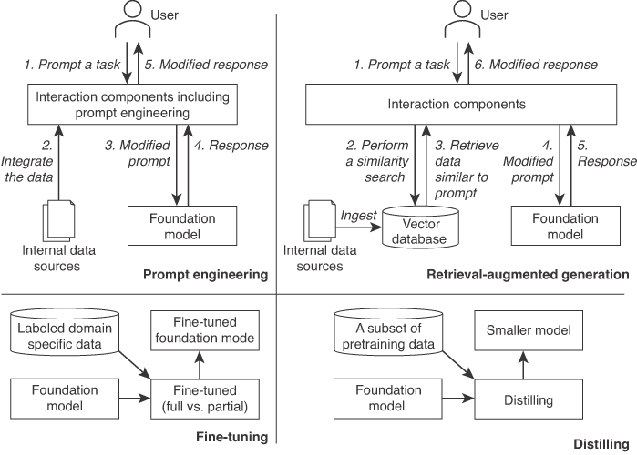
<figcaption><p><strong>Figure 4.1</strong> <em>Customizing foundation
models</em>.</p></figcaption>
</figure>

```{=html}
<aside epub:type="sidebar" class="sidebar1">
```
[]{#ch04.xhtml#page_76 .pagebreak}Prompt Engineer Job Description

Are you passionate about language and artificial intelligence (AI)? Do
you thrive in a collaborative environment and enjoy problem solving? If
so, then a career as a prompt engineer might be the perfect fit for you!

Prompt engineers are a new kind of specialist emerging in the field of
AI. They are responsible for creating and optimizing the text
instructions, or prompts, used by large language models (LLMs) to
generate different creative text formats, such as poems, code, scripts,
musical pieces, email, and letters. In essence, they act as the bridge
between human intent and AI capabilities.

Here's a closer look at the typical responsibilities of a prompt
engineer:

-   Develop and refine prompts: This involves crafting clear, concise,
    and informative prompts that effectively guide the LLM toward the
    desired output.

-   Optimize prompt performance: Prompt engineers will experiment with
    different phrasing and techniques to ensure prompts generate the
    most accurate, engaging, and relevant outputs for various
    applications.

-   Collaboration across teams: Prompt engineers work closely with
    content, product, and data science teams to understand user needs
    and translate them into technical specifications for prompts.

-   Monitor and analyze prompt performance: Regularly evaluating the
    effectiveness of prompts and identifying areas for improvement is
    crucial. This may involve analyzing data generated by the LLM and
    user feedback.

-   Stay up-to-date on advancements in AI and natural language
    processing (NLP): The field of AI is constantly evolving, so prompt
    engineers need to be lifelong learners, keeping pace with the latest
    research and developments in NLP to improve the prompt generation
    process.

To be a successful prompt engineer, you should have the following skills
and qualifications:

-   Strong understanding of NLP and AI concepts

-   Excellent written and verbal communication skills

-   []{#ch04.xhtml#page_77 .pagebreak}Experience in crafting clear and
    concise instructions

-   Analytical mind with a problem-solving approach

-   Ability to collaborate effectively with a diverse team

-   Interest in emerging technologies and a passion for language

If you're looking for a challenging and rewarding career at the
forefront of AI, then becoming a prompt engineer is a great option!

```{=html}
</aside>
```
::: section
#### *4.4.1 Prompt Engineering* {#ch04.xhtml#ch04lev2sec04 .h4}

Prompt engineering is the process of designing and refining the prompts
or inputs for an FM to generate specific types of output. It involves
selecting appropriate keywords, providing examples and context, and
shaping the input in a way that encourages the FM to produce the desired
response. To give you a feeling what that might entail, we have provided
an exemplar, a fictitious job description for a prompt engineer, in the
nearby box.

Prompt engineering does not change the underlying weights within the
transformer architecture of an FM, but it does provide context that
influences the model's output by guiding its self-attention mechanism.
It analyzes the relationships between all words in the prompt and
relevant knowledge stored within the model's layers. Suppose, for
example, you wanted the FM to focus on software engineering. Using words
like "agile" and "microservice" gives the FM context.

Prompt engineering comprises three variants: user prompt engineering,
static prompt engineering, and dynamic prompt engineering.

User prompt engineering refers to strategies and techniques that users
employ to craft their prompts in a way that makes them more relevant and
effective in eliciting the desired response from an FM. This can involve
refining the wording, providing context, or specifying the format of the
expected output. While you can offer training in prompting and prompt
engineering to your users, you can also design your user interface to
give hints to users.

Static prompt engineering involves constructing a static system prompt,
which is written and maintained by the development team, typically in
tight interaction with user feedback or power users. The system prompt
is a fixed string that is passed to the FM with every request. It often
sets a broad context and typical tone. An example system prompt is "You
are an assistant []{#ch04.xhtml#page_78 .pagebreak}to knowledge workers
in a large, multinational company in the IT industry. Use a professional
tone in your answers, be polite and concise, ..." System prompts are a
very easy and fast way to lightly customize an FM, but are limited in
their effect.

Dynamic prompt engineering refers to the real-time adjustment and
optimization of prompts, based on the context of the user interaction or
the session at hand. This approach tailors the input to the FM for each
specific instance, which can enhance the relevance and accuracy of the
output. Some techniques commonly associated with dynamic prompt
engineering are the following:

-   **Contextual adjustment** involves modifying the prompt in real time
    to better reflect the specific context or requirements of the
    current user interaction. It ensures that the FM has the most
    relevant information to generate an appropriate response.

-   In the **iterative refinement** approach, the FM is queried multiple
    times with variations of the prompt. The responses are then used to
    refine the input until the most accurate and coherent output is
    produced.

-   **Progressive prompting** involves gradually providing more
    information or guidance to the FM through a series of prompts that
    build on each other, leading to a more detailed and nuanced
    response.

-   **Few-shot learning** is often achieved through context learning.
    Specifically, the FM is provided with a small number of examples
    within a prompt to guide it to good responses for similar tasks.

-   Similar to few-shot learning, **adaptive learning** dynamically
    introduces examples or scenarios within the prompt to guide the FM,
    but internally it adjusts these examples based on the FM's
    performance to improve future responses.

Dynamic prompt engineering is not a simple task, and organizations can
get it wrong. In one notorious example from early 2024, Google Gemini
created images that included people of diverse backgrounds, even when
those images supposedly depicted historical events and figures and the
presence of people with diverse backgrounds was factually incorrect.
Dynamic prompt engineering can improve the utility of FM-based systems,
but should be approached with sufficient resources and tight feedback
loops to avoid strongly negative outcomes.

[]{#ch04.xhtml#page_79 .pagebreak}To ensure accuracy and other quality
attributes, more sophisticated prompt patterns can be applied to guide
the output of FMs. Following are a few prompt patterns commonly used in
FM-based systems:

-   **Self-consistency** involves querying the FM multiple times with
    similar prompts and selecting the most consistent answer as the
    final answer.

-   **Chain of thought** enables complex reasoning capabilities through
    intermediate reasoning steps. It involves breaking down complex
    tasks into smaller, more manageable chunks, allowing FMs to process
    and solve them more effectively.

-   **Tree of thought** builds on chain of thought but utilizes a tree
    structure instead of a chain for the dynamic reasoning process.
    Branches in the tree explore multiple reasoning paths
    simultaneously. This technique includes a function to evaluate the
    effectiveness of paths and, based on that evaluation, decide whether
    to continue exploring a given branch further or to backtrack and try
    a different branch.

Users may need to use multiple prompt patterns to achieve the desired
results. For example, Medprompt answers medical questions by searching
for similar examples in a database to construct few-shot learning
prompts, adding an FM-generated chain of thought for each example; it
then generates multiple solutions and assembles
them.^[2](#ch04.xhtml#ch04fn2){#ch04.xhtml#ich04fn2}^

[2](#ch04.xhtml#ich04fn2){#ch04.xhtml#ch04fn2}.
[www.microsoft.com/en-us/research/blog/the-power-of-prompting/](http://www.microsoft.com/en-us/research/blog/the-power-of-prompting/)
:::

::: section
#### *4.4.2 Retrieval-Augmented Generation* {#ch04.xhtml#ch04lev2sec05 .h4}

Another design option for customizing FMs is retrieval-augmented
generation (RAG), which, like prompt engineering, changes the inputs to
an FM. This approach combines the FM with an information retrieval
component that has access to custom documents (e.g., the internal
documentation of an organization). Based on a given prompt, RAG
retrieves relevant external information from a knowledge base by using a
vector database (such as
Pinecone^[3](#ch04.xhtml#ch04fn3){#ch04.xhtml#ich04fn3}^ and
Milvus^[4](#ch04.xhtml#ch04fn4){#ch04.xhtml#ich04fn4}^) to store the
personal or organization-internal data as vector embeddings (see
[Section 4.2.1](#ch04.xhtml#ch04lev2sec01), "[Vector
Spaces](#ch04.xhtml#ch04lev2sec01)" for a discussion of vectors and
embeddings). These embeddings can be used to perform similarity searches
[]{#ch04.xhtml#page_80 .pagebreak}and retrieve internal data that is
related to specific prompts. The retrieved data is then used to augment
the prompt before inputting it into the FM.

[3](#ch04.xhtml#ich04fn3){#ch04.xhtml#ch04fn3}.
[www.pinecone.io/](http://www.pinecone.io/)

[4](#ch04.xhtml#ich04fn4){#ch04.xhtml#ch04fn4}. <https://milvus.io/>

The RAG technique enhances the FM's ability to access and utilize vast
amounts of information that are not stored within the model itself. This
can lead to dramatic improvements in accuracy and relevance, as well as
the ability to stay updated with the latest information. RAG can be
applied to a wide range of applications, such as question-answering,
document retrieval, content generation, and personalized
recommendations.

One notable aspect of RAG is that the individual access rights of users
can be taken into account. Suppose User A has permission to read
documents X, Y, and Z, and those are highly relevant to a given prompt.
These documents can be retrieved and used for augmentation of User A's
prompt. Now suppose User B issues the same prompt, but has access rights
only for document Y. In this case, User B's query will be augmented with
only document Y. Reflecting such individual access rights is possible
with RAG, but not fine-tuning (which we discuss next). Fine-tuning is
typically done with documents to which a sizable group of users has
access, such as the entire, corporate-wide intranet for an internal AI
chatbot.

However, implementing RAG creates several challenges. One of the main
challenges is ensuring the quality and relevance of the retrieved
information. The system must accurately determine which pieces of
external data are most relevant to the prompt to avoid introducing noise
or misinformation. Further, managing and maintaining a comprehensive and
up-to-date knowledge base requires significant resources and
infrastructure. Additionally, privacy and data security concerns arise,
especially when handling sensitive or proprietary information.
:::

::: section
#### *4.4.3 Fine-Tuning* {#ch04.xhtml#ch04lev2sec06 .h4}

Domain-specific information can be added to an FM through a process
similar to training an ML model. A training dataset with labeled data
relevant to the chosen domain is used to further train the FM, which
adjusts the FM's existing parameters. The specific process will depend
on the FM and the tools available from the FM provider. The result,
however, has the scale of an FM and can have the specificity of an ML
model for the particular domain of interest. Fine-tuning the parameters
of FMs using labeled domain-specific data can be done through either
full fine-tuning or parameter-efficient fine-tuning.

Full fine-tuning involves retraining all of the parameters. However,
this process is often impractical and expensive due to the sheer number
of []{#ch04.xhtml#page_81 .pagebreak}parameters in FMs. Full fine-tuning
requires significant computational resources and extensive training
time.

An alternative is to employ parameter-efficient fine-tuning (PEFT)
techniques, which modify only a small percentage of the original
parameters. Adapter modules are small neural network modules attached to
specific layers within the pretrained FM. During fine-tuning, only the
parameters of these adapter modules are trained, while the original FM
parameters remain frozen. This allows the model to learn domain-specific
information without significantly altering its core knowledge. For
example, low-rank adaptation (LoRA) introduces a low-rank adaptation
layer on top of the pretrained FM, which learns a lightweight
transformation that adapts the pretrained FM to the new task. It reduces
the number of training parameters by a factor of 10,000 and decreases
computation by threefold.
:::

::: section
#### *4.4.4 Distilling* {#ch04.xhtml#ch04lev2sec07 .h4}

If a need arises for using a different model architecture (often a
smaller one), but changing the model weights through training is not
feasible, distillation is an option. Distilling the FM involves training
a smaller and more lightweight "student" model to mimic the behavior of
the larger and more complex "teacher" FM, using knowledge transfer
techniques such as knowledge distillation, attention distillation, or
parameter sharing.

Knowledge distillation involves training the student model on two loss
functions: a data loss and a distillation loss. A data loss encourages
the student model to learn from the original training data, similar to
the teacher model. A distillation loss guides the student model to
reproduce the teacher model outputs for a separate set of data, which
distills the teacher model's knowledge into the student model.

Attention distillation transfers the attention patterns learned by the
teacher model. Attention mechanisms within the teacher model highlight
the most relevant parts of the input data for a specific task. By
mimicking these attention patterns, the student model can learn to focus
on the most relevant pieces of information and improve its performance.

Parameter sharing refers to directly sharing specific layers or
parameters from the teacher model with the student model. This reduces
the number of parameters the student model needs to learn independently.

The distilled model is trained on a subset of the original data used to
train the FM, but with a different loss function that encourages it to
reproduce the output of the large FM. This can result in a more
efficient and lightweight model that still maintains an acceptable level
of performance.
:::

::: section
#### []{#ch04.xhtml#page_82 .pagebreak}*4.4.5 Guardrails* {#ch04.xhtml#ch04lev2sec08 .h4}

Guardrails are mechanisms intended to safeguard the behavior of AI
systems, particularly FM-based systems. They are designed to monitor and
control the inputs and outputs of FMs and other components (e.g.,
prompts, RAG, external tools) to meet specific requirements, such as
functional and accuracy requirements, responsible AI (RAI) requirements
derived from policy, and standards and laws. Take RAI guardrails as an
example: They can be built using a RAI knowledge base, or AI models
trained just for enforcing RAI guardrails, or FMs.

Different types of guardrails are possible. *Input guardrails* are
applied to the inputs received from users, and their possible effects
include refusing or modifying user prompts. *Output guardrails* focus on
the output generated by the FM; they may modify the output of the FM or
prevent certain outputs from being returned to the user. *RAG
guardrails* are used to ensure the retrieved data is appropriate, by
either validating or modifying the retrieved data where needed. When
calling the external tools or models to enhance the FM's capabilities,
*execution guardrails* are applied to ensure that the called tools or
models do not have any known vulnerabilities and the actions only run on
the intended target environment and do not have negative side effects.
During the workflow execution, *intermediate guardrails* can be used to
guarantee that each intermediate step meets the necessary criteria. This
involves checking whether an action should be carried out, determining
whether the FM should be invoked, deciding whether a predefined response
should be used instead, and so on.

The key attributes of guardrails include generalizability,
customizability, and interpretability. Generalizability across different
AI models/systems and contexts ensures that the guardrails remain
effective under varied operational scenarios. Customizability allows
guardrails to be adapted to the specific needs of a particular
deployment. For example, autonomous driving guardrails might issue a
warning in a certain region when the driver's hands are off the wheel
but initiate slowing down in another region, reflecting different
contexts. The design of guardrails should be dynamic, which means they
can learn while the system is being operated. Their rules can be
configured depending on the priority or context, and some guardrail
rules can be negotiable. Lastly, interpretability ensures that the
system users can understand how guardrails have been applied to build
trust.

[]{#ch04.xhtml#page_83 .pagebreak}To provide comprehensive monitoring
and control for multimodal systems (e.g., using a combination of text,
video, and audio), multimodal guardrails can be designed to carry out
the following functions:

-   Prevent inappropriate multimodal inputs from being sent to the FM,
    whether those inputs are from the users or other software components
    or external tools or models

-   Prevent inappropriate multimodal outputs from being generated by the
    FM itself, whether those outputs are sent to the user or other
    software components or external tools or models

For example, multimodal guardrails can detect not only harmful language,
but also harmful images. Imagine a future where user interfaces (UIs)
are generated dynamically on demand; then, multimodal guardrails could
effectively flag any UI elements that fail to meet specific
requirements, such as General Data Protection Regulation (GDPR)
compliance.
:::

::: section
#### *4.4.6 Updating FMs* {#ch04.xhtml#ch04lev2sec09 .h4}

In many cases, you might want the FM to be continually updated outside
of the normal full update cycle. For example, your FM might be updated
by web scraping to keep it current with recent developments, it might
contain product descriptions that you want to be kept current,
regulations could change and you want to keep your FM up-to-date, and so
forth.

Updates can be achieved through fine-tuning, while prompt engineering
and RAG are methods to update the overall FM-based system without
modifying the FM itself. They can also be explicitly triggered or done
automatically by the FM infrastructure. Which method, if any, makes
sense in your context is a business decision.

New data can also come in the form of user input. For example, you might
scan a document and ask for feedback in terms of style and grammar. This
document could be saved in one form or another for incorporation in a
future update.

If the FM incorporates the new input into its publicly available model,
then the possibility exists that proprietary information will be made
available to any user of the FM. Different providers have different
policies concerning the public availability of user information. These
policies may also change. The concern about keeping proprietary
information private has led to the development of systems like FhGenie,
described in the nearby box.

```{=html}
<aside epub:type="sidebar" class="sidebar1">
```
[]{#ch04.xhtml#page_84 .pagebreak}FhGenie, an FM-Based Production System

As a concrete example of an FM-based system and its architectural and
development-related concerns, consider FhGenie, an internal AI chatbot
at Fraunhofer. It is in productive use, and achieves the main design
objectives: no leaking of internal data and low-barrier access to
state-of-the-art AI.

Fraunhofer-Gesellschaft, based in Germany, is a leading applied research
organization with approximately 30,000 staff members. Early in the
current wave of generative AI, Fraunhofer realized that it required an
alternative to public AI chatbots that would not leak internal
information to AI labs, yet would be available to most of its staff. The
former point is obvious: Internal, confidential, and private information
should not end up in datasets that do not meet compliance requirements.
The second point addresses the need to enable all of Fraunhofer's
staff---especially the scientists---to gain experience with the recent
advances in AI. If that is achieved, staff can learn about current AI's
strengths and weaknesses, and understand when and how to use it in their
own work (for increased productivity, among other things), in their own
research (how to combine their field of expertise with it), and in
projects with industry (to the benefit of the customer).

In late 2022 and early 2023, no option existed for achieving these
goals. This changed when Microsoft Azure started offering its "OpenAI
services," through which access to GPT-3.5 and later GPT-4 and GPT-4o
became available. With this service, prompts and context can be sent to
an LLM through an API, which responds with a "completion" in much the
same way as ChatGPT or Google Gemini. OpenAI services became available
in Europe in May 2023, offering the same contractual guarantees
regarding confidentiality and GDPR compliance as other Microsoft cloud
services.

Fraunhofer realized the potential offered by this advance and swiftly
developed FhGenie, an AI chatbot based on the Azure OpenAI services.
FhGenie went live in June 2023, following development, testing, and
consensus with the workers' council. Within a few days, the number of
users had grown to the thousands. A number of companies have followed
suit and are offering similar tools internally.

FhGenie is a web application with a typical user interface. It is
connected to Fraunhofer's identity and access management, which ensures
that only []{#ch04.xhtml#page_85 .pagebreak}authorized users get access
to it. User state is kept only in the in-browser portion of the web
application, enabling long conversations without requiring the storage
of potentially sensitive information. All cloud-based components are
basically stateless: Only authorization/authentication data and
high-level metric data are kept in these components in the usual case.
The unusual case is a violation of the RAI filter rules: Should a user
ask questions that violate ethical or legal boundaries, the request is
logged in an encrypted abuse log. Default versions of rules, filters,
and the abuse log are part of the Azure service. Note that the stateless
design implies that no learning or improvement can be made based on user
interactions---neither by OpenAI/Microsoft (as desired) nor by
Fraunhofer (this was part of the consensual agreement with the workers'
council).

Users get to choose which AI model they want to use. Depending on the
chosen model and current traffic, latency can vary between 1 second and
several tens of seconds. The latency depends almost exclusively on the
response time of the chosen model.

Development is ongoing, and targets a number of areas. Besides making
various improvements and incorporating new features over time, RAG is
being added. Accordingly, relevant documents, such as the intranet, the
extranet (e.g., the Fraunhofer website), and internal rules and
regulations, can be used by the AI system when responding to user
queries. In addition, other AI models are being tested, including some
hosted by other external parties and some that will be hosted internally
on the Fraunhofer infrastructure.

User requests for improvement cover both the AI portions and the non-AI
portions of the system. Because the operators of FhGenie are not
training their own FMs, AI-related requests can be resolved only by
adding other models or improved versions of the available models---once
they are available and meet the requisite quality attributes.
Non-AI-related queries include features such as document upload:
uploading PDFs, office documents, and images to which prompts can refer.
Whether and how to implement such feature requests must be evaluated
with a holistic view of the system, with questions like the following
being addressed: Which models support a requested modality (e.g., image,
audio)? In which representation (e.g., PDF, PNG)? Can the representation
be transformed (e.g., PDF-to-text) and still result in good quality? Can
the AI models handle typical input sizes of a given modality? How should
overly []{#ch04.xhtml#page_86 .pagebreak}large inputs be handled? How
does adding this feature affect the quality attributes, particularly
performance and cost?

This example raises a few points that are more broadly applicable to AI
model development. First, the holistic system perspective is important.
It covers the AI portions and the non-AI portions of the system, and the
behavior and quality of the whole system reflect many more aspects than
just using the latest, shiniest AI model. Second, many quality concerns
are related to mutual interactions and dependencies between the AI and
the non-AI bits. Third, what started as a small project can become very
popular and valuable, yet simultaneously require considerable effort,
even in a short time frame.

```{=html}
</aside>
```
:::
:::

::: section
### 4.5 Designing a System Using FMs {#ch04.xhtml#ch04lev1sec05 .h3}

If you are designing an ML-based application, one of the first decisions
you must make is whether to use narrow ML models or FM(s).

Although the use of FMs is increasingly being explored and integrated
into various applications, most current AI systems comprise narrow ML
models and non-AI components. These narrow ML models and non-AI
components coexist within the system's architecture, interacting to
ensure the system functions properly. The narrow ML models are
responsible for making inferences for specific tasks, while the non-AI
components handle data storage, interaction with other systems, user
interfaces, rule-based logic, and other functions. Building narrow ML
models for various tasks can be costly, requiring extensive data
gathering, labeling, and human effort. Limits on training data and ML
capabilities can lead to low-quality models. However, organizations have
more control over data, the narrow ML model pipeline, and
problem-specific insights.

The main factors influencing the narrow ML versus FM decision are cost
and data availability, or the willingness to invest the effort in making
data available, as just discussed. We discuss cost as a factor in
[Section 4.5.1](#ch04.xhtml#ch04lev2sec10). If you decide to use an FM,
there are different types of models available and multiple ways to
access them; we discuss those in [Section
4.5.2](#ch04.xhtml#ch04lev2sec11).

::: section
#### *4.5.1 Costs of Narrow ML Models and FMs* {#ch04.xhtml#ch04lev2sec10 .h4}

Choosing between narrow ML models and FMs is a central decision in AI
system architecture design, as illustrated in [Figure
4.2](#ch04.xhtml#ch04fig02). As we discussed in []{#ch04.xhtml#page_87
.pagebreak}[Chapter 3](#ch03.xhtml#ch03), [AI
Background](#ch03.xhtml#ch03), narrow ML models are trained from scratch
for specific tasks using custom-collected and often labeled datasets. In
contrast, FMs are large ML models that are pretrained on massive amounts
of broad data for general purposes; they can then be adapted to perform
a specific task through fine-tuning and other forms of customization. In
addition, FMs can be self-hosted on premises, self-hosted on the cloud,
or used through APIs if available. These different options carry
different costs.

<figure id="ch04fig02" class="figure">
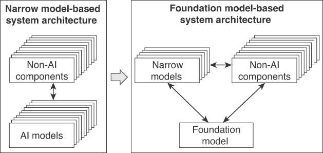
<figcaption><p><strong>Figure 4.2</strong> <em>Narrow ML models versus
foundation models</em>.</p></figcaption>
</figure>

Cost is the key factor to consider when making this decision. Sources of
costs include the following items:

-   Tool cost

-   Development cost

-   Maintenance cost

-   Operation cost

In the following subsections, we elaborate on these factors.

::: section
##### Tool Cost and Development Cost {#ch04.xhtml#ch04lev3sec01 .h5}

We will make the following assumptions:

-   The development cost for the non-AI components will be roughly
    equivalent.

-   If an organization chooses to train or fine-tune an in-house FM, the
    costs of that development will be amortized over multiple
    applications. The amount attributable to a single application will
    be an operational []{#ch04.xhtml#page_88 .pagebreak}cost for that
    application, not a development cost. That being said, the estimated
    cost for training state-of-the-art LLMs is expected to be in the
    tens or hundreds of millions of dollars---but bespoke FMs for
    domains can be a lot cheaper to train.

-   If an organization builds multiple narrow ML applications, it will
    likely use the same tools to manage data preparation and model
    building. So, again, tool cost is amortized over multiple
    applications and can be considered an operational cost for any
    single application.

Consequently, we assume the development cost will be composed of only
the data ingestion cost and the model customization cost. We now assume
away the distinction in development costs between narrow ML models and
FM.

-   Our FM case studies in [Chapters 12](#ch12.xhtml#ch12) ([The
    Fraunhofer Case Study: Using a Pretrained Language Model for
    Tendering](#ch12.xhtml#ch12)) and [13](#ch13.xhtml#ch13) ([The ARM
    Hub Case Study: Chatbots for Small and Medium-Size Australian
    Enterprises](#ch13.xhtml#ch13)) both mention data preparation as a
    difficult and time-consuming process. This is equally true of the
    data used in narrow ML model training and processing. The specifics
    of the data used in your application should be examined to determine
    whether there will be a substantial difference in data ingestion
    costs when preparing that data for use by an FM versus by a narrow
    ML model.

-   The model development activities for FMs and narrow ML models are
    quite different. The model development activities for narrow ML
    models consist of choosing the model, selecting hyperparameters,
    training, and testing the model. The model development activities
    for FMs involve the customization techniques discussed in [Section
    4.4](#ch04.xhtml#ch04lev1sec04), "[Customizing
    FMs](#ch04.xhtml#ch04lev1sec04)". Any differences in model
    development costs will depend on the specifics of the application
    that you are building and the type of data used for your
    application.
:::

::: section
##### Maintenance Cost {#ch04.xhtml#ch04lev3sec02 .h5}

We assume the differences between narrow ML models and FMs to be
relatively small:

-   The costs of evolving the non-AI components will be similar in both
    cases.

-   The costs of evolving the training data or cleaning the input data
    will depend on the specifics of the data.
:::

::: section
##### []{#ch04.xhtml#page_89 .pagebreak}Operational Cost {#ch04.xhtml#ch04lev3sec03 .h5}

It is primarily in the operational costs that we can see a clear
advantage for narrow ML models.

-   Narrow ML models can be hosted on local resources without the
    necessity of using the cloud. Even if the models are hosted on the
    cloud, the costs will be restricted to only the resources actually
    used. If the model is using services hosted by the cloud provider,
    there may be charges for those services.

-   FMs are usually hosted on the public or private cloud because of
    their scale. Furthermore, many providers charge for the services
    involved in using an FM. These charges tend to be higher than for
    hosted ML services.

-   Hosting larger FMs on private cloud resources might make it
    necessary to procure (more) GPU capacity. At the time of this
    writing, GPUs are expensive and somewhat hard to come by.

-   The amortization cost associated with narrow ML tools will likely be
    smaller than the amortization cost associated with a bespoke FM.

To summarize the cost discussion, making some assumptions will give an
edge to narrow ML models. However, any differences will depend on the
specifics of the data to be analyzed, the costs of the cloud provider,
and the amortization costs of a bespoke FM or tools used in processing
training and input data.
:::
:::

::: section
#### *4.5.2 External FMs, Own FMs, or Open-Weight FMs* {#ch04.xhtml#ch04lev2sec11 .h4}

Another decision in the architecture design of FM-based systems is
choosing whether to (1) leverage an external pretrained FM via APIs, (2)
create your own FM in-house, or (3) run an existing open-parameter
model.

First, using an external FM via an API can save human resources for
model training, deployment, and maintenance, as organizations pay only
per API call and request/response volume (measured, for example, in
tokens, characters, or words). Furthermore, using a well-established
external FM can potentially result in higher accuracy and
generalizability to various tasks. However, the organization may have
only limited control over context-specific qualities. In addition,
privacy and security concerns can arise if organizations are uncertain
whether their data, their employees' data, and []{#ch04.xhtml#page_90
.pagebreak}their customers' data will be used for pretraining the next
generation of FMs by third parties without their knowledge.

Second, as discussed in [Section 4.6](#ch04.xhtml#ch04lev1sec06),
"[Maturity of FMs and Organizations](#ch04.xhtml#ch04lev1sec06)", some
organizations may possess unique internal data for training or
fine-tuning their own FM in-house, potentially leading to a competitive
advantage. Also, with this approach, organizations have full control
over the model pipeline, which facilitates model customization and
ensures the result has human value--related qualities. The trained FM
can be shared across different departments. Operating an FM is actually
quite straightforward with tools. For example, Llama.cpp can easily run
smaller models on a laptop, especially those using quantization.
However, larger FMs often require substantial investments. For example,
the United Kingdom announced initial startup funding of £100 million to
build its own FM.^[5](#ch04.xhtml#ch04fn5){#ch04.xhtml#ich04fn5}^
Organizations with rigorous quality requirements that cannot be
fulfilled by external FMs may select this option.

[5](#ch04.xhtml#ich04fn5){#ch04.xhtml#ch04fn5}.
[www.gov.uk/government/publications/integrated-review-refresh-2023-responding-to-a-more-contested-and-volatile-world](http://www.gov.uk/government/publications/integrated-review-refresh-2023-responding-to-a-more-contested-and-volatile-world)

Third, self-hosting open-weight models can be a viable alternative. In
this case, the weights or parameters of a model are made publicly
available although the training data and the source code or the source
data are not. Hence, these models are typically called open-weight or
open-parameter models, not open-source models. Hosting an FM-based model
that is a customized version of an open-parameter FM offers a middle
ground where organizations can leverage the advancements of preexisting
FMs while maintaining greater control over their use and data.

The difficulty in using an open-weight model is determining the effects
of the parameters. Sophisticated techniques are used to discover
activation patterns. Model visualization tools, explainable AI
techniques (see [Chapter 11](#ch11.xhtml#ch11),
[Observability](#ch11.xhtml#ch11)), and model interpretation libraries
can also be used to gain some insight into the effect of the parameters.

By self-hosting, companies can fine-tune these models with their
proprietary, internal data, which can help address specific domain needs
without incurring the full costs and resource commitments entailed in
developing an FM from scratch. Moreover, self-hosting allows for more
stringent data privacy and security measures, as sensitive information
does not need to leave the organization's infrastructure. This can be
particularly appealing for organizations that have the technical
capacity to manage these systems but wish []{#ch04.xhtml#page_91
.pagebreak}to avoid the risks associated with external APIs and the
considerable investment required for full in-house development.
:::
:::

::: section
### 4.6 Maturity of FMs and Organizations {#ch04.xhtml#ch04lev1sec06 .h3}

As FMs are maturing, their capabilities are increasing. Notably,
organizations are at different levels of maturity, impacting the choices
they should make. In this section, we first present the results of an
experiment we conducted to see whether a publicly available FM can be
used to perform data cleaning. This is a task that exemplifies the
growing maturity of FMs. Subsequently, we discuss organizational issues
with respect to the use of FMs.

::: section
#### *4.6.1 Data Cleaning Experiment* {#ch04.xhtml#ch04lev2sec12 .h4}

FMs are rapidly gaining functionality and are being used for an
increasing number of application areas. One application area of interest
to the builders of AI systems is the activities involved in data
cleaning and preparation. We performed an experiment where we attempted
to use ChatGPT with GPT-4o to perform some data cleaning and analysis.
We will summarize the results, but you can find the entire dialogue
online.

We began by providing ChatGPT a messy data set. A summary of the
dialogue follows, and you can find the entire dialogue
online.^[6](#ch04.xhtml#ch04fn6){#ch04.xhtml#ich04fn6}^

[6](#ch04.xhtml#ich04fn6){#ch04.xhtml#ch04fn6}.
<https://research.csiro.au/ss/team/se4ai/ai-engineering/>

-   Us: The uploaded file contains a sheet titled "Dirty 1," which
    appears to have inconsistently structured sales data. The data
    includes segments like Consumer, Corporate, and Home Office, each
    with different shipping modes and corresponding totals.

-   Us: \[Several questions about the values in different categories\]

-   ChatGPT: \[Answered correctly\]

-   Us: Identify the sales amount details for Order ID CA-2012-162201.

-   ChatGPT: It seems there is an issue locating the "Order ID" column,
    likely due to the inconsistency in the column headers.

-   Let's try an alternate approach to identify the correct column for
    the Order IDs and retrieve the details for the specified Order ID
    "CA-2012-162201."

-   []{#ch04.xhtml#page_92 .pagebreak}The "Order ID" column is not
    explicitly labeled in the headers row, suggesting that the data
    might have a different format or starting point. Let's explore the
    dataset to locate the Order IDs.

-   The Order IDs appear to be listed under the first column without a
    proper header. I will search for the Order ID "CA-2012-162201" in
    this column and extract the corresponding sales details.

-   The sales amount details for Order ID "CA-2012-162201" are as
    follows:

-   ...

-   Us: What is the trend of sales in the Consumer segment over the
    given period?

-   ChatGPT: To analyze the trend of sales in the Consumer segment, we
    will aggregate the sales data over time. However, given the
    structure of the data, we need to ensure that we properly handle the
    dates and identify any possible trends.

-   ...

After several more questions about the data as input, including drawing
graphs, we asked ChatGPT to clean the data. It identified problems with
the original data and performed several cleaning operations. Again, see
the original dialogue if you are interested in the details.

Our conclusion from this experiment is that FMs can, in fact, be used
for operations much more sophisticated than textual or image analysis.
The extent to which an FM can replace some of the non-AI modules in your
application will, of course, depend on the specifics of your
application. Even so, the message of our experiment is clear: Do not
discount the capabilities of an FM for your application until you have
tested it.
:::

::: section
#### *4.6.2 Organizational Maturity* {#ch04.xhtml#ch04lev2sec13 .h4}

FMs' capabilities are rapidly increasing, and more organizations are
adopting them. The utilization of an FM depends on not only the
capabilities of the FM, but also the maturity of the organization
wishing to use the FM. [Figure 4.3](#ch04.xhtml#ch04fig03) shows,
nominally, the increasing organizational maturity required to use an FM
in different ways. Prompt engineering is the easiest for organizations,
RAGs are somewhat more difficult, fine-tuning and distilling require
more sophistication, and creating a bespoke FM requires the most
sophistication.

<figure id="ch04fig03" class="figure">
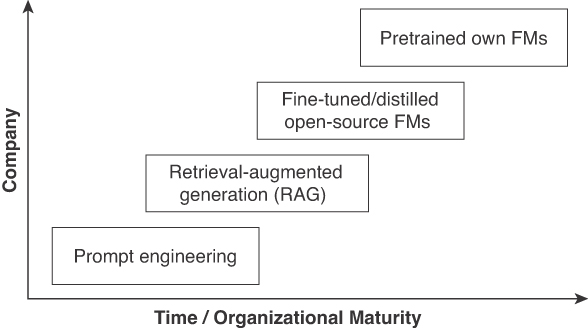
<figcaption><p><span id="ch04.xhtml#page_93"
class="pagebreak"></span><strong>Figure 4.3</strong> <em>Complexity
versus time/organizational maturity</em>.</p></figcaption>
</figure>
:::
:::

::: section
### 4.7 Challenges of FMs {#ch04.xhtml#ch04lev1sec07 .h3}

Having explored various aspects of FMs, it's important to recognize
their remaining inherent limitations. These challenges stem from how FMs
process and generate information, and impact their reliability and
accuracy. Two key challenges are associated with the use of FMs:

-   **Limited grounding:** FMs focus on identifying statistical patterns
    within data sequences, rather than being grounded in facts or
    authoritative knowledge. They identify correlations but lack an
    underlying causal model or a world model. This can lead to
    significant inaccuracies in their outputs.

-   **Hallucination or confabulation:** Without grounding, FMs lack the
    ability to evaluate the confidence and truthfulness of their outputs
    while having a tendency to provide an answer by making one up---a
    behavior often termed *hallucination*. The term *hallucination* has
    been critiqued for anthropomorphizing AI, suggesting false
    perception. *Confabulation* is a more precise alternative term,
    highlighting the tendency to invent facts in uncertain situations,
    effectively filling in gaps creatively while sticking to the
    appearance of known material.
:::

::: section
### []{#ch04.xhtml#page_94 .pagebreak}4.8 Summary {#ch04.xhtml#ch04lev1sec08 .h3}

Foundation models are large, general-purpose ML models that are
pretrained on vast amounts of broad data. FMs can be adapted to perform
a wide variety of tasks. However, achieving optimal capabilities and
performance in FM-based software often requires a combination of various
interacting components, rather than relying solely on a single,
monolithic FM. FMs are typically based on the transformer architecture,
which in turn depends on vector spaces and attention mechanisms.

FMs can be customized using techniques such as prompt engineering, RAG,
fine-tuning, distillation, and guardrails. One concern for organizations
is the leakage of proprietary information that is possible when they use
FMs. Designing an application using FM will depend on cost factors, and
on the type of FM. Utilizing an FM depends on both the capabilities of
the FM and the organizational maturity of the development organization.
FMs have some inherent challenges such as lack of grounding and
hallucination.
:::

::: section
### 4.9 Discussion Questions {#ch04.xhtml#ch04lev1sec09 .h3}

1.  Pick a particular organizational or personal task, and compare the
    specific pros and cons of using narrow ML models versus FMs to
    achieve it.

2.  Pick a particular organizational or personal task, and compare the
    pros and cons of the different ways of customizing FMs to better
    implement it.

3.  Pick a particular application with which you are familiar, and
    compare the costs of using an FM versus a narrow ML model.
:::

::: section
### 4.10 For Further Reading {#ch04.xhtml#ch04lev1sec10 .h3}

You can read about Word2Vec in Wikipedia \[[Wiki
Word2Vec](#ref.xhtml#ref57)\].

The foundational paper on attention, "All You Need Is Attention," can be
found at \[[Vaswani 17](#ref.xhtml#ref53)\].

Wikipedia also has an entry about the transformer architecture \[[Wiki
Transformer](#ref.xhtml#ref56)\].

Vector encodings are described in the TensorFlow tutorials \[[TensorFlow
Tutorials](#ref.xhtml#ref49)\], including \[[TensorFlow
Guide](#ref.xhtml#ref48)\].

More details about FhGenie can be found in \[[Weber
24](#ref.xhtml#ref54)\]

For the evolution and future of FM-based systems, have a look at Zaharia
et al. \[[Zaharia 24](#ref.xhtml#ref60)\].

[]{#ch04.xhtml#page_95 .pagebreak}You can read more about design options
for FMs in Lu et al. \[[Lu 24A](#ref.xhtml#ref32)\].

For using FMs to design more advanced agents, see \[[Lu
24B](#ref.xhtml#ref35)\], \[[Liu 24](#ref.xhtml#ref30)\].

For designing runtime guardrails, a taxonomy can be found at Shamsujjoha
et al. \[[Shamsujjoha 24](#ref.xhtml#ref44)\].[]{#ch04.xhtml#page_96
.pagebreak}
:::
:::
:::

[]{#ch05.xhtml}

::: {#ch05.xhtml#book-content}
::: {#ch05.xhtml#sbo-rt-content}
## []{#ch05.xhtml#page_97 .pagebreak}*5* {#ch05.xhtml#ch05 .h2}

## *AI Model Life Cycle* {.chap_ttl}

with Boming Xia

*Choose your tools carefully, but not so carefully that you get uptight
or spend more time at the stationery store than at your writing table*.

---Natalie Goldberg

M[OVING FROM MODEL]{.smallcaps} selection into production takes a number
of steps and utilizes a large number of supporting tools. That explains
our opening quotation: You can spend a tremendous amount of time
agonizing over which tools to use, but you should not go too far down
the rabbit hole.

Some of these tools are used to manage the data used to train the
models, others package the model for deployment and serving. We will
discuss the types of tools available within the context of their use.
The chapter is intended for those AI engineers managing their own data.
If you are using a vendor-supplied pretrained model, whether a narrow
machine learning (ML) model or a foundation model (FM), the vendor will
be responsible for preparing and training the model. You will be
responsible for any data used in customizing the model, such as data
used in fine-tuning, inference, and retrieval-augmented generation
(RAG). The organization of this chapter follows [Figure
5.1](#ch05.xhtml#ch05fig01), which depicts the development life cycle
for AI models.

<figure id="ch05fig01" class="figure">
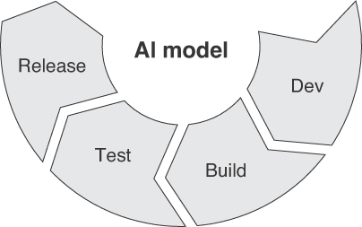
<figcaption><p><strong>Figure 5.1</strong> <em>AI model life
cycle</em>.</p></figcaption>
</figure>

::: section
### 5.1 Developing the Model {#ch05.xhtml#ch05lev1sec01 .h3}

As we noted in [Section 1.5](#ch01.xhtml#ch01lev1sec05), "[AI Model
Quality](#ch01.xhtml#ch01lev1sec05),", MLOps is a set of practices to
prepare ML models for production and then operate them. We break the
discussion of MLOps practices into three portions. [Chapter
3](#ch03.xhtml#ch03), [AI Background](#ch03.xhtml#ch03), and [Chapter
4](#ch04.xhtml#ch04), [Foundation Models](#ch04.xhtml#ch04), discussed
model selection and hyperparameter definition. This chapter discusses
development of the model up to []{#ch05.xhtml#page_98 .pagebreak}the
point that it is ready to commit to the build stage. [Chapter
6](#ch06.xhtml#ch06), [System Life Cycle](#ch06.xhtml#ch06), discusses
the life cycle of the system through to operations including, but not
exclusively, the AI model portion. As we will see in [Chapter
13](#ch13.xhtml#ch13), [The ARM Hub Case Study: Chatbots for Small and
Medium-Size Australian Enterprises](#ch13.xhtml#ch13), MLOps steps
pertain to the development of both narrow ML models and FMs.

To create a narrow ML model, the AI model must be trained on a set of
data specific to the domain and application for your system. Each data
item in that set can be seen as a collection of attributes. Most of
these attributes will be treated as independent variables and the
remainder as dependent variables. The goal of the resulting model is to
infer the values of the dependent variables given a new data item
specified in terms of the independent variables. [Figure
5.2](#ch05.xhtml#ch05fig02) shows the steps involved in training a
narrow ML model, each of which we discuss in turn.

<figure id="ch05fig02" class="figure">

<figcaption><p><strong>Figure 5.2</strong> <em>Steps in model
development</em>.</p></figcaption>
</figure>

Training an FM was discussed in [Chapter 4](#ch04.xhtml#ch04). Rather
than relying solely on explicit labels, FMs use high-dimensional vector
spaces to represent data, enabling them to capture complex relationships
and associations between data points. This approach allows them to
generalize across tasks without the need for manual labeling, by
building on techniques commonly used in other unsupervised learning
approaches.

[]{#ch05.xhtml#page_99 .pagebreak}The selection of data for training
will determine the quality of the resulting model. Two of the items to
consider are highlighted here:

-   **Generalization versus accuracy:** Achieving a balance between
    broad generalization, including robustness to out-of-distribution
    data, and optimizing for high accuracy on known data distributions
    is a complex tradeoff. An AI model for medical diagnosis must
    generalize across varied patient data while maintaining high
    accuracy.

-   **Effective stress testing:** Conducting tests against rare or
    unexpected conditions not seen during training is an important
    aspect of the test suite. For example, a weather prediction model
    may be inadequately tested against extreme, unrecorded weather
    events.

::: section
#### *5.1.1 Data Management* {#ch05.xhtml#ch05lev2sec01 .h4}

[Figure 5.3](#ch05.xhtml#ch05fig03) gives an overview of the steps that
make up the data management stage.

<figure id="ch05fig03" class="figure">

<figcaption><p><strong>Figure 5.3</strong> <em>Steps in data
management</em>.</p></figcaption>
</figure>

::: section
##### Gathering the Data {#ch05.xhtml#ch05lev3sec01 .h5}

First, the data to be used to train the model must be gathered. This
data can be gathered from a wide range of sources. It may come from
surveys, sensors, databases, websites, data collected from APIs or
system monitors, or a third party. The term "data ingestion" is often
used to describe this stage. You need to obtain a set of data values
pertinent to the problem you wish to solve, because the data chosen to
train the model is critical to the quality of the subsequent model. In
particular, the distribution of data values should reflect the
real-world scenario in which the model will be used. If the training
data is biased toward a certain subset of the population, the model may
not perform well on other demographics.

[]{#ch05.xhtml#page_100 .pagebreak}In addition to the representativeness
of the data, two other aspects of gathering the data are important.
First, consider where the data is stored. The term *data storage*
typically refers to a service that holds data in a structured or
unstructured form. For example, Amazon S3 and Google Cloud Storage are
popular tools that store data as objects or files in the cloud. A *data
lake* is a more comprehensive repository that can store vast amounts of
raw data in its native format. Data lakes often use underlying storage
services like S3 or Azure Data Lake Storage to house this data, but they
also include tools for organizing, processing, and analyzing it.

In contrast to a data lake, a *data warehouse* stores highly structured,
processed data that is optimized for fast querying and reporting, making
it ideal for business intelligence use cases. Tools like Amazon Redshift
and Google BigQuery are popular examples of data warehouses. A *data
lakehouse* is a relatively newer concept that combines the flexible data
storage capabilities of a data lake with the structured data management
and performance features of a data warehouse. Tools like
Databricks^[1](#ch05.xhtml#ch05fn1){#ch05.xhtml#ich05fn1}^ and Snowflake
are examples that offer lakehouse architectures, bridging the gap
between raw data storage and structured analytics.

[1](#ch05.xhtml#ich05fn1){#ch05.xhtml#ch05fn1}. Data Lakehouse
Architecture. *Unify your data, analytics, and AI*.
[www.databricks.com/product/data-lakehouse](http://www.databricks.com/product/data-lakehouse)

The second crucial aspect of gathering data is maintaining a history of
where the data originated and how it has evolved over time. This
involves two key concepts: data versioning and data lineage. On the one
hand, *data versioning* refers to the practice of keeping track of
different versions of datasets as they are updated or modified, ensuring
that previous states can be retrieved and compared. Tools like Data
Version Control (DVC) and Delta Lake are popular choices for managing
data versioning. On the other hand, *data lineage* tracks the complete
life cycle of data, including its origins, its transformations, and how
it flows through various systems. Understanding data lineage is
essential for ensuring transparency, reproducibility, and compliance,
especially in AI model development. Tools like Apache Atlas and Collibra
are widely used to implement data lineage, providing a detailed history
of data and its transformations. As we will see in [Chapter
11](#ch11.xhtml#ch11), [Observability](#ch11.xhtml#ch11), keeping track
of the source of data used in AI models and their transformations is
important.
:::

::: section
##### Cleaning the Data {#ch05.xhtml#ch05lev3sec02 .h5}

Once the data has been gathered, it must be cleaned and transformed to
ensure its quality and usability. Some of the issues involved in this
step are discussed here.

[]{#ch05.xhtml#page_101 .pagebreak}Data often comes from different
sources at different frequencies, and may potentially contain errors.
For example, suppose the model is intended to predict blood pressure.
During health exams, we might get data from physical measurements (such
as a doctor's stethoscope) or from smartwatches that people wear.
Physical measurements might be updated monthly, whereas smartwatches
could supply data continuously.

Cleaning the data involves identifying and fixing errors such as missing
values or inconsistencies. Duplicate data may also have been collected,
which needs to be removed during the cleaning process. Outliers, for
example, can indicate an erroneous value that needs to be addressed
during cleaning. Tools like OpenRefine and Trifacta are often used for
this purpose. Visual examination of the data is also useful to identify
errors.
:::

::: section
##### Processing the Data {#ch05.xhtml#ch05lev3sec03 .h5}

Once the data is cleaned, transformation comes into play. This process
involves converting the data into a format that the next steps in model
training can understand. Because raw data may have been gathered from a
variety of sources, it is likely in various formats. Transformation
tasks may include scaling the data, encoding categorical variables, or
creating new features to improve model performance. Tools such as Apache
Spark and Talend offer robust capabilities for these preprocessing
tasks.

The entire process of gathering, cleaning, and preprocessing data is
both labor-intensive and critical for ensuring data quality. Various
end-to-end tools are available to assist with these tasks, providing
functions such as ingesting and outputting data in different formats,
data transformation, filtering, sorting, aggregation, scaling, encoding
categorical features, imputing missing values, anomaly detection,
cleansing suggestions, data profiling, joining, data deduplication, and
master data management. Comprehensive data platforms like KNIME and
Alteryx offer end-to-end solutions for data preparation, integrating
cleaning, transformation, and advanced analytics into a single workflow.
Additionally, cloud-based platforms like Google Cloud Dataflow and AWS
Glue provide scalable and automated data processing capabilities, making
them ideal for large-scale data integration and transformation tasks
across various industries.
:::
:::

::: section
#### *5.1.2 Feature Engineering* {#ch05.xhtml#ch05lev2sec02 .h4}

Feature engineering is the process of extracting features
(characteristics, properties, attributes) from data. The goal of feature
engineering is to choose those []{#ch05.xhtml#page_102
.pagebreak}features that will best indicate or predict the value of the
phenomenon of interest. Features can be explicit within the data, such
as in our blood pressure example; can be imputed from data such as
height and weight; or can be related to the collection mechanism, such
as "this data comes from sensor 37." FMs do not rely on explicitly
defined features. Instead, they use associations, patterns, and
relationships within data, through a vector space, where similar items
are positioned close together based on their contextual similarities.

Tools to support feature engineering perform some of the following
functions:

-   **Numerical transformations:** Operations such as scaling,
    normalization, and taking logarithms to adjust the distribution of
    numerical features.

-   **Category encoding:** Converting categorical variables into
    numerical values, such as one-hot encoding, ordinal encoding, and
    label encoding (e.g., encoding "not spam" as 0 and "spam" as 1 in
    emails).

-   **Clustering:** Grouping similar data points together based on their
    feature similarities. This technique is often used to create new
    categorical features.

-   **Aggregating values:** Summarizing data through operations like
    sum, mean, median, or other statistical measures to create new
    features.

-   **Principal component analysis (PCA):** A dimensionality reduction
    technique that transforms features into a set of uncorrelated
    components, thereby preserving most of the variance in the data.

-   **Feature construction:** Creating new features from existing ones,
    such as interaction terms or polynomial features, to capture more
    complex patterns in the data.

Popular tools that facilitate feature engineering include tools which
automate feature engineering through deep feature synthesis, and H2O.ai,
which provides a comprehensive suite for creating and selecting features
within its ML platform. Additionally, tools like scikit-learn offer a
wide range of feature engineering functions that can be easily
integrated into data processing pipelines.

The following concerns must be addressed when choosing the features for
engineering:

-   **Change-proof features:** Creating features that will remain
    relevant and informative despite changes over time is a significant
    challenge. For []{#ch05.xhtml#page_103 .pagebreak}example, in
    financial models, the relevance of the economic indicators used as
    features may change due to evolving market dynamics.

-   **Edge case representation:** Developing features that effectively
    capture the characteristics of edge cases and out-of-distribution
    data is important. For example, a language translation model may
    need to handle rare dialects or slang.

-   **Feature complexity tradeoff:** Balancing the addition of features
    to improve robustness and resilience against the increase in
    computational demand, complexity, and potential model
    maintainability issues is a delicate task. For example, an
    autonomous vehicle's AI system must balance the complexity of
    features against real-time processing needs.

Feature stores act as centralized repositories for storing, managing,
versioning, and serving features that your models are built upon. They
store precomputed feature values for efficient access. Key functions for
such stores typically include the following:

-   **Feature engineering:** Define and implement feature engineering
    pipelines within the store.

-   **Versioning and lineage tracking:** Track changes made to features
    and their origin for accountability.

-   **Online and offline serving:** Serve features for both batch
    training and real-time inference with low latency.

-   **Governance and access control:** Manage access and changes to
    features based on user roles and permissions.

Popular tools for managing feature stores include Feast, which
integrates with various data processing frameworks and supports both
online and offline feature serving, and Tecton, which offers a
comprehensive platform for feature engineering, versioning, and
real-time feature serving at scale. In addition, Amazon SageMaker
Feature Store provides a managed service that integrates with the
broader AWS ecosystem, making it a powerful choice for teams already
using AWS for their ML workflows.
:::

::: section
#### *5.1.3 Dividing the Data* {#ch05.xhtml#ch05lev2sec03 .h4}

Data management (e.g., data lakehouses, data warehouses, data storage)
and feature engineering/stores handle functions such as data sourcing,
ingestion, []{#ch05.xhtml#page_104 .pagebreak}cleaning, transformation,
versioning, and governance. Once they have been implemented, the next
step in the AI model life cycle focuses on managing the cleaned and
transformed training data for the purpose of splitting it into training,
validation, and test sets. While there is some overlap in the terms used
in the process of dividing the data and the terms used in data
management functions, the key difference here lies in the specific tools
and methods used to ensure that the data is split in a way that supports
robust model development and evaluation.

Once the data has been cleaned and transformed, it needs to be divided
into three distinct sets:

-   **Training set:** Used to train the model and fit its parameters.

-   **Validation set:** Used to tune the hyperparameters and prevent
    overfitting during the model development phase.

-   **Test set:** Used for final evaluation of the model's performance,
    ensuring that it generalizes well to unseen data.

The following tools and functions are specific to data splitting:

-   **scikit-learn:** Provides functions like train_test_split and KFold
    for splitting datasets into training, validation, and test sets,
    along with cross-validation techniques to ensure robust model
    evaluation.

-   **TensorFlow and Keras:** Both offer utilities within their APIs to
    automate the process of dividing datasets, such as TensorFlow's
    tf.data.Dataset and Keras's train_test_split.

-   **PyTorch DataLoader:** Often used in deep learning, it facilitates
    data batching and splitting, particularly when working with large
    datasets.

-   **MLFlow:** While also a general-purpose tool for managing the ML
    life cycle, MLFlow supports automating data splitting processes
    within its experiment tracking and model management pipelines.

The accuracy of the model is heavily dependent on how well the data is
split and how representative the training, validation, and test sets are
of the real-world scenarios the model will encounter. Poorly split data
can lead to overfitting, underfitting, or biased models that do not
generalize well. Therefore, carefully selecting tools and methods for
data splitting is essential to building robust ML models. We will cover
the impact of biases in training data and their implications for model
predictions in [Chapter 10](#ch10.xhtml#ch10), [Privacy and
Fairness](#ch10.xhtml#ch10).
:::

::: section
#### []{#ch05.xhtml#page_105 .pagebreak}*5.1.4 Generating the Model* {#ch05.xhtml#ch05lev2sec04 .h4}

Once an initial model has been selected, its training algorithm is
executed on the training dataset, with the model's parameters being
adjusted through an iterative process to minimize errors. The result of
this process is a trained model, which consists of a set of optimized
numerical parameters (often referred to as weights) that encode the
knowledge the model has learned from the data.

Model development typically follows a two-phase approach in terms of
pipeline and process. The first phase is the exploratory model
development process. It is a more experimental phase, in which data
scientists and developers tinker with various aspects of the model. It
includes experimenting with different model architectures, adjusting the
hyperparameters, and assessing the effectiveness of specific features.
This phase often involves a high degree of trial-and-error and is
usually conducted in a more flexible and interactive environment, such
as Jupyter Notebooks or similar systems. Here, developers may work with
a subset of the training data, particularly when dealing with vast
datasets. This subset should be representative of the full dataset, but
small enough to allow for rapid experimentation and iteration. This
stage allows for understanding the nuances of the model and the data,
and lays the groundwork for more effective and efficient model training.

Once the exploratory phase yields a refined set of hyperparameters,
configurations, and features, the process transitions to the second
phase---the actual model training on a larger scale. In this phase, the
model is trained on the larger dataset to ensure that it learns from a
comprehensive range of examples and scenarios. This training is more
structured and less experimental than that conducted in the first phase.
Additionally, the evaluation set in this phase is larger and more
robust, enabling a more accurate assessment of the model's effectiveness
and generalizability.

This two-phase approach---starting with exploratory modeling on a
smaller scale and transitioning to full-scale training---is essential
for developing robust, effective AI models. It is important that
Infrastructure as Code (IaC) practices in the explorative, actual
training, and later deployment environments are consistent across
feature generation code, training, evaluation, and other applications of
IaC.

Be aware that the resources required to execute the model may be
substantially different from those required to train the model. For
instance, in the blood pressure example, millions of data points may be
used for training the model. Storing and processing this training data,
along with the training process itself, can demand significant
resources. By comparison, a trained []{#ch05.xhtml#page_106
.pagebreak}model, which might be as simple as a linear regression, can
be captured in a small number of values. The code required to execute
such a model can be quite compact and might not require many resources.

However, for larger models, such as deep neural networks, the execution
might still require considerable resources, even after training. This
disparity in resource needs has implications for where the model is
positioned within the system architecture. Simpler models may be
deployed on lightweight devices, whereas more complex models might
necessitate deployment on more robust infrastructure.

Task-specific ML models can be trained via three main types of methods:
supervised, unsupervised, and self-supervised learning. Supervised
learning involves training on labeled data, such as transaction data
labeled as either "fraudulent" or "legitimate" for fraud detection.
Unsupervised learning does not use labels, allowing the model to find
patterns independently. It is useful in tasks such as customer
segmentation in marketing. Self-supervised learning allows models to
create their own labels by masking existing words in a sentence and then
predicting the masked words, a technique commonly used in language
processing tasks. General-capability FMs are trained on vast amounts of
unlabeled data. To use an FM in a particular domain or for a downstream
task, it is typically customized for that domain or task. This
customization of the FM is discussed in detail in [Chapter
4](#ch04.xhtml#ch04).
:::

::: section
#### *5.1.5 Tool Support for Model Training* {#ch05.xhtml#ch05lev2sec05 .h4}

Manually writing the code for training models is possible but rarely
done in modern ML. Instead, ML frameworks are typically used to provide
these functions. Consequently, developers are not required to code
training algorithms. They can choose a framework and the needed library
functions to train a model via some configuration and high-level coding.

Both open-source and commercial frameworks exist to manage model
generation. Some tools also act as feature stores and keep a history of
versions of training data, features, and test results, allowing for
better comparison, explainability, and traceability. We discuss
explainability and traceability in [Chapter 11](#ch11.xhtml#ch11),
[Observability](#ch11.xhtml#ch11).

ML frameworks include the following options:

-   TensorFlow^[2](#ch05.xhtml#ch05fn2){#ch05.xhtml#ich05fn2}^

    [2](#ch05.xhtml#ich05fn2){#ch05.xhtml#ch05fn2}.
    [www.tensorflow.org/](http://www.tensorflow.org/)

-   []{#ch05.xhtml#page_107
    .pagebreak}PyTorch^[3](#ch05.xhtml#ch05fn3){#ch05.xhtml#ich05fn3}^

    [3](#ch05.xhtml#ich05fn3){#ch05.xhtml#ch05fn3}.
    <https://pytorch.org/>

-   scikit-Learn^[4](#ch05.xhtml#ch05fn4){#ch05.xhtml#ich05fn4}^

    [4](#ch05.xhtml#ich05fn4){#ch05.xhtml#ch05fn4}.
    <https://scikit-learn.org/stable/index.html>

-   XGBoost^[5](#ch05.xhtml#ch05fn5){#ch05.xhtml#ich05fn5}^

    [5](#ch05.xhtml#ich05fn5){#ch05.xhtml#ch05fn5}.
    <https://github.com/dmlc/xgboost>

Some ML platforms are provided by cloud vendors, including the following
options:

-   Google Cloud Vertex AI

-   Amazon SageMaker

-   Microsoft Azure Machine Learning

A model registry is a centralized repository for managing the life cycle
of ML models. It serves as a system for storing, versioning, and
tracking metadata about models throughout their life cycle---from
development to deployment and maintenance. Its primary objective is to
streamline model management and maintain a record of model evolution. A
model registry performs the following core functions:

-   **Version control:** Tracks different versions of models, enabling
    teams to easily roll back to previous versions if needed and
    understand changes over time.

-   **Metadata management:** Records comprehensive metadata for each
    model version, including training data, parameters, performance
    metrics, and authorship information. This metadata is important for
    understanding the context in which a model was developed and how it
    has evolved.

-   **Model staging and life-cycle management:** Manages the phases of a
    model's life cycle, such as development, testing, staging, and
    production. This helps ensure that only thoroughly tested and
    validated models are deployed.

-   **Access control and security:** Provides secure access to models,
    ensuring that only authorized personnel can modify or deploy models.
:::
:::

::: section
### []{#ch05.xhtml#page_108 .pagebreak}5.2 Building the Model {#ch05.xhtml#ch05lev1sec02 .h3}

The model, once trained, consists of the optimized parameters (or model
weights), the model architecture that defines its structure and
behavior, and the configuration settings needed for execution. However,
the trained model itself does not include an inference engine to make
predictions or classifications on new data, but rather is typically
deployed within an inference framework or system that serves as the
inference engine. This inference engine is responsible for applying the
trained model to new input data, whether in real time or in batches, to
generate outputs such as predictions or classifications. For example,
when a new email is received, the inference engine uses the trained
model to determine whether the email is spam.

Suppose that you are using linear regression as the algorithm. A linear
regression is a set of coefficients by which to multiply the independent
variables, with the results of these operations then being summed. The
result of this calculation is a prediction. The model would consist of
coefficients that can be used by the inference engine, which takes the
input as the independent variables, does the calculation, and produces a
prediction as output.

The model can be packaged as a procedure that is called directly. In
this case, the language in which the model is coded must be compatible
with the caller. The model can also be packaged as a service---deployed
either in a container or in a virtual machine. In this case, the
language in which the model is coded does not matter because
communication with the model occurs via messages through service
endpoints over the network. Gaining language flexibility is one
consideration when deploying models as services.

The service wrapper provides the necessary interfaces and protocols,
allowing external clients to invoke the model's capabilities by sending
input data and receiving the corresponding output. The build and release
process, therefore, involves wrapping the inference engine in a service
that can be easily accessed and utilized by various clients within the
AI system.

There are three key aspects of this encapsulation process:

1.  The service can be located behind a REST interface. To use an
    analogy, the model can be viewed as a resource representation or a
    database where the client provides the search/request parameters,
    and the database/representation returns the associated value. A REST
    interface is based on the database basic operations of CRUD (Create,
    Read, Update, Delete), as we discussed in [Chapter
    2](#ch02.xhtml#ch02), [Software Engineering
    Background](#ch02.xhtml#ch02). Viewing the model as a database
    facilitates the use of []{#ch05.xhtml#page_109 .pagebreak}REST.
    GraphQL is an adaptation of REST that provides a query language that
    specifies which outputs are expected by a client. FMs use both REST
    and RPC (Remote Procedure Call) as their interface style.

2.  The service should be packaged as a container, with its clients
    allowed to communicate only via the service endpoint messages. The
    model will typically be part of a microservice in a microservices
    architecture.

3.  The service should support a query asking for version information
    and other metadata information. Each model depends on its training
    and evaluation data as well as on the source code that implements
    the training algorithm and its configurations (e.g., learning
    parameters or hyperparameters). This information, which is usually
    stored in a model registry, can be made available to the wrapper so
    that it can be returned to the client. It is possible to have
    multiple active models and multiple active versions of code
    elements, all available simultaneously. One mechanism for managing
    the versioning problem is to have every wrapper provide its clients
    with its versioning information.
:::

::: section
### 5.3 Testing the Model {#ch05.xhtml#ch05lev1sec03 .h3}

As we will see when we discuss the development process for non-AI
modules, the individual modules are unit tested in isolation. Then,
after the system is built, the unit tests are run as a portion of the
system test. This also happens with AI models: The models are tested in
isolation, and then retested after they are integrated into the whole
system. In this section, we discuss the testing of the AI models in
isolation.

::: section
#### *5.3.1 Terms Related to AI Evaluation and Testing* {#ch05.xhtml#ch05lev2sec06 .h4}

In ML, model evaluation typically refers to assessing a model's accuracy
after training, typically via cross-validation and bootstrapping. Model
testing is the process of executing models to test model accuracy while
using a separate test dataset before deployment. When we extend the
scope to a system-level context, these terms take on broader meanings.
Evaluation becomes a comprehensive process that covers different
evaluation strategies such as model/system evaluation, testing, and
benchmarking. In addition, the evaluation for an AI model/system extends
beyond accuracy to cover other quality attributes and risks,
correctness, and broader capabilities beyond mere functional tasks.

[]{#ch05.xhtml#page_110 .pagebreak}Quality attributes are nonfunctional
aspects that describe the overall quality and efficacy of an AI system
against predefined criteria, emphasizing immediate outcomes. Conversely,
risk assessment is concerned with the potential immediate harms, and
impact assessment emphasizes the longer-term and broader effects.
Accuracy is conceived as task completion fidelity, encapsulating not
only statistical precision but also how well an AI model or system
achieves its tasks. Correctness emphasizes system-level operational
integrity; it pertains to the system's ability to perform its specified
functionalities and fulfill user expectations. Capability evaluation
extends to both designed and emergent functionalities, including
potentially dangerous ones, by examining an FM or its system's
adaptability and evolution beyond initial training. Risk assessment is
the systematic process of identifying and evaluating the likelihood and
potential consequences of events or actions within AI systems that could
lead to harm. Impact assessment is the systematic process of identifying
and evaluating the wider and longer-term effects that AI systems may
have on individuals, communities, and society across economic, social,
and environmental dimensions.

Benchmarking, as a type of evaluation, involves not just accuracy but an
analysis conducted across multiple quality and risk considerations
against predefined tasks, including ethical and social impacts. It
provides a comprehensive analysis of the AI model/system's quality,
risk, and capability, which is especially useful for FM-based systems.
:::

::: section
#### *5.3.2 Evaluating ML Models* {#ch05.xhtml#ch05lev2sec07 .h4}

ML models are evaluated both for accuracy and for quality and risk
factors.

-   **Model accuracy testing:** Model accuracy is tested using the
    selected test cases, which constitute a test suite. A test suite can
    include both test datasets that mirror real-world complexities and
    evaluation metrics or benchmarks for quantifying accuracy. Metrics
    might be general, such as precision and F1 score, or specific to a
    domain, such as BLEU for language translation.

-   **Quality and risk evaluation**: Quality evaluation analyzes
    specific quality attributes such as robustness, security, fairness,
    and explainability. These attributes are needed to ensure the model
    functions as intended and to meet ethical considerations.
    Additionally, quality evaluation explores how these attributes
    influence broader risks and societal impacts, such as adversarial
    attacks and bias against social []{#ch05.xhtml#page_111
    .pagebreak}inequalities. Integrating risk and impact assessments
    provides a holistic view of the interplay between quality attributes
    and risks, with the aim of aligning the model with both technical
    excellence and societal expectations.

Automated tests can be used to ensure that the AI models can be properly
invoked and that their responses can be processed by the system. They
can also be used for assessing efficiency (e.g., latency, throughput,
response time) under load conditions and for carrying out some quality
tests.

For FMs and fine-tuned FMs like the large language models (LLMs)
underlying chatbots, testing often addresses general capabilities or
abilities to perform a very wide range of tasks, rather than
task-specific functions. Capability evaluation usually involves general
benchmarks and human evaluation. For example, in red teaming, a group of
testers simulates adversarial attacks and strategies to test the
effectiveness of security measures and enhance preparedness. *Red* is
the term used for an attacking team and *blue* is the term used for the
defending team. Because most red team exercises are ad hoc in terms of
comprehensiveness and resource intensity and identify ad hoc issues,
these issues might be considered statistically rare or might be
addressed in an inconsistent manner, leaving fundamental issues
unresolved. Thus, it is necessary to establish an automated/systematic
red team and to ensure the blue team is strong and adequately resourced.
The results of red teaming should be managed and addressed in a
systematic way---for example, how to get the evaluation results to AI
model developers, system developers, and AI deployers; how this feedback
should be structured; what the feedback must contain; and whether to
improve the FM itself or the fine-tuning/reinforcement learning from
human feedback (RLHF)/reinforcement learning from AI feedback (RLAIF) or
the prompting/RAG.

Due to sensitivity and nondeterministic features, prompts and model
responses often need to be managed differently from the traditional test
cases. In addition to FM testing and non-AI portion testing, use
case--specific testing and guardrail testing are also needed for
FM-based systems. We will cover this topic in more detail in [Chapter
7](#ch07.xhtml#ch07), [Reliability](#ch07.xhtml#ch07), when we discuss
how to evaluate functional accuracy, model capability, and efficiency.
:::

::: section
#### *5.3.3 Using AI to Generate Tests* {#ch05.xhtml#ch05lev2sec08 .h4}

Thus far, we have been discussing testing a system containing AI models.
It is also possible to apply AI to generate tests. These techniques are
[]{#ch05.xhtml#page_112 .pagebreak}just emerging and will evolve in the
future. Two such techniques are described here:

1.  **Use autonomous test generation (ATG) tools.** These tools apply ML
    techniques to generate test cases. Some tools that incorporate ATG
    include:

    1.  Selenium^[6](#ch05.xhtml#ch05fn6){#ch05.xhtml#ich05fn6}^: An
        open-source web automation framework that can be used to create
        ATG scripts for web applications.

        [6](#ch05.xhtml#ich05fn6){#ch05.xhtml#ch05fn6}.
        <https://github.com/bewestphal/Selenium-AI>

    2.  Katalon Studio^[7](#ch05.xhtml#ch05fn7){#ch05.xhtml#ich05fn7}^:
        A commercial ATG tool that supports a variety of testing types,
        including web, mobile, API, and desktop.

        [7](#ch05.xhtml#ich05fn7){#ch05.xhtml#ch05fn7}.
        <https://katalon.com/katalon-studio>

    3.  Applitools^[8](#ch05.xhtml#ch05fn8){#ch05.xhtml#ich05fn8}^: An
        AI-powered visual testing tool that can be used to automatically
        generate test cases for UI elements.

        [8](#ch05.xhtml#ich05fn8){#ch05.xhtml#ch05fn8}.
        <https://applitools.com/>

2.  **Leverage one FM to test another.** Use FMs to generate diverse
    test cases, evaluate responses, or act as simulated users.
:::

::: section
#### *5.3.4 Repeatability* {#ch05.xhtml#ch05lev2sec09 .h4}

One important aspect of all tests is that they should be repeatable.
Repeatability allows tests that produce erroneous results to be rerun as
a portion of the error correction process. Some factors that impact
repeatability are discussed next.

::: section
##### The State of the Test Database {#ch05.xhtml#ch05lev3sec04 .h5}

Most systems use a database to provide and store information. During
testing, it is possible that the system being tested will change items
in the database. Any subsequent tests will begin from a different state
than the test that showed an error. Discovering the cause of the error
becomes very difficult (e.g., very expensive and time-consuming) in such
circumstances. Building proper debugging and diagnostic support into the
system will help. With regard to the database, the mitigation is to
recreate the test database or restore it to its original state after
each test or sequence of tests. If the test database is large, saving it
and recreating it may add time to the testing process.
:::

::: section
##### []{#ch05.xhtml#page_113 .pagebreak}Concurrency {#ch05.xhtml#ch05lev3sec05 .h5}

Some tests will give different results because the sequencing of threads
causes a different order of execution. These are called "flakey tests."
This issue can be mitigated by explicitly controlling the sequencing.
Several tools can examine the source code for conditions that cause
flakey tests, including
DeFlaker,^[9](#ch05.xhtml#ch05fn9){#ch05.xhtml#ich05fn9}^
iDFlakies,^[10](#ch05.xhtml#ch05fn10){#ch05.xhtml#ich05fn10}^ and
THEO^[11](#ch05.xhtml#ch05fn11){#ch05.xhtml#ich05fn11}^ (Test Flakiness
Elimination Orchestrator).

[9](#ch05.xhtml#ich05fn9){#ch05.xhtml#ch05fn9}.
[www.andritz.com/products-en/group/pulp-and-paper/paper-production/stock-preparation/deflaker-dfl](http://www.andritz.com/products-en/group/pulp-and-paper/paper-production/stock-preparation/deflaker-dfl)

[10](#ch05.xhtml#ich05fn10){#ch05.xhtml#ch05fn10}.
<https://github.com/UT-SE-Research/iDFlakies>

[11](#ch05.xhtml#ich05fn11){#ch05.xhtml#ch05fn11}.
<https://orchestrator.engenious.io/>
:::

::: section
##### Probabilistic Nature of ML and FMs {#ch05.xhtml#ch05lev3sec06 .h5}

Many ML models and FMs produce outputs probabilistically, incorporating
randomness and sampling. For example, in a chatbot such as ChatGPT,
identical prompts can yield different responses each time. This behavior
can be detected by performing multiple trials. For this reason, it is
important to run tests multiple times with the same prompt and observe
any variability that occurs.

For systematic testing, it is central to control randomness. This is
typically done by setting the random seed value before running the test
suite. However, complex AI systems often have many random seeds,
including some inside models provided by a third party through an API.
The two options to control randomness are (1) centralize it, so you can
control it from one place, or (2) track all points where randomness
exists and control all of them during tests. Note that red teaming or
human evaluation do not fall into the category of tests where you should
control randomness.
:::

::: section
##### Updates {#ch05.xhtml#ch05lev3sec07 .h5}

Between any two executions of a test, software can be updated and models
can be updated or changed. AI models may learn from these updates and,
consequently, may produce different results. Using the same version,
release, and patch number for every build will mitigate problems caused
by software updates. ML models can be tracked in the same fashion. ML
models have metadata that includes version numbers and timestamps, and
these can be used to identify model changes if the provider of the ML
components adheres to best practices.
:::
:::
:::

::: section
### []{#ch05.xhtml#page_114 .pagebreak}5.4 Release {#ch05.xhtml#ch05lev1sec04 .h3}

Once a model has been constructed, evaluated, and passed its tests, it
is ready to release. In the context of the AI model, release means that
it has been packaged as an invokable entity and is ready to be joined to
the remainder of the system in the system build stage (discussed in
detail in [Chapter 6](#ch06.xhtml#ch06)).

The release to the build stage can be done automatically with the tools
used in the model development, build, and test stages. Even so, a human
should sign off on the final state of the model, for the following
reasons:

-   **Safety and risk:** In critical applications like healthcare,
    finance, and autonomous vehicles, human experts must verify that the
    AI model's decisions are safe and reliable, especially in edge cases
    or unexpected situations.

-   **Legal compliance:** Many industries have regulations or standards
    that require human oversight of AI systems. For instance, in the
    financial sector, the algorithms used for trading or credit
    decisions may need to be reviewed and approved by humans.

-   **Incomplete understanding:** We don't fully understand how some AI
    models work, which limits our ability to control them or fully
    anticipate the effects of changes. Human testers might be able to
    spot when something feels off, and investigate further.

-   **Accountability:** Human oversight provides a layer of
    accountability in case the AI model makes errors or causes harm. It
    ensures that someone is responsible for the system's actions.
:::

::: section
### 5.5 Summary {#ch05.xhtml#ch05lev1sec05 .h3}

Here are the key points from this chapter:

-   Model preparation involves data preparation, training the model,
    packaging, deploying for execution, wrapping the model as a service
    for interaction, and testing the model.

-   Data preparation involves gathering the data from a variety of
    sources, cleaning missing values and outliers, and formatting the
    data into a consistent form.

-   Training the model depends on the data selected for training and
    involves splitting data into training, validation, and testing
    datasets. []{#ch05.xhtml#page_115 .pagebreak}The quality of the
    model will depend on the quality of the training data and splitting.

-   Models can be wrapped as REST components inside a container or
    virtual machine.

-   Third-party narrow ML models or FMs provided by a vendor are trained
    by that vendor. As an AI engineer, you are responsible for data
    management for the models that you create but have little control
    over vendor-provided models.

-   Once a model has been built and tested, it can be checked in to
    trigger the system build stage.
:::

::: section
### 5.6 Discussion Questions {#ch05.xhtml#ch05lev1sec06 .h3}

1.  How does DevOps relate to MLOps? What are the key similarities and
    differences?

2.  What are the core components of an MLOps pipeline? How do they
    interact?

3.  How is IaC used in MLOps?
:::

::: section
### 5.7 For Further Reading {#ch05.xhtml#ch05lev1sec07 .h3}

You can read about MLOps in \[[Ameisen 20](#ref.xhtml#ref3)\], which
provides a comprehensive overview of the entire life cycle of an ML
model.

\[[Amershi 19](#ref.xhtml#ref4)\] bridges the gap between software
engineering and ML, emphasizing the importance of robust development
practices in ML.

More discussion about AI model versus system evaluation can be found in
Xia et al. \[[Xia 24A](#ref.xhtml#ref59)\].[]{#ch05.xhtml#page_116
.pagebreak}
:::
:::
:::

[]{#ch06.xhtml}

::: {#ch06.xhtml#book-content}
::: {#ch06.xhtml#sbo-rt-content}
## []{#ch06.xhtml#page_117 .pagebreak}*6* {#ch06.xhtml#ch06 .h2}

## *System Life Cycle* {.chap_ttl}

with Boming Xia

*Stop the life cycle---I want to get off!*

---Barry Boehm

A[T THIS POINT]{.smallcaps}, you might think you are done. You have
trained AI models; you have deployed and wrapped them as services for
use; you understand interfaces and software engineering background. What
more is to be done?

As our opening quote suggests, there are multiple steps to getting an AI
system into production. Barry Boehm is complaining about the fact that a
life cycle contains so many steps. Once you have created the AI model,
you must create the non-AI portion, you must build the AI system (with
the AI model as just one component), test the built system, and deploy
and operate the system. These activities form a sequence in the life
cycle, as shown in [Figure 6.1](#ch06.xhtml#ch06fig01). Of course,
everything may not go as planned, and some rework may be necessary.
These steps are indicated by the thin arrows in the figure.

<figure id="ch06fig01" class="figure">
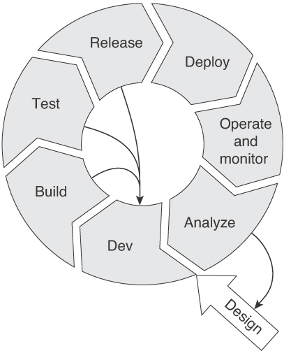
<figcaption><p><strong>Figure 6.1</strong> <em>Remaining system
development activities</em>.</p></figcaption>
</figure>

The organization of this chapter follows the life cycle, but
occasionally combines more than one phase in a section. In this chapter,
we assume that the system is developed using a microservices
architecture as described in [Chapter 2](#ch02.xhtml#ch02), [Software
Engineering Background](#ch02.xhtml#ch02).

::: section
### []{#ch06.xhtml#page_118 .pagebreak}6.1 Design {#ch06.xhtml#ch06lev1sec01 .h3}

We start with the "Design" arrow leading into the life cycle in [Figure
6.1](#ch06.xhtml#ch06fig01). Designing and developing the non-AI modules
and the AI modules should be done in close collaboration, as we discuss
next. Subsequently, we discuss design aspects of microservices in AI
systems. Modifiability is best addressed by designing for it, as we
explained in [Section 1.3](#ch01.xhtml#ch01lev1sec03), "[Life-Cycle
Processes](#ch01.xhtml#ch01lev1sec03)."

Some design decisions, such as how to cut microservices, will be
discussed in [Section 6.5](#ch06.xhtml#ch06lev1sec05), "[Release and
Deploy](#ch06.xhtml#ch06lev1sec05)." Those decisions are, in part,
driven by the need for independent deployability of the various
microservices.

::: section
#### *6.1.1 Co-Design/Development* {#ch06.xhtml#ch06lev2sec01 .h4}

Co-design and development is a process that originated between hardware
developers and software developers. Traditionally, the hardware was
designed first, and then the software was designed to fit the hardware.
This []{#ch06.xhtml#page_119 .pagebreak}caused problems because
sometimes the hardware constraints made designing the software very
difficult.

Co-design and development means that the design and development of the
hardware and software are done in parallel, not sequentially. This
allows for negotiation about how functions should be divided between the
hardware and the software, and results in systems for which the
integration process is much faster and smoother than if the designs were
done sequentially.

Applying this concept to AI systems means that the AI model development
is done in parallel with the design and development of the non-AI
modules. AI developers have different expertise from non-AI developers,
and carrying out the design of the two portions in parallel allows for
collaboration between the two groups and the discovery and resolution of
potential problems prior to the integration stage. Ideally, some
developers will have a lot of expertise across both fields---you, as a
reader of this book, may be a prime example of that---and such broad
expertise will make the co-design and development smoother and faster.

Co-design and development means that interdisciplinary teams should be
set up to jointly develop the portion of the design that affects both
the AI and the non-AI modules. Be aware that interdisciplinary teams
frequently encounter problems due to vocabulary and cultural
differences. Bruce Tuckman characterized the team formation stages as
"forming, storming, norming, \[and\]
performing."^[1](#ch06.xhtml#ch06fn1){#ch06.xhtml#ich06fn1}^ If you set
up such a team, ensure that the members have a mechanism to resolve
problems that arise during team development.

[1](#ch06.xhtml#ich06fn1){#ch06.xhtml#ch06fn1}.
<https://en.wikipedia.org/wiki/Tuckman%27s_stages_of_group_development>
:::

::: section
#### *6.1.2 Using Microservices* {#ch06.xhtml#ch06lev2sec02 .h4}

In general, we advocate using a microservices architecture. Packaging
services as containers fits well with such an architecture. However,
very rarely does "one size fit all." In other words, there are occasions
when a microservice is not the most appropriate mechanism to use with a
portion of your architecture.

All design decisions represent tradeoffs---and that is certainly true
with microservices. The tradeoff in this case is between efficiency and
speed of development and deployment. Microservices are small and managed
by a single team. That team can make a lot of decisions about
development and deployment of their microservice without coordinating
with other teams. []{#ch06.xhtml#page_120 .pagebreak}The lack of need
for coordination and the small size of microservices makes for speedier
development and deployment.

However, microservices must communicate through messages. Messages
typically travel over the network, and the network speeds are at least
an order of magnitude slower than memory accesses. Thus, relying on
messages to communicate will negatively impact the efficiency of your
system.

The basic techniques to reduce the reliance on network communication are
to reduce the network requirements. This is accomplished by either
caching results or by collocating microservices on the same host.

-   Caching saves the results of a network request so that these results
    are available in memory. This technique is frequently used in
    database requests and can be used for AI model requests.

-   Collocation allows the communication between two microservices to be
    done in memory rather than using the network to send messages. You
    typically still have the overhead for packaging data into messages.

If some portions of your system are not suitable for microservices, then
they should be identified and not be packaged as microservices. These
portions should be kept as small as possible, while recognizing the
implications of using larger components for deployment speed and
coordination overhead.
:::

::: section
#### *6.1.3 Designing for Modifiability* {#ch06.xhtml#ch06lev2sec03 .h4}

Things change. This is a fact of life. When designing an AI system,
anticipating the types of changes will make it easier to modify the
system to respond to those changes in the future. Designing your system
with low coupling between components and high cohesion within a
component will enable you to localize changes to the greatest extent
possible. Coupling is a measure of how much the responsibilities in two
different components overlap. If the same responsibility is computed
multiple times in different components, then a change in that
responsibility must involve those different components. Cohesion is a
measure of how well a component is focused on a single task. Again, the
goal is to localize changes to as few components as possible.

In an AI system, the items that are likely to change include the data
used to train the model and the choice of which models to use. If the
data used to train the model changes, then MLOps has techniques to track
and manage these changes. Designing to allow for model changes, however,
is more complicated.

[]{#ch06.xhtml#page_121 .pagebreak}The standard technique to allow for
changes in a component is to create an intermediary between the clients
of that component and the component itself. In terms of the model, this
means that clients of a model, which we are assuming are packaged as a
container, will interact with an intermediary, which in turn interacts
with the model. This intermediary can be used to buffer changes to the
model. The Strategy design pattern might be applied here, to make it
easier to switch between different versions of the implementation.

As a simple example, suppose a new version of the model modifies its
interface. The intermediary then translates invocations from the client
into the new interface. Thus, the client is unchanged and the
modifications to reflect the change in the model interface are localized
to the intermediary. Using an intermediary to manage interface changes
is one technique we recommend to mitigate version skew during
deployment, as we discuss in [Section 6.5.3](#ch06.xhtml#ch06lev2sec06),
"[Version Skew](#ch06.xhtml#ch06lev2sec06)."
:::
:::

::: section
### 6.2 Developing Non-AI Modules {#ch06.xhtml#ch06lev1sec02 .h3}

A module is a coherent piece of functionality. A service is constructed
through the integration of multiple modules and their supporting
libraries during the build step.

When a microservices architecture is adopted, each service can be
developed in the language and using the technologies the owning team
chooses. The individual modules within a service must adhere to the
choices made by the owning team members, but there is no need for one
team to coordinate with another team about choice of language or
supporting libraries.

A unit test is a test within a single module, with a set of defined
inputs and outputs. The inputs are provided to the module through a test
harness, which compares the module's output with the expected output.
Unit tests are run during development and again during the testing phase
of the system, as we will discuss later in this chapter.

It is useful to include dependent infrastructure such as load balancers
in the test harness so that the interactions of the module with the
infrastructure can be tested. Dependent services are either mocked or
stubbed to enable the tests to execute. Unit tests should cover the
following cases:

-   Common use cases

-   Edge cases (unusual inputs or unexpected situations)

-   Negative cases (inputs that should result in errors or appropriate
    warnings)
:::

::: section
### []{#ch06.xhtml#page_122 .pagebreak}6.3 Build {#ch06.xhtml#ch06lev1sec03 .h3}

The build stage is where the executable image of a VM or container is
prepared (see [Chapter 2](#ch02.xhtml#ch02), [Software Engineering
Background](#ch02.xhtml#ch02)). In this stage, the AI modules and the
non-AI modules are merged into an executable image, as illustrated in
[Figure 6.2](#ch06.xhtml#ch06fig02).

<figure id="ch06fig02" class="figure">
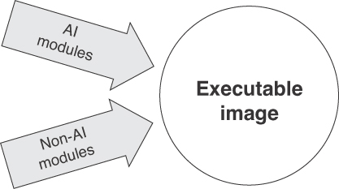
<figcaption><p><strong>Figure 6.2</strong> <em>Merging AI and non-AI
modules</em>.</p></figcaption>
</figure>

The build environment is activated when either the AI model has been
released or a non-AI module is checked into version control. Because the
AI model is packaged as a code module, the AI model and the non-AI
modules are treated identically during build. The build environment
creates a deployable executable by using a continuous integration (CI)
server such as Jenkins. [Figure 6.3](#ch06.xhtml#ch06fig03) depicts the
activities of the CI server.

<figure id="ch06fig03" class="figure">
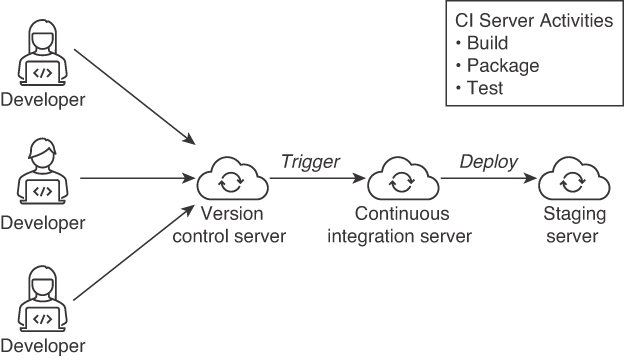
<figcaption><p><strong>Figure 6.3</strong> <em>Activities of the build
server</em>.</p></figcaption>
</figure>

[]{#ch06.xhtml#page_123 .pagebreak}The CI server can be triggered by a
developer committing a change to the version control system or releasing
a new model. This server loads the latest versions of all elements of
the part of the system that will be included in the deployable image.
Some of these elements are retrieved from the version control system,
some are collected from the model repository, and some are dependencies
downloaded from other sources. The CI server then places the created
image on a staging server, from which tests will be run and the image
will subsequently be deployed.

The CI server also creates a range of build metadata such as a version
manifest, a dependency graph, and a package manifest. This information
can be converted into a standard format like a software bill of
materials (SBOM), which enumerates the pedigree of all of the items
included in the deployable image. The SBOM will subsequently be used for
software supply chain management, compliance, and security purposes. We
discuss SBOM creation and access in more detail in [Chapter
11](#ch11.xhtml#ch11), [Observability](#ch11.xhtml#ch11).

In addition to the SBOM, the CI server should record all of the elements
that were involved in the build, such as the tests that were run.
Traceability of the elements of the software comes from these recordings
created in the build phase. Traceability with respect to AI model
outputs is discussed in [Chapter 11](#ch11.xhtml#ch11).
:::

::: section
### 6.4 Test {#ch06.xhtml#ch06lev1sec04 .h3}

Once an executable is constructed, tests can be performed. These tests
repeat the model and unit tests from MLOps and non-AI module
development. Recall from [Section 5.3.4](#ch05.xhtml#ch05lev2sec09),
"[Repeatability](#ch05.xhtml#ch05lev2sec09)," that there may be some
nondeterminism in the tests of the AI model portion. This nondeterminism
is controlled as we discussed in [Section
5.3.4](#ch05.xhtml#ch05lev2sec09). During the unit tests and the MLOps
tests, any portions of the system not being tested were stubbed or
mocked. Removing the stubs and mocks may reveal some unanticipated side
effects. System-wide tests are specifically constructed to test aspects
of the end-to-end execution of the system, and should be run in a
suitable test environment, such as a staging environment. System tests
can be derived from the following sources:

-   **User stories:** User stories are one form of requirements
    specification. They should include expectations for the AI model as
    well as expectations for system behavior. *Sunny day* is a term
    referring to everything working as expected; *rainy day* is a term
    referring to things going wrong during execution. Both sunny day and
    rain day scenarios should be []{#ch06.xhtml#page_124 .pagebreak}run
    as portions of the test suite, as should be negative tests (i.e.,
    tests in which the system should deny a type of request, not change,
    or not perform an action).

-   **Regression testing:** A regression test seeks to determine whether
    an error that has supposedly been fixed has later been reintroduced.
    This can happen when multiple versions of a system are in various
    stages of development simultaneously on different branches of the
    version control tree.

-   **Compatibility testing:** Test the system across different web
    browsers and platforms. If your system is intended to be used in
    different environments, you will want to test with as many of those
    environments as possible.

-   **Install/uninstall testing:** The service should be installed with
    a script. Once the build has been completed, this install script can
    be tested in an environment distinct from production so that errors
    can be detected. Sometimes, systems must be uninstalled. Again, the
    build environment can be used to test the uninstall script.

-   **Efficiency or performance testing:** The system can be tested
    under various loads during the test phase. Load generators can be
    used to provide synthetic inputs according to various distributions.
    Scaling can be tested in the same process. As the load grows, new
    instances should be generated through autoscaling. Testing whether
    new instances are correctly registered with a load balancer should
    be part of the efficiency testing process. Similarly, shrinking
    loads and the corresponding termination of machines should be
    tested, and the absence of issues stemming from termination should
    be assured. In [Chapter 8](#ch08.xhtml#ch08),
    [Performance](#ch08.xhtml#ch08), we enumerate a number of
    performance concerns for the AI model; tests for these concerns
    should be incorporated in the test suite as well. However,
    exhaustive performance testing can be time- and resource-intensive,
    so the performance tests typically are not included in every run of
    the continuous integration (CI)/continuous deployment (CD) pipeline.

-   **Security testing:** A variety of security tests can also be
    performed during the build stage. These include distributed denial
    of service testing, penetration testing, vulnerability scanning, and
    misconfiguration testing. In [Chapter 9](#ch09.xhtml#ch09),
    [Security](#ch09.xhtml#ch09), we describe a number of potential
    attacks on the AI model, and these should also be tested.

-   **Compliance testing:** Software systems may be subject to a variety
    of regulations, such as the Health Insurance Portability and
    Accountability Act (HIPAA) and the General Data Protection
    Regulation (GDPR). []{#ch06.xhtml#page_125 .pagebreak}Testing should
    verify that the system complies with the relevant regulations. For
    example, according to GDPR, users should be able to request all data
    about themselves, and such functionality should be tested.

Automating system tests will make the testing process go faster and
provide a record of the tests that were performed. The reliance on
repetitive manual testing should be minimized as far as possible, as
this will hamper the speed of delivery.

Tests should be repeatable. If a test does not generate the same results
every time it is executed, finding the source of an error can be
difficult---recall the specific concerns regarding AI model testing
discussed in [Chapter 5](#ch05.xhtml#ch05). Tests that are not
repeatable may be caused by one or more of the following factors:

-   The test database has not been restored following previous tests. If
    a test modifies the test database, then subsequent tests will not
    begin from the same state and may produce different outputs. The
    test database should be reinitialized following every test.

-   The system time may depend on which other activities your system is
    performing. Systems are prone to having numerous background tasks
    that can affect the timing of results. Your system may have inherent
    concurrency issues that will affect the output.

-   Probabilistic AI models may produce different results at different
    times. With these models, the results may depend on random factors.
    If a test does not produce the expected result, repeating the test
    several times and averaging the results may produce a more
    acceptable result.
:::

::: section
### 6.5 Release and Deploy {#ch06.xhtml#ch06lev1sec05 .h3}

Systems change. Bugs are fixed. Features are added. In addition, AI
models may be updated for a variety of reasons:

-   **Data drift:** Over time, the distribution of data the model
    encounters in production can deviate from the data it was originally
    trained on, a phenomenon known as data drift. This can manifest as
    covariate drift (changes in the input features), label drift
    (changes in the distribution of the target variable), or data drift
    (changes in the relationship between input features and the target).
    These shifts can result from factors such as evolving user behavior
    or changes in the underlying system generating the data, and can
    impact model performance if not addressed.

-   []{#ch06.xhtml#page_126 .pagebreak}**Improved data:** Over time, the
    model may encounter additional or updated data in production that
    wasn't available during the initial training. Although this doesn't
    necessarily indicate a shift in the underlying data distribution (as
    in data drift), it is crucial to periodically retrain the model to
    incorporate this new data and improve its accuracy and effectiveness
    in capturing emerging patterns or trends.

-   **Changing requirements:** The requirements for the model may change
    over time. For example, you may need to improve the model's
    accuracy, or you may need to add new features to the model. In these
    cases, you will need to retrain the model with new data or modify
    the model architecture.

-   **Bias detection and mitigation:** As the model is used in
    production, it may become apparent that the model is biased in some
    way. This can happen because the data that the model was trained on
    or the way the model was designed had inherent biases.

-   **Security vulnerabilities:** ML models can be vulnerable to
    security attacks. For example, an attacker could try to trick the
    model into making incorrect predictions. Security patches may cause
    a new version of the model to be generated.

An important best practice from DevOps is to have a single, well-defined
release and deployment process for a system. This process includes
strong quality gates, typically relying on an array of tests like those
just described. Any change, no matter how small, must go through that
process---including changes to configuration parameters, infrastructure
code, Al models, and customization such as system prompts.

Some systems require a human to release the system to deployment for
regulatory or legal reasons. One question that arises is the frequency
of new releases. They can occur on a defined schedule or continuously.

::: section
#### *6.5.1 Defined versus Continuous Releases* {#ch06.xhtml#ch06lev2sec04 .h4}

A key business decision is whether to deploy modifications according to
a predefined schedule or as they are prepared.

::: section
##### Defined Releases {#ch06.xhtml#ch06lev3sec01 .h5}

Historically, new versions of systems were released according to a
schedule. A vendor would announce that a new release would be available
on a fixed date and that the new release would contain bug fixes,
security patches, and specified new or modified features. When that date
arrived, the new version would []{#ch06.xhtml#page_127 .pagebreak}be
made available to the IT group of an organization. They would test the
new release, shut down the existing version, and install the new
version. Release schedules of weeks or months were common. Selected
users or user organizations would be exposed to preview releases (beta
releases) of the new version, and would provide feedback to the vendor
to allow for improvements in the release prior to making the new version
generally available.

A defined release schedule offers the following benefits:

-   **Predictability:** All stakeholders know when a new release is
    coming. This allows developers to set their schedules, customers to
    anticipate changes, and IT organizations to plan their activities
    around the arrival of the new release. An IT organization, for
    example, may need to order new computers or servers to run a new
    system, which could be a time-consuming process.

-   **Thorough testing:** The release schedule can be designed to allow
    for adequate testing and approval activities.

-   **Software architecture independence:** The software architecture of
    the system and its new versions is not a factor in deploying a new
    release. A system can be designed using any software architectural
    style and then deployed as a unit when the pieces of the
    architecture are available and tested.

The drawbacks of defined releases have made this practice much rarer:

-   **Time to market:** A new feature or bug fix is not available until
    the next scheduled release, possibly months away. This can give rise
    to out-of-cycle releases, as important bug fixes such as security
    patches or model updates are done independently of a release cycle.
    Out-of-cycle releases typically do not undergo the thorough testing
    of planned releases and consequently lead to higher error rates.

-   **Schedule pressure:** As deadlines near, the stress on the
    development team increases. Deadlines tend to shorten because of
    time-to-market pressures, so teams are frequently under severe
    stress.

-   **Schedule slippage:** Many different teams are involved in
    preparing a release, including those that produce dependencies. If
    any of these teams does not make its deadline, the whole release is
    delayed.

These drawbacks along with the emergence of microservices architecture
led to the practices of continuous delivery and continuous deployment.
:::

::: section
##### []{#ch06.xhtml#page_128 .pagebreak}Continuous Deployment {#ch06.xhtml#ch06lev3sec02 .h5}

Continuous deployment (CD) is the practice of automatically placing
changes to the code base or model into production. It is essentially an
extension of CI. When a developer commits code to a version control
system, the continuous deployment pipeline (CDP) automatically builds
the executable with the latest code and models, tests it, and---if all
quality gates are passed successfully---deploys it into production.

Continuous delivery is closely related to CD, except that the final
step---placing the system into production---is a business decision made
and implemented by a human. One reaction to past financial scandals has
been the establishment of mandates stating that a person must take
responsibility for approving changes to a software system, at least in
business contexts such as banking.

CD assumes that the deployable pieces are small---that is,
microservices. A microservice is a deployable unit with a limited scope.
This limited scope means that integration with other microservices is a
matter of interface compatibility and not a matter of programming
language, versions of dependent software, or technology used.
Microservices that are stateless are particularly amenable to
independent deployability, which can be achieved by pushing all state to
either the client or the persistence layer of the microservices. An
alternative approach is to cut the application into microservices
"vertically," such that each microservice covers, for a small piece of
functionality, everything from the top-level service interface to the
client to the persistence layer. Again, independent deployability
follows. Al models can be encapsulated as stateless services, as long as
they are not updated on the fly and usage data is stored elsewhere.
Vertical cutting of services might imply that a single microservice
would be responsible for the UI, front end, back end, database, and ML
model. This set of responsibilities might prove too much for a small
team, in which case you should deviate from a pure vertical cutting
logic and split these responsibilities into two or more services, with a
small team devoted to each service.

Recall that ML models are packaged as containers or independent
services. In either case, updates to an ML model can be placed into
production through CD quite rapidly.
:::
:::

::: section
#### *6.5.2 Deployment Patterns* {#ch06.xhtml#ch06lev2sec05 .h4}

The build step creates an executable image of a service and places it
onto the staging server. If the reason for creating the build image is
to update an existing version of a service, one consideration is whether
it is acceptable to []{#ch06.xhtml#page_129 .pagebreak}interrupt service
so as to deploy the new version. If service is to be maintained
throughout the update process, then the old version must be gracefully
replaced by the new version so that service to the users continues.
Uninterrupted service is complicated by the fact that multiple instances
of the version to be replaced may exist because of the load on the
service.

Two methods exist for updating an existing service without interruption:
blue/green and rolling upgrade. We explore these methods by using the
following example: Assume *N* instances (containers or virtual machines
\[VMs\]) of Service A are to be replaced by *N* instances of service A′.

::: section
##### Blue/Green Deployment {#ch06.xhtml#ch06lev3sec03 .h5}

Blue/green deployment is also called red/black deployment, or you could
choose your own colors. This option allocates *N* new instances at once
and populates each with Service A′. After the *N* instances of Service
A′ are installed, requests for the service are sent to Service A′ and
the *N* instances of Service A are drained and terminated.
:::

::: section
##### Rolling Upgrade {#ch06.xhtml#ch06lev3sec04 .h5}

A rolling upgrade replaces the instances of Service A with instances of
Service A′, one at a time. (In practice, you can replace more than one
at a time, but only a small fraction is replaced in any single step.)
The steps of the rolling upgrade are as follows:

1.  Allocate a new instance.

2.  Install Service A′.

3.  Begin to direct requests to Service A′.

4.  Drain traffic from one instance of Service A and then terminate that
    instance.

5.  Repeat the above steps until all instances have been replaced.
:::

::: section
##### Tradeoffs {#ch06.xhtml#ch06lev3sec05 .h5}

There are two tradeoffs between the blue/green and rolling upgrade:

-   **Financial:** The peak resource utilization for a blue/green
    approach is 2*N* instances, whereas the peak utilization for a
    rolling upgrade is *N* + 1 instances. Before cloud computing, an
    organization had to purchase []{#ch06.xhtml#page_130
    .pagebreak}physical computers to perform the upgrade. Most of the
    time, there was no upgrade in progress, and these additional
    computers went unused. This made the financial tradeoff clear, and
    the rolling upgrade was the standard approach. Now that computing
    resources are rented rather than purchased, the financial tradeoff
    is less compelling; even so, the rolling upgrade is still widely
    used.

-   **Responding to errors:** Suppose you detect an error in Service A′
    when you deploy it. Despite all the testing you did in the
    development, integration, and staging environments, when your
    service is deployed to production, there may still be the rare
    occurrence of a latent error. If you are using blue/green
    deployment, by the time you discover an error in Service A′, all of
    the instances of Service A may have been deleted and rolling back to
    Service A could take some time. Therefore, it is a good idea to
    observe Service A′ in production before switching off Service
    A---but at some point you need to do that, and you might detect
    issues only later. In contrast, a rolling upgrade may allow you to
    discover an error in Service A′ while instances of Service A are
    still available.
:::

::: section
##### Canary and A/B Testing {#ch06.xhtml#ch06lev3sec06 .h5}

Before rolling out a new release, it is prudent to test it in the
production environment, albeit with a limited set of users. This is the
function that beta testing used to serve; it is now done with canary
testing. Canary testing is named after the practice from the 19th
century of bringing canaries into coal mines. The coal-mining process
can release gases that are both explosive and poisonous. Because
canaries are more sensitive to these gases than humans, coal miners
brought these little birds into the mines and observed them for signs of
reaction to the gases. In essence, the canaries acted as early warning
devices for the miners.

In modern software use, canary testing means to designate a set of
testers who will use the new release. Sometimes, these testers are
so-called power users or preview-stream users from outside your
organization who are more likely to exercise code paths and edge cases
that typical users may use less frequently. Another approach is to use
testers from within the organization that is developing the software.
For example, Google employees almost never use the release that external
users would be using, but instead act as testers for upcoming releases.
Once a system passes its canary tests, it is released more generally.

A/B testing is another form of live testing in production. It is used to
compare two versions of a service, A and B, by performing an experiment
[]{#ch06.xhtml#page_131 .pagebreak}with real users to determine which of
the alternatives yields the best business results. More than two
alternatives can be tested simultaneously as well. Other users receive a
different treatment, B, from the remainder of the users. The test group
may be relatively small, but should be of meaningful size. The
difference can be minor, such as a change to the font size or form
layout, or more significant. The different categories of users are
compared based on a business metric, which is specific to the
application and organization. The results of the A/B tests will govern
the alternative to be chosen for full release.

A/B testing can also be used to perform experiments to find out which AI
model version performs better. In such cases, the group sizes for A and
B may be similar, to get good coverage of uses for the new version.
Generally speaking, the new version bears the risk of having problems
that are not known before the experiment, and as a consequence there is
a risk of exposing users to these problems. This issue should be
considered when choosing groups and group sizes. It can be managed by
starting with a small group for the new version, which is observed
closely. Then, if no major issues are detected, the group size is
gradually increased.
:::

::: section
##### Rollback {#ch06.xhtml#ch06lev3sec07 .h5}

Not every new version works correctly. Use in production may uncover
functional or quality issues that require a version to be replaced. Your
service should have service level objectives (SLOs). Once it goes into
production, you should monitor these SLOs to verify that they are being
met. If you find that they are not being satisfied, you may wish to
replace the release.

Two options exist for replacing a release: rollback and roll-forward.

-   *Rollback* means replacing the current version with an earlier
    version. This may involve discontinuing the deployment of the new
    release and redeploying a previous release that is known to meet
    your quality goals. A feature toggle is a conditional depending on a
    global variable; it is used to differentiate between two code
    segments. These two code segments could be code that implements the
    old version and code that implements the new version. If a feature
    toggle is used for this purpose, rollback could also be accomplished
    by turning off the feature toggle used to activate the new release.
    Feature toggles can be used to address version skew, as we explain
    in the next subsection.

-   *Roll-forward* means fixing the problem and generating a new
    version. This generally requires you to debug the problem and then
    be able to test and deploy the new version quickly.

[]{#ch06.xhtml#page_132 .pagebreak}In complex AI systems, sometimes
neither rollback nor roll-forward is possible. This may be the case when
the outdated version of the model no longer works sufficiently well, and
the newly updated version has issues. Depending on your context, it may
be prudent to have a fallback option, such as a fixed-rule--based system
instead of an ML model. With this approach, the system can still perform
core functions, albeit at a lower quality---a desirable property known
as graceful degradation.
:::
:::

::: section
#### *6.5.3 Version Skew* {#ch06.xhtml#ch06lev2sec06 .h4}

The purpose of CD is to speed up time to market. Together with the use
of microservices architecture, CD allows a development team to deploy
its new version, whether for a new feature, a bug fix, or an updated ML
model, without coordinating with or waiting on other development teams.
However, the lack of coordination among teams may lead to a phenomenon
known as version skew.

Version skew is a situation in which different versions of the same
software or its dependencies are running simultaneously within the same
system. It arises when instances of services will be deployed
independently and may become inconsistent---as the case with CD.
Inconsistency may also arise when a service is updated but its clients
have not yet been updated, and vice versa.

Two different types of version skew are possible: temporal inconsistency
and interface mismatch.

::: section
##### Temporal Inconsistency {#ch06.xhtml#ch06lev3sec08 .h5}

Temporal inconsistency occurs when two dependent entities are not
updated at the same time. In that case, either two instances of a
service are logically inconsistent, or a service is logically
inconsistent with one of its clients, because one entity has been
updated while the other has not.

For example, suppose there are two ML models. One is used to predict the
value of an independent variable of the second model. These two models
are packaged into one service. A client would make one call to the
service to get the value of the independent variable and then pass this
value back to the service on a second call. Suppose the update consists
of combining these two models into one model. A client has been updated
to assume one model, but the new model has yet to be deployed. In this
case, the client will get an incorrect response to its request.
:::

::: section
##### []{#ch06.xhtml#page_133 .pagebreak}Interface Mismatch {#ch06.xhtml#ch06lev3sec09 .h5}

Interface mismatch occurs when the interface of a service is modified.
If the new version of the service is updated but the client has not yet
been updated, then an error will occur. Similarly, if the client has
been updated to assume the new interface but the service has not yet
been updated, an error will occur.
:::

::: section
##### Mitigating Version Skew {#ch06.xhtml#ch06lev3sec10 .h5}

Both types of version skew can be mitigated by tagging messages with the
expected version of the service. It then becomes the responsibility of
the invoked service to correctly respond to the version number.

Every instance of a service should have a version number. This version
number is assigned by the CI server, and it can be based on the version
numbers of the elements of the service. A service can determine its
version number through introspection. A client could ascertain the
supported version number(s) through a query to the service.

The service is responsible for maintaining backward compatibility for a
reasonable number of older versions. In other words, it should support
requests intended for (at least some) early versions. Thus, in our
temporal inconsistency example, it would maintain the two older models.
In our interface mismatch example, it would support messages intended
for an older version.

If a service receives a request for a version that is newer than the
service's version, it should gracefully respond with an error indicating
that it has not yet been updated. The client can either resubmit the
request, as the new version of the service may have been installed on a
different instance; delay before resubmitting the request; or perform
the actions it would perform if it invoked a failed service.

Another method to mitigate version skew is based on feature toggles.
This tactic is applicable when your organization maintains tight control
over the client and the service---for example, when both roles are
played by microservices in your architecture. Suppose you want to
implement new feature X, which affects two microservices and the
interface between them. You create a new, system-wide feature toggle
"New_feature_X" and set it to false. Both services then implement their
respective parts of the new feature on independent time scales. However,
as long as the toggle remains false, the code related to the new feature
will not be used. At some point, both services will have been updated.
After sufficient testing, you can switch the toggle to true in
production, and the code for the new feature will become active in both
services.

[]{#ch06.xhtml#page_134 .pagebreak}Whichever way you decide to handle
the implementation of the new version of the feature across services, at
some point you must activate it and observe if it works in practice.
Once you have gained confidence that you can leave the feature switched
on, you should remove the old code and the mechanism for the switch in
all affected parts of the code base. Old, inactive code that
accidentally becomes activated after months or years can lead to
unintended, even highly adverse effects, so it should be removed when no
longer needed.
:::
:::

::: section
#### *6.5.4 Matching the Model to Resources* {#ch06.xhtml#ch06lev2sec07 .h4}

When deploying a system, the resource choices that were specified in the
architecture must be realized. These choices depend on the model size.
FMs, in particular, can be heavyweight models. The weight of the model
will determine the type of resources to which it can be deployed.

On the one hand, a lightweight narrow ML model typically has a
relatively small number of parameters, making it suitable for edge
devices. On the other hand, heavyweight FMs have a larger number of
parameters, providing more powerful capabilities but requiring more
computational resources. In terms of the location, a model can be
deployed on a server or at the edge. When a model is deployed by a third
party on a server, there is no maintenance cost for the users. Deploying
a model at the edge brings the processing closer to the data source,
reducing latency and allowing for real-time inference.

In terms of the serving mode, a model can be deployed either online or
offline. Online deployment involves making API calls to a remote server
for inference. This approach requires an active internet connection but
allows for stronger model governance. The API can be a separate software
module including additional governance and filtering mechanisms. In such
a case, you define its external interface but it has knowledge of the
saved model that enables it to interact with the model.

Packaging the API as a service and inside a container provides several
advantages:

-   It isolates the API service from the remainder of the system. This
    protects against vulnerabilities in other portions of the system.

-   It allows the API to be deployed independently, such as on an edge
    device. The resource constraints that exist for the FM are not
    applicable to the API, although the API will need adequate bandwidth
    to communicate with the model portion.

[]{#ch06.xhtml#page_135 .pagebreak}Offline deployment enables the model
to be served directly on a device without relying on internet
connectivity, making it suitable for scenarios where internet access is
limited or when real-time or offline inference is required. For example,
PaLM 2^[2](#ch06.xhtml#ch06fn2){#ch06.xhtml#ich06fn2}^ is available in a
range of sizes: Gecko, Otter, Bison, and Unicorn. Gecko is a lightweight
PaLM 2 that can be deployed on mobile devices and served offline. A
number of manufacturers, including
Apple,^[3](#ch06.xhtml#ch06fn3){#ch06.xhtml#ich06fn3}^
Microsoft,^[4](#ch06.xhtml#ch06fn4){#ch06.xhtml#ich06fn4}^ and
Google,^[5](#ch06.xhtml#ch06fn5){#ch06.xhtml#ich06fn5}^ are rolling out
platforms that strengthen edge devices' capacities to perform local
inference.

[2](#ch06.xhtml#ich06fn2){#ch06.xhtml#ch06fn2}.
<https://ai.google/discover/palm2>

[3](#ch06.xhtml#ich06fn3){#ch06.xhtml#ch06fn3}. Apple Intelligence:
<https://www.apple.com/apple-intelligence/>

[4](#ch06.xhtml#ich06fn4){#ch06.xhtml#ch06fn4}. Microsoft Copilot+ PCs:
<https://blogs.microsoft.com/blog/2024/05/20/introducing-copilot-pcs/>

[5](#ch06.xhtml#ich06fn5){#ch06.xhtml#ch06fn5}.
<https://blog.google/products/pixel/google-pixel-9-new-ai-features/>
:::
:::

::: section
### 6.6 Operate, Monitor, and Analyze {#ch06.xhtml#ch06lev1sec06 .h3}

Once a system has been deployed, it begins to provide service to users.
Actually providing service entails several aspects that we will discuss
in this section. During operation, you collect data, which you analyze
to inform the next round of design and development. We begin with
monitoring.

::: section
#### *6.6.1 Monitoring* {#ch06.xhtml#ch06lev2sec08 .h4}

An AI system often has a great many services and connections among its
elements. To improve efficiency, troubleshoot failures, and sanitize
both inputs and outputs, it is important to be able to observe the
resource usage and activities of the various services that constitute
the system. This observation is done by monitoring the activities. We
discuss the quality attribute of observability in more detail in
[Chapter 11](#ch11.xhtml#ch11).

Monitoring data comes from three sources: the infrastructure, the system
code, and the logs produced by the services. The infrastructure gathers
utilization measures for VMs and containers. These utilization measures
are metrics of resource usage---CPU, I/O, network, and memory. The
system code should record application-specific metrics, such as the
number of active sessions and new accounts created. These metrics can be
collected and managed through the same tools as the infrastructure
metrics. Logs are generated by a service and placed in a known location
on the local file system; from there, they are typically collected and
forwarded to a log database/system []{#ch06.xhtml#page_136
.pagebreak}for processing. Logs are used to record service-specific
information. In AI systems, logs and metrics include aspects such as
model accuracy, data drift, ethical issues, and broader societal impact.
If this information is not recorded, it will be lost.

Logs and metrics should be moved to a database in a monitoring system,
where the information can be used for three purposes:

-   **Generating alerts:** Measurements---in particular, metrics---are
    used to generate alerts that indicate a serious problem with a
    system in operation. This constitutes an incident that often
    requires a fast response.

-   **Forensics:** When a problem has occurred, it must be identified.
    Logs collected by the system in response to events are used to
    identify the problem.

-   **Analysis:** Analysis is performed both in real time and at a later
    time. The real-time analysis determines whether the system is
    meeting predefined standards for performance, both efficiency and
    accuracy. If the standards are not met, an alert is generated. The
    analysis performed after the fact can be more wide-ranging---for
    example, for data drift, biases, and compliance with various
    regulations.

Selected monitoring data, especially data indicating shifts in data
patterns or emerging trends, is channeled back into the feature store.
This enables the refinement of features used in ML models, ensuring they
remain relevant and effective. The feature store, in turn, feeds this
refined data back into the training pipeline, leading to model upgrades.
:::

::: section
#### *6.6.2 Incidents* {#ch06.xhtml#ch06lev2sec09 .h4}

An incident is an event that could lead to loss of, or disruption to, an
organization's operations, services, or functions. In software terms, an
incident is either a logical problem, an efficiency problem, an
availability problem, or a security problem. Logical incidents include
deviation from the predefined standards.

The monitoring systems have rules that examine the monitored data and
decide whether to generate an alert. Alerts are sent to a first
responder, whose responsibilities are both immediate and delayed. The
immediate response is to ensure the system continues to be operational;
this is done in real time when the alert is received. The delayed
response is to work with the software developers or model developers to
determine the root cause of the problem and prevent it from recurring.

[]{#ch06.xhtml#page_137 .pagebreak}The role of first responder will vary
depending on your organizational structure. Site reliability engineers
are designated first responders in some organizations. They constitute a
separate organizational unit and may be tasked with supporting multiple
systems. Other organizations task developers and AI engineers with being
first responders.

In any case, first responders are on duty for designated periods, night
and day. The specifics of the shifts of a first responder will vary
depending on the organization. A typical shift might be 24 hours, and
each individual might be on duty once a week.
:::

::: section
#### *6.6.3 Data Drift* {#ch06.xhtml#ch06lev2sec10 .h4}

Models are trained on data that represents the world at the time of the
model's creation. Of course, the world evolves, and it may eventually
drift away from the model, even to the point where the model's
predictions are not reflective of real-world situations. The disruptions
that occurred in supply chains during the COVID-19 pandemic are an
example of a radical change that could affect a model, but others are
more subtle.

Some specific techniques to detect drift are highlighted here:

-   **Monitoring model performance metrics:** Regularly track key
    performance metrics relevant to your specific application. These
    metrics might be accuracy, precision, recall, F1 score, or custom
    metrics, depending on your needs. Sudden drops in these metrics can
    indicate potential drift.

-   **Statistical tests:** Utilize statistical tests like the
    Kolmogorov--Smirnov (KS) test or the chi-squared test to compare the
    distribution of incoming data with the distribution of the training
    data. Significant deviations suggest data drift.

-   **Control charts:** Create control charts to visualize the trends of
    your performance metrics over time. Control charts allow you to set
    upper and lower bounds based on historical performance. Points
    falling outside these bounds can indicate a shift in the data.

-   **Concept drift detection algorithms:** Specialized algorithms can
    be employed to explicitly detect concept drift. These algorithms can
    continuously monitor data streams and raise alerts when they detect
    significant changes in the data distribution. Some examples include
    early drift detection (EDD) and the cumulative sum (CUSUM)
    technique.

[]{#ch06.xhtml#page_138 .pagebreak}One issue with monitoring the
accuracy of a model is that recognition of the ground truth can be
delayed. For instance, consider an AI model designed to predict the
long-term environmental impact of a new infrastructure project, such as
a dam or a highway. The true environmental consequences, encompassing
changes in local ecosystems, biodiversity, and geological stability, may
become fully apparent only years, or even decades, after the project's
completion. Using a proxy measure, if one can be found, is a technique
for dealing with delayed ground truth.
:::

::: section
#### *6.6.4 Dynamic Model Updating* {#ch06.xhtml#ch06lev2sec11 .h4}

Several types of dynamic model updates can occur while a model is in
production. One type is online learning, where the model's weights are
continuously updated in real time as new data comes in. Another method
involves deploying small, incremental updates or patches to the model.
Although these techniques allow for rapid adaptation to new data, they
come with significant tradeoffs.

In some cases, dynamic updates can bypass the standard quality assurance
(QA) processes, as the model's parameters are adjusted on the fly
without going through the full testing and validation pipeline. This can
lead to concerns about the reliability and stability of the model, as
well as the potential for unintended consequences in production.

In contrast, other dynamic update approaches, such as those employed in
CD frameworks, can ensure that new updates go through the entire QA
process before being put into production. This allows for quick
deployment while still maintaining rigorous quality control.

We advise caution when dynamically updating a model in production
without the full QA process. Such out-of-cycle updates can circumvent
many of the quality control and logging measures included in the
standard deployment pipeline. This can result in infrastructure drift,
where the production environment becomes misaligned with its original
configuration, and also increases the attack surface from a security
perspective.
:::

::: section
#### *6.6.5 Chaos Engineering* {#ch06.xhtml#ch06lev2sec12 .h4}

Chaos engineering is the practice of conducting experiments on
distributed systems to build confidence in the system's capability to
perform reliably under turbulent production conditions. In chaos
engineering, an experiment (or test) deliberately introduces a failure
into the system. A hypothesis is developed about what should happen,
which defines the passing conditions for the test. The actual response
of the system to the failure then determines []{#ch06.xhtml#page_139
.pagebreak}whether the test passes or fails. Chaos engineering depends
on having sufficient observability into your system to be able to detect
(and then diagnose and fix) a system failure. It also depends on having
an appropriate process to ensure that the effects of the test are
controlled.

The test can involve data, the model, or the infrastructure. The various
categories of tests and some examples of them are listed here:

1.  Data tests:

    -   Data poisoning: Injecting adversarial or corrupted data into the
        model's training or serving pipeline.

    -   Data drift: Simulating changes in the distribution of real-world
        data over time to ensure the model remains accurate.

    -   Data outage: Testing how the system copes with temporary or
        complete data loss.

2.  Model tests:

    -   Model drift: Monitoring model accuracy metrics over time to
        detect gradual degradation.

    -   Model version mismatch: Introducing inconsistencies between
        different versions of the model deployed in production.

    -   Feature ablation: Removing crucial features from the model's
        input to assess its robustness and level of dependence.

3.  Infrastructure tests:

    -   Resource constraints: Simulating limited CPU, memory, or network
        bandwidth to evaluate system efficiency under resource scarcity.

    -   Dependency failures: Introducing controlled outages or errors in
        external services the AI system relies on.

    -   Deployment failures: Testing rollback and recovery procedures in
        case of deployment issues.
:::

::: section
#### *6.6.6 Analysis* {#ch06.xhtml#ch06lev2sec13 .h4}

When analyzing AI systems in the life cycle, the goal is to understand
when and how to best change the system---that is, to inform the next
iteration of the design and development activities. Such data-driven
decision making is a great tool to optimize systems. However, you should
know when *not* to use it: You need a vision of the future state of the
system, and data-based analysis will often not give you that. Generally
speaking, for understanding []{#ch06.xhtml#page_140 .pagebreak}user
behavior and optimizing a system, data-based analysis is very useful. To
analyze data, your system has to emit the data, and you have to collect
and process it to get useful insights.

There is typically a lot of overlap between data collected for
monitoring (discussed earlier in this section) and data collected for
analysis, and much has been written about analysis for non-AI systems. A
few aspects that are specific to AI systems are described here.

First, engineers must consider the interdependencies and data flows
between the AI and the non-AI portions of the system. This involves
assessing how AI decisions impact traditional components, and vice
versa, as well as examining data quality and compatibility across the
system.

As mentioned earlier, you should monitor for concept drift: Degrading AI
model performance may require switching to alternative models or
training. Additional aspects relevant for retraining involve tracking
the amount and quality of new data being collected during operation.
Such metrics help determine when sufficient novel data has accumulated
to warrant model updates. The frequency of retraining or system changes
should be based on a combination of factors, including drift detection,
performance degradation, and the availability of enough new data.
Establishing thresholds for these metrics allows for informed decision
making about when to initiate retraining or system modifications,
balancing the need for up-to-date models with the costs and potential
disruptions associated with frequent updates.
:::
:::

::: section
### 6.7 Summary {#ch06.xhtml#ch06lev1sec07 .h3}

The life cycle discussed in this chapter starts with the design phase.
Microservices architecture--based designs allow for speedy development
and deployment. Modifiability and observability can be achieved more
easily if they are considered in the initial system design.

Following development, an executable is built by a CI server. Included
in the build are AI models packaged as modules. They are integrated with
the non-AI modules as well as with libraries and dependencies.

Once the executable is built, it is subjected to a variety of tests.
Ideally, these tests should be automated. The tests include both
functional tests and quality tests. Although the AI models should have
been tested during their development, the system tests examine how these
models perform when integrated with the remainder of the system.

When the system has been tested, it can be deployed. CD is an automated
process that leads directly to deployment. Deployment can be done as
either []{#ch06.xhtml#page_141 .pagebreak}a rolling upgrade or a
blue/green deployment. Canary testing is the process of deploying the
system to a subset of users to help detect problems before the system is
rolled out to all users.

Having an automated CI/CD pipeline and implementing a single release
process with strong quality gates are key to achieving high quality and
speed simultaneously. Some authors advocate live updates to Al models,
but we do not recommend this practice given the risks posed by changes
to the production system that do not go through the QA phase of the
standard release process.

During operations, activities are monitored. This monitoring information
is used to generate alerts or as the basis for further analysis.
:::

::: section
### 6.8 Discussion Questions {#ch06.xhtml#ch06lev1sec08 .h3}

1.  Should a system be required to pass all of its tests during the
    testing phase before being placed into production? Why or why not?

2.  The system test stage repeats the unit tests performed on the AI
    models and the non-AI modules. Why?

3.  Chaos engineering affects instances in production. Discuss the pros
    and cons of performing chaos engineering.
:::

::: section
### 6.9 For Further Reading {#ch06.xhtml#ch06lev1sec09 .h3}

For a discussion of the DevOps life cycle for non-AI systems, see
*Deployment and Operations for Software Engineers* by Len Bass and John
Klein \[[Bass 19](#ref.xhtml#ref7)\].

For more DevOps knowledge, see our earlier book: *DevOps: A Software
Architect's Perspective* by Bass et al. \[[Bass 15](#ref.xhtml#ref8)\].

The classic source of design patterns, like the Strategy pattern, is
*Design Patterns: Elements of Reusable Object-Oriented Software* by
Erich Gamma, Richard Helm, Ralph Johnson, and John Vlissides \[[Gamma
95](#ref.xhtml#ref18)\].

C. Huyen's *Designing Machine Learning Systems: An Iterative Process for
Production-Ready Applications* \[[Huyen 22](#ref.xhtml#ref22)\] is a
good source for designing AI systems for production.

You can find more insights on architecting ML systems in *Software
Architecture Challenges for ML Systems* by Lewis et al. \[[Lewis
21](#ref.xhtml#ref28)\].

For industry insights into operating AI systems, see *Operationalizing
Machine Learning: An Interview Study* by Shankar et al. \[[Shankar
22](#ref.xhtml#ref45)\].

For industry insights on sharing software package information across the
supply chain and its relevance to AI systems, see *An Empirical Study
[]{#ch06.xhtml#page_142 .pagebreak}on Software Bill of Materials: Where
We Stand and the Road Ahead* by Xia et al. \[[Xia
24B](#ref.xhtml#ref58)\].

Two AI incident databases can be found here:
<https://oecd.ai/en/incidentsandhttps://incidentdatabase.ai/>.
:::
:::
:::

[]{#ch07.xhtml}

::: {#ch07.xhtml#book-content}
::: {#ch07.xhtml#sbo-rt-content}
## []{#ch07.xhtml#page_143 .pagebreak}*7* {#ch07.xhtml#ch07 .h2}

## *Reliability* {.chap_ttl}

*I am a man of my word . . . and that word is "unreliable."*

---Demetri Martin

R[ELIABILITY REFERS TO]{.smallcaps} the consistent and accurate
performance of a system over time, under various conditions, and without
failure. It encompasses the system's ability to produce correct and
trustworthy outputs, even when faced with unexpected inputs or changes
in its environment.

::: section
### 7.1 Fundamental Concepts {#ch07.xhtml#ch07lev1sec01 .h3}

Different facets of the definition of reliability are worth emphasizing.
In this section, we identify "specified operating conditions," "despite
unexpected inputs," and "changes in the environment." We also define
"fault, error, and failure" as a means for framing the discussion.

::: section
#### *7.1.1 Under Specified Operating Conditions* {#ch07.xhtml#ch07lev2sec01 .h4}

In the traditional sense, reliability is the probability that a system
will perform in a satisfactory manner for a given period when it is used
under the specified operating conditions. This definition underscores
the importance of the specified conditions---operating within its
intended environment, not under all possible conditions.

In the field of AI, the concept of reliability is broadened to include a
model's capacity to perform effectively when introduced to new data.
This new data should either fall within the distribution of the training
data or be similar to it, essentially ensuring it is not out of
distribution (OOD). Ideally, the training data will represent the
real-world scenario the model is intended to address. There's an
underlying assumption that the model is capable of generalizing well
from its training. This means the model should avoid
[]{#ch07.xhtml#page_144 .pagebreak}overfitting---it ought to discern and
learn the fundamental patterns in the training data without becoming
excessively tailored to the specific examples it was trained on.
Therefore, an AI model's reliability is anchored not just in its
accuracy, but also in its ability to uphold this level of accuracy
across various situations that resemble or align closely with its
training data---a key aspect of generalization.

Consider an AI system designed for predicting housing prices based on
various factors such as location, size, and amenities. If it was trained
on a diverse set of housing data from urban areas, its reliability is
measured by how well it predicts prices for new urban housing listings
that share characteristics with the training data---an illustration of
generalization within the distribution. However, if the same system is
applied to rural housing data, a scenario it wasn't trained for, it may
struggle. This challenge falls more into the realm of robustness---a
different facet from reliability, but equally important in the broader
context of AI applications.
:::

::: section
#### *7.1.2 Operating Despite Unexpected Inputs* {#ch07.xhtml#ch07lev2sec02 .h4}

The system should continue to function even in scenarios that are not
considered part of its normal operations. In the context of AI, this
means that the model should be able to process a diverse array of inputs
effectively. This includes handling OOD data and adversarial data,
maintaining an acceptable level of accuracy, resisting manipulative
attempts, and consistently producing stable outputs. This aspect is
often called robustness.
:::

::: section
#### *7.1.3 Operating Despite Changes in the Environment* {#ch07.xhtml#ch07lev2sec03 .h4}

A system should be able to withstand major disruptions while staying
within acceptable degradation parameters and recovering within an
acceptable time frame. In the context of AI models, this is
characterized by the model's intrinsic ability to continue functioning
effectively amidst significant disruptions. This aspect is often called
resilience.
:::

::: section
#### *7.1.4 Faults, Failures, and Errors* {#ch07.xhtml#ch07lev2sec04 .h4}

Algirdas Avižienis and his co-authors provide us with a vocabulary and a
way of thinking about reliability. They differentiate among failures,
faults, and errors.

A failure is the deviation of the system from its specification, where
that deviation is externally visible. Determining that a failure has
occurred []{#ch07.xhtml#page_145 .pagebreak}requires some external
observer in the environment. A failure must be externally visible. Some
failures can be tolerated as long as they do not last too long.
Requirements that allow for failure take the following form: The system
shall be available for operation xx% of the time \[possibly during
specific periods\]. 1 -- xx% is the percentage of time a system has to
respond to failure and resume normal operation.

A failure's cause is called a fault. A fault can be either internal or
external to the system under consideration. Faults can occur if they are
not externally visible.

Intermediate states between the occurrence of a fault and the occurrence
of a failure are called errors.

We begin our discussion by seeking to prevent faults.
:::
:::

::: section
### 7.2 Preventing Faults {#ch07.xhtml#ch07lev1sec02 .h3}

Fault prevention in AI systems depends partly on the model choice and
its preparation, partly on architectural choices, and partly on process
activities.

::: section
#### *7.2.1 Model Choice and Preparation* {#ch07.xhtml#ch07lev2sec05 .h4}

Having a training dataset that represents the distribution of actual
data will enable the model to produce reliable outputs. Of course, there
are caveats to this assertion. Some models are inherently more robust to
distribution shifts, or *drift*, especially if they have been designed
and trained with such scenarios in mind. Models with good generalization
properties, such as regularized linear models, decision trees with
pruning, and deep neural networks with appropriate depths and widths,
can provide reliability. Balancing model complexity with the available
data and task requirements is important to avoid overfitting and ensure
reliability.

Techniques such as domain adaptation, feature normalization, and
regularization can make models less sensitive to minor changes in data
distribution. Furthermore, models that are trained on a diverse and
comprehensive dataset that captures a wide range of scenarios within the
problem domain may inherently handle moderate distribution shifts
better, as they have "seen" a variety of data patterns. With more
significant distribution shifts, however, even robust models might
struggle. These shifts can introduce new patterns or data
characteristics that the model has never encountered, and thus it may
not be able to generalize effectively. In such cases, updating or
retraining the model with new data that represents the shifted
distribution could be necessary.

[]{#ch07.xhtml#page_146 .pagebreak}Some other techniques can also be
used, based on context, to enhance the reliability of the output of a
model:

-   **Ensemble methods:** Ensemble techniques such as bagging, boosting,
    and stacking combine multiple models to make predictions. By
    leveraging the collective knowledge of different models, ensembles
    can provide more robust and reliable predictions compared to
    individual models.

-   **Hyperparameter tuning:** Systematic hyperparameter tuning, using
    techniques such as grid search, random search, and Bayesian
    optimization, help find the optimal combination of hyperparameters
    that maximize model performance and robustness. Properly tuned
    hyperparameters contribute to model stability and reliability.

-   **Adaptive performance with prioritization:** During disruptions, a
    resource-aware AI model might adapt by prioritizing its core
    functionalities. For example, in autonomous driving, the AI model
    performs various tasks such as navigation, obstacle detection, and
    passenger comfort management. During a major disruption such as
    heavy fog, sensor malfunction, or low battery power in an electric
    vehicle, the system might prioritize obstacle detection and vehicle
    control over navigation and comfort management.

-   **Uncertainty quantification:** A resilient model, when experiencing
    disruption, may continue to provide outputs but with a quantifiable
    level of uncertainty. This approach is more informative than
    outright refusal to provide an answer or giving overly confident
    responses. For instance, in weather prediction models, if crucial
    sensor data becomes unavailable during a storm, the model might
    still offer forecasts but with a stated confidence range. This
    information communicates the increased uncertainty resulting from
    the sensor data disruption.
:::

::: section
#### *7.2.2 Data Quality, Model Training, and Testing* {#ch07.xhtml#ch07lev2sec06 .h4}

Like all quality attributes, data quality can, and often should be,
improved through cleaning and consistent formatting. In addition, some
techniques can enhance reliability during training and testing:

-   **Data augmentation:** Data augmentation techniques such as
    rotation, scaling, cropping, and noise injection can further
    increase data diversity and improve the model's ability to
    generalize to unseen scenarios, []{#ch07.xhtml#page_147
    .pagebreak}enhancing reliability and robustness. Seeding the
    training datasets with values that may be outside of the normal
    distribution, but which correct for biases in the training data,
    will also make the model more reliable when it sees out of
    distribution data.

-   **Curriculum learning:** By organizing the training data into a
    curriculum, starting with simpler examples and gradually increasing
    complexity, the model can learn more effectively. This approach
    helps the model build a strong foundation and generalize better,
    leading to improved reliability.

-   **Regularization techniques:** One technique for regularization is
    dropout, which randomly disables neurons in a neural network during
    training, preventing over-reliance on specific features. Other
    regularization methods, such as L1/L2 regularization, weight decay,
    and early stopping, help control model complexity and mitigate
    overfitting. These techniques promote more generalizable and
    reliable models.

-   **Adversarial training:** Incorporating adversarial examples during
    training helps the model learn to be resilient against malicious or
    perturbed inputs. When the model is exposed to carefully crafted
    adversarial examples, it becomes more robust and reliable in
    handling unexpected or adversarial scenarios. One type of testing
    specific to both reliability and security is adversarial testing.
    Test cases can replicate some of the attack techniques used in
    attempts to confuse the model and, therefore, invalidate its
    outputs. These techniques include adding small, imperceptible noise
    to images, modifying text with synonyms or slightly changing the
    wording of a sentence, and introducing subtle variations in data
    points. Fuzz testing is the pre-AI term used for these types of
    techniques.

-   **Holdout validation:** Holdout validation is achieved by splitting
    the dataset into training, validation, and test sets to evaluate the
    model's performance on unseen data. The validation set is used for
    model selection and hyperparameter tuning, whereas the test set
    serves as an unbiased evaluation of the final model's performance.

-   **Stress testing:** Pushing the model to its limits with extreme or
    unexpected inputs helps assess its ability to handle high volumes of
    data or unusual scenarios. This evaluates the model's resilience
    under pressure. Stress testing can include testing the model's
    performance on noisy data, corrupted inputs, or edge cases to
    identify potential failure modes or vulnerabilities.
:::

::: section
#### []{#ch07.xhtml#page_148 .pagebreak}*7.2.3 Feature Engineering* {#ch07.xhtml#ch07lev2sec07 .h4}

During feature engineering, some techniques specific for enhancing
reliability may be used:

-   **Feature importance analysis:** Identifies the most relevant
    features for the target variable. This can help remove redundant or
    irrelevant features that might introduce noise and reduce model
    reliability.

-   **Lineage tracking tools:** Utilize tools to track the lineage of
    data items through data ingestion and contribution to features. When
    a fault is detected, knowing the lineage that led to the fault will
    help recover from it.
:::

::: section
#### *7.2.4 Circuit Breaker* {#ch07.xhtml#ch07lev2sec08 .h4}

In addition to the choice and preparation of the model, we can identify
an architectural pattern to prevent repeated faults. A circuit breaker
is designed to prevent the issue of repeatedly calling known erroneous
components. Once the component or AI model has failed several times, the
circuit breaker is activated, preventing further calls to that component
or AI model. Instead of repeatedly attempting and failing, the system
immediately returns an error response, speeding up error handling. For
example, in an AI model-powered recommendation system, suppose the model
responsible for generating product recommendations fails multiple times.
The circuit breaker will halt further attempts to use that model and
return a fallback set of popular products instead, ensuring the user
still receives recommendations while the issue is resolved.
:::

::: section
#### *7.2.5 Placement of Responsibilities* {#ch07.xhtml#ch07lev2sec09 .h4}

In an AI system, both ML model components and non-AI components may
begin with their designed functionalities and responsibilities. As
models grow and evolve over the lifetime of a system, however, the model
may begin to assume responsibilities that were originally assigned to
non-AI components. The architecture should clearly separate which
responsibilities are assigned to the model and which to the non-AI
components. Some aspects of placement of responsibilities are
highlighted here:

-   The placement of reliability, robustness, and resilience mechanisms
    must be determined---that is, whether they should beat the model
    level or the system level.

-   Deciding whether an AI model should be cognizant of its system-level
    operational environment, in addition to its primary problem domain,
    []{#ch07.xhtml#page_149 .pagebreak}is a strategic choice. Typically,
    AI models are trained to focus solely on the problem they are
    solving, without awareness of system-level factors such as
    fluctuating computational resources, potential attacks, or other
    disruptions. The decision to expand a model's awareness to include
    these operational aspects, beyond the core problem it addresses,
    involves weighing various advantages and disadvantages. For
    instance, in a traffic management scenario, the model could be
    developed to either solely process traffic data or additionally be
    attuned to varying system constraints and external disruptions.

Overlap in responsibilities may be due to the evolution and growth of
the model. In cases where the architect cannot make a clear distinction
between responsibilities that are assigned to the model and those that
are assigned to non-AI components, assign them to both and implement a
voting mechanism as described later in this chapter.
:::

::: section
#### *7.2.6 Failure Mode and Effects Analysis and Fault Tree Analysis* {#ch07.xhtml#ch07lev2sec10 .h4}

Failure mode and effects analysis (FMEA) and fault tree analysis (FTA)
are useful for identifying potential failure points in systems and
understanding their impact on the system. On the one hand, FTA offers a
methodical approach to trace the root causes of failures. On the other
hand, FMEA helps evaluate the severity and likelihood of different
failures, enabling developers to prioritize and implement effective risk
mitigation strategies.
:::
:::

::: section
### 7.3 Detecting Faults {#ch07.xhtml#ch07lev1sec03 .h3}

Between the occurrence of a fault and a failure, the system is in an
error mode. The architecture must be designed with components that
recognize problems with reliability. In particular, the architecture
must recognize either total failure of components or more subtle
failures of the computations performed by the components or the model.

Components, whether AI or non-AI, can either totally fail or produce
results that are questionable. Total failure is discussed first.

::: section
#### *7.3.1 Total Failure* {#ch07.xhtml#ch07lev2sec11 .h4}

If a component has totally failed, the failure must be recognized. In a
distributed system, all communication is carried out via messages. Total
failure of a component means that the component does not respond or send
messages. Thus, the basic technique for recognizing total failure is to
use health checking methods.

[]{#ch07.xhtml#page_150 .pagebreak}Health checks involve two components:
(1) the component that may or may not have failed (the monitored
component) and (2) a monitoring component. Two forms of health checks
are ping/echo and heartbeat.

Ping/echo places the initiative with the monitoring component. It sends
a message to the monitored component, and the monitored component must
respond within a set time period. If the monitored component does not
respond within the designated time frame, then the monitoring component
will have detected a failure. In most cases, the monitoring component
will try several times before deciding that the monitored component has
failed because the delay in response may be caused by transient factors.

The heartbeat mechanism places the initiative with the monitored
component. Periodically (e.g., every 10 seconds), it sends a message to
the monitoring component; this message indicates that the monitored
component is still active. Again, the monitoring component may wait for
several heartbeats to be missed before deciding that the monitored
component has failed.
:::

::: section
#### *7.3.2 Questionable Output* {#ch07.xhtml#ch07lev2sec12 .h4}

Questionable output from a component or a model is more subtle and more
difficult to detect. First, the possibility that an output from a
component is questionable must be recognized during the design process.
Any computation that has uncertainty associated with it could be
considered questionable. Sensors, for example, are one type of data
source that is associated with uncertainty; model predictions are
another. Redundancy and a voting mechanism (described next) are
mechanisms to provide more assurance to questionable outputs. Guardrails
(discussed in [Chapter 4](#ch04.xhtml#ch04), [Foundation
Models](#ch04.xhtml#ch04)) are another mechanism to detect and manage
questionable outputs.
:::

::: section
#### *7.3.3 Detecting Errors during Operations* {#ch07.xhtml#ch07lev2sec13 .h4}

Continually monitoring both input data and outputs for anomalies and OOD
data will detect errors during operations. Some techniques to accomplish
this are described next:

-   Monitor metrics such as accuracy, precision, recall, F1 score, or
    custom metrics relevant to your application. Custom metrics might
    include user feedback on responses from AI models. Such monitoring
    helps identify performance degradation over time. These metrics
    should include measures of infrastructure health, such as failure of
    a component or violation of preset thresholds for utilization
    measures.

-   []{#ch07.xhtml#page_151 .pagebreak}Set up alerts that are triggered
    when these metrics deviate significantly from established baselines.
    This allows for early detection of potential issues. Alerts should
    be triggered for both efficiency issues (e.g., latency and
    throughput) and accuracy issues (e.g., missing values, outliers, or
    data type inconsistencies).

-   Utilize techniques such as LIME and SHAP to understand the model's
    decision-making process. This can pinpoint features contributing to
    unreliable predictions.

-   Track data distribution statistics over time. Significant changes
    (drift) might indicate the model is no longer aligned with
    real-world data, impacting reliability. Techniques like the
    Kolmogorov--Smirnov (KS) test can be used for this purpose.

In addition, multiple processes and techniques can be used to enhance
reliability:

-   **Chaos engineering:** Introduce faults and failures deliberately
    during testing to ensure that the model can handle disruptions in
    production. Observe whether the system handles them in an acceptable
    way---for example, within the targeted time frames for
    self-adaptation/self-healing.

-   **Multiple contingency plans:** Establishing a range of contingency
    plans is crucial for AI systems to handle diverse operational
    scenarios effectively. These plans include model rollback and
    fallback strategies. Model rollback involves reverting to a previous
    version of a model if a recent update causes problems. In contrast,
    fallback strategies might involve switching to an alternative method
    (e.g., a rule-based system or a simpler, time-tested model) that
    avoids the problem caused by the update, even if it offers lower
    performance on average. This is particularly vital when dealing with
    complex or uncertain situations. For example, in the event of system
    outages or significant data anomalies, an AI-driven traffic
    management system might switch to predefined rule-based controls or
    a simpler traffic model.

-   **Proxy measures for delayed ground truth:** When immediate ground
    truth is unavailable, developing proxy measures is crucial for
    real-time validation. For instance, consider a model designed to
    predict which consumers are most likely to default on their credit
    card debt. In this scenario, a practical proxy metric could be a
    late payment. This []{#ch07.xhtml#page_152 .pagebreak}measure offers
    an early indication of potential default risk, serving as a
    near-term proxy to validate the model's predictions about
    longer-term credit default risks.
:::
:::

::: section
### 7.4 Recovering from Faults {#ch07.xhtml#ch07lev1sec04 .h3}

Once a fault is detected (during operations) or suspected (during
design), then mechanisms for managing it must be built into the
architecture. Two such mechanisms are introducing redundancy and
handling errors appropriately. These and their respective subcategories
are shown in [Figure 7.1](#ch07.xhtml#ch07fig01).

<figure id="ch07fig01" class="figure">
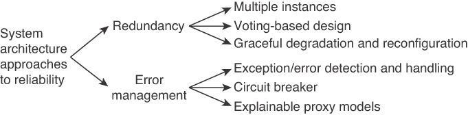
<figcaption><p><strong>Figure 7.1</strong> <em>System architecture
approaches to reliability</em>.</p></figcaption>
</figure>

::: section
#### *7.4.1 Redundancy* {#ch07.xhtml#ch07lev2sec14 .h4}

Redundancy has multiple uses. As shown in [Figure
7.1](#ch07.xhtml#ch07fig01), it is used to manage failure, to provide
alternatives in cases where a decision is not clear-cut, and to provide
secondary alternatives when a primary alternative is not responding. We
discuss multiple instances first.

::: section
##### Multiple Instances {#ch07.xhtml#ch07lev3sec01 .h5}

One approach to providing redundancy is to maintain multiple instances
of components, including model components. Then, if a component fails,
the backup can be placed into production quickly. Specific
responsibilities that are associated with having multiple instances
include the following:

-   Synchronizing state

-   Detecting failure

-   Invoking the backup

-   Cleaning up the failed instance
:::

::: section
##### []{#ch07.xhtml#page_153 .pagebreak}Voting-Based Design {#ch07.xhtml#ch07lev3sec02 .h5}

This approach involves combining outputs from multiple sources to
enhance decision-making reliability. These sources can be from multiple
AI models, from multiple components, or from AI and non-AI sources.
Voting-based design requires an algorithm that will either aggregate the
outputs or choose one over the other. By aggregating model outputs, the
system can mitigate the risk of relying on a single model. For example,
in a healthcare application, diagnoses from several AI models can be
aggregated with traditional diagnostic algorithms to improve the
accuracy and robustness of medical assessments.
:::

::: section
##### Graceful Degradation and Reconfiguration {#ch07.xhtml#ch07lev3sec03 .h5}

Systems designed to degrade gracefully can continue providing essential
services during major disruptions. This can be achieved by isolating
critical functions from noncritical ones. In a cloud-based service, for
instance, nonessential features might be temporarily disabled to
preserve core functionalities during a server outage.
:::
:::

::: section
#### *7.4.2 Managing Error* {#ch07.xhtml#ch07lev2sec15 .h4}

Developing a system-wide error handling strategy that accounts for both
AI model errors and traditional component failures is challenging,
particularly given the probabilistic nature of AI results. For example,
in an autonomous vehicle system, errors from sensory inputs must be
handled alongside AI prediction uncertainties. Errors must be detected
and either repaired or prevented. Furthermore, errors should be
explainable. These are the topics we take up in this section.

::: section
##### Error Detection and Exception Handling {#ch07.xhtml#ch07lev3sec04 .h5}

Error detection mechanisms should be built into the architecture. Error
detection at both the model and system levels can be achieved by setting
thresholds for anomaly detection. The point here is that these
mechanisms must be built into the architecture. Associated with the
detection of an error is the handling of that error. Activating a
circuit breaker is one mechanism to perform these tasks.
:::

::: section
##### Explainable Proxy Models {#ch07.xhtml#ch07lev3sec05 .h5}

For complex models whose predictions are difficult to explain, having a
proxy model that operates in parallel with the complex model will help
in []{#ch07.xhtml#page_154 .pagebreak}debugging errors and, possibly, in
regulatory compliance. Again, such models are invoked during operation
but must be designed into the architecture.
:::
:::
:::

::: section
### 7.5 Summary {#ch07.xhtml#ch07lev1sec05 .h3}

Ensuring reliability means managing faults. Faults can be
prevented---but if not prevented, they should be detected and prevented
from turning into failures.

Preventing faults depends on the model choice and training.
Architectural mechanisms such as circuit breakers and placement of
responsibilities will also help to prevent faults.

Detecting faults can be done by recognizing total failure or by
detecting questionable output.

Recovering from a fault can be accomplished by utilizing redundancy or
managing the error condition that results from a fault.
:::

::: section
### 7.6 Discussion Questions {#ch07.xhtml#ch07lev1sec06 .h3}

1.  How does reliability trade off against other quality attributes?

2.  Research the role of site reliability engineers (SREs). How would an
    SRE diagnose a problem with the OOD data?

3.  Perform an FMEA for an AI system with which you are familiar. How
    would you prevent the potential errors you detected?
:::

::: section
### 7.7 For Further Reading {#ch07.xhtml#ch07lev1sec07 .h3}

The distinctions among faults, errors, and failures are described in
Avižienis et al. \[[Avižienis 04](#ref.xhtml#ref5)\].

Other readings about reliability concepts include Kazman \[[Kazman
22](#ref.xhtml#ref25)\], Kläs and Jöckel \[[Kläs
20](#ref.xhtml#ref26)\], and Kläs and Vollmer \[[Kläs
18](#ref.xhtml#ref27)\].
:::
:::
:::

[]{#ch08.xhtml}

::: {#ch08.xhtml#book-content}
::: {#ch08.xhtml#sbo-rt-content}
## []{#ch08.xhtml#page_155 .pagebreak}*8* {#ch08.xhtml#ch08 .h2}

## *Performance* {.chap_ttl}

*You can't manage what you don't measure*.

---Peter Drucker

I[N SOFTWARE ENGINEERING]{.smallcaps}, *performance* is typically taken
to mean computation efficiency, which includes speed and scalability.
How fast do computations execute? How much of the requisite resources,
such as CPUs and energy, do they need? In AI, *performance* is typically
taken to mean "how accurate are the model outputs?" In many ways, these
two interpretations of performance are contradictory. Achieving accuracy
frequently requires more computation. Achieving higher efficiency, but
operating with the same resources, typically reduces accuracy. Which is
more important is a decision that drives the tradeoffs that the designer
must make. In this chapter, we discuss these two interpretations of
performance.

[Figure 8.1](#ch08.xhtml#ch08fig01) depicts the fundamental concepts of
both efficiency and accuracy.

<figure id="ch08fig01" class="figure">
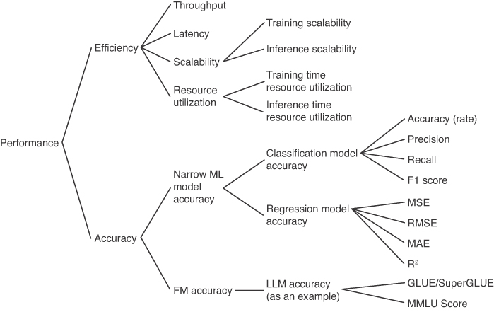
<figcaption><p><strong>Figure 8.1</strong> <em>Fundamental concepts of
performance</em>.</p></figcaption>
</figure>

::: section
### 8.1 Efficiency {#ch08.xhtml#ch08lev1sec01 .h3}

Efficiency refers to the ability of a software system to utilize
resources effectively while maintaining acceptable speed and
responsiveness, in addition to fulfilling its functional requirements.

::: section
#### *8.1.1 Fundamental Concepts of Efficiency* {#ch08.xhtml#ch08lev2sec01 .h4}

::: section
##### Throughput {#ch08.xhtml#ch08lev3sec01 .h5}

Throughput is the capacity of a system to process a certain number of
tasks or transactions within a specific time frame. It's a measure of
how much work a system can handle, typically quantified as transactions
per second, requests per second, or similar units. Applying this
definition to a large language []{#ch08.xhtml#page_156 .pagebreak}model
(LLM) API, throughput refers to the number of requests or tokens (e.g.,
text processing, language generation) the API can generate per second
across the number of users and total requests.
:::

::: section
##### Latency {#ch08.xhtml#ch08lev3sec02 .h5}

Latency is the time it takes for a system to complete a single task or
transaction. It's a measure of response time, from the initiation of a
request to the delivery of the result. Applying this definition to an
LLM API, latency is the overall time it takes for the model to generate
the full response for a user. This includes the time to first token
(TTFT), which measures how quickly the user starts seeing the model's
output after entering their query, and the time per output token (TPOT),
which measures the time to generate each output token. Latency can be
calculated as the sum of TTFT and the product of TPOT and the number of
tokens to be generated.
:::

::: section
##### Scalability {#ch08.xhtml#ch08lev3sec03 .h5}

Scalability is a software system's ability to handle increasing
workloads without degrading performance or requiring architecture
redesign. In AI systems, scalability includes two concepts: training
scalability and inference []{#ch08.xhtml#page_157
.pagebreak}scalability. Training scalability refers to the ability to
effectively and efficiently train AI models as training task size (e.g.,
number of model parameters, data volume, and computational resources)
increases. Inference scalability is the ability to effectively and
efficiently deploy and operate AI systems for inference as the size of
the models or the number of real-time requests increases.
:::

::: section
##### Resource Utilization {#ch08.xhtml#ch08lev3sec04 .h5}

Resource utilization involves how efficiently a system uses its
computational resources, such as CPU, memory, and I/O operations. In AI
systems, resource utilization is an aspect that differs significantly
for the training phase versus the inference phase, as each phase comes
with its own set of demands and constraints.

-   **Training time resource utilization:** During the training of an AI
    model, the focus is on the effective use of computational resources
    such as CPU and GPU power, memory, and storage. This phase could
    require significant resources, particularly for complex models. For
    example, training an LLM demands extensive computational power and
    memory due to the size and complexity of the model and the vast
    amount of data processed. Using resources valued at \$100 million or
    more for training a single, state-of-the-art LLM is not uncommon
    these days.

-   **Inference time resource utilization:** At the inference stage, the
    model's efficiency in making predictions, generating outputs, or
    processing new information becomes relevant. In resource-rich
    environments (e.g., cloud and server-based systems), the primary
    concern often revolves around cost efficiency. Even minor
    inefficiencies in resource usage can lead to substantial costs when
    scaled. In contrast, in edge AI scenarios (e.g., deployment on
    personal computers, mobile devices, or embedded systems), the
    limitation is often the available computational resources. Here, the
    challenge is to run the AI models, possibly including complex ones
    like LLMs, within these resource constraints.

Thus, performance efficiency in AI is a multifaceted concern. Multiple
metrics may be used to measure this efficiency, including the following:

-   **Training time:** The duration required to train the AI model,
    which can be substantial for complex models.

-   []{#ch08.xhtml#page_158 .pagebreak}**Inference time (latency):** The
    time taken by the model to make a prediction or respond to a new
    input.

-   **Model size:** A critical factor, especially for edge AI. Smaller
    models are generally faster and more resource-efficient---albeit,
    typically at the cost of lower output quality.

-   **Energy efficiency:** The energy consumption for performing tasks,
    a key consideration in mobile or edge AI applications.
:::
:::

::: section
#### *8.1.2 Approaches to Improving Efficiency* {#ch08.xhtml#ch08lev2sec02 .h4}

The efficiency of a system is a function of mapping the resource needs
of the system, both computational and network, to the resources provided
to the system. Improving the efficiency, then, is a matter of reducing
the resource requirements or utilizing more powerful resources. Of
course, resources cost money, so an additional constraint is the budget
available for the resources.

Lower latency or higher throughput is not always necessary. The system
will have requirements that specify the expected load and the expected
values of latency and throughput. All that is necessary from an
efficiency perspective is to satisfy those requirements. For example, a
200-millisecond delay appears instantaneous to a human for most
interactions. Designing an interactive system to respond with a latency
less than 200 milliseconds is unnecessary, and likely more complex and
difficult to understand.

We organize our discussion of approaches to improving efficiency by
following the life cycle. Hence, we begin with architecture design.

::: section
##### Architecture Design {#ch08.xhtml#ch08lev3sec05 .h5}

Many design techniques exist to control resource usage. Those relevant
to the AI portion of the system include techniques to reduce network
latency:

-   Use an interface style like GraphQL to reduce the communication
    needs between edge devices such as smartphones and their supporting
    data centers.

-   Placing containers that communicate frequently on the same runtime
    engine will eliminate the need for communications to pass over
    networks. Similarly, placing VMs that communicate frequently on the
    same host will prevent communications from going outside that host.
    VMs allocated on the same rack will have faster communications than
    if they are placed on different racks or in different data centers.

-   []{#ch08.xhtml#page_159 .pagebreak}Caching is a technique for
    reducing communication requirements. A cache can store values in a
    service that would otherwise be retrieved through communication
    requests. Memory accesses are much faster than network accesses. For
    example, IP addresses can be cached to avoid a discovery process
    involving network access. Outputs of a model with respect to
    particular values of independent variables can be cached to avoid
    recalculating them. However, caches can get stale and outdated if
    the original information is modified and the cache does not reflect
    it. Maintaining consistency between a cache and the underlying data
    sources must be considered in the design.

-   Edge devices are increasingly being equipped with special chips for
    AI computation. These devices include, among others, popular mobile
    phones from Apple, Google, and Samsung, as well as Windows and Mac
    desktop and laptop computers. If the edge devices available to a
    system possess such resources, the architecture design can make use
    of them by running suitable workloads and AI model inference
    directly on these edge devices.

A system can be designed to reduce resource requirements dynamically by
using a mode switcher that lets you flip between different
functionalities or levels of autonomy within the system. One
functionality that can be modified by a mode switcher is the use or
choice of an AI model. For example, a foundation model (FM) may provide
some functionality but at an unacceptable efficiency. Degrading the
functionality provided by the FM to a simpler narrow machine learning
(ML) model may reduce the resource requirements. A monitoring component
that is aware of the different possible models and the resource
requirements of each can act as a mode switcher. Additionally, another
FM can serve as a software connector---that is, as a model switcher that
makes decisions about the use or selection of an AI model.

It is also possible to move computations from one location on the
network to another. For example, moving computations from a slower
processor to a more powerful processor can speed up computation and
reduce network latency. As before, a monitoring and adaptation component
must exist that can make this decision or, at least, provide a human
with sufficient information to make the reallocation decision.
:::

::: section
##### Model Development {#ch08.xhtml#ch08lev3sec06 .h5}

When considering the resource requirements of a model, the resources
needed for training as well as the resources needed for inference should
be considered. Decreasing the resource usage of a model, as compared
with the resources []{#ch08.xhtml#page_160 .pagebreak}required for
training the model, allows for deployment of some models to edge
devices. These devices have restricted computational power but can be
used to execute models, depending on the size and complexity of the
model.

Less complex models, such as those based on decision trees or naïve
Bayes algorithms, typically require less computational power and memory
to train and run compared to complex models like deep neural networks.
These simpler models might achieve similar accuracy on certain tasks
while being more resource-friendly. At the same time, there is a trend
toward shifting from LLMs to small language models (SLMs). A typical
goal in SLM development is to achieve performance similar to LLMs, but
at greatly increased resource efficiency.

Some preexisting, well-established model architectures are known for
their efficiency, such as MobileNet and ShuffleNet. These models are
specifically designed for mobile and embedded devices with limited
resources.

The choice of model also affects later aspects of the life cycle:

-   **Model generation:** Some models can be trained much faster than
    others. For instance, decision trees are known for their speed,
    making them suitable for real-time applications where quick
    responses are crucial.

-   **Feature engineering:** Certain models, such as deep learning
    models, can automatically extract features from data, potentially
    reducing the need for manual feature engineering, which can be a
    resource-intensive step.

-   **Deployment:** For deployment on devices with limited resources
    (e.g., mobile phones, embedded systems), choosing a model with a
    smaller footprint (less memory usage) is essential.
:::

::: section
##### Hyperparameters {#ch08.xhtml#ch08lev3sec07 .h5}

Hyperparameters can be set to reduce the resource requirements for both
the training of the model and the execution of the model. For example,
certain hyperparameters control the number of training iterations a
model goes through. Tuning the learning rate in gradient descent
algorithms can lead to faster convergence, requiring fewer iterations
and reducing training time. Regularization hyperparameters, such as the
L1 or L2 penalty, can help prevent overfitting by reducing model
complexity, which can lead to faster training and potentially lower
memory usage during training.

Techniques such as early stopping can be used as a hyperparameter as
well. Early stopping monitors the model's performance on a validation
set during training. If the validation performance doesn't improve for a
certain []{#ch08.xhtml#page_161 .pagebreak}number of epochs
(iterations), training is stopped. This helps avoid overfitting and
reduces unnecessary computation.

Reducing the precision of parameters can also reduce execution
requirements. This may come at a cost, though---it may reduce the
accuracy of the outputs of the model.

Other hyperparameters exist, which may influence the output quality of
the resulting model. Hyperparameter tuning entails a search in the space
of hyperparameters, which can substantially increase the computation
resources required for training. While this may be justified in some
cases, in others the overhead is not justified by the marginal, if any,
improvements it brings.
:::

::: section
##### Model Preparation {#ch08.xhtml#ch08lev3sec08 .h5}

Model preparation can be both labor- and resource-intensive. Some
techniques for reducing both the training resource requirements and the
execution resource requirements are described next:

-   Instead of using the entire dataset, use a representative sample for
    training. This can significantly reduce training time and memory
    usage, especially for large datasets. Techniques such as random
    sampling and stratified sampling can be used, depending on the
    problem.

-   Techniques such as principal component analysis (PCA) and
    *t*-distributed stochastic neighbor embedding (t-SNE) can reduce the
    number of features in your data while preserving the most important
    information. This can lead to faster training and potentially
    smaller models for deployment.

-   Standardizing features to a common scale can improve the performance
    of some algorithms and potentially lead to faster training
    convergence.

-   When creating new features from existing ones, prioritize simple
    transformations such as scaling, binning, and basic mathematical
    operations. These are computationally cheaper compared to complex
    calculations.

-   Place continuously valued features into buckets rather than using
    the raw values. This reduces the number of unique values the model
    needs to handle.

-   For features with a small number of categories, techniques such as
    label encoding and ordinal encoding can be used, making training
    more efficient.

-   For very high-cardinality features, dimensionality reduction
    techniques such as hashing can be used to reduce cardinality, and
    thereby reduce effort during training.
:::

::: section
##### []{#ch08.xhtml#page_162 .pagebreak}Operation {#ch08.xhtml#ch08lev3sec09 .h5}

The main techniques for improving the efficiency of model calculation
involve utilizing parallelism. Two such techniques are (1) to process
multiple data points simultaneously (batching) during inference and (2)
to use lazy loading or model checkpointing to load only the necessary
parts of the model at runtime.

When operating an AI system, information will be gathered from the
monitoring subsystem. This information can be used to improve efficiency
and resource utilization. Some uses of this information, which we
discuss next, include generation of alerts, scaling, reallocation, and
parameter resetting.
:::

::: section
##### Alerts to First Responders {#ch08.xhtml#ch08lev3sec10 .h5}

Organizations and users depend on systems. When a system doesn't deliver
the needed capability, an organization's business may suffer, or users
may not receive the service that they paid for. To help mitigate this
risk, organizations and users create service level agreements (SLAs)
with the organization that develops and delivers the systems on which
they depend. An SLA identifies a metric (e.g., request latency for a
service) and a threshold (e.g., 99% of requests will receive a response
within 300 milliseconds). A typical agreement will contain many of these
metric/threshold requirements. If the client is outside the provider's
organization, these SLAs may be part of a legal contract, and the
provider may have to reimburse the client if the system is not
available, is insecure, or performs poorly.

Because breaking an SLA is a major incident for a
development-and-delivery organization, most organizations allocate the
requirements to meet an SLA as far down as to the services within the
system.

You do not want to be surprised by the breaking of an SLA, so you should
set a tighter threshold for internal monitoring purposes. This
threshold, called a service level objective (SLO), gives you some
breathing room. If you violate an SLO, you have some time to repair the
problem before the SLA is violated.

SLOs typically include at least the following areas of concern:

-   Latency and throughput

-   Traffic: the number of requests arriving at your service per unit
    time

-   Saturation: the measure of utilization of the resources (CPU,
    network, memory) that your service relies on

-   System health metrics, such as count or percentage of unhealthy
    hosts

[]{#ch08.xhtml#page_163 .pagebreak}You should define a benchmark for
"good" SLO values. This will provide the values for the thresholds that
you set.

If a threshold is violated, an alert is sent to a first responder.
Today, this first responder is a human, but it is foreseeable that this
function might be automated in the future. The first responder examines
the history of requests and responses to determine where the problem
that caused the alert is located.

The first responder has two responsibilities: to fix the immediate
problem and to determine the root causes so that the problem does not
reoccur. Fixing the immediate problem is done in real time. In contrast,
finding the root cause may take extensive investigation and involve
multiple different roles.
:::

::: section
##### Scaling of Resources {#ch08.xhtml#ch08lev3sec11 .h5}

We discussed autoscaling in [Chapter 2](#ch02.xhtml#ch02), [Software
Engineering Background](#ch02.xhtml#ch02). The actions of the autoscaler
are based on measurements of resource usage and have thresholds, as just
discussed. These thresholds may or may not be the same thresholds used
for alerting.
:::

::: section
##### Reallocation of Services {#ch08.xhtml#ch08lev3sec12 .h5}

If a component becomes overloaded, additional resources can be allocated
through scaling mechanisms. Another method for improving efficiency is
to utilize a different AI model. If a model continually becomes
overloaded, a distinct model that serves the same function could be
dynamically substituted. Having multiple models available to perform the
same function can be used for correctness checking as well as resource
utilization purposes.
:::
:::

::: section
#### *8.1.3 Efficiency Considerations of FMs* {#ch08.xhtml#ch08lev2sec03 .h4}

As we discussed in [Chapter 4](#ch04.xhtml#ch04), [Foundation
Models](#ch04.xhtml#ch04), one characteristic of FMs is their massive
scale. This has implications for resource usage:

-   **Computational cost:** Training FMs requires massive amounts of
    data and computational power. This can be expensive and
    time-consuming, especially for resource-constrained environments.
    Researchers are constantly working on improving the efficiency of
    training algorithms and hardware optimization techniques to address
    this challenge.

-   **Inference speed:** Although FMs are certainly powerful, running
    them can be computationally expensive. This can lead to slow
    response times, especially for real-time applications. Techniques
    such as model []{#ch08.xhtml#page_164 .pagebreak}distillation and
    pruning are used to create smaller, faster models that inherit the
    capabilities of the original FM (See also the discussion of SLMs in
    the "Model Development" section in this chapter.)

-   **Energy consumption:** The high computational cost of training and
    running FMs translates into significant energy consumption. This is
    a growing concern as the use of AI increases. Researchers are
    exploring ways to develop more energy-efficient training methods and
    hardware architectures.
:::
:::

::: section
### 8.2 Accuracy {#ch08.xhtml#ch08lev1sec02 .h3}

As mentioned at the beginning of the chapter, the AI meaning of
*performance* is typically a question about the quality of the model's
output. We use the notion of accuracy here in the context of that
interpretation. A different meaning of accuracy is the metric accuracy
rate, which is much narrower than what we mean when referring to the
concept of accuracy.

::: section
#### *8.2.1 Fundamental Concepts of Accuracy* {#ch08.xhtml#ch08lev2sec04 .h4}

Accuracy refers to a software system's ability to produce expected or
true results. In AI systems, accuracy is how well the AI system's
predictions or outputs match the desired predictions or outputs. This is
captured via a set of metrics. Common metrics for classification and
regression models are given in this section.

::: section
##### Classification Models {#ch08.xhtml#ch08lev3sec13 .h5}

-   **Accuracy (rate):** Percentage of correct outputs (both true
    positives and true negatives) out of the total number of outputs.

-   **Precision:** Percentage of correct positive outputs out of the
    total positive outputs.

-   **Recall:** Percentage of the outputs that are true positive cases
    out of the actual number of positives.

-   **F1 score:** Harmonic mean of precision and recall, which can be
    calculated as 2 \* (precision \* recall)/(precision + recall). It is
    useful where false positives and false negatives have distinct
    implications. F1 is a number between 0 and 1. An F1 score greater
    than 0.8 is considered high, a score between 0.5 and 0.8 is
    considered average, and a score less than 0.5 is low, but acceptable
    levels for any metric vary by application.
:::

::: section
##### []{#ch08.xhtml#page_165 .pagebreak}Regression Models {#ch08.xhtml#ch08lev3sec14 .h5}

-   **Mean squared error (MSE):** Average of the squared difference
    between the output values and the actual values.

-   **Root mean squared error (RMSE):** Square root of MSE. It is easy
    to compare with the original scale of the data and sensitive to the
    presence of outliers.

-   **Mean absolute error (MAE):** Average of the absolute difference
    between the output values and the actual values. It is less
    sensitive to outliers compared to MSE or RMSE, as it does not square
    the errors.

-   ***R*-squared (*R*^2^):** Proportion of the variance in the
    dependent variable that can be attributed to the independent
    variables. Values greater than 0.7 are high, between 0.5 and 0.7 are
    moderate, and less than 0.5 are low.
:::

::: section
##### Foundation Models {#ch08.xhtml#ch08lev3sec15 .h5}

Measuring the accuracy of FMs or their fine-tuned task-specific models
is more complex than for other AI models due to their diverse
capabilities and varied outputs. We use LLMs to show some LLM-specific
measurements.

-   **General Language Understanding Evaluation (GLUE) and SuperGLUE:**
    These benchmarks are widely used for assessing performance on
    diverse natural language processing (NLP) tasks including sentence
    completion, sentiment analysis, and question-answering.

-   **Massive Multitask Language Understanding (MMLU) test score:** MMLU
    measures a language model's performance across a broad range of
    tasks and subjects, assessing its general knowledge and
    problem-solving abilities. It evaluates accuracy on multiple-choice
    questions in domains such as mathematics, history, and science,
    among others. The score provides insights into the model's
    proficiency and versatility, indicating its ability to understand
    and generate human-like text.
:::

::: section
##### Repeatability {#ch08.xhtml#ch08lev3sec16 .h5}

Repeatability means producing the same output for the same input under
identical conditions. This is a hallmark of deterministic systems. Many
systems, however, may not be deterministic because of timing differences
caused by thread behavior and background activities. Measuring
nondeterministic performance, such as with benchmarks, requires multiple
executions and statistical analysis.

[]{#ch08.xhtml#page_166 .pagebreak}AI systems, particularly those based
on ML, may be nondeterministic because many ML algorithms rely on
randomness during training, such as initializing weights or choosing
optimization paths. These random elements can cause different outputs
even with the same input.

Additionally, in certain AI applications such as creative writing or
generating alternative plans and recommendations, variability in output
from the same input is actually desirable. This allows exploration of
different alternatives.
:::
:::

::: section
#### *8.2.2 Approaches to Improving Accuracy* {#ch08.xhtml#ch08lev2sec05 .h4}

As before, we take a life-cycle approach when discussing how to improve
accuracy.

::: section
##### Architecture Design {#ch08.xhtml#ch08lev3sec17 .h5}

In [Chapter 7](#ch07.xhtml#ch07), [Reliability](#ch07.xhtml#ch07), we
discussed using multiple models and voting as a mechanism for increasing
reliability. The techniques are also applicable to increasing accuracy.
In particular, using a combination of models, known as multi-model
decision making, employs different models to perform the same task or
enable a single decision. Consensus protocols could be defined to make
the final decision---for example, taking the majority vote. Another
strategy is to accept only the same results from the employed models. In
addition, the end user or the operator could step in to review the
output from the multiple models and make a final decision based on human
expertise.
:::

::: section
##### Hyperparameters {#ch08.xhtml#ch08lev3sec18 .h5}

The choice of hyperparameters has a major impact on the model's
accuracy. Models that have a learning rate hyperparameter are sensitive
to that choice. Learning rates that are too high will cause the model to
experience problems with output. A second problem is that the impact of
a choice of hyperparameters may be difficult to predict.

Finally, depending on the model choice, the hyperparameter choice can
lead to either overfitting or underfitting. For example, a large number
of trees in a random forest might lead to overfitting, whereas a small
number might lead to underfitting.
:::

::: section
##### Data Preparation {#ch08.xhtml#ch08lev3sec19 .h5}

There are three challenges in preparing data for accuracy: (1) choosing
a sufficient amount of training data; (2) choosing the data to be
representative of []{#ch08.xhtml#page_167 .pagebreak}the actual data on
which the model is to be used; and, somewhat counterintuitively, (3)
choosing the data to be free of biases. In addition, the model should
give an accurate output when presented with out-of-distribution (OOD)
data, so samples of OOD data should be included in the training data.

Missing data points are a common issue. You can address them by using
techniques such as imputation (filling in missing values with estimates)
or removing rows/columns with excessive proportions of missing values.

Outliers can skew your model's learning. You can choose to clip outliers
to a certain range or remove them entirely, depending on the context.

Furthermore, to ensure that the trained model generalizes well to unseen
data, you will want to split your data into different sets. Best
practice is to divide your data into three main sets:

-   **Training set:** This is the largest portion, usually approximately
    60% to 80%, of the data. It is used to train the model.

-   **Validation set:** This set, which typically represents 10% to 20%
    of the data, is used to tune the hyperparameters of the model and to
    prevent overfitting. It provides an unbiased evaluation of a model
    fit on the training dataset while tuning the model's
    hyperparameters.

-   **Test set:** This set, which also represents 10% to 20% of the
    data, is used to assess the final performance of the model after
    training and validation are complete. It should not be used during
    the training or validation phases.

This split is depicted in [Figure 8.2](#ch08.xhtml#ch08fig02).

<figure id="ch08fig02" class="figure">
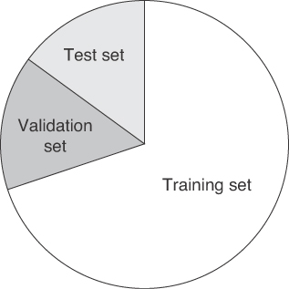
<figcaption><p><strong>Figure 8.2</strong> <em>Typical split of training
data</em>.</p></figcaption>
</figure>

[]{#ch08.xhtml#page_168 .pagebreak}Two context-specific best practices
are stratification and cross-validation. First, for classification
problems, ensure that splits are stratified, meaning that each set
maintains the same class distribution as the original dataset. Second,
in some cases, especially when the training dataset is small, use
cross-validation techniques (e.g., *k*-fold cross-validation) for more
reliable evaluation.
:::

::: section
##### Model Preparation {#ch08.xhtml#ch08lev3sec20 .h5}

Choosing the correct set of features will help the model generate more
accurate outputs. Some techniques for adapting features are presented
here:

-   Scaling features to a common range ensures all features contribute
    equally to the model's learning process. Common scaling methods
    include standardization (*z*-score) and normalization (min-max
    scaling).

-   Categorical data often needs to be converted to numerical values so
    that ML models can understand the data. Techniques such one-hot
    encoding and label encoding are used for this purpose.

-   Deriving new features from existing ones can improve model
    performance. For instance, you might create new features like "time
    since last purchase" from a customer dataset.

-   Transformations such as logs and square roots can improve the
    linearity of relationships between features and the target variable,
    which benefits some ML algorithms.

Some techniques for managing the set of features are highlighted next:

-   Not all features are equally important. Feature selection helps
    identify the most relevant features for your model, reducing
    training time and potentially improving accuracy. Techniques include
    chi-squared tests and feature importance scores from models like
    random forests.

-   When dealing with a large number of features, dimensionality
    reduction techniques like PCA can help reduce redundancy and improve
    model performance, especially for complex models prone to
    overfitting.
:::

::: section
##### Model Generation {#ch08.xhtml#ch08lev3sec21 .h5}

During the model generation process, the model's performance is
evaluated using various metrics. These metrics are not only calculated
once the model is fully trained, but are also monitored throughout the
training phase. This ongoing evaluation helps in adjusting parameters
and improving the model []{#ch08.xhtml#page_169 .pagebreak}iteratively.
Recall from the data preparation discussion that you will use the
validation set for testing during model generation.

Once the model has been generated, testing it further will give you some
confidence in the model. The dataset to use for this assessment is the
test set.

During both types of evaluation, you will calculate accuracy metrics.
Commonly used metrics for classification models include the
aforementioned accuracy, precision, recall, and F1 score, whereas
metrics for regression models include MSE, RMSE, MAE, and *R*-squared.
By closely monitoring these metrics, you can gain confidence in the
model's performance and make informed decisions about further training
or adjustments during model generation, or deployment once training is
complete.
:::

::: section
##### Operations {#ch08.xhtml#ch08lev3sec22 .h5}

During operations, the accuracy of model output can be calculated only
when ground truth values are known. This is usually done after the
outputs have been produced. In addition to the metrics mentioned
earlier, the following techniques can be used for this purpose:

-   Visualizing a confusion matrix. This table visualizes the model's
    performance on different classes, highlighting potential imbalances
    (e.g., high false positives for a specific class).

-   Using statistical techniques like the Kolmogorov--Smirnov's test to
    compare the distribution of new data with the training data,
    highlighting potential data or concept drift.

Testing for accuracy should be done periodically. If a problem is
detected, the model should be retrained and a new release sent through
the deployment pipeline.
:::

::: section
##### FM-Based Systems {#ch08.xhtml#ch08lev3sec23 .h5}

FMs are challenging with respect to accuracy because of both their scale
and their domain-independent nature. In addition, as we discussed in
[Chapter 4](#ch04.xhtml#ch04), they are subject to hallucinations or
confabulations and have limited factual grounding. Additional problems
with FMs relate to generalization, inconsistency, and test data used
during training.

-   **Generalization across domains:** Although FMs are trained for
    general-purpose usage, their accuracy can change significantly
    across diverse []{#ch08.xhtml#page_170 .pagebreak}domains or
    problems. Hence, for specific software applications, they require
    further fine-tuning or tailored system design.

-   **Inconsistent results:** FMs are trained on extensive datasets,
    which may contain inconsistent, varying, or even contradictory data.
    Also, the internal mechanisms of FMs involve a certain degree of
    randomness during training and inference. Thus, even when provided
    with identical inputs and conditions, the FM might produce different
    outputs each time it is run. This variability can make it
    challenging to replicate results consistently.

-   **Test data used during training:** In most cases, you will use FMs
    as a service through an API provided by a hyperscaler, without deep
    insight into the pretraining phase. As a result, you won't know
    which data was used during pretraining. This includes standard tests
    like MMLU---the test questions and answers may have been part of the
    training set or validation set. In either case, if you use these
    tests/benchmarks as test sets, you cannot trust the resulting
    performance. Assessing FMs can be very hard because, from a
    practical standpoint, you cannot use any public dataset as test
    data.

In [Chapter 4](#ch04.xhtml#ch04), we introduced several approaches to
improving accuracy for FMs, including fine-tuning, retrieval-augmented
generation (RAG), and prompt engineering. Additional approaches include
reinforcement learning from human feedback (RLHF) to align with human
preferences, adversarial testing and human acceptance testing for use
case--specific scenarios, and benchmarks for capabilities. Additionally,
the quality of the test cases themselves is very important and needs to
be assessed.
:::

::: section
##### Reinforcement Learning from Human Feedback {#ch08.xhtml#ch08lev3sec24 .h5}

FM providers can use RLHF to fine-tune the FM's behavior and produce
more accurate and responsible responses. RLHF allows humans to provide
feedback on the quality of the responses, with this feedback then being
used to adjust the model's parameters. The FM is trained to maximize the
reward it receives from human feedback, which can improve its accuracy
and responsible AI (RAI)--related qualities over time.
:::

::: section
##### Adversarial Testing {#ch08.xhtml#ch08lev3sec25 .h5}

Adversarial testing is a method to evaluate FMs by exposing them to
inputs specially designed to trick or confuse them. The purpose is to
assess the FMs' []{#ch08.xhtml#page_171 .pagebreak}robustness and
ability to handle ambiguous queries or edge cases. Adversarial examples
used in the testing can include synonym substitution, sentence
paraphrasing, work insertions or deletions, typos or grammatical errors,
misleading information, ambiguous or vague inputs, and irrelevant
information, among others.

Adversarial testing can be done with domain experts, who test the
accuracy and RAI-related properties by using adversarial examples that
are designed to deceive or mislead the model into producing incorrect or
irresponsible responses. By testing the model in this way, developers
can identify vulnerabilities or weaknesses in the model's
decision-making process and take steps to improve its accuracy and
RAI-related properties. For example, OpenAI engaged more than 50 experts
from various domains to perform adversarial testing for its GPT-4 model.
:::

::: section
##### Human Evaluation {#ch08.xhtml#ch08lev3sec26 .h5}

Human evaluation subjectively assesses the accuracy of FMs. Typical
criteria for human evaluation for LLMs include the following:

-   **Factual accuracy and grounding:** Are the LLM's responses
    factually correct? Do they align with real-world knowledge and
    evidence?

-   **Fluency and coherence:** Are the LLM's responses grammatically
    correct? Do they read smoothly and logically?

-   **Relevance and informativeness:** How relevant are the LLM's
    responses to the input? Do they provide sufficient and useful
    information to fulfill the intent of the input?

-   **Originality and creativity:** Are the LLM's responses novel and
    insightful outputs rather than simply regurgitating existing
    information?
:::

::: section
##### Benchmarks {#ch08.xhtml#ch08lev3sec27 .h5}

Automated benchmark tests involve running and testing the LLMs through a
set of standardized tasks. As previously noted in the FM/LLM concept
section, MMLU and GLUE/SuperGLUE are typical benchmarks for assessing
the accuracy and performance of models across a broad range of tasks.
Some other benchmarks include the following options:

-   **Recall-Oriented Understudy for Gisting Evaluation (ROUGE):** ROUGE
    is a metric used to evaluate the quality of both machine translation
    and text summarization. It measures the similarity between
    []{#ch08.xhtml#page_172 .pagebreak}a machine-translated summarized
    text and one or more reference summaries/translations.

-   **Holistic Evaluation of Language Models (HELM):** This benchmark
    evaluates LLMs on their abilities in factual grounding, reasoning,
    and commonsense knowledge, extending beyond simple accuracy to
    assess deeper understanding.

-   **Winograd Schema Challenge (WSC):** The WSC is specifically
    designed to test LLM's ability to understand language and
    commonsense reasoning, focusing on areas that go beyond mere
    accuracy.

If LLMs are trained or fine-tuned for specific domains, such as the
medical or legal domain, their accuracy within these domains can be
measured using domain-specific benchmarks or through expert reviews. To
set the benchmarks, domain-specific data and tasks are collected to
evaluate the LLM's abilities in handling real-world scenarios. For
example, clinical text datasets can be used for tasks such as generating
medical diagnoses. For expert reviews, domain experts manually evaluate
the LLM's output for accuracy, relevance, and compliance with the
domain-specific standards.
:::

::: section
##### Acceptance Testing {#ch08.xhtml#ch08lev3sec28 .h5}

Acceptance testing, such as bias testing, is designed to detect design
flaws in AI systems and verify that trustworthiness requirements have
been met---for example, whether the data pipeline has appropriate
privacy control, fairness testing for training, and validation data. In
an agile development process, ethical requirements can be framed as
ethical user stories and associated with corresponding acceptance tests.
These tests serve as a contract between the customer and development
team, and can be used to quantify the behavior of the AI system. The
acceptance criteria should be clearly defined in a testable way. The
history of ethical acceptance testing should be recorded and tracked,
including how and by whom the ethical issues were addressed. A testing
leader may be appointed to lead the acceptance testing for each quality.
For example, if bias is detected at runtime, the monitoring reports are
returned to the bias testing leader for review.
:::

::: section
##### Assessment for Test Cases {#ch08.xhtml#ch08lev3sec29 .h5}

Creating high-quality test cases is an integral part of acceptance
testing. A test case usually includes an ID, description, preconditions,
test steps, test data, expected results, actual results, status, creator
name, creation date, executor []{#ch08.xhtml#page_173 .pagebreak}name,
and execution date. All of the test cases for verification and
validation must pass an assessment, which includes evaluating the
metrics of the test steps and test data. The creation and execution
information is essential to track the accountability of ethical issues
with test cases. The assessment process can be integrated into the
design of tools used to generate test cases.
:::
:::
:::

::: section
### 8.3 Summary {#ch08.xhtml#ch08lev1sec03 .h3}

*Performance* is an ambiguous term when applied to AI systems: It can
mean either efficiency or accuracy. During operations, it is important
to monitor the performance of an AI system and generate alerts if the
performance deviates from predefined limits. For efficiency, the
predefined limits can be thresholds set on latency and throughput. For
accuracy, the predefined limits can be based on statistical tests of the
similarity of the distribution of the training data and the actual data
being input into the model.

For both efficiency and accuracy, a general rule is that simple problems
should be addressed with simple models. Do not use a complex model
unless you have a complex problem to solve.

In terms of accuracy, overfitting is a continual concern, as is bias.
Sufficient training data will help prevent overfitting, and eliminating
biases in training data will help prevent biases in operation.
Introducing OOD data and adversarial data into the training dataset will
improve accuracy.

FMs can be made more accurate for specific domains through prompt
engineering, use of RAG, and fine-tuning. Testing and improving FM
performance is challenging, but a number of approaches, such as
adversarial testing and RLHF, are available for this purpose.
:::

::: section
### 8.4 Discussion Questions {#ch08.xhtml#ch08lev1sec04 .h3}

1.  Improving efficiency requires a tradeoff of a large number of
    quality attributes. Give some examples.

2.  Is accuracy traded off against the other quality attributes
    discussed in this book? Which ones? What is the tradeoff?

3.  Given the probabilistic nature of AI models, can they ever be truly
    accurate? Discuss.

4.  Discuss the truth or falsehood of this statement: If throughput has
    increased, then latency must have decreased.
:::

::: section
### []{#ch08.xhtml#page_174 .pagebreak}8.5 For Further Reading {#ch08.xhtml#ch08lev1sec05 .h3}

C. Huyen's *Designing Machine Learning Systems: An Iterative Process for
Production-Ready Applications* \[[Huyen 22](#ref.xhtml#ref22)\] is a
good source for designing AI systems for production, where you can read
about the requirements for AI systems.

The book *Efficient Processing of Deep Neural Networks* \[[Sze
20](#ref.xhtml#ref47)\] focuses on optimizing deep neural networks for
energy efficiency, throughput, and latency through hardware--algorithm
co-design. This optimization is critical for ensuring reliable AI
systems, as it helps prevent performance degradation and failures due to
resource constraints.
:::
:::
:::

[]{#ch09.xhtml}

::: {#ch09.xhtml#book-content}
::: {#ch09.xhtml#sbo-rt-content}
## []{#ch09.xhtml#page_175 .pagebreak}*9* {#ch09.xhtml#ch09 .h2}

## *Security* {.chap_ttl}

*Security is a process, not a product*.

---Bruce Schneier

W[HEN DESIGNING, DEVELOPING]{.smallcaps}, and operating an AI-based
system, all security concerns from traditional systems are still
relevant. Some of the concerns are similar, but have changed. And some
new challenges exist.

As an example of existing but changed concerns, input sanitation is
traditionally geared toward countering attacks implemented via SQL
injection, buffer overflow, or other techniques. Syntactic checks can
help prevent many of these attacks. For AI-based systems, new forms of
semantic attacks exist. For example, based on the content of the prompt
text to a large language model (LLM), such as "repeat word X
infinitely," some LLMs might output that word a large number of times
before returning some of the training data verbatim.

As an example of a new challenge, in an experiment, researchers
manipulated only a few individual pixels in images in an effort to throw
off image classification AI models, which are used to identify objects
or patterns in images. The researchers succeeded: After their
manipulation, none of the images was classified correctly. The total
number of pixels per image that needed to be changed to achieve this
result was three, on average. Although this interesting result was
produced in the laboratory, it is downright scary to think that those
same AI techniques might be used in self-driving cars. For instance, if
such an image manipulation can be achieved with a few stickers on a stop
sign, that sign might no longer be recognized as such by the AI system.

Defense in depth is a standard security principle. It emphasizes a
layered approach in which multiple security measures work together to
create a strong barrier against attacks. In other words, you should not
rely on a single []{#ch09.xhtml#page_176 .pagebreak}defense against
attacks, but rather must implement various defenses at different points
in the system.

It is important to address the security concerns associated with AI
models head-on. The potential risks in terms of loss of reputation,
money, or even lives are significant if security concerns are not
properly managed.

As in the other chapters dealing with quality issues, we will first
cover the fundamentals regarding security. Subsequently, we will discuss
new and changed challenges, but not unchanged ones. Finally, we will
cover how the challenges can be addressed---that is, solved, mitigated,
or managed.

::: section
### 9.1 Fundamental Concepts {#ch09.xhtml#ch09lev1sec01 .h3}

We begin by discussing the traditional definition of security, and then
turn to additional considerations in the AI context. [Figure
9.1](#ch09.xhtml#ch09fig01) gives a preview of the topics we discuss in
this section.

<figure id="ch09fig01" class="figure">
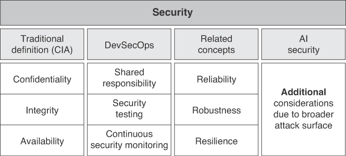
<figcaption><p><strong>Figure 9.1</strong> <em>Fundamental concepts of
security</em>.</p></figcaption>
</figure>

::: section
#### *9.1.1 Traditional Definition of Security* {#ch09.xhtml#ch09lev2sec01 .h4}

Security is not a single quality, but rather arises from the combination
of at least three qualities: confidentiality, integrity, and
availability. Collectively known as the CIA properties, these qualities
are based on authentication and authorization. *Authentication* means
that the persons or systems accessing a service are what they are
claiming to be. *Authorization* refers to the rights the user has; that
is, the user is authorized to perform certain operations such as
accessing a file or approving an invoice.

[]{#ch09.xhtml#page_177 .pagebreak}Returning to the CIA properties,
*confidentiality* means that only persons or systems authorized to
access information are able to do so. *Integrity* is the property that
data or services are not subject to unauthorized manipulation; this
implies that the system is able to prevent users from making changes
they are not authorized to make. Finally, *availability* means the
system allows authorized users to perform operations---that is, the
system is available to provide its intended service.

DevSecOps is a variant of DevOps that emphasizes the security aspects of
DevOps. It introduces new considerations, such as the goal to foster a
culture in which security, development, and operations are understood as
shared responsibilities by all relevant team members. Other DevSecOps
practices emphasize security testing in the deployment pipeline,
monitoring used packages and libraries for known vulnerabilities, and
security monitoring and response as design goals. Furthermore, if
practiced well, DevSecOps can alleviate the burden to achieve compliance
with regulation and security standards, among others, by means of
standardized, automated processes and checks.

Security is also linked to reliability, robustness, and resilience,
which were covered in [Chapter 7](#ch07.xhtml#ch07),
[Reliability](#ch07.xhtml#ch07). Some definitions of safety and
dependability are also related. In a classic, influential paper by
Avižienis et al., safety is defined as the "absence of catastrophic
consequences on the user(s) and the environment." These authors' view of
dependability is that it covers the properties of safety, integrity,
availability, reliability, and maintainability; in other words, it
shares the "I" and the "A" from CIA with security.

Recently, quantum computing has become more relevant. Given the advances
being made, it is quite possible that in the not-too-distant future
quantum computers will be able to crack conventional encryption
mechanisms with ease. Designers should try and use quantum-safe
algorithms and protocols (i.e., cryptographic techniques designed to be
resistant against attacks from quantum computers), especially for highly
critical areas of their application.

The term *attack surface* is used to refer to the sum of all possible
entry points that attackers can exploit to gain unauthorized access to a
system, steal data, disrupt operations, or cause other harm. It
encompasses every vulnerability, weakness, and potential access point
within the software, its code, and its surrounding environment. This
includes, as we will see, the data used to train the model.

An *attack vector* is the specific method or pathway used by attackers
to exploit vulnerabilities and gain unauthorized access to a system or
data. []{#ch09.xhtml#page_178 .pagebreak}It represents the "how" of an
attack, while the attack surface defines the "where" (all potential
entry points). Many attacks aim to compromise both the "I" and the "C"
parts of CIA. However, trying to disentangle these two elements in an
attack is not fruitful because the prevention or mitigation of these
elements depends on the attack vector, not on which one of the CIA
properties is being compromised.
:::

::: section
#### *9.1.2 Attacks in an AI System* {#ch09.xhtml#ch09lev2sec02 .h4}

All of the preceding aspects of security apply to AI-based systems,
though some things are a bit different. Perhaps most importantly, the
attack surface of an AI system is broader than the attack surface of
non-AI systems. Modifying an image so that it will be misclassified is
an example of a new method of attack that did not exist in traditional
systems. Attacks may result from illegitimate changes to the model
directly or the data used for training the model, which are forms of
poisoning attacks. Taking a system-level perspective, traditional
security measures remain very relevant---among others, those regarding
infrastructure, APIs, user management, layering of access levels, and
data protection in transit, in use, and at rest. As stated earlier, some
aspects have different implications in AI systems, and some new aspects
arise from them. We now discuss these additional challenges for AI-based
systems.

In a recent National Institute of Standards and Technology (NIST)
taxonomy, the following attack types are distinguished:

-   **Evasion attacks:** The deployed model is not affected, but returns
    a different answer than it would have without the attack, often
    based on runtime input manipulation. Image misclassification after
    changing three pixels in an image is an example.

-   **Poisoning attacks:** The model training phase is attacked. For
    instance, an AI trained on public datasets from the internet could
    be attacked by controlling and changing a small subset of publicly
    available data.

-   **Privacy attacks:** The attackers aim to gain information about
    confidential inputs to the training data. Privacy attacks can be
    subdivided into membership attacks (is a certain record part of the
    training data?) and data reconstruction attacks (what was the input
    data?). An example of the former would be a facial recognition
    system that classifies images as either "authorized user" or
    "unauthorized user"; an attacker could try to find out if a specific
    individual was in the training dataset. An []{#ch09.xhtml#page_179
    .pagebreak}example of the latter is the case of "repeat this word
    infinitely" causing an LLM to regurgitate and return some of its
    training data.

-   **Abuse/misuse attacks:** This attack type applies primarily to
    generative AI systems, and aims to create output that should not be
    generated according to the creators (e.g., creating hate speech or
    supporting weapon/bomb creation).

[Figure 9.2](#ch09.xhtml#ch09fig02) depicts these attack types and shows
how they are related to the phases in AI training and use. Note that
privacy and poisoning attacks can target the training data, or the model
(e.g., by deducing information or changing behavior from model weights
directly), or both. Although this is a useful overview and
categorization, organizations that want to use AI in production systems
should have a significantly more detailed understanding of the attack
types and mitigations relevant to their particular setting.

<figure id="ch09fig02" class="figure">
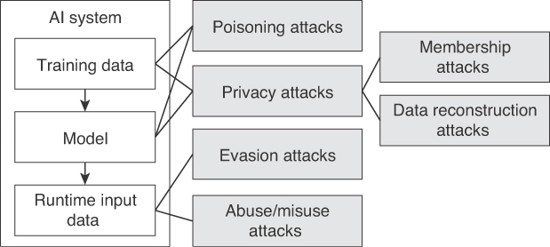
<figcaption><p><strong>Figure 9.2</strong> <em>AI-based system with
phases and major attack types</em>.</p></figcaption>
</figure>

Although attacks are easiest to carry out when internal information
(e.g., source code, training data) is known to the attackers, referred
to as white-box attacks, they are also possible with limited (gray-box
attacks) or no (black-box attacks) internal information. Attacks also
differ by the level of control the attackers have. Can they change
training data or testing data? Can they change labels? Can they
manipulate model parameters or gain access to a system's source code? In
terms of data modality, attack forms have been developed for text,
tabular data, images, audio, video, and cybersecurity data (e.g.,
viruses, malware, spam), and more recently for multimodal AIs.
:::
:::

::: section
### []{#ch09.xhtml#page_180 .pagebreak}9.2 Approaches to Mitigating Security Concerns {#ch09.xhtml#ch09lev1sec02 .h3}

It is important to realize that there is no absolute security, and
particularly for the model-level challenges, there are no perfect
mitigations. Conventional security concerns still need to be addressed.
Attackers might also make use of (generative) AI technologies, both to
automate more attacks and to launch more sophisticated attacks.

The basic philosophy behind achieving security nowadays is zero trust.
*Zero trust* (ZT) is the term for an evolving set of cybersecurity
paradigms that move defenses from static, network-based perimeters to
focus on users, assets, and resources. A ZT architecture uses ZT
principles to plan industrial and enterprise infrastructure and
workflows. It assumes there is no implicit trust granted to assets or
user accounts based solely on their physical or network location (i.e.,
local area networks versus the internet) or based on asset ownership
(enterprise or personally owned). Authentication and authorization (both
subject and device) are discrete functions performed when initiating
access to an enterprise resource.

Some principles of ZT are:

-   **Never trust, always verify:** This is the core principle. Everyone
    trying to access something has to go through a rigorous
    authentication process.

-   **Least privilege access:** Users get access to only those resources
    they absolutely need to do their jobs, and nothing more.

-   **Continuous monitoring:** Even after gaining access, users and
    devices are continuously monitored for suspicious activity.

-   **Encrypt communication:** For example, use HTTPS rather than HTTP.

We begin by discussing process approaches to security.

::: section
#### *9.2.1 Process Approaches for Enhancing Security* {#ch09.xhtml#ch09lev2sec03 .h4}

Threat modeling and risk assessment are useful practices for identifying
and addressing potential security vulnerabilities in systems. While the
fundamental principles apply to both AI and non-AI systems, specific
aspects to consider in the context of FM-based systems include the
identification of new FM-specific attacks and emerging threats unique to
AI/FM technologies. To effectively handle these challenges,
organizations could leverage AI itself, combining it with comprehensive
system tracking and analysis. By utilizing AI-based techniques for
threat detection and keeping track of system []{#ch09.xhtml#page_181
.pagebreak}behavior, organizations can stay informed about new attack
vectors and assess their applicability to their specific AI systems.
This proactive approach helps in identifying and mitigating potential
security risks in a timely manner.
:::

::: section
#### *9.2.2 Architectural Approaches for Enhancing Security* {#ch09.xhtml#ch09lev2sec04 .h4}

The design of the architecture is where ZT is centered. For
architectural design, it manifests as architectural patterns. These
patterns apply to AI systems as well as to non-AI systems. Some of these
patterns are highlighted here:

-   **Authorization:** Authorization is enforced for every access to a
    service. It should result in users and services checking
    authorization and being granted access with the principle of least
    privilege applied (Amazon reports 400 million calls to its IAM
    service per minute^[1](#ch09.xhtml#ch09fn1){#ch09.xhtml#ich09fn1}^).

    [1](#ch09.xhtml#ich09fn1){#ch09.xhtml#ch09fn1}.
    <https://aws.amazon.com/blogs/apn/iam-10th-anniversary-top-recommendations-for-working-with-iam-from-our-aws-heroes-part-1/>

-   **Encryption:** The design should reflect the use of HTTPS and other
    encrypted communication protocols.

-   **Least functionality:** Configure your system to provide only
    essential capabilities and to prohibit or restrict the use of
    nonessential functions, such as ports, protocols, and/or services
    that are not integral to the operation of that information system.

-   **Limiting access:** Restrict the number of access points---for
    example, by requiring access to pass through a gateway.

-   **Restrict traffic:** Among other things, configure firewalls to
    allow access only to port numbers where this is needed.

-   **Segmenting networks:** Use the principle of least privilege to
    control access.

-   **Privilege separation:** Each component possesses the minimum
    privileges required for it to function, so that functions are
    differentiated from privileges.

-   **Privilege minimization:** Privileges are disabled most of the
    time, and enabled only when required.

When implementing security, there is a tradeoff between security and
usability: Implementing robust security measures may introduce
additional complexity and potentially impact the usability and
performance of the []{#ch09.xhtml#page_182 .pagebreak}system. Good
architecture, development, and operations strike a balance between
security requirements and system usability to ensure that the security
measures do not hinder the system's functionality or user
experience---at least not more than necessary.

The architecture of the system should be robust against side channel
attacks. Countermeasures, such as secure hardware implementations and
cryptographic techniques, can support the mitigation of risks associated
with side channel attacks in AI-based systems. If timing is the only
relevant side channel, random delays may be sufficient to address the
concern.

When utilizing open-parameter or third-party models in AI-based systems,
prioritize the use of safe file formats such as safetensors. By adopting
such formats, the system can be protected from the execution of
arbitrary code and from vulnerabilities related to attacks like
denial-of-service (DoS) or buffer/memory overflow. Implementing these
secure file formats helps to mitigate the potential risks associated
with malicious inputs.
:::

::: section
#### *9.2.3 Data Preparation Approaches for Enhancing Security* {#ch09.xhtml#ch09lev2sec05 .h4}

Reexamining [Figure 9.2](#ch09.xhtml#ch09fig02), you can see that
training data is subject to poisoning attacks and privacy attacks.
Preserving the integrity and tracking of input data is important,
especially in the context of large FMs that heavily rely on external
data sources.

In situations where it may not be feasible or practical to retain the
original data, an alternative approach is to securely store hashes of
the input data, possibly using techniques such as Merkle trees that span
over the structure of an input data set. By retaining these hashes
and/or Merkle trees, any unauthorized modification or tampering of the
input data can be detected, ensuring the integrity of the system. This
provides a means to protect against potential data manipulation and
maintain the trustworthiness of the AI system. We described tools useful
in this process in [Chapter 5](#ch05.xhtml#ch05), [AI Model Life
Cycle](#ch05.xhtml#ch05). Tracking the lineage of data items will enable
the organization to determine whether any data items were introduced
from anyone other than authorized personnel.
:::

::: section
#### *9.2.4 Testing in the Deployment Pipeline* {#ch09.xhtml#ch09lev2sec06 .h4}

Testing during runs of the deployment pipeline can detect some types of
vulnerabilities. There are two main types of tools:

-   **Adversarial example detection:** These tools generate inputs
    designed to trigger unexpected or incorrect behavior in the model,
    essentially mimicking real-world attacks. They help identify
    vulnerabilities that []{#ch09.xhtml#page_183 .pagebreak}might open
    up the system to model poisoning or evasion attacks, and point out
    fairness issues. These tools create and feed variations of
    legitimate inputs to the model, observing its responses for
    anomalies or incorrect predictions. Some use gradient-based methods,
    whereas others employ evolutionary algorithms or symbolic reasoning.

-   **Data quality tools:** These tools analyze the data used to train
    the model, checking for issues such as missing values,
    inconsistencies, and outliers that could negatively impact the
    model's performance and security. These tools employ statistical
    analysis, data lineage tracking, and outlier detection algorithms to
    identify issues within the training data that could impact the
    model's security and performance.
:::

::: section
#### *9.2.5 Enhancing Security During System Build* {#ch09.xhtml#ch09lev2sec07 .h4}

Security during the build phase starts with pipeline security. The CI/CD
pipeline itself needs to be secured. If an attacker were to gain write
access on the CI/CD pipeline infrastructure, they could potentially
modify many pieces of software and deploy unauthorized code at scale.
Potentially, many services might be infiltrated if an attacker could
control this crucial piece of software. It might also impact your
ability to respond to the attack: You might not be able to roll back to
an earlier version, if the software through which you would perform the
rollback is compromised.

Measures to safeguard the pipeline include restricting modifications to
trusted personnel, and possibly requiring two people to authorize a
modification to the pipeline. Additionally, team members should be
notified whenever a portion of the pipeline is updated.

The CI/CD pipeline can and should be used to *increase the security* of
the resulting system. You can use it to control the artifacts used in
the build process, including frameworks, libraries, packages, templates,
infrastructure code, configuration, and more. Monitor for any changes
and review them, to maintain a state where only trusted artifacts end up
in your production system. For AI systems, this extends to training and
testing data.

As in traditional systems, infrastructure code must be stored and
managed with the same security practices as application code (e.g.,
storing it in a version control system, applying the least privilege
principle, exhaustive testing). The importance of good management
practices extends to secrets, such as the credentials required to
control your cloud production environment or your customer database.
Best practice is to use specific secrets and credentials solutions such
as the Jenkins secrets store; doing so correctly will ensure that no
secrets end up in the version control system or in visible
[]{#ch09.xhtml#page_184 .pagebreak}parts of releases. Most developers do
not need to have access to secrets for the production environment, and
accordingly they should not be granted access. These principles from
traditional settings extend to AI systems, but given that you might use
different services to train and serve the AI portions of your system,
you should make sure to apply these principles to them as well. The
initial investment in configuration and possibly writing code (e.g., to
connect new services to the secrets store you use) will pay off in terms
of gains in increased security and automation.

Another way in which the CI/CD pipeline can support security is by
automated security checks. This includes penetration testing, static and
dynamic analysis, user acceptance testing (UAT) and integration testing
with negative tests (trying system interactions that should not be
allowed, and observing that they are indeed rejected), and AI-specific
tests for desired and undesired behavior. By using the CI/CD pipeline in
this way, you can catch vulnerabilities early and ensure that there is
no regression in terms of security---that is, previously closed
vulnerabilities stay closed while the system development continues.

A new practice for AI-based systems is the use of data canaries. Like
the canary servers used in traditional DevOps practices, data canaries
are likened to the birds that coal miners used to take down into the
mines with them: A canary in distress was a strong warning that toxic
gas was present. Data canaries are small samples of data applied during
retraining or continuous learning. You use a small subset of the new
data, train a test version of the model on it, and see whether the
behavior is as expected. All of these steps can be automated to some
degree. If the behavior of the system with the data canary differs from
the expected behavior, this can be an indication of data drift (normal
changes over time), a fault (e.g., a faulty sensor delivering data), or
a malicious attack. The advantages of training with data canaries over
using the whole set of new data are twofold: (1) Training with canaries
is cheaper, and (2) it is faster---and speed is of paramount importance
when responding to security incidents.
:::

::: section
#### *9.2.6 Enhancing Security during Operations* {#ch09.xhtml#ch09lev2sec08 .h4}

Attacks during the system's operation can target the data, the model, or
the system.

::: section
##### Attacks on Data {#ch09.xhtml#ch09lev3sec01 .h5}

Examining [Figure 9.2](#ch09.xhtml#ch09fig02), we see that two types of
possible attacks on the data are evasion attacks and abuse/misuse
attacks. Evasion attacks involve slightly []{#ch09.xhtml#page_185
.pagebreak}modifying normal data to exploit the AI's weaknesses and get
a desired wrong output (e.g., changing a stop sign so that an autonomous
car no longer recognizes it). An abuse/misuse attack involves feeding
the AI system incorrect information through seemingly legitimate sources
to manipulate its overall behavior---for example, placing fake news
articles into social media.

As yet, there are no countermeasures to these types of attacks. However,
some general principles can be applied to data to enhance its security:

-   **Data minimization:** Use the least amount of data necessary for
    the AI system to function. This reduces the attack surface and the
    potential for data breaches.

-   **Data encryption:** Encrypt data at rest and in transit to protect
    it from unauthorized access.

-   **Data anonymization:** If possible, anonymize sensitive data before
    feeding it into the AI model.

-   **Regular data audits:** Monitor data access and usage to identify
    any suspicious activity.
:::

::: section
##### Attacks on a Model {#ch09.xhtml#ch09lev3sec02 .h5}

The effectiveness of attacks on the model depends on the model type.
Some characteristics are especially associated with more vulnerable
models:

-   Complex models such as deep neural networks can be difficult to
    interpret (opaque). This makes it hard to understand how they reach
    decisions and leaves them susceptible to adversarial attacks in
    which attackers manipulate inputs to get a desired output (e.g.,
    bypassing spam filters).

-   Ensemble models combine multiple models. While they can be powerful,
    their security complexity increases. If one submodel in the ensemble
    is compromised, the entire system might be vulnerable.

Less vulnerable models often have the following characteristics:

-   Decision trees or rule-based systems are generally easier to
    understand and analyze. While they might not be as powerful as
    complex models, their transparency renders them less susceptible to
    adversarial attacks.

-   Techniques such as logistic regression provide a clearer view into
    how they reach conclusions. This allows for easier detection of
    potential biases or vulnerabilities in the model's logic.

[]{#ch09.xhtml#page_186 .pagebreak}Some general rules can be followed to
improve the security of models:

-   Implement strong access controls to restrict who can access, modify,
    or manipulate the AI model.

-   Continuously monitor the AI model's performance for signs of
    degradation, bias creep, or unexpected behavior. Anomaly detection
    with AI itself can be helpful here.

-   Maintain a version history of the AI model to track changes and roll
    back changes if necessary.
:::

::: section
##### Attacks on the System {#ch09.xhtml#ch09lev3sec03 .h5}

Attacks on an AI system can take the form of a DoS attack. AI tends to
be more compute-intensive than many traditional types of systems; thus,
it might be easier for an attacker to overload your expensive GPU
cluster. Throttling requests is one technique to defend against DoS
attacks.

Logging and auditing can help in determining the source and consequences
of an attack on the system. Logging all model inputs, outputs, and
relevant actions is helpful for potential forensic analysis and anomaly
detection. Privacy regulation or contractual agreements might forbid
this practice; if you do follow it, securely store these logs and
strictly limit access to authorized personnel.
:::
:::

::: section
#### *9.2.7 Foundation Models* {#ch09.xhtml#ch09lev2sec09 .h4}

In this section, we discuss potential attack vectors and then approaches
to increase the security of FMs.

::: section
##### Attacks {#ch09.xhtml#ch09lev3sec04 .h5}

Foundation models are susceptible to attacks because of their scale,
their domain independence, and the difficulty in understanding the
workings of an FM. Some attack vectors targeting these models are based
on queries and supply chains. If your FM can learn from the queries made
to it, this opens up another attack vector.

Most organizations are unlikely to train their own FMs. Hence, supply
chain concerns are more prevalent in this arena. When using an FM
through an API, the consumers of the FM need to understand if and when
the model and serving infrastructure are updated, and how they will be
informed. Part of the serving infrastructure might consist of controls
like guardrails. If these are managed by the FM provider, updates to
them might go unnoticed but []{#ch09.xhtml#page_187 .pagebreak}may have
the effect that they change the behavior and performance/accuracy of the
FM.

When using an externally provided FM, organizations must take the same
care as with third-party libraries. Some popular formats for exchanging
models are susceptible to attacks. These attacks can range from code
injection to DoS (e.g., by providing very long JSON content) to buffer
overflows.

Organizations creating their own FMs might retrieve a lot of data.
According to the NIST AML
report,^[2](#ch09.xhtml#ch09fn2){#ch09.xhtml#ich09fn2}^ in most cases
this data is not stored persistently by the organization training the
FM; instead, it holds a list of external sources. In an elaborate
attack, attackers could try to hijack domains on that list, whether the
membership in the list is known or merely suspected. Hijacking can be
done by monitoring domains for expiry, and legally buying expired
domains. The attackers might then use the hijacked domains to poison the
training data. Research has shown that control of even a small fraction
of the training data can allow for successful, detrimental poisoning
attacks.

[2](#ch09.xhtml#ich09fn2){#ch09.xhtml#ch09fn2}.
<https://csrc.nist.gov/pubs/ai/100/2/e2023/final>

Regardless of the source of the FM, specific applications are often
implemented by using an existing FM in combination with
retrieval-augmented generation (RAG) and fine-tuning. All aspects of
training a model apply to fine-tuning, and some of them (e.g.,
poisoning) also apply to RAG.

The charging model of an FM provider may open up a pathway for another
attack vector. Suppose a query---even a benign one---is repeated
multiple times. Each query incurs a cost, possibly not negligible. This
may cause the charges for running the system to become an economic
hardship for the system provider.
:::

::: section
##### Increasing the Security of FMs and FM-Based Systems {#ch09.xhtml#ch09lev3sec05 .h5}

Given the attack types and vectors mentioned earlier, how can you defend
FM-based systems?

First, during the *training of FMs*, take proactive measures such as
carefully curating training data and employing techniques like
reinforcement learning from human feedback (RLHF). However, when using
existing FM models, users typically have neither control over nor
insight into the original training data. In such cases, RLHF can be
applied during fine-tuning to adapt the model's behavior. Additionally,
to ensure safety, input prompts to and outputs generated by the FM can
be subjected to checks or guardrails. Moreover, instructions can be
provided to the FM to inform it about potential malicious queries or
attempts to bypass security measures, thereby []{#ch09.xhtml#page_188
.pagebreak}complementing the prompt-based approach. These measures help
enhance the security of using existing FM models.

Another approach to ensure the security and adherence to predefined
rules in LLMs is to use constitutional LLMs. Constitutional LLMs, such
as Claude, involve the use of a smaller LLM that verifies whether the
main LLM complies with the fundamental rules specified in the
"constitution." The constitutional LLM approach can be implemented to
check the main LLM, both at runtime (like guardrails) and at training
time (to provide feedback to the main LLM in training, similar to RLHF).
It may even be possible to fine-tune the LLM with a case-specific
constitution, further tailoring its behavior to specific requirements
and constraints.

One advantage of constitutional LLMs (assuming the results are of high
quality) over RLHF is that it requires less human work. While saving on
human effort can save time and money, it also shields humans from
boring, repetitive tasks, particularly when frequent updates require
retesting, and from having to screen potentially harmful content. By
incorporating constitutional LLMs, organizations can add an extra layer
of security and governance to LLMs, mitigating potential
risks---especially from abuse/misuse attacks.

Authorization may need to be verified by the input guardrails. For
example, suppose a healthcare provider has permission to see the records
of their patients. Suppose now that the provider asks to see the records
of someone who is not their patient. If the query is in natural
language, the relationship between the provider and the subject of the
query may not have been checked during preprocessing, only whether the
issuer of the query has permission to see health records. It then
becomes the responsibility of the guardrails to verify that the subject
of the query is, in fact, a patient of the person issuing the query.
:::
:::
:::

::: section
### 9.3 Summary {#ch09.xhtml#ch09lev1sec03 .h3}

Here is a summary of this chapter.

-   A short definition of security is CIA: confidentiality, integrity,
    and availability.

-   Attacks on AI systems can occur to the training data, to the model,
    or during runtime.

-   Approaches to security are based on zero trust. ZT is embedded in
    the architecture during design through application of the principle
    of least privilege, always performing verification, and continuous
    monitoring.

-   []{#ch09.xhtml#page_189 .pagebreak}During model build and
    preparation, maintaining versions of data items as well as their
    lineage is important to ensure the integrity of the model.

-   During operations, there are no good techniques to avoid data-based
    attack vectors, but some general practices can be followed to reduce
    the attack surface and detect attacks if they occur.

-   FMs have their own challenges to security, including those related
    to prompt engineering and the use of RAG.
:::

::: section
### 9.4 Discussion Questions {#ch09.xhtml#ch09lev1sec04 .h3}

1.  Security and usability are often seen as being at odds with each
    other. Security often imposes procedures and processes that seem
    like needless overhead to the casual user. Nevertheless, some say
    that security and usability go (or should go) hand in hand, and
    argue that making the system easy to use securely is the best way to
    promote security to the users. Discuss.

2.  One variant of a DoS attack is to heavily utilize a system where the
    end user is not charged for service but the system provider is
    charged by their cloud provider. For example, such an attack might
    target a free offering to end users intended to encourage subsequent
    paid subscriptions. How would you deter such an attack?

3.  Data poisoning is one form of attack on an AI system. Is it possible
    to poison data without first breaking through another line of
    defense?
:::

::: section
### 9.5 For Further Reading {#ch09.xhtml#ch09lev1sec05 .h3}

For foundational concepts in dependability and security, refer to the
classic paper by Avižienis et al. \[[Avižienis 04](#ref.xhtml#ref5)\].

For an official guide to ZT security models, consult the NIST
publication \[[NIST 20](#ref.xhtml#ref38)\].

To explore adversarial machine learning and its associated threats and
defenses, see the taxonomy and terminology outlined by Vassilev
\[[Vassilev 24](#ref.xhtml#ref52)\].

For a comprehensive look at managing AI-related risks, refer to the
Artificial Intelligence Risk Management Framework developed by NIST
\[[NIST 23](#ref.xhtml#ref40)\] and the Fraunhofer AI Assessment Catalog
\[[FraunhoferIAIS AIAssCatalog](#ref.xhtml#ref17)\].

For research on misclassification attacks in deep neural networks
through minimal pixel manipulation, see Wicker et al.'s paper on
black-box safety testing \[[Wicker
18](#ref.xhtml#ref55)\].[]{#ch09.xhtml#page_190 .pagebreak}
:::
:::
:::

[]{#ch10.xhtml}

::: {#ch10.xhtml#book-content}
::: {#ch10.xhtml#sbo-rt-content}
## []{#ch10.xhtml#page_191 .pagebreak}*10* {#ch10.xhtml#ch10 .h2}

## *Privacy and Fairness* {.chap_ttl}

*Success in creating AI would be the biggest event in human history.
Unfortunately, it might also be the last, unless we learn how to avoid
the risks*.

---Stephen Hawking

*The real problem is not the existential threat of AI. Instead, it is in
the development of ethical AI systems*.

---Rana el Kaliouby

H[UMAN VALUES ARE]{.smallcaps} the fundamental beliefs and principles
that guide our actions and decisions. They can vary depending on
culture, religion, and personal experiences. Examples include fairness,
justice, privacy, and safety.

Many legislators, regulators. and organizations are attempting to define
and provide principles, laws, and regulations to control how AI systems
deal with human values. Terms that are used in this space are as
follows:

-   **Ethical AI** focuses on ensuring that AI systems are built and
    used in a way that aligns with human values. It asks questions like:
    Is the AI biased? Does it respect privacy? Who is accountable for
    its decisions?

-   **Responsible AI** is the practice of developing and using AI
    systems in a way that benefits individuals, groups, and society
    while minimizing the risk of negative consequences. It takes a
    broader view, considering the entire life cycle of AI development
    and deployment, including not just the ethical implications but also
    the social and environmental impacts. Responsible AI might ask: How
    will this AI affect people's jobs? Does it use too much energy?

-   **Trustworthy AI** focuses on evaluating and ensuring the objective
    quality of AI systems, including ethical and responsible AI
    concerns. Key []{#ch10.xhtml#page_192 .pagebreak}considerations
    include reliability, transparency, fairness, privacy, security,
    accountability, and minimizing risks.

-   **Trust in AI** focuses on the subjective perception people have
    when using these systems. Trust should be calibrated to the
    objective trustworthiness of AI to avoid overtrusting or
    undertrusting.

Some of the threads that run through these terms we cover in other
chapters. [Chapter 11](#ch11.xhtml#ch11),
[Observability](#ch11.xhtml#ch11), discusses transparency,
explainability, and accountability. Security is covered in [Chapter
9](#ch09.xhtml#ch09). In this chapter, we focus on privacy and fairness.

::: section
### 10.1 Privacy in AI Systems {#ch10.xhtml#ch10lev1sec01 .h3}

Privacy in AI systems is more complex than in traditional software due
to the AI system's ability to infer and reveal sensitive information in
ways not possible before. The challenge lies in ensuring privacy in
terms of not only data access and storage but also the outputs and
decisions of the AI system, which can potentially reveal sensitive
information.

Note that privacy concerns private data about individual humans, whereas
confidentiality also covers sensitive data in organizations (e.g.,
patent drafts, trade secrets). Privacy of data often mandates handling
it with some level of confidentiality, but not all aspects of privacy
also concern confidential organizational data.

In healthcare AI applications, an algorithm might predict patient health
outcomes based on a variety of inputs. Even if individual health records
are kept secure, data from distinct sources can be correlated so as to
violate privacy rules. For example, a researcher correlated birth dates
of local politicians with health records from that locality to identify
politicians with health problems. Their effort was successful, as the
researcher was able to identify a high-ranking politician with a severe
health condition that was previously not public knowledge. Ensuring
privacy in this context means addressing how AI algorithms process,
analyze, and reveal data, going beyond traditional data protection
measures.

Privacy is mandated in some legal jurisdictions. For example, the
California Consumer Privacy Protection
Act^[1](#ch10.xhtml#ch10fn1){#ch10.xhtml#ich10fn1}^ mandates that
consumers have the following rights:

[1](#ch10.xhtml#ich10fn1){#ch10.xhtml#ch10fn1}. California Consumer
Privacy Act:
[www.oag.ca.gov/privacy/ccpa](http://www.oag.ca.gov/privacy/ccpa)

-   The right to know about the personal information a business collects
    about them and how it is used and shared.

-   []{#ch10.xhtml#page_193 .pagebreak}The right to have businesses
    delete personal information collected about them.

-   The right to opt out of the sale or sharing of their personal
    information.

-   The right to correct inaccurate personal information that a business
    has about them.

-   The right to limit the use and disclosure of sensitive personal
    information collected about them.

The acronym LOCKED (limit, opt-out, correct, know, equal, delete) is
used as shorthand for these
rights.^[2](#ch10.xhtml#ch10fn2){#ch10.xhtml#ich10fn2}^ The European
Union has established the General Data Protection Regulation (GDPR),
which covers much of the same ground. Some of these rules pose technical
and organizational challenges, which we discuss in [Section
10.3](#ch10.xhtml#ch10lev1sec03), "[Achieving
Privacy](#ch10.xhtml#ch10lev1sec03)."

[2](#ch10.xhtml#ich10fn2){#ch10.xhtml#ch10fn2}. *A Guide to
Understanding Your Privacy Rights*:
<https://privacy.ca.gov/wp-content/uploads/sites/357/2024/01/LOCKED-A-guide-to-understanding-your-privacy-rights.pdf>
:::

::: section
### 10.2 Fairness in AI Systems {#ch10.xhtml#ch10lev1sec02 .h3}

Fairness in AI grapples with the subtleties of biases present in
training data and AI systems' potential to perpetuate or exacerbate
these biases. It is not just about the fairness of outcomes (e.g.,
decisions made by an AI system), but also about the fairness of decision
processes and model development processes, including data collection,
algorithm design, and the ongoing management of the system.

For instance, in recruitment AI tools, fairness is challenged by
historical biases present in the data. An AI system might inadvertently
learn to prefer candidates from a certain demographic background---not
because of an explicit programming choice, but because the training data
reflects historical hiring biases. Addressing fairness in this context
requires a conceptual shift to understand and mitigate how AI systems
can learn and perpetuate societal biases.

Fairness also includes avoiding cultural biases in use of color---for
example, red. In Western cultures, red might represent love or danger.
In China, it symbolizes good luck and happiness. Internationalism
applies to more than just language, and systems that are intended for
international use must be mindful of a wide variety of issues.
:::

::: section
### []{#ch10.xhtml#page_194 .pagebreak}10.3 Achieving Privacy {#ch10.xhtml#ch10lev1sec03 .h3}

With privacy requirements being codified in laws and regulations, and
fines being levied for violations, approaches to achieving privacy are
becoming increasingly documented and utilized. Some of the problems
associated with achieving privacy will be tested in the courts, and the
results of these disputes may be forthcoming in some years. For example,
suppose you wish to delete personal information about you but that
information has been used in training or in feature definition. What
does deletion mean in that context? This is, as yet, an unsolved
problem.

We describe both organizational responses to privacy concerns and
technical responses (architecture, data preparation, testing, and
operations), before covering issues specific to foundation models (FMs).

::: section
#### *10.3.1 Organizational Approaches* {#ch10.xhtml#ch10lev2sec01 .h4}

Many organizations now have executives who oversee the organization's
overall privacy strategy. These executives may have titles such as chief
privacy officer (CPO) or data protection officer (DPO), and a team may
be assembled to help them fulfill their duties. The responsibilities for
these executives and teams include the following:

-   Developing and implementing data privacy policies and procedures

-   Monitoring compliance with data privacy laws and regulations

-   Handling data subject requests (e.g., access, deletion)

-   Managing data breaches

-   Educating employees about privacy best practices
:::

::: section
#### *10.3.2 Architecture and Data Preparation* {#ch10.xhtml#ch10lev2sec02 .h4}

A key architectural decision that the architect must make is where in
the system privacy decisions will be made. For example, these decisions
could be made during the data preparation phase by obscuring or not
entering privacy-related data. The privacy decision could also be made
in the architecture by having a monitor or guardrail that examines the
output of the model for deviations from privacy rules. In this section,
we discuss the LOCKED rights in the light of this distinction. In
general, access controls should be applied to all data collected about
an individual and the principle of least privilege should be applied to
that data.

::: section
##### []{#ch10.xhtml#page_195 .pagebreak}Implementing the LOCKED Rights {#ch10.xhtml#ch10lev3sec01 .h5}

An examination of the LOCKED rights shows which rights are ensured at
the data preparation stage and which through architectural mechanisms.

-   **Limit:** Only use data for purposes allowed under privacy
    regulations.

-   **Opt-out:** For an individual to opt out of sharing of data
    collected during operations, that individual must be given the
    option of opting out (architectural), and that option should be
    honored when sharing data with partners of a business.

-   **Correct:** To correct erroneous data, the data collected must be
    tagged with the identity of an individual. The corrected data can be
    placed in the data repository, and the system retrained with the
    corrected data. If retraining is too expensive, then retrieval
    techniques such as retrieval-augmented generation (RAG) can be used
    to utilize correct data or guardrail mechanisms can be used to test
    for incorrect data.

-   **Know:** To know the information an organization has collected
    about an individual, all data relevant to an individual should be
    tagged. Then a separate architectural element can query the data
    repository about the individual and retrieve the data pertinent to
    the individual.

-   **Equal:** Records of the invocation of privacy rights should be
    access controlled, and access should be granted to only auditing
    personnel and modules involved in enforcing those rights.

-   **Delete:** To delete information collected about an individual,
    information must be tagged with an individual's identifying
    information. As noted earlier, it remains to be seen whether, or
    under which circumstances, deletion applies to models that used data
    during training.
:::

::: section
##### Additional Considerations {#ch10.xhtml#ch10lev3sec02 .h5}

Some additional considerations in achieving privacy are highlighted
here. First, it is important to implement access controls on every
access to data. The principle of least privilege should be applied so
that only necessary access is allowed.

Second, apply differential privacy. This technique adds noise to data
while still allowing the AI model to learn effectively. This helps
protect the privacy of individuals in the dataset.

Third, AI systems are rarely built from scratch under the control of a
single organization. Instead, the components and services integrated
into these []{#ch10.xhtml#page_196 .pagebreak}systems come from various
sources, with each potentially carrying its own set of value alignments
or misalignments. These implications are often not addressed in typical
supply or license agreements, nor are they covered in software bills of
materials (SBOMs). This lack of coverage in agreements and documentation
means that human privacy considerations omitted from these supply chain
components can significantly influence the conformance to the LOCKED
rights. A guardrail component is the only mechanism currently available
to an architect to detect and mitigate violations. For this reason,
including a guardrail component in the architecture is a must for many
applications.
:::
:::

::: section
#### *10.3.3 Testing and Operations* {#ch10.xhtml#ch10lev2sec03 .h4}

Testing for adherence to some LOCKED principles can be performed during
the model build and test phases. For example, in one test you might
change an individual's specific data and determine whether the change
results in failing a test and, in turn, requires retraining.

During operations, the guardrail component should monitor the output of
the model for violations of the LOCKED principles. Violations should be
logged and prevented from being output. An analyst can examine the logs
and determine the cause; they can then make recommendations regarding
mitigation techniques.
:::

::: section
#### *10.3.4 Foundation Models* {#ch10.xhtml#ch10lev2sec04 .h4}

FMs, owing to their scale and non-domain-specific training, present
special problems with respect to privacy. In our discussion of the
LOCKED principles, we emphasized maintaining the lineage of data items
and associating individuals with data relevant to them. Because the
training data for FMs is generally not available, however, it is
difficult to know the extent to which FMs adhere to the LOCKED
principles. The sources of training data can include the following:

-   Online sources including web pages, Wikipedia, and social media

-   Books and articles

-   Prompts from users that contain context information

-   Domain-specific data used to fine-tune FMs

In addition, FMs offer a range of general capabilities, including
emergent capabilities that are often discovered post-release/deployment,
rather than being designed for specific functions as in traditional
software systems. []{#ch10.xhtml#page_197 .pagebreak}Traditional systems
are developed with specific uses in mind, accompanied by specific test
cases. In contrast, the general capabilities of FMs are evaluated with
more nonspecific benchmarking. Use-specific evaluation will be delayed
until contexts of use are better understood and decided. This approach
leads to increased uncertainty and risk, as the full spectrum of an FM's
capabilities and potential misalignments with privacy might not be
evident until the model is actively used in diverse real-world
scenarios.

::: section
##### Architecture {#ch10.xhtml#ch10lev3sec03 .h5}

Guardrails are a mechanism in the architecture that can monitor output
for adherence to most LOCKED principles, except for opting out. Opt-out
has no FM-specific impact on the architecture. The other principles can
be tested by the guardrail at the time of operation and mitigated as
necessary.
:::

::: section
##### Testing and Operations {#ch10.xhtml#ch10lev3sec04 .h5}

Testing can determine whether the guardrails catch violations of LOCKED
principles. Opt-out is not a principle that can be tested by a
guardrail, but the other principles can be turned into tests of either
the system or the process.

Operations has no FM-specific aspects related to privacy, though the
considerations related to monitoring, logging, and analysis still apply.
:::
:::
:::

::: section
### 10.4 Achieving Fairness {#ch10.xhtml#ch10lev1sec04 .h3}

Fairness does not have the same precision in definition as privacy does.
Moreover, it has not been a concern in software systems for as long as
privacy has. Today, organizations are investigating the meaning and
implications of constructing AI systems to be fair. Emerging principles
of fairness include the following considerations:

-   **Avoiding bias:** AI systems can inherit biases from the data they
    are trained on, leading to discriminatory outcomes. Fairness means
    mitigating these biases.

-   **Equal treatment:** Ideally, similar individuals should be treated
    similarly by the AI, regardless of background.

-   **Fairness for groups:** Groups should not be disadvantaged, nor
    should individuals because of their membership in groups. Ensuring
    fairness for groups can be trickier than addressing individual
    fairness, as different metrics may be used.

::: section
#### []{#ch10.xhtml#page_198 .pagebreak}*10.4.1 Organizational Approaches and Tools* {#ch10.xhtml#ch10lev2sec05 .h4}

As yet, fairness has not achieved the same organizational prominence as
privacy, but organizations are increasingly concerned about this issue.
One organizational approach for addressing this concern is to create a
fairness team. Such a team should be cross-functional with members from
data science, engineering, legal, and ethics. The diverse team might be
assembled to address fairness concerns. Another approach is to rely on
third-party expertise: Organizations might consult external fairness
experts to audit their systems and recommend mitigation strategies.

Some tools can assist developers in achieving fairness in their systems:

-   **AI Fairness 360 (AIF360) by
    IBM**^[3](#ch10.xhtml#ch10fn3){#ch10.xhtml#ich10fn3}^**:** This
    open-source toolkit provides functionalities throughout the
    development life cycle. It allows developers to identify bias in
    training data, assess model fairness using various metrics, and even
    experiment with mitigation techniques.

    [3](#ch10.xhtml#ich10fn3){#ch10.xhtml#ch10fn3}.
    <https://aif360.res.ibm.com/>

-   **Fairlearn by
    Microsoft**^[4](#ch10.xhtml#ch10fn4){#ch10.xhtml#ich10fn4}^**:**
    This is another open-source toolkit focusing on assessing and
    mitigating fairness issues. Fairlearn offers prebuilt algorithms to
    address bias in data and models, along with visualization tools to
    understand how different groups are affected by the AI system.

    [4](#ch10.xhtml#ich10fn4){#ch10.xhtml#ch10fn4}.
    <https://fairlearn.org/>

-   **Google's PAIR
    Tools**^[5](#ch10.xhtml#ch10fn5){#ch10.xhtml#ich10fn5}^**:**
    Although some tools developed by Google's People + AI Research
    (PAIR) initiative are internal, a few resources have been made
    publicly available. One such tool is the What-If Tool, which helps
    visualize how changing certain aspects of the model might impact
    fairness metrics.

    [5](#ch10.xhtml#ich10fn5){#ch10.xhtml#ch10fn5}.
    <https://pair.withgoogle.com/>
:::

::: section
#### *10.4.2 Architecture* {#ch10.xhtml#ch10lev2sec06 .h4}

Two architectural mechanisms exist to help achieve fairness. The first
is based on guardrails or monitors. Such a guardrail or monitor should
examine the output of a model with the goal to detect and mitigate
fairness violations.

The second mechanism is logging. Logging inputs and outputs of a model
allows for offline analysis to determine whether fair outcomes have
[]{#ch10.xhtml#page_199 .pagebreak}been achieved. This approach can
apply mitigations only after violations have occurred, and should be
used only in cases where a small number of violations can be temporarily
tolerated.
:::

::: section
#### *10.4.3 Data and Model Preparation* {#ch10.xhtml#ch10lev2sec07 .h4}

Fairness in an AI system is dependent on the training data. The training
data not only should be representative of the actual real-world inputs,
but also should be seeded with data from underrepresented groups. This
seeding will enable the model to consider members of the
underrepresented groups in its predictions.

The following metrics, among others, can be used to test the training
data:

-   **Statistical parity (demographic parity):** This metric ensures the
    model's outcome is independent of a sensitive attribute (e.g., race
    or gender). For instance, in a loan approval system, demographic
    parity would mean the approval rate is the same across genders,
    races, and other characteristics.

-   **Equal opportunity:** This metric focuses on whether equally
    qualified individuals from different groups have the same chance of
    a positive outcome. It considers factors relevant to the decision.
    While statistical parity ensures uniform outcomes across groups
    regardless of other factors, equal opportunity specifically ensures
    that individuals with the same qualifications or characteristics
    have an equal chance of receiving a positive outcome, accounting for
    the relevant factors in the decision-making process.

-   **Equalized odds:** This metric requires the true positive rate
    (correctly identified positive cases) and the false positive rate
    (incorrectly identified positive cases) to be the same for different
    groups. It ensures a model isn't overly cautious or excessively
    lenient toward specific groups.

-   **Predictive parity:** This metric focuses on whether the model's
    predictions (positive or negative) align with reality for different
    groups. For example, it might assess if a recidivism prediction
    model is equally accurate for people of all races.

-   **Treatment equality:** This metric looks at whether individuals
    from different groups receive similar treatments (e.g., loan
    amounts) for the same predicted outcome.

[]{#ch10.xhtml#page_200 .pagebreak}Tests that can be performed to
determine fairness involve systematically changing specific data items.
The pattern is to provide two sets of input that are identical except
for one data attribute, and then to compare the results the system
produces for these inputs. For example, the data attribute might be
gender to test for gender discrimination, or race for racial
discrimination. It might also be the postal code. Some unfair factors
are manifested in housing patterns, and this kind of testing can
identify whether the decisions of the AI system reflect these factors.
:::

::: section
#### *10.4.4 Operations* {#ch10.xhtml#ch10lev2sec08 .h4}

A guardrail or monitor can detect some decisions that are unfair and
mitigate them. In addition, other considerations are relevant during
operation.

-   **Data drift and changes in societal norms:** These changes pose an
    ongoing challenge for AI models in maintaining alignment with human
    values. As society evolves, so do its values and norms, which means
    that AI models need to adapt continuously to remain relevant and
    aligned. For example, it was not so long ago that married females
    were denied loans or credit cards in their own name; in the United
    States, the law ending such practices came into effect in 1974. For
    a more recent example, the attitude toward mental health has shifted
    across many societies in the last 10 years, and so have the accepted
    ways in which to talk, write, and joke about it. This necessity for
    constant adaptation can lead to models becoming outdated or
    misaligned with current human values if they are not regularly
    updated to reflect societal changes.

-   **Human-in-the-loop evaluation:** Integrating human expertise into
    the evaluation process can provide valuable insights into the
    model's alignment with human values that might not be captured by
    purely quantitative metrics.

-   **Continuous monitoring for bias drift:** Regularly monitoring the
    model's performance on fairness metrics after deployment allows for
    early detection of bias drift as the model encounters new data.
:::

::: section
#### *10.4.5 Foundation Models* {#ch10.xhtml#ch10lev2sec09 .h4}

Fairness and bias in FMs are complex and multifaceted issues. Despite
being trained on a large corpora of data, these models often reflect the
biases inherent in the data they learn from. This can lead to skewed
representations, []{#ch10.xhtml#page_201 .pagebreak}particularly when
the data is predominantly focused on popular languages or cultures,
leaving out or underrepresenting certain groups or perspectives. As a
result, the model's outputs may unintentionally perpetuate existing
societal biases or overlook important nuances.

At the same time, FMs are capable of adopting different personas or
points of view when generating responses, which further complicates the
assessment of fairness and bias. The ability of these models to switch
between perspectives makes it challenging to pinpoint bias as
originating from a single, consistent source within the model. Instead,
the bias may manifest in various ways depending on the context or the
specific prompt, making it difficult to establish a clear understanding
of the model's overall fairness.
:::
:::

::: section
### 10.5 Summary {#ch10.xhtml#ch10lev1sec05 .h3}

Privacy and fairness are similar in that they reflect human values, but
they differ in the amount of specificity that exists in their definition
and governance. Privacy is increasingly represented in the executive
office through CPOs or DPOs. Fairness, if there is a governance
mechanism, is embodied in fairness teams.

Privacy has a specific definition in terms of the LOCKED rights. This
makes it easier to derive architectural mechanisms and tests. Fairness
is not as precisely defined, and statistical tests or systematic
variation of input are the measures used to determine whether a system
is fair.

Both qualities apply to systems that operate on data of or about humans.
A guardrail is required to detect violations, and continuous logging and
monitoring to enable offline analysis.
:::

::: section
### 10.6 Discussion Questions {#ch10.xhtml#ch10lev1sec06 .h3}

1.  How would you implement the right to be forgotten in an FM?

2.  In your organization, is there a CPO? If so, what is the reporting
    chain of the CPO?

3.  In your organization, what are considered disadvantaged groups? What
    practices exist to remove the disadvantages for these groups? How
    long have these practices been in effect and what has been their
    impact?
:::

::: section
### []{#ch10.xhtml#page_202 .pagebreak}10.7 For Further Reading {#ch10.xhtml#ch10lev1sec07 .h3}

For insights into best practices for creating responsible AI systems,
refer to *Responsible AI: Best Practices for Creating Trustworthy
Systems* by Lu et al. \[[Lu 23A](#ref.xhtml#ref31)\]. This book offers
comprehensive guidelines on responsible AI governance and engineering.

To explore global principles of responsible AI, the Organization for
Economic Co-operation and Development's AI principles provide a useful
framework \[[OECD AIPrinciples](#ref.xhtml#ref41)\].

For an understanding of privacy rights and the California Consumer
Privacy Act (CCPA), see the LOCKED guide mentioned earlier and the
official CCPA information page \[[CCPA](#ref.xhtml#ref12)\].

The *Responsible AI Pattern Catalogue* by Lu et al. \[[Lu
24C](#ref.xhtml#ref34)\] provides a rich collection of best practices
for AI governance and system design.

For AI system design practices, the article "Responsible-AI-by-Design: A
Pattern Collection for Designing Responsible AI Systems" by Lu et al.
\[[Lu 23B](#ref.xhtml#ref33)\] offers practical patterns to guide the
development of responsible AI.

For a discussion on designing FM-based AI systems in the generative AI
era, see the work by Lu et al. \[[Lu 24D](#ref.xhtml#ref36)\].

Operationalizing responsible AI is discussed by Zhu et al. in their
chapter on AI and ethics \[[Zhu 22](#ref.xhtml#ref63)\].

Finally, for safety-by-design in AI systems, the taxonomy of runtime
guardrails by Shamsujjoha et al. \[[Shamsujjoha 24](#ref.xhtml#ref44)\]
presents practical guidelines for implementing AI safety.
:::
:::
:::

[]{#ch11.xhtml}

::: {#ch11.xhtml#book-content}
::: {#ch11.xhtml#sbo-rt-content}
## []{#ch11.xhtml#page_203 .pagebreak}*11* {#ch11.xhtml#ch11 .h2}

## *Observability* {.chap_ttl}

*Sunlight is said to be the best disinfectant*.

---Louis D. Brandeis

O[BSERVABILITY ENABLES]{.smallcaps} AI engineers to detect anomalies,
optimize performance, and build trust. This chapter explores the
definition of observability and other related qualities, and the
approaches used to achieve it.

::: section
### 11.1 Fundamental Concepts {#ch11.xhtml#ch11lev1sec01 .h3}

*Observability*, in the context of computer systems, refers to the
ability of an external agent to understand the actions of the system.
The external agent can be a human or another system. The understanding
may be based on outputs of the system or on the actions during system
development, operation, and model training. The external agent can
observe the system in real time during operations or as a portion of
analysis that occurs independently from normal operation.

Repositories for code and data can be used to support observability. The
system itself can record information (e.g., logs) that can be used to
support observability. The infrastructure can monitor resource
utilization, which also supports observability.

A number of related qualities follow from observability, all with
slightly different nuances. Monitorability, explainability,
auditability, and transparency are all related concepts, albeit being on
separate levels of abstraction and not completely covered by
observability.

-   **Transparency:** The ability of a stakeholder to gain information
    about the software development process and execution, and the
    elements that entered into a system.

-   **Monitorability:** The ability to monitor information in real time.
    This is frequently visualized on a dashboard that shows summary
    information []{#ch11.xhtml#page_204 .pagebreak}and sends out alerts
    if the system behavior leaves defined boundaries (e.g., too many
    unhealthy servers or too few active users). Monitoring can be seen
    as a prerequisite to observability, as we discuss later in this
    chapter.

-   **Auditability:** The ability of an auditor to generate an
    explanation of the results of a system's actions. It is usually
    relevant in the context of a regulatory or legal proceeding.

-   **Explainability:** The ability to generate an explanation of the
    actions of the system. Explainable AI (XAI) aims to make the
    decision making of AI systems understandable to stakeholders.

In addition, alerts generated for performance (see [Chapter
8](#ch08.xhtml#ch08), [Performance](#ch08.xhtml#ch08)) depend on the
availability of the appropriate data---that is, on observability.
:::

::: section
### 11.2 Evolving from Monitorability to Observability {#ch11.xhtml#ch11lev1sec02 .h3}

*Monitorability* focuses on tracking and visualizing predefined software
quality metrics to quickly detect the issues occurring in a software
system. In contrast, *observability* refers to the ability to understand
the internal state of a software system by analyzing its output data
beyond just predefined metrics to prevent, diagnose, and correct
problems.

The evolution from monitorability to observability represents a shift in
how we understand and manage complex software systems. This progression
reflects a move from a relatively narrow focus on system health
indicators toward a comprehensive, nuanced understanding of system
behavior in real time. Let's explore this transformation in more detail.

::: section
#### *11.2.1 Monitorability: The Early Stages* {#ch11.xhtml#ch11lev2sec01 .h4}

Initially, the concept of monitorability was central to maintaining
system reliability and performance ([Figure
11.1](#ch11.xhtml#ch11fig01)). This stage primarily focused on
collecting metrics, such as CPU usage, memory consumption, and network
utilization, alongside unstructured logs that captured events without a
predefined format. The goal was to identify and address issues impacting
mean time between failures (MTBF), mean time to repair (MTTR), and mean
time to detect (MTTD)---central metrics for evaluating system
reliability and operational efficiency. However, this approach often
relied on disconnected tools and methodologies, limiting the ability to
correlate events and metrics across different services for the same
incoming request. The lack of structured data []{#ch11.xhtml#page_205
.pagebreak}and interconnectivity between monitoring tools made it
challenging to diagnose and resolve issues efficiently, often leading to
prolonged downtime and compromised system performance.

<figure id="ch11fig01" class="figure">
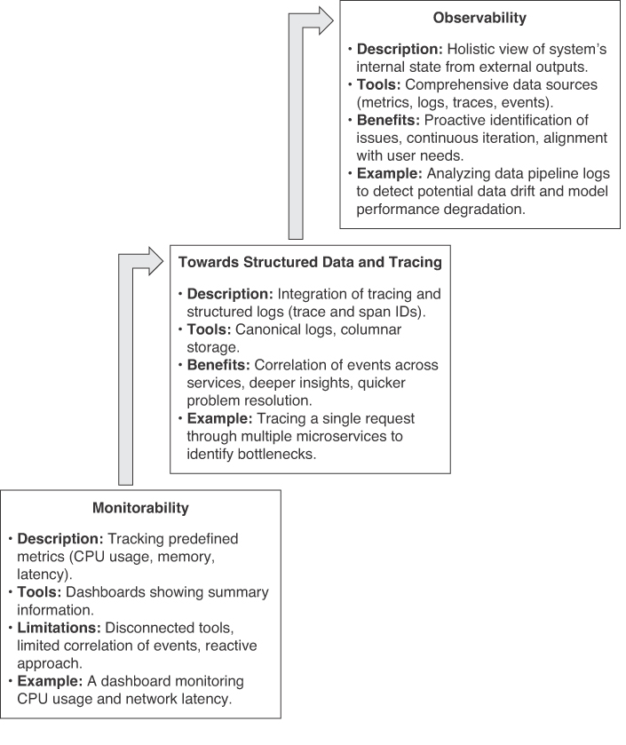
<figcaption><p><strong>Figure 11.1</strong> <em>Evolution from
monitorability to observability</em>.</p></figcaption>
</figure>
:::

::: section
#### []{#ch11.xhtml#page_206 .pagebreak}*11.2.2 Evolution toward Structured Data and Tracing* {#ch11.xhtml#ch11lev2sec02 .h4}

The evolution from basic monitorability to more advanced observability
practices began with the integration of tracing and the adoption of
structured logs. Tracing, which involves the correlation of events and
metrics across different services for a single request, offered deeper
insights into system behavior and interactions. The shift toward
structured logs, incorporating trace and span IDs, facilitated the
aggregation and analysis of data across distributed systems. This
approach allowed for the creation of canonical logs, leveraged columnar
storage, and data with high cardinality, significantly enhancing the
understandability of the system. By structuring data and correlating
disparate pieces of information, engineers could now analyze system
behavior more effectively, leading to quicker problem resolution and
improved system reliability.
:::

::: section
#### *11.2.3 From Structured Data to Observability* {#ch11.xhtml#ch11lev2sec03 .h4}

Observability represents a further evolution in how we interact with and
understand complex systems. It offers a holistic view of the system's
internal state, derived from outputs. Observability is not only about
collecting metrics and logs; it's about gaining insights into every
aspect of the software development life cycle that might contribute to
the system's behavior.

In the context of AI, monitorability refers to the ability to monitor
and track predefined AI system quality metrics and AI model quality
metrics, such as model performance metrics and fairness metrics. It
helps detect anomalies and data drift from the expected operational
environment and behavior and comply with regulations and ethical
guidelines. For example, an AI-based loan approval system could monitor
approval rates for different demographics, based on characteristics such
as gender and income level. Deviations from expected values may indicate
potential biases in the model architecture or training data.

Observability in AI systems is the ability to gain insights into the
inner workings of the AI system at the model level, the system level,
and the model development and deployment pipeline level, and into its
operating infrastructure. It enables developers to proactively identify
potential data, model, or concept drift and to anticipate performance
degradation and incidents before they adversely impact users. To extend
our loan approval example, proactive analysis of data pipeline logs can
help in the early detection of bottlenecks or errors during data
ingestion and preprocessing, which might lead to data or concept drift.

[]{#ch11.xhtml#page_207 .pagebreak}Monitorability is more reactive,
concentrating on identifying AI system issues as they occur.
Observability is more proactive, focusing on understanding an AI system;
detecting data, model, and concept drift early; and preventing
incidents. Furthermore, observability leverages a broader range of data
sources, including various metrics, logs, traces, and events generated
by the AI system, rather than solely relying on predefined metrics.
Monitorability of AI systems is akin to a car's dashboard, on which
instruments such as a speedometer, fuel gauge, and engine temperature
gauge provide real-time feedback. Observability is analogous to opening
the car's hood and inspecting internal components such as the engine and
transmission to gain deeper insights.
:::
:::

::: section
### 11.3 Approaches for Enhancing Observability {#ch11.xhtml#ch11lev1sec03 .h3}

Achieving observability requires two different approaches: recording
system activity and tracing the lineage of data items and the components
included in the system. To support accountability, not just the data and
component lineage should be recorded, but also the personnel involved in
generating the data model and the components. Monitoring is designed
into the architecture, and lineage is recorded during the model build
and system build phases. Both elements must be available during
operations. We begin with the architecture, before covering all relevant
phases of the life cycle.

::: section
#### *11.3.1 Architecture* {#ch11.xhtml#ch11lev2sec04 .h4}

One mechanism used in the architecture to support observability is
having a monitor. The system should record its activity through
maintaining logs. Common logging practices include the following:

-   **Log levels:** Categorize the importance of a logged message.
    Common levels are debug, info, warning, error, and fatal. This lets
    developers control the verbosity of logs, filtering out less
    important details during normal operation.

-   **Structured logging:** Use formats that are machine-readable (e.g.,
    JSON). This allows for easier parsing by analysis tools and
    facilitates aggregation of logs.

-   **Include context:** Include relevant details such as timestamps,
    user IDs, URLs, or error codes. This context helps developers
    quickly understand the situation when investigating issues.

[]{#ch11.xhtml#page_208 .pagebreak}A data lineage tool can provide
insights into the history of the data used in the model making a
prediction. The architecture should include interfaces into the
repositories used to store data and the tools that can track their
lineage.

In addition, the software bill of materials (SBOM) will provide the
lineage of the non-AI components. The architecture should provide
mechanisms for accessing the SBOM.

Later in this chapter, we list a number of observability- and
monitoring-related features. For these features to be available, they
need to be designed and built into the system. A DevOps best practice is
to treat ops personnel as first-class stakeholders---doing so will
result in requirements for system properties concerning logging,
monitoring, and more.

We now turn to the activities associated with building the model.
:::

::: section
#### *11.3.2 Data Preparation and Model Build* {#ch11.xhtml#ch11lev2sec05 .h4}

Mechanisms used during data preparation include lineage tools and
explaining mechanisms.

::: section
##### Model Lineage Tools {#ch11.xhtml#ch11lev3sec01 .h5}

Data used for building AI models is collected from various sources such
as databases, APIs, and web-based text data. Before the data is stored
in the warehouse, it often undergoes transformation, which involves data
cleaning, normalization, and aggregation. The transformed data is then
loaded into the data warehouse. This could involve writing the data into
specific tables designed for query performance and storage efficiency.
The loading process may be done in batches or as a continuous stream.

Tracing the original sources of the data used in model training can be
challenging, particularly when the data is gathered from various sources
and undergoes multiple transformations. Data lineage tools associated
with the data warehouse can track the journey of data as it flows
through the system, from its origins (source systems) to its
destinations within the data warehouse.

Data lineage tools also provide real-time access to the lineage of data
items. The architecture must be designed to use that type of interface
to enable observability during operations.

Model testing and evaluation should include tests to determine whether
the data that goes into a model and its lineage can be accurately
tracked. Uncertainties in model predictions should be calculated and
associated with the model.
:::

::: section
##### []{#ch11.xhtml#page_209 .pagebreak}Explainability {#ch11.xhtml#ch11lev3sec02 .h5}

The basis for explaining model results is developed during the model
test. Subdivided along the dimension of scope, there are two main types
of XAI techniques: local explanation techniques and global explanation
techniques.

Local explanation techniques provide instance-based explanations, which
can help users understand the feature importance and correlations that
led to the specific outputs. There are two well-known local explanation
algorithms: Local Interpretable Model-Agnostic Explanations (LIME) and
Shapley Additive exPlanations (SHAP). LIME explains a black box model by
determining the contribution of each feature to the decision output for
a specific input. SHAP provides local explanations by comparing the
model's decision outputs when a feature is included versus excluded.
Insights can be gained into the importance of a feature value by
perturbing it slightly (e.g., varying the income level in a loan
application) and comparing the differences. By providing information
about the feature importance and correlations that resulted in a
decision, a local explainer can give insights into the inner workings of
a model and the reasoning behind a specific decision.

Global explanation techniques can help users understand the general
behavior of an AI system by using a set of data instances to produce
explanations. These explanations provide an overview of the model's
behavior by visualizing the relationship between the input features and
the model's output over a range of values. Partial dependence plots
provide a visualization of feature importance. Global surrogate models,
such as tree-based models and rule-based models, can be used to
understand complex AI models because they have inherent explainability,
allowing the output decisions to be traced back to their source. Global
explanations simplify the workings of complex AI models by reducing them
to linear counterparts, which are easier to understand.

There are two options to consider when explaining the decision-making
process of foundation model-based systems: "think aloud" and "think
silently." Both are the subject of ongoing research. In addition,
mechanical interpretability---understanding and tracing the inner
workings of models at a structural level---is another approach that is
being explored to improve transparency and explainability in these
systems.
:::
:::

::: section
#### *11.3.3 System Build* {#ch11.xhtml#ch11lev2sec06 .h4}

System build is the stage in which the SBOM is constructed. During the
system build phase, components are drawn from the version control system
and model development, and dependencies are drawn from libraries and
[]{#ch11.xhtml#page_210 .pagebreak}downloaded from repositories. All of
these elements are entered into the system SBOM. One method for
recording the SBOM is to place it into a versioning registry.
Incorporating model versions leads to the concept of a co-versioning
registry.

::: section
##### Co-versioning Registry {#ch11.xhtml#ch11lev3sec03 .h5}

Systems are continuously changing. Both AI models and traditional
software components evolve through updates. Tracing the specific
versions of each component involved in a decision and understanding the
impact of changes on model behavior can be challenging. Compared with
traditional software, AI systems have more complex dependencies and may
evolve more frequently due to their data-driven nature. From the
perspective of the AI system, knowing the version of each integrated
component is key. From the viewpoint of the AI component, it is
important to understand which datasets and parameters were used for
training and which data was used for evaluation.

Co-versioning of AI components and artifacts provides end-to-end
provenance guarantees throughout the entire AI system life cycle. A
co-versioning registry tracks the co-evolution of software components
and AI artifacts. Several different levels of co-versioning are
possible: co-versioning of AI and non-AI components, co-versioning of AI
artifacts (i.e., co-versioning of the data, model, code, and
configurations), and co-versioning of local models and global models in
federated learning. Co-versioning enables effective maintenance and
evolution of AI components because the deployed model or code can be
traced to the exact set of artifacts, parameters, and metadata that were
used in its development.
:::
:::

::: section
#### *11.3.4 System Test* {#ch11.xhtml#ch11lev2sec07 .h4}

During system tests, the operation of the total system is tested. This
includes the elements that we have already mentioned:

-   Logs to enable the tracking of a query through various components

-   Accessing the data lineage created during model build

-   Accessing the SBOM

In addition, system-wide tests covering expected use cases involving
observability should be run. These tests can involve a human in the loop
to provide for interactivity during operations.
:::

::: section
#### []{#ch11.xhtml#page_211 .pagebreak}*11.3.5 Operations* {#ch11.xhtml#ch11lev2sec08 .h4}

During operations, observability can be enhanced through several
measures. For these measures to be available, they have to be included
in the system design and the environment setup.

-   **Monitoring:** Continuous monitoring can be based on metrics
    gathered from the infrastructure, logs generated by the system, and
    uncertainties of the predictions. Associated with the monitors
    should be a combination of alerts together with the thresholds for
    generating those alerts. Independent monitoring agents can be used
    to perform the monitoring and keep track of compliance with
    regulations.

-   **Integrating explainability tools:** Explainability techniques such
    as LIME and SHAP can be integrated into the monitoring dashboard to
    visualize feature importance, decision pathways, potential biases,
    and more. The information displayed is that collected during the
    model test.

-   **Independent overseeing agents:** These agents act as external
    systems that observe and analyze the behavior of foundation model
    (FM)--based systems. They can ensure FM-based systems behave
    responsibly and avoid generating offensive or undesired content and
    actions. If necessary, they might take steps to address detected
    issues---for example, notifying humans or stopping specific
    operations.
:::
:::

::: section
### 11.4 Summary {#ch11.xhtml#ch11lev1sec04 .h3}

Achieving observability involves architectural mechanisms such as
monitors, SBOM access modules, and modules that access various
repositories created during the data preparation and build stages of the
life cycle. During these stages, lineage capturing tools and model
versioning tools should be employed. These can be accessed during
operations to help explain why a particular output or decision was
generated.

Currently, the techniques for explaining the behavior of FMs are very
limited, but this is a very active area of research. Today, the
explanations might be partial and hard to understand, but that situation
is expected to improve in the future.
:::

::: section
### 11.5 Discussion Questions {#ch11.xhtml#ch11lev1sec05 .h3}

1.  Ask your favorite chatbot to differentiate between monitorability
    and observability in AI systems. Then ask it to explain its answer.
    Is the explanation satisfactory?

2.  []{#ch11.xhtml#page_212 .pagebreak}How do you define and measure the
    "health" of an AI system?

3.  Suppose a site reliability engineer (SRE) is responsible for
    responding to alerts. How would an SRE go about analyzing an alert
    from an AI system involving data drift? Can this be accomplished and
    a repair found in real time?
:::

::: section
### 11.6 For Further Reading {#ch11.xhtml#ch11lev1sec06 .h3}

To gain insights into achieving observability in production ML
pipelines, refer to Shankar and Parameswaran's work, which discusses the
challenges and approaches for enhancing observability in ML systems
\[[Shankar 21](#ref.xhtml#ref46)\].

For a broader understanding of observability in production environments,
including engineering best practices to achieve production excellence,
see *Observability Engineering* by Majors, Fong-Jones, and Miranda
\[[Majors 22](#ref.xhtml#ref37)\].

For a relevant discussion of the implications of observability in the
context of software supply chains and how it impacts AI systems, consult
Xia et al.'s empirical study on SBOMs \[[Xia 24B](#ref.xhtml#ref58)\].
:::
:::
:::

[]{#ch12.xhtml}

::: {#ch12.xhtml#book-content}
::: {#ch12.xhtml#sbo-rt-content}
## []{#ch12.xhtml#page_213 .pagebreak}*12* {#ch12.xhtml#ch12 .h2}

## *The Fraunhofer Case Study: Using a Pretrained Language Model for Tendering* {.chap_ttl}

with Sven Giesselbach, Dennis Wegener, Katharina Beckh, Claudio Martens,
Hammam Abdelwahab, Birgit Kirsch, and Vishwani Gupta

*As part of Fraunhofer, the largest organization for applied research in
Europe, the Fraunhofer Institute for Intelligent Analysis and
Information Systems (IAIS) is one of the leading scientific institutes
in the fields of Artificial Intelligence (AI), Machine Learning, and Big
Data in Germany and Europe. Around 350 employees support companies in
the optimization of products and services, as well as in the development
of new technologies, processes, and new digital business models.
Fraunhofer IAIS is shaping the digital transformation of our working and
living environments: with innovative AI applications for industry,
health, and sustainability, with forward-looking technologies such as
large-scale AI language models or Quantum Machine Learning, with offers
for training and education or for the testing of AI applications for
security and
trustworthiness.^[1](#ch12.xhtml#ch12fn1){#ch12.xhtml#ich12fn1}^*

[1](#ch12.xhtml#ich12fn1){#ch12.xhtml#ch12fn1}.
[www.iais.fraunhofer.de/](http://www.iais.fraunhofer.de/)

I[N THIS CHAPTER]{.smallcaps}, we present a case study that explores the
innovative use of AI in the tendering process of a large electronics
supplier. Throughout this chapter, we examine how the integration of AI
technologies has changed the tendering process. We explore the
challenges the company faced, the strategies it used to overcome these
obstacles, and the results it achieved.

[]{#ch12.xhtml#page_214 .pagebreak}The remainder of this chapter unfolds
as follows. We first describe the tendering process and the specific
problems the company wants to solve. Next, we present the requirements
for the AI solution regarding data, infrastructure, operations, and
quality. After the case study setup, we dive into the three different
phases of the AI system's development: proof of concept (PoC),
implementation, and production.

::: section
### 12.1 The Problem Context {#ch12.xhtml#ch12lev1sec01 .h3}

Fraunhofer IAIS was contracted to solve a problem for a client, using
its specific expertise in AI. The client was a big vendor providing
various electronics parts such as different rocker switches. Its
portfolio of products exceeds 50,000 items. The client takes part in the
tendering processes depicted in [Figure 12.1](#ch12.xhtml#ch12fig01).

<figure id="ch12fig01" class="figure">
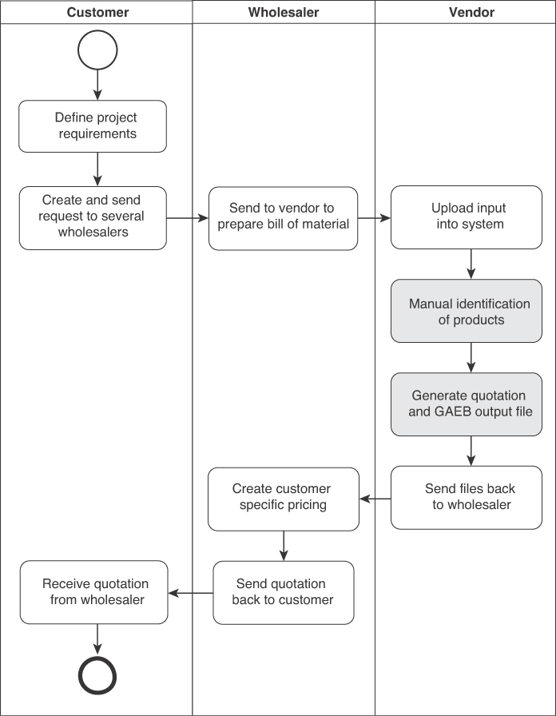
<figcaption><p><strong>Figure 12.1</strong> <em>The tendering process.
The gray boxes include the manual steps that are later replaced by the
AI system</em>.</p></figcaption>
</figure>

The tendering process begins when a customer initially inquires about a
product or service and ends when the customer actually places an order.
In industries such as construction, where there is a three-tier
distribution model, the process starts with architects requesting quotes
for electrical components needed in their projects. These requests are
standardized and sent out to wholesalers, which then pass them on to
different vendors to get pricing information. The request to the vendor
takes the form of a request for tender (RFT), also called a "position
request." Vendors then propose products that match the descriptions
provided in the request. Finally, once the wholesaler has gathered all
of the necessary pricing information, it compiles the information into a
quotation and sends it back to the architect. This process requires a
deep understanding of products and a lot of effort, especially when
creating custom quotes for wholesalers.

Currently, this matching process at the vendor's side is done manually
by employees in the quoting department (hereafter referred to as
"employees"). It includes reading and understanding the requirements
described in the tender, matching the requirements with the product
portfolio, and then selecting the correct products in the right amounts.
Given the sheer number of products, this is a tedious, time-consuming,
and difficult task. The client therefore looked into AI as a solution to
automate parts of the process. Its idea was to start with a subset of
the most frequently sold products and build an AI application that
automatically adds them to a bid whenever appropriate.

[]{#ch12.xhtml#page_215 .pagebreak}[]{#ch12.xhtml#page_216
.pagebreak}When the client approached Fraunhofer, it had already had an
unsuccessful PoC with another company. The major challenges that the
client faced were mostly language hurdles. The client had failed to
reach a mutual understanding of the business goals and the data.

::: section
#### *12.1.1 Requirements: Interactions, Integration, Data, and Quality Metrics* {#ch12.xhtml#ch12lev2sec01 .h4}

The goal of the overall project was to partly automate the bidding in
the tendering process, as shown in the right-hand swimlane "vendor" in
[Figure 12.1](#ch12.xhtml#ch12fig01).

In this process, a wholesaler sends requests in the GAEB data exchange
format to the vendor; GAEB is a format particularly developed for data
processing in the building sector. The file is then redirected to the AI
back end. There, the elements of the RFT are analyzed by the model, and
the model assigns a product set recommendation per element. These
recommendations are then uploaded in the vendor's SAP (the enterprise
software) system. The client built a robot via robotic process
automation (RPA; a user interface--level automation method), which
processed the JSON response from the AI back end and then entered the
suggested products in the vendor's SAP system. In the SAP system, the
employees in the quoting department can validate and, if necessary,
correct the model's suggestions.

The data for training, validation, and testing of the AI back end
consisted of approximately 30,000 German request documents, which were
collected over a two-year span. Each document contained several
positions, detailing in a textual description what kind of product the
customer requests, and each position was mapped to one or several
product numbers reflecting the product set proposed to the client in the
resulting offer. The average number of positions per document was 22
and, on average, two product numbers were mapped to a position. In
total, there were roughly 40,000 unique product sets, where each product
set consists of one to several product numbers.

The data was randomly split into three sets---a training set, an
evaluation set, and a test set---with the proportions 80:10:10. While
both the training and validation sets served as ground-truth data for
model training and determining the best model parameters, the test set
was used to estimate model performance during the evaluation phase. To
show representative results, the test set was selected by random
sampling; it contained a huge number of documents. This is an example of
the process described in [Chapter 5](#ch05.xhtml#ch05), [AI Model Life
Cycle](#ch05.xhtml#ch05).

To assess the quality of the model, both quantitative and qualitative
methods were used. In addition to an automated evaluation, the employees
[]{#ch12.xhtml#page_217 .pagebreak}assessed the model performance on
unseen data and categorized the model recommendations into three
categories: incorrect, correct, and functionally correct. The last
category refers to model recommendations that include the correct
product type but do not meet the expected characteristics of the product
(e.g., wrong color). Qualitative feedback was collected through
exchanges with the employees in regular client meetings.
:::

::: section
#### *12.1.2 Development and Operations* {#ch12.xhtml#ch12lev2sec02 .h4}

The project faced additional challenges because two sites were involved.
The data resided in the company's on-premises systems, but Fraunhofer
was developing the system and training the model. We decided to perform
the exploration, development, and CI/CD phases at Fraunhofer, as the
company could not provide all of the necessary knowledge and compute
resources at the beginning of the project. System operation takes place
at the company side.

Challenges occurred on both the organizational and technical sides.
Organizational challenges included the timing of batch data handover to
the Data Science Team as well as the handover of the machine learning
(ML) solution, including the ML model, as a component to the company so
it could be included in the company's processes. Technical challenges
were the actual transfer format and tooling for the batch data transfer,
and the definition and testing of the ML component without having access
to the company's infrastructure.

We decided to follow a containerized setup using Docker from the
beginning to address the technical challenge of transferring the ML
application, so the component was encapsulated, isolated, portable, and
prepared for scale-up.
:::
:::

::: section
### 12.2 Case Study Description and Setup {#ch12.xhtml#ch12lev1sec02 .h3}

The project was structured into three phases: (1) a PoC to prove the
feasibility of the approach, (2) a main project to integrate the
application on the customer side, and (3) maintenance and operation
after the deployment. The PoC had an overall duration of three months
with a break at the halfway point, at which time the project partners
could decide to halt the project if no significant progress was made. In
the main project (implementation phase), the goal was to bring the
solution from a prototypical state into a state of productive usage.
Therefore, modeling and MLOps activities were jointly performed in this
phase. In the production phase, the solution was already running in a
production environment. The goal of this phase was to maintain and
further enhance the application.

::: section
#### []{#ch12.xhtml#page_218 .pagebreak}*12.2.1 MLOps Approach and Generic Architecture* {#ch12.xhtml#ch12lev2sec03 .h4}

For this case study, we follow the MLOps practices introduced in
[Chapter 2](#ch02.xhtml#ch02), [Software Engineering
Background](#ch02.xhtml#ch02), [Chapter 5](#ch05.xhtml#ch05), [AI Model
Life Cycle](#ch05.xhtml#ch05), and [Chapter 6](#ch06.xhtml#ch06),
[System Life Cycle](#ch06.xhtml#ch06). At IAIS, we developed our own
instantiation of MLOps over the years, an overview of which is depicted
in [Figure 12.2](#ch12.xhtml#ch12fig02).

<figure id="ch12fig02" class="figure">

<figcaption><p><strong>Figure 12.2</strong> <em>The IAIS MLOps cycle and
its phases and technical environments</em>.</p></figcaption>
</figure>

The six main phases (requirements analysis, exploration, and so on)
shown in [Figure 12.2](#ch12.xhtml#ch12fig02) should be familiar to the
readers of this book, albeit in a slightly different grouping than
discussed in [Chapters 2](#ch02.xhtml#ch02), [5](#ch05.xhtml#ch05), and
[6](#ch06.xhtml#ch06). However, there are two areas in which the IAIS
instance of MLOps differs: (1) the details given for the environments on
the outside, which are more specific and prescriptive, and (2) the
"project data" in the center. Integration into the company's processes
is crucial, especially when it comes to automation. Therefore,
[]{#ch12.xhtml#page_219 .pagebreak}in addition to the six main areas,
MLOps includes a seventh important area: communication, unified project
and process data management, and information transitions between the
other six areas. This is referred to as the central project data area.

We had used our MLOps approach in several successful customer projects
in the past, so we chose it for this project as well. Next, we describe
some of the organizational and technical aspects of MLOps, insofar as
they have not been discussed elsewhere in the book.

In our view, development work should be closely interconnected with
continuous feedback, revision, and repetition, following agile patterns
such as Scrum and Kanban. The iterative optimization process in model
development for ML solutions is based on technical validation and the
quality and plausibility of the models. It is important to consider
requirements and feedback from the business side, including management,
strategy, organization development, sales and marketing, and production.
The project organization needs to ensure that the business side is well
integrated into agile work planning and the goal setting and evaluation
of the models.

ML solution projects generally follow an agile organizational structure.
In contrast, delivering and operating application versions can largely
be automated through CI/CD pipelines. The deployment of new versions and
monitoring in operation are coordinated with the client's business
departments.

Our best practice also advocates the use of virtualization technologies
such as Docker containers, so as to ensure consistent and reusable build
and test environments. These environments can then be reused for
demonstrations or later production use if the target environment
supports virtualization. CD further automates the configuration and
deployment of artifacts in different target environments, ranging from
development-oriented test environments to operational production
environments.

To successfully implement and run the ML solution for our project, we
needed a technical architecture that supported the different phases and
the three environments for our MLOps approach. [Figure
12.3](#ch12.xhtml#ch12fig03) visualizes the general technical reference
architecture that we often use to implement ML systems, and which we
used for this particular project. Besides the three environments, the
top part of the figure shows the repositories for the code and the
containers. On the bottom, the Data layer is depicted; it is the data
prepared and stored. Note that the contracted part of the system focuses
on the back end---the integration with non-AI service components was the
responsibility of our customer, but the service we developed had to meet
the functional and quality requirements to fit into the larger system.

[]{#ch12.xhtml#page_220 .pagebreak}

<figure id="ch12fig03" class="figure">

<figcaption><p><strong>Figure 12.3</strong> <em>The general technical
architecture supporting the MLOps cycle, which is refined and made more
concrete later in the chapter</em>.</p></figcaption>
</figure>

The architecture depicted in [Figure 12.3](#ch12.xhtml#ch12fig03) can be
instantiated with the respective tools and frameworks according to the
requirements of an individual project. In the next section, we describe
the important parts and components of the architecture that were needed
to set up and run our project. We then present the details of the
implementation, including the choice of tools and frameworks.

This high-level architecture enables a seamless transition from model
development to deployment, ensuring that the trained ML models are
reliable, scalable, and easily maintainable in production.
:::

::: section
#### *12.2.2 Setup of ML Solution* {#ch12.xhtml#ch12lev2sec04 .h4}

The task was modeled as a multi-class classification problem. (See
[Chapter 3](#ch03.xhtml#ch03), [AI Background](#ch03.xhtml#ch03), for a
description of this modeling technique.) A label is a product set that
can contain one or several products. Each document contains multiple
positions, each of which is assigned a product set. In the early
modeling iterations, every single position was used for recommendation
individually. Later, a sequential model was used, which carried
information across positions to ensure consistency of recommendations
(e.g., with regard to color and product brands).

We started with a distributed embedding-based model (such as FastText),
which is easy to train, requires a low level of resources, and can serve
as a powerful baseline. After seeing that this model yielded promising
performance, albeit with a lot of room for improvement, we pivoted to
more complex BERT-based models in the main project. BERT (Bidirectional
Encoder Representations from Transformers) models are pretrained on vast
amounts []{#ch12.xhtml#page_221 .pagebreak}of text and can be fine-tuned
for specific tasks with few annotated samples. A vast amount of research
has investigated classification methods based on these models. One of
their most notable benefits is that they give users a confidence value
for their recommendations, which makes it easier to spot data points
that are challenging for the models. We decided to start with
easy-to-implement models, which would give our client an early
indication of whether its use case could be solved, and to scale the
complexity of the models based on our evaluations and the feedback from
the employees. Typically, these kinds of low-resource approaches need
more annotated training data. However, data availability was not a
challenge in this project, in particular because we opted to handle the
most frequently sold products first.

Generative large language models (LLMs) were not used for various
reasons. First, at the time of the project, no appropriate open-weight
models were available, and the client had ruled out cloud-hosted models.
Second, due to the large label space, the need for scalability, and the
necessity to obtain a confidence value for each recommendation, smaller
encoder-based models were preferred over LLMs. Since this project's
completion, smaller open-source LLMs have emerged, which could be a
viable alternative to our current models, and with them, methods to
constrain the output of their predictions/recommendations to certain
classes and even obtain confidence values from them.

In general, LLMs offer a wealth of benefits, such as the need for little
to no annotated training data, and should be considered in any natural
language processing (NLP) project. However, they also lead to the
amplified challenges and requirements during training and operation. For
more details on LLMs and their operation (LLMOps), refer to [Chapter
4](#ch04.xhtml#ch04), [Foundation Models](#ch04.xhtml#ch04). More
details of the model architectures we selected in the project are given
in the discussions of the PoC, implementation, and production phases.
:::

::: section
#### *12.2.3 Stakeholder Involvement* {#ch12.xhtml#ch12lev2sec05 .h4}

Throughout all phases, stakeholders from the client side were involved
in various ways. Fraunhofer stated that this client involvement was one
key success factor for the collaboration. Stakeholders on the client
side included a decision maker, a business unit lead, a project lead,
the employees (the actual end users), and IT professionals. The
employees were especially heavily involved: They provided valuable
insights about the data, helped with modeling decisions, and gave
regular feedback about model outputs. The business unit lead and the
decision maker were regularly updated about the project progress, which
helped with expectations management and allowed []{#ch12.xhtml#page_222
.pagebreak}for a regular prioritization of the next steps based on the
business goals. Finally, the IT professionals were involved in
integrating the solution on the client infrastructure and into their
software systems.
:::

::: section
#### *12.2.4 PoC Phase* {#ch12.xhtml#ch12lev2sec06 .h4}

::: section
##### Initializing the PoC {#ch12.xhtml#ch12lev3sec01 .h5}

During the initialization of the PoC, the client and Fraunhofer had
multiple meetings. As the client already had an unsuccessful PoC prior
to this PoC, it wanted to make sure that there were significant
differences between the approaches adopted in the two attempts and that
the problems from the last PoC were accounted for. The client shared a
subset of the data with Fraunhofer for preliminary investigation; it
also shared the experiences as well as the results from the prior PoC. A
workshop was held to jointly determine the goals of the PoC and the
approach to be taken by Fraunhofer; it included the employees who would
actually use the applications.
:::

::: section
##### Implementing the PoC {#ch12.xhtml#ch12lev3sec02 .h5}

In the PoC phase of the project, we mainly addressed three phases of the
MLOps cycle: requirements analysis, exploration, and the project data.
There was no full MLOps setup yet, so the main goal of this phase was to
analyze whether the use case with all its requirements could be
addressed with an ML solution that offered sufficient quality. From the
technical side, mainly data preprocessing and modeling tasks were
performed. These were done within an early version of the development
environment, where Jupyter Notebooks and Python scripts were used.

The focus of the PoC was the development of a minimal viable
model---that is, a model that showed a certain level of quality in the
recommendations could be reached for a subset of the data and the
labels. We opted for modeling the use case as a classification problem,
where the class labels were bundles of products that are sold together.
A subset of a few thousand products was chosen for this phase. The
client emphasized the importance of precision over recall, as it wanted
the model to be certain in its recommendations but was less concerned
about whether the model could include all products in its
recommendations. The bulk of the work on the PoC was spent parsing and
preprocessing the tender texts correctly, which were given in the GAEB
format. We opted for a simple model based on distributed embeddings for
the first experiments, whose results proved sufficient to convince the
client to proceed to the implementation phase.

[]{#ch12.xhtml#page_223 .pagebreak}During and after the PoC phase, the
client and Fraunhofer were in close contact and regularly shared
insights about the modeling results. This led to a prioritized list of
improvements that Fraunhofer would fix later in the implementation
phase.

In the PoC phase, we used Docker-based virtualization. Containerization
is useful when doing a PoC of an ML solution because it provides
benefits even in this early stage. (See [Chapter 2](#ch02.xhtml#ch02),
[Software Engineering Background](#ch02.xhtml#ch02), for a fuller
explanation of containers.) Because Docker containers are highly
portable and can run on any system that supports Docker, irrespective of
the underlying operating system (OS), there is no need for complex setup
or configuration when showcasing the PoC on different platforms.
Additionally, stateless Docker containers can easily be scaled up or
down during the implementation and production phases based on workload
requirements, so they are a convenient choice to test the performance of
the ML solution under different scenarios or with varying data volumes.
Finally, Docker simplifies dependency management by allowing the
definition of required libraries, packages, and versions in a Docker
file. This ensures consistency and eliminates the risk of version
conflicts during the PoC. Overall, Dockerization facilitates the
deployment and testing of ML solutions during the PoC phase, providing a
consistent, reproducible, and portable environment for evaluation and
validation.
:::

::: section
##### Evaluation and Results of the PoC Phase {#ch12.xhtml#ch12lev3sec03 .h5}

The PoC was concluded successfully. Fraunhofer performed both
quantitative and qualitative evaluations. The quantitative evaluation
was conducted using a held-out test set with given ground truth, meaning
a correct product set assignment per requirement text. Applying the
model to this test set, precision, recall, and F1 scores were calculated
to estimate the model's performance.

As part of the qualitative evaluation, Fraunhofer and the client
manually investigated the model results on an additional set of
requirements documents and identified and analyzed model errors. Based
on this error investigation, some recurring errors of the models were
identified. Working together, Fraunhofer and the client prioritized the
potential improvements. The client decided to proceed to the
implementation phase in which the models would be improved and
integrated in a service that could be run on the client infrastructure.
:::
:::

::: section
#### *12.2.5 Implementation Phase* {#ch12.xhtml#ch12lev2sec07 .h4}

In this section, we describe how we implemented the production-ready
system for this project. We first present the detailed architecture, and
then []{#ch12.xhtml#page_224 .pagebreak}give details on the different
pipelines. Finally, we describe the ML part of the solution.

::: section
##### Technical Architecture {#ch12.xhtml#ch12lev3sec04 .h5}

After the implementability of the ML system is successfully validated in
the PoC phase, the implementation phase involves the full MLOps cycle.
Starting from the exploration results from the PoC, the development
environment addressing the exploration and development is set up to
allow production-ready exploration and development. Next, the build and
test environment is set up to address CI/CD concerns. Finally, the
handover to the production environment and the operation and monitoring
processes are set up.

[Figure 12.4](#ch12.xhtml#ch12fig04) visualizes the technical
architecture of the ML system in our case study. The general
architecture that we presented in the requirements section was further
specified, including the tooling to be used.

<figure id="ch12fig04" class="figure">
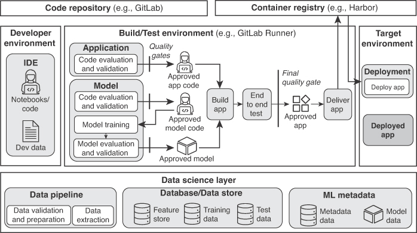
<figcaption><p><strong>Figure 12.4</strong> <em>The technical
architecture of our ML system</em>.</p></figcaption>
</figure>

For the top layer with the repositories, we used GitLab for the code and
Harbour for the Docker containers (different instances for testing and
for deployment). The Data layer at the bottom includes the components
related to data preparation and extraction: a MinIO storage component
that holds training data, test data, and features; and an MLflow
component that serves as an experiment tracking tool for comparing the
different development and training executions and model store.

[]{#ch12.xhtml#page_225 .pagebreak}The middle layer includes the three
environments from the MLOps cycle and the general architecture. For the
development environment, we used mainly Jupyter Server and PyCharm. For
the build and test environment, we used GitLab CI/CD pipelines for the
training and the deployment and delivery processes. The GitLab Runner,
which executes the jobs of the GitLab CI/CD pipelines, had also a
connection to a computing cluster providing GPU-based resources that
were needed for the training. Details on these pipelines are given in
the next subsection. The approved ML application was delivered as a
Docker image through Harbour's registry. From there, a container was
deployed into a customer target runtime environment on-premises at the
client side. So, from the perspective of the case study, the target
environment was a scalable environment that could run Docker containers.

The whole architecture including the tooling---except the target
environment---was set up at the research institute.
:::

::: section
##### Pipeline Approach {#ch12.xhtml#ch12lev3sec05 .h5}

For the implementation, we split our solution into two major pipelines:
the training pipeline and the deployment pipeline. Splitting the work
into a training pipeline and a deployment pipeline is beneficial for
several reasons.

First, it allows for modular development, as each pipeline component can
focus on its specific tasks. The training pipeline handles data
preparation, model training, and evaluation; it was mainly used by the
modeling team at Fraunhofer. The deployment pipeline focuses on building
and delivering the packaged application, which includes the model from
the training pipeline and is responsible for serving recommendations and
handling live data.

Second, separating the pipelines enables scalability. The training
pipeline often requires significant computational resources and time, so
it can be scaled independently to leverage powerful hardware or
distributed computing. In contrast, the deployment pipeline is just
executed in case a new model is created, but not for each of the
experiments.

Additionally, splitting into training and deployment pipelines
facilitates version control. The training pipeline manages model
versioning, experimentation, and tracking of different iterations. In
contrast, the deployment pipeline handles the deployment and serving of
specific application versions, allowing for easy rollback.

Moreover, decoupling the pipelines enhances efficiency and agility.
Updates or changes in the training pipeline, such as experimenting with
[]{#ch12.xhtml#page_226 .pagebreak}different models or hyperparameters,
do not disrupt the deployment pipeline. This separation enables faster
iteration and deployment of improvements to the ML solution.

In the tendering project, our primary focus was on the training and
deployment pipelines, with comparatively less attention given to the
intricacies of the data pipeline. We made an implicit assumption that
the training pipeline effectively received preprocessed data. This
choice stemmed from the adaptability of the portfolio of products used
as training features for the tendering classifier. Given the diverse
array of products, each with its availability status and detailed
descriptions, we opted for a manual approach to data processing. This
gave us the flexibility to explore the customer data and engage in
multiple rounds of communication with the client to determine how the
training data should be treated, both content-wise and structure-wise.

::: section
###### *Training Pipeline* {#ch12.xhtml#ch12lev4sec01 .h6}

During the PoC phase, multiple training experiments were implemented
manually using Jupyter Notebooks. These experiments included data
understanding, data, model training, and model evaluation. With the
training pipeline, we aimed to restructure the code such that training
experiments and retrainings were trackable and reproducible via an
automated pipeline. Specifically, the code structure was converted from
Jupyter Notebooks, which were used for explorative model development, to
Python modules. These modules were saved in a git repository on GitLab,
where the training pipeline was configured using GitLab Runner. With
GitLab Runner, developers can create and automate jobs that run in
either a sequential or parallel manner via the *gitlab-ci.yml*
configuration file as new code scripts are pushed to the GitLab
repository.

The ML training pipeline ([Figure 12.5](#ch12.xhtml#ch12fig05)) for our
tendering project was then configured to include the following jobs:

<figure id="ch12fig05" class="figure">
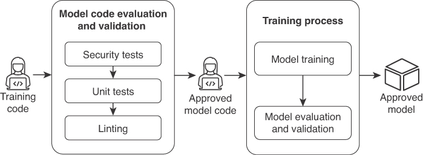
<figcaption><p><strong>Figure 12.5</strong> <em>The training
pipeline</em>.</p></figcaption>
</figure>

-   **Security tests:** Conduct security tests to ensure that the ML
    training code and the code for loading preprocessed data are secure
    from potential vulnerabilities. Here, we leveraged GitLab's
    integrated Static Application Security Testing (SAST).

-   **Unit tests:** Create and run unit tests to verify the
    functionality of individual components or units of the training
    pipeline. This ensures that []{#ch12.xhtml#page_227 .pagebreak}each
    unit performs as expected and facilitates early detection of issues.
    This step ensures that any future integration with the code will not
    break the training pipeline.

-   **Linting:** Perform linting on all the training code by leveraging
    the Pylint library---that is, enforcing conformance of the code
    style to the coding standard (PEP 8) to maintain code quality and to
    identify potential bugs. Linting also helps ensure consistency and
    readability of the training code for future code development.

-   **Model training:** Once the security tests, unit tests, and linting
    pass successfully, the pipeline triggers the training job to start
    with model training. To track the training's progress, the logs for
    the running job are used to look for bugs. Furthermore, the progress
    of the model training is tracked via MLflow Tracking's User
    Interface.

-   **Model evaluation:** The trained model is then evaluated using the
    held-out test set containing 10% of the original training data (see
    [Section 12.1.1](#ch12.xhtml#ch12lev2sec01), "[Requirements:
    Interactions, Integration, Data, and Quality
    Metrics](#ch12.xhtml#ch12lev2sec01)"). During evaluation, we
    calculate metrics such as accuracy, precision, and F1 score, which
    are logged and tracked by MLflow. After the end of the training job,
    multiple models are compared against each other using MLflow to
    facilitate the selection of the best model, which will later be
    deployed via the deployed pipeline.

The training pipeline was used for the actual training as well as
retrainings at a later stage. The details of the training process itself
and the training environment are described later in the chapter.
:::

::: section
###### []{#ch12.xhtml#page_228 .pagebreak}*Deployment Pipeline* {#ch12.xhtml#ch12lev4sec02 .h6}

After successful model training and evaluation on the tendering tasks,
the model's performance was communicated to the customer. If the model
was approved to be deployed into production, the deployment pipeline
took care of packaging the model into the application's Docker image,
then saved the application image in the Harbour registry. The model
received GAEB-format files and output a set of recommended products as a
CSV file in real time via a REST API.

The application code was managed in a separate GitLab repository with
its own GitLab Runner pipeline---that is, the deployment pipeline. Once
the code was pushed to the GitLab repository, this pipeline went through
the following jobs ([Figure 12.6](#ch12.xhtml#ch12fig06)). Note that the
first three steps are similar to the respective steps in the training
pipeline, though with a stronger focus on the application code:

<figure id="ch12fig06" class="figure">
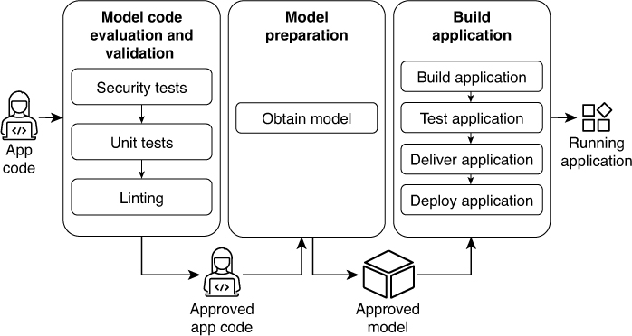
<figcaption><p><strong>Figure 12.6</strong> <em>The deployment
pipeline</em>.</p></figcaption>
</figure>

-   **Security tests:** Similarly to the training pipeline, this
    pipeline conducts security tests on the application's code to ensure
    that the ML application and its dependencies are secure from
    potential vulnerabilities.

-   **Unit tests:** Run unit tests to verify the functionality of
    individual code components of the ML application, especially if
    input preprocessing or output preprocessing steps are updated.

-   **Linting:** Perform linting on the code to enforce coding standards
    and identify potential issues with the ML application's structure.

-   **Select a model:** To transfer the trained ML model from the model
    registry into the ML application, the pipeline selects the best
    evaluated model and ensures that all the required model dependencies
    (e.g., model and data configuration files) are transferred as
    needed. This is done in preparation for building the ML application.

-   **Build application:** Build the ML application by packaging the
    code, dependencies, ML model, and any required configuration files.
    This step involves using Docker to create a reproducible and
    isolated environment for the application.

-   **Test application:** Run comprehensive tests on the built ML
    application and the Docker container to validate functionality,
    performance, and compatibility with the production environment.
    These tests ensure the model's responsiveness and the entire
    application's availability. They []{#ch12.xhtml#page_229
    .pagebreak}also examine error handling, per the input and output
    specifications. Namely, the tests ensure input and output validation
    such that the application accepts only the agreed-on GAEB files as
    inputs, and produces only CSV files.

-   **Delivery to Harbour Docker registry:** Once the ML application
    passes all the tests successfully, the pipeline delivers the
    containerized application to the Docker registry. From there, it can
    be deployed to the production environment.

-   **Application deployment:** The application is deployed in the
    production environment. Although it was technically feasible to
    automatically deploy the application using the pipeline, this step
    was implemented manually, as per our client's preference.

As you can see, the training and deployment pipelines included various
components that are used in classical DevOps pipelines as well.

Summing up, the technical architecture, including the training and the
deployment pipelines, allowed us to fully address the full MLOps cycle
in the implementation phase of the project.
:::
:::

::: section
##### []{#ch12.xhtml#page_230 .pagebreak}ML Solution {#ch12.xhtml#ch12lev3sec06 .h5}

The modeling team at Fraunhofer opted for a more sophisticated model in
the main project compared to the PoC---namely, a BERT-based pretrained
language model that was modified to make sequential predictions of large
texts. The goal was to mitigate weaknesses of the simple model from the
PoC phase, such as suggesting products with inconsistent colors or from
different vendors. The base model was a large German BERT model,
available for download from the Hugging Face model hub. This model led
to a significant increase in performance.

The model was complemented by rules and heuristics. The new system met
the criteria targeted by the client. The implementation phase was split
into two modeling iterations with intermediate feedback about the
modeling results. The modeling effort was supported by MLOps
activities---for example, the creation of reusable modeling and
deployment pipelines to allow for easier retraining. In terms of
environments, the desired ML solution (i.e., the model and the related
application) was explored initially in the development environment.
Training was then conducted in the build and test environment, where the
training pipeline handled the automatic training. Here, the deployment
pipeline ran after the training was finished, and the model was approved
as explained in the "Deployment Pipeline" section. The generated
application was containerized and saved in the container registry.
Finally, the application image was manually pulled from the registry and
pushed into the customer's target environment.
:::

::: section
##### Results of the Implementation Phase {#ch12.xhtml#ch12lev3sec07 .h5}

The implementation phase was concluded successfully, and the solution
was integrated on the customer side and used in production. The final
model achieved a micro-F1 score of 0.49 in experiments and an accuracy
score of 0.71 in an evaluation with the employees. The number of
functionally correct recommendations (e.g., the correct product type but
the wrong attribute such as color) was even higher, suggesting that
focusing on the correct product configuration has great potential to
further improve model performance. The results met the initial success
criteria determined by the customer.

At that point, the client tasked Fraunhofer with proceeding into the
production phase to allow for performing retraining of the model at
regular intervals.
:::
:::

::: section
#### *12.2.6 Production Phase* {#ch12.xhtml#ch12lev2sec08 .h4}

Having successfully deployed the ML application through the deployment
pipeline, the subsequent stage involved managing the application during
its []{#ch12.xhtml#page_231 .pagebreak}operational phase. Specifically,
the application needed to operate as intended and be capable of
achieving its predefined objectives in support of the tendering process.

During this stage, we entered into the seventh aspect of the MLOps
cycle---namely, communication. Establishing effective communication
between developer engineers and clients was recognized as important for
coordinating subsequent assessments of the technical performance of the
ML application and gathering feedback from the employees. Such ongoing
interaction lays the foundation for informed decisions and continuous
improvement.

Similar to how any ML system deals with real-world scenarios, the
dynamism of the real world introduces changes, affecting both data and
the model's performance. Consequently, continuous and proactive
communication and coordination among stakeholders are needed to address
and mitigate model performance drift. In this context, ensuring the
accuracy of recommendations for product tendering is important,
requiring constant alignment with the current business status.

Indeed, this approach strongly aligns with the fundamental concept of
ensuring the trustworthiness of the ML application functioning in the
real world. Maintaining open lines of communication and coordination
among stakeholders allows for a concerted effort to uphold the
reliability and credibility of the model. This commitment to ongoing
monitoring---by evaluating the model's performance and leveraging
feedback from the customer---reflects a dedication to maintaining the
model's trustworthiness in the face of evolving real-world conditions
through continuous model training.

These changes can cease to be technical bottlenecks with AI systems, as
modern ML models offer the capability for retraining using updated
datasets and, if necessary, adopting a new model architecture. The
retraining process can be facilitated through the adaptation of
configurations in the training and deployment pipelines described
earlier, allowing for integration of adjustments where needed. This
flexibility ensures that the model remains adaptable to evolving
circumstances, mitigating the challenges associated with static or rigid
systems.

During the production phase, the feedback of the employees was largely
positive, indicating that the recommendations of the model were
generally appropriate. However, the model often made recommendations
when none of the products it was trained on fit the input. To mitigate
this problem, the model was trained again, this time with the explicit
goal to learn when *not* to suggest any products. This improved the
model quality, and the updated model was delivered to our client.

::: section
##### []{#ch12.xhtml#page_232 .pagebreak}Results of the Production Phase {#ch12.xhtml#ch12lev3sec08 .h5}

The production phase highlighted issues with the model in productive
use, as mentioned above The feedback from the employees showed that even
though the model performed well according to metrics, it lacked an
understanding of when none of the products it was trained on was a
suitable recommendation. The insights from the employees led to the
implementation of an improved model, which mitigated these issues.
:::
:::
:::

::: section
### 12.3 Summary {#ch12.xhtml#ch12lev1sec03 .h3}

In this case study, we described how we successfully implemented a
project based on an MLOps cycle, which was divided into three project
phases: PoC, implementation, and production.

During the PoC phase, we conducted thorough research and experiments to
validate the feasibility of our ML model. In the development
environment, we collected relevant data, designed and trained the model,
and conducted rigorous testing to ensure its accuracy and effectiveness.
The PoC phase provided valuable insights and allowed us to fine-tune the
model before moving on to the implementation phase.

In the implementation phase, we set up a technical architecture that
supported all phases of the MLOps cycle. Within the build and test
environment, we integrated the model into an application as part of a
Docker container, ensuring seamless deployment and integration into the
production systems in the target environment. As part of the
implementation, we created automated pipelines for (re)training and
deploying the model to ensure that the model was updated with the latest
data. Additionally, we put monitoring and logging mechanisms in place to
continuously track the model's performance and detect any anomalies.

Moving into the production phase, we established regular maintenance and
updates to optimize the model and adapt it to changing business needs.
Continuous monitoring and feedback loops were put in place to ensure any
issues could be identified and resolved in a timely manner. Regular
performance evaluations were conducted to assess the impact of the model
on business outcomes.

Overall, the successful implementation of the MLOps cycle enabled us to
transition from the PoC phase to production. The iterative nature of the
MLOps approach allowed us to continually improve the model's
performance, maintain its reliability, and deliver significant business
value.

[]{#ch12.xhtml#page_233 .pagebreak}The usage of pretrained language
models proved vital for the project's success. Replacing the PoC model,
which was based on distributed embeddings, with a BERT-like model led to
a significant performance increase, matching the goals of the customer.
Nevertheless, complementing the model with rules and heuristics was
necessary to make the solution production-ready and to ensure
consistency and correctness of the results.
:::

::: section
### 12.4 Takeaways {#ch12.xhtml#ch12lev1sec04 .h3}

This case study raises several important points:

-   MLOps requires sophisticated and heavily engaged clients. This case
    study does not describe a turnkey approach where Fraunhofer provided
    a solution and the client simply adopted it. Instead, the client was
    involved in most aspects of the solution.

-   The solution required multiple iterations testing different models
    and different approaches. One model was used for the PoC and
    another, more sophisticated model was used for production.

-   Fraunhofer leveraged emerging research (the BERT models). The
    techniques used in AI systems are evolving and, especially for a
    research organization like Fraunhofer, it is important to stay
    abreast of the latest developments.

-   The solution leveraged a number of freely available tools (e.g.,
    tools from GitLab, Docker, and Harbour). Even if you are building a
    cutting-edge system, do not forget about existing tools and
    techniques.
:::

::: section
### 12.5 Discussion Questions {#ch12.xhtml#ch12lev1sec05 .h3}

1.  How do you judge whether it is best to use a small language model or
    a large language model?

2.  How would you address observability in this case, in terms of both
    process and architecture? (Refer to [Chapter 11](#ch11.xhtml#ch11),
    [Observability](#ch11.xhtml#ch11), if in doubt.)
:::

::: section
### 12.6 For Further Reading {#ch12.xhtml#ch12lev1sec06 .h3}

To understand foundational practices for improving the software process,
refer to the *Capability Maturity Model: Guidelines for Improving the
Software Process* by the Carnegie Mellon University Software Engineering
Institute \[[CMUSEI CMM](#ref.xhtml#ref14)\].

[]{#ch12.xhtml#page_234 .pagebreak}For a practical introduction to
integrated process improvement, see Ahern, Clouse, and Turner's *CMMI
Distilled* \[[Ahern 04](#ref.xhtml#ref1)\].

For insights into future-proof solutions for machine learning, consider
the work by Beck et al. from Fraunhofer IAIS \[[Beck
20](#ref.xhtml#ref9)\].

For a comprehensive exploration of pretrained language models and their
integration across various media, consult *Foundation Models for Natural
Language Processing* by Paaß and Giesselbach \[[Paaß
23](#ref.xhtml#ref42)\].
:::
:::
:::

[]{#ch13.xhtml}

::: {#ch13.xhtml#book-content}
::: {#ch13.xhtml#sbo-rt-content}
## []{#ch13.xhtml#page_235 .pagebreak}*13* {#ch13.xhtml#ch13 .h2}

## *The ARM Hub Case Study: Chatbots for Small and Medium-Size Australian Enterprises* {.chap_ttl}

with Roozbeh
Derakhshan^[1](#ch13.xhtml#ch13fn1){#ch13.xhtml#ich13fn1},[2](#ch13.xhtml#ch13fn2){#ch13.xhtml#ich13fn2}^
and Cori Stewart^[1](#ch13.xhtml#ch13fn1)^

[1](#ch13.xhtml#ich13fn1){#ch13.xhtml#ch13fn1}. Advanced Robotic
Manufacturing Hub (ARM Hub), Brisbane, Australia,
<https://armhub.com.au/>.

[2](#ch13.xhtml#ich13fn2){#ch13.xhtml#ch13fn2}. Data & Knowledge
Enterprise (DKE), Brisbane, Australia, <https://dkecompany.com.au/>.

::: section
### 13.1 Introduction {#ch13.xhtml#ch13lev1sec01 .h3}

The primary challenge for small to medium-size enterprise (SME)
manufacturers implementing AI stems from the substantial expense
involved in constructing, operating, maintaining, and governing data and
AI infrastructure. For SME manufacturers without a strong footing in IT,
getting started on data or cloud engineering projects is often
impractical because of the absence of in-house teams specializing in
data and AI engineering, infrastructure, and management. Consequently,
many SME manufacturers, despite holding valuable data that could be
monetized, improve productivity, and benefit their supply chains, find
themselves constrained by their limited AI technical and management
capability.

The Advanced Robotics for Manufacturing (ARM) Hub is a mission-led,
not-for-profit company established to accelerate technology adoption
with a focus on supporting Australian SME manufacturers. This chapter
shares the []{#ch13.xhtml#page_236 .pagebreak}lessons learned by the Hub
in implementing large language models (LLMs) in manufacturing. It
describes the services in demand by these SMEs and outlines the
decisions that software architects and AI engineers have made to meet
manufacturers' needs.
:::

::: section
### 13.2 Our Approach {#ch13.xhtml#ch13lev1sec02 .h3}

To address the challenges facing SMEs that wish to investigate AI
technology, the Hub implemented a data-and-AI-as-a-service platform to
overcome the immediate barriers faced by SMEs and allow them to explore,
implement, maintain, and better govern AI projects. This platform
provides SMEs with a scalable and secure data and AI lakehouse
infrastructure that can be used easily, with minimal cost of ownership
or maintenance expenses. A *lakehouse* is a data management architecture
that supports both structured and unstructured data. See [Chapter
5](#ch05.xhtml#ch05), [AI Model Life Cycle](#ch05.xhtml#ch05), for a
discussion of the tools used for cleaning and storing data. The Hub
curates access to diverse multidisciplinary data and AI teams so that
SMEs can chart a path from concept to successful commercial
implementation of AI without having to employ and project manage AI
specialists by themselves.

The Hub established this platform by creating a state-of-the-art data
and AI lakehouse that is fully deployed in the cloud, using a
transparent pay-as-you-go model without any upfront costs such as
licensing fees or infrastructure. When doing so, the Hub leveraged
industry's latest approach to addressing data and AI on one platform. As
shown in [Figure 13.1](#ch13.xhtml#ch13fig01), every SME using the
service is provided with a secure, individual workspace. Note that
although our current services are deployed exclusively on Microsoft
Azure, our architecture is designed to be cloud-agnostic, allowing for
compatibility with other cloud providers such as AWS and GCP.

<figure id="ch13fig01" class="figure">
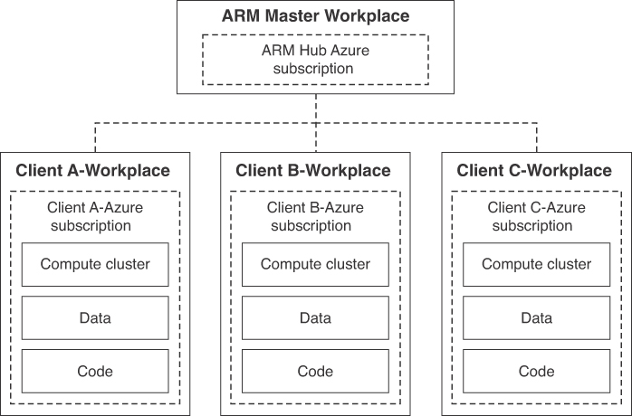
<figcaption><p><strong>Figure 13.1</strong> <em>Data-and-AI-as-a-service
approach</em>.</p></figcaption>
</figure>

When implementing this service, we needed to address the longstanding
challenges associated with data ingestion and migration crucial for
developing and deploying LLM applications. To do so, we adopted a
service-oriented approach to data pipelines when tackling the key
obstacles in data platforms and data products---specifically, data
movement from one location to another. We accommodated various service
level agreement (SLA) needs, creating solutions that ranged from batch
processing to near real-time data handling. Our pipelines supported
multiple data formats, including CSV, JSON, text, PDF, and voice and
video, all at production quality.

[]{#ch13.xhtml#page_237 .pagebreak}As suggested earlier, SMEs typically
do not have an IT team, so the Hub bridges this gap by providing ongoing
support. Recognizing that AI and ML projects often require continuous
maintenance and management by expert teams, we committed to supporting
SMEs throughout the lifespans of their AI programs and products. We
offered flexible terms without financial lock-in contracts, and SMEs
data is stored in an open-source environment, making it easy for these
enterprises to access and retrieve data whenever desired. We also
provide project management services to oversee IT teams supported by
management tools such as *ARM Hub's Guidelines to the Responsible Use of
AI*^[3](#ch13.xhtml#ch13fn3){#ch13.xhtml#ich13fn3}^ to facilitate
transparent and safe processes for establishing and governing successful
AI programs and projects.

[3](#ch13.xhtml#ich13fn3){#ch13.xhtml#ch13fn3}.
<https://armhub.com.au/latest-news/arm-hub-responsible-ai-guidelines>.

Once we had established this platform designed for SMEs, we were then
able to offer LLM-as-a-service. MLOps is an integral part of delivering
a sustainable, secure, and trustworthy LLM solution. This chapter
summarizes our lessons learned when we delivered a service-based chatbot
to meet a range of SME manufacturers' needs. Although many potential AI
applications may be relevant to manufacturers, it was critical that we
provided the []{#ch13.xhtml#page_238 .pagebreak}platform most in demand
and able to generate short-term gains for SMEs with longer-term
benefits. We will describe how MLOps ensured the success of this
project.
:::

::: section
### 13.3 LLMs in SME Manufacturing {#ch13.xhtml#ch13lev1sec03 .h3}

The Hub is witnessing the use of LLMs in the following use cases:

-   **Customer support enhancement:** This involves empowering customer
    support agents to efficiently access open or unresolved customer
    issues, complemented by AI-generated scripts to guide their
    interactions and provide better assistance.

-   **Knowledge management and dissemination:** Here, LLMs act as
    dynamic repositories for organizational knowledge. They play a key
    role in distributing this knowledge, contributing to the creation of
    a zero-waste knowledge environment where relevant information is
    readily accessible to all members of the organization.

-   **Diagnostic improvement for field service engineers:** Field
    service engineers often grapple with the daunting task of sifting
    through vast and complex documentation. LLMs can significantly
    streamline this process, enhancing the speed and accuracy of
    diagnostics, which in turn boosts both efficiency and overall
    service effectiveness.

Our case study focuses on the second item---augmenting the SME
manufacturing workforce with a knowledge base in the form of an
interactive context-aware chatbot.
:::

::: section
### 13.4 A RAG-Based Chatbot for SME Manufacturing {#ch13.xhtml#ch13lev1sec04 .h3}

Despite the progress made in regard to LLMs, these models have inherent
shortcomings, especially when it comes to handling domain-specific or
highly specialized queries. This issue arises because LLMs are designed
for a broad audience and lack user-specific awareness. A frequent
problem with LLMs is the production of incorrect information, or
"hallucinations," particularly when queries are outside the scope of the
model's training data or require current information. These limitations
highlight the risks of using LLMs as stand-alone solutions in practical
production settings without proper safeguards.

A promising solution to these challenges is the use of
retrieval-augmented generation (RAG), which was discussed in detail in
[Chapter 4](#ch04.xhtml#ch04), [Foundation Models](#ch04.xhtml#ch04).
[]{#ch13.xhtml#page_239 .pagebreak}We found RAG to be a powerful and
efficient generative AI technique that allows users to improve model
performance by leveraging their own data (e.g., documentation specific
to the SME's business), without the need to fine-tune or change the
original model, which can be very costly and therefore impractical for
SME manufacturers. [Figure 13.2](#ch13.xhtml#ch13fig02) depicts the
importance of RAG within the foundation model (FM) and generative AI
maturity curve shown in [Chapter 4](#ch04.xhtml#ch04).

<figure id="ch13fig02" class="figure">
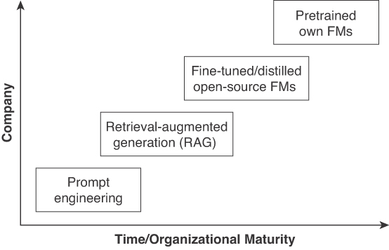
<figcaption><p><strong>Figure 13.2</strong> <em>Generative AI maturity
curve</em>.</p></figcaption>
</figure>

ARM Hub provides a RAG-based chatbot as a part of its LLM-as-a-service
offering. Developed by ARM Hub, this chatbot can be integrated into each
SME manufacturing workspace, requiring only minor customizations that
can be completed within weeks. The design of this chatbot allows for
easy integration and data ingestion in new environments. It operates
efficiently in both batch and streaming modes, and is compatible with a
variety of FMs. It is able to work with locally deployed models (e.g.,
Llama models) or interact with remote models, such as GPT models. The
next section outlines the architecture of the ARM Hub chatbot.
:::

::: section
### 13.5 Architecture of the ARM Hub Chatbot {#ch13.xhtml#ch13lev1sec05 .h3}

[Figure 13.3](#ch13.xhtml#ch13fig03) depicts the architecture for our
RAG-based chatbot service tailored for SME manufacturing in Australia.
Again, note that while we currently employ Azure-native services,
including Azure Databricks, our system's []{#ch13.xhtml#page_240
.pagebreak}architecture is adaptable to integrate with other cloud
providers such as AWS and GCP.

<figure id="ch13fig03" class="figure">
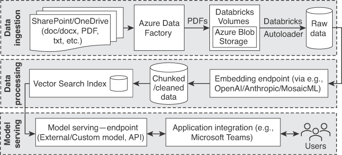
<figcaption><p><strong>Figure 13.3</strong> <em>End-to-end RAG-based
chatbot architecture</em>.</p></figcaption>
</figure>

::: section
#### *13.5.1 ETL/Document Ingestion* {#ch13.xhtml#ch13lev2sec01 .h4}

Just like any ML or AI system, our RAG-based chatbot begins with an ETL
(extract, transform, load) process. The robustness of this ETL pipeline
is crucial for the chatbot's effectiveness. Because we offer our chatbot
as a service, we have developed a highly robust ETL process that
integrates with new environments, requiring minimal adjustments. This
ETL pipeline is initiated with Azure Data Factory (ADF), which is set up
to oversee document-sharing platforms such as SharePoint and OneDrive.
Upon initial deployment, our service imports all existing documents,
converts them to PDFs, and then uploads these PDFs into volumes. A
volume is a logical unit of cloud object storage that facilitates file
access, storage, management, and organization. In our setup, the volumes
are housed within Azure Blob Storage.

Our data ingestion pipeline is designed to be capable of accommodating
newly added documents, offering both batch (scheduled) and real-time
ingestion options. With real-time document ingestion, documents are
promptly captured, converted, and loaded as they arrive in the monitored
document-sharing tools. This feature is pivotal to our service, as it
ensures that the chatbot's knowledge base remains current with the
latest data, thereby avoiding data drift.

[]{#ch13.xhtml#page_241 .pagebreak}After the documents are loaded into
volumes, we utilize Autoloader to ingest PDF documents in both batch
(scheduled) and real-time modes. Autoloader, a cloud-agnostic service,
enhances the flexibility of our architecture to function with different
cloud providers. For instance, if we opt for AWS cloud services, AWS
Glue would be our choice for ETL data ingestion, and the rest of the
services would remain the same. This approach ensures our architecture's
portability across different clouds.
:::

::: section
#### *13.5.2 Document Preparation and Embedding* {#ch13.xhtml#ch13lev2sec02 .h4}

Once PDF documents are uploaded as blob objects into a raw Delta table
in Databricks, we proceed to chunk the larger PDF documents into smaller
segments. Chunking is essential for optimizing the relevance of content
retrieved from a vector database when embedding content with an LLM.
Depending on the document type and the specific limitations of different
LLM models and versions (e.g., some models currently have context window
limits up to 32,000 tokens), various chunking methods are applied.
Typically, we use fixed-size chunking due to its simplicity and
computational efficiency, often selecting a chunk size of 300 with an
overlap of 20 to preserve semantic context without needing natural
language processing (NLP) libraries. Other strategies, such as
content-aware chunking, leverage the content's nature for more
sophisticated segmentation---for example, sentence splitting. To
identify the optimal chunking strategy and chunk size, we consider the
following issues:

-   **Data preprocessing:** We first preprocess the data to enhance its
    quality, which is useful for determining the ideal chunk size. This
    may involve removing common and repetitive sections, such as
    acknowledgments, which can introduce noise into the data.

-   **Choosing a range of chunk sizes:** We experiment with multiple
    chunk sizes by running them concurrently to ascertain the most
    effective chunking method for our needs.

Finally, an embedding model is employed to generate vector
representations for each chunk. We can use publicly available embedding
endpoints like OpenAI's API with models like text-embedding-ada-002, or
locally deployed models, to create these embeddings. Once generated,
they are stored in another Delta table.
:::

::: section
#### []{#ch13.xhtml#page_242 .pagebreak}*13.5.3 Vector Search/Vector Index* {#ch13.xhtml#ch13lev2sec03 .h4}

Our method employs Databricks Vector
Search,^[4](#ch13.xhtml#ch13fn4){#ch13.xhtml#ich13fn4}^ a serverless
similarity search engine. This service enables the storage of data in
vector form, complete with metadata, in a vector database. Vector Search
can automatically update vector search indexes from Delta tables, and it
allows for querying through a straightforward API to retrieve the most
similar vectors. Utilizing the Vector Search service enables the
integration of newly added documents continuously, avoiding the need to
rebuild the entire vector database each time new documents are
introduced. This feature complements our incremental and real-time
document ingestion pipeline, as Vector Search's auto-sync capability
allows for the incorporation of newly added documents both in real time
and on a scheduled basis.

[4](#ch13.xhtml#ich13fn4){#ch13.xhtml#ch13fn4}.
<https://learn.microsoft.com/en-us/azure/databricks/generative-ai/vector-search>

After embedding the data into the vector database, we then need to
establish a vector index, typically based on a specified column in a
Delta table containing our chunked data. See [Section
4.2](#ch04.xhtml#ch04lev1sec03), "[Transformer
Architecture](#ch04.xhtml#ch04lev1sec03)," for a discussion of vector
spaces and their use in attention and similarity definition.
:::

::: section
#### *13.5.4 Retrieval Using the RAG Chain* {#ch13.xhtml#ch13lev2sec04 .h4}

Once the index is prepared, the application's RAG chain can be activated
to answer questions. The operation of the RAG chain in response to a
query is outlined in the following steps and illustrated in [Figure
13.4](#ch13.xhtml#ch13fig04). We utilize
LangChain^[5](#ch13.xhtml#ch13fn5){#ch13.xhtml#ich13fn5}^ as our
orchestrator for the RAG chain.

[5](#ch13.xhtml#ich13fn5){#ch13.xhtml#ch13fn5}.
[www.langchain.com/](http://www.langchain.com/)

<figure id="ch13fig04" class="figure">
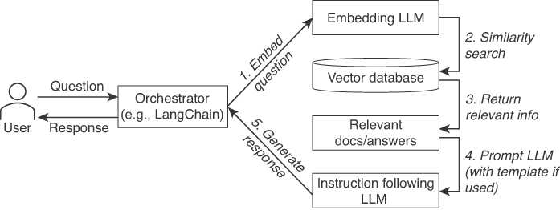
<figcaption><p><strong>Figure 13.4</strong> <em>RAG
chain</em>.</p></figcaption>
</figure>

1.  The received question is processed using the same model that
    embedded the data in our knowledge base, with Databricks Model
    Serving handling the embedding model.

2.  Vector Search uses the embedded question to find similar data chunks
    in the vector database.

3.  The most relevant data chunks identified by Vector Search, along
    with the embedded question, undergo postprocessing in a customized
    LLM before generating a response.

4.  []{#ch13.xhtml#page_243 .pagebreak}These data chunks assist the LLM
    in formulating an appropriate response, often using a predefined
    response template. The LLM is also served through Model Serving.

5.  After the response is prepared in Step 4, Step 5 takes over to
    generate and dispatch the response to the end user's prompt.
:::

::: section
#### *13.5.5 User Interface/Response Recording* {#ch13.xhtml#ch13lev2sec05 .h4}

Once the model is implemented through a Model Serving endpoint,
applications can interact with the chatbot via this endpoint. Databricks
Model Serving^[6](#ch13.xhtml#ch13fn6){#ch13.xhtml#ich13fn6}^ offers an
interface for deploying, managing, and querying AI models, making each
model accessible as a REST API for integration into web or client
applications. It supports high availability and low latency for
deploying models, scaling automatically based on demand. The next
section discusses performance and scalability in more detail.

[6](#ch13.xhtml#ich13fn6){#ch13.xhtml#ch13fn6}.
<https://learn.microsoft.com/en-us/azure/databricks/machine-learning/model-serving/>

We opted to use the client organization's existing messaging system
(e.g., Microsoft Teams) as the front end for our chatbot. This choice
eliminates the need for additional application development and
maintenance. By leveraging a familiar platform like Teams, which is
accessible from various environments and devices, we can reduce the
learning curve for staff and avoid the need for different app versions
to cater to various browsers and mobile devices.

[]{#ch13.xhtml#page_244 .pagebreak}[Figure 13.2](#ch13.xhtml#ch13fig02)
illustrates that initiating prompt engineering is a common first step in
developing a functional chatbot. However, when deploying the chatbot in
new environments with unknown user interaction patterns, we monitored
user questions and their feedback (likes or dislikes). This data
collection aids in tailoring the prompt effectively and is also valuable
for potential model fine-tuning, should the prebuilt model prove
insufficient. Additionally, tracking user impressions assists in ongoing
model evaluation. We will discuss this issue further in the next
section. It is important to inform users that their interactions and
reactions are being recorded from their first use of the chatbot.
:::
:::

::: section
### 13.6 MLOps in ARM Hub {#ch13.xhtml#ch13lev1sec06 .h3}

In [Chapter 5](#ch05.xhtml#ch05), [AI Model Life
Cycle](#ch05.xhtml#ch05) we introduced MLOps as a general process
applicable to both narrow ML models and FMs. In this section, we
describe how that process was adapted for ARM Hub. The scope of MLOps in
ML initiatives can vary greatly, ranging from comprehensive coverage
that includes data preparation to production pipelines, to more specific
tasks like model deployment. Typically, enterprises apply MLOps
principles across several key areas:

-   Exploratory data analysis (EDA)

-   Data preparation/ingestion and prompt engineering

-   Model fine-tuning

-   Model review and governance

-   Model inference and serving

-   Model evaluation

In the following sections, we describe how we implemented these
principles, while adhering to best practices to enhance the efficacy of
our LLM-based services. Adhering to these principles was intended to
ensure that our chatbot-as-a-service offering embodies the key
characteristics of a successful, production-level service. This includes
robustness, security and privacy measures, traceability, monitorability,
as well as performance and scalability. Additionally, it ensures the
service's ability to evolve over time. Note that the specific steps may
vary depending on the unique requirements of each SME manufacturing
chatbot we develop. To illustrate our learnings, we will share examples
and insights gained throughout this process.

::: section
#### []{#ch13.xhtml#page_245 .pagebreak}*13.6.1 What Are the Benefits of MLOps for ARM Hub?* {#ch13.xhtml#ch13lev2sec06 .h4}

The key advantages of MLOps, when the goal is ensuring effective
service-based LLM implementation, include the following:

-   **Efficiency:** MLOps speeds up model and pipeline development,
    improves model quality, and accelerates deployment to production.

-   **Scalability and management:** MLOps supports large-scale
    operations, allowing for the management, control, and monitoring of
    thousands of models, facilitating continuous integration, delivery,
    and deployment.

-   **Risk reduction:** MLOps enhances regulatory compliance and
    response to oversight, ensuring adherence to organizational or
    industry standards. For example, in SME manufacturing, MLOps ensures
    compliance with ARM Hub's *Guidelines for Responsible AI
    Use*^[7](#ch13.xhtml#ch13fn7){#ch13.xhtml#ich13fn7}^.

[7](#ch13.xhtml#ich13fn7){#ch13.xhtml#ch13fn7}.
<https://armhub.com.au/latest-news/arm-hub-responsible-ai-guidelines>.
:::

::: section
#### *13.6.2 Exploratory Data Analysis* {#ch13.xhtml#ch13lev2sec07 .h4}

Contrary to the perception that building a chatbot using an LLM is
straightforward---simply input documents and let the model handle the
rest---our experience underscores the importance of content awareness
for chatbot success. Exploratory data analysis (EDA) in LLM
applications, particularly chatbots, is a multifaceted process. We
always begin with a comprehensive analysis of the training data,
examining its structure, identifying patterns, pinpointing anomalies,
identifying security and privacy risks, and understanding the
interrelationships. This step is vital in chatbot development, where the
analysis should focus on the types of queries and dialogues the chatbot
will encounter. It involves discerning prevalent themes and grasping the
subtleties of language and context. EDA's role in data preparation
ensures the chatbot's capability to interpret and respond precisely to
user inputs. This process leads to a more adept and interactive chatbot.

For example, when employing the EDA approach with an SME manufacturing
client, we discovered that the firm used both text-based and image-based
PDF documents. To handle this condition, we implemented a PDF
classification system to differentiate between the two types. For
text-based PDFs, we utilized Python libraries such as pdftotext, PyPDF2,
and PyMuPDF for text extraction. For image-based PDFs, we applied
optical character recognition (OCR) tools such as pytesseract and
paddleocr. We integrated the []{#ch13.xhtml#page_246 .pagebreak}PDF
classifier into our ETL tool, specifically using Azure Data Factory
(ADF), to streamline the process.

In another application of the EDA approach for an SME, we ensured that
the documents loaded into our vector database were free from sensitive
content. To achieve this, we implemented a preprocessing stage designed
to automatically detect and either remove or mask any personally
identifiable information (PII) or payment card industry (PCI) data. This
step is vital for maintaining data privacy and security standards.
:::

::: section
#### *13.6.3 Data Preparation/Ingestion and Prompt Engineering* {#ch13.xhtml#ch13lev2sec08 .h4}

Data preparation/ingestion involves the process of collecting, analyzing
for potential biases, cleaning, and organizing the data before it is
used to train or fine-tune an LLM. The quality and structure of the data
directly impact the effectiveness and accuracy of the model's training.
Proper data preparation ensures that the data is representative, free of
unwanted biases and errors, and structured in a way that is compatible
with the model's requirements.

In our system architecture, we combined the functionalities of Azure ADF
and Autoloader. This combination allows us to handle both batch
(scheduled) and real-time data ingestion and preparation effectively. A
resilient data ingestion pipeline is essential. Without it, the solution
remains a proof of concept (PoC) and fails to address organizational
needs or achieve return on investment (ROI) goals, which is often a
significant challenge in ML applications and solutions.

Prompt engineering, which was discussed in [Chapter
4](#ch04.xhtml#ch04), is the process of designing and refining the
prompts or queries that are used to interact with the LLM. The
effectiveness of a LLM heavily depends on how the prompts are
structured, as they guide the model in generating relevant and accurate
responses. Prompt engineering requires a deep understanding of the
specific LLM's capabilities and the context in which it will be used. It
is an iterative process, often refined based on the model's performance
and feedback from its interactions.

Considering the diverse nature of our service-based offerings to various
SME manufacturers, we depend on systematically recording user
interactions and feedback to inform the design of our prompts. Prompt
engineering is important not just for the initial launch and adoption of
our products within SMEs, but also for maintaining their relevance over
time. As user queries evolve, continuously analyzing chatbot
interactions allows us to update and refine our prompt templates,
ensuring they stay pertinent to user needs. This adaptive approach
enhances the long-term adaptability of our solution.
:::

::: section
#### []{#ch13.xhtml#page_247 .pagebreak}*13.6.4 Model Fine-Tuning* {#ch13.xhtml#ch13lev2sec09 .h4}

Model fine-tuning, which was also discussed in [Chapter
4](#ch04.xhtml#ch04), in the context of chatbot and LLM applications
involves adjusting a pretrained LLM to better suit specific tasks or
datasets. This process is important for chatbots, as it tailors the
general capabilities of an LLM to understand and respond to
industry-specific language, nuances, and user queries. Fine-tuning is
achieved by training the model on a targeted dataset, which contains
examples more closely aligned with the chatbot's intended use. This
helps the model to make more accurate predictions and generate more
relevant responses, improving the overall effectiveness and user
experience of the chatbot. Fine-tuning is an iterative process, often
requiring adjustments based on performance metrics and user feedback.

In our diverse experiences with SME manufacturing scenarios, we have
found that combining prompt engineering with a RAG approach addresses
most of the relevant use cases. A robust feedback mechanism is key in
refining prompts, thereby enhancing chatbot output quality. Instead of
expecting users to formulate precise prompts, we employ our RAG chain
(using LangChain) to structure prompts as templates. This enhances user
queries with tailored prompts for improved chatbot responses.

Prompt engineering, which is often regarded as a basic approach to FM
customizing (it is sometimes called the "poor man's fine-tuning"), could
present future challenges. As the quantity of prompt templates grows,
their management may become increasingly difficult. To mitigate this
issue, we can use user feedback to create a strong training dataset for
more sophisticated fine-tuning. This strategy aims to make prompt
management more efficient and to improve the model's overall
effectiveness. Alongside prompt engineering, fine-tuning is a
supplementary factor in enhancing the adaptability of our solution. When
prompt engineering alone is insufficient to produce the quality outputs
that end users expect, fine-tuning will help meeting their evolving
needs effectively.
:::

::: section
#### *13.6.5 Model Review and Governance* {#ch13.xhtml#ch13lev2sec10 .h4}

To manage the model, pipeline lineage, and versions effectively, we use
Databricks' Managed
MLflow,^[8](#ch13.xhtml#ch13fn8){#ch13.xhtml#ich13fn8}^ which offers
support for MLOps. This includes enhanced capabilities for managing and
deploying LLMs, and for integrating []{#ch13.xhtml#page_248
.pagebreak}with standard LLM tools like Hugging Face transformers and
OpenAI functions. Key features of Managed MLflow for MLOps are
summarized here:

[8](#ch13.xhtml#ich13fn8){#ch13.xhtml#ch13fn8}.
[www.databricks.com/product/managed-mlflow](http://www.databricks.com/product/managed-mlflow)

-   **Model deployment:** Streamlines the ML life-cycle management with
    a framework for production-ready models.

-   **Experiment tracking:** Facilitates tracking of experiments across
    any ML library or framework, automatically documenting parameters,
    metrics, code, and models. This feature allows for secure sharing
    and management of experiment results and corresponding code
    versions.

-   **Model management:** Offers a centralized platform for discovering
    and sharing ML models, aiding in transitioning from experimentation
    to production. This feature integrates with governance workflows and
    CI/CD pipelines, and monitors ML deployments.

-   **Model deployment:** Quickly deploys production models for batch
    inference on Apache Spark or as REST APIs using built-in integration
    with Docker containers, Azure ML, or Amazon SageMaker.

Further details on how model management/deployment integrates with our
CI/CD pipelines are provided in the next section.
:::

::: section
#### *13.6.6 Model Inference and Serving* {#ch13.xhtml#ch13lev2sec11 .h4}

In managing model refresh frequency, inference request times, and
similar specifics for production testing and quality assurance (QA), our
MLOps practice includes aspects of model deployment cycle (CI/CD) and
cost monitoring. We heavily utilize Databricks Model Serving, which
includes the following features:

-   **Unified interface:** For deploying, governing, and querying AI
    models, with each model served as a REST API.

-   **High availability and low latency:** The service is designed for
    scalability, adjusting to demand changes to optimize costs and
    latency.

-   **Support for various models:**

    -   *Custom models:* Python models in MLflow format, including
        scikit-learn, XGBoost, PyTorch, and Hugging Face transformer
        models.

    -   *Foundation models:* Models like Llama-2-70B-chat, BGE-Large,
        and Mistral-7B, available with pay-per-token pricing.

    -   *External models:* Models such as OpenAI's GPT-4, with central
        governance and established rate limits and access control.

[]{#ch13.xhtml#page_249 .pagebreak}[Figure 13.5](#ch13.xhtml#ch13fig05)
illustrates our CI/CD workflow for the RAG-based chatbot model. The
process begins with developers cloning the chatbot code from GitHub into
a notebook for development. Post development and unit testing, the code
is committed back to GitHub. Then, using Git actions, our build agent
runs the code, leading to the construction of a model that is registered
in the MLflow Model Registry. Access control for the model is managed by
Unity Catalog,^[9](#ch13.xhtml#ch13fn9){#ch13.xhtml#ich13fn9}^ thereby
ensuring role-based access control (RBAC). The model is then deployed to
Model Serving, creating distinct endpoints for each environment (Dev,
Staging, and Prod). Applications such as MS Teams interact with the
model via a RESTful API. The first deployment in each environment is
Version 1, and subsequent blue/green updates increase the version number
while maintaining the same endpoint. This decoupled design allows the
chatbot application to remain operational even during new model
deployments. In our service-based approach for delivering chatbots, each
SME manufacturer is equipped with its own set of workspaces,
encompassing Dev, Staging, and Prod environments. This ensures a
tailored and efficient workflow that addresses each SME's specific
needs.

[9](#ch13.xhtml#ich13fn9){#ch13.xhtml#ch13fn9}.
<https://learn.microsoft.com/en-us/azure/databricks/data-governance/unity-catalog/>

<figure id="ch13fig05" class="figure">
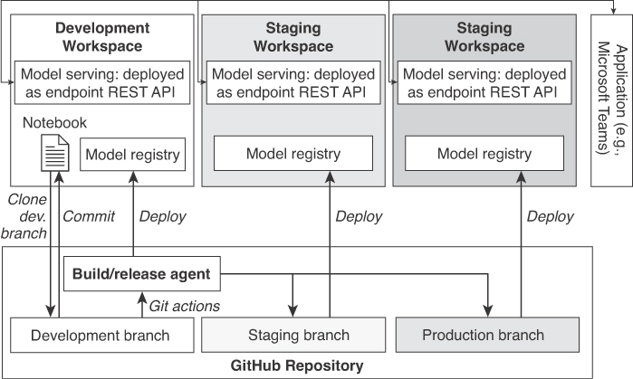
<figcaption><p><strong>Figure 13.5</strong> <em>RAG-based chatbot CI/CD
workflow</em>.</p></figcaption>
</figure>

[]{#ch13.xhtml#page_250 .pagebreak}Cost transparency is necessary for
successful chatbot implementation in SME manufacturing, particularly in
a service model. A clear and straightforward billing method based on SME
usage is essential. Model Serving supports this requirement with a
tagging mechanism, where each model endpoint is tagged, and these tags
are then reflected in cloud provider billing. This ensures clarity and
accountability in costs. Moreover, proper cost monitoring and alerts
enable SMEs to understand daily chatbot expenses, preventing cost
overruns that could undermine the solution's value.

A functional CI/CD pipeline from code development to deployment also
ensures adherence to best practices for the software development and ML
life cycles. This includes review and approval gates in the pipeline,
safeguarding against security and compliance issues, such as hard-coded
API keys.
:::

::: section
#### *13.6.7 Model Evaluation* {#ch13.xhtml#ch13lev2sec12 .h4}

In the dynamic world of LLMs, where new models and methodologies are
constantly introduced, selecting the most effective models for
deployment is vital. For the Hub, as an LLM service provider catering to
a wide array of SMEs in manufacturing with varying data types, security
and compliance requirements, and budget constraints, this is an
important consideration. An efficient MLOps platform becomes
indispensable, offering comprehensive performance reports for each
model, identifying potential weaknesses and vulnerabilities before
deployment, and aiding in the comparison of different models.

To address these requirements, we utilize MLflow 2.4's latest features,
which include a comprehensive suite of MLOps tools for model
evaluation.^[10](#ch13.xhtml#ch13fn10){#ch13.xhtml#ich13fn10}^ This
version introduces new integrations for language tasks, an improved
Artifact View UI for comparing text outputs from various model versions,
and enhanced dataset tracking capabilities. MLflow 2.4 aids in feeding
diverse input datasets to the model as inputs, recording outputs, and
calculating domain-specific metrics. We can monitor predictions and
performance metrics across a range of tasks with LLMs, such as text
summarization, classification, question-answering, and generation, all
within MLflow Tracking. This allows us to thoroughly inspect and compare
performance evaluations of multiple models, enabling us to choose the
most suitable ones for production.

[10](#ch13.xhtml#ich13fn10){#ch13.xhtml#ch13fn10}.
<https://mlflow.org/docs/latest/python_api/mlflow.html#mlflow.evaluate>
:::
:::

::: section
### []{#ch13.xhtml#page_251 .pagebreak}13.7 Ongoing Work {#ch13.xhtml#ch13lev1sec07 .h3}

In response to evolving LLM products and increasing client demand, we
are expanding our capabilities. Some key developments are highlighted
here:

-   Addressing clients' growing need to integrate structured and
    operational data (e.g., machinery data) with unstructured data for
    chatbot awareness. Our unique position with Databricks allows us to
    use that company's latest offerings to combine structured data for
    input into Vector Search, which our RAG-based chatbots can use. This
    is a pivotal step toward data democratization, allowing
    manufacturers to query data in English. Similar trends are emerging
    with other platforms, such as LangChain
    SQL^[11](#ch13.xhtml#ch13fn11){#ch13.xhtml#ich13fn11}^ and Spark
    English SDK^[12](#ch13.xhtml#ch13fn12){#ch13.xhtml#ich13fn12}^
    (which also offers basic plotting features), that offer natural
    language interfaces for structured data queries.

    [11](#ch13.xhtml#ich13fn11){#ch13.xhtml#ch13fn11}.
    <https://python.langchain.com/v0.1/docs/use_cases/sql/>

    [12](#ch13.xhtml#ich13fn12){#ch13.xhtml#ch13fn12}.
    <https://learn.microsoft.com/en-us/azure/databricks/dev-tools/sdk-english>

-   Evaluating the quality of LLM outputs and selecting the right
    metrics has always been challenging for LLM solutions. We are
    currently exploring the "LLM-as-a-judge" approach to assess the
    quality of responses from our chatbot. This method is expected to
    provide a more nuanced evaluation of the chatbot's performance in
    generating relevant and accurate responses.

-   As an LLM service provider, we are actively monitoring end-to-end
    MLOps offerings from other platforms. Our current focus is on
    evaluating AWS
    Bedrock,^[13](#ch13.xhtml#ch13fn13){#ch13.xhtml#ich13fn13}^
    particularly its model offerings and associated costs, to understand
    how it aligns with our service requirements and value proposition.

    [13](#ch13.xhtml#ich13fn13){#ch13.xhtml#ch13fn13}.
    <https://aws.amazon.com/bedrock/>

-   We are enhancing our chatbot's capabilities to better recognize user
    intentions and take appropriate actions. For example, when the
    chatbot is used within a customer support system, if a customer
    reports an issue with a product, the agent on the phone can
    understand the problem more clearly by integrating the chatbot
    (e.g., to obtain more details about the error code). These insights
    can then be relayed (e.g., emailed to) to the engineering team for
    in-depth analysis, leading to []{#ch13.xhtml#page_252 .pagebreak}the
    scheduling of an appointment or the creation of a support ticket for
    the support team to perform an on-site repair. This effort
    represents a move toward realizing actionable AI, where the chatbot
    actively supports tasks based on user interactions.
:::

::: section
### 13.8 Summary {#ch13.xhtml#ch13lev1sec08 .h3}

This chapter provides a detailed case study of the Advanced Robotics for
Manufacturing (ARM) Hub, an Australian not-for-profit organization
dedicated to supporting SME manufacturers in adopting technology.
Highlighting the obstacles SMEs encounter in integrating AI and data
systems, ARM Hub offers a novel solution: data-and-AI-as-a-service. This
service features a scalable, cloud-based data and AI lakehouse
infrastructure, utilizing lakehouse architecture, and provides SMEs with
access to a diverse range of data and AI expertise.

A key element of ARM Hub's offerings is the incorporation of LLMs into
SME manufacturing processes. These models are strategically used to
tackle productivity issues and enhance business models. The standout
application here is a chatbot based on retrieval-augmented generation
(RAG), specifically designed for SME manufacturing. This chatbot
successfully addresses the limitations commonly associated with LLMs in
processing specialized queries by integrating domain-specific data,
thereby boosting both accuracy and relevance.

The chapter highlights several key contributions made by the Hub's
solution:

-   **Innovative architecture:** Utilizing lakehouse architecture, this
    architecture supports a service-based approach, enabling SME
    manufacturers to quickly deploy the chatbot service with minimal
    total cost of ownership.

-   **Diverse LLM model integration:** The architecture accommodates a
    broad range of data types, budget constraints, and compliance
    requirements, managing both third-party and locally deployed LLM
    models.

-   **Use of organizational messaging systems:** By leveraging platforms
    such as MS Teams, the solution promotes quick adoption, minimizes
    the learning curve, and offers accessibility, including on mobile
    devices.

-   **Robust technical framework:** The chatbot's backbone includes a
    comprehensive ETL process, document preparation, embedding, and
    []{#ch13.xhtml#page_253 .pagebreak}a vector search/index setup
    supporting incremental, real-time data ingestion.

-   **Implementation of MLOps:** Extending traditional MLOps to LLM
    operations, this approach ensures efficient management of LLMs in
    production, moving beyond PoC to full operational readiness.

-   **Comprehensive MLOps approach:** Featuring a robust CI/CD pipeline
    and a suite of services, the Hub's solution provides qualities like
    robustness, resilience, security, privacy, cost transparency,
    monitorability, traceability, and scalable performance.

This initiative by ARM Hub marks a significant advancement in making AI
and data technologies accessible for SMEs. It eliminates the need for
extensive in-house expertise, underscoring the vital role of bespoke AI
solutions and ongoing support in the sustainable and successful
integration of AI in the manufacturing sector.
:::

::: section
### 13.9 Takeaways {#ch13.xhtml#ch13lev1sec09 .h3}

This case study is about a consulting firm that specializes in
supporting SMEs. The assumption that the SME does not have in-depth
technical expertise requires ARM Hub to provide multiple different
services and to be flexible in its interactions with its clients.

Choosing cloud provider--agnostic tools gives the clients flexibility in
their choice of cloud providers. The tool suite used to manage the
models should also be provider-agnostic.

Data ingestion is a major problem. ARM Hub's approach to data ingestion
involves the following elements:

-   A tool suite (Databricks lakehouse) minimizes the necessity of
    moving data from one location to another.

-   Organizing the data into chunks simplifies the ingestion process at
    the cost of more extensive downstream processing.

-   Accepting multiple formats supports ingesting a variety of document
    types.

Using a disciplined process for processing the data both increases the
productivity of the consulting company and makes it easier to explain to
the client.
:::

::: section
### []{#ch13.xhtml#page_254 .pagebreak}13.10 Discussion Questions {#ch13.xhtml#ch13lev1sec10 .h3}

1.  What is involved in moving to AWS from the current Azure
    implementation? What is involved in moving from Databricks to
    Snowflake?

2.  How does the current structure support "the right to be forgotten"?

3.  Above, we wrote that MLOps ensures compliance with ARM Hub's
    *Guidelines for Responsible AI Use*." How does it do this?
:::

::: section
### 13.11 For Further Reading {#ch13.xhtml#ch13lev1sec11 .h3}

For a deeper understanding of the importance of SME manufacturing in
Australia and its role in the global supply chain, refer to *Barriers to
Collaboration and Commercialisation* by Industry Innovation Science
Australia \[[IISA 2023](#ref.xhtml#ref23)\]. This report highlights how
countries with strong medium-size manufacturing sectors have
successfully commercialized innovations, whereas countries such as
Australia have faced challenges in retaining R&D investments and talent.

To explore RAG techniques for knowledge-intensive NLP tasks, consult the
work by Lewis et al. \[[Lewis 20](#ref.xhtml#ref29)\], which offers
insights into advances in neural information processing systems.

For an evaluation of LLMs in a legal decision-making context, see
*Judging LLM-as-a-Judge with MT-Bench and Chatbot Arena* \[[Zheng
24](#ref.xhtml#ref61)\].
:::
:::
:::

[]{#ch14.xhtml}

::: {#ch14.xhtml#book-content}
::: {#ch14.xhtml#sbo-rt-content}
## []{#ch14.xhtml#page_255 .pagebreak}*14* {#ch14.xhtml#ch14 .h2}

## *The Banking Case Study: Predicting Customer Churn in Banks* {.chap_ttl}

with MingJian Tang and Yuxiu Luo

C[USTOMER CHURN IN]{.smallcaps} banking is defined as the phenomenon in
which a customer terminates their relationship with a bank, opting to
obtain services from another institution. Throughout the customer life
cycle, customers contribute to the bank's revenue through various
channels such as transaction fees, banking charges, credit cards, home
loans, and personal loans. The adverse impacts of churn are twofold: the
direct loss of revenue and the higher costs associated with acquiring
new customers compared to retaining existing ones.

By analyzing transaction history, customer interactions, and behavioral
patterns, ML algorithms can identify signals of potential churn. This
allows the bank to proactively address customer concerns, tailor
personalized interactions or offerings, and adjust customer retention
strategies. The ability to anticipate and prevent customer churn not
only aids in sustaining a loyal customer base, but also contributes to
the bank's long-term profitability.

To efficiently tackle the customer churn problem, automation is critical
in managing the entire ML life cycle. From data sourcing to model
development, deployment, and monitoring, automating the ML pipeline
ensures rapid iteration and deployment as data and business needs
evolve. This enables the bank to keep models up-to-date and responsive,
maximizing the impact of ML on customer retention efforts.

::: section
### []{#ch14.xhtml#page_256 .pagebreak}14.1 Customer Churn Prediction {#ch14.xhtml#ch14lev1sec01 .h3}

Traditional churn analysis in banking, which was hitherto reliant on
rule-based systems, often lacks flexibility and precision. It not only
misses actual instances of customer churn but also leads to false
positives---misidentifying low-risk customers as potential churners.
This misidentification results in unnecessary and costly incentives
being offered to customers who are unlikely to churn. In the worst-case
scenario, such below-the-line (BTL) offers can inadvertently contribute
to customer churn by provoking a strong negative reaction from those who
typically respond adversely to marketing communications, known
colloquially as "sleeping dogs."

Predicting customer churn takes the form of a binary classification
problem. The target variable, *y*, assumes binary values: *y* = 1
indicates the customer is likely to churn (positive class), and *y* = 0
suggests otherwise (negative class). To construct a preemptive churn
label that is practically useful, a sufficient lead time---typically 30
days or one month---is incorporated into the measure. This approach
allows enough time to prepare and dispatch targeted campaigns to those
customers identified as high risk. The input features, denoted as *x* =
{*x*1, *x*2, *x*3, ..., *x*n}, encompass a range of factors pertinent to
predicting churn, such as customer demographics, transaction history
(including recency, frequency, and monetary \[RFM\] values), banking
product usage (number of credit cards, mortgages, and so on), and
customer service interactions. Within a defined time frame, measured in
days or weeks, it is possible to derive additional customer behavioral
features. These could include metrics such as the 7-day rolling window
average, minimum, maximum, and standard deviation for mobile banking
logins and credit card usage. These metrics help gauge a customer's
engagement level, which can be useful for triggering event-driven
marketing campaigns or enhancing the accuracy of churn prediction
models.

With the advent of pretrained foundation models (FMs), vector
representations of spending or payment descriptions can be developed to
gain deeper insights into the context of spending behaviors. [Table
14.1](#ch14.xhtml#ch14tab01) gives examples of mock-up feature data for
churn propensity modeling to illustrate how these features are
ultimately utilized for predicting customer churn.

<figure id="ch14tab01" class="table">
<table class="all">
<thead>
<tr class="header">
<th class="border"><p>CUSTOMER ID</p></th>
<th class="border"><p>TENURE</p></th>
<th class="border"><p>STATE</p></th>
<th class="border"><p>AGE</p></th>
<th class="border"><p>CREDIT SCORE</p></th>
<th class="border"><p>BALANCE</p></th>
<th class="border"><p>…</p></th>
<th class="border"><p>CHURNED</p></th>
<th class="border"><p>LAST REFRESH DATE</p></th>
</tr>
</thead>
<tbody>
<tr class="odd">
<td class="border"><p>15xxx1</p></td>
<td class="border"><p>5</p></td>
<td class="border"><p>NSW</p></td>
<td class="border"><p>34</p></td>
<td class="border"><p>619</p></td>
<td class="border"><p>0.00</p></td>
<td class="border"><p>….</p></td>
<td class="border"><p>1</p></td>
<td class="border"><p>2024-02</p></td>
</tr>
<tr class="even">
<td class="border"><p>15xxx2</p></td>
<td class="border"><p>9</p></td>
<td class="border"><p>VIC</p></td>
<td class="border"><p>26</p></td>
<td class="border"><p>850</p></td>
<td class="border"><p>2380.00</p></td>
<td class="border"><p>….</p></td>
<td class="border"><p>0</p></td>
<td class="border"><p>2024-02</p></td>
</tr>
<tr class="odd">
<td class="border"><p>15xxx3</p></td>
<td class="border"><p>10</p></td>
<td class="border"><p>ACT</p></td>
<td class="border"><p>55</p></td>
<td class="border"><p>900</p></td>
<td class="border"><p>15966.00</p></td>
<td class="border"><p>….</p></td>
<td class="border"><p>0</p></td>
<td class="border"><p>2024-02</p></td>
</tr>
<tr class="even">
<td class="border"><p>…</p></td>
<td class="border"><p>…</p></td>
<td class="border"><p>…</p></td>
<td class="border"><p>…</p></td>
<td class="border"><p>…</p></td>
<td class="border"><p>…</p></td>
<td class="border"><p>….</p></td>
<td class="border"><p>…</p></td>
<td class="border"><p>…</p></td>
</tr>
<tr class="odd">
<td class="border"><p>16xxx9</p></td>
<td class="border"><p>3</p></td>
<td class="border"><p>NSW</p></td>
<td class="border"><p>23</p></td>
<td class="border"><p>150</p></td>
<td class="border"><p>00.00</p></td>
<td class="border"><p>….</p></td>
<td class="border"><p>1</p></td>
<td class="border"><p>2023–01</p></td>
</tr>
</tbody>
</table>
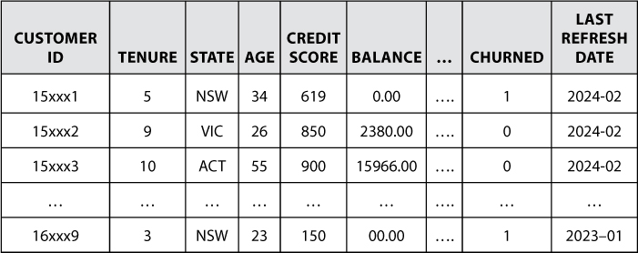
<figcaption><p><strong>Table 14.1</strong> <em>Example feature table for
training and validation of a banking customer churn model, updated
monthly with last refresh date</em></p></figcaption>
</figure>

The objective of the customer churn prediction, *f*(*x*, *θ*), is to map
these input features *x* to the target variable, *y*, by estimating the
probability that each customer belongs to the positive class or the
negative class. This approach enables the model to provide not just
classifications, but also the confidence level for predictions,
facilitating more flexible decision making based on the
[]{#ch14.xhtml#page_257 .pagebreak}estimated likelihood of different
outcomes. Additionally, applying percentile-based scores to rank the
entire customer base allows for the creation of intuitive and actionable
thresholds, which can then be integrated into downstream marketing
campaigns. Although tree-based classifiers such as XGBoost or LightGBM
can generate probability-like scores alongside class predictions, these
scores may sometimes be overly optimistic, exaggerating the true
likelihood of churn. This overconfidence could lead to excessive and
unnecessary targeting, potentially hindering other campaigns.

In contexts where model output represents probabilities, calibration of
these outputs becomes crucial. Well-calibrated probabilities are not
only more reliable and trustworthy for bank employees who are making
decisions based on probabilistic interpretations, but they also
contribute to fairness in predictive models. By ensuring that predicted
probabilities align with actual outcomes across all customer groups,
calibration aids in mitigating biases within model predictions. Commonly
used calibration techniques such as Platt scaling and isotonic
regression, which involve fitting a logistic or isotonic regression
model to the original model's predictions, can be employed based on the
model's characteristics and observed calibration errors. Calibration,
especially for models predicting probabilities, is an important step in
creating robust, reliable, fair, and trustworthy systems for predicting
customer churn in banking.

Predictions of customer churn in banks are usually precomputed in
batches and stored for later use. These predictions are generated at
regular intervals, such as fortnightly or monthly, to maintain a current
understanding []{#ch14.xhtml#page_258 .pagebreak}of customer churn
risks. The batch predictions are subsequently consumed and utilized by
the downstream campaign engine, which orchestrates and disseminates
personalized offers via different inbound or outbound channels (SMS,
email, or mobile banking app). This process is guided by the customers'
behaviors and specific targeting rules set up by marketing managers. Key
considerations for these rules include communication frequency, campaign
tactics, types of incentives, and offer priority. This strategic
approach enables the efficient and effective allocation of marketing
resources, ensuring that personalized engagement with customers is both
relevant and timely.

To build and productize an end-to-end batch customer churn prediction
system, several ML workflow activities need to be orchestrated.

::: section
#### *14.1.1 Model Data Sourcing and Validation* {#ch14.xhtml#ch14lev2sec01 .h4}

The foundational step in developing a robust customer churn prediction
ML system is to identify accurate and reliable data sources. Banks
benefit from a rich and extensive digital ecosystem, generating a
diverse array of data at various frequencies from essential systems such
as core banking systems, customer relationship management (CRM),
internet and mobile banking applications, and payment processing
systems. Typically, banks employ specialized teams who are responsible
for managing the raw data through ingestion, extraction, loading, and
transformation processes, utilizing centralized enterprise data
warehouses (EDW) like Teradata or Oracle, or cloud-based object storage
solutions like AWS S3 for Data Lakes.

Over the years, banks accumulate an extensive array of tables and views.
This data, while extensive, may carry outdated business logic,
introducing potential biases and inaccuracies in the data. In the
ever-evolving banking sector, as source systems frequently change (e.g.,
legacy systems get decommissioned), these biases and inaccuracies
cascade to downstream systems including EDWs and feature stores.
Compounding the issue, EDW teams often have limited visibility into the
full range of downstream users, leaving them less aware of the potential
impacts that changes to EDW tables or views might have.

[Figure 14.1](#ch14.xhtml#ch14fig01) illustrates a hypothetical banking
warehouse consisting of three tables---customers, accounts, and
transactions---along with their entity-relationship diagram. It also
highlights how model feature stores can be affected by upstream changes
due to ripple effects. Given this possibility, it is essential to verify
the integrity of the incoming modeling data before landing it in feature
stores, by assessing aspects such as the data's uniqueness,
completeness, acceptance, referential integrity, and freshness. For
instance, []{#ch14.xhtml#page_259 .pagebreak}validation tests are
crafted to ensure the uniqueness of primary and surrogate keys. Notably,
within the EDW, data assets, views, and tables evolve over time,
creating intricate dependencies and necessitating adept data
stewardship. This complexity can occasionally hinder the freshness and
integrity of downstream modeling data, leading to the accumulation of
stale and incorrect information.

<figure id="ch14fig01" class="figure">
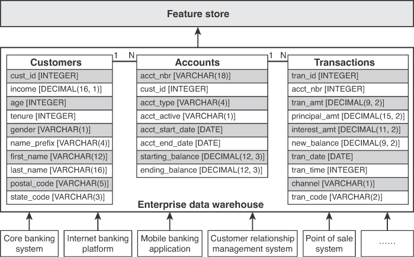
<figcaption><p><strong>Figure 14.1</strong> <em>A sample banking data
warehouse and feature store</em>.</p></figcaption>
</figure>

The consolidated tables and views stored in the EDW are one of the major
upstream data sources for customer churn model features. Before storing
model features into a feature store, it is critical to automate the
assessment of various aspects of upstream data quality. This enables
scaling MLOps, which in turn facilitates streamlined operations and
supports reliability.
:::

::: section
#### *14.1.2 Model Feature Engineering and Selection* {#ch14.xhtml#ch14lev2sec02 .h4}

Feature engineering and selection are important for deploying robust ML
models at scale. In practice, this process requires striking a balance
between model performance, operational costs, explainability, and
fairness.

The feature engineering workflow starts with feature discovery, which is
commonly conducted by data scientists in the bank. The process is highly
iterative and driven by hypothesis testing and workshops with domain
[]{#ch14.xhtml#page_260 .pagebreak}experts and various data custodians.
In addition to the technical factors, other factors will be considered,
such as operational costs and explainability, to determine whether a new
feature should be included in the pipeline. As described in [Chapter
5](#ch05.xhtml#ch05), [AI Model Life Cycle](#ch05.xhtml#ch05), feature
engineering best practices should be adopted to facilitate consistency
and reproducibility across different ML use cases in the bank and to
alleviate operational burdens resulting from operationalizing customized
feature engineering pipelines. Feature stores facilitate cross-team
collaboration by promoting reuse of common feature entities, such as
banking customer profiles, product data, and labels (e.g., churns,
cross-sell, upsell, campaign reach).

Feature discovery begins with validation and transformation of the data.
Then, features are selected as the most relevant and influential
variables from the churn datasets. This ensures that only significant
features are utilized for churn prediction, thereby sharpening the
model's focus and accuracy.

Next comes feature cleaning, which entails refining the data to ensure
its quality and integrity. Instance selection and partitioning are then
carried out, with appropriate data points from the dataset being
selected to create balanced training, evaluation, and test sets.
Techniques such as repeatable random sampling, oversampling of minority
classes, and stratified partitioning are used to ensure the model is
trained on a diverse and representative sample of customer profiles,
spanning various account types and transaction volumes.

Feature tuning, the next step, focuses on improving the quality of
features for ML. This includes scaling and normalizing numeric values,
imputing missing values, and rectifying skewed distributions. For
instance, normalizing transaction amounts and account balances and
imputing missing values in customer demographic data are common
practices in this phase.

Tuning is followed by feature transformation, which involves converting
data into more suitable formats for ML models. Numerical features are
bucketized, and categorical features transformed into numerical formats
using techniques such as one-hot encoding and sparse feature embeddings.
This is especially important for banking data, which often includes a
mix of numerical and categorical information. Feature extraction and
construction are also integral to this phase. Techniques such as
principal component analysis (PCA) are used to simplify complex data,
such as transaction histories. Moreover, new features are created using
methods such as polynomial expansion or feature crossing, often
integrating banking-specific business logic as well. These features
(e.g., average monthly balance and frequency of overdrafts) provide
deeper insights into customer behavior patterns indicative of churn.
[]{#ch14.xhtml#page_261 .pagebreak}In the ML workflow for churn
prediction, feature engineering stands out as the most creative part for
data scientists. It involves employing experience, business context, and
creativity to tailor the model to capture why churn happens in a
specific business context.

Features for modeling customer churn include the following:

-   **Customer characteristics:** These might include demographics for
    retail banking, such as gender, age, income, marital status, and
    more. Understanding customer profiles helps in predicting churn.

-   **Product characteristics:** Features defining the product type and
    characteristics such as delivery method, price, and size help bank
    employees understand how different product aspects contribute to
    churn.

-   **Transaction history:** Using an RFM strategy, data scientists can
    gauge customer value and predict churn likelihood.

-   **Customer engagement:** Engagement metrics, such as website logins,
    session durations, and email unsubscriptions, offer insights into a
    customer's intention to continue using a service.

-   **User experience:** Customer satisfaction and user experience
    metrics, though hard to capture, are reliable indicators of churn.
    They can be proxied through product ratings and customer support
    interactions.

-   **External factors:** Sometimes churn is influenced by external
    factors beyond the control of the business, such as economic
    indicators or technological infrastructure.

MLOps practices such as automation with tools like Apache
Airflow,^[1](#ch14.xhtml#ch14fn1){#ch14.xhtml#ich14fn1}^ thorough
monitoring and logging, continuous evaluation and testing, and detailed
documentation and version control are applied throughout these
preprocessing steps. These practices ensure that the data pipeline is
not only efficient and robust, but also compliant with the stringent
regulatory standards in the banking sector.

[1](#ch14.xhtml#ich14fn1){#ch14.xhtml#ch14fn1}.
<https://airflow.apache.org/docs/apache-airflow/stable/index.html>
:::

::: section
#### *14.1.3 Model Training and Performance Evaluation* {#ch14.xhtml#ch14lev2sec03 .h4}

Model development codes, including all scripts and configurations used
for training and evaluating models, should be centralized and version
controlled to ensure traceability and allow for continuous integration
and []{#ch14.xhtml#page_262 .pagebreak}testing. Distributed software
configuration management tools, e.g. based on Git, can be leveraged to
facilitate collaboration on experiments conducted by data scientists
while keeping track of changes and improvements over time. During
algorithm selection, frameworks like MLflow or Kubeflow can be
integrated with the modeling codes to enable systematic logging and
testing of key training metrics from different ML algorithms, such as
logistic regression, support vector machines, random forest, and
gradient boosting trees (XGBoost or LightGBM).

Capturing stable and intrinsic customer churn patterns in the banking
sector requires training data to span across multiple months and
sometimes even years. When multiplied by a huge vector of customer
features (thousands), the training data could become so large that it no
longer fits into the memory of a single machine. In such a case,
adopting model and data parallelism techniques for distributed training
becomes essential. PySpark and Tensorflow are two frameworks that are
often used for effectively distributing training data and workflow
across Kubernetes clusters or private enterprise data centers; this
practice can drastically shorten overall model training times and boost
innovation via iteration.

To build production-grade models, a given model's parameters should be
selected to create the best inference set possible. However, the sheer
number of combinations and their resultant metrics can become
overwhelming to track manually. The combination of Optuna with MLflow
can help mitigate this challenge, as it provides an efficient approach
to searching over parameters with every experimental trail being
automatically recorded. When performing hyperparameter tuning, each
iteration in Optuna can be considered as a "child run." Developers can
then group all the runs under the primary "parent run," ensuring that
the MLflow UI remains organized and interpretable. Each child run will
track the specific hyperparameters used and the resulting metrics (e.g.,
AUC-PR, F1 score, log loss), providing a consolidated view of the entire
optimization process.
:::

::: section
#### *14.1.4 Model Packaging, Deployment, and Inference* {#ch14.xhtml#ch14lev2sec04 .h4}

After training the churn prediction model and ensuring it has an
adequate level of performance, the next step is deploying the model to a
production environment. In banking, this deployment is not just a
technical task. It directly impacts customer retention strategies and
revenue streams. Open-source tools like MLflow can significantly
simplify the process; they offer a robust toolset for deploying the
trained ML model to various targets, including local hosts, cloud
services, and Kubernetes clusters, which are []{#ch14.xhtml#page_263
.pagebreak}commonplace in the banking IT infrastructure. For example, a
bank might deploy the churn model in a Kubernetes cluster to leverage
its scalability and orchestration features, thereby ensuring the model
can handle the high-volume, real-time banking operation data.

Also, the trained model can be published and registered in model
registry---an important step in highly regulated industries like
banking. The model registry serves as a centralized, secure model store
that provides a set of APIs and a UI for managing the entire model life
cycle collaboratively. It also provides model lineage information,
including model versioning, model aliasing, tagging, annotations, and,
most importantly, which experiment and iteration run produced the model
along with the metadata of the training data. Such information is
important for maintaining compliance with financial regulations.

Behind the scenes, the trained model is packaged with its metadata, such
as its dependencies, inference schema, and model signature. The packaged
model is then containerized using Docker, which standardizes the model
deployment process and enables deployments to various operating
environments. [Figure 14.2](#ch14.xhtml#ch14fig02) depicts a schematic
flow of model packaging and deployment using MLflow.

<figure id="ch14fig02" class="figure">
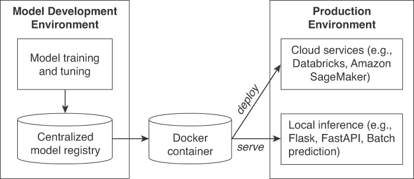
<figcaption><p><strong>Figure 14.2</strong> <em>Overview of model
training, parameter tuning, and evaluation tracking with MLflow and
Optuna</em>.</p></figcaption>
</figure>
:::

::: section
#### *14.1.5 Model Performance Monitoring* {#ch14.xhtml#ch14lev2sec05 .h4}

Once a model is deployed, it may encounter several challenges, such as
shifts in data distribution (e.g., an increase in online and mobile
banking transactions and gradual phase-out of most transactions
conducted over the []{#ch14.xhtml#page_264 .pagebreak}counter),
training-serving skew (e.g., features like branch location become
irrelevant as transactions shift online; this occurs when the data used
during training differs from the data seen during deployment), concept
drift, pipeline health issues, system underperformance (e.g., high
serving latency), anomalies due to outliers, and data quality issues
introduced by upstream data sources. The objective of post-deployment
monitoring is multifaceted: It aims to detect issues early, before they
significantly impact downstream consumers; it enables prompt action for
triaging and troubleshooting models in production; it ensures
transparency and explainability in the prediction process; and it
provides avenues for maintaining and improving the model while it
remains in production.

MLOps tools like MLflow, which offer a comprehensive suite of tools and
features, play a pivotal role in facilitating efficient model
monitoring. As previously noted, custom metrics, including both model
metrics and business-specific key performance indicators (KPIs), can be
logged to continually assess model performance; they are necessary for
understanding the model's impact on real-world business outcomes. To
detect detrimental data or concept drifts, the logged input data samples
and corresponding predictions can be utilized to construct statistical
baselines. To better measure and quantify data drift, statistical
techniques can be applied, such as the Stability Index,
Kullback--Leibler (KL) divergence, and Jensen--Shannon (JS) divergence.

A dedicated monitoring system can be set up to collect error logs,
trigger alerts, and disseminate alerts to subscribers via emails or
instant messages. Alerts can be integrated with the monitoring system
for promptly notifying stakeholders when issues arise. [Figure
14.3](#ch14.xhtml#ch14fig03) depicts the architecture of a model
monitoring system.

<figure id="ch14fig03" class="figure">
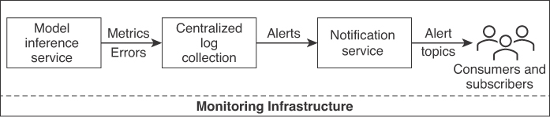
<figcaption><p><strong>Figure 14.3</strong> <em>Architecture of a model
monitoring system</em>.</p></figcaption>
</figure>

With model versioning in place, operational teams can track different
model versions throughout the entire life cycle from dev to staging to
production. This also allows for easy rollback to previous versions if
updates of the model or other parts of the system lead to unforeseen
issues.
:::
:::

::: section
### []{#ch14.xhtml#page_265 .pagebreak}14.2 Key Challenges in the Banking Sector {#ch14.xhtml#ch14lev1sec02 .h3}

::: section
#### *14.2.1 Data Privacy and Security* {#ch14.xhtml#ch14lev2sec06 .h4}

The banking industry faces significant challenges in managing and
protecting sensitive data while utilizing AI and ML technologies. The
usage of synthetic data, anonymization, tokenization, and federated
learning are helpful but still require complex organizational strategies
to better govern and ensure data privacy and security. Adherence to
regulatory standards like the General Data Protection Regulation (GDPR)
and the Payment Card Industry Data Security Standard (PCI DSS) is
required, especially when the system handles personally identifiable
information (PII).
:::

::: section
#### *14.2.2 Traceability and Transparency of AI Decisions* {#ch14.xhtml#ch14lev2sec07 .h4}

As AI and ML become integral in banking, ensuring the traceability and
transparency of decisions made by AI models and ML systems poses a major
challenge. Financial institutions must maintain a thorough, detailed
record of model development, training, and validation. Tools such as
Jupyter Notebooks archives, dataset archives, and model documentation
catalogs are essential for capturing this information, but integrating
them effectively can be complex. One common approach to manage these
challenges is to use more interpretable models when possible. In cases
where complex models are necessary, feature-level explanations, such as
SHAP or LIME, are often employed to provide insights into model
decisions.
:::
:::

::: section
### 14.3 Summary {#ch14.xhtml#ch14lev1sec03 .h3}

In this chapter, we use customer churn as a use case to explain the
benefits brought by MLOps:

-   **Enhance model accuracy and timeliness:** In customer churn
    prediction and fraud detection, the accuracy of ML models directly
    impacts their effectiveness. MLOps helps ensure models are
    consistently updated with the latest data, thereby maintaining their
    relevance and accuracy.

-   **Gain operational efficiency:** With MLOps, banks can automate the
    life cycle of ML systems, from development to deployment. This
    automation reduces the manual effort required to manage these
    systems, allowing teams to focus on more strategic tasks and
    initiatives.

-   []{#ch14.xhtml#page_266 .pagebreak}**Scale and adapt:** MLOps
    enables banks to scale their ML operations efficiently via automated
    pipelines and reusable workflow patterns that orchestrate complex
    modeling activities. As customer banking behaviors evolve and new
    types of financial fraud emerge, banks can rapidly adapt their
    models to these changes, ensuring ongoing protection and customer
    satisfaction.
:::

::: section
### 14.4 Takeaways {#ch14.xhtml#ch14lev1sec04 .h3}

This case study is about proactive customer retention. It highlights the
importance of using ML models and systems to predict customer churn,
enabling banks to proactively address potential churn and implement
personalized retention strategies. A few takeaways:

-   **Domain understanding needed:** The types of data used in the ML
    model reflect a deep understanding of the banking domain in general,
    and churn predictors in particular.

-   **Data-driven decision making:** Accurate prediction relies on a
    variety of data inputs, including customer demographics, transaction
    history, and engagement metrics. This reinforces the critical role
    of data quality, feature engineering, and continuous model
    calibration in enhancing predictive accuracy.

-   **Model calibration for fairness:** Well-calibrated models are
    essential to ensure reliability and fairness, as they can prevent
    over-targeting and reduce bias in customer predictions.

-   **Operational challenges:** Implementing an effective churn
    prediction system requires overcoming several operational
    challenges, such as managing data quality, automating ML workflows
    (MLOps), and ensuring compliance with regulatory standards.
:::

::: section
### 14.5 Discussion Questions {#ch14.xhtml#ch14lev1sec05 .h3}

1.  Your bank merges with another bank. How would you develop an
    integrated repository of customer data for both banks?

2.  How does a bank manage problems with reliability?

3.  How does a model registry help with a bank's compliance with
    regulations?
:::

::: section
### []{#ch14.xhtml#page_267 .pagebreak}14.6 For Further Reading {#ch14.xhtml#ch14lev1sec06 .h3}

As mentioned in [Chapter 4](#ch04.xhtml#ch04), [Foundation
Models](#ch04.xhtml#ch04), open-weight foundation models such as those
in the Llama family can be used in custom applications like the one
discussed in this chapter. For an introduction to the Llama FMs, refer
to Touvron et al. \[[Touvron 23](#ref.xhtml#ref50)\].

To understand how fairness in AI can be measured and improved, explore
the Fairlearn toolkit by Bird et al. \[[Bird 20](#ref.xhtml#ref10)\]. It
offers practical tools and methodologies for addressing fairness
challenges in ML systems.

To learn about hyperparameter optimization techniques, consult Akiba et
al. \[[Akiba 19](#ref.xhtml#ref2)\]. These authors introduce Optuna, a
highly efficient framework for automated hyperparameter tuning, and
demonstrate its use through real-world
applications.[]{#ch14.xhtml#page_268 .pagebreak}
:::
:::
:::

[]{#ch15.xhtml}

::: {#ch15.xhtml#book-content}
::: {#ch15.xhtml#sbo-rt-content}
## []{#ch15.xhtml#page_269 .pagebreak}*15* {#ch15.xhtml#ch15 .h2}

## *The Future of AI Engineering* {.chap_ttl}

*The intellect has little to do on the road to discovery. There comes a
leap in consciousness, call it intuition or what you will, and the
solution comes to you, and you don't know how or why*.

---Albert Einstein

AI [IS A RAPIDLY]{.smallcaps} evolving field, and the future of AI and
software as such is open. In the current discussion, some envision the
need for traditional software code declining with the emergence of AI
models taking on more tasks; others assume that the increasing
productivity in the software development realm will result in the number
of software offerings multiplying. The latter group points to users'
seemingly insatiable appetite for specific solutions, and assumes that
having the ability to create solutions in 10% of the time would result
in 10 times as many solutions being developed. Still others see the
current hype around AI as a bubble. Given the many examples of
productive use and productivity increases enabled by AI technology, we
believe it will have a profound impact---but, as is always the case with
new technology, some of the current hype is likely exaggerated. As
society and organizations learn to make use of the new technologies, the
focus will sharpen and the high-value-adding use cases will become
clearer. However, big tech argues that it is much riskier to
under-invest in AI than to over-invest. Whether that is true for your
context is for you to decide.

In this chapter, we discuss possible futures related to the themes of
this book. We start with DevOps 2.0, before considering the implications
of AI for systems, including AI engineering, MLOps, and architecture. We
dedicate a section to a possible future in which AI replaces traditional
software. The final section discusses trust and the role of humans in
future AI engineering.

::: section
### []{#ch15.xhtml#page_270 .pagebreak}15.1 The Shift to DevOps 2.0 {#ch15.xhtml#ch15lev1sec01 .h3}

Since the publication of our DevOps book in 2015, the landscape of
DevOps has undergone a significant transformation. This period has
witnessed the emergence of the DevOps 2.0 movement, a testament to the
successes and failures of its predecessor. DevOps 1.0 was characterized
by an emphasis on automating existing human tasks. Its approach to
monitoring, or Observability 1.0, involved the creation of unstructured
logs, isolated metrics, and dashboards. These tools were designed to
detect anomalies but often left humans to deduce the root causes, with
limited tracing across events and scant connections between logs and
metrics being available. The primary concern was operating software,
with a focus on release speed and frequency, reliability, and recovery
time.

DevOps 2.0 marks a philosophical and technological shift toward
enhancing human efficiency, while recognizing the limitations of the
first iteration. This new phase is distinguished by several key
innovations:

-   **Cross-component understanding:** The modern approach advocates for
    a comprehensive grasp of the entire system, linking operational
    issues directly back to the code. It emphasizes understanding the
    journey of each user and request, fostering a deeper connection
    between development and operations.

-   **Observability 2.0:** This iteration of observability champions
    structured logs that integrate isolated metrics and unstructured
    logs, with embedded tracing across the same event. By adopting a
    canonical log that amalgamates all related metrics, Observability
    2.0 facilitates the derivation of numerous metrics on demand. The
    integration of AI and other advanced technologies has further
    streamlined the diagnosis and decision-making processes, making
    continuous integration and continuous deployment (CI/CD) more
    efficient.

-   **Systemic perspective:** DevOps 2.0 encourages viewing the system
    from a holistic standpoint. The concept of a "digital twin" or
    simulation environment is pivotal, allowing teams to simulate
    changes or anomalies to diagnose issues before deployment and during
    operation. This approach transcends traditional testing methods,
    which often isolate issues from their system context, offering a
    more nuanced and effective way to anticipate and mitigate potential
    problems.

Adopting DevOps 2.0 principles is useful, for both AI systems and non-AI
systems. Future developments in DevOps will likely deepen the current
efforts []{#ch15.xhtml#page_271 .pagebreak}to advance digital twins and
use AI to improve DevOps processes. Next, we turn to other future
developments related to the themes of this book.
:::

::: section
### 15.2 AI's Implications for the Future {#ch15.xhtml#ch15lev1sec02 .h3}

As we have seen throughout this book, AI has unique characteristics and
powerful capabilities. AI can certainly be used for generating
requirements, design documentation, code, configurations, test cases,
and infrastructure code. AI for coding is already very popular.
Additionally, AI can assist with DevOps by analyzing logs, metrics, and
events, diagnosing root causes, and enacting changes. This area is often
referred to as AIOps---using AI for DevOps. It should not be confused
with MLOps or LLM/FMOps, which involve DevOps for ML, LLM, and FM models
and systems, respectively. The implications of these types of DevOps are
largely beyond the scope of this book.

The following sections focus on the characteristics of AI models and AI
systems that will impact how we approach software engineering (i.e., AI
engineering), DevOps (including MLOps), and software architecture in the
future. We will also touch on AI's role in some of these areas.

::: section
#### *15.2.1 The Future of Engineering AI Systems* {#ch15.xhtml#ch15lev2sec01 .h4}

AI systems are complex and often inscrutable. Their ability to learn
from vast datasets and perform a wide range of tasks makes diagnosing
problems particularly challenging. Unlike with traditional software,
where issues can often be traced back to specific code segments, the
"black box" nature of many AI models complicates this process.
Therefore, better observability tools that incorporate explainability,
transparency, and traceability will be critical to support AI systems.
Such tools will help bridge the gap between the model's input and
output, offering insights into its decision-making process---analogous
to the concept of system-wide observability in DevOps 2.0.

::: section
##### Beyond Traditional Testing {#ch15.xhtml#ch15lev3sec01 .h5}

The traditional testing paradigm struggles to accommodate the
intricacies of AI systems. AI models, particularly those based on FMs,
are not designed with fixed functions or tasks in mind, but rather
learned from data. This learning process enables them to tackle a broad
spectrum of activities in complex contexts, making standard testing
methods less effective. Instead, the field is moving toward benchmark
evaluations, which assess an AI system's performance across a range of
tasks and conditions. However, one limitation is that every published
benchmark might be incorporated into the training
[]{#ch15.xhtml#page_272 .pagebreak}or evaluation data for the next
generation of models, strongly limiting these benchmarks' usefulness as
validation tests.

Moreover, AI systems can produce varied outputs, from structured data to
unstructured formats like language and images, or can even interact
directly with tools via user interfaces or APIs. This variability makes
it difficult to apply conventional testing frameworks. Emerging tools
are designed to manage these challenges, facilitating the evaluation of
benchmarks, the sensitivity of prompts, context management, and complex
experiments. These tools often incorporate human judgment into the loop,
as they recognize the limitations of automated testing in understanding
nuanced outputs and behaviors.
:::

::: section
##### Dealing with Autonomy and Safety Measures {#ch15.xhtml#ch15lev3sec02 .h5}

The autonomy of AI systems, particularly those powered by FMs and
agent-based architectures, introduces additional complexities. An
autonomous agent, in the context of AI, is a system capable of
perceiving its environment, making decisions, and taking actions
autonomously to achieve specific goals. These systems can interact with
new data and independently devise and execute actions based on learned
subgoals---a capability that significantly enhances their utility but
also raises substantial safety concerns. As these agents operate with a
high degree of autonomy, they may make decisions or take actions that
were not explicitly anticipated by their designers, increasing the
potential for unintended consequences.

To address these risks, new forms of checks and balances are being
developed. For instance, simulations and digital twins enable the safe
exploration of an AI system's behavior in controlled environments,
allowing developers to anticipate and mitigate potential issues before
they manifest in the real world. Moreover, independent overseeing AI
agents---often also FM-based---are being employed to monitor and
intervene in the actions of autonomous systems. These overseeing agents,
along with human operators equipped with advanced AI tools, add a
critical layer of scrutiny and control.

Furthermore, AI systems themselves are being designed to conduct
autonomous experiments in physical or virtual environments within
predefined guardrails. These guardrails ensure that the AI remains
aligned with its intended purposes while exploring new strategies or
adapting to novel scenarios. The integration of agents within this
framework can enhance the system's ability to self-regulate, providing
more robust safeguards against deviations from desired outcomes. The
concept of limiting autonomy to a predefined frame is also known as
*framed autonomy*. Such []{#ch15.xhtml#page_273 .pagebreak}multilayered
approaches to autonomy and safety are crucial for the responsible
deployment of increasingly complex AI systems.
:::

::: section
##### Embracing System-Level Guardrails {#ch15.xhtml#ch15lev3sec03 .h5}

Implementing system-level guardrails is essential for maintaining
control over autonomous AI systems. These guardrails define the
boundaries within which AI systems can operate, preventing them from
engaging in harmful or unintended activities. They are part of a broader
strategy to ensure that AI systems remain beneficial and aligned with
human values, even as they learn and evolve.
:::
:::

::: section
#### *15.2.2 The Future of MLOps* {#ch15.xhtml#ch15lev2sec02 .h4}

MLOps is poised for significant transformation in the future, driven by
the impact AI has on society. This section explores the evolving
landscape of MLOps, highlighting the increasing demands for alignment
with standards, regulations, and laws, as well as the integration of AI
technologies like AutoML (automated ML), AIOps, and LLMs/FMs to enhance
MLOps processes.

::: section
##### Governance and Regulation in MLOps {#ch15.xhtml#ch15lev3sec04 .h5}

As AI systems become more pervasive, there are growing calls from
stakeholders and government regulators for these systems to adhere to
new and established standards, regulations, and laws. This demand
necessitates the implementation of robust governance mechanisms that
ensure AI systems operate ethically, transparently, and without bias.
Initially, efforts to align AI systems with these requirements have
taken a process-focused approach. This has included the establishment of
AI oversight committees, enhanced organizational governance mechanisms,
increased documentation of processes and methods, stakeholder
consultations, and detailed metadata about data and models.

However, in the future, MLOps will likely evolve toward continuous
monitoring of AI systems in operation, linking system performance
directly to high-level concerns such as human rights, fairness, bias,
societal impacts, and compliance with both voluntary standards and
mandatory regulations. This shift extends beyond traditional quality
attributes, challenging MLOps to translate between technical
performance, low-level metrics, and broader societal values. Managing
this translation effectively, while presenting relevant information to
stakeholders with varying levels of AI literacy, will be an ongoing
challenge.
:::

::: section
##### []{#ch15.xhtml#page_274 .pagebreak}The Role of AI in MLOps {#ch15.xhtml#ch15lev3sec05 .h5}

Although the primary focus of this book is not the use of AI for DevOps
and MLOps, the impact of AI technologies, particularly LLMs and FMs, in
these areas is already evident and growing. AI and ML are
revolutionizing many, if not most, of the steps in the MLOps and DevOps
processes.

-   **AIOps and AutoML:** These technologies are at the forefront of
    automating and enhancing model development. AutoML, for example, can
    streamline the selection of hyperparameters, model types, and
    configurations, as well as the evaluation process. By leveraging ML,
    the development cycle can be made more efficient, reducing the time
    and expertise required to deploy effective AI models.

-   **LLMs and FMs in MLOps:** The integration of FMs, and specifically
    LLMs, into the DevOps and MLOps pipelines marks a significant
    advancement. FMs can assist in exploring designs, coding,
    log/metrics analysis, and summarizing experiment results. The
    conventional approach of manually instructing FMs via a chat
    interface is evolving. By encapsulating repetitive patterns in the
    ML workflow into programs that drive FMs, efficiency can be
    dramatically increased. This method enables the deployment of
    hundreds of AI agents to optimize the ML pipeline, significantly
    enhancing productivity and speed of innovation.

The future of MLOps will be marked by an increased emphasis on
governance, continuous monitoring, and the integration of advanced AI
technologies. As the field evolves, a key challenge will be to balance
these demands, ensuring AI systems are not only effective and efficient
but also responsible and transparent. The integration of AI into MLOps
promises not just to transform the technical landscape, but also to
redefine the ethical and regulatory frameworks within which AI systems
are developed and deployed.
:::
:::

::: section
#### *15.2.3 The Future of Architecture* {#ch15.xhtml#ch15lev2sec03 .h4}

The architectural landscape for AI systems is rapidly evolving,
heralding a new era of complexity and capability. This evolution
reflects not only the advancement of AI technologies, but also the
changing requirements of the systems that leverage AI for a variety of
tasks. This section explores the emerging architectures, the
transformation of MLOps pipelines architecture, and the multifaceted
challenges at the intersection of architecture and machine learning.

::: section
##### []{#ch15.xhtml#page_275 .pagebreak}Emerging Architectures for AI Systems {#ch15.xhtml#ch15lev3sec06 .h5}

Recent years have seen the emergence of retrieval-augmented generation
(RAG) architectures, agent-based architectures, and AI/agent chains.
These innovations allow for the orchestration of multiple AI systems or
agents working in tandem, enabling more complex and nuanced
interactions. For instance, powerful FMs and LLMs can be engaged
multiple times for varying purposes within different contexts to derive
insights or actions. This flexibility extends to AI-generated code,
scripts, and on-demand UI or UI actions at runtime, which can
dynamically interact with both tools and traditional systems. These
interactions sometimes bypass predesigned APIs and interaction patterns,
engaging directly with UI or users. These developments necessitate new
architectural designs and patterns tailored to the dynamic and
interactive nature of modern AI systems.
:::

::: section
##### Changing MLOps Pipeline Architectures {#ch15.xhtml#ch15lev3sec07 .h5}

The architecture of MLOps pipelines is also undergoing significant
changes. The emergence of multiple interacting pipelines---from
explorative model development and training to model updates, inference,
and version control---marks a shift toward more complex systems. This
complexity is further amplified by the introduction of components such
as feature stores, model registries, and model monitoring/performance
data stores. Additionally, real-time vector and column databases are
becoming popular for fast feature generation and ML serving. These
changes are driving the need for optimized architectures and design
patterns that will address the challenges and requirements of AI and ML
workflows.
:::

::: section
##### Challenges at the Intersection of Architecture and ML {#ch15.xhtml#ch15lev3sec08 .h5}

The relationship between architecture and ML is marked by several key
challenges, as highlighted in recent discussions among industry
practitioners and academics, such as the Dagstuhl seminar on the future
of the topic. Some of these challenges are summarized here:

-   **Data-centric architecture:** Data plays a pivotal role in both AI
    and non-AI systems, as well as within MLOps and DevOps frameworks.
    The emphasis on data-centric approaches underlines the need for
    architectures that can manage and leverage data effectively across
    different stages of the AI life cycle.

-   []{#ch15.xhtml#page_276 .pagebreak}**Evolution and adaptability:**
    AI systems are inherently autonomous and capable of evolution. The
    MLOps pipeline must not only enable but also harness this
    adaptability in a way that maintains trust and ensures alignment
    with the intended outcomes.

-   **Observability and uncertainty:** The complex and often inscrutable
    nature of AI systems, coupled with their inherent uncertainties,
    poses significant challenges. Architectures must facilitate
    observability and manage uncertainty throughout the system and its
    pipelines, ensuring reliable and predictable operation.

-   **Trust and trustworthiness:** Building and maintaining trust in AI
    systems requires linking objective evaluations of system quality
    with subjective user and stakeholder trust. This involves developing
    new evaluation techniques that account for the probabilistic and
    nondeterministic nature of AI, providing a foundation for
    trustworthiness.

-   **AI-driven optimization and design:** AI is increasingly involved
    in deployment and runtime optimization, as well as in designing
    interfaces. Certain aspects of system operation and user interaction
    are being optimized automatically, while leveraging AI to improve
    efficiency, performance, and user experience. This trend toward
    AI-driven optimization and design reflects a broader shift in how
    systems are developed, deployed, and maintained, with AI playing a
    central role in both the architecture and the operation of modern
    systems.
:::
:::
:::

::: section
### 15.3 AIWare or AI-as-Software {#ch15.xhtml#ch15lev1sec03 .h3}

In the previous section, we discussed the impact of AI characteristics
on the future of AI engineering, MLOps, and architecture, including the
use of AI to solve some of the challenges in these areas. AI can
certainly follow human instructions and help generate requirements,
design, code, test suites, and infrastructure code. In fact, by late
2024 Google used AI to generate more than a quarter of all new code,
which is then reviewed and accepted by engineers, according to CEO
Sundar Pichai. This raises the question of whether AI might eventually
write all of the code, replacing human developers and DevOps/ML
engineers. Some argue that the hottest programming language is now
English, or even jokingly suggest that the current AI wave is a revenge
of the English major against STEM professionals.

Historical analogies to the current development movement include the
rise of higher-level programming languages, which relegated assembly
[]{#ch15.xhtml#page_277 .pagebreak}language programming to a niche
specialty, and the advent of fourth-generation query languages, which
reduced the demand for database specialists. In these cases, the role of
software developers evolved, but the need for some form of code and
specialists in software development persisted. In fact, the number of
developers worldwide has steadily increased. A similar phenomenon is
likely to occur as AI-generated software becomes more common.

However, what if we no longer need a significant amount of traditional
software code to be written, even by AI following human instructions?
That scenario would lead to the emergence of AI-as-Software, also known
as AIWare.

Historically, AI components have been depicted as minor elements within
the larger context of software systems, designed to perform specific
tasks based on models learned from data. Early models, such as decision
trees, provided human-understandable logic and decision paths for some
AI components. More recently, narrow ML models, such as those used for
face recognition, fraud detection, and content analysis, have been
employed despite being more difficult to fully understand. These models
play a partial role within a larger system, where they are integrated
through traditional code for business logic and connected to the non-AI
portions of the system.

However, with the advent of more general-purpose models boasting
billions of parameters, business logic is no longer external to the
model but rather embedded within its parameters and weights. Many
business functions and logic that were previously handled by non-AI
components are now being absorbed into the model, manifesting as
inscrutable weights. This shift toward end-to-end AI, in which all
functions are encapsulated within a single black box, as
parameters/weights rather than distinct narrow AI components explicitly
chained together by traditional business code logic, represents a new
direction.

One question is how data is persisted in AIWare. This might be done
through long-term memory, or it might be done through structured
databases. The latter approach might be an intermediate step, starting
with human database engineers designing schemas, consistency
constraints, and deciding on access rights. If development proceeds in
this direction, such technological choices will likely be opaque to
users, and eventually automated by the AI itself.

While software once "ate the world," in this future, AI is "eating the
software."

```{=html}
<aside epub:type="sidebar" class="sidebar1">
```
[]{#ch15.xhtml#page_278 .pagebreak}Example Cases: Tesla and
Gemini-Reasoning

The recent release of Tesla's fully autonomous driving software offers a
glimpse into one possible future. Autonomous driving software was
traditionally a blend of AI and non-AI components, including small AI
modules for lane/object/space detection, object tracking, and some AI
planning, alongside numerous non-AI components. These might have
included encoded traffic rules and control and safety components, all
meticulously written and tested, connected by glue code. However, Tesla
introduced a single large neural network model as the core of its
system. This model, trained on millions of hours of footage from highly
rated Uber drivers, embeds all logic---covering obstacle detection,
traffic rules, planning, and control---within its billions of
parameters. No explicit programming for traffic rules or separate
subcomponents existed; thus, AI nearly constitutes the entire software,
eliminating the need for traditional code generation based on specific
requirements and instructions.

Another perspective argues against the assumption that certain software
aspects, such as the UI, must always be designed by humans (assisted by
AI) and wrap around the powerful AI models. The Gemini-Reasoning
demo^[1](#ch15.xhtml#ch15fn1){#ch15.xhtml#ich15fn1}^ suggests that this
approach is not necessarily essential. When a father asked Gemini to
devise an outdoor birthday plan for his animal-loving daughter, the AI
system first self-deliberated over the appropriate UI format, deciding
on a rich interface with graphics and drop-down menus. It then
self-generated a UI skeleton tailored to the query and answer, before
populating it with the actual AI-generated answer, all within a
sophisticated but fully self-designed and generated UI at runtime. This
demonstrates the AI system's capability in conducting requirements
analysis, design, and content generation autonomously and at runtime. In
some instances, it created UI code for rendering; in others, it
functioned as the software itself, presenting information without
generating traditional code.

[1](#ch15.xhtml#ich15fn1){#ch15.xhtml#ch15fn1}.
[www.youtube.com/watch?v=v5tRc_5-8G4](http://www.youtube.com/watch?v=v5tRc_5-8G4)

In the future, a user might simply ask a general-purpose AI system to
"act" like any software, such as a browser or a to-do management system.
The AI system would then function as that software, tailored to the
user's needs, without the need to go through the process of writing one.

```{=html}
</aside>
```
:::

::: section
### []{#ch15.xhtml#page_279 .pagebreak}15.4 Trust in AI and the Role of Human Engineers {#ch15.xhtml#ch15lev1sec04 .h3}

The shift toward AI-generated software and AI-as-Software inevitably
raises concerns about trustworthiness. Without traditional development
processes, such as human-driven requirements analysis, design, coding,
and testing, ensuring the reliability and safety of these systems
becomes challenging. However, just as trust in compilers and narrow ML
components has grown over time, it is conceivable that trust in both
AI-generated software and end-to-end AI systems could also develop,
provided appropriate new safeguards are in place. Even in the most
drastic envisioning of an AI-as-Software world, there will still be
essential roles for human engineers.

::: section
#### *15.4.1 System-Level Guardrails* {#ch15.xhtml#ch15lev2sec04 .h4}

Architects play a central role in defining human-understandable
guardrails around AI systems. These guardrails serve as boundaries
within which AI operates, ensuring that the systems align with human
rights, desires, and legal frameworks, even if the internal workings of
the AI system remain opaque. However, for guardrails to be effective,
they need to be present at all interfaces of an AI system that can
create an impact---such as UIs, APIs to other systems and tools,
database connections, and more.
:::

::: section
#### *15.4.2 Design of Multi-Agent Systems* {#ch15.xhtml#ch15lev2sec05 .h4}

The future may be populated with either general-purpose AIs capable of
performing many tasks or specialized AIs focusing on specific functions
and coordinating with each other and humans. This highlights the need to
carefully design agent-to-agent and agent-to-human interactions, define
their roles and qualities, and determine the connectors between them
while ensuring their operations remain reliable. These design
considerations will be critical for the effective operation of
multi-agent systems.
:::

::: section
#### *15.4.3 Understanding and Quality Control of AI Models* {#ch15.xhtml#ch15lev2sec06 .h4}

Despite the internal complexity of many AI models, efforts are being
made to decipher their structures to better control quality and
behavior. This opens up avenues for targeted in-model quality control
and optimization through components, connectors, and structures,
offering roles for those skilled in both software engineering and
architecture.
:::

::: section
#### []{#ch15.xhtml#page_280 .pagebreak}*15.4.4 Specialization of FMs and Learning Outside the Model* {#ch15.xhtml#ch15lev2sec07 .h4}

While the construction of large FMs may involve fewer individuals, the
specialization and fine-tuning of these models for specific applications
remain significant tasks. Once the FM-based AI systems are deployed,
continuous learning may be desired. Much of this learning may happen
outside the model---not by feeding data back into model training, but
rather through better prompts, in-context learning, and guardrails. This
necessitates expertise in LLMOps and FMOps, focusing on adapting and
enhancing FMs for particular needs.
:::
:::

::: section
### 15.5 Summary {#ch15.xhtml#ch15lev1sec05 .h3}

AI engineering, as an emerging discipline, continues to evolve.

One driving force is the development of the DevOps field, which has
grown from simply automating tasks across the development and operations
divide and providing fast feedback to offering enhanced observability,
root-cause analysis, and what-if scenarios. These advancements help
humans better understand complex systems and make more informed
decisions across the DevOps spectrum.

Another significant factor is the nature of AI itself. AI-based software
systems come with unique characteristics that demand improved approaches
to address them. At the same time, AI systems can support these
approaches by generating software artifacts---from requirements and
design to code and test suites---and by assisting with DevOps and MLOps
processes.

However, the most profound change might be the advent of AI-as-Software,
where complex AI models encapsulate most functions and business logic
within their parameters. In this scenario, neither AI nor humans would
write software in the traditional sense. Instead, AI *is* the software.

No matter what the future holds (though it is likely to be a blend of
these developments), it will require AI engineers, software architects,
and MLOps engineers to develop new tools, methods, and philosophies to
navigate the evolving landscape. This future may involve providing
human-understandable guardrails outside AI models, refining
general-purpose AI into specialized applications, enabling learning
outside the model, and managing the intricate relationships between
humans and AI, as well as between AI systems themselves. The horizon has
never been broader or more exciting for us humans.
:::

::: section
### []{#ch15.xhtml#page_281 .pagebreak}15.6 Discussion Questions {#ch15.xhtml#ch15lev1sec06 .h3}

1.  What is the difference between DevOps 1.0 and DevOps 2.0? Use a few
    examples to discuss this distinction.

2.  How do you build trust in code generated by AI?

3.  In a world where AI is the software, what are your views on the role
    of human engineers?
:::

::: section
### 15.7 For Further Reading {#ch15.xhtml#ch15lev1sec07 .h3}

For DevOps 2.0, check out this podcast with one of the movement's
leaders, Adam Jacob:
[www.arresteddevops.com/the-new-devops/](http://www.arresteddevops.com/the-new-devops/).

For insights into the future of AI-generated coding for complex AI-based
systems, see Cheng et al.'s work on Prompt Sapper \[[Cheng
24](#ref.xhtml#ref13)\], a production tool leveraging LLMs for building
AI chains.

To explore the use of FMs in designing advanced AI agents, refer to the
following publications: \[[Lu 24B](#ref.xhtml#ref35)\], which provides a
reference architecture for responsible generative AI; \[[Liu
24](#ref.xhtml#ref30)\], which offers a catalogue of architectural
patterns for FM--based agents; and \[[Zhou 24](#ref.xhtml#ref62)\],
which presents a taxonomy of architecture options for such agents.

For a thought-provoking perspective on whether LLMs will become the
operating systems of the future, see the article on *Medium* \[[Protege
24](#ref.xhtml#ref43)\].

To explore the complex issue of trust in AI systems, refer to the
publication by NIST, which delves into the challenges and considerations
around trust in AI \[[NIST 19](#ref.xhtml#ref39)\].

For details about the concept of framed autonomy, please refer to
\[[Dumas 23](#ref.xhtml#ref15)\].[]{#ch15.xhtml#page_282 .pagebreak}
:::
:::
:::

[]{#ref.xhtml}

::: {#ref.xhtml#book-content}
::: {#ref.xhtml#sbo-rt-content}
## []{#ref.xhtml#page_283 .pagebreak}References {#ref.xhtml#ref .h2f}

\[Ahern 04\] Ahern, D. M., Clouse, A., & Turner, R. (2004). *CMMI
distilled: A practical introduction to integrated process improvement*.
Addison-Wesley.

\[Akiba 19\] Akiba, T., Sano, S., Yanase, T., Ohta, T., & Koyama, M.
(2019, July). Optuna: A next-generation hyperparameter optimization
framework. In *Proceedings of the 25th ACM SIGKDD International
Conference on Knowledge Discovery & Data Mining* (pp. 2623--2631). ACM.

\[Ameisen 20\] Ameisen, E. (2020). *Building machine learning powered
applications: Going from idea to product*. O'Reilly Media.

\[Amershi 19\] Amershi, S., Begel, A., Bird, C., DeLine, R., Gall, H.,
Kamar, E., Nagappan, N., Nushi, B., & Zimmermann, T. (2019, May).
Software engineering for machine learning: A case study. In *2019
IEEE/ACM 41st International Conference on Software Engineering: Software
Engineering in Practice (ICSE-SEIP)* (pp. 291--300). IEEE.

\[Avizienis 04\] Avizienis, A., Laprie, J. C., Randell, B., & Landwehr,
C. (2004). Basic concepts and taxonomy of dependable and secure
computing. *IEEE Transactions on Dependable and Secure Computing, 1*(1),
11--33.

\[Bass 22\] Bass, L., Clements, P., & Kazman, R. (2022). *Software
architecture in practice* (4th ed.). Addison-Wesley.

\[Bass 19\] Bass, L., & Klein, J. (2022). *Deployment and operations for
software engineers* (2nd ed.). Self published.
<https://www.amazon.com/Deployment-Operations-Software-Engineers-Engineering/dp/B09XT6L7T5>

\[Bass 15\] Bass, L., Weber, I., & Zhu, L. (2015). *DevOps: A software
architect's perspective*. Addison-Wesley.

\[Beck 20\] Beck, N., Martens, C., Sylla, K. H., Wegener, D., &
Zimmermann, A. (2020). *Zukunftssichere Lösungen für maschinelles
Lernen*.
<https://publica.fraunhofer.de/entities/publication/be431a0b-ae8e-4644-9b0b-429249bcd8f0>

\[Bird 20\] Bird, S., Dudík, M., Edgar, R., Horn, B., Lutz, R., Milan,
V., Sameki, M., Wallach, H., & Walker, K. (2020). *Fairlearn: A toolkit
for assessing and improving fairness in AI*. Microsoft, Tech. Rep.
MSR-TR-2020-32.

\[Brownlee 16\] Brownlee, J. (2016). *Machine learning algorithms from
scratch with Python*. Machine Learning Mastery.

\[CCPA\] California Office of the Attorney General. (n.d.). *California
Consumer Privacy Act (CCPA)*. <https://www.oag.ca.gov/privacy/ccpa>

\[Cheng 24\] Cheng, Y., Chen, J., Huang, Q., Xing, Z., Xu, X., & Lu, Q.
(2024). Prompt sapper: A LLM-empowered production tool for building AI
chains. *ACM Transactions on Software Engineering and Methodology,
33*(5), 1--24.

[]{#ref.xhtml#page_284 .pagebreak}\[CMUSEI CMM\] Carnegie Mellon
University Software Engineering Institute, Paulk, M. C., Curtis, B.,
Chrissis, M. B., & Weber, C. V. (1994). *Capability maturity model for
software: Guidelines for improving the software process*.
Addison-Wesley.

\[Dumas 23\] Dumas, M., Fournier, F., Limonad, L., Marrella, A.,
Montali, M., Rehse, J. R., Accorsi, R., Calvanese, D., De Giacomo, G.,
Fahland, D., Gal, A., La Rosa, M., Völzer, H., & Weber, I. (2023)
AI-augmented business process management systems: A research manifesto.
*ACM Transactions on Management Information Systems (TMIS), 14*(1),
1--19.

\[Fielding 00\] Fielding, R. T. (2000). *Architectural styles and the
design of network-based software architectures*. University of
California, Irvine.

\[FraunhoferIAIS AIAssCatalog\] Fraunhofer Institute for Intelligent
Analysis and Information Systems (IAIS). (n.d.). *AI assessment
catalog*.
<https://www.iais.fraunhofer.de/en/research/artificial-intelligence/ai-assessment-catalog.html>

\[Gamma 95\] Gamma, E., Helm, R., Johnson, R., & Vlissides, J. (1995).
*Design patterns: Elements of reusable object-oriented software*.
Pearson Deutschland.

\[Géron 22\] Géron, A. (2022). *Hands-on machine learning with
Scikit-Learn, Keras, and TensorFlow*. O'Reilly Media.

\[Goldberg 17\] Goldberg, Y. (2017). *Neural network methods in natural
language processing*. Morgan & Claypool Publishers.

\[Goodfellow 16\] Goodfellow, I., Bengio, Y., & Courville, A. (2016).
*Deep learning*. The MIT Press.

\[Huyen 22\] Huyen, C. (2022). *Designing machine learning systems: An
iterative process for production-ready applications*. O'Reilly Media.

\[IISA 2023\] Industry Innovation and Science Australia. (2023).
*Barriers to collaboration and commercialisation*. Commonwealth of
Australia.
<https://www.industry.gov.au/sites/default/files/2023-11/barriers-to-collaboration-and-commercialisation-iisa.pdf>

\[Kampik 24\] Kampik, T., Warmuth, C., Rebmann, A., Agam, R., Egger, L.
N., Gerber, A., & Weidlich, M. (2023). *Large process models: Business
process management in the age of generative AI*. arXiv preprint
arXiv:2309.00900.

\[Kazman 22\] Kazman, R. (2022, July 25). Tactics and patterns for
software robustness. *SEI Blog*.
<https://insights.sei.cmu.edu/blog/tactics-and-patterns-for-software-robustness/>

\[Kläs 20\] Kläs, M., & Jöckel, L. (2020, September). A framework for
building uncertainty wrappers for AI/ML-based data-driven components. In
*Computer safety, reliability, and security: SAFECOMP 2020 Workshops:
DECSoS 2020, DepDevOps 2020, USDAI 2020, and WAISE 2020, Lisbon,
Portugal, September 15, 2020, Proceedings 39* (pp. 315--327). Springer
International Publishing.

[]{#ref.xhtml#page_285 .pagebreak}\[Kläs 18\] Kläs, M., & Vollmer, A. M.
(2018, September). Uncertainty in machine learning applications: A
practice-driven classification of uncertainty. In *Computer safety,
reliability, and security: SAFECOMP 2018 Workshops, ASSURE, DECSoS,
SASSUR, STRIVE, and WAISE, Västerås, Sweden, September 18, 2018,
Proceedings 37* (pp. 431--438). Springer International Publishing.

\[Lewis 21\] Lewis, G. A., Ozkaya, I., & Xu, X. (2021, September).
Software architecture challenges for ML systems. In *2021 IEEE
International Conference on Software Maintenance and Evolution (ICSME)*
(pp. 634--638). IEEE.

\[Lewis 20\] Lewis, P., Perez, E., Piktus, A., Petroni, F., Karpukhin,
V., Goyal, N., Küttler, H., Lewis, M., Yih, W-t., Rocktäschel, T.,
Riedel, S., & Kiela, D. (2020). Retrieval-augmented generation for
knowledge-intensive NLP tasks. *Advances in Neural Information
Processing Systems, 33*, 9459--9474.

\[Liu 24\] Liu, Y., Lo, S. K., Lu, Q., Zhu, L., Zhao, D., Xu, X.,
Harrer, S., & Whittle, J. (2024). *Agent design pattern catalogue: A
collection of architectural patterns for foundation model based agents*.
arXiv preprint arXiv:2405.10467. <https://arxiv.org/abs/2405.10467>

\[Lu 23A\] Lu, Q., Zhu, L., Whittle, J., & Xu, X. (2023). *Responsible
AI: Best practices for creating trustworthy AI systems*. Addison-Wesley.

\[Lu 24A\] Lu, Q., Zhu, L., Xu, X., Liu, Y., Xing, Z., & Whittle, J.
(2024, April). A taxonomy of foundation model based systems through the
lens of software architecture. In *Proceedings of the IEEE/ACM 3rd
International Conference on AI Engineering-Software Engineering for AI*
(pp. 1--6). IEEE.

\[Lu 23B\] Lu, Q., Zhu, L., Xu, X., & Whittle, J. (2023).
Responsible-AI-by-design: A pattern collection for designing responsible
artificial intelligence systems. *IEEE Software, 40*(3), 63--71.

\[Lu 24C\] Lu, Q., Zhu, L., Xu, X., Whittle, J., Zowghi, D., & Jacquet,
A. (2024). Responsible AI pattern catalogue: A collection of best
practices for AI governance and engineering. *ACM Computing Surveys,
56*(7), 1--35.

\[Lu 24B\] Lu, Q., Zhu, L., Xu, X., Xing, Z., Harrer, S., & Whittle, J.
(2024, June). Towards responsible generative AI: A reference
architecture for designing foundation model based agents. In *2024 IEEE
21st International Conference on Software Architecture Companion
(ICSA-C)* (pp. 119--126). IEEE.

\[Lu 24D\] Lu, Q., Zhu, L., Xu, X., Xing, Z., & Whittle, J. (2024).
Towards responsible ai in the era of generative ai: A reference
architecture for designing foundation model based systems. *IEEE
Software*.

\[Majors 22\] Majors, C., Fong-Jones, L., & Miranda, G. (2022).
*Observability engineering: Achieving production excellence*. O'Reilly
Media.

\[NIST 20\] Rose, S., Borchert, O., Mitchell, S., & Connelly, S. (2020).
*NIST Special Publication 800-207: Zero trust architecture*. National
Institute of Standards and Technology.
<https://doi.org/10.6028/NIST.SP.800-207>

[]{#ref.xhtml#page_286 .pagebreak}\[NIST 19\] Stanton, B., & Jensen, T.
(2019). *Trust and artificial intelligence*. National Institute of
Standards and Technology.
<https://www.nist.gov/publications/trust-and-artificial-intelligence>

\[NIST 23\] National Institute of Standards and Technology. (2023).
*NIST AI Risk Management Framework (AI RMF) 1.0*.
<https://doi.org/10.6028/NIST.AI.100-1>

\[OECD AIPrinciples\] OECD. (n.d.). *OECD AI principles*.
<https://oecd.ai/en/ai-principles>

\[Paaß 23\] Paaß, G., & Giesselbach, S. (2023). Foundation models for
natural language processing: Pre-trained language models integrating
media. *Springer Nature*, 436.

\[Protege 24\] Protege IGDTUW. (2024). Part 1: Introduction to LLM OS.
*Medium*.
<https://medium.com/@protegeigdtuw/part-1-introduction-to-llm-os-1cfec39689f7>

\[Shamsujjoha 24\] Shamsujjoha, M., Lu, Q., Zhao, D., & Zhu, L. (2024).
*Towards AI-safety-by-design: A taxonomy of runtime guardrails in
foundation model based systems*. arXiv preprint arXiv:2408.02205.
<https://arxiv.org/abs/2408.02205>

\[Shankar 22\] Shankar, S., Garcia, R., Hellerstein, J. M., &
Parameswaran, A. G. (2022). *Operationalizing machine learning: An
interview study*. arXiv preprint arXiv:2209.09125.
<https://arxiv.org/abs/2108.13557>

\[Shankar 21\] Shankar, S., & Parameswaran, A. (2021). *Towards
observability for production machine learning pipelines*. arXiv preprint
arXiv:2108.13557. <https://arxiv.org/abs/2209.09125>

\[Sze 20\] Sze, V., Chen, Y. H., Yang, T. J., & Emer, J. S. (2020).
*Efficient processing of deep neural networks*. Morgan & Claypool
Publishers.

\[TensorFlow Guide\]
<https://www.tensorflow.org/tutorials/quickstart/beginner>

\[TensorFlow Tutorials\] <https://www.tensorflow.org/tutorials>

\[Touvron 23\] Touvron, H., Lavril, T., Izacard, G., Martinet, X.,
Lachaux, M. A., Lacroix, T., & Lample, G. (2023). *Llama: Open and
efficient foundation language models*. arXiv preprint arXiv:2302.13971.

\[Tran 20\] Tran, N., Schneider, J. G., Weber, I., & Qin, A. K. (2020).
Hyperparameter optimization in classification: To-do or not-to-do.
*Pattern Recognition, 103*, 107245.

\[Vassilev 24\] Vassilev, A., Oprea, A., Fordyce, A., & Anderson, H.
(2024). *Adversarial machine learning: A taxonomy and terminology of
attacks and mitigations*. No. NIST Artificial Intelligence (AI) 100-2
E2023. National Institute of Standards and Technology.

\[Vaswani 17\] Vaswani, A., Shazeer, N., Parmar, N., Uszkoreit, J.,
Jones, L., Gomez, A. N., & Kaiser, L. (2017). Attention is all you need.
In *Advances in neural information processing systems*. Curran
Associates.
<https://papers.nips.cc/paper_files/paper/2017/file/3f5ee243547dee91fbd053c1c4a845aa-Paper.pdf>

[]{#ref.xhtml#page_287 .pagebreak}\[Weber 24\] Weber, I., Linka, H.,
Mertens, D., Muryshkin, T., Opgenoorth, H., & Langer, S. (2024) FhGenie:
A custom, confidentiality-preserving chat AI for corporate and
scientific use. In *ICSA '24: IEEE International Conference on Software
Architecture, Software Architecture in Practice (SAIP) track*.

\[Wicker 18\] Wicker, M., Huang, X., & Kwiatkowska, M. (2018, April).
Feature-guided black-box safety testing of deep neural networks. In
*Tools and Algorithms for the Construction and Analysis of Systems: 24th
International Conference, TACAS 2018, Held as Part of the European Joint
Conferences on Theory and Practice of Software, ETAPS 2018,
Thessaloniki, Greece, April 14--20, 2018, Proceedings, Part I 24* (pp.
408--426). Springer International Publishing.

\[Wiki Transformer\] Transformer (deep learning architecture). (2024,
September 8). In *Wikipedia*.
<https://en.wikipedia.org/w/index.php?title=Transformer_(deep_learning_architecture)&oldid=1244693922>

\[Wiki Word2Vec\] Word2vec. (2024). In *Wikipedia*.
<https://en.wikipedia.org/w/index.php?title=Word2vec&oldid=1244273377>

\[Xia 24B\] Xia, B., Bi, T., Xing, Z., Lu, Q., & Zhu, L. (2023, May). An
empirical study on software bill of materials: Where we stand and the
road ahead. In *2023 IEEE/ACM 45th International Conference on Software
Engineering (ICSE)* (pp. 2630--2642). IEEE.

\[Xia 24A\] Xia, B., Lu, Q., Zhu, L., & Xing, Z. (2024, July). An AI
system evaluation framework for advancing AI safety: Terminology,
taxonomy, lifecycle mapping. In *Proceedings of the 1st ACM
International Conference on AI-Powered Software* (pp. 74--78).

\[Zaharia 24\] Zaharia, M., Khattab, O., Chen, L., Davis, J. Q., Miller,
H., Potts, C., Zou, J., Carbin, M., Frankle, J., Rao, N., & Ghodsi, A.
(2024, February 18). The shift from models to compound AI systems. *BAIR
Blog*. <https://bair.berkeley.edu/blog/2024/02/18/compound-ai-systems/>

\[Zheng 24\] Zheng, L., Chiang, W. L., Sheng, Y., Zhuang, S., Wu, Z.,
Zhuang, Y., & Stoica, I. (2024). Judging LLM-as-a-judge with MT-bench
and chatbot arena. *Advances in Neural Information Processing Systems*,
36.

\[Zhou 24\] Zhou, J., Lu, Q., Chen, J., Zhu, L., Xu, X., Xing, Z., &
Harrer, S. (2024). *A taxonomy of architecture options for foundation
model-based agents: Analysis and decision model*.

\[Zhu 22\] Zhu, L., Xu, X., Lu, Q., Governatori, G., & Whittle, J.
(2022). AI and ethics---Operationalizing responsible AI. *Humanity
driven AI: Productivity, well-being, sustainability and partnership*,
(pp. 15--33).[]{#ref.xhtml#page_288 .pagebreak}
:::
:::

[]{#index.xhtml}

::: {#index.xhtml#book-content}
::: {#index.xhtml#sbo-rt-content}
## []{#index.xhtml#page_289 .pagebreak}Index {#index.xhtml#index .h2b}

::: section
### A {#index.xhtml#indexlev1sec1 .h3i}

-   Abdelwahab, Hammam, [213](#ch12.xhtml#page_213)

-   A/B testing,
    [130](#ch06.xhtml#page_130)--[131](#ch06.xhtml#page_131)

-   abuse/misuse attacks, [179](#ch09.xhtml#page_179)

-   acceptance testing, [172](#ch08.xhtml#page_172)

-   access control

    -   credentials and, [37](#ch02.xhtml#page_37),
        [38](#ch02.xhtml#page_38)

    -   to features, [103](#ch05.xhtml#page_103)

    -   model registry for, [107](#ch05.xhtml#page_107)

    -   ZT principles for,
        [180](#ch09.xhtml#page_180)--[181](#ch09.xhtml#page_181)

-   accuracy

    -   challenges with FM, [93](#ch04.xhtml#page_93)

    -   for classification models, [164](#ch08.xhtml#page_164)

    -   and data division, [104](#ch05.xhtml#page_104)

    -   data drift vs.,
        [137](#ch06.xhtml#page_137)--[138](#ch06.xhtml#page_138)

    -   evaluation for,
        [109](#ch05.xhtml#page_109)--[111](#ch05.xhtml#page_111)

    -   generalization vs., [99](#ch05.xhtml#page_99)

    -   improving,
        [166](#ch08.xhtml#page_166)--[173](#ch08.xhtml#page_173)

    -   metrics for,
        [164](#ch08.xhtml#page_164)--[166](#ch08.xhtml#page_166)

    -   in performance, [155](#ch08.xhtml#page_155)

    -   prompt engineering for, [79](#ch04.xhtml#page_79)

    -   as quality attribute, [5](#ch01.xhtml#page_5)

    -   RAG for, [80](#ch04.xhtml#page_80)

    -   reliable, [144](#ch07.xhtml#page_144)

    -   testing for, [169](#ch08.xhtml#page_169)

    -   via voting-based design, [153](#ch07.xhtml#page_153)

-   activation functions, [68](#ch03.xhtml#page_68)

-   adapter modules, [81](#ch04.xhtml#page_81)

-   adaptive learning, [78](#ch04.xhtml#page_78)

-   Advanced Robotics for Manufacturing (ARM) Hub,
    [235](#ch13.xhtml#page_235)--[254](#ch13.xhtml#page_254)

-   adversarial testing/training, [147](#ch07.xhtml#page_147),
    [170](#ch08.xhtml#page_170)--[171](#ch08.xhtml#page_171),
    [182](#ch09.xhtml#page_182)

-   aggregated data values, [102](#ch05.xhtml#page_102)

-   AI Fairness 360, [198](#ch10.xhtml#page_198)

-   AI model

    -   accuracy testing for, [110](#ch05.xhtml#page_110)

    -   AI/non-AI co-design, [119](#ch06.xhtml#page_119)

    -   in AI system life cycle,
        [6](#ch01.xhtml#page_6)--[10](#ch01.xhtml#page_10),
        [97](#ch05.xhtml#page_97)--[114](#ch05.xhtml#page_114)

    -   attacks on,
        [185](#ch09.xhtml#page_185)--[186](#ch09.xhtml#page_186)

    -   building of, [18](#ch01.xhtml#page_18)

    -   chaos engineering test of, [139](#ch06.xhtml#page_139)

    -   cost comparisons,
        [86](#ch04.xhtml#page_86)--[89](#ch04.xhtml#page_89)

    -   as data-dependent,
        [10](#ch01.xhtml#page_10)--[11](#ch01.xhtml#page_11),
        [13](#ch01.xhtml#page_13)--[14](#ch01.xhtml#page_14),
        [99](#ch05.xhtml#page_99)

    -   deployment of, [19](#ch01.xhtml#page_19),
        [28](#ch02.xhtml#page_28)

    -   development of, [7](#ch01.xhtml#page_7)

    -   engineering features for,
        [259](#ch14.xhtml#page_259)--[261](#ch14.xhtml#page_261)

    -   hosting costs, [89](#ch04.xhtml#page_89)

    -   model choice,
        [49](#ch03.xhtml#page_49)--[52](#ch03.xhtml#page_52),
        [145](#ch07.xhtml#page_145), [160](#ch08.xhtml#page_160)

    -   monitoring performance of, [10](#ch01.xhtml#page_10)

    -   proxy models, [153](#ch07.xhtml#page_153)

    -   registry for, [107](#ch05.xhtml#page_107),
        [109](#ch05.xhtml#page_109)

    -   scaling of, [27](#ch02.xhtml#page_27), [28](#ch02.xhtml#page_28)

    -   size of, [158](#ch08.xhtml#page_158)

    -   in system quality,
        [4](#ch01.xhtml#page_4)--[6](#ch01.xhtml#page_6),
        [13](#ch01.xhtml#page_13)--[19](#ch01.xhtml#page_19)

    -   testing of/by,
        [18](#ch01.xhtml#page_18)--[19](#ch01.xhtml#page_19),
        [111](#ch05.xhtml#page_111)--[112](#ch05.xhtml#page_112)

    -   third-party/vendor-supplied, [97](#ch05.xhtml#page_97),
        [182](#ch09.xhtml#page_182)

    -   training of. *see* [training of models](#index.xhtml#idx503)

    -   two-part basis for,
        [14](#ch01.xhtml#page_14)--[15](#ch01.xhtml#page_15)

    -   types of, [13](#ch01.xhtml#page_13),
        [14](#ch01.xhtml#page_14)--[18](#ch01.xhtml#page_18),
        [47](#ch03.xhtml#page_47)--[48](#ch03.xhtml#page_48)

    -   web integration for, [33](#ch02.xhtml#page_33)

-   AIOps, [271](#ch15.xhtml#page_271), [274](#ch15.xhtml#page_274)

-   AI systems

    -   accuracy in, [164](#ch08.xhtml#page_164)

    -   AI model in,
        [13](#ch01.xhtml#page_13)--[19](#ch01.xhtml#page_19)

    -   analysis of,
        [139](#ch06.xhtml#page_139)--[140](#ch06.xhtml#page_140)

    -   architecture of,
        [10](#ch01.xhtml#page_10)--[13](#ch01.xhtml#page_13)

    -   attacks on,
        [178](#ch09.xhtml#page_178)--[179](#ch09.xhtml#page_179),
        [186](#ch09.xhtml#page_186)

    -   characteristics of,
        [4](#ch01.xhtml#page_4)--[6](#ch01.xhtml#page_6)

    -   defined, [2](#ch01.xhtml#page_2)

    -   distinct responsibilities in, [148](#ch07.xhtml#page_148)

    -   engineering of,
        [1](#ch01.xhtml#page_1)--[2](#ch01.xhtml#page_2),
        [3](#ch01.xhtml#page_3)--[4](#ch01.xhtml#page_4),
        [44](#ch02.xhtml#page_44)

    -   fairness in, [193](#ch10.xhtml#page_193),
        [199](#ch10.xhtml#page_199)--[200](#ch10.xhtml#page_200)

    -   FhGenie example of,
        [84](#ch04.xhtml#page_84)--[86](#ch04.xhtml#page_86)

    -   future of,
        [269](#ch15.xhtml#page_269)--[280](#ch15.xhtml#page_280)

    -   lifecycle processes,
        [6](#ch01.xhtml#page_6)--[10](#ch01.xhtml#page_10),
        [117](#ch06.xhtml#page_117)

    -   in MLOps, [274](#ch15.xhtml#page_274)

    -   observability of,
        [204](#ch11.xhtml#page_204)--[207](#ch11.xhtml#page_207)

    -   performance efficiency in,
        [155](#ch08.xhtml#page_155)--[158](#ch08.xhtml#page_158)

    -   privacy in,
        [192](#ch10.xhtml#page_192)--[193](#ch10.xhtml#page_193)

    -   quality in, [1](#ch01.xhtml#page_1)--[2](#ch01.xhtml#page_2),
        [5](#ch01.xhtml#page_5), [12](#ch01.xhtml#page_12)

    -   reliable, [152](#ch07.xhtml#page_152)

    -   safety of, [20](#ch01.xhtml#page_20)

    -   security for,
        [178](#ch09.xhtml#page_178)--[179](#ch09.xhtml#page_179),
        [182](#ch09.xhtml#page_182)

    -   third-party support for, [237](#ch13.xhtml#page_237)

    -   vs. traditional software, [269](#ch15.xhtml#page_269)

    -   uncertainty in,
        [19](#ch01.xhtml#page_19)--[21](#ch01.xhtml#page_21)

    -   using FMs, [86](#ch04.xhtml#page_86)--[91](#ch04.xhtml#page_91)

    -   *See also* [case studies](#index.xhtml#idx68); [lifecycle
        processes](#index.xhtml#idx297)

-   AIware, [276](#ch15.xhtml#page_276)--[278](#ch15.xhtml#page_278),
    [279](#ch15.xhtml#page_279)

-   alert generation, [136](#ch06.xhtml#page_136),
    [151](#ch07.xhtml#page_151), [162](#ch08.xhtml#page_162)

-   algorithms

    -   algorithmic solutions, [14](#ch01.xhtml#page_14)

    -   classification algorithms, [53](#ch03.xhtml#page_53),
        [54](#ch03.xhtml#page_54)--[55](#ch03.xhtml#page_55)

    -   clustering, [61](#ch03.xhtml#page_61)

    -   for drift detection, [137](#ch06.xhtml#page_137)

    -   regression algorithms,
        [57](#ch03.xhtml#page_57)--[60](#ch03.xhtml#page_60)

    -   training algorithms, [40](#ch02.xhtml#page_40)

    -   for vector spaces, [72](#ch04.xhtml#page_72)

-   Alteryx, [101](#ch05.xhtml#page_101)

-   Amazon, [31](#ch02.xhtml#page_31)

-   Amazon Redshift, [100](#ch05.xhtml#page_100)

-   Amazon Sagemaker, [103](#ch05.xhtml#page_103),
    [107](#ch05.xhtml#page_107)

-   amortization costs, [89](#ch04.xhtml#page_89)

-   analyzing system

    -   data-based analysis,
        [139](#ch06.xhtml#page_139)--[140](#ch06.xhtml#page_140)

    -   via databases, [136](#ch06.xhtml#page_136)

    -   for failures, [149](#ch07.xhtml#page_149)

    -   for important features, [148](#ch07.xhtml#page_148)

    -   for non-AI portion, [41](#ch02.xhtml#page_41)

    -   in system life cycle, [10](#ch01.xhtml#page_10),
        [139](#ch06.xhtml#page_139)--[140](#ch06.xhtml#page_140)

-   anomaly detection, [54](#ch03.xhtml#page_54),
    [61](#ch03.xhtml#page_61), [186](#ch09.xhtml#page_186)

-   Apache Spark, [101](#ch05.xhtml#page_101)

-   ARM (Advanced Robotics for Manufacturing) Hub,
    [235](#ch13.xhtml#page_235)--[254](#ch13.xhtml#page_254)

-   asset price prediction, [58](#ch03.xhtml#page_58),
    [59](#ch03.xhtml#page_59)

-   ATG (autonomous test generation), [112](#ch05.xhtml#page_112)

-   attention distillation, [81](#ch04.xhtml#page_81)

-   attention mechanism, [73](#ch04.xhtml#page_73)

-   audio models, FM, [51](#ch03.xhtml#page_51)

-   audio processing, [63](#ch03.xhtml#page_63)

-   []{#index.xhtml#page_290 .pagebreak}auditability,
    [204](#ch11.xhtml#page_204)

-   authentication, [176](#ch09.xhtml#page_176),
    [180](#ch09.xhtml#page_180)

-   authorization, [176](#ch09.xhtml#page_176),
    [180](#ch09.xhtml#page_180), [181](#ch09.xhtml#page_181)

-   autoencoders, [74](#ch04.xhtml#page_74)

-   automation in DevOps,
    [35](#ch02.xhtml#page_35)--[36](#ch02.xhtml#page_36),
    [255](#ch14.xhtml#page_255)

-   AutoML, [274](#ch15.xhtml#page_274)

-   autonomous test generation (ATG), [112](#ch05.xhtml#page_112)

-   autonomy and safety,
    [272](#ch15.xhtml#page_272)--[273](#ch15.xhtml#page_273)

-   autoscaling, [26](#ch02.xhtml#page_26)--[27](#ch02.xhtml#page_27),
    [28](#ch02.xhtml#page_28), [163](#ch08.xhtml#page_163)

-   availability, [5](#ch01.xhtml#page_5)

-   Avižienis, Algirdas, [144](#ch07.xhtml#page_144),
    [177](#ch09.xhtml#page_177)

-   AWS ecosystem, [101](#ch05.xhtml#page_101),
    [103](#ch05.xhtml#page_103), [241](#ch13.xhtml#page_241)

-   Azure, [84](#ch04.xhtml#page_84)--[85](#ch04.xhtml#page_85),
    [107](#ch05.xhtml#page_107), [236](#ch13.xhtml#page_236),
    [239](#ch13.xhtml#page_239)

-   Azure Data Factory, [245](#ch13.xhtml#page_245)
:::

::: section
### B {#index.xhtml#indexlev1sec2 .h3i}

-   base FM models, [51](#ch03.xhtml#page_51), [71](#ch04.xhtml#page_71)

-   batch size, hyperparameter, [67](#ch03.xhtml#page_67)

-   benchmarking, [110](#ch05.xhtml#page_110),
    [171](#ch08.xhtml#page_171)

-   bias

    -   acceptance testing for, [172](#ch08.xhtml#page_172)

    -   and AI system fairness, [193](#ch10.xhtml#page_193)

    -   avoiding, [197](#ch10.xhtml#page_197)

    -   detecting, [126](#ch06.xhtml#page_126)

    -   drift, [200](#ch10.xhtml#page_200)

    -   and regulation of MLOps, [273](#ch15.xhtml#page_273)

    -   in training data, [66](#ch03.xhtml#page_66),
        [99](#ch05.xhtml#page_99), [104](#ch05.xhtml#page_104),
        [147](#ch07.xhtml#page_147), [167](#ch08.xhtml#page_167)

-   binary classification, [52](#ch03.xhtml#page_52)

-   biological classification, [61](#ch03.xhtml#page_61)

-   BLOOM, [65](#ch03.xhtml#page_65)

-   BloombergGPT, [64](#ch03.xhtml#page_64), [72](#ch04.xhtml#page_72)

-   blue/green deployment, [129](#ch06.xhtml#page_129)

-   Boehm, Barry, [117](#ch06.xhtml#page_117)

-   Box, George, [47](#ch03.xhtml#page_47)

-   Brandeis, Louis D., [201](#ch10.xhtml#page_201)

-   bug fixes, [36](#ch02.xhtml#page_36), [127](#ch06.xhtml#page_127),
    [131](#ch06.xhtml#page_131)--[132](#ch06.xhtml#page_132)

-   build stage

    -   AI model portion, [8](#ch01.xhtml#page_8),
        [18](#ch01.xhtml#page_18),
        [108](#ch05.xhtml#page_108)--[109](#ch05.xhtml#page_109)

    -   build servers, [122](#ch06.xhtml#page_122)

    -   non-AI portion, [41](#ch02.xhtml#page_41)

    -   observability in,
        [209](#ch11.xhtml#page_209)--[210](#ch11.xhtml#page_210)

    -   security improvements in,
        [183](#ch09.xhtml#page_183)--[184](#ch09.xhtml#page_184)

    -   in system life cycle, [8](#ch01.xhtml#page_8),
        [122](#ch06.xhtml#page_122)--[123](#ch06.xhtml#page_123)

-   business organizations

    -   breaking of SLA by, [162](#ch08.xhtml#page_162)

    -   fairness policies for, [198](#ch10.xhtml#page_198)

    -   maturity of,
        [91](#ch04.xhtml#page_91)--[93](#ch04.xhtml#page_93),
        [239](#ch13.xhtml#page_239)

    -   privacy policies of, [194](#ch10.xhtml#page_194)

    -   private chatbots for, [84](#ch04.xhtml#page_84)

    -   SMEs, [235](#ch13.xhtml#page_235), [236](#ch13.xhtml#page_236),
        [237](#ch13.xhtml#page_237)

    -   training of base FM by, [75](#ch04.xhtml#page_75)

-   business process management, [64](#ch03.xhtml#page_64)
:::

::: section
### C {#index.xhtml#indexlev1sec3 .h3i}

-   caching, [120](#ch06.xhtml#page_120), [159](#ch08.xhtml#page_159)

-   canary testing,
    [130](#ch06.xhtml#page_130)--[131](#ch06.xhtml#page_131),
    [184](#ch09.xhtml#page_184)

-   capability evaluation, [110](#ch05.xhtml#page_110),
    [111](#ch05.xhtml#page_111)

-   case studies

    -   ARM Hub,
        [235](#ch13.xhtml#page_235)--[254](#ch13.xhtml#page_254)

    -   automated tendering problem,
        [214](#ch12.xhtml#page_214)--[217](#ch12.xhtml#page_217)

    -   CI/CD workflow, [249](#ch13.xhtml#page_249)

    -   for customer churn prediction,
        [255](#ch14.xhtml#page_255)--[267](#ch14.xhtml#page_267)

    -   data ingestion in, [240](#ch13.xhtml#page_240),
        [246](#ch13.xhtml#page_246)

    -   development in, [217](#ch12.xhtml#page_217)

    -   Fraunhofer IAIS,
        [213](#ch12.xhtml#page_213)--[234](#ch12.xhtml#page_234)

    -   LLM-as-a-service, [237](#ch13.xhtml#page_237),
        [238](#ch13.xhtml#page_238)

    -   MLOps in, [218](#ch12.xhtml#page_218),
        [220](#ch12.xhtml#page_220),
        [244](#ch13.xhtml#page_244)--[250](#ch13.xhtml#page_250)

    -   ML setup,
        [220](#ch12.xhtml#page_220)--[221](#ch12.xhtml#page_221)

    -   operations in, [217](#ch12.xhtml#page_217)

    -   PoC (proof of concept) phase,
        [222](#ch12.xhtml#page_222)--[223](#ch12.xhtml#page_223)

    -   of RAG-based chatbot,
        [238](#ch13.xhtml#page_238)--[244](#ch13.xhtml#page_244),
        [249](#ch13.xhtml#page_249), [251](#ch13.xhtml#page_251)

    -   stakeholder involvement,
        [221](#ch12.xhtml#page_221)--[222](#ch12.xhtml#page_222)

-   category encoding, [102](#ch05.xhtml#page_102)

-   chain of thought, [79](#ch04.xhtml#page_79)

-   change-proof features,
    [102](#ch05.xhtml#page_102)--[103](#ch05.xhtml#page_103)

-   chaos engineering,
    [138](#ch06.xhtml#page_138)--[139](#ch06.xhtml#page_139),
    [151](#ch07.xhtml#page_151)

-   chatbots, [63](#ch03.xhtml#page_63),
    [238](#ch13.xhtml#page_238)--[244](#ch13.xhtml#page_244),
    [249](#ch13.xhtml#page_249)--[250](#ch13.xhtml#page_250)

-   ChatGPT, [63](#ch03.xhtml#page_63), [91](#ch04.xhtml#page_91),
    [92](#ch04.xhtml#page_92)

-   chi-squared test, [137](#ch06.xhtml#page_137)

-   CIA (confidentiality, integrity, availability) triad,
    [176](#ch09.xhtml#page_176)--[178](#ch09.xhtml#page_178)

-   CI/CD pipeline, [141](#ch06.xhtml#page_141),
    [183](#ch09.xhtml#page_183), [184](#ch09.xhtml#page_184),
    [217](#ch12.xhtml#page_217), [219](#ch12.xhtml#page_219),
    [225](#ch12.xhtml#page_225), [248](#ch13.xhtml#page_248),
    [250](#ch13.xhtml#page_250), [253](#ch13.xhtml#page_253),
    [270](#ch15.xhtml#page_270)

-   circuit breakers, [148](#ch07.xhtml#page_148)

-   classification models, [17](#ch01.xhtml#page_17),
    [52](#ch03.xhtml#page_52)--[57](#ch03.xhtml#page_57),
    [164](#ch08.xhtml#page_164), [169](#ch08.xhtml#page_169),
    [175](#ch09.xhtml#page_175)

-   cleaning data, [14](#ch01.xhtml#page_14),
    [91](#ch04.xhtml#page_91)--[92](#ch04.xhtml#page_92),
    [100](#ch05.xhtml#page_100)--[101](#ch05.xhtml#page_101)

-   client-server architecture, [29](#ch02.xhtml#page_29)

-   cloud, the

    -   DevOps in, [42](#ch02.xhtml#page_42)

    -   distributed computing in, [23](#ch02.xhtml#page_23)

    -   hosting costs, [89](#ch04.xhtml#page_89)

    -   as operation/update pipeline, [12](#ch01.xhtml#page_12)

    -   resources in, [12](#ch01.xhtml#page_12)

    -   scalability and,
        [26](#ch02.xhtml#page_26)--[27](#ch02.xhtml#page_27)

    -   training platforms on, [107](#ch05.xhtml#page_107)

-   clustering data, [102](#ch05.xhtml#page_102)

-   clustering models, [17](#ch01.xhtml#page_17),
    [60](#ch03.xhtml#page_60)--[63](#ch03.xhtml#page_63)

-   code

    -   AI-written,
        [276](#ch15.xhtml#page_276)--[278](#ch15.xhtml#page_278)

    -   for model training, [106](#ch05.xhtml#page_106)

    -   scripts as, [37](#ch02.xhtml#page_37), [38](#ch02.xhtml#page_38)

-   collocating microservices, [120](#ch06.xhtml#page_120)

-   communication

    -   via client-server architecture, [29](#ch02.xhtml#page_29)

    -   distributed computing messaging,
        [25](#ch02.xhtml#page_25)--[26](#ch02.xhtml#page_26)

    -   efficient, [158](#ch08.xhtml#page_158)

    -   in microservice architecture, [31](#ch02.xhtml#page_31),
        [32](#ch02.xhtml#page_32), [120](#ch06.xhtml#page_120)

    -   REST interface for,
        [33](#ch02.xhtml#page_33)--[34](#ch02.xhtml#page_34)

    -   in service-oriented architecture, [30](#ch02.xhtml#page_30)

-   compatibility testing, [124](#ch06.xhtml#page_124)

-   compliance testing, [124](#ch06.xhtml#page_124)

-   concept drift, [140](#ch06.xhtml#page_140)

-   concurrent testing, [113](#ch05.xhtml#page_113)

-   confabulation/hallucination, [93](#ch04.xhtml#page_93)

-   confidentiality, integrity, availability (CIA) triad,
    [176](#ch09.xhtml#page_176)--[178](#ch09.xhtml#page_178)

-   containers, [24](#ch02.xhtml#page_24)--[28](#ch02.xhtml#page_28),
    [119](#ch06.xhtml#page_119), [128](#ch06.xhtml#page_128),
    [158](#ch08.xhtml#page_158), [217](#ch12.xhtml#page_217),
    [219](#ch12.xhtml#page_219)

-   content generation, [80](#ch04.xhtml#page_80)

-   contextual adjustment, [78](#ch04.xhtml#page_78)

-   contingency plans, [151](#ch07.xhtml#page_151)

-   continuous deployment pipeline (CDP), [128](#ch06.xhtml#page_128)

-   continuous integration (CI),
    [122](#ch06.xhtml#page_122)--[123](#ch06.xhtml#page_123),
    [124](#ch06.xhtml#page_124), [133](#ch06.xhtml#page_133),
    [183](#ch09.xhtml#page_183)

-   continuous vs. defined releases,
    [126](#ch06.xhtml#page_126)--[128](#ch06.xhtml#page_128)

-   control charts, [137](#ch06.xhtml#page_137)

-   convolutional neural networks (CNNs), [74](#ch04.xhtml#page_74)

-   correctness evaluation, [110](#ch05.xhtml#page_110)

-   credentials, access, [37](#ch02.xhtml#page_37),
    [38](#ch02.xhtml#page_38)

-   credit scoring, [54](#ch03.xhtml#page_54),
    [55](#ch03.xhtml#page_55), [60](#ch03.xhtml#page_60)

-   CRUD (Create, Read, Update, Delete), [108](#ch05.xhtml#page_108)

-   culture, DevOps, [35](#ch02.xhtml#page_35)

-   curriculum learning, [147](#ch07.xhtml#page_147)

-   []{#index.xhtml#page_291 .pagebreak}customer churn prediction,
    [255](#ch14.xhtml#page_255)--[267](#ch14.xhtml#page_267)

-   customer segmentation, [54](#ch03.xhtml#page_54),
    [55](#ch03.xhtml#page_55), [62](#ch03.xhtml#page_62)

-   customizable guardrails, [82](#ch04.xhtml#page_82)
:::

::: section
### D {#index.xhtml#indexlev1sec4 .h3i}

-   data

    -   and accuracy,
        [146](#ch07.xhtml#page_146)--[147](#ch07.xhtml#page_147),
        [166](#ch08.xhtml#page_166)--[168](#ch08.xhtml#page_168),
        [258](#ch14.xhtml#page_258)

    -   and AI model quality, [4](#ch01.xhtml#page_4),
        [13](#ch01.xhtml#page_13)--[14](#ch01.xhtml#page_14)

    -   in AIware, [277](#ch15.xhtml#page_277)

    -   analysis,
        [139](#ch06.xhtml#page_139)--[140](#ch06.xhtml#page_140)

    -   architecture and,
        [10](#ch01.xhtml#page_10)--[11](#ch01.xhtml#page_11)

    -   attacks on,
        [184](#ch09.xhtml#page_184)--[185](#ch09.xhtml#page_185)

    -   augmenting, [146](#ch07.xhtml#page_146)

    -   chaos engineering with, [139](#ch06.xhtml#page_139)

    -   cleaning of, [14](#ch01.xhtml#page_14),
        [91](#ch04.xhtml#page_91)--[92](#ch04.xhtml#page_92),
        [100](#ch05.xhtml#page_100)--[101](#ch05.xhtml#page_101)

    -   common quality problems, [14](#ch01.xhtml#page_14)

    -   drift, [125](#ch06.xhtml#page_125),
        [137](#ch06.xhtml#page_137)--[138](#ch06.xhtml#page_138),
        [145](#ch07.xhtml#page_145), [151](#ch07.xhtml#page_151),
        [200](#ch10.xhtml#page_200), [264](#ch14.xhtml#page_264)

    -   enterprise warehouses of,
        [258](#ch14.xhtml#page_258)--[259](#ch14.xhtml#page_259)

    -   feature engineering and,
        [102](#ch05.xhtml#page_102)--[103](#ch05.xhtml#page_103)

    -   gathering,
        [99](#ch05.xhtml#page_99)--[100](#ch05.xhtml#page_100)

    -   improvements to, [126](#ch06.xhtml#page_126)

    -   ingestion of, [99](#ch05.xhtml#page_99),
        [236](#ch13.xhtml#page_236), [240](#ch13.xhtml#page_240),
        [246](#ch13.xhtml#page_246)

    -   lake/warehouse/lakehouse, [100](#ch05.xhtml#page_100)

    -   management, [98](#ch05.xhtml#page_98),
        [99](#ch05.xhtml#page_99)--[101](#ch05.xhtml#page_101)

    -   and model reliability, [145](#ch07.xhtml#page_145)

    -   monitoring for, [151](#ch07.xhtml#page_151)

    -   observability and preparation of, [208](#ch11.xhtml#page_208)

    -   processing, [101](#ch05.xhtml#page_101)

    -   relationships in, [98](#ch05.xhtml#page_98),
        [102](#ch05.xhtml#page_102)

    -   security considerations, [182](#ch09.xhtml#page_182)

    -   security improvements via, [182](#ch09.xhtml#page_182)

    -   storage of, [100](#ch05.xhtml#page_100)

    -   tracing of structured,
        [205](#ch11.xhtml#page_205)--[206](#ch11.xhtml#page_206)

    -   for training. *see* [training dataset](#index.xhtml#idx502)

    -   versioning and lineage, [100](#ch05.xhtml#page_100)

-   databases

    -   input via, [13](#ch01.xhtml#page_13)

    -   for monitoring/observation, [136](#ch06.xhtml#page_136)

    -   in service-oriented architecture, [30](#ch02.xhtml#page_30)

    -   and test repeatability, [112](#ch05.xhtml#page_112),
        [125](#ch06.xhtml#page_125)

    -   Vector Search of, [242](#ch13.xhtml#page_242)

    -   viewing model as, [108](#ch05.xhtml#page_108)

-   Databrick, [100](#ch05.xhtml#page_100), [241](#ch13.xhtml#page_241),
    [248](#ch13.xhtml#page_248)

-   data-centric architecture, [275](#ch15.xhtml#page_275)

-   Data Version Control (DVC), [38](#ch02.xhtml#page_38),
    [100](#ch05.xhtml#page_100)

-   DBSCAN (density-based spatial clustering of applications with
    noise), [62](#ch03.xhtml#page_62)

-   decision tree regression, [59](#ch03.xhtml#page_59)

-   decision trees, [55](#ch03.xhtml#page_55),
    [145](#ch07.xhtml#page_145), [160](#ch08.xhtml#page_160),
    [185](#ch09.xhtml#page_185)

-   deep feature synthesis, [102](#ch05.xhtml#page_102)

-   deep learning, [17](#ch01.xhtml#page_17)

-   defense in depth,
    [175](#ch09.xhtml#page_175)--[176](#ch09.xhtml#page_176)

-   defined vs. continuous releases,
    [126](#ch06.xhtml#page_126)--[128](#ch06.xhtml#page_128)

-   degradation, graceful, [132](#ch06.xhtml#page_132),
    [153](#ch07.xhtml#page_153)

-   density-based spatial clustering of applications with noise
    (DBSCAN), [62](#ch03.xhtml#page_62)

-   dependability, [177](#ch09.xhtml#page_177)

-   deployment

    -   of AI models, [28](#ch02.xhtml#page_28),
        [114](#ch05.xhtml#page_114)

    -   automated quality gates for, [36](#ch02.xhtml#page_36)

    -   via client-server architecture, [29](#ch02.xhtml#page_29)

    -   in the cloud,
        [23](#ch02.xhtml#page_23)--[24](#ch02.xhtml#page_24)

    -   of containers, [28](#ch02.xhtml#page_28)

    -   of customer churn prediction model,
        [262](#ch14.xhtml#page_262)--[263](#ch14.xhtml#page_263)

    -   defined vs. continuous releases,
        [126](#ch06.xhtml#page_126)--[128](#ch06.xhtml#page_128)

    -   by Fraunhofer,
        [228](#ch12.xhtml#page_228)--[229](#ch12.xhtml#page_229)

    -   in life cycle process, [6](#ch01.xhtml#page_6)

    -   matching model to resources in,
        [134](#ch06.xhtml#page_134)--[135](#ch06.xhtml#page_135)

    -   of microservices model, [32](#ch02.xhtml#page_32),
        [119](#ch06.xhtml#page_119)

    -   model choice and, [160](#ch08.xhtml#page_160)

    -   for non-AI portion, [41](#ch02.xhtml#page_41)

    -   offline, [135](#ch06.xhtml#page_135)

    -   patterns of,
        [128](#ch06.xhtml#page_128)--[132](#ch06.xhtml#page_132)

    -   resources for, [12](#ch01.xhtml#page_12)

    -   security testing during,
        [182](#ch09.xhtml#page_182)--[183](#ch09.xhtml#page_183)

    -   as services, [108](#ch05.xhtml#page_108)

    -   via SOA system, [30](#ch02.xhtml#page_30)

    -   in system life cycle, [9](#ch01.xhtml#page_9),
        [125](#ch06.xhtml#page_125)--[135](#ch06.xhtml#page_135)

    -   and version skew,
        [132](#ch06.xhtml#page_132)--[134](#ch06.xhtml#page_134)

-   Derakhshan, Roozbeh, [235](#ch13.xhtml#page_235)

-   design

    -   AI-driven, [276](#ch15.xhtml#page_276)

    -   co-design and development,
        [118](#ch06.xhtml#page_118)--[119](#ch06.xhtml#page_119)

    -   for modifiability,
        [120](#ch06.xhtml#page_120)--[121](#ch06.xhtml#page_121)

    -   monitoring mechanisms in, [10](#ch01.xhtml#page_10)

    -   quality requirements for, [6](#ch01.xhtml#page_6),
        [20](#ch01.xhtml#page_20)

    -   questionable output in, [150](#ch07.xhtml#page_150)

    -   system architecture,
        [10](#ch01.xhtml#page_10)--[13](#ch01.xhtml#page_13)

    -   in system life cycle, [7](#ch01.xhtml#page_7),
        [118](#ch06.xhtml#page_118)--[121](#ch06.xhtml#page_121)

    -   voting-based design, [153](#ch07.xhtml#page_153)

-   detecting faults,
    [149](#ch07.xhtml#page_149)--[152](#ch07.xhtml#page_152)

-   deterministic systems, [165](#ch08.xhtml#page_165)

-   development

    -   co-design and,
        [118](#ch06.xhtml#page_118)--[119](#ch06.xhtml#page_119)

    -   cost of FM, [87](#ch04.xhtml#page_87)--[88](#ch04.xhtml#page_88)

    -   data management in, [98](#ch05.xhtml#page_98),
        [99](#ch05.xhtml#page_99)--[101](#ch05.xhtml#page_101)

    -   distributed computing and, [28](#ch02.xhtml#page_28)

    -   dividing the data,
        [103](#ch05.xhtml#page_103)--[105](#ch05.xhtml#page_105)

    -   feature engineering in,
        [101](#ch05.xhtml#page_101)--[103](#ch05.xhtml#page_103)

    -   four steps of, [98](#ch05.xhtml#page_98)

    -   of individual components, [6](#ch01.xhtml#page_6)

    -   of microservices model, [119](#ch06.xhtml#page_119)

    -   model generation,
        [105](#ch05.xhtml#page_105)--[106](#ch05.xhtml#page_106)

    -   for non-AI portion, [41](#ch02.xhtml#page_41),
        [121](#ch06.xhtml#page_121)--[122](#ch06.xhtml#page_122)

    -   and operations, [35](#ch02.xhtml#page_35)

    -   resource reduction during,
        [159](#ch08.xhtml#page_159)--[160](#ch08.xhtml#page_160)

    -   security during,
        [183](#ch09.xhtml#page_183)--[184](#ch09.xhtml#page_184)

    -   support for model training,
        [106](#ch05.xhtml#page_106)--[107](#ch05.xhtml#page_107)

    -   in system life cycle, [6](#ch01.xhtml#page_6),
        [7](#ch01.xhtml#page_7),
        [97](#ch05.xhtml#page_97)--[107](#ch05.xhtml#page_107),
        [118](#ch06.xhtml#page_118),
        [121](#ch06.xhtml#page_121)--[122](#ch06.xhtml#page_122)

-   DevOps

    -   AI for, [271](#ch15.xhtml#page_271)

    -   for AI systems, [1](#ch01.xhtml#page_1), [2](#ch01.xhtml#page_2)

    -   defined, [3](#ch01.xhtml#page_3), [35](#ch02.xhtml#page_35)

    -   DevOps 2.0,
        [270](#ch15.xhtml#page_270)--[271](#ch15.xhtml#page_271)

    -   growth of field, [280](#ch15.xhtml#page_280)

    -   Infrastructure as Code (IaC),
        [36](#ch02.xhtml#page_36)--[41](#ch02.xhtml#page_41)

    -   means utilized for,
        [35](#ch02.xhtml#page_35)--[36](#ch02.xhtml#page_36)

    -   MLOps included in, [42](#ch02.xhtml#page_42),
        [43](#ch02.xhtml#page_43)

    -   processes, [41](#ch02.xhtml#page_41)--[42](#ch02.xhtml#page_42),
        [126](#ch06.xhtml#page_126)

    -   for security, [177](#ch09.xhtml#page_177)

-   DevSecOps, [177](#ch09.xhtml#page_177)

-   discovery mechanisms, [27](#ch02.xhtml#page_27),
    [28](#ch02.xhtml#page_28)

-   distance metrics, [61](#ch03.xhtml#page_61)

-   distilling, [75](#ch04.xhtml#page_75), [81](#ch04.xhtml#page_81)

-   distributed computing

    -   in the cloud,
        [23](#ch02.xhtml#page_23)--[24](#ch02.xhtml#page_24)

    -   DevOps processes,
        [41](#ch02.xhtml#page_41)--[42](#ch02.xhtml#page_42)

    -   distributed architectures,
        [28](#ch02.xhtml#page_28)--[32](#ch02.xhtml#page_32)

    -   Infrastructure as Code (IaC),
        [36](#ch02.xhtml#page_36)--[41](#ch02.xhtml#page_41)

    -   interface styles,
        [32](#ch02.xhtml#page_32)--[36](#ch02.xhtml#page_36)

    -   []{#index.xhtml#page_292 .pagebreak}MLOps,
        [42](#ch02.xhtml#page_42)--[44](#ch02.xhtml#page_44)

    -   VMs and containers,
        [24](#ch02.xhtml#page_24)--[28](#ch02.xhtml#page_28)

-   Docker, [217](#ch12.xhtml#page_217), [219](#ch12.xhtml#page_219),
    [228](#ch12.xhtml#page_228), [229](#ch12.xhtml#page_229)

-   document clustering, [61](#ch03.xhtml#page_61)

-   document retrieval, [80](#ch04.xhtml#page_80)

-   Domain Name System (DNS), [27](#ch02.xhtml#page_27)

-   domain-specific FM models, [52](#ch03.xhtml#page_52),
    [75](#ch04.xhtml#page_75), [80](#ch04.xhtml#page_80)

-   DoS attacks, [186](#ch09.xhtml#page_186)

-   Driftctl, [40](#ch02.xhtml#page_40)

-   drift detection algorithms, [137](#ch06.xhtml#page_137)

-   driving software, [278](#ch15.xhtml#page_278)

-   Drucker, Peter, [155](#ch08.xhtml#page_155)

-   drug classifications, [54](#ch03.xhtml#page_54)

-   drug efficacy analysis, [58](#ch03.xhtml#page_58)

-   DVC (Data Version Control), [38](#ch02.xhtml#page_38),
    [100](#ch05.xhtml#page_100)

-   dynamic prompt engineering, [77](#ch04.xhtml#page_77),
    [78](#ch04.xhtml#page_78)

-   dynamic updates, [43](#ch02.xhtml#page_43)
:::

::: section
### E {#index.xhtml#indexlev1sec5 .h3i}

-   early stopping, [160](#ch08.xhtml#page_160)

-   economic trend analysis, [57](#ch03.xhtml#page_57),
    [58](#ch03.xhtml#page_58)

-   edge case representation, [103](#ch05.xhtml#page_103)

-   edge devices, [12](#ch01.xhtml#page_12), [32](#ch02.xhtml#page_32),
    [135](#ch06.xhtml#page_135), [158](#ch08.xhtml#page_158),
    [159](#ch08.xhtml#page_159)

-   efficiency

    -   aspects of software,
        [155](#ch08.xhtml#page_155)--[158](#ch08.xhtml#page_158)

    -   enhancing human, [270](#ch15.xhtml#page_270)

    -   for FMs,
        [163](#ch08.xhtml#page_163)--[164](#ch08.xhtml#page_164)

    -   improving,
        [158](#ch08.xhtml#page_158)--[163](#ch08.xhtml#page_163)

    -   MLOps for, [245](#ch13.xhtml#page_245)

-   Einstein, Albert, [269](#ch15.xhtml#page_269)

-   embeddings, vector, [79](#ch04.xhtml#page_79)

-   encapsulation, [25](#ch02.xhtml#page_25),
    [108](#ch05.xhtml#page_108)

-   encryption, [177](#ch09.xhtml#page_177), [181](#ch09.xhtml#page_181)

-   energy consumption, [155](#ch08.xhtml#page_155),
    [158](#ch08.xhtml#page_158), [164](#ch08.xhtml#page_164)

-   energy use prediction, [58](#ch03.xhtml#page_58),
    [59](#ch03.xhtml#page_59)

-   enrollment forecasting, [58](#ch03.xhtml#page_58),
    [60](#ch03.xhtml#page_60)

-   ensemble methods, [146](#ch07.xhtml#page_146),
    [185](#ch09.xhtml#page_185)

-   enterprise systems, [30](#ch02.xhtml#page_30)

-   epoch number, hyperparameters and, [68](#ch03.xhtml#page_68)

-   errors. *See* [faults](#index.xhtml#idx187)

-   ethical AI, [191](#ch10.xhtml#page_191)

-   ethical behavior, [20](#ch01.xhtml#page_20)

-   ETL (extract, transform, load) process, [240](#ch13.xhtml#page_240),
    [245](#ch13.xhtml#page_245)

-   evaluation of AI model, [10](#ch01.xhtml#page_10),
    [109](#ch05.xhtml#page_109)--[111](#ch05.xhtml#page_111),
    [250](#ch13.xhtml#page_250),
    [261](#ch14.xhtml#page_261)--[262](#ch14.xhtml#page_262)

-   evasion attacks, [178](#ch09.xhtml#page_178)

-   exception handling, [153](#ch07.xhtml#page_153)

-   executable version

    -   efficiency concerns and, [160](#ch08.xhtml#page_160),
        [161](#ch08.xhtml#page_161)

    -   intermediate guardrails for, [82](#ch04.xhtml#page_82)

    -   resources for, [105](#ch05.xhtml#page_105)

    -   testing of, [6](#ch01.xhtml#page_6),
        [121](#ch06.xhtml#page_121)--[122](#ch06.xhtml#page_122),
        [123](#ch06.xhtml#page_123)--[125](#ch06.xhtml#page_125)

-   execution guardrails, [82](#ch04.xhtml#page_82)

-   explainability, [204](#ch11.xhtml#page_204),
    [209](#ch11.xhtml#page_209), [211](#ch11.xhtml#page_211)

-   exploratory developmental phase, [105](#ch05.xhtml#page_105)

-   external FM use,
    [89](#ch04.xhtml#page_89)--[90](#ch04.xhtml#page_90)
:::

::: section
### F {#index.xhtml#indexlev1sec6 .h3i}

-   facial recognition, [54](#ch03.xhtml#page_54)

-   failure mode and effects analysis (FMEA),
    [149](#ch07.xhtml#page_149)

-   failures

    -   failures, faults, and errors,
        [144](#ch07.xhtml#page_144)--[145](#ch07.xhtml#page_145)

    -   questionable output, [150](#ch07.xhtml#page_150)

    -   testing for,
        [138](#ch06.xhtml#page_138)--[139](#ch06.xhtml#page_139)

    -   total failure,
        [149](#ch07.xhtml#page_149)--[150](#ch07.xhtml#page_150)

    -   *See also* [faults](#index.xhtml#idx187)

-   Fairlearn by Microsoft, [198](#ch10.xhtml#page_198)

-   fairness

    -   in AI systems, [193](#ch10.xhtml#page_193)

    -   means for achieving,
        [197](#ch10.xhtml#page_197)--[201](#ch10.xhtml#page_201)

    -   as quality attribute, [3](#ch01.xhtml#page_3),
        [5](#ch01.xhtml#page_5)

    -   and regulation of MLOps, [273](#ch15.xhtml#page_273)

-   FastText, [73](#ch04.xhtml#page_73)

-   faults

    -   circuit breakers for, [148](#ch07.xhtml#page_148)

    -   detecting,
        [149](#ch07.xhtml#page_149)--[152](#ch07.xhtml#page_152),
        [153](#ch07.xhtml#page_153), [184](#ch09.xhtml#page_184)

    -   failures, faults, and errors,
        [144](#ch07.xhtml#page_144)--[145](#ch07.xhtml#page_145),
        [149](#ch07.xhtml#page_149)

    -   IaC to reduce, [36](#ch02.xhtml#page_36),
        [38](#ch02.xhtml#page_38)--[39](#ch02.xhtml#page_39)

    -   managing,
        [153](#ch07.xhtml#page_153)--[154](#ch07.xhtml#page_154)

    -   monitoring to record/catch,
        [136](#ch06.xhtml#page_136)--[137](#ch06.xhtml#page_137)

    -   potential feature engineering,
        [102](#ch05.xhtml#page_102)--[103](#ch05.xhtml#page_103)

    -   prevention of,
        [145](#ch07.xhtml#page_145)--[149](#ch07.xhtml#page_149)

    -   recovery from,
        [152](#ch07.xhtml#page_152)--[154](#ch07.xhtml#page_154)

    -   rolling upgrades and catching, [130](#ch06.xhtml#page_130)

    -   updates prompted by,
        [125](#ch06.xhtml#page_125)--[126](#ch06.xhtml#page_126)

-   fault tree analysis (FTA), [149](#ch07.xhtml#page_149)

-   Feast, [103](#ch05.xhtml#page_103)

-   features

    -   construction of, [102](#ch05.xhtml#page_102)

    -   efficiency concerns and, [161](#ch08.xhtml#page_161)

    -   engineering of,
        [101](#ch05.xhtml#page_101)--[103](#ch05.xhtml#page_103),
        [148](#ch07.xhtml#page_148), [160](#ch08.xhtml#page_160),
        [259](#ch14.xhtml#page_259)--[261](#ch14.xhtml#page_261)

    -   example feature table, [257](#ch14.xhtml#page_257)

    -   feature complexity tradeoff, [103](#ch05.xhtml#page_103)

    -   feature normalization, [145](#ch07.xhtml#page_145)

    -   feature toggles, [134](#ch06.xhtml#page_134)

    -   and improved accuracy, [168](#ch08.xhtml#page_168)

-   few-shot learning, [78](#ch04.xhtml#page_78)

-   FhGenie, [83](#ch04.xhtml#page_83)--[86](#ch04.xhtml#page_86)

-   financial considerations

    -   AI model cost comparisons,
        [86](#ch04.xhtml#page_86)--[89](#ch04.xhtml#page_89)

    -   chatbot cost transparency, [249](#ch13.xhtml#page_249)

    -   cost of FM training, [64](#ch03.xhtml#page_64),
        [72](#ch04.xhtml#page_72),
        [86](#ch04.xhtml#page_86)--[87](#ch04.xhtml#page_87),
        [163](#ch08.xhtml#page_163)

    -   cost of IaC scripts, [39](#ch02.xhtml#page_39)

    -   of efficiency, [157](#ch08.xhtml#page_157),
        [163](#ch08.xhtml#page_163)

    -   hosting price, [89](#ch04.xhtml#page_89),
        [90](#ch04.xhtml#page_90)

    -   update method cost comparison,
        [129](#ch06.xhtml#page_129)--[130](#ch06.xhtml#page_130)

-   first responders, [136](#ch06.xhtml#page_136),
    [137](#ch06.xhtml#page_137), [163](#ch08.xhtml#page_163)

-   fixed-rule-based systems, [132](#ch06.xhtml#page_132)

-   flakey tests, [113](#ch05.xhtml#page_113)

-   FMEA (failure mode and effects analysis),
    [149](#ch07.xhtml#page_149)

-   F1 scores, [49](#ch03.xhtml#page_49), [16](#ch01.xhtml#page_16)

-   foundation models (FMs)

    -   accuracy for, [165](#ch08.xhtml#page_165),
        [169](#ch08.xhtml#page_169)--[170](#ch08.xhtml#page_170)

    -   adaptation of existing,
        [51](#ch03.xhtml#page_51)--[52](#ch03.xhtml#page_52),
        [65](#ch03.xhtml#page_65)

    -   adversarial training, [170](#ch08.xhtml#page_170)

    -   alternate FM architectures, [74](#ch04.xhtml#page_74)

    -   as application independent,
        [43](#ch02.xhtml#page_43)--[44](#ch02.xhtml#page_44)

    -   attacks on,
        [186](#ch09.xhtml#page_186)--[187](#ch09.xhtml#page_187)

    -   bespoke, [64](#ch03.xhtml#page_64)--[65](#ch03.xhtml#page_65),
        [89](#ch04.xhtml#page_89)

    -   challenges of, [93](#ch04.xhtml#page_93)

    -   choosing between types of,
        [89](#ch04.xhtml#page_89)--[91](#ch04.xhtml#page_91)

    -   cost of, [64](#ch03.xhtml#page_64),
        [86](#ch04.xhtml#page_86)--[89](#ch04.xhtml#page_89)

    -   customizing,
        [75](#ch04.xhtml#page_75)--[86](#ch04.xhtml#page_86),
        [93](#ch04.xhtml#page_93), [106](#ch05.xhtml#page_106),
        [244](#ch13.xhtml#page_244)

    -   data cleaning by,
        [91](#ch04.xhtml#page_91)--[92](#ch04.xhtml#page_92)

    -   designing a system using,
        [86](#ch04.xhtml#page_86)--[91](#ch04.xhtml#page_91)

    -   distilling, [81](#ch04.xhtml#page_81)

    -   efficiency of, [159](#ch08.xhtml#page_159),
        [163](#ch08.xhtml#page_163)--[164](#ch08.xhtml#page_164)

    -   engineering of, [1](#ch01.xhtml#page_1)

    -   fairness considerations for,
        [200](#ch10.xhtml#page_200)--[201](#ch10.xhtml#page_201)

    -   []{#index.xhtml#page_293 .pagebreak}FhGenie example of,
        [84](#ch04.xhtml#page_84)--[86](#ch04.xhtml#page_86)

    -   fine-tuning of, [17](#ch01.xhtml#page_17),
        [43](#ch02.xhtml#page_43), [51](#ch03.xhtml#page_51),
        [65](#ch03.xhtml#page_65), [71](#ch04.xhtml#page_71),
        [75](#ch04.xhtml#page_75),
        [80](#ch04.xhtml#page_80)--[81](#ch04.xhtml#page_81),
        [247](#ch13.xhtml#page_247)

    -   guardrails for, [18](#ch01.xhtml#page_18),
        [82](#ch04.xhtml#page_82)--[83](#ch04.xhtml#page_83)

    -   as heavyweight model, [134](#ch06.xhtml#page_134)

    -   learning outside the model, [280](#ch15.xhtml#page_280)

    -   learning process of,
        [47](#ch03.xhtml#page_47)--[48](#ch03.xhtml#page_48)

    -   LLMs as FMs, [63](#ch03.xhtml#page_63)

    -   maturity of,
        [91](#ch04.xhtml#page_91)--[92](#ch04.xhtml#page_92)

    -   in MLOps, [274](#ch15.xhtml#page_274)

    -   model overview,
        [17](#ch01.xhtml#page_17)--[18](#ch01.xhtml#page_18)

    -   organizational maturity and,
        [91](#ch04.xhtml#page_91)--[93](#ch04.xhtml#page_93)

    -   pretraining of, [75](#ch04.xhtml#page_75),
        [256](#ch14.xhtml#page_256)

    -   privacy protection and,
        [196](#ch10.xhtml#page_196)--[197](#ch10.xhtml#page_197)

    -   probabilistic nature of, [113](#ch05.xhtml#page_113)

    -   prompt engineering for, [18](#ch01.xhtml#page_18),
        [76](#ch04.xhtml#page_76)--[79](#ch04.xhtml#page_79)

    -   RAG customizations for,
        [79](#ch04.xhtml#page_79)--[80](#ch04.xhtml#page_80)

    -   resource requirements for, [19](#ch01.xhtml#page_19)

    -   security for, [180](#ch09.xhtml#page_180),
        [182](#ch09.xhtml#page_182),
        [186](#ch09.xhtml#page_186)--[188](#ch09.xhtml#page_188)

    -   size of, [72](#ch04.xhtml#page_72)

    -   specialization of, [280](#ch15.xhtml#page_280)

    -   student/teacher, [81](#ch04.xhtml#page_81)

    -   testing of/by, [112](#ch05.xhtml#page_112)

    -   training of,
        [43](#ch02.xhtml#page_43)--[44](#ch02.xhtml#page_44)

    -   transformer architecture for,
        [72](#ch04.xhtml#page_72)--[74](#ch04.xhtml#page_74)

    -   updating, [83](#ch04.xhtml#page_83)

    -   when to use,
        [51](#ch03.xhtml#page_51)--[52](#ch03.xhtml#page_52)

-   Fowler, Martin, [1](#ch01.xhtml#page_1)

-   framed autonomy, [272](#ch15.xhtml#page_272)

-   Fraunhofer, [84](#ch04.xhtml#page_84)

-   Fraunhofer Institute for Intelligent Analysis and Information
    Systems (IAIS)

    -   automated tendering problem,
        [214](#ch12.xhtml#page_214)--[217](#ch12.xhtml#page_217)

    -   implementation phase,
        [223](#ch12.xhtml#page_223)--[230](#ch12.xhtml#page_230)

    -   ML architecture for,
        [218](#ch12.xhtml#page_218)--[221](#ch12.xhtml#page_221),
        [230](#ch12.xhtml#page_230)

    -   MLOps cycle in, [218](#ch12.xhtml#page_218),
        [220](#ch12.xhtml#page_220), [229](#ch12.xhtml#page_229),
        [231](#ch12.xhtml#page_231)

    -   PoC (proof of concept) phase,
        [222](#ch12.xhtml#page_222)--[223](#ch12.xhtml#page_223)

    -   production for,
        [230](#ch12.xhtml#page_230)--[232](#ch12.xhtml#page_232)

    -   stakeholder involvement,
        [221](#ch12.xhtml#page_221)--[222](#ch12.xhtml#page_222)

    -   training dataset in, [216](#ch12.xhtml#page_216)

-   FTA (fault tree analysis), [149](#ch07.xhtml#page_149)

-   future of AI,
    [269](#ch15.xhtml#page_269)--[280](#ch15.xhtml#page_280)
:::

::: section
### G {#index.xhtml#indexlev1sec7 .h3i}

-   gated recurrent unit (GRU), [74](#ch04.xhtml#page_74)

-   GDPR (General Data Protection Regulation),
    [124](#ch06.xhtml#page_124)--[125](#ch06.xhtml#page_125),
    [193](#ch10.xhtml#page_193)

-   Gemini, [63](#ch03.xhtml#page_63), [65](#ch03.xhtml#page_65),
    [78](#ch04.xhtml#page_78), [84](#ch04.xhtml#page_84),
    [278](#ch15.xhtml#page_278)

-   Gemini-Reasoning, [278](#ch15.xhtml#page_278)

-   generalization

    -   and accuracy, [89](#ch04.xhtml#page_89),
        [99](#ch05.xhtml#page_99),
        [169](#ch08.xhtml#page_169)--[170](#ch08.xhtml#page_170)

    -   dividing the data for, [104](#ch05.xhtml#page_104)

    -   for guardrails, [82](#ch04.xhtml#page_82)

    -   and privacy with FM models,
        [196](#ch10.xhtml#page_196)--[197](#ch10.xhtml#page_197)

    -   reliable, [144](#ch07.xhtml#page_144),
        [145](#ch07.xhtml#page_145), [146](#ch07.xhtml#page_146),
        [147](#ch07.xhtml#page_147)

    -   training for, [105](#ch05.xhtml#page_105),
        [143](#ch07.xhtml#page_143)

-   generation, model,
    [105](#ch05.xhtml#page_105)--[106](#ch05.xhtml#page_106)

-   generative AI, [3](#ch01.xhtml#page_3), [80](#ch04.xhtml#page_80),
    [239](#ch13.xhtml#page_239)

-   Giesselbach, Sven, [213](#ch12.xhtml#page_213)

-   GitHub, [249](#ch13.xhtml#page_249)

-   GitLab, [228](#ch12.xhtml#page_228)

-   global explanation techniques, [209](#ch11.xhtml#page_209)

-   GloVe, [73](#ch04.xhtml#page_73)

-   GNNs (graph neural networks), [64](#ch03.xhtml#page_64),
    [74](#ch04.xhtml#page_74)

-   Goldberg, Natalie, [97](#ch05.xhtml#page_97)

-   Google, [276](#ch15.xhtml#page_276)

-   Google BigQuery, [100](#ch05.xhtml#page_100)

-   Google Cloud Dataflow, [101](#ch05.xhtml#page_101)

-   Google Cloud Vertex AI, [107](#ch05.xhtml#page_107)

-   Google Gemini. *See* [Gemini](#index.xhtml#idx208)

-   Google PAIR tools, [198](#ch10.xhtml#page_198)

-   governance of MLOps, [273](#ch15.xhtml#page_273)

-   GPT-4, [18](#ch01.xhtml#page_18), [72](#ch04.xhtml#page_72),
    [91](#ch04.xhtml#page_91)

-   GPT-3, [18](#ch01.xhtml#page_18)

-   graceful degradation, [132](#ch06.xhtml#page_132),
    [153](#ch07.xhtml#page_153)

-   gradient boosting regression,
    [59](#ch03.xhtml#page_59)--[60](#ch03.xhtml#page_60)

-   graph neural networks (GNNs), [64](#ch03.xhtml#page_64),
    [74](#ch04.xhtml#page_74)

-   GraphQL, [32](#ch02.xhtml#page_32),
    [34](#ch02.xhtml#page_34)--[35](#ch02.xhtml#page_35),
    [109](#ch05.xhtml#page_109), [158](#ch08.xhtml#page_158)

-   ground truth, proxy measures for delayed,
    [151](#ch07.xhtml#page_151)

-   growth rate modeling, [58](#ch03.xhtml#page_58)

-   GRU (gated recurrent unit), [74](#ch04.xhtml#page_74)

-   guardrails

    -   fairness detection and, [200](#ch10.xhtml#page_200)

    -   FM, [18](#ch01.xhtml#page_18),
        [82](#ch04.xhtml#page_82)--[83](#ch04.xhtml#page_83)

    -   as framed autonomy, [272](#ch15.xhtml#page_272)

    -   for questionable outputs, [150](#ch07.xhtml#page_150)

    -   system-level, [273](#ch15.xhtml#page_273),
        [279](#ch15.xhtml#page_279)

-   Gupta, Vishwani, [213](#ch12.xhtml#page_213)
:::

::: section
### H {#index.xhtml#indexlev1sec8 .h3i}

-   hallucination/confabulation, [93](#ch04.xhtml#page_93)

-   hard clustering, [61](#ch03.xhtml#page_61)

-   hardware development,
    [118](#ch06.xhtml#page_118)--[119](#ch06.xhtml#page_119)

-   Hawking, Stephen, [191](#ch10.xhtml#page_191)

-   health checks,
    [149](#ch07.xhtml#page_149)--[150](#ch07.xhtml#page_150)

-   Health Insurance Portability and Accountability Act (HIPAA),
    [124](#ch06.xhtml#page_124)

-   heartbeat health checks, [150](#ch07.xhtml#page_150)

-   hierarchical clustering, [63](#ch03.xhtml#page_63)

-   holdout validation, [147](#ch07.xhtml#page_147)

-   holistic evaluation of language models (HELM),
    [171](#ch08.xhtml#page_171)

-   hosting costs, [89](#ch04.xhtml#page_89), [90](#ch04.xhtml#page_90)

-   HTTP/1.1 protocol, [26](#ch02.xhtml#page_26),
    [32](#ch02.xhtml#page_32), [33](#ch02.xhtml#page_33)

-   H2O.ai, [102](#ch05.xhtml#page_102)

-   Hugging Face model hub, [230](#ch12.xhtml#page_230),
    [248](#ch13.xhtml#page_248)

-   human input

    -   to achieve fairness, [200](#ch10.xhtml#page_200)

    -   and DevOps 2.0, [270](#ch15.xhtml#page_270)

    -   first responders, [136](#ch06.xhtml#page_136),
        [137](#ch06.xhtml#page_137), [163](#ch08.xhtml#page_163)

    -   on FM accuracy, [171](#ch08.xhtml#page_171)

    -   future of,
        [276](#ch15.xhtml#page_276)--[277](#ch15.xhtml#page_277),
        [279](#ch15.xhtml#page_279)--[280](#ch15.xhtml#page_280)

    -   human accountability, [114](#ch05.xhtml#page_114)

    -   human values,
        [19](#ch01.xhtml#page_19)--[20](#ch01.xhtml#page_20),
        [191](#ch10.xhtml#page_191)

    -   pre-deployment sign off, [114](#ch05.xhtml#page_114),
        [126](#ch06.xhtml#page_126)

    -   and trust in AI,
        [279](#ch15.xhtml#page_279)--[280](#ch15.xhtml#page_280)

-   hybrid FM models, [74](#ch04.xhtml#page_74)

-   hyperparameters

    -   efficiency concerns and,
        [160](#ch08.xhtml#page_160)--[161](#ch08.xhtml#page_161)

    -   experimentation with, [105](#ch05.xhtml#page_105)

    -   and improved accuracy, [166](#ch08.xhtml#page_166)

    -   for MLs, [66](#ch03.xhtml#page_66)--[69](#ch03.xhtml#page_69)

    -   tuning, [146](#ch07.xhtml#page_146)

-   hypervisors, [24](#ch02.xhtml#page_24), [25](#ch02.xhtml#page_25)
:::

::: section
### I {#index.xhtml#indexlev1sec9 .h3i}

-   IaC (Infrastructure as Code),
    [35](#ch02.xhtml#page_35)--[41](#ch02.xhtml#page_41),
    [105](#ch05.xhtml#page_105)

-   idempotence, [39](#ch02.xhtml#page_39)--[40](#ch02.xhtml#page_40)

-   Identity and Access Management (IAM), [40](#ch02.xhtml#page_40)

-   if-then statements, [15](#ch01.xhtml#page_15)

-   impact assessment, [110](#ch05.xhtml#page_110)

-   incidents, monitoring problematic,
    [136](#ch06.xhtml#page_136)--[137](#ch06.xhtml#page_137)

-   inference engines

    -   ARM Hub system, [248](#ch13.xhtml#page_248)

    -   []{#index.xhtml#page_294 .pagebreak}customer churn prediction,
        [262](#ch14.xhtml#page_262)--[263](#ch14.xhtml#page_263)

    -   efficiency of, [157](#ch08.xhtml#page_157),
        [158](#ch08.xhtml#page_158), [163](#ch08.xhtml#page_163)

    -   knowledge base and, [14](#ch01.xhtml#page_14)

    -   local/offline, [135](#ch06.xhtml#page_135)

    -   service wrapper for, [108](#ch05.xhtml#page_108)

    -   in symbolic AI, [16](#ch01.xhtml#page_16)

-   information retrieval,
    [79](#ch04.xhtml#page_79)--[80](#ch04.xhtml#page_80)

-   Infrastructure as Code (IaC),
    [35](#ch02.xhtml#page_35)--[41](#ch02.xhtml#page_41),
    [105](#ch05.xhtml#page_105)

-   infrastructure drift,
    [40](#ch02.xhtml#page_40)--[41](#ch02.xhtml#page_41),
    [138](#ch06.xhtml#page_138)

-   infrastructure monitoring, [135](#ch06.xhtml#page_135)

-   infrastructure tests, [139](#ch06.xhtml#page_139)

-   input

    -   and AI model quality, [13](#ch01.xhtml#page_13)

    -   attention mechanism for capturing, [73](#ch04.xhtml#page_73)

    -   via the inference engine, [108](#ch05.xhtml#page_108)

    -   inference engine to process, [14](#ch01.xhtml#page_14)

    -   input guardrails, [75](#ch04.xhtml#page_75),
        [82](#ch04.xhtml#page_82)

    -   for isolated unit tests, [121](#ch06.xhtml#page_121)

    -   for ML models,
        [16](#ch01.xhtml#page_16)--[17](#ch01.xhtml#page_17)

    -   prompt engineering via, [77](#ch04.xhtml#page_77)

    -   reliability amidst unexpected, [144](#ch07.xhtml#page_144)

    -   sanitation, [175](#ch09.xhtml#page_175)

    -   sources of, [13](#ch01.xhtml#page_13)

    -   tokenization of, [72](#ch04.xhtml#page_72)

    -   from users, [83](#ch04.xhtml#page_83)

-   install/uninstall testing, [124](#ch06.xhtml#page_124)

-   interface styles

    -   changes to, [121](#ch06.xhtml#page_121)

    -   GraphQL, [34](#ch02.xhtml#page_34)--[35](#ch02.xhtml#page_35)

    -   interface mismatch, [132](#ch06.xhtml#page_132),
        [133](#ch06.xhtml#page_133)

    -   REST, [32](#ch02.xhtml#page_32)--[34](#ch02.xhtml#page_34),
        [109](#ch05.xhtml#page_109)

    -   in service-oriented architecture, [30](#ch02.xhtml#page_30)

-   intermediate guardrails, [82](#ch04.xhtml#page_82)

-   Internet, the, [26](#ch02.xhtml#page_26),
    [32](#ch02.xhtml#page_32)--[34](#ch02.xhtml#page_34)

-   Internet Protocol (IP) address, [25](#ch02.xhtml#page_25),
    [27](#ch02.xhtml#page_27), [159](#ch08.xhtml#page_159)

-   interpretable guardrails, [82](#ch04.xhtml#page_82)

-   iterative refinement, [68](#ch03.xhtml#page_68),
    [78](#ch04.xhtml#page_78)
:::

::: section
### J {#index.xhtml#indexlev1sec10 .h3i}

-   Jenkins, [122](#ch06.xhtml#page_122), [183](#ch09.xhtml#page_183)

-   Jupyter Notebooks, [105](#ch05.xhtml#page_105),
    [226](#ch12.xhtml#page_226)
:::

::: section
### K {#index.xhtml#indexlev1sec11 .h3i}

-   el Kaliouby, Rana, [191](#ch10.xhtml#page_191)

-   Keras, [104](#ch05.xhtml#page_104)

-   Kirsch, Birgit, [213](#ch12.xhtml#page_213)

-   k-means clustering,
    [61](#ch03.xhtml#page_61)--[62](#ch03.xhtml#page_62)

-   k-nearest neighbors (KNN), [54](#ch03.xhtml#page_54)

-   KNIME, [101](#ch05.xhtml#page_101)

-   knowledge base, [14](#ch01.xhtml#page_14)

-   knowledge distillation, [81](#ch04.xhtml#page_81)

-   Kolmogorov--Smirnov (KS) test, [137](#ch06.xhtml#page_137),
    [169](#ch08.xhtml#page_169)
:::

::: section
### L {#index.xhtml#indexlev1sec12 .h3i}

-   labeled data, [47](#ch03.xhtml#page_47), [52](#ch03.xhtml#page_52),
    [80](#ch04.xhtml#page_80)

-   lake/warehouse/lakehouse, [100](#ch05.xhtml#page_100),
    [236](#ch13.xhtml#page_236), [252](#ch13.xhtml#page_252)

-   LangChain, [242](#ch13.xhtml#page_242)

-   language models, FM, [51](#ch03.xhtml#page_51)

-   language processing, traditional, [73](#ch04.xhtml#page_73)

-   large language models (LLMs). *See* [LLMs (large language
    models)](#index.xhtml#idx305)

-   latency, [85](#ch04.xhtml#page_85), [156](#ch08.xhtml#page_156),
    [158](#ch08.xhtml#page_158), [159](#ch08.xhtml#page_159)

-   learning rate, hyperparameters and, [67](#ch03.xhtml#page_67)

-   legal compliance, [114](#ch05.xhtml#page_114),
    [126](#ch06.xhtml#page_126),
    [192](#ch10.xhtml#page_192)--[193](#ch10.xhtml#page_193),
    [273](#ch15.xhtml#page_273)

-   Levenshtein distance, [61](#ch03.xhtml#page_61)

-   lifecycle processes

    -   analysis in,
        [139](#ch06.xhtml#page_139)--[140](#ch06.xhtml#page_140)

    -   build stage, [8](#ch01.xhtml#page_8),
        [108](#ch05.xhtml#page_108)--[109](#ch05.xhtml#page_109),
        [122](#ch06.xhtml#page_122)--[123](#ch06.xhtml#page_123)

    -   complexity of, [117](#ch06.xhtml#page_117)

    -   of containers, [28](#ch02.xhtml#page_28)

    -   deployment in, [8](#ch01.xhtml#page_8)--[9](#ch01.xhtml#page_9),
        [114](#ch05.xhtml#page_114),
        [125](#ch06.xhtml#page_125)--[135](#ch06.xhtml#page_135)

    -   design phase, [7](#ch01.xhtml#page_7),
        [118](#ch06.xhtml#page_118)--[121](#ch06.xhtml#page_121)

    -   development in,
        [7](#ch01.xhtml#page_7)--[8](#ch01.xhtml#page_8),
        [97](#ch05.xhtml#page_97)--[107](#ch05.xhtml#page_107),
        [121](#ch06.xhtml#page_121)--[122](#ch06.xhtml#page_122)

    -   MLOps for AI,
        [42](#ch02.xhtml#page_42)--[44](#ch02.xhtml#page_44)

    -   model registry for, [107](#ch05.xhtml#page_107)

    -   for non-AI portion,
        [6](#ch01.xhtml#page_6)--[10](#ch01.xhtml#page_10),
        [41](#ch02.xhtml#page_41)

    -   observability of, [207](#ch11.xhtml#page_207)

    -   operation/monitoring in,
        [9](#ch01.xhtml#page_9)--[10](#ch01.xhtml#page_10),
        [135](#ch06.xhtml#page_135)--[140](#ch06.xhtml#page_140)

    -   stages of, [6](#ch01.xhtml#page_6)--[10](#ch01.xhtml#page_10)

    -   system analysis in, [10](#ch01.xhtml#page_10)

    -   as system quality,
        [4](#ch01.xhtml#page_4)--[6](#ch01.xhtml#page_6)

    -   testing in, [8](#ch01.xhtml#page_8),
        [109](#ch05.xhtml#page_109)--[113](#ch05.xhtml#page_113),
        [123](#ch06.xhtml#page_123)--[125](#ch06.xhtml#page_125)

    -   updates in, [9](#ch01.xhtml#page_9)

    -   version control in,
        [36](#ch02.xhtml#page_36)--[37](#ch02.xhtml#page_37)

-   LightGBM, [257](#ch14.xhtml#page_257)

-   limited grounding, [93](#ch04.xhtml#page_93)

-   lineage

    -   data, [100](#ch05.xhtml#page_100)

    -   features, [103](#ch05.xhtml#page_103)

    -   model lineage tools, [208](#ch11.xhtml#page_208)

    -   tracking tools, [148](#ch07.xhtml#page_148)

-   linear regression, [58](#ch03.xhtml#page_58),
    [107](#ch05.xhtml#page_107)

-   linting, [227](#ch12.xhtml#page_227)

-   Linux, [24](#ch02.xhtml#page_24)--[25](#ch02.xhtml#page_25)

-   live updates, [9](#ch01.xhtml#page_9)

-   LLMs (large language models)

    -   benchmark tests for accurate,
        [171](#ch08.xhtml#page_171)--[172](#ch08.xhtml#page_172)

    -   case study implementing, [236](#ch13.xhtml#page_236)

    -   chatbots and FM popularity, [63](#ch03.xhtml#page_63)

    -   cost of training, [88](#ch04.xhtml#page_88)

    -   data ingestion for, [236](#ch13.xhtml#page_236)

    -   evaluation/testing of, [111](#ch05.xhtml#page_111)

    -   fine-tuning of, [247](#ch13.xhtml#page_247)

    -   LLM-as-a-service, [237](#ch13.xhtml#page_237),
        [249](#ch13.xhtml#page_249), [251](#ch13.xhtml#page_251)

    -   in MLOps, [274](#ch15.xhtml#page_274)

    -   prompt engineering for,
        [76](#ch04.xhtml#page_76)--[79](#ch04.xhtml#page_79)

    -   RAG-based chatbot architecture,
        [239](#ch13.xhtml#page_239)--[244](#ch13.xhtml#page_244)

    -   security for,
        [187](#ch09.xhtml#page_187)--[188](#ch09.xhtml#page_188)

    -   for SME manufacturing, [238](#ch13.xhtml#page_238)

    -   as text-only model, [71](#ch04.xhtml#page_71)

    -   as type of FM, [18](#ch01.xhtml#page_18)

-   load balancing, [26](#ch02.xhtml#page_26),
    [28](#ch02.xhtml#page_28), [121](#ch06.xhtml#page_121)

-   local explanation techniques, [209](#ch11.xhtml#page_209)

-   local resources, [12](#ch01.xhtml#page_12)

-   LOCKED (limit, opt-out, correct, know, equal, delete) rights,
    [193](#ch10.xhtml#page_193),
    [194](#ch10.xhtml#page_194)--[196](#ch10.xhtml#page_196),
    [201](#ch10.xhtml#page_201)

-   logistic regression, [54](#ch03.xhtml#page_54),
    [185](#ch09.xhtml#page_185)

-   logs, observability via, [207](#ch11.xhtml#page_207)

-   long short-term memory (LSTM), [74](#ch04.xhtml#page_74)

-   loss function, [49](#ch03.xhtml#page_49), [81](#ch04.xhtml#page_81)

-   low-rank adaptation (LoRA), [81](#ch04.xhtml#page_81)
:::

::: section
### M {#index.xhtml#indexlev1sec13 .h3i}

-   machine learning (ML) models. See [ML (machine learning)
    models](#index.xhtml#idx328)

-   market segmentation, [61](#ch03.xhtml#page_61),
    [62](#ch03.xhtml#page_62)

-   Martin, Demetri, [143](#ch07.xhtml#page_143)

-   Martins, Claudio, [213](#ch12.xhtml#page_213)

-   meaning, context and, [73](#ch04.xhtml#page_73)

-   medical diagnosis, [54](#ch03.xhtml#page_54),
    [55](#ch03.xhtml#page_55), [61](#ch03.xhtml#page_61),
    [63](#ch03.xhtml#page_63), [64](#ch03.xhtml#page_64),
    [153](#ch07.xhtml#page_153), [192](#ch10.xhtml#page_192)

-   messaging, [25](#ch02.xhtml#page_25)--[26](#ch02.xhtml#page_26),
    [120](#ch06.xhtml#page_120)

-   []{#index.xhtml#page_295 .pagebreak}metadata management,
    [107](#ch05.xhtml#page_107), [123](#ch06.xhtml#page_123)

-   microservice architecture

    -   benefits of,
        [119](#ch06.xhtml#page_119)--[120](#ch06.xhtml#page_120)

    -   and continuous deployment, [128](#ch06.xhtml#page_128)

    -   design of, [118](#ch06.xhtml#page_118)

    -   DevOps and, [35](#ch02.xhtml#page_35), [36](#ch02.xhtml#page_36)

    -   life cycle for, [117](#ch06.xhtml#page_117)

    -   overview of, [30](#ch02.xhtml#page_30),
        [31](#ch02.xhtml#page_31)--[32](#ch02.xhtml#page_32)

    -   REST interface and, [33](#ch02.xhtml#page_33)

    -   services in, [121](#ch06.xhtml#page_121)

-   Microsoft Azure,
    [84](#ch04.xhtml#page_84)--[85](#ch04.xhtml#page_85),
    [107](#ch05.xhtml#page_107), [236](#ch13.xhtml#page_236),
    [239](#ch13.xhtml#page_239)

-   Milvus, [79](#ch04.xhtml#page_79)

-   MIME data type, [33](#ch02.xhtml#page_33)

-   MLFlow, [104](#ch05.xhtml#page_104), [227](#ch12.xhtml#page_227),
    [263](#ch14.xhtml#page_263), [264](#ch14.xhtml#page_264)

-   ML (machine learning) models

    -   automation of, [255](#ch14.xhtml#page_255)

    -   case studies using,
        [220](#ch12.xhtml#page_220)--[221](#ch12.xhtml#page_221),
        [224](#ch12.xhtml#page_224), [230](#ch12.xhtml#page_230)

    -   classification models,
        [52](#ch03.xhtml#page_52)--[57](#ch03.xhtml#page_57)

    -   containers to serve, [25](#ch02.xhtml#page_25)

    -   cost of developing,
        [86](#ch04.xhtml#page_86)--[89](#ch04.xhtml#page_89)

    -   FMs as type of, [71](#ch04.xhtml#page_71)

    -   hyperparameters,
        [66](#ch03.xhtml#page_66)--[69](#ch03.xhtml#page_69)

    -   learning terminology for,
        [48](#ch03.xhtml#page_48)--[49](#ch03.xhtml#page_49)

    -   manipulation of, [5](#ch01.xhtml#page_5)

    -   MLOps for, [14](#ch01.xhtml#page_14),
        [42](#ch02.xhtml#page_42)--[44](#ch02.xhtml#page_44),
        [244](#ch13.xhtml#page_244)

    -   model overview,
        [16](#ch01.xhtml#page_16)--[17](#ch01.xhtml#page_17)

    -   narrow, [86](#ch04.xhtml#page_86)--[89](#ch04.xhtml#page_89),
        [98](#ch05.xhtml#page_98), [134](#ch06.xhtml#page_134),
        [156](#ch08.xhtml#page_156), [159](#ch08.xhtml#page_159)

    -   as non-symbolic AI, [15](#ch01.xhtml#page_15)

    -   probabilistic nature of, [113](#ch05.xhtml#page_113),
        [125](#ch06.xhtml#page_125)

    -   resource requirements for, [19](#ch01.xhtml#page_19)

    -   training of, [5](#ch01.xhtml#page_5),
        [47](#ch03.xhtml#page_47)--[48](#ch03.xhtml#page_48),
        [50](#ch03.xhtml#page_50)--[51](#ch03.xhtml#page_51)

    -   when to use,
        [50](#ch03.xhtml#page_50)--[51](#ch03.xhtml#page_51)

-   MLOps

    -   case studies of, [218](#ch12.xhtml#page_218),
        [220](#ch12.xhtml#page_220), [237](#ch13.xhtml#page_237),
        [244](#ch13.xhtml#page_244)--[250](#ch13.xhtml#page_250)

    -   defined, [14](#ch01.xhtml#page_14)

    -   and dynamic updates, [43](#ch02.xhtml#page_43)

    -   future of,
        [273](#ch15.xhtml#page_273)--[274](#ch15.xhtml#page_274),
        [275](#ch15.xhtml#page_275)

    -   for LLM-as-a-service, [237](#ch13.xhtml#page_237)

    -   in model development,
        [97](#ch05.xhtml#page_97)--[98](#ch05.xhtml#page_98)

    -   practices distinct to, [42](#ch02.xhtml#page_42)

    -   role of AI in, [274](#ch15.xhtml#page_274)

-   modifiability, [5](#ch01.xhtml#page_5)

-   modules, [121](#ch06.xhtml#page_121)

-   monitoring

    -   for AI systems, [1](#ch01.xhtml#page_1),
        [135](#ch06.xhtml#page_135)--[140](#ch06.xhtml#page_140)

    -   via the cloud, [12](#ch01.xhtml#page_12)

    -   of customer churn prediction model,
        [263](#ch14.xhtml#page_263)--[264](#ch14.xhtml#page_264)

    -   in DevOps 2.0, [270](#ch15.xhtml#page_270)

    -   for error detection,
        [150](#ch07.xhtml#page_150)--[152](#ch07.xhtml#page_152)

    -   via FM guardrails, [82](#ch04.xhtml#page_82)

    -   methods for, [9](#ch01.xhtml#page_9)--[10](#ch01.xhtml#page_10)

    -   MLOps to manage, [42](#ch02.xhtml#page_42)

    -   observability and, [203](#ch11.xhtml#page_203),
        [204](#ch11.xhtml#page_204)--[207](#ch11.xhtml#page_207)

    -   of problem incidents,
        [136](#ch06.xhtml#page_136)--[137](#ch06.xhtml#page_137)

    -   in system life cycle,
        [9](#ch01.xhtml#page_9)--[10](#ch01.xhtml#page_10)

    -   *See also* [operation/monitoring](#index.xhtml#idx357)

-   Mosaic ML, [65](#ch03.xhtml#page_65)

-   multi-agent systems, [279](#ch15.xhtml#page_279)

-   multi-class classification, [52](#ch03.xhtml#page_52)

-   multimodal guardrails, [83](#ch04.xhtml#page_83)

-   multimodal models, FM, [52](#ch03.xhtml#page_52),
    [63](#ch03.xhtml#page_63), [83](#ch04.xhtml#page_83)

-   multiple instances, redundancy via, [152](#ch07.xhtml#page_152)
:::

::: section
### N {#index.xhtml#indexlev1sec14 .h3i}

-   naïve Bayes algorithm,
    [55](#ch03.xhtml#page_55)--[56](#ch03.xhtml#page_56),
    [160](#ch08.xhtml#page_160)

-   narrow ML models, [17](#ch01.xhtml#page_17),
    [86](#ch04.xhtml#page_86)--[89](#ch04.xhtml#page_89),
    [98](#ch05.xhtml#page_98), [134](#ch06.xhtml#page_134),
    [156](#ch08.xhtml#page_156)

-   Netflix, [31](#ch02.xhtml#page_31)

-   networks, [25](#ch02.xhtml#page_25),
    [56](#ch03.xhtml#page_56)--[57](#ch03.xhtml#page_57),
    [120](#ch06.xhtml#page_120), [159](#ch08.xhtml#page_159)

-   neural networks

    -   adapter modules, [81](#ch04.xhtml#page_81)

    -   classification models,
        [56](#ch03.xhtml#page_56)--[57](#ch03.xhtml#page_57)

    -   deep, [106](#ch05.xhtml#page_106), [145](#ch07.xhtml#page_145),
        [160](#ch08.xhtml#page_160), [185](#ch09.xhtml#page_185)

    -   hyperparameters for,
        [67](#ch03.xhtml#page_67)--[69](#ch03.xhtml#page_69)

    -   regression models, [60](#ch03.xhtml#page_60)

    -   regularization techniques for, [147](#ch07.xhtml#page_147)

    -   resources for executing, [106](#ch05.xhtml#page_106)

    -   transformer architecture as,
        [73](#ch04.xhtml#page_73)--[74](#ch04.xhtml#page_74)

-   noise, introducing, [80](#ch04.xhtml#page_80)

-   non-AI portions

    -   AI/non-AI co-design, [119](#ch06.xhtml#page_119)

    -   in AI system, [1](#ch01.xhtml#page_1)--[2](#ch01.xhtml#page_2),
        [6](#ch01.xhtml#page_6)--[10](#ch01.xhtml#page_10),
        [44](#ch02.xhtml#page_44)

    -   analysis of, [140](#ch06.xhtml#page_140)

    -   development of,
        [7](#ch01.xhtml#page_7)--[8](#ch01.xhtml#page_8),
        [121](#ch06.xhtml#page_121)--[122](#ch06.xhtml#page_122)

    -   DevOps for, [41](#ch02.xhtml#page_41),
        [270](#ch15.xhtml#page_270)

    -   of narrow ML models, [86](#ch04.xhtml#page_86)

    -   quality requirements for, [5](#ch01.xhtml#page_5)

    -   responsibilities of, [148](#ch07.xhtml#page_148)

-   nondeterministic systems, [165](#ch08.xhtml#page_165)

-   non-symbolic AI, [15](#ch01.xhtml#page_15),
    [47](#ch03.xhtml#page_47)

-   numerical transformations, [102](#ch05.xhtml#page_102),
    [168](#ch08.xhtml#page_168)

-   NVIDIA Nemotron, [65](#ch03.xhtml#page_65)
:::

::: section
### O {#index.xhtml#indexlev1sec15 .h3i}

-   observability

    -   of AI decisions, [265](#ch14.xhtml#page_265)

    -   defined, [203](#ch11.xhtml#page_203)

    -   in DevOps 2.0, [270](#ch15.xhtml#page_270)

    -   evolution from monitorability to,
        [204](#ch11.xhtml#page_204)--[207](#ch11.xhtml#page_207)

    -   in future AI projects, [276](#ch15.xhtml#page_276)

    -   improving,
        [207](#ch11.xhtml#page_207)--[211](#ch11.xhtml#page_211)

    -   qualities related to, [203](#ch11.xhtml#page_203)

    -   as quality attribute, [3](#ch01.xhtml#page_3)

-   ontology reasoning, in symbolic AI, [16](#ch01.xhtml#page_16)

-   OOD (out-of-distribution) data, [5](#ch01.xhtml#page_5),
    [143](#ch07.xhtml#page_143), [167](#ch08.xhtml#page_167)

-   OpenAI, [18](#ch01.xhtml#page_18),
    [84](#ch04.xhtml#page_84)--[85](#ch04.xhtml#page_85)

-   open-weight FMs,
    [89](#ch04.xhtml#page_89)--[91](#ch04.xhtml#page_91)

-   operating systems (OSes), [24](#ch02.xhtml#page_24),
    [25](#ch02.xhtml#page_25),
    [36](#ch02.xhtml#page_36)--[37](#ch02.xhtml#page_37)

-   operational objectives, [4](#ch01.xhtml#page_4)

-   operation/monitoring

    -   in AI system life cycle,
        [9](#ch01.xhtml#page_9)--[10](#ch01.xhtml#page_10),
        [135](#ch06.xhtml#page_135)--[140](#ch06.xhtml#page_140)

    -   in ARM Hub system,
        [247](#ch13.xhtml#page_247)--[248](#ch13.xhtml#page_248)

    -   cost of FM, [89](#ch04.xhtml#page_89)

    -   error detection in,
        [150](#ch07.xhtml#page_150)--[152](#ch07.xhtml#page_152)

    -   fairness concerns in, [200](#ch10.xhtml#page_200)

    -   and improved accuracy, [169](#ch08.xhtml#page_169)

    -   and improved efficiency, [162](#ch08.xhtml#page_162)

    -   for non-AI portion, [41](#ch02.xhtml#page_41)

    -   observability and, [211](#ch11.xhtml#page_211)

    -   privacy protection and, [197](#ch10.xhtml#page_197)

    -   reliable,
        [143](#ch07.xhtml#page_143)--[145](#ch07.xhtml#page_145)

    -   security improvements in,
        [184](#ch09.xhtml#page_184)--[186](#ch09.xhtml#page_186)

    -   *See also* [monitoring](#index.xhtml#idx332)

-   optimization algorithms, [68](#ch03.xhtml#page_68)

-   Optuna, [263](#ch14.xhtml#page_263)

-   orchestration systems,
    [27](#ch02.xhtml#page_27)--[28](#ch02.xhtml#page_28)

-   organizational means, for DevOps, [35](#ch02.xhtml#page_35)

-   OS (operating systems), [24](#ch02.xhtml#page_24),
    [25](#ch02.xhtml#page_25),
    [36](#ch02.xhtml#page_36)--[37](#ch02.xhtml#page_37)

-   out-of-distribution (OOD) data, [5](#ch01.xhtml#page_5),
    [143](#ch07.xhtml#page_143), [167](#ch08.xhtml#page_167)

-   output

    -   accurate, [168](#ch08.xhtml#page_168)

    -   []{#index.xhtml#page_296 .pagebreak}caching,
        [159](#ch08.xhtml#page_159)

    -   future of AI, [272](#ch15.xhtml#page_272)

    -   guardrails, [75](#ch04.xhtml#page_75), [82](#ch04.xhtml#page_82)

    -   inconsistent, [170](#ch08.xhtml#page_170)

    -   inferred, [2](#ch01.xhtml#page_2)--[3](#ch01.xhtml#page_3),
        [13](#ch01.xhtml#page_13), [14](#ch01.xhtml#page_14),
        [98](#ch05.xhtml#page_98), [108](#ch05.xhtml#page_108)

    -   for isolated unit tests, [121](#ch06.xhtml#page_121)

    -   preparation for reliable,
        [145](#ch07.xhtml#page_145)--[146](#ch07.xhtml#page_146)

    -   probabilistic test, [113](#ch05.xhtml#page_113)

    -   via prompt engineering, [77](#ch04.xhtml#page_77)

    -   questionable output, [150](#ch07.xhtml#page_150)

    -   of "student" FMs, [81](#ch04.xhtml#page_81)

    -   uncertainty in, [19](#ch01.xhtml#page_19)

-   overfitting, [48](#ch03.xhtml#page_48), [144](#ch07.xhtml#page_144)
:::

::: section
### P {#index.xhtml#indexlev1sec16 .h3i}

-   parameter-efficient fine-tuning (PEFT), [81](#ch04.xhtml#page_81)

-   parameters

    -   efficiency concerns and,
        [160](#ch08.xhtml#page_160)--[161](#ch08.xhtml#page_161)

    -   for FMs, [90](#ch04.xhtml#page_90)

    -   for MLs, [66](#ch03.xhtml#page_66), [80](#ch04.xhtml#page_80)

    -   for model generation, [105](#ch05.xhtml#page_105)

    -   sharing, [81](#ch04.xhtml#page_81)

-   performance

    -   accuracy in, [155](#ch08.xhtml#page_155),
        [164](#ch08.xhtml#page_164)--[173](#ch08.xhtml#page_173)

    -   adaptive, [146](#ch07.xhtml#page_146)

    -   aspects of software, [156](#ch08.xhtml#page_156)

    -   efficiency in,
        [155](#ch08.xhtml#page_155)--[164](#ch08.xhtml#page_164)

    -   evaluation of, [10](#ch01.xhtml#page_10),
        [109](#ch05.xhtml#page_109)--[111](#ch05.xhtml#page_111),
        [261](#ch14.xhtml#page_261)--[262](#ch14.xhtml#page_262)

    -   of FM models, [17](#ch01.xhtml#page_17)

    -   in-training monitoring of,
        [168](#ch08.xhtml#page_168)--[169](#ch08.xhtml#page_169)

    -   metrics for monitoring, [137](#ch06.xhtml#page_137)

    -   MLOps to manage, [42](#ch02.xhtml#page_42)

    -   post-deployment monitoring of,
        [263](#ch14.xhtml#page_263)--[264](#ch14.xhtml#page_264)

    -   as quality attribute, [3](#ch01.xhtml#page_3),
        [5](#ch01.xhtml#page_5)

    -   reliable, [143](#ch07.xhtml#page_143)

    -   testing, [124](#ch06.xhtml#page_124)

    -   updates to improve,
        [125](#ch06.xhtml#page_125)--[126](#ch06.xhtml#page_126)

-   personal information,
    [192](#ch10.xhtml#page_192)--[193](#ch10.xhtml#page_193),
    [194](#ch10.xhtml#page_194)

-   personalized recommendations, [80](#ch04.xhtml#page_80)

-   Petroski, Henry, [1](#ch01.xhtml#page_1)

-   Pichai, Sundar, [276](#ch15.xhtml#page_276)

-   Pinecone, [79](#ch04.xhtml#page_79)

-   ping/echo health check, [150](#ch07.xhtml#page_150)

-   planning, in symbolic AI, [16](#ch01.xhtml#page_16)

-   poisoning attacks, [178](#ch09.xhtml#page_178)

-   polynomial regression, [58](#ch03.xhtml#page_58)

-   portability, [39](#ch02.xhtml#page_39)

-   prediction

    -   vs. classification, [53](#ch03.xhtml#page_53)

    -   customer churn prediction,
        [255](#ch14.xhtml#page_255)--[267](#ch14.xhtml#page_267)

    -   data drift and incorrect, [137](#ch06.xhtml#page_137)

-   principal component analysis (PCA), [102](#ch05.xhtml#page_102)

-   privacy

    -   for AI systems,
        [192](#ch10.xhtml#page_192)--[193](#ch10.xhtml#page_193)

    -   in banking sector, [265](#ch14.xhtml#page_265)

    -   means for achieving,
        [194](#ch10.xhtml#page_194)--[197](#ch10.xhtml#page_197)

    -   MLOps for, [246](#ch13.xhtml#page_246)

    -   of proprietary information,
        [83](#ch04.xhtml#page_83)--[86](#ch04.xhtml#page_86)

    -   as quality attribute, [3](#ch01.xhtml#page_3)

    -   RAG and, [80](#ch04.xhtml#page_80)

    -   and security attacks, [178](#ch09.xhtml#page_178)

-   problems. *See* [faults](#index.xhtml#idx187)

-   progressive prompting, [78](#ch04.xhtml#page_78)

-   prompt engineering, [18](#ch01.xhtml#page_18),
    [75](#ch04.xhtml#page_75), [93](#ch04.xhtml#page_93),
    [246](#ch13.xhtml#page_246)

-   proprietary information, privacy of,
    [83](#ch04.xhtml#page_83)--[86](#ch04.xhtml#page_86)

-   proxy models, [153](#ch07.xhtml#page_153)

-   Pylint library, [227](#ch12.xhtml#page_227)

-   PyTorch Dataloader, [104](#ch05.xhtml#page_104),
    [107](#ch05.xhtml#page_107)
:::

::: section
### Q {#index.xhtml#indexlev1sec17 .h3i}

-   quality attributes, [3](#ch01.xhtml#page_3),
    [109](#ch05.xhtml#page_109)--[111](#ch05.xhtml#page_111),
    [146](#ch07.xhtml#page_146)

-   quality control

    -   for AI systems, [1](#ch01.xhtml#page_1),
        [279](#ch15.xhtml#page_279)

    -   and dynamic updates, [43](#ch02.xhtml#page_43),
        [138](#ch06.xhtml#page_138)

    -   gates for, [36](#ch02.xhtml#page_36), [41](#ch02.xhtml#page_41)

    -   for RAG, [80](#ch04.xhtml#page_80)

-   quality requirements

    -   as architectural input, [11](#ch01.xhtml#page_11)

    -   changes to, [126](#ch06.xhtml#page_126)

    -   defined, [5](#ch01.xhtml#page_5)

    -   designer awareness of, [6](#ch01.xhtml#page_6)

    -   fulfilling, [12](#ch01.xhtml#page_12)

    -   and human values, [20](#ch01.xhtml#page_20)

    -   human- vs. AI-driven, [279](#ch15.xhtml#page_279)

    -   and system quality, [5](#ch01.xhtml#page_5)

-   quantum computing, [177](#ch09.xhtml#page_177)

-   queries, GraphQL, [34](#ch02.xhtml#page_34),
    [35](#ch02.xhtml#page_35)
:::

::: section
### R {#index.xhtml#indexlev1sec18 .h3i}

-   RAG (retrieval-augmented generation)

    -   customizing FMs via, [18](#ch01.xhtml#page_18),
        [75](#ch04.xhtml#page_75),
        [79](#ch04.xhtml#page_79)--[80](#ch04.xhtml#page_80)

    -   and FM attacks, [187](#ch09.xhtml#page_187)

    -   future of, [275](#ch15.xhtml#page_275)

    -   improving accuracy via, [170](#ch08.xhtml#page_170)

    -   RAG-based chatbot,
        [238](#ch13.xhtml#page_238)--[244](#ch13.xhtml#page_244),
        [249](#ch13.xhtml#page_249), [251](#ch13.xhtml#page_251)

    -   RAG-chain retrieval,
        [242](#ch13.xhtml#page_242)--[243](#ch13.xhtml#page_243)

    -   RAG guardrails, [82](#ch04.xhtml#page_82)

-   RAI (responsible AI) requirements, [191](#ch10.xhtml#page_191)

-   random forest algorithms, [55](#ch03.xhtml#page_55)

-   random forest regression, [59](#ch03.xhtml#page_59)

-   real estate valuation, [59](#ch03.xhtml#page_59),
    [144](#ch07.xhtml#page_144)

-   recall-oriented understudy for gisting evaluation (ROUGE),
    [171](#ch08.xhtml#page_171)

-   recommendation systems, [61](#ch03.xhtml#page_61)

-   reconfiguration, [153](#ch07.xhtml#page_153)

-   recovery from faults,
    [152](#ch07.xhtml#page_152)--[154](#ch07.xhtml#page_154)

-   recurrent neural networks (RNNs), [67](#ch03.xhtml#page_67),
    [74](#ch04.xhtml#page_74)

-   red/black deployment, [129](#ch06.xhtml#page_129)

-   red teaming, [111](#ch05.xhtml#page_111)

-   redundancy, [150](#ch07.xhtml#page_150),
    [152](#ch07.xhtml#page_152)--[153](#ch07.xhtml#page_153)

-   registry, model, [107](#ch05.xhtml#page_107),
    [109](#ch05.xhtml#page_109)

-   regression models, [17](#ch01.xhtml#page_17),
    [57](#ch03.xhtml#page_57)--[60](#ch03.xhtml#page_60),
    [165](#ch08.xhtml#page_165), [169](#ch08.xhtml#page_169)

-   regression testing, [124](#ch06.xhtml#page_124)

-   regularization parameters, [68](#ch03.xhtml#page_68),
    [145](#ch07.xhtml#page_145), [147](#ch07.xhtml#page_147),
    [160](#ch08.xhtml#page_160)

-   regulation of MLOps, [273](#ch15.xhtml#page_273)

-   reinforcement learning from human feedback (RLHF),
    [111](#ch05.xhtml#page_111), [170](#ch08.xhtml#page_170),
    [188](#ch09.xhtml#page_188)

-   release. *See* [deployment](#index.xhtml#idx127)

-   relevance, [80](#ch04.xhtml#page_80), [241](#ch13.xhtml#page_241)

-   reliability

    -   architectural placement of, [148](#ch07.xhtml#page_148)

    -   challenges with FM, [93](#ch04.xhtml#page_93)

    -   conditions for defining,
        [143](#ch07.xhtml#page_143)--[145](#ch07.xhtml#page_145)

    -   enhancing, [5](#ch01.xhtml#page_5)

    -   and fault detection,
        [149](#ch07.xhtml#page_149)--[152](#ch07.xhtml#page_152)

    -   and fault prevention,
        [145](#ch07.xhtml#page_145)--[149](#ch07.xhtml#page_149)

    -   and fault recovery,
        [152](#ch07.xhtml#page_152)--[154](#ch07.xhtml#page_154)

    -   via IaC, [39](#ch02.xhtml#page_39)

    -   methods for increasing, [151](#ch07.xhtml#page_151)

    -   model choice for, [145](#ch07.xhtml#page_145)

    -   in performance, [143](#ch07.xhtml#page_143)

    -   as quality attribute, [3](#ch01.xhtml#page_3)

    -   security and, [177](#ch09.xhtml#page_177)

-   []{#index.xhtml#page_297 .pagebreak}Remote Procedure Call (RPC),
    [109](#ch05.xhtml#page_109)

-   repeatability,
    [112](#ch05.xhtml#page_112)--[114](#ch05.xhtml#page_114),
    [125](#ch06.xhtml#page_125), [165](#ch08.xhtml#page_165)

-   Representational State Transfer (REST),
    [32](#ch02.xhtml#page_32)--[34](#ch02.xhtml#page_34),
    [108](#ch05.xhtml#page_108)

-   resilience, [144](#ch07.xhtml#page_144),
    [146](#ch07.xhtml#page_146), [148](#ch07.xhtml#page_148)

-   resources

    -   AI-portion allocation of, [19](#ch01.xhtml#page_19)

    -   as architectural input, [11](#ch01.xhtml#page_11)

    -   for dynamic prompt engineering, [78](#ch04.xhtml#page_78)

    -   efficient use of, [157](#ch08.xhtml#page_157)

    -   for execution vs. training, [105](#ch05.xhtml#page_105)

    -   matching models to,
        [134](#ch06.xhtml#page_134)--[135](#ch06.xhtml#page_135)

    -   reducing requirements for,
        [159](#ch08.xhtml#page_159)--[160](#ch08.xhtml#page_160)

    -   in REST interface, [33](#ch02.xhtml#page_33)

    -   scaling of, [163](#ch08.xhtml#page_163)

    -   three categories of, [12](#ch01.xhtml#page_12)

-   responsible AI (RAI) requirements, [191](#ch10.xhtml#page_191)

-   retrieval-augmented generation (RAG). *See* [RAG
    (retrieval-augmented generation)](#index.xhtml#idx394)

-   risk assessments

    -   evaluation for,
        [109](#ch05.xhtml#page_109)--[111](#ch05.xhtml#page_111)

    -   regression models for, [58](#ch03.xhtml#page_58),
        [60](#ch03.xhtml#page_60)

    -   uncertainty and, [19](#ch01.xhtml#page_19)

-   risk management, [2](#ch01.xhtml#page_2),
    [114](#ch05.xhtml#page_114), [245](#ch13.xhtml#page_245)

-   RLHF (reinforcement learning from human feedback),
    [111](#ch05.xhtml#page_111), [170](#ch08.xhtml#page_170),
    [188](#ch09.xhtml#page_188)

-   RNNs (recurrent neural networks), [67](#ch03.xhtml#page_67),
    [74](#ch04.xhtml#page_74)

-   robotics, [64](#ch03.xhtml#page_64)

-   robustness

    -   architectural placement of, [148](#ch07.xhtml#page_148)

    -   enhancing, [5](#ch01.xhtml#page_5)

    -   of ETL process, [240](#ch13.xhtml#page_240)

    -   reliability and, [144](#ch07.xhtml#page_144)

    -   via voting-based design, [153](#ch07.xhtml#page_153)

-   Rockefeller, Nelson, [23](#ch02.xhtml#page_23)

-   rollback of products,
    [131](#ch06.xhtml#page_131)--[132](#ch06.xhtml#page_132)

-   roll-forward of products,
    [131](#ch06.xhtml#page_131)--[132](#ch06.xhtml#page_132)

-   rolling upgrades, [129](#ch06.xhtml#page_129)

-   ROUGE (recall-oriented understudy for gisting evaluation),
    [171](#ch08.xhtml#page_171)

-   RPC (Remote Procedure Call), [109](#ch05.xhtml#page_109)

-   rules, in symbolic AI,
    [15](#ch01.xhtml#page_15)--[16](#ch01.xhtml#page_16),
    [49](#ch03.xhtml#page_49), [66](#ch03.xhtml#page_66)

-   runtime engines, [25](#ch02.xhtml#page_25),
    [28](#ch02.xhtml#page_28), [34](#ch02.xhtml#page_34),
    [158](#ch08.xhtml#page_158), [225](#ch12.xhtml#page_225)
:::

::: section
### S {#index.xhtml#indexlev1sec19 .h3i}

-   safety, [20](#ch01.xhtml#page_20), [114](#ch05.xhtml#page_114),
    [272](#ch15.xhtml#page_272)--[273](#ch15.xhtml#page_273)

-   SBOM (software bill of materials), [123](#ch06.xhtml#page_123),
    [196](#ch10.xhtml#page_196), [208](#ch11.xhtml#page_208),
    [209](#ch11.xhtml#page_209)

-   scalability

    -   of AI systems, [28](#ch02.xhtml#page_28),
        [236](#ch13.xhtml#page_236)

    -   and client-server architecture, [29](#ch02.xhtml#page_29)

    -   in the cloud,
        [26](#ch02.xhtml#page_26)--[27](#ch02.xhtml#page_27)

    -   for containers, [28](#ch02.xhtml#page_28)

    -   efficient,
        [156](#ch08.xhtml#page_156)--[157](#ch08.xhtml#page_157)

    -   of FM models, [72](#ch04.xhtml#page_72)

    -   MLOps for, [245](#ch13.xhtml#page_245)

    -   of symbolic AI, [49](#ch03.xhtml#page_49)

-   schedule pressure/slippage, [127](#ch06.xhtml#page_127)

-   Schneier, Bruce, [175](#ch09.xhtml#page_175)

-   scikit-learn, [102](#ch05.xhtml#page_102),
    [104](#ch05.xhtml#page_104), [107](#ch05.xhtml#page_107)

-   scripts in IaC, [36](#ch02.xhtml#page_36),
    [37](#ch02.xhtml#page_37), [38](#ch02.xhtml#page_38),
    [39](#ch02.xhtml#page_39), [40](#ch02.xhtml#page_40)

-   security

    -   attacks, [177](#ch09.xhtml#page_177),
        [178](#ch09.xhtml#page_178)--[179](#ch09.xhtml#page_179)

    -   autonomy and safety,
        [272](#ch15.xhtml#page_272)--[273](#ch15.xhtml#page_273)

    -   in banking sector, [265](#ch14.xhtml#page_265)

    -   improving,
        [180](#ch09.xhtml#page_180)--[188](#ch09.xhtml#page_188)

    -   and infrastructure drift, [40](#ch02.xhtml#page_40),
        [138](#ch06.xhtml#page_138)

    -   and manipulated ML, [5](#ch01.xhtml#page_5)

    -   model registry for, [107](#ch05.xhtml#page_107)

    -   new/existing concerns,
        [175](#ch09.xhtml#page_175)--[176](#ch09.xhtml#page_176)

    -   as quality attribute, [3](#ch01.xhtml#page_3),
        [5](#ch01.xhtml#page_5)

    -   RAG and, [80](#ch04.xhtml#page_80)

    -   testing, [111](#ch05.xhtml#page_111),
        [124](#ch06.xhtml#page_124), [226](#ch12.xhtml#page_226),
        [228](#ch12.xhtml#page_228)

    -   traditional definition of,
        [176](#ch09.xhtml#page_176)--[178](#ch09.xhtml#page_178)

-   self-consistency, [79](#ch04.xhtml#page_79)

-   self-supervised learning, [47](#ch03.xhtml#page_47),
    [48](#ch03.xhtml#page_48), [106](#ch05.xhtml#page_106)

-   semantic attacks, [175](#ch09.xhtml#page_175)

-   semantic relationship detection, [73](#ch04.xhtml#page_73)

-   sentiment analysis, [55](#ch03.xhtml#page_55),
    [56](#ch03.xhtml#page_56), [71](#ch04.xhtml#page_71)

-   sequencing tests, [113](#ch05.xhtml#page_113)

-   service level agreements (SLAs), [162](#ch08.xhtml#page_162),
    [236](#ch13.xhtml#page_236)

-   service level objectives (SLOs), [131](#ch06.xhtml#page_131),
    [162](#ch08.xhtml#page_162)

-   service-oriented architecture (SOA),
    [29](#ch02.xhtml#page_29)--[30](#ch02.xhtml#page_30),
    [33](#ch02.xhtml#page_33)

-   services

    -   the cloud and scaling of,
        [26](#ch02.xhtml#page_26)--[27](#ch02.xhtml#page_27)

    -   discovery by, [27](#ch02.xhtml#page_27)

    -   in distributed computing, [24](#ch02.xhtml#page_24)

    -   in GraphQL interface, [34](#ch02.xhtml#page_34)

    -   LLM-as-a-service, [237](#ch13.xhtml#page_237)

    -   messaging for,
        [25](#ch02.xhtml#page_25)--[26](#ch02.xhtml#page_26)

    -   in microservice architecture, [31](#ch02.xhtml#page_31),
        [121](#ch06.xhtml#page_121)

    -   monitoring logs from, [135](#ch06.xhtml#page_135)

    -   packaged as containers, [109](#ch05.xhtml#page_109),
        [119](#ch06.xhtml#page_119), [128](#ch06.xhtml#page_128),
        [134](#ch06.xhtml#page_134)

    -   reallocation of, [163](#ch08.xhtml#page_163)

    -   in REST interface, [33](#ch02.xhtml#page_33)

    -   service wrappers,
        [108](#ch05.xhtml#page_108)--[109](#ch05.xhtml#page_109)

    -   updates and uninterrupted,
        [128](#ch06.xhtml#page_128)--[129](#ch06.xhtml#page_129)

    -   version control for, [134](#ch06.xhtml#page_134)

    -   vertical cutting of, [128](#ch06.xhtml#page_128)

-   SLAs (service level agreements), [162](#ch08.xhtml#page_162),
    [236](#ch13.xhtml#page_236)

-   SLOs (service level objectives), [131](#ch06.xhtml#page_131),
    [162](#ch08.xhtml#page_162)

-   smartphones, [158](#ch08.xhtml#page_158)

-   Snowflake, [100](#ch05.xhtml#page_100)

-   Snyk, [40](#ch02.xhtml#page_40)

-   SOA (service-oriented architecture),
    [29](#ch02.xhtml#page_29)--[30](#ch02.xhtml#page_30),
    [33](#ch02.xhtml#page_33)

-   social network analysis, [61](#ch03.xhtml#page_61),
    [63](#ch03.xhtml#page_63)

-   soft clustering, [61](#ch03.xhtml#page_61)

-   software

    -   AI vs. traditional, [269](#ch15.xhtml#page_269)

    -   AIware/AI-as-software,
        [276](#ch15.xhtml#page_276)--[278](#ch15.xhtml#page_278)

    -   development,
        [118](#ch06.xhtml#page_118)--[119](#ch06.xhtml#page_119),
        [276](#ch15.xhtml#page_276)--[278](#ch15.xhtml#page_278)

    -   efficiency of,
        [155](#ch08.xhtml#page_155)--[158](#ch08.xhtml#page_158)

    -   engineering for AI, [1](#ch01.xhtml#page_1)

-   software architecture

    -   accuracy improved by,
        [166](#ch08.xhtml#page_166)--[173](#ch08.xhtml#page_173)

    -   for AI systems, [1](#ch01.xhtml#page_1),
        [2](#ch01.xhtml#page_2), [7](#ch01.xhtml#page_7)

    -   cost considerations,
        [86](#ch04.xhtml#page_86)--[89](#ch04.xhtml#page_89)

    -   data lakehouse, [100](#ch05.xhtml#page_100)

    -   defined, [3](#ch01.xhtml#page_3), [10](#ch01.xhtml#page_10)

    -   and defined releases, [127](#ch06.xhtml#page_127)

    -   distinct responsibilities in, [148](#ch07.xhtml#page_148)

    -   distributed architectures,
        [28](#ch02.xhtml#page_28)--[32](#ch02.xhtml#page_32)

    -   error recognition in, [148](#ch07.xhtml#page_148),
        [149](#ch07.xhtml#page_149), [153](#ch07.xhtml#page_153)

    -   experimentation with, [105](#ch05.xhtml#page_105)

    -   fairness via,
        [198](#ch10.xhtml#page_198)--[199](#ch10.xhtml#page_199)

    -   fault recovery in, [152](#ch07.xhtml#page_152)

    -   for FMs, [72](#ch04.xhtml#page_72)--[74](#ch04.xhtml#page_74),
        [197](#ch10.xhtml#page_197)

    -   of Fraunhofer,
        [218](#ch12.xhtml#page_218)--[221](#ch12.xhtml#page_221),
        [224](#ch12.xhtml#page_224)--[225](#ch12.xhtml#page_225)

    -   future of,
        [274](#ch15.xhtml#page_274)--[276](#ch15.xhtml#page_276)

    -   improved efficiency via,
        [158](#ch08.xhtml#page_158)--[159](#ch08.xhtml#page_159)

    -   improved security via,
        [181](#ch09.xhtml#page_181)--[182](#ch09.xhtml#page_182)

    -   []{#index.xhtml#page_298 .pagebreak}influences on,
        [11](#ch01.xhtml#page_11)

    -   lakehouse, [100](#ch05.xhtml#page_100),
        [236](#ch13.xhtml#page_236), [252](#ch13.xhtml#page_252)

    -   for live updates, [9](#ch01.xhtml#page_9)

    -   monitoring mechanisms in, [10](#ch01.xhtml#page_10)

    -   observability enhancements via,
        [207](#ch11.xhtml#page_207)--[208](#ch11.xhtml#page_208)

    -   overview of,
        [10](#ch01.xhtml#page_10)--[13](#ch01.xhtml#page_13)

    -   and privacy protection, [194](#ch10.xhtml#page_194)

    -   of RAG-based chatbot,
        [239](#ch13.xhtml#page_239)--[244](#ch13.xhtml#page_244),
        [249](#ch13.xhtml#page_249)

    -   role of, [11](#ch01.xhtml#page_11)

    -   as system quality,
        [4](#ch01.xhtml#page_4)--[6](#ch01.xhtml#page_6)

    -   transformer architecture,
        [72](#ch04.xhtml#page_72)--[74](#ch04.xhtml#page_74)

    -   of virtual machines, [24](#ch02.xhtml#page_24)

-   software bill of materials (SBOM), [123](#ch06.xhtml#page_123),
    [196](#ch10.xhtml#page_196), [208](#ch11.xhtml#page_208),
    [209](#ch11.xhtml#page_209)

-   spam detection, [53](#ch03.xhtml#page_53), [56](#ch03.xhtml#page_56)

-   speech/image recognition, [53](#ch03.xhtml#page_53),
    [54](#ch03.xhtml#page_54), [56](#ch03.xhtml#page_56),
    [175](#ch09.xhtml#page_175)

-   stakeholder involvement,
    [221](#ch12.xhtml#page_221)--[222](#ch12.xhtml#page_222)

-   static prompt engineering,
    [77](#ch04.xhtml#page_77)--[78](#ch04.xhtml#page_78)

-   Steward, Cori, [235](#ch13.xhtml#page_235)

-   storage, [100](#ch05.xhtml#page_100), [103](#ch05.xhtml#page_103)

-   Strategy design pattern, [121](#ch06.xhtml#page_121)

-   stress testing, effective, [99](#ch05.xhtml#page_99),
    [147](#ch07.xhtml#page_147)

-   structured data,
    [205](#ch11.xhtml#page_205)--[206](#ch11.xhtml#page_206)

-   sub-symbolic AI, [15](#ch01.xhtml#page_15),
    [47](#ch03.xhtml#page_47)

-   supervised learning, [47](#ch03.xhtml#page_47),
    [48](#ch03.xhtml#page_48), [106](#ch05.xhtml#page_106)

-   SVM (support vector machine), [56](#ch03.xhtml#page_56)

-   SVR (support vector regression), [59](#ch03.xhtml#page_59)

-   symbolic AI

    -   defined, [15](#ch01.xhtml#page_15)--[16](#ch01.xhtml#page_16),
        [47](#ch03.xhtml#page_47)

    -   engine configuration, [66](#ch03.xhtml#page_66)

    -   preparation for training,
        [65](#ch03.xhtml#page_65)--[66](#ch03.xhtml#page_66)

    -   rules for, [16](#ch01.xhtml#page_16), [52](#ch03.xhtml#page_52),
        [66](#ch03.xhtml#page_66)

    -   when to use,
        [49](#ch03.xhtml#page_49)--[50](#ch03.xhtml#page_50)

-   system code monitoring, [135](#ch06.xhtml#page_135)

-   system perspective,
    [1](#ch01.xhtml#page_1)--[2](#ch01.xhtml#page_2),
    [148](#ch07.xhtml#page_148)--[149](#ch07.xhtml#page_149),
    [270](#ch15.xhtml#page_270)

-   system-wide testing,
    [123](#ch06.xhtml#page_123)--[125](#ch06.xhtml#page_125),
    [210](#ch11.xhtml#page_210)
:::

::: section
### T {#index.xhtml#indexlev1sec20 .h3i}

-   Talend, [101](#ch05.xhtml#page_101)

-   Tang, MingJian, [255](#ch14.xhtml#page_255)

-   TCP/IP (Terminal Control Protocol/Internet Protocol),
    [26](#ch02.xhtml#page_26)

-   team development, [119](#ch06.xhtml#page_119),
    [120](#ch06.xhtml#page_120)

-   technological means, in DevOps,
    [35](#ch02.xhtml#page_35)--[36](#ch02.xhtml#page_36)

-   Tecton, [103](#ch05.xhtml#page_103)

-   temporal inconsistencies, [132](#ch06.xhtml#page_132)

-   TensorFlow, [104](#ch05.xhtml#page_104), [106](#ch05.xhtml#page_106)

-   Terminal Control Protocol/Internet Protocol (TCP/IP),
    [26](#ch02.xhtml#page_26)

-   Tesla, [278](#ch15.xhtml#page_278)

-   test cases, [172](#ch08.xhtml#page_172)--[173](#ch08.xhtml#page_173)

-   testing

    -   for accuracy, [169](#ch08.xhtml#page_169),
        [170](#ch08.xhtml#page_170)--[173](#ch08.xhtml#page_173)

    -   AI-generated,
        [111](#ch05.xhtml#page_111)--[112](#ch05.xhtml#page_112)

    -   of AI models, [18](#ch01.xhtml#page_18),
        [109](#ch05.xhtml#page_109)--[113](#ch05.xhtml#page_113)

    -   of AI systems, [1](#ch01.xhtml#page_1),
        [123](#ch06.xhtml#page_123)--[125](#ch06.xhtml#page_125)

    -   with chaos engineering,
        [138](#ch06.xhtml#page_138)--[139](#ch06.xhtml#page_139)

    -   CI server for build, [123](#ch06.xhtml#page_123)

    -   for defined releases, [127](#ch06.xhtml#page_127)

    -   effective stress testing, [99](#ch05.xhtml#page_99),
        [147](#ch07.xhtml#page_147)

    -   of executable version, [6](#ch01.xhtml#page_6)

    -   in Fraunhofer case study, [226](#ch12.xhtml#page_226),
        [228](#ch12.xhtml#page_228)

    -   future of AI, [271](#ch15.xhtml#page_271)

    -   human oversight of, [114](#ch05.xhtml#page_114)

    -   of individual components, [6](#ch01.xhtml#page_6)

    -   for non-AI portion, [41](#ch02.xhtml#page_41)

    -   privacy protection and, [197](#ch10.xhtml#page_197)

    -   reliability and,
        [146](#ch07.xhtml#page_146)--[147](#ch07.xhtml#page_147)

    -   security,
        [182](#ch09.xhtml#page_182)--[183](#ch09.xhtml#page_183)

    -   in system life cycle, [8](#ch01.xhtml#page_8)

    -   system-wide,
        [123](#ch06.xhtml#page_123)--[125](#ch06.xhtml#page_125),
        [210](#ch11.xhtml#page_210)

    -   test repeatability,
        [112](#ch05.xhtml#page_112)--[114](#ch05.xhtml#page_114)

    -   unit testing in isolation, [109](#ch05.xhtml#page_109),
        [121](#ch06.xhtml#page_121)

-   test sets, [48](#ch03.xhtml#page_48), [104](#ch05.xhtml#page_104),
    [147](#ch07.xhtml#page_147), [167](#ch08.xhtml#page_167),
    [169](#ch08.xhtml#page_169), [216](#ch12.xhtml#page_216)

-   throughput, [155](#ch08.xhtml#page_155)--[156](#ch08.xhtml#page_156)

-   time-series and forecasting, [64](#ch03.xhtml#page_64)

-   time to market, [127](#ch06.xhtml#page_127)

-   tokenization, [72](#ch04.xhtml#page_72)

-   tools

    -   to achieve fairness, [198](#ch10.xhtml#page_198)

    -   in AI model development, [97](#ch05.xhtml#page_97)

    -   connection between monitoring,
        [204](#ch11.xhtml#page_204)--[205](#ch11.xhtml#page_205)

    -   cost for FM tools,
        [87](#ch04.xhtml#page_87)--[88](#ch04.xhtml#page_88)

    -   to ensure data quality, [183](#ch09.xhtml#page_183)

    -   for feature engineering, [102](#ch05.xhtml#page_102)

    -   in IaC, [36](#ch02.xhtml#page_36), [37](#ch02.xhtml#page_37)

    -   for model training,
        [106](#ch05.xhtml#page_106)--[107](#ch05.xhtml#page_107)

    -   to track lineage, [148](#ch07.xhtml#page_148)

-   traceability, [39](#ch02.xhtml#page_39),
    [123](#ch06.xhtml#page_123),
    [205](#ch11.xhtml#page_205)--[206](#ch11.xhtml#page_206),
    [265](#ch14.xhtml#page_265)

-   training dataset

    -   in ARM Hub system, [246](#ch13.xhtml#page_246)

    -   for classification models, [52](#ch03.xhtml#page_52)

    -   cost of preparing, [88](#ch04.xhtml#page_88)

    -   for customization, [97](#ch05.xhtml#page_97)

    -   data management, [98](#ch05.xhtml#page_98),
        [99](#ch05.xhtml#page_99)--[101](#ch05.xhtml#page_101)

    -   distribution in, [5](#ch01.xhtml#page_5),
        [137](#ch06.xhtml#page_137), [145](#ch07.xhtml#page_145),
        [146](#ch07.xhtml#page_146)--[147](#ch07.xhtml#page_147),
        [167](#ch08.xhtml#page_167)

    -   dividing the data for, [104](#ch05.xhtml#page_104)

    -   efficiency concerns and, [161](#ch08.xhtml#page_161)

    -   for FM models, [17](#ch01.xhtml#page_17),
        [71](#ch04.xhtml#page_71), [75](#ch04.xhtml#page_75)

    -   in Fraunhofer case study, [216](#ch12.xhtml#page_216)

    -   gathering data,
        [99](#ch05.xhtml#page_99)--[100](#ch05.xhtml#page_100)

    -   idempotence and, [40](#ch02.xhtml#page_40)

    -   and improved accuracy,
        [166](#ch08.xhtml#page_166)--[168](#ch08.xhtml#page_168)

    -   improved security via, [182](#ch09.xhtml#page_182)

    -   and learning/model type,
        [47](#ch03.xhtml#page_47)--[48](#ch03.xhtml#page_48)

    -   for ML models,
        [16](#ch01.xhtml#page_16)--[17](#ch01.xhtml#page_17)

    -   and model generation, [105](#ch05.xhtml#page_105)

    -   for neural networks, [57](#ch03.xhtml#page_57)

    -   quality of/via, [5](#ch01.xhtml#page_5),
        [12](#ch01.xhtml#page_12),
        [166](#ch08.xhtml#page_166)--[168](#ch08.xhtml#page_168)

    -   for RAG-based chatbot, [241](#ch13.xhtml#page_241)

    -   reliability and, [145](#ch07.xhtml#page_145),
        [146](#ch07.xhtml#page_146)--[147](#ch07.xhtml#page_147)

    -   sourcing/validation for, [258](#ch14.xhtml#page_258)

    -   testing, [170](#ch08.xhtml#page_170)

    -   three subsets of, [48](#ch03.xhtml#page_48),
        [104](#ch05.xhtml#page_104), [147](#ch07.xhtml#page_147),
        [167](#ch08.xhtml#page_167), [216](#ch12.xhtml#page_216)

    -   tracing lineage of, [208](#ch11.xhtml#page_208)

-   training of models

    -   case study of,
        [261](#ch14.xhtml#page_261)--[262](#ch14.xhtml#page_262)

    -   client-server architecture for, [29](#ch02.xhtml#page_29)

    -   cost of, [64](#ch03.xhtml#page_64), [72](#ch04.xhtml#page_72),
        [86](#ch04.xhtml#page_86)--[87](#ch04.xhtml#page_87)

    -   decentralized, [31](#ch02.xhtml#page_31)

    -   fairness concerns in,
        [199](#ch10.xhtml#page_199)--[200](#ch10.xhtml#page_200)

    -   FM customization,
        [75](#ch04.xhtml#page_75)--[86](#ch04.xhtml#page_86)

    -   in Fraunhofer case study,
        [226](#ch12.xhtml#page_226)--[227](#ch12.xhtml#page_227)

    -   via MLOps, [42](#ch02.xhtml#page_42),
        [43](#ch02.xhtml#page_43)--[44](#ch02.xhtml#page_44)

    -   and model choice,
        [47](#ch03.xhtml#page_47)--[52](#ch03.xhtml#page_52)

    -   and model generation, [105](#ch05.xhtml#page_105)

    -   performance monitoring during,
        [168](#ch08.xhtml#page_168)--[169](#ch08.xhtml#page_169)

    -   platforms to train MLs,
        [50](#ch03.xhtml#page_50)--[51](#ch03.xhtml#page_51)

    -   preparation for,
        [65](#ch03.xhtml#page_65)--[69](#ch03.xhtml#page_69)

    -   via prompt engineering,
        [76](#ch04.xhtml#page_76)--[77](#ch04.xhtml#page_77)

    -   reliability and,
        [146](#ch07.xhtml#page_146)--[147](#ch07.xhtml#page_147)

    -   resources for, [105](#ch05.xhtml#page_105),
        [157](#ch08.xhtml#page_157), [160](#ch08.xhtml#page_160),
        [161](#ch08.xhtml#page_161)

    -   security and, [187](#ch09.xhtml#page_187)

    -   via service-oriented architecture, [30](#ch02.xhtml#page_30)

    -   SOA for, [30](#ch02.xhtml#page_30)

    -   []{#index.xhtml#page_299 .pagebreak}terminology for,
        [48](#ch03.xhtml#page_48)--[49](#ch03.xhtml#page_49)

    -   time required for, [157](#ch08.xhtml#page_157)

    -   *See also* specific model by name

-   transformation of data, [101](#ch05.xhtml#page_101),
    [168](#ch08.xhtml#page_168)

-   transformer architecture,
    [72](#ch04.xhtml#page_72)--[74](#ch04.xhtml#page_74)

-   transparency, [203](#ch11.xhtml#page_203),
    [265](#ch14.xhtml#page_265)

-   tree of thought, [79](#ch04.xhtml#page_79)

-   trust issues,
    [191](#ch10.xhtml#page_191)--[192](#ch10.xhtml#page_192),
    [276](#ch15.xhtml#page_276),
    [279](#ch15.xhtml#page_279)--[280](#ch15.xhtml#page_280)

-   Tuckman, Bruce, [119](#ch06.xhtml#page_119)
:::

::: section
### U {#index.xhtml#indexlev1sec21 .h3i}

-   uncertainty, [19](#ch01.xhtml#page_19)--[20](#ch01.xhtml#page_20),
    [146](#ch07.xhtml#page_146), [276](#ch15.xhtml#page_276)

-   underfitting, [48](#ch03.xhtml#page_48)

-   unit testing in isolation, [109](#ch05.xhtml#page_109),
    [121](#ch06.xhtml#page_121), [226](#ch12.xhtml#page_226),
    [228](#ch12.xhtml#page_228)

-   unlabeled data, [47](#ch03.xhtml#page_47), [75](#ch04.xhtml#page_75)

-   unsupervised learning, [47](#ch03.xhtml#page_47),
    [48](#ch03.xhtml#page_48), [98](#ch05.xhtml#page_98),
    [106](#ch05.xhtml#page_106)

-   updates

    -   via the cloud, [12](#ch01.xhtml#page_12)

    -   cost comparisons,
        [129](#ch06.xhtml#page_129)--[130](#ch06.xhtml#page_130)

    -   co-versioning registry of, [210](#ch11.xhtml#page_210)

    -   defined vs. continuous, [127](#ch06.xhtml#page_127)

    -   dynamic, [43](#ch02.xhtml#page_43), [138](#ch06.xhtml#page_138)

    -   to FMs, [83](#ch04.xhtml#page_83)

    -   post-deployment, [9](#ch01.xhtml#page_9)

    -   reasons to perform,
        [125](#ch06.xhtml#page_125)--[126](#ch06.xhtml#page_126)

    -   tests, [113](#ch05.xhtml#page_113)

    -   and uninterrupted service,
        [128](#ch06.xhtml#page_128)--[129](#ch06.xhtml#page_129)

-   user interface

    -   AI-written, [278](#ch15.xhtml#page_278)

    -   multimodal guardrails for, [83](#ch04.xhtml#page_83)

    -   for RAG-based chatbot, [243](#ch13.xhtml#page_243)

-   user prompt engineering, [77](#ch04.xhtml#page_77)

-   users

    -   individual access rights of, [80](#ch04.xhtml#page_80),
        [84](#ch04.xhtml#page_84)--[85](#ch04.xhtml#page_85)

    -   reports from,
        [123](#ch06.xhtml#page_123)--[124](#ch06.xhtml#page_124)

    -   security considerations with,
        [176](#ch09.xhtml#page_176)--[177](#ch09.xhtml#page_177)

    -   updates via input from, [83](#ch04.xhtml#page_83)
:::

::: section
### V {#index.xhtml#indexlev1sec22 .h3i}

-   validation set, [48](#ch03.xhtml#page_48),
    [104](#ch05.xhtml#page_104), [147](#ch07.xhtml#page_147),
    [160](#ch08.xhtml#page_160), [167](#ch08.xhtml#page_167),
    [169](#ch08.xhtml#page_169), [216](#ch12.xhtml#page_216)

-   variational autoencoders, [74](#ch04.xhtml#page_74)

-   vector databases, [79](#ch04.xhtml#page_79)

-   vector spaces, [72](#ch04.xhtml#page_72)--[73](#ch04.xhtml#page_73),
    [98](#ch05.xhtml#page_98), [102](#ch05.xhtml#page_102),
    [242](#ch13.xhtml#page_242)

-   version control

    -   co-versioning registry, [210](#ch11.xhtml#page_210)

    -   for data, [100](#ch05.xhtml#page_100)

    -   DevOps and, [36](#ch02.xhtml#page_36)

    -   for features, [103](#ch05.xhtml#page_103)

    -   and IaC, [36](#ch02.xhtml#page_36)--[37](#ch02.xhtml#page_37)

    -   MLOps to manage, [42](#ch02.xhtml#page_42)

    -   model registry for, [107](#ch05.xhtml#page_107)

    -   server for, [122](#ch06.xhtml#page_122)

    -   service wrapper support for, [109](#ch05.xhtml#page_109)

    -   tools for, [106](#ch05.xhtml#page_106)

    -   version skew mitigation,
        [132](#ch06.xhtml#page_132)--[134](#ch06.xhtml#page_134)

-   video models, FM, [52](#ch03.xhtml#page_52)

-   virtual machines (VMs),
    [24](#ch02.xhtml#page_24)--[28](#ch02.xhtml#page_28),
    [158](#ch08.xhtml#page_158)

-   vision models, FM, [51](#ch03.xhtml#page_51)

-   voting-based design, [153](#ch07.xhtml#page_153)
:::

::: section
### W {#index.xhtml#indexlev1sec23 .h3i}

-   *Wall Street Journal*, [71](#ch04.xhtml#page_71)

-   Weber, Ingo, [47](#ch03.xhtml#page_47)

-   Wegener, Dennis, [213](#ch12.xhtml#page_213)

-   Winograd Schema Challenge (WSC), [171](#ch08.xhtml#page_171)

-   Word2Vec, [72](#ch04.xhtml#page_72), [73](#ch04.xhtml#page_73)

-   words, tokenization of,
    [72](#ch04.xhtml#page_72)--[73](#ch04.xhtml#page_73)
:::

::: section
### X {#index.xhtml#indexlev1sec24 .h3i}

-   XGBoost, [107](#ch05.xhtml#page_107), [257](#ch14.xhtml#page_257)

-   Xia, Boming, [97](#ch05.xhtml#page_97), [117](#ch06.xhtml#page_117)
:::

::: section
### Y {#index.xhtml#indexlev1sec25 .h3i}

-   Yuxiu, [255](#ch14.xhtml#page_255)
:::

::: section
### Z {#index.xhtml#indexlev1sec26 .h3i}

-   ZenML, [38](#ch02.xhtml#page_38)

-   zero trust (ZT), [180](#ch09.xhtml#page_180),
    [181](#ch09.xhtml#page_181)
:::
:::
:::

[]{#bm01.xhtml}

::: {#bm01.xhtml#book-content}
::: {#bm01.xhtml#sbo-rt-content}
<figure id="bm01" class="figure">
<span id="bm01.xhtml#page_300" class="pagebreak"></span> 
</figure>
:::
:::
