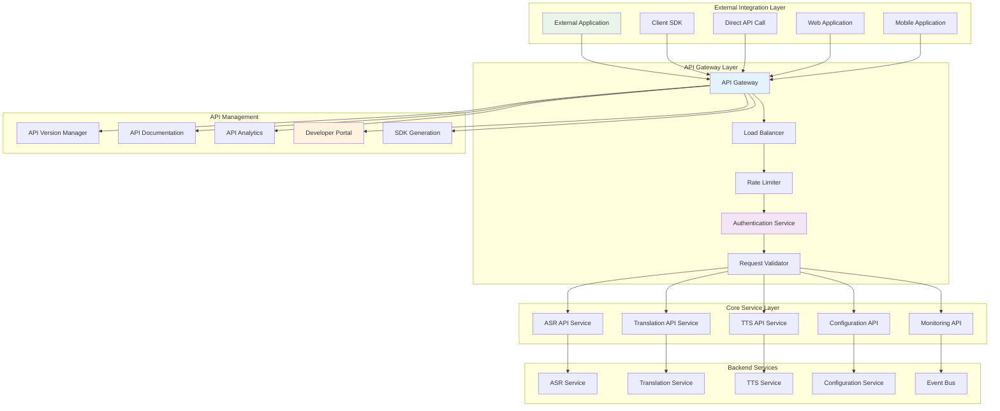
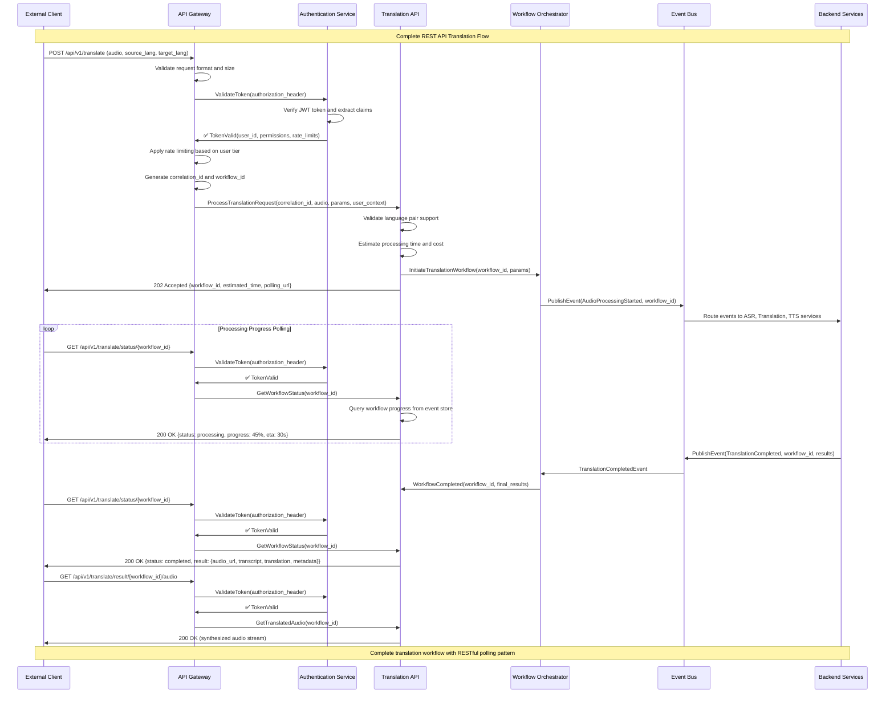
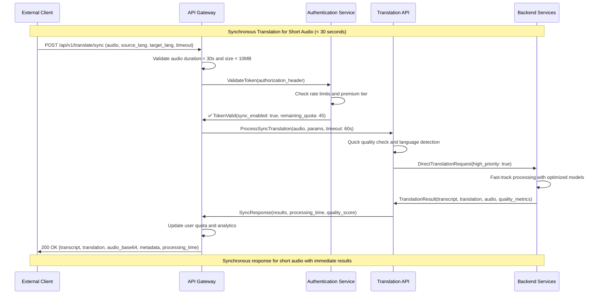
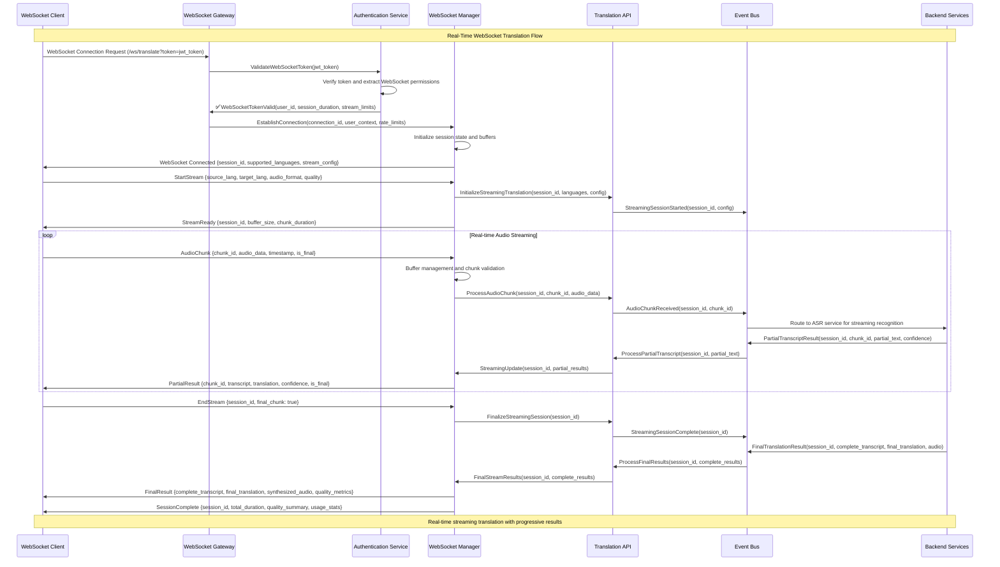
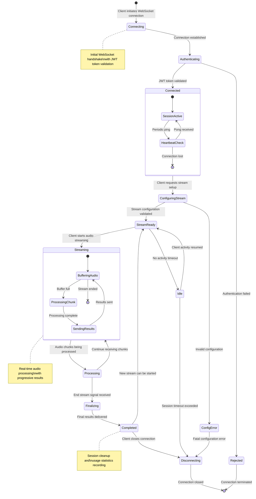
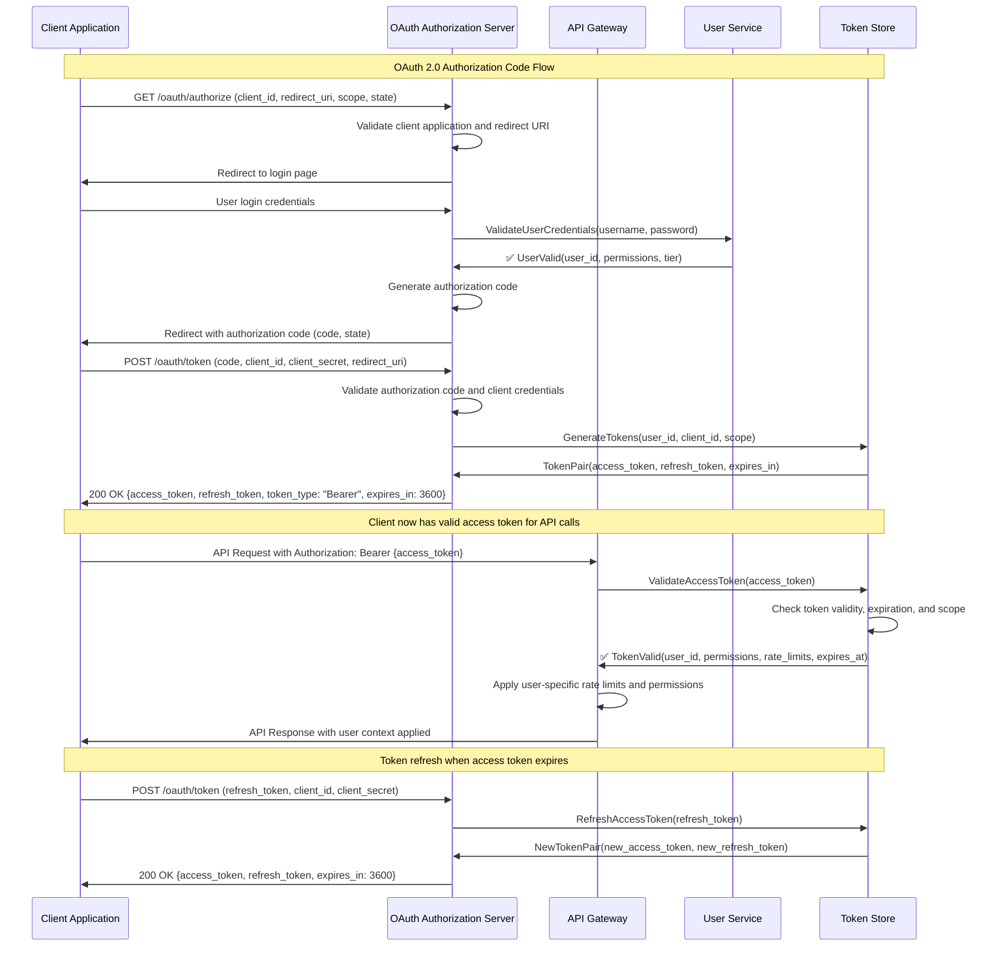
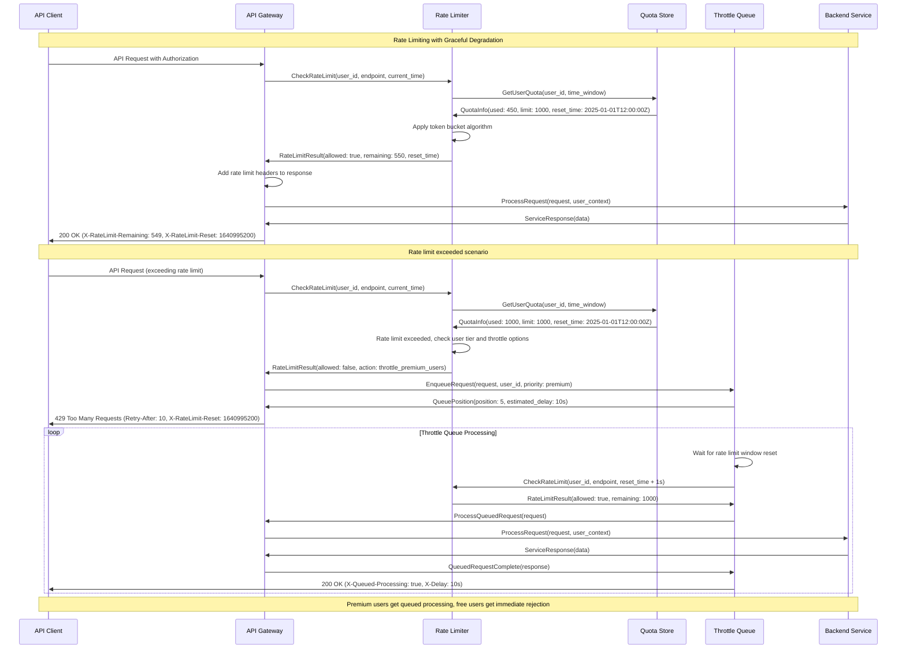
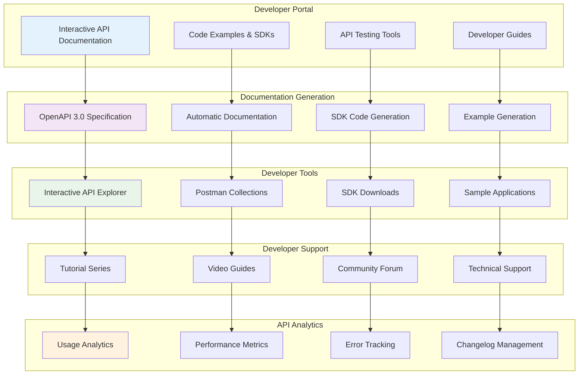

# API Integration Workflow Documentation
## Universal Speech Translation Platform

> **Integration Excellence**: This document provides comprehensive API integration workflow documentation including REST API flows, WebSocket communication patterns, authentication mechanisms, and session management workflows that enable seamless external system integration with the Universal Speech Translation Platform.

## Overview

The Universal Speech Translation Platform provides comprehensive API integration capabilities that enable external systems to seamlessly integrate speech translation functionality. This documentation details the complete API integration architecture including RESTful APIs, real-time WebSocket communication, robust authentication mechanisms, and sophisticated session management workflows.

### API Integration Principles

- **API-First Design**: All functionality exposed through well-designed, versioned APIs
- **Multiple Protocol Support**: REST APIs for request-response and WebSocket for real-time communication
- **Comprehensive Authentication**: OAuth 2.0, JWT tokens, and API key-based authentication
- **Session Management**: Stateful sessions with automatic lifecycle management
- **Rate Limiting & Throttling**: Configurable rate limiting with graceful degradation
- **Developer Experience**: Comprehensive documentation, SDKs, and testing tools

## API Architecture Overview

### API Gateway and Service Integration



## RESTful API Integration Flows

### Complete Speech Translation REST API Flow



### Synchronous API Flow for Short Audio



## WebSocket Integration for Real-Time Communication

### Real-Time Translation WebSocket Flow



### WebSocket Session Management



## Authentication and Authorization Flows

### OAuth 2.0 Authentication Flow



### JWT Token Validation and Claims

```yaml
# JWT Token Structure and Validation
jwt_token_structure:
  header:
    algorithm: "RS256"
    type: "JWT"
    key_id: "key-2025-01"
    
  payload:
    issuer: "https://auth.universalspeech.ai"
    subject: "user-uuid-12345"
    audience: "universal-speech-api"
    expiration: 1640995200
    issued_at: 1640991600
    not_before: 1640991600
    jwt_id: "jwt-uuid-67890"
    
    # Custom claims
    user_tier: "premium"
    api_version: "v1"
    rate_limits:
      requests_per_minute: 1000
      concurrent_streams: 10
      daily_quota: 100000
    permissions:
      - "translate:read"
      - "translate:write"
      - "stream:create"
      - "models:list"
    features:
      - "real_time_translation"
      - "custom_models"
      - "priority_processing"
    
  signature: "calculated using RS256 algorithm"

# Token validation rules
token_validation:
  signature_verification:
    algorithm: "RS256"
    public_key_source: "jwks_endpoint"
    key_rotation_support: true
    
  claims_validation:
    required_claims: ["iss", "sub", "aud", "exp", "iat"]
    issuer_whitelist: ["https://auth.universalspeech.ai"]
    audience_validation: ["universal-speech-api"]
    clock_skew_tolerance: "30s"
    
  rate_limit_enforcement:
    basis: "user_tier"
    real_time_updates: true
    quota_tracking: "redis_based"
    grace_period: "5s"
```

## API Rate Limiting and Throttling

### Dynamic Rate Limiting Architecture

```mermaid
graph TB
    subgraph "Rate Limiting Components"
        RateLimiter[Rate Limiter]
        QuotaManager[Quota Manager]
        ThrottleController[Throttle Controller]
        UsageTracker[Usage Tracker]
    end
    
    subgraph "Rate Limiting Strategies"
        TokenBucket[Token Bucket Algorithm]
        SlidingWindow[Sliding Window Counter]
        FixedWindow[Fixed Window Counter]
        LeakyBucket[Leaky Bucket Algorithm]
    end
    
    subgraph "User Tier Management"
        FreeUser[Free Tier Users]
        BasicUser[Basic Tier Users]
        PremiumUser[Premium Tier Users]
        EnterpriseUser[Enterprise Users]
    end
    
    subgraph "Rate Limit Storage"
        RedisCluster[Redis Cluster]
        MemoryCache[In-Memory Cache]
        DatabaseFallback[Database Fallback]
    end
    
    subgraph "Response Strategies"
        AllowRequest[Allow Request]
        DelayRequest[Delay Request]
        RejectRequest[Reject Request (429)]
        QueueRequest[Queue Request]
    end
    
    RateLimiter --> TokenBucket
    RateLimiter --> SlidingWindow
    RateLimiter --> FixedWindow
    RateLimiter --> LeakyBucket
    
    QuotaManager --> FreeUser
    QuotaManager --> BasicUser
    QuotaManager --> PremiumUser
    QuotaManager --> EnterpriseUser
    
    ThrottleController --> RedisCluster
    ThrottleController --> MemoryCache
    ThrottleController --> DatabaseFallback
    
    UsageTracker --> AllowRequest
    UsageTracker --> DelayRequest
    UsageTracker --> RejectRequest
    UsageTracker --> QueueRequest
    
    style RateLimiter fill:#e3f2fd
    style PremiumUser fill:#e8f5e8
    style AllowRequest fill:#e8f5e8
    style RejectRequest fill:#ffebee
```

### Rate Limiting Flow with Graceful Degradation



## Session Management and State Handling

### Distributed Session Management

```mermaid
graph TB
    subgraph "Session Management Architecture"
        SessionManager[Session Manager]
        SessionStore[Distributed Session Store]
        SessionReplication[Session Replication]
        SessionCleanup[Session Cleanup Service]
    end
    
    subgraph "Session Types"
        RESTSession[REST API Sessions]
        WebSocketSession[WebSocket Sessions]
        StreamingSession[Streaming Sessions]
        BatchSession[Batch Processing Sessions]
    end
    
    subgraph "Session Storage"
        RedisCluster[Redis Cluster (Primary)]
        DatabaseBackup[Database Backup]
        InMemoryCache[In-Memory Cache]
    end
    
    subgraph "Session Lifecycle"
        SessionCreation[Session Creation]
        SessionValidation[Session Validation]
        SessionHeartbeat[Session Heartbeat]
        SessionExpiration[Session Expiration]
        SessionCleanupProcess[Session Cleanup]
    end
    
    subgraph "Session Data"
        UserContext[User Context]
        ProcessingState[Processing State]
        UploadProgress[Upload Progress]
        ResultsCache[Results Cache]
        ConfigurationState[Configuration State]
    end
    
    SessionManager --> RESTSession
    SessionManager --> WebSocketSession
    SessionManager --> StreamingSession
    SessionManager --> BatchSession
    
    SessionManager --> RedisCluster
    SessionStore --> DatabaseBackup
    SessionStore --> InMemoryCache
    
    SessionStore --> SessionCreation
    SessionStore --> SessionValidation
    SessionStore --> SessionHeartbeat
    SessionStore --> SessionExpiration
    SessionStore --> SessionCleanupProcess
    
    SessionCreation --> UserContext
    SessionValidation --> ProcessingState
    SessionHeartbeat --> UploadProgress
    SessionExpiration --> ResultsCache
    SessionCleanupProcess --> ConfigurationState
    
    style SessionManager fill:#e3f2fd
    style WebSocketSession fill:#f3e5f5
    style RedisCluster fill:#e8f5e8
    style SessionCreation fill:#fff3e0
```

### Session State Synchronization

```yaml
# Session Configuration
session_management:
  session_types:
    rest_api_session:
      timeout: "30m"
      sliding_expiration: true
      persistence: "redis_primary_db_backup"
      replication_factor: 3
      
    websocket_session:
      timeout: "2h"
      heartbeat_interval: "30s"
      persistence: "redis_only"
      buffer_size: "10MB"
      max_concurrent: 10
      
    streaming_session:
      timeout: "4h"
      chunk_timeout: "60s"
      persistence: "redis_with_disk_overflow"
      max_stream_duration: "1h"
      auto_save_interval: "5m"
      
    batch_session:
      timeout: "24h"
      checkpoint_interval: "15m"
      persistence: "database_primary"
      max_jobs_per_session: 1000
      retry_attempts: 3
      
  session_storage:
    redis_cluster:
      nodes: ["redis-1:6379", "redis-2:6379", "redis-3:6379"]
      replication_factor: 3
      sharding: "consistent_hashing"
      failover: "automatic"
      data_compression: true
      
    database_backup:
      connection_pool_size: 20
      connection_timeout: "30s"
      query_timeout: "60s"
      retry_policy: "exponential_backoff"
      
  session_cleanup:
    cleanup_interval: "5m"
    batch_size: 1000
    expired_session_retention: "7d"
    cleanup_strategies: ["lazy_deletion", "background_cleanup"]
    
  session_security:
    session_token_length: 256
    csrf_protection: true
    secure_cookie_flags: true
    http_only_cookies: true
    same_site_policy: "strict"
```

## API Documentation and Developer Experience

### Interactive API Documentation



This comprehensive API integration documentation provides external systems with complete integration capabilities, robust authentication mechanisms, and excellent developer experience for seamless integration with the Universal Speech Translation Platform.

---

**Integration Standards**: All APIs follow OpenAPI 3.0 and REST best practices  
**Academic Context**: API integration supports thesis research on distributed AI system interfaces  
**Maintenance**: API documentation automatically updated with system evolution  
**Last Updated**: September 2025