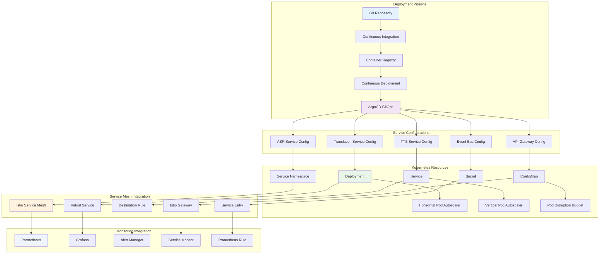
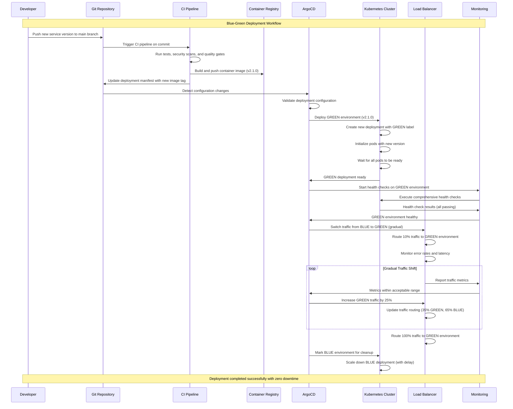
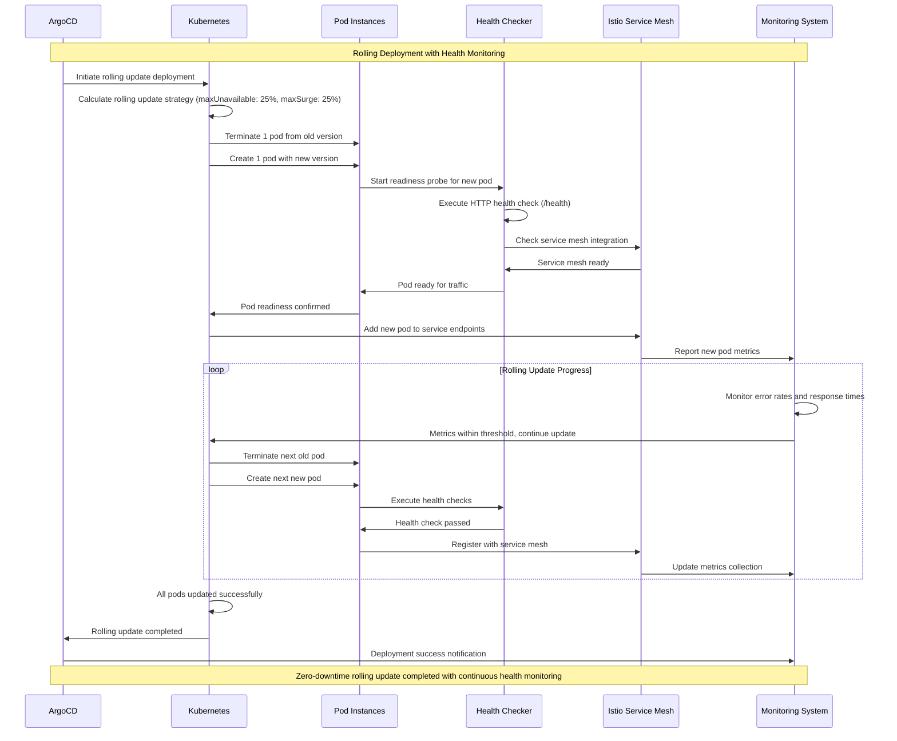
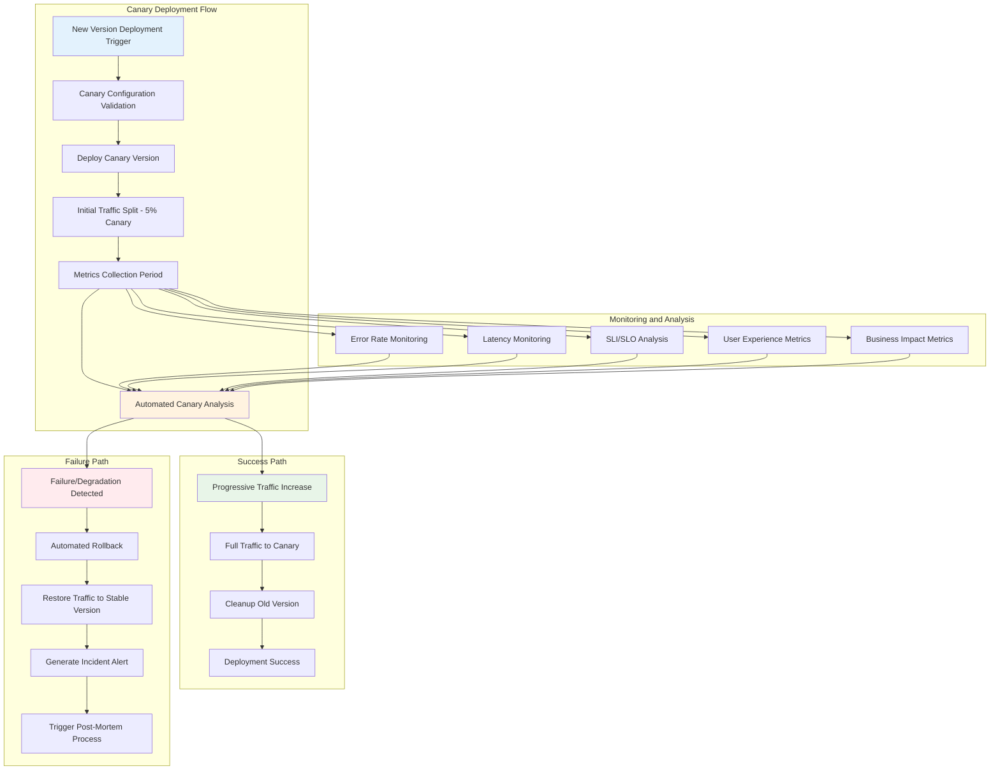
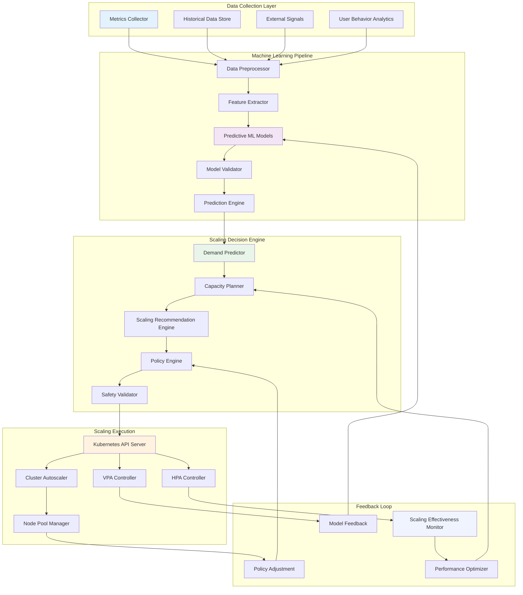
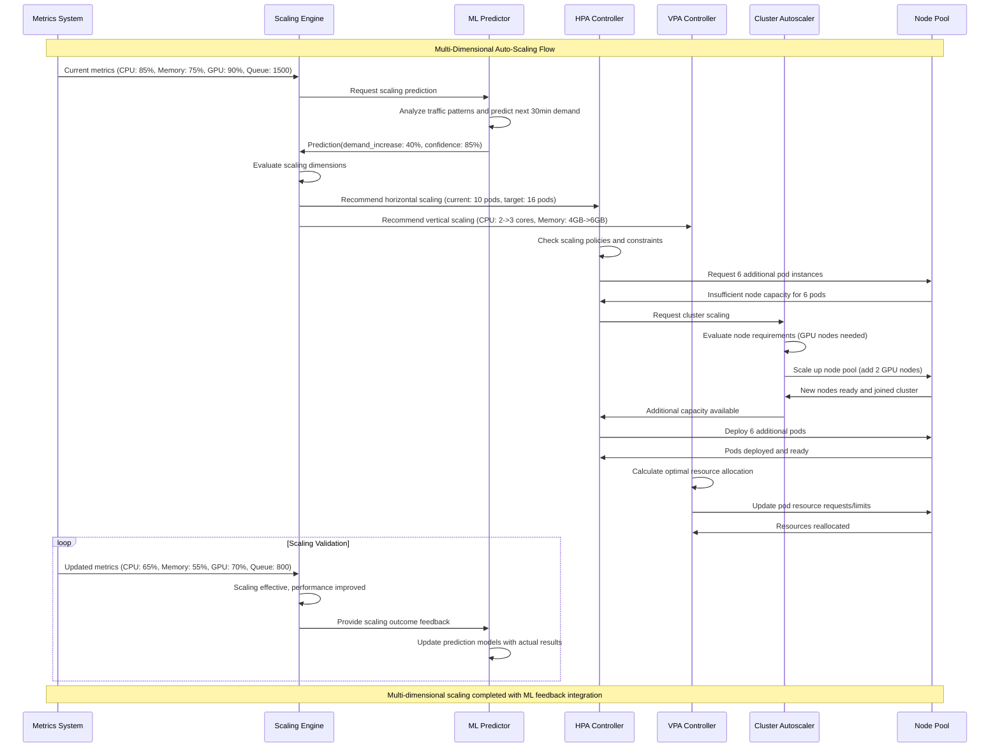
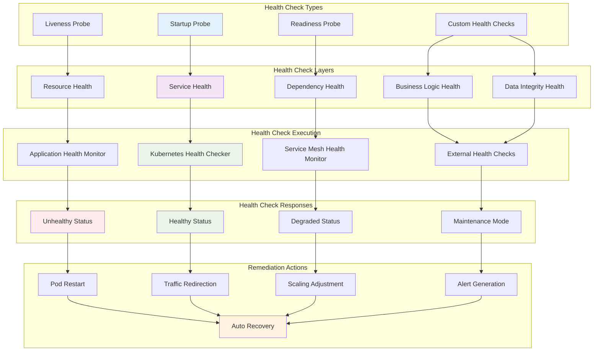
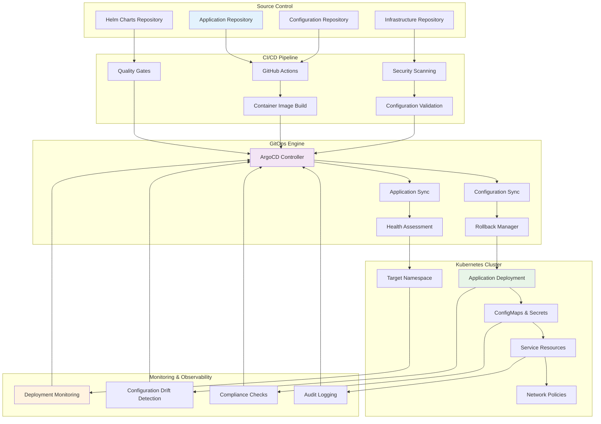

# Deployment and Scaling Workflow Documentation
## Universal Speech Translation Platform

> **Deployment Excellence**: This document provides comprehensive deployment and scaling workflow documentation including independent service deployment patterns, auto-scaling mechanisms, health monitoring systems, and container orchestration flows that ensure reliable, scalable, and maintainable service deployment and operation.

## Overview

The Universal Speech Translation Platform implements sophisticated deployment and scaling workflows that enable independent service deployment, dynamic auto-scaling, and comprehensive health monitoring. This documentation details the complete deployment architecture that supports continuous integration, zero-downtime deployments, and automatic scaling based on demand patterns.

### Deployment and Scaling Principles

- **Independent Service Deployment**: Each service can be deployed independently without affecting others
- **Zero-Downtime Deployment**: Blue-green and rolling deployment strategies ensure continuous availability
- **Auto-Scaling**: Intelligent scaling based on metrics, predictions, and resource utilization
- **Health Monitoring**: Comprehensive health checks and monitoring throughout deployment lifecycle
- **Container Orchestration**: Kubernetes-native deployment with advanced orchestration features
- **Infrastructure as Code**: All deployments managed through version-controlled infrastructure code

## Container Orchestration Architecture

### Kubernetes Cluster Architecture

```mermaid
graph TB
    subgraph "Kubernetes Control Plane"
        APIServer[API Server]
        Scheduler[Scheduler]
        ControllerManager[Controller Manager]
        ETCD[ETCD Cluster]
        CloudController[Cloud Controller Manager]
    end
    
    subgraph "Node Pool: System Services"
        SystemNode1[System Node 1]
        SystemNode2[System Node 2]
        IngressController[Ingress Controller]
        DNS[CoreDNS]
        NetworkPolicy[Network Policy Controller]
    end
    
    subgraph "Node Pool: Speech Services"
        ASRNodePool[ASR Node Pool]
        ASRNode1[ASR Node 1 - GPU]
        ASRNode2[ASR Node 2 - GPU]
        ASRNode3[ASR Node 3 - GPU]
    end
    
    subgraph "Node Pool: Translation Services"
        TranslationNodePool[Translation Node Pool]
        TransNode1[Translation Node 1 - GPU]
        TransNode2[Translation Node 2 - GPU]
        TransNode3[Translation Node 3 - GPU]
    end
    
    subgraph "Node Pool: TTS Services"
        TTSNodePool[TTS Node Pool]
        TTSNode1[TTS Node 1 - GPU]
        TTSNode2[TTS Node 2 - GPU]
        TTSNode3[TTS Node 3 - GPU]
    end
    
    subgraph "Node Pool: General Services"
        GeneralNodePool[General Node Pool]
        GeneralNode1[API Gateway Node]
        GeneralNode2[Event Bus Node]
        GeneralNode3[Configuration Node]
    end
    
    APIServer --> Scheduler
    Scheduler --> ControllerManager
    ControllerManager --> ETCD
    ETCD --> CloudController
    
    APIServer --> SystemNode1
    APIServer --> SystemNode2
    APIServer --> ASRNode1
    APIServer --> TransNode1
    APIServer --> TTSNode1
    APIServer --> GeneralNode1
    
    ASRNodePool --> ASRNode1
    ASRNodePool --> ASRNode2
    ASRNodePool --> ASRNode3
    
    TranslationNodePool --> TransNode1
    TranslationNodePool --> TransNode2
    TranslationNodePool --> TransNode3
    
    TTSNodePool --> TTSNode1
    TTSNodePool --> TTSNode2
    TTSNodePool --> TTSNode3
    
    GeneralNodePool --> GeneralNode1
    GeneralNodePool --> GeneralNode2
    GeneralNodePool --> GeneralNode3
    
    SystemNode1 --> IngressController
    SystemNode2 --> DNS
    SystemNode2 --> NetworkPolicy
    
    style APIServer fill:#e3f2fd
    style ASRNodePool fill:#f3e5f5
    style TranslationNodePool fill:#e8f5e8
    style TTSNodePool fill:#fff3e0
    style GeneralNodePool fill:#f0f4ff
```



### Service Deployment Architecture



## Independent Service Deployment Workflows

### Blue-Green Deployment Strategy



### Rolling Deployment with Health Monitoring



### Canary Deployment with Automated Rollback



## Auto-Scaling Mechanisms

### Horizontal Pod Autoscaler (HPA) Configuration

```yaml
# ASR Service HPA Configuration
apiVersion: autoscaling/v2
kind: HorizontalPodAutoscaler
metadata:
  name: asr-service-hpa
  namespace: speech-services
spec:
  scaleTargetRef:
    apiVersion: apps/v1
    kind: Deployment
    name: asr-service
  minReplicas: 3
  maxReplicas: 50
  metrics:
  - type: Resource
    resource:
      name: cpu
      target:
        type: Utilization
        averageUtilization: 70
  - type: Resource
    resource:
      name: memory
      target:
        type: Utilization
        averageUtilization: 80
  - type: Resource
    resource:
      name: nvidia.com/gpu
      target:
        type: Utilization
        averageUtilization: 85
  - type: Pods
    pods:
      metric:
        name: concurrent_requests
      target:
        type: AverageValue
        averageValue: "100"
  - type: Object
    object:
      metric:
        name: queue_depth
      target:
        type: Value
        value: "1000"
  behavior:
    scaleUp:
      stabilizationWindowSeconds: 60
      policies:
      - type: Percent
        value: 100
        periodSeconds: 15
      - type: Pods
        value: 5
        periodSeconds: 15
      selectPolicy: Max
    scaleDown:
      stabilizationWindowSeconds: 300
      policies:
      - type: Percent
        value: 50
        periodSeconds: 60
      - type: Pods
        value: 2
        periodSeconds: 60
      selectPolicy: Min

---
# Translation Service HPA Configuration
apiVersion: autoscaling/v2
kind: HorizontalPodAutoscaler
metadata:
  name: translation-service-hpa
  namespace: translation-services
spec:
  scaleTargetRef:
    apiVersion: apps/v1
    kind: Deployment
    name: translation-service
  minReplicas: 5
  maxReplicas: 100
  metrics:
  - type: Resource
    resource:
      name: cpu
      target:
        type: Utilization
        averageUtilization: 75
  - type: Resource
    resource:
      name: memory
      target:
        type: Utilization
        averageUtilization: 85
  - type: Pods
    pods:
      metric:
        name: translation_requests_per_second
      target:
        type: AverageValue
        averageValue: "50"
  - type: External
    external:
      metric:
        name: kafka_consumer_lag
      target:
        type: AverageValue
        averageValue: "100"
  behavior:
    scaleUp:
      stabilizationWindowSeconds: 45
      policies:
      - type: Percent
        value: 200
        periodSeconds: 15
      selectPolicy: Max
    scaleDown:
      stabilizationWindowSeconds: 600
      policies:
      - type: Percent
        value: 25
        periodSeconds: 60
      selectPolicy: Min
```

### Predictive Auto-Scaling Architecture



### Multi-Dimensional Scaling Strategy



## Health Monitoring and Deployment Validation

### Comprehensive Health Check Architecture



### Service Health Monitoring Configuration

```yaml
# Service Health Monitoring Configuration
health_monitoring:
  probes:
    startup:
      http_get:
        path: /health/startup
        port: 8080
        scheme: HTTP
      initial_delay_seconds: 30
      period_seconds: 10
      timeout_seconds: 5
      failure_threshold: 10
      success_threshold: 1
      
    readiness:
      http_get:
        path: /health/ready
        port: 8080
        scheme: HTTP
        http_headers:
        - name: Accept
          value: application/json
      initial_delay_seconds: 5
      period_seconds: 5
      timeout_seconds: 3
      failure_threshold: 3
      success_threshold: 1
      
    liveness:
      http_get:
        path: /health/live
        port: 8080
        scheme: HTTP
      initial_delay_seconds: 60
      period_seconds: 30
      timeout_seconds: 5
      failure_threshold: 3
      success_threshold: 1
      
  custom_health_checks:
    database_connectivity:
      endpoint: /health/database
      timeout: 10s
      retry_attempts: 3
      severity: critical
      
    external_api_dependency:
      endpoint: /health/dependencies
      timeout: 5s
      retry_attempts: 2
      severity: warning
      
    model_availability:
      endpoint: /health/models
      timeout: 15s
      retry_attempts: 1
      severity: critical
      
    queue_health:
      endpoint: /health/queue
      timeout: 3s
      retry_attempts: 2
      severity: warning
      
  health_check_responses:
    healthy:
      status_code: 200
      response_format: json
      required_fields: ["status", "timestamp", "version"]
      
    degraded:
      status_code: 200
      response_format: json
      degradation_indicators: ["high_latency", "partial_functionality"]
      
    unhealthy:
      status_code: 503
      response_format: json
      error_details: true
      remediation_suggestions: true
      
  monitoring_integration:
    prometheus:
      metrics_endpoint: /metrics
      health_check_metrics: true
      custom_labels: ["service", "version", "environment"]
      
    grafana:
      dashboard_integration: true
      alerting_rules: true
      notification_channels: ["slack", "email", "pagerduty"]
```

## Infrastructure as Code and GitOps

### GitOps Deployment Pipeline



### Infrastructure as Code Templates

```yaml
# Terraform Infrastructure Configuration
terraform:
  kubernetes_cluster:
    provider: "gcp"
    region: "us-central1"
    
    node_pools:
      system_pool:
        machine_type: "n1-standard-4"
        min_nodes: 3
        max_nodes: 10
        disk_size: "100GB"
        disk_type: "SSD"
        taints:
          - key: "system"
            value: "true"
            effect: "NoSchedule"
            
      asr_pool:
        machine_type: "n1-standard-16"
        accelerator_type: "nvidia-tesla-v100"
        accelerator_count: 2
        min_nodes: 2
        max_nodes: 20
        disk_size: "200GB"
        disk_type: "SSD"
        taints:
          - key: "gpu"
            value: "asr"
            effect: "NoSchedule"
            
      translation_pool:
        machine_type: "n1-standard-8"
        accelerator_type: "nvidia-tesla-t4"
        accelerator_count: 1
        min_nodes: 3
        max_nodes: 50
        disk_size: "150GB"
        disk_type: "SSD"
        taints:
          - key: "gpu"
            value: "translation"
            effect: "NoSchedule"
            
      tts_pool:
        machine_type: "n1-standard-8"
        accelerator_type: "nvidia-tesla-t4"
        accelerator_count: 1
        min_nodes: 2
        max_nodes: 30
        disk_size: "150GB"
        disk_type: "SSD"
        taints:
          - key: "gpu"
            value: "tts"
            effect: "NoSchedule"
            
      general_pool:
        machine_type: "n1-standard-4"
        min_nodes: 5
        max_nodes: 100
        disk_size: "100GB"
        disk_type: "SSD"
        
    networking:
      network_policy_enabled: true
      private_cluster: true
      authorized_networks:
        - cidr_block: "10.0.0.0/8"
          display_name: "Internal Network"
      master_ipv4_cidr_block: "172.16.0.0/28"
      
    security:
      enable_workload_identity: true
      enable_network_policy: true
      enable_pod_security_policy: true
      enable_binary_authorization: true
      
  monitoring:
    prometheus:
      retention: "30d"
      storage_size: "500GB"
      alerting_rules: true
      
    grafana:
      admin_password: "${random_password.grafana_admin.result}"
      plugins:
        - "grafana-kubernetes-app"
        - "grafana-piechart-panel"
        
  service_mesh:
    istio:
      version: "1.16.0"
      ingress_gateway: true
      egress_gateway: true
      telemetry_v2: true
      
    jaeger:
      storage_type: "elasticsearch"
      retention: "7d"
```

This comprehensive deployment and scaling documentation provides the Universal Speech Translation Platform with robust, scalable, and maintainable deployment capabilities that ensure reliability and performance at any scale.

---

**Deployment Standards**: All deployments follow GitOps and Infrastructure as Code principles  
**Academic Context**: Deployment architecture supports thesis research on scalable distributed AI systems  
**Maintenance**: Deployment configurations automatically updated with infrastructure evolution  
**Last Updated**: September 2025