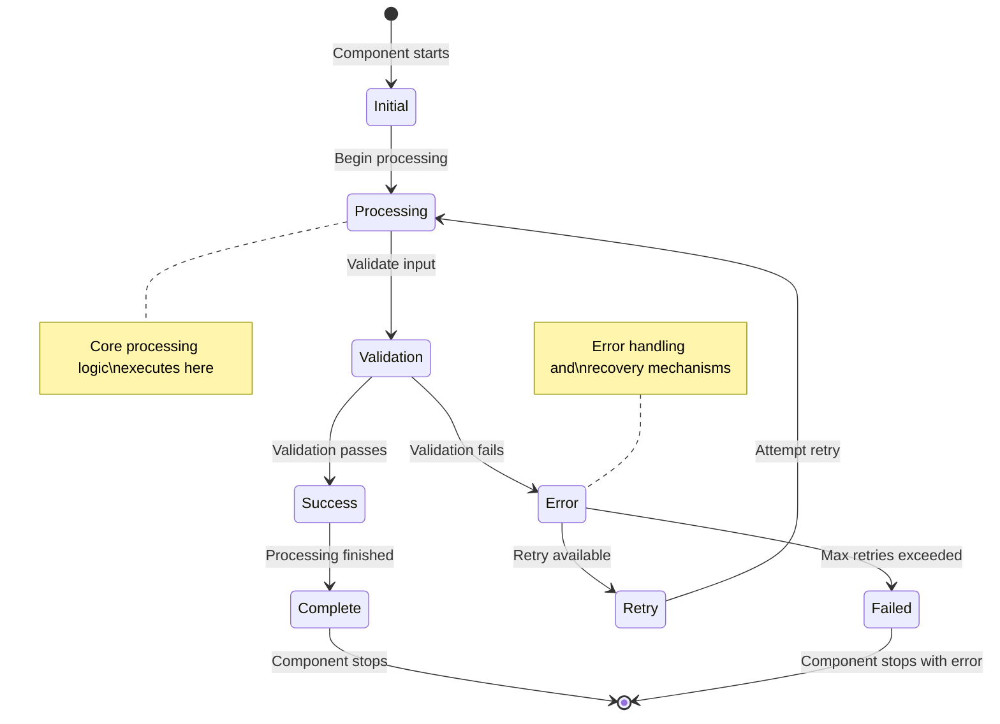

# Workflow Diagram Standards and Templates
## Universal Speech Translation Platform

> **Documentation Consistency**: This document establishes consistent diagram notation, color coding, layout principles, and reusable Mermaid diagram templates for all workflow documentation, ensuring visual consistency and accessibility across all workflow types.

## Overview

This document defines the comprehensive standards for workflow diagrams across the Universal Speech Translation Platform documentation. These standards ensure consistent visual communication, accessibility compliance, and internationalization support for all workflow documentation.

## Diagram Standards

### Color Coding Standards

#### Primary Component Colors

```mermaid
graph TD
    CoreService[🔵 Core Services<br/>Primary processing services]
    EventComponent[🟢 Event Processing<br/>Event-driven components]
    ConfigComponent[🟡 Configuration<br/>Dynamic configuration and management]
    ErrorComponent[🔴 Error Handling<br/>Error conditions and recovery]
    AIComponent[🟣 AI/ML Components<br/>Machine learning models and processing]
    ExternalSystem[⚪ External Systems<br/>Third-party integrations and APIs]
    
    style CoreService fill:#2196f3,color:#fff
    style EventComponent fill:#4caf50,color:#fff
    style ConfigComponent fill:#ffc107,color:#000
    style ErrorComponent fill:#f44336,color:#fff
    style AIComponent fill:#9c27b0,color:#fff
    style ExternalSystem fill:#9e9e9e,color:#fff
```


#### Status and State Colors

```mermaid
graph LR
    Success[✅ Success State<br/>fill:#e8f5e8]
    InProgress[⏳ In Progress<br/>fill:#fff3e0]
    Warning[⚠️ Warning State<br/>fill:#fff8e1]
    Error[❌ Error State<br/>fill:#ffebee]
    Critical[🚨 Critical State<br/>fill:#ffcdd2]
    
    style Success fill:#e8f5e8
    style InProgress fill:#fff3e0
    style Warning fill:#fff8e1
    style Error fill:#ffebee
    style Critical fill:#ffcdd2
```


### Symbol Standards

#### Service Components

```mermaid
graph TB
    Rectangle[Rectangle<br/>Services and processing components]
    Diamond{Diamond<br/>Decision points and routing logic}
    Circle((Circle<br/>Events and data flows))
    Cylinder[(Cylinder<br/>Data storage and caching)]
    Cloud[Cloud<br/>External services and APIs]
    Gear[⚙️ Gear<br/>Configuration and management functions]
```


#### Flow Direction Standards


## Template Library

### 1. Service Architecture Template


### 2. Event Flow Template


### 3. Decision Flow Template


### 4. State Machine Template



### 5. System Integration Template


## Accessibility Standards

### Visual Accessibility Guidelines

1. **Color Accessibility**
   - All colors meet WCAG 2.1 AA contrast requirements
   - Color is never the only means of conveying information
   - Patterns and shapes supplement color coding

2. **Text Readability**
   - Minimum font size equivalent in diagrams
   - High contrast text on colored backgrounds
   - Alternative text descriptions for all diagrams

3. **Universal Design**
   - Diagrams readable in monochrome
   - Clear visual hierarchy
   - Consistent spacing and alignment

### Internationalization Support

1. **Text Standards**
   - Use clear, simple language
   - Avoid cultural idioms or references
   - Support for Unicode text in all diagrams

2. **Cultural Sensitivity**
   - Left-to-right reading patterns by default
   - Consideration for RTL languages in documentation
   - Culturally neutral symbols and examples

## Mermaid Syntax Standards

### Basic Syntax Guidelines

```javascript
// Standard node definitions
graph TB
    NodeId[Display Text]
    NodeId2((Circle Node))
    NodeId3{Decision Node}
    NodeId4[(Database Node)]

// Styling standards
style NodeId fill:#2196f3,color:#fff
style NodeId2 fill:#4caf50,color:#fff

// Connection standards
NodeId --> NodeId2
NodeId -.-> NodeId3
NodeId <--> NodeId4
```

### Complex Diagram Standards

```javascript
// Sequence diagram standards
sequenceDiagram
    participant A as Component A
    participant B as Component B
    
    Note over A, B: Process Description
    
    A->>B: Action Description
    B-->>A: Response Description
    
    Note over A: Internal processing note

// State diagram standards
stateDiagram-v2
    [*] --> State1
    State1 --> State2: Transition condition
    State2 --> [*]: End condition
    
    note right of State1: State description
```

## Documentation Integration

### Workflow Documentation Structure

Each workflow document should follow this structure:

1. **Title and Overview**: Clear purpose statement
2. **Architecture Principles**: Core design principles
3. **Visual Overview**: High-level architecture diagram
4. **Detailed Workflows**: Step-by-step process diagrams
5. **Integration Points**: Connection to other workflows
6. **Performance Metrics**: Measurable targets
7. **Maintenance Notes**: Update procedures

### Cross-Reference Standards

```markdown
### Reference Format
- **Internal References**: [Section Name](#section-anchor)
- **External References**: [Document Name](./document-name.md)
- **API References**: [API Endpoint](#api-documentation)
- **Code References**: `code_element` or ```code block```

### Diagram Captions
All diagrams should include:
- **Figure Number**: Figure 1: Description
- **Purpose Statement**: What the diagram shows
- **Key Elements**: Important components highlighted
- **Context**: Where this fits in the broader system
```

## Quality Assurance

### Diagram Review Checklist

- [ ] Follows color coding standards
- [ ] Uses consistent symbols and notation
- [ ] Includes proper styling
- [ ] Accessible color contrast
- [ ] Clear text labels
- [ ] Logical flow direction
- [ ] Consistent spacing
- [ ] Proper documentation
- [ ] Cross-references validated
- [ ] Mobile-friendly layout

### Maintenance Procedures

1. **Regular Review**: Quarterly review of all diagrams
2. **Update Triggers**: System changes, new requirements
3. **Consistency Checks**: Automated validation where possible
4. **User Feedback**: Incorporation of user suggestions
5. **Version Control**: Proper change tracking

## Tool Recommendations

### Primary Tools
1. **Mermaid.js**: Primary diagramming syntax
2. **PlantUML**: Alternative for complex diagrams
3. **Draw.io**: Visual diagram editor when needed
4. **GitHub**: Version control and collaboration

### Validation Tools
1. **Mermaid CLI**: Syntax validation
2. **Color Contrast Analyzers**: Accessibility validation
3. **Markdown Linters**: Documentation quality
4. **Link Checkers**: Reference validation

---

**Standards Compliance**: All diagrams must follow these established standards  
**Accessibility**: WCAG 2.1 AA compliance required for all visual elements  
**Maintenance**: Standards reviewed and updated quarterly  
**Last Updated**: September 2025