# End-to-End Speech Translation Flow Workflows
## Universal Speech Translation Platform

> **Complete Pipeline Documentation**: This document provides comprehensive sequence diagrams and workflow documentation for the complete speech translation pipeline from audio input to synthesized output, demonstrating the event-driven microservices architecture with language-agnostic processing and correlation tracking.

## Overview

The Universal Speech Translation Platform processes speech translation requests through a sophisticated event-driven pipeline that maintains complete service independence while ensuring seamless coordination. This document details the complete end-to-end flows including service interactions, event routing, correlation tracking, and error handling across all microservices.

### Contract note (events vs topics vs schemas)

The event names used in the sequence diagrams (e.g., `ASRRequestEvent`, `TranslationRequestEvent`, `TTSRequestEvent`) are **logical event types**, not guaranteed to be the exact Kafka topic names or Avro schemas currently implemented by each service in this workspace.

For contract alignment (topic naming, Avro envelope structure, and schema ownership), refer to [`event-driven-flows.md`](event-driven-flows.md) and the **Reality Check: Current Repo vs This Doc** section.

### Pipeline Architecture Principles

- **Event-Driven Coordination**: All services communicate exclusively through language-agnostic events
- **Correlation Tracking**: Every request maintains a unique correlation ID throughout the entire pipeline
- **Dynamic Language Support**: Runtime language detection and model selection across all services
- **Quality-Based Routing**: Intelligent routing based on language pair quality requirements
- **Independent Service Processing**: Each service operates autonomously with complete fault isolation

## Complete End-to-End Translation Flow

### Primary Translation Pipeline Sequence

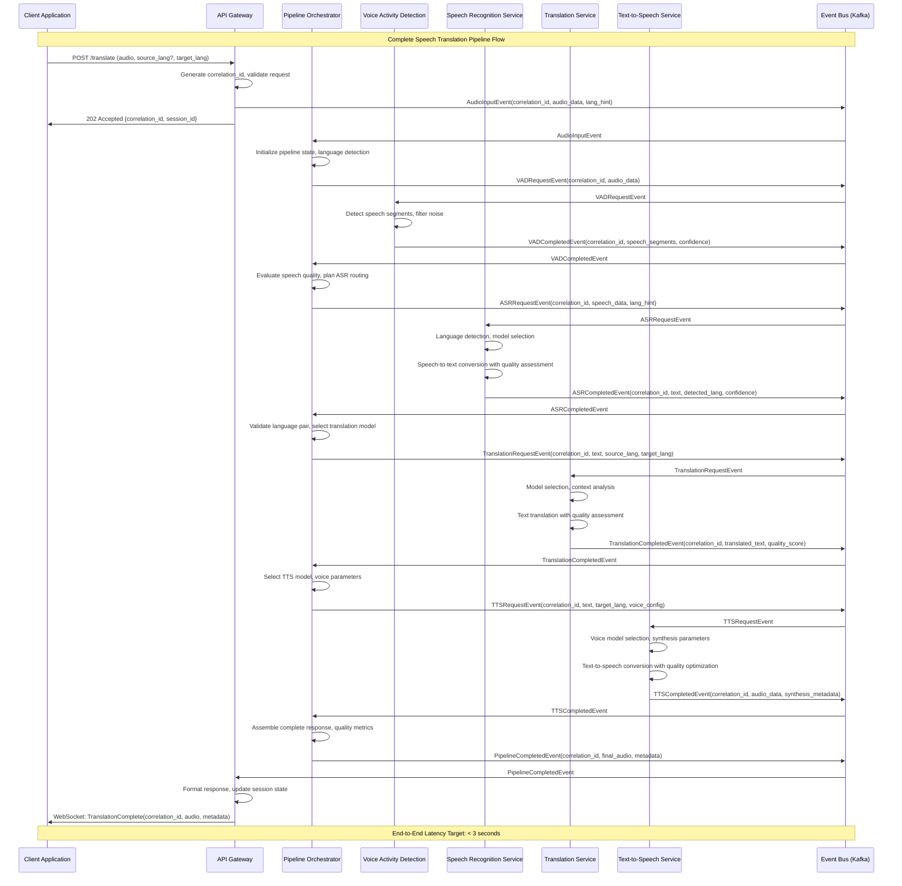

### Event Correlation and State Management Flow

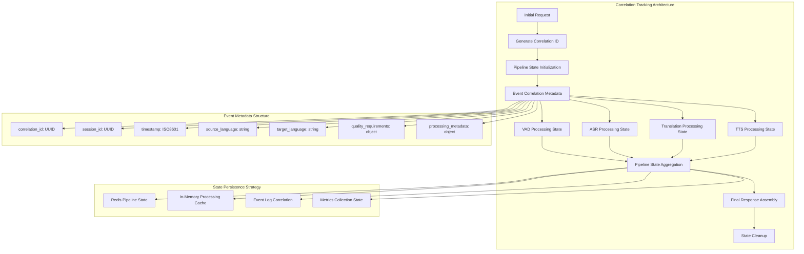

## Service-Specific Processing Workflows

### Voice Activity Detection Service Flow

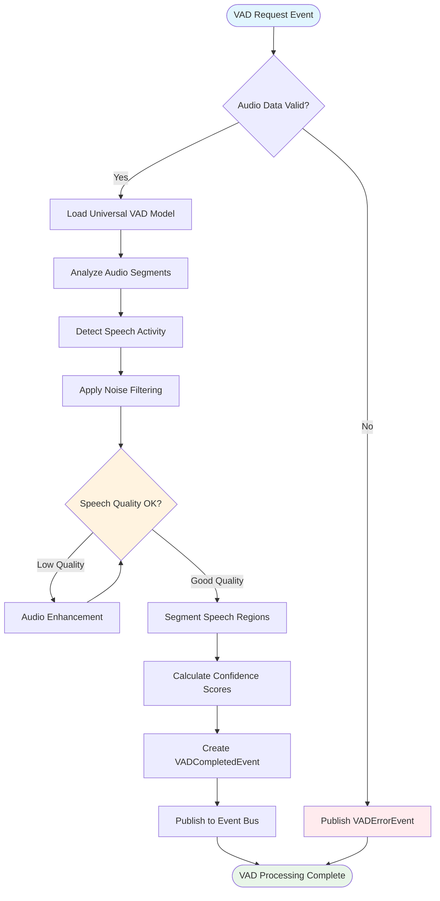

### Speech Recognition Service Flow

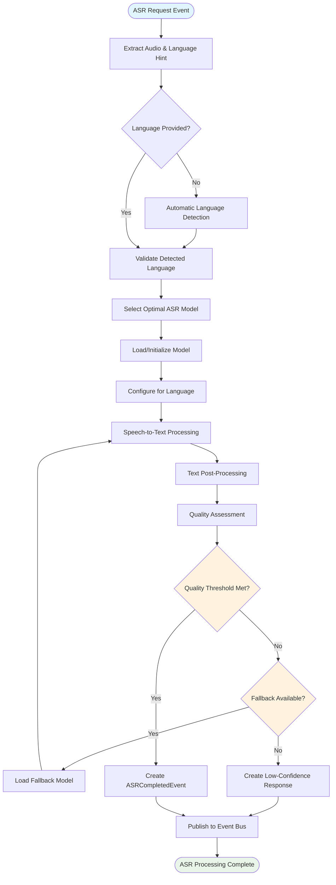

### Translation Service Flow

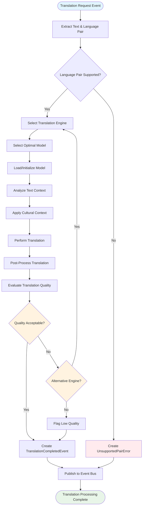

### Text-to-Speech Service Flow

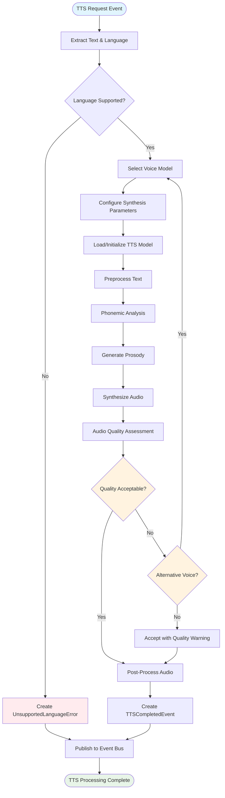

## Advanced Pipeline Scenarios

### Dynamic Language Detection Flow

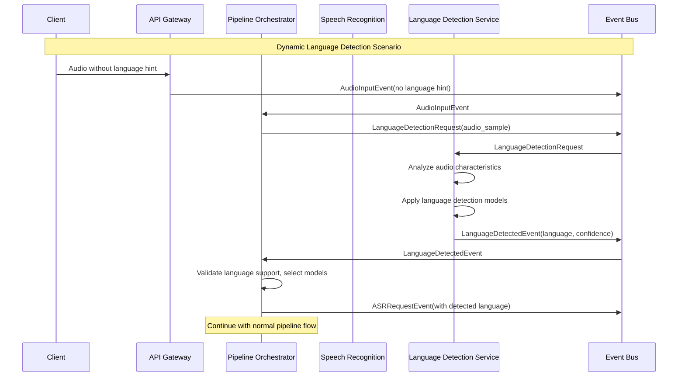

### Multi-Model Quality Comparison Flow

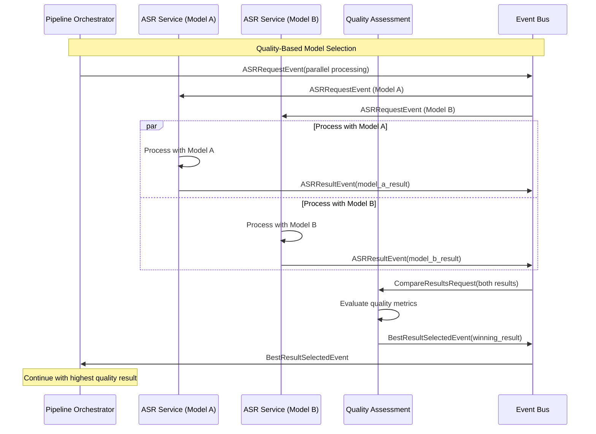

### Error Handling and Recovery Flow

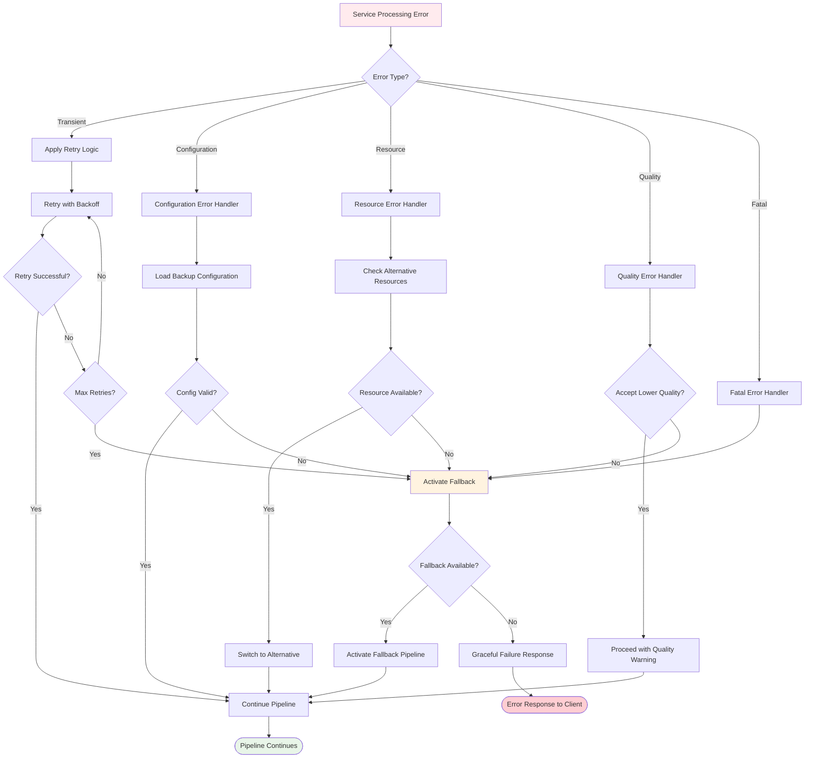

## Performance Metrics and Monitoring

### Key Performance Indicators

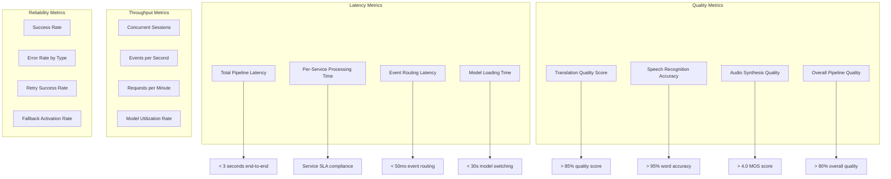

### Real-Time Monitoring Dashboard Metrics

1. **Pipeline Health**
   - End-to-end success rate
   - Service availability status
   - Event processing backlog
   - Active pipeline count

2. **Language-Specific Performance**
   - Performance by language pair
   - Model performance comparison
   - Quality metrics by language family
   - Cultural adaptation effectiveness

3. **Resource Utilization**
   - CPU usage per service
   - Memory consumption patterns
   - GPU utilization for ML models
   - Storage usage for model cache

4. **Quality Tracking**
   - Real-time quality scores
   - Quality degradation alerts
   - Model performance trends
   - User satisfaction metrics

## Correlation ID Tracking Implementation

### Event Correlation Structure

```yaml
correlation_metadata:
  correlation_id: "550e8400-e29b-41d4-a716-446655440000"
  session_id: "session_2025_09_15_12345"
  parent_event_id: "vad_completed_001"
  root_event_id: "audio_input_root"
  timestamp: "2025-09-15T12:17:00Z"
  
pipeline_state:
  current_stage: "translation"
  completed_stages: ["vad", "asr"]
  remaining_stages: ["tts", "response"]
  
language_metadata:
  source_language: "da"
  target_language: "en"
  detected_language: "da"
  detection_confidence: 0.95
  
quality_metrics:
  overall_quality_requirement: "high"
  stage_quality_scores:
    vad: 0.92
    asr: 0.88
    translation: null  # In progress
    tts: null  # Pending
```

### Correlation Tracking Across Services

Each service maintains correlation context and enriches events with processing metadata:

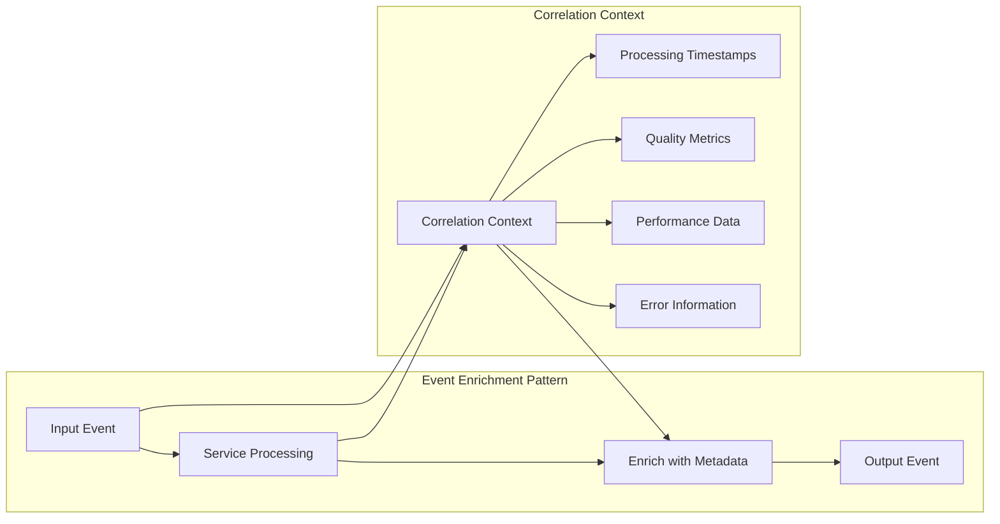

This comprehensive end-to-end flow documentation provides complete visibility into the Universal Speech Translation Platform's event-driven architecture, enabling systematic performance analysis, troubleshooting, and academic research validation.

---

**Flow Documentation Standards**: All sequence diagrams use consistent notation and correlation tracking  
**Academic Context**: Detailed flows support thesis research on distributed AI systems  
**Maintenance**: Flow documentation updated automatically with system changes  
**Last Updated**: September 2025