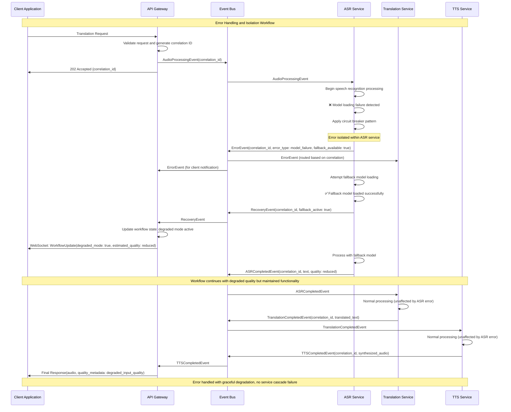
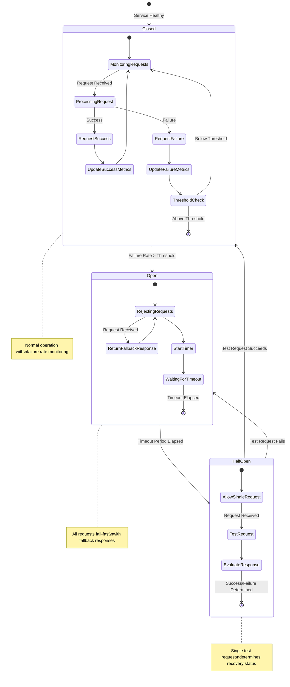
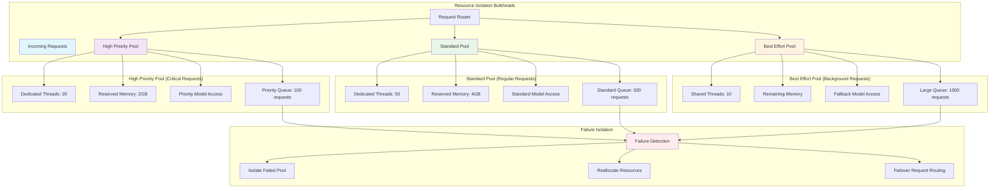
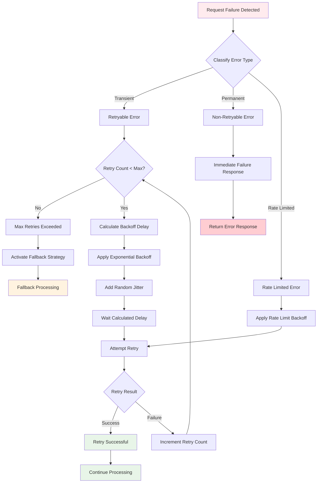
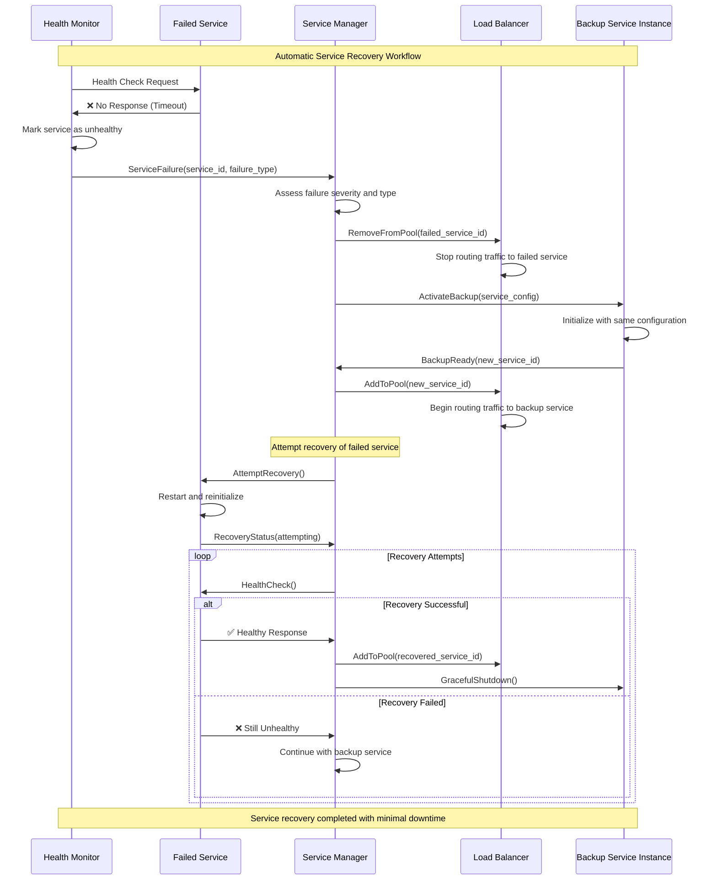
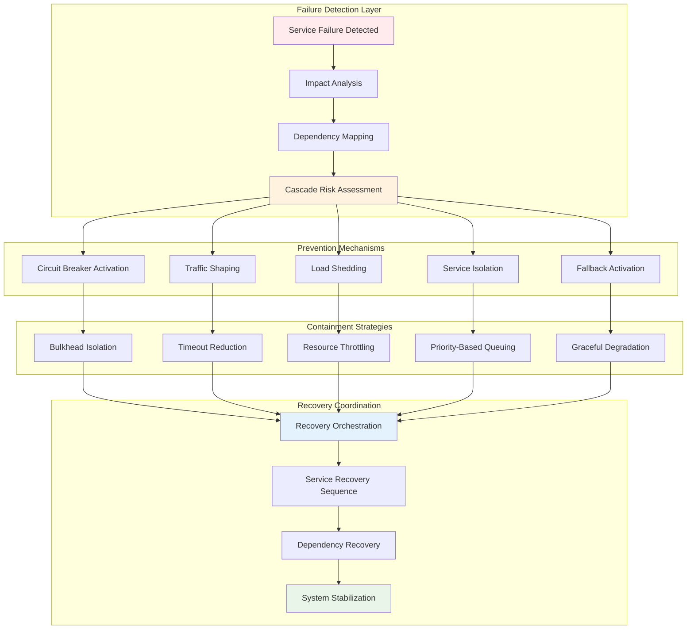
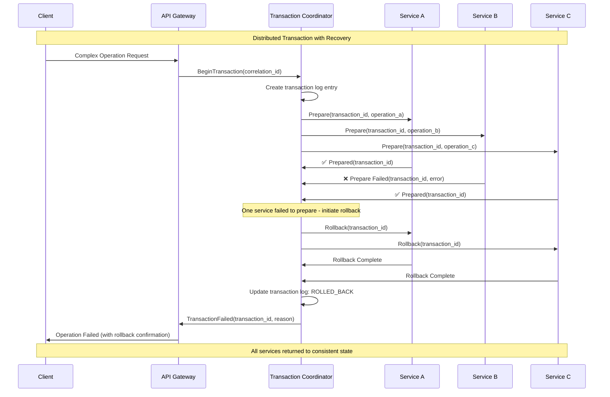
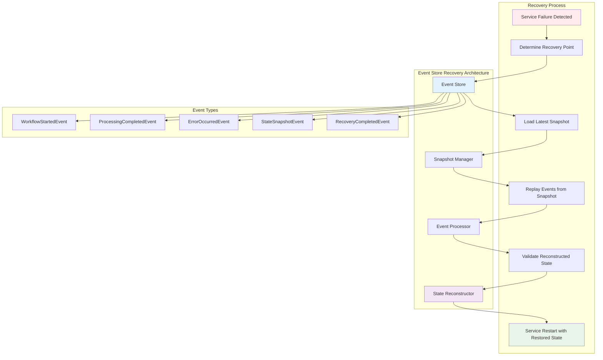
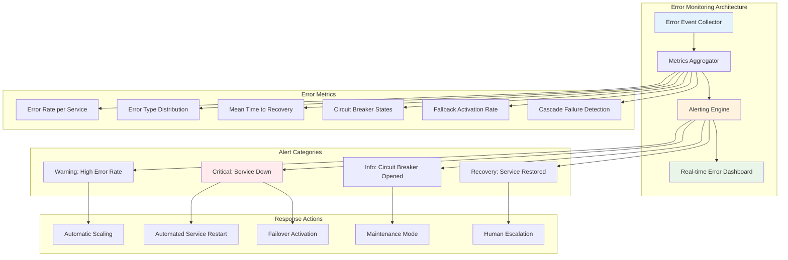

# Error Handling and Recovery Workflow Documentation
## Universal Speech Translation Platform

> **System Resilience**: This document provides comprehensive error handling and recovery workflow documentation including circuit breaker patterns, fallback mechanisms, recovery procedures, and graceful degradation flows, demonstrating how the system handles failures and maintains resilience across all services.

## Overview

The Universal Speech Translation Platform implements sophisticated error handling and recovery workflows that ensure system resilience, graceful degradation, and rapid recovery from failures. This document details the comprehensive error handling architecture that maintains service availability and data integrity under all failure conditions.

### Error Handling Principles

- **Fail-Fast Philosophy**: Rapid failure detection and immediate response
- **Graceful Degradation**: Maintained functionality with reduced quality when components fail
- **Circuit Breaker Protection**: Automatic protection against cascading failures
- **Independent Recovery**: Each service recovers independently without affecting others
- **Data Integrity**: Complete data consistency maintained throughout error scenarios

## Error Classification and Response Architecture

### Error Classification System

```mermaid
graph TB
    subgraph "Error Classification Hierarchy"
        ErrorDetected[Error Detected]
        ErrorClassifier[Error Classifier]
        
        ErrorClassifier --> TransientErrors[Transient Errors]
        ErrorClassifier --> PermanentErrors[Permanent Errors]
        ErrorClassifier --> SystemErrors[System Errors]
        ErrorClassifier --> BusinessErrors[Business Logic Errors]
        ErrorClassifier --> SecurityErrors[Security Errors]
    end
    
    subgraph "Transient Error Types"
        TransientErrors --> NetworkTimeout[Network Timeout]
        TransientErrors --> ResourceUnavailable[Resource Temporarily Unavailable]
        TransientErrors --> ModelLoading[Model Loading Delays]
        TransientErrors --> TemporaryOverload[Temporary System Overload]
    end
    
    subgraph "Permanent Error Types"
        PermanentErrors --> ConfigurationError[Configuration Error]
        PermanentErrors --> UnsupportedLanguage[Unsupported Language Pair]
        PermanentErrors --> InvalidRequest[Invalid Request Format]
        PermanentErrors --> AuthenticationFailure[Authentication Failure]
    end
    
    subgraph "System Error Types"
        SystemErrors --> ServiceUnavailable[Service Completely Unavailable]
        SystemErrors --> DatabaseFailure[Database Connection Failure]
        SystemErrors --> DiskSpaceExhausted[Storage Space Exhausted]
        SystemErrors --> MemoryExhausted[Memory Exhausted]
    end
    
    subgraph "Recovery Strategies"
        RecoveryStrategy[Recovery Strategy Selection]
        RecoveryStrategy --> RetryWithBackoff[Retry with Exponential Backoff]
        RecoveryStrategy --> FallbackMechanism[Activate Fallback Mechanism]
        RecoveryStrategy --> CircuitBreaker[Circuit Breaker Activation]
        RecoveryStrategy --> GracefulDegradation[Graceful Service Degradation]
        RecoveryStrategy --> ImmediateFailure[Immediate Failure Response]
    end
    
    ErrorDetected --> ErrorClassifier
    
    NetworkTimeout --> RetryWithBackoff
    ResourceUnavailable --> FallbackMechanism
    ConfigurationError --> ImmediateFailure
    ServiceUnavailable --> CircuitBreaker
    MemoryExhausted --> GracefulDegradation
    
    style ErrorDetected fill:#ffebee
    style ErrorClassifier fill:#fff3e0
    style TransientErrors fill:#e8f5e8
    style PermanentErrors fill:#ffcdd2
    style SystemErrors fill:#f3e5f5
    style RecoveryStrategy fill:#e3f2fd
```



### Error Propagation and Isolation



## Circuit Breaker Implementation

### Circuit Breaker State Management



### Service-Specific Circuit Breaker Configuration

```yaml
# Circuit Breaker Configuration by Service
circuit_breaker_config:
  speech_recognition_service:
    failure_threshold: 5
    timeout_duration: "30s"
    half_open_max_requests: 3
    success_threshold: 2
    monitored_errors:
      - model_loading_failure
      - audio_processing_timeout
      - memory_exhaustion
    fallback_strategy: "alternative_model"
    
  translation_service:
    failure_threshold: 3
    timeout_duration: "20s"
    half_open_max_requests: 2
    success_threshold: 2
    monitored_errors:
      - translation_model_failure
      - unsupported_language_pair
      - quality_threshold_failure
    fallback_strategy: "basic_translation_model"
    
  text_to_speech_service:
    failure_threshold: 4
    timeout_duration: "25s"
    half_open_max_requests: 3
    success_threshold: 2
    monitored_errors:
      - voice_synthesis_failure
      - audio_generation_timeout
      - voice_model_unavailable
    fallback_strategy: "basic_tts_engine"
    
  api_gateway:
    failure_threshold: 10
    timeout_duration: "60s"
    half_open_max_requests: 5
    success_threshold: 3
    monitored_errors:
      - downstream_service_unavailable
      - workflow_orchestration_failure
      - authentication_service_failure
    fallback_strategy: "cached_response_or_error"
```

## Fault Tolerance Patterns

### Bulkhead Pattern Implementation



### Retry Mechanism with Exponential Backoff



## Service Recovery Workflows

### Automatic Service Recovery



### Cascading Failure Prevention



## Data Consistency and Transaction Recovery

### Distributed Transaction Recovery



### Event Store Recovery Pattern



## Monitoring and Alerting for Error Handling

### Error Monitoring Dashboard



## Error Recovery Performance Targets

### Recovery Time Objectives (RTO) and Recovery Point Objectives (RPO)

```yaml
# Error Recovery Performance Targets
error_recovery_targets:
  service_recovery:
    detection_time: "< 5 seconds"
    circuit_breaker_activation: "< 2 seconds"
    fallback_activation: "< 3 seconds"
    automatic_recovery_attempt: "< 30 seconds"
    manual_intervention_escalation: "< 5 minutes"
    
  recovery_time_objectives:
    transient_errors: "< 10 seconds (with retry)"
    service_restart: "< 2 minutes"
    database_recovery: "< 5 minutes"
    complete_system_recovery: "< 15 minutes"
    disaster_recovery: "< 4 hours"
    
  recovery_point_objectives:
    in_memory_state: "0 seconds (no data loss)"
    event_store_recovery: "< 1 second"
    database_recovery: "< 30 seconds"
    backup_restoration: "< 15 minutes"
    
  availability_targets:
    single_service_availability: "> 99.9%"
    overall_system_availability: "> 99.95%"
    mean_time_between_failures: "> 168 hours (1 week)"
    mean_time_to_recovery: "< 5 minutes"
    
  error_rate_thresholds:
    acceptable_error_rate: "< 0.1%"
    warning_threshold: "0.5%"
    critical_threshold: "1.0%"
    circuit_breaker_threshold: "2.0%"
    
  cascade_failure_prevention:
    failure_isolation_time: "< 3 seconds"
    bulkhead_activation: "< 1 second"
    load_shedding_response: "< 2 seconds"
    graceful_degradation: "< 5 seconds"
```

This comprehensive error handling and recovery documentation demonstrates the Universal Speech Translation Platform's robust resilience architecture, ensuring continuous operation and rapid recovery from any failure scenario while maintaining data integrity and service quality.

---

**Resilience Standards**: All error handling follows fail-fast and graceful degradation principles  
**Academic Context**: Error handling supports thesis research on fault-tolerant distributed AI systems  
**Maintenance**: Recovery procedures updated automatically with system evolution  
**Last Updated**: September 2025