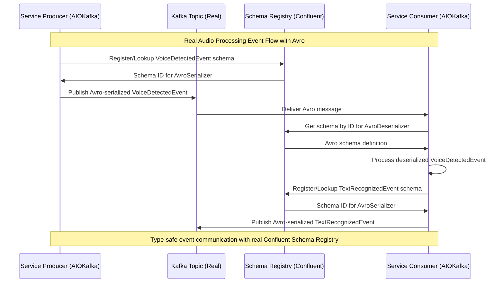
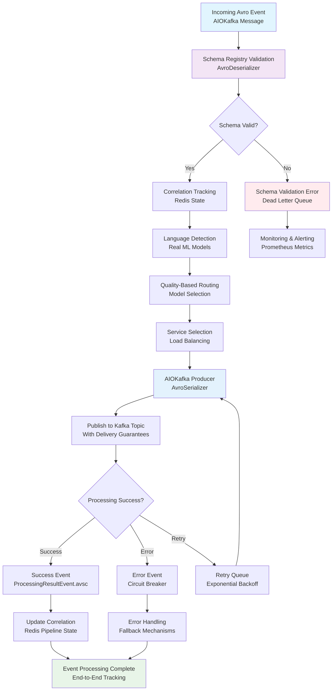
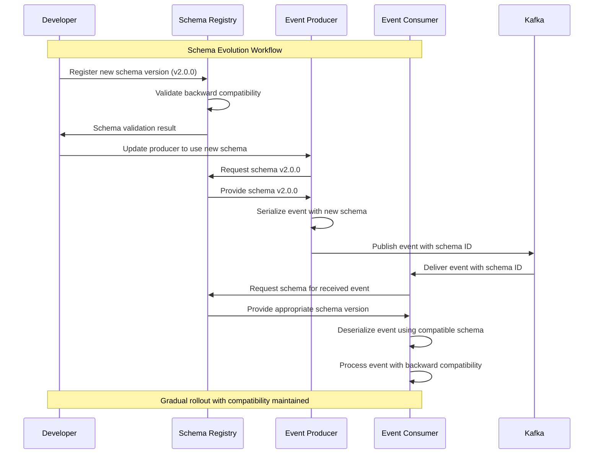
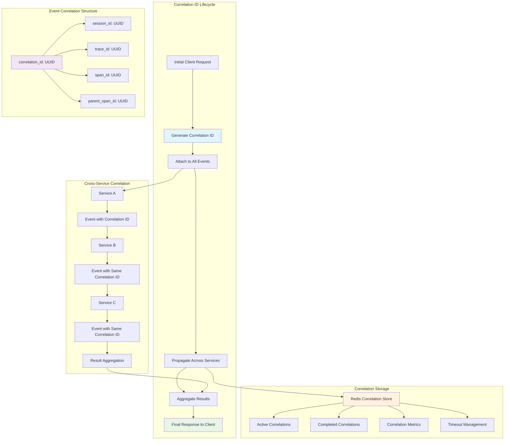
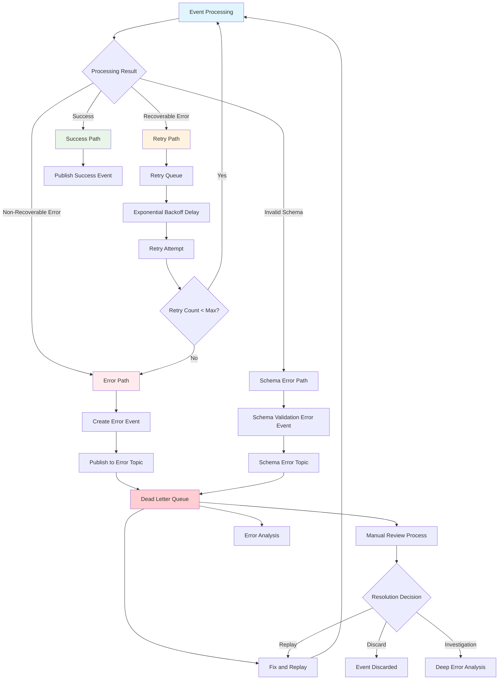

# Event-Driven Architecture Flow Documentation
## Universal Speech Translation Platform

> **Real Kafka and Schema Registry Integration**: This document provides comprehensive documentation of the actual event-driven communication architecture implemented in the Universal Speech Translation Platform, including real Confluent Schema Registry integration, AIOKafka implementation, and production-ready event flows with type-safe Avro serialization.

## Overview

The Universal Speech Translation Platform implements a production-ready event-driven architecture using real Confluent Schema Registry and AIOKafka integration. This document details the actual implementation with real Avro schemas, Kafka topics, event processing patterns, and correlation tracking that power the platform's language-agnostic processing capabilities.

### Real Event-Driven Architecture Principles

- **Schema Registry**: Target pattern is Confluent Schema Registry integration with `confluent-kafka[avro]` for type-safe serialization
- **Async Kafka**: Target pattern uses async producer/consumer implementation with delivery guarantees
- **Centralized Avro Schemas**: Target pattern uses centralized Avro schema files (a single shared schema directory) with evolution support
- **Complete Service Decoupling**: Services communicate exclusively through real Kafka events with zero direct dependencies
- **Schema Evolution**: Backward-compatible schema evolution supporting dynamic language additions
- **Correlation Tracking**: Complete request correlation across all service boundaries and processing stages
- **Quality-Based Routing**: Event routing based on language pair quality requirements and processing capabilities

## Reality Check: Current Repo vs This Doc

This document describes the *target* event-driven architecture (central topics + shared schemas + Schema Registry everywhere). In the current workspace (December 2025), the implemented services are **not yet fully aligned** to that target, so using this as an executable “workflow contract” requires a small but important alignment pass.

### What’s already real/implemented

- **Avro schemas exist**, but they are currently **service-local**, not centralized:
  - Translation schemas live in `Translation-Service/src/events/schemas/*.avsc` (e.g., `translation_request_event.avsc`).
  - TTS schemas live in `text-to-speech/src/schemas/avro/*.avsc` (e.g., `tts_request_event.avsc`, `tts_response_event.avsc`).
- **Schema Registry integration exists in code paths**, but it is not uniform across all services.

### What’s missing for “they work together”

1. **Topic taxonomy is inconsistent**
   - This doc uses platform-wide topics like `audio-processing-events`, `translation-events`, `synthesis-events`.
   - In code, Translation defaults to `translation-request-events` / `translation-completed-events`.
   - In code, TTS defaults to `tts-requests` / `tts-responses`.
   - In ASR, defaults include `voice-detected-events` / `text-recognized-events`, while routing references `speech-pipeline.*` topics.

2. **Avro event “envelope” is not standardized across services**
   - Translation’s Avro events are *flat* (top-level `event_id`, `correlation_id`, `timestamp` as `timestamp-millis`, etc.).
   - TTS’s Avro events use nested records (`event_metadata`, `correlation_data`, `context`, `routing`) and timestamps are strings.
   - Namespaces differ (e.g., `com.afhandling.translation.events` vs `ai.speech.translation.tts.events`).

3. **ASR is not yet Schema-Registry-backed Avro end-to-end**
   - ASR’s producer/consumer defaults currently serialize JSON; it has “Avro-compatible” models but not a single shared `.avsc` contract used across services.

### Minimum alignment decision needed

You need to choose one of the following and apply it consistently:

- **Option A (recommended): Standardize on platform topics + shared envelope**
  - Make the services publish/consume the platform topics described in this doc.
  - Adopt one shared Avro envelope (`BaseEvent` with `event_metadata` + `correlation` + `payload`) and ensure all events embed it.

- **Option B: Keep service-local topics, add a small adapter layer**
  - Leave current topics as-is (easier short-term).
  - Introduce an “event bridge” that maps:
    - ASR `TextRecognizedEvent` → Translation `TranslationRequestEvent`
    - Translation `TranslationCompletedEvent` → TTS `TTSRequestEvent`
  - This avoids changing each service immediately, but the adapter becomes a compatibility surface.

## Real Event-Driven Architecture Overview

### Production Event Communication Architecture

```mermaid
graph TB
    subgraph "Event Producers (Real Services)"
    APIGateway[API Gateway Service]
    VADService[VAD Service]
    ASRService[Speech Recognition]
    TransService[Translation Service]
    TTSService[TTS Service]
    OrchService[Pipeline Orchestrator]
    end

    subgraph "Kafka Infrastructure"
      Kafka[Apache Kafka<br/>Port 9092]
      Zookeeper[Zookeeper<br/>Port 2181]
      SchemaRegistry[Confluent Schema Registry<br/>Port 8081]
    end

    subgraph "Real Event Topics"
        AudioTopic[audio-processing-events]
        TextTopic[text-processing-events]
        TranslationTopic[translation-events]
        SynthesisTopic[synthesis-events]
        PipelineTopic[pipeline-events]
        ErrorTopic[error-events]
        MetricsTopic[metrics-events]
    end

    subgraph "Event Consumers (Real AIOKafka)"
        VADConsumer[VAD Consumer<br/>AIOKafkaConsumer]
        ASRConsumer[ASR Consumer<br/>AIOKafkaConsumer]
        TransConsumer[Translation Consumer<br/>AIOKafkaConsumer]
        TTSConsumer[TTS Consumer<br/>AIOKafkaConsumer]
        OrchConsumer[Orchestrator Consumer<br/>AIOKafkaConsumer]
        MetricsConsumer[Metrics Collector]
        ErrorConsumer[Error Handler]
    end

    APIGateway --> Kafka
    VADService --> Kafka
    ASRService --> Kafka
    TransService --> Kafka
    TTSService --> Kafka
    OrchService --> Kafka

    Kafka --> VADConsumer
    Kafka --> ASRConsumer
    Kafka --> TransConsumer
    Kafka --> TTSConsumer
    Kafka --> OrchConsumer
    Kafka --> MetricsConsumer
    Kafka --> ErrorConsumer

    Kafka --> SchemaRegistry
    SchemaRegistry --> AudioTopic
    SchemaRegistry --> TextTopic
    SchemaRegistry --> TranslationTopic
    SchemaRegistry --> SynthesisTopic
    SchemaRegistry --> PipelineTopic

    style Kafka fill:#e3f2fd
    style SchemaRegistry fill:#f3e5f5
    style AudioTopic fill:#e8f5e8
    style TextTopic fill:#e8f5e8
    style TranslationTopic fill:#e8f5e8
```



### Real Avro Schema Architecture

```mermaid
graph TD
    subgraph "Target Avro Schema Structure (central shared schemas)"
      BaseEvent[BaseEvent.avsc]
        BaseEvent --> EventMetadata[EventMetadata<br/>event_id, event_type, timestamp]
        BaseEvent --> CorrelationData[CorrelationData<br/>correlation_id, session_id, trace_id]
        BaseEvent --> PayloadData[Generic Payload<br/>Map<string, string>]
    end

    subgraph "Real Event Schemas"
        VoiceDetectedEvent[VoiceDetectedEvent.avsc<br/>VAD → ASR]
        TextRecognizedEvent[TextRecognizedEvent.avsc<br/>ASR → Translation]
        TextTranslatedEvent[TextTranslatedEvent.avsc<br/>Translation → TTS]
        SpeechSynthesizedEvent[SpeechSynthesizedEvent.avsc<br/>TTS → Complete]
        PipelineControlEvent[PipelineControlEvent.avsc<br/>Orchestrator Control]
        ProcessingResultEvent[ProcessingResultEvent.avsc<br/>Results & Metrics]
    end

    subgraph "Schema Registry Integration"
        SchemaClient[AvroSchemaClient<br/>confluent-kafka[avro]]
        SchemaClient --> AvroSerializer[AvroSerializer]
        SchemaClient --> AvroDeserializer[AvroDeserializer]
        SchemaClient --> SchemaRegistryAPI[Schema Registry API<br/>http://schema-registry:8081]
    end

    BaseEvent --> VoiceDetectedEvent
    BaseEvent --> TextRecognizedEvent
    BaseEvent --> TextTranslatedEvent
    BaseEvent --> SpeechSynthesizedEvent
    BaseEvent --> PipelineControlEvent
    BaseEvent --> ProcessingResultEvent

    VoiceDetectedEvent --> SchemaClient
    TextRecognizedEvent --> SchemaClient
    TextTranslatedEvent --> SchemaClient
    SpeechSynthesizedEvent --> SchemaClient

    style BaseEvent fill:#e1f5fe
    style SchemaClient fill:#f3e5f5
    style VoiceDetectedEvent fill:#e8f5e8
```

## Real Event Types and Production Schemas

### Production Audio Processing Events



#### Real Avro Schema Definitions

**BaseEvent.avsc** - Foundation schema for all events:
```json
{
  "type": "record",
  "name": "BaseEvent",
  "namespace": "com.universalspeech.events",
  "doc": "Base event schema for all API Gateway events",
  "fields": [
    {
      "name": "metadata",
      "type": {
        "type": "record",
        "name": "EventMetadata",
        "fields": [
          {"name": "event_id", "type": "string"},
          {"name": "event_type", "type": "string"},
          {"name": "timestamp", "type": "string"},
          {"name": "producer_service", "type": "string"},
          {"name": "producer_version", "type": ["null", "string"], "default": null}
        ]
      }
    },
    {
      "name": "correlation",
      "type": {
        "type": "record",
        "name": "CorrelationData",
        "fields": [
          {"name": "correlation_id", "type": "string"},
          {"name": "session_id", "type": ["null", "string"], "default": null},
          {"name": "parent_event_id", "type": ["null", "string"], "default": null},
          {"name": "trace_id", "type": ["null", "string"], "default": null}
        ]
      }
    },
    {
      "name": "payload",
      "type": {"type": "map", "values": "string"}
    }
  ]
}
```

**VoiceDetectedEvent.avsc** - Real VAD to ASR event:
```json
{
  "type": "record",
  "name": "VoiceDetectedEvent",
  "namespace": "com.universalspeech.events",
  "doc": "Event produced by Voice Activity Detection service for consumption by Speech Recognition service",
  "fields": [
    {
      "name": "correlation_metadata",
      "type": {
        "type": "record",
        "name": "CorrelationMetadata",
        "fields": [
          {"name": "correlation_id", "type": "string"},
          {"name": "session_id", "type": ["null", "string"], "default": null},
          {"name": "user_id", "type": ["null", "string"], "default": null},
          {"name": "request_timestamp", "type": ["null", "string"], "default": null}
        ]
      }
    },
    {"name": "audio_data", "type": "bytes"},
    {
      "name": "audio_metadata",
      "type": {
        "type": "record",
        "name": "AudioMetadata",
        "fields": [
          {"name": "sample_rate", "type": "int"},
          {"name": "channels", "type": "int"},
          {"name": "duration_seconds", "type": "double"},
          {"name": "format", "type": "string"},
          {"name": "bit_depth", "type": ["null", "int"], "default": null},
          {"name": "codec", "type": ["null", "string"], "default": null},
          {"name": "file_size_bytes", "type": ["null", "int"], "default": null}
        ]
      }
    },
    {"name": "detected_language", "type": ["null", "string"], "default": null},
    {"name": "voice_activity_confidence", "type": ["null", "double"], "default": null},
    {"name": "timestamp", "type": ["null", "string"], "default": null},
    {"name": "source_language", "type": ["null", "string"], "default": null},
    {
      "name": "target_languages",
      "type": ["null", {"type": "array", "items": "string"}],
      "default": null
    }
  ]
}
```
    {
      "name": "language_metadata",
      "type": {
        "type": "record",
        "name": "LanguageMetadata",
        "fields": [
          {"name": "source_language", "type": ["null", "string"], "default": null},
          {"name": "target_language", "type": ["null", "string"], "default": null},
          {"name": "language_hint", "type": ["null", "string"], "default": null},
          {"name": "detected_language", "type": ["null", "string"], "default": null},
          {"name": "detection_confidence", "type": ["null", "double"], "default": null},
          {"name": "language_family", "type": ["null", "string"], "default": null},
          {"name": "script_type", "type": ["null", "string"], "default": null},
          {"name": "text_direction", "type": ["null", {"type": "enum", "name": "TextDirection", "symbols": ["LTR", "RTL"]}], "default": null}
        ]
      }
    },
    {
      "name": "audio_data",
      "type": {
        "type": "record",
        "name": "AudioData",
        "fields": [
          {"name": "format", "type": "string"},
          {"name": "sample_rate", "type": "int"},
          {"name": "channels", "type": "int"},
          {"name": "duration_ms", "type": "int"},
          {"name": "data", "type": "bytes"},
          {"name": "encoding", "type": "string"}
        ]
      }
    },
    {
      "name": "processing_context",
      "type": {
        "type": "record",
        "name": "ProcessingContext",
        "fields": [
          {"name": "quality_requirements", "type": ["null", "string"], "default": null},
          {"name": "processing_priority", "type": "string", "default": "normal"},
          {"name": "max_processing_time_ms", "type": ["null", "int"], "default": null},
          {"name": "cultural_context", "type": ["null", "string"], "default": null}
        ]
      }
    }
  ]
}
```

### Text Processing Events

```json
{
  "type": "record",
  "name": "TextProcessedEvent",
  "namespace": "ai.speech.translation.events",
  "fields": [
    {"name": "event_metadata", "type": "EventMetadata"},
    {"name": "correlation_data", "type": "CorrelationData"},
    {"name": "language_metadata", "type": "LanguageMetadata"},
    {
      "name": "text_data",
      "type": {
        "type": "record",
        "name": "TextData",
        "fields": [
          {"name": "original_text", "type": ["null", "string"], "default": null},
          {"name": "processed_text", "type": "string"},
          {"name": "text_encoding", "type": "string", "default": "UTF-8"},
          {"name": "word_count", "type": "int"},
          {"name": "character_count", "type": "int"},
          {"name": "language_detected", "type": ["null", "string"], "default": null}
        ]
      }
    },
    {
      "name": "quality_metrics",
      "type": {
        "type": "record",
        "name": "QualityMetrics",
        "fields": [
          {"name": "confidence_score", "type": "double"},
          {"name": "quality_score", "type": "double"},
          {"name": "processing_time_ms", "type": "int"},
          {"name": "model_used", "type": "string"},
          {"name": "quality_threshold_met", "type": "boolean"},
          {"name": "fallback_used", "type": "boolean", "default": false}
        ]
      }
    }
  ]
}
```

## Real Implementation Examples

### Production Schema Registry Integration

**Docker Compose Configuration** (from `services/pipeline-orchestrator/docker-compose.yml`):
```yaml
# Confluent Schema Registry
schema-registry:
  image: confluentinc/cp-schema-registry:latest
  container_name: pipeline-orchestrator-schema-registry
  ports:
    - "8081:8081"
  environment:
    SCHEMA_REGISTRY_HOST_NAME: schema-registry
    SCHEMA_REGISTRY_KAFKASTORE_BOOTSTRAP_SERVERS: PLAINTEXT://kafka:29092
    SCHEMA_REGISTRY_LISTENERS: http://0.0.0.0:8081
    SCHEMA_REGISTRY_DEBUG: 'true'
    SCHEMA_REGISTRY_AVRO_COMPATIBILITY_LEVEL: backward
  depends_on:
    kafka:
      condition: service_healthy
    zookeeper:
      condition: service_healthy
  healthcheck:
    test: ["CMD", "curl", "-f", "http://localhost:8081/subjects"]
    interval: 30s
    timeout: 10s
    retries: 5
    start_period: 60s
```

### Real AIOKafka Producer Implementation

**Avro Event Publishing** (from `services/pipeline-orchestrator/src/events/producer.py`):
```python
from aiokafka import AIOKafkaProducer
from confluent_kafka.schema_registry import SchemaRegistryClient
from confluent_kafka.schema_registry.avro import AvroSerializer

# Initialize Schema Registry client
schema_registry_client = SchemaRegistryClient({
    'url': 'http://schema-registry:8081'
})

# Create Avro serializer for VoiceDetectedEvent
avro_serializer = AvroSerializer(
    schema_registry_client,
    VoiceDetectedEvent.schema_string(),  # Real Avro schema
    to_dict=lambda obj, ctx: obj.to_dict()  # Convert to dict
)

# Initialize AIOKafka producer
producer = AIOKafkaProducer(
    bootstrap_servers='kafka:9092',
    value_serializer=lambda v, ctx: avro_serializer(v, ctx),
    key_serializer=str.encode
)

# Publish event with type safety
await producer.send_and_wait(
    'audio-processing-events',
    key=event.correlation_id,
    value=voice_detected_event
)
```

### Real AIOKafka Consumer Implementation

**Avro Event Consumption** (from `services/pipeline-orchestrator/src/events/consumer.py`):
```python
from aiokafka import AIOKafkaConsumer
from confluent_kafka.schema_registry import SchemaRegistryClient
from confluent_kafka.schema_registry.avro import AvroDeserializer

# Initialize Schema Registry client
schema_registry_client = SchemaRegistryClient({
    'url': 'http://schema-registry:8081'
})

# Create Avro deserializer
avro_deserializer = AvroDeserializer(
    schema_registry_client,
    from_dict=lambda dict_obj, ctx: VoiceDetectedEvent.from_dict(dict_obj)
)

# Initialize AIOKafka consumer
consumer = AIOKafkaConsumer(
    'audio-processing-events',
    bootstrap_servers='kafka:9092',
    group_id='speech-recognition-service',
    value_deserializer=lambda v, ctx: avro_deserializer(v, ctx),
    key_deserializer=lambda k, ctx: k.decode() if k else None,
    auto_offset_reset='earliest'
)

# Consume events with type safety
async for message in consumer:
    voice_event: VoiceDetectedEvent = message.value
    # Process with full type safety and schema validation
    await process_voice_detection(voice_event)
```

### Schema Registry Client Usage

**Schema Management** (from `services/pipeline-orchestrator/src/schemas/schema_client.py`):
```python
from confluent_kafka.schema_registry import SchemaRegistryClient
from confluent_kafka.schema_registry.avro import AvroSerializer, AvroDeserializer

class AvroSchemaClient:
    def __init__(self, config: SchemaRegistryConfig):
        self.registry_client = SchemaRegistryClient({
            'url': config.url,
            'basic.auth.user.info': config.basic_auth_user_info
        })

    async def serialize_event(self, event: BaseEvent, event_type: EventType) -> bytes:
        """Serialize event to Avro bytes with schema registry integration"""
        schema_str = await self._load_schema_from_file(event_type)
        serializer = AvroSerializer(self.registry_client, schema_str)

        return serializer(event.to_dict(), SerializationContext(event_type.value))

    async def deserialize_event(self, data: bytes, event_type: EventType) -> BaseEvent:
        """Deserialize Avro bytes to event with schema validation"""
        deserializer = AvroDeserializer(self.registry_client)
        event_dict = deserializer(data, SerializationContext(event_type.value))

        return self._create_event_from_dict(event_dict, event_type)
```

### Service Startup Schema Registration

**Automatic Schema Registration (target pattern example)**:
```python
class SchemaManager:
    def __init__(self, schema_client: AvroSchemaClient):
        self.schema_client = schema_client
    # Target: a single shared schema directory owned by the platform contract
    self.schemas_dir = Path("schemas")

    async def initialize(self) -> None:
        """Register all schemas on service startup"""
        schema_files = list(self.schemas_dir.glob("*.avsc"))

        for schema_file in schema_files:
            try:
                await self.schema_client.register_schema(
                    subject=f"{schema_file.stem}-value",
                    schema=await self._load_schema_file(schema_file)
                )
                logger.info(f"Registered schema: {schema_file.name}")
            except Exception as e:
                logger.error(f"Failed to register {schema_file.name}: {e}")
                # Continue with other schemas - don't fail startup
```

## Event Processing Patterns

### Real Event Processing Flow



### Dynamic Event Topic Management

```mermaid
graph TD
    subgraph "Topic Management Architecture"
        TopicManager[Dynamic Topic Manager]
        TopicManager --> LanguageTopics[Language-Specific Topics]
        TopicManager --> QualityTopics[Quality-Based Topics]
        TopicManager --> ServiceTopics[Service-Specific Topics]
        TopicManager --> ErrorTopics[Error Handling Topics]
    end
    
    subgraph "Language-Specific Topic Strategy"
        LanguageTopics --> UniversalTopic[Universal Language Topic]
        LanguageTopics --> FamilyTopics[Language Family Topics]
        LanguageTopics --> ScriptTopics[Script-Based Topics]
        
        UniversalTopic --> AllLanguages[All Language Pairs]
        FamilyTopics --> Germanic[Germanic Languages]
        FamilyTopics --> Romance[Romance Languages]
        FamilyTopics --> Sino[Sino-Tibetan Languages]
        FamilyTopics --> Semitic[Semitic Languages]
        
        ScriptTopics --> Latin[Latin Script]
        ScriptTopics --> Arabic[Arabic Script]
        ScriptTopics --> Chinese[Chinese Characters]
        ScriptTopics --> Cyrillic[Cyrillic Script]
    end
    
    subgraph "Quality-Based Topic Strategy"
        QualityTopics --> HighQuality[High Quality Processing]
        QualityTopics --> StandardQuality[Standard Quality Processing]
        QualityTopics --> BestEffort[Best Effort Processing]
        QualityTopics --> Experimental[Experimental Models]
    end
    
    subgraph "Partitioning Strategy"
        PartitionManager[Partition Manager]
        PartitionManager --> LanguagePartition[Language-Based Partitioning]
        PartitionManager --> LoadPartition[Load-Based Partitioning]
        PartitionManager --> QualityPartition[Quality-Based Partitioning]
        
        LanguagePartition --> PartitionByLang[Partition by Language Code]
        LoadPartition --> PartitionByLoad[Partition by Processing Load]
        QualityPartition --> PartitionByQuality[Partition by Quality Requirements]
    end
    
    TopicManager --> PartitionManager
    
    style TopicManager fill:#e3f2fd
    style LanguageTopics fill:#e8f5e8
    style QualityTopics fill:#f3e5f5
    style PartitionManager fill:#fff3e0
```



## Schema Evolution and Compatibility

### Schema Evolution Management



### Schema Compatibility Matrix

```yaml
# Schema Compatibility Strategy
schema_evolution:
  compatibility_mode: "BACKWARD"  # Support older consumers
  
  version_strategy:
    major_version: # Breaking changes (requires coordination)
      - field_removal
      - field_type_change
      - required_field_addition
      
    minor_version: # Backward compatible changes
      - optional_field_addition
      - field_default_value_addition
      - enum_value_addition
      
    patch_version: # Documentation and metadata changes
      - documentation_updates
      - field_description_changes
      - example_updates

  language_support:
    new_language_addition: "minor_version"  # Adding new language support
    language_metadata_expansion: "minor_version"  # Expanding language metadata
    cultural_context_addition: "minor_version"  # Adding cultural context fields
    
  quality_metrics:
    new_quality_metrics: "minor_version"  # Adding new quality measurements
    quality_threshold_changes: "patch_version"  # Updating thresholds
    model_metadata_expansion: "minor_version"  # Adding model information
```

## Correlation Tracking Implementation

### End-to-End Correlation Workflow



### Correlation Data Structure

```json
{
  "correlation_tracking": {
    "correlation_id": "550e8400-e29b-41d4-a716-446655440000",
    "session_id": "session_2025_09_15_001",
    "trace_id": "trace_12345678901234567890",
    "root_span_id": "span_root_001",
    "current_span_id": "span_asr_processing_002",
    "parent_span_id": "span_vad_processing_001",
    
    "request_metadata": {
      "client_id": "client_app_v2.1.0",
      "request_timestamp": "2025-09-15T12:17:30.123Z",
      "source_language": "da",
      "target_language": "en",
      "quality_requirements": "high",
      "processing_deadline": "2025-09-15T12:17:33.000Z"
    },
    
    "pipeline_state": {
      "current_stage": "translation",
      "completed_stages": ["vad", "asr"],
      "remaining_stages": ["tts", "response"],
      "stage_transitions": [
        {
          "stage": "vad",
          "started_at": "2025-09-15T12:17:30.200Z",
          "completed_at": "2025-09-15T12:17:30.350Z",
          "duration_ms": 150,
          "quality_score": 0.92
        },
        {
          "stage": "asr",
          "started_at": "2025-09-15T12:17:30.360Z",
          "completed_at": "2025-09-15T12:17:31.580Z",
          "duration_ms": 1220,
          "quality_score": 0.88
        },
        {
          "stage": "translation",
          "started_at": "2025-09-15T12:17:31.590Z",
          "completed_at": null,
          "duration_ms": null,
          "quality_score": null
        }
      ]
    },
    
    "quality_tracking": {
      "overall_quality_requirement": "high",
      "minimum_acceptable_quality": 0.80,
      "current_pipeline_quality": 0.90,
      "quality_degradation_alerts": [],
      "fallback_activations": []
    },
    
    "error_tracking": {
      "error_count": 0,
      "warning_count": 1,
      "retry_count": 0,
      "last_error": null,
      "last_warning": {
        "stage": "asr",
        "message": "Language confidence below optimal threshold",
        "timestamp": "2025-09-15T12:17:31.200Z"
      }
    }
  }
}
```

## Event Processing Quality and Performance

### Event Processing Metrics

```mermaid
graph TB
    subgraph "Event Performance Metrics"
        EventMetrics[Event Metrics Collector]
        EventMetrics --> Latency[Processing Latency]
        EventMetrics --> Throughput[Event Throughput]
        EventMetrics --> ErrorRate[Error Rate]
        EventMetrics --> SchemaValidation[Schema Validation Time]
    end
    
    subgraph "Language-Specific Metrics"
        LanguageMetrics[Language Processing Metrics]
        LanguageMetrics --> LanguageLatency[Latency by Language]
        LanguageMetrics --> LanguageQuality[Quality by Language]
        LanguageMetrics --> LanguageErrors[Errors by Language]
        LanguageMetrics --> LanguageThroughput[Throughput by Language]
    end
    
    subgraph "Correlation Metrics"
        CorrelationMetrics[Correlation Tracking Metrics]
        CorrelationMetrics --> PipelineLatency[End-to-End Latency]
        CorrelationMetrics --> StageLatency[Per-Stage Latency]
        CorrelationMetrics --> CorrelationSuccess[Correlation Success Rate]
        CorrelationMetrics --> TimeoutRate[Correlation Timeout Rate]
    end
    
    subgraph "Quality Metrics"
        QualityMetrics[Quality Assessment Metrics]
        QualityMetrics --> QualityDistribution[Quality Score Distribution]
        QualityMetrics --> ModelPerformance[Model Performance by Language]
        QualityMetrics --> FallbackRate[Fallback Activation Rate]
        QualityMetrics --> QualityDegradation[Quality Degradation Alerts]
    end
    
    EventMetrics --> Dashboard[Real-time Dashboard]
    LanguageMetrics --> Dashboard
    CorrelationMetrics --> Dashboard
    QualityMetrics --> Dashboard
    
    Dashboard --> Alerting[Alert System]
    Dashboard --> Optimization[Performance Optimization]
    
    style EventMetrics fill:#e3f2fd
    style Dashboard fill:#e8f5e8
    style LanguageMetrics fill:#f3e5f5
    style QualityMetrics fill:#fff3e0
```



### Event Processing Performance Targets

```yaml
# Event Processing Performance Requirements
event_performance:
  latency_targets:
    schema_validation: "< 5ms"
    event_routing: "< 10ms"
    event_processing: "< 50ms"
    correlation_lookup: "< 2ms"
    event_publishing: "< 15ms"
    
  throughput_targets:
    events_per_second: "> 1000"
    concurrent_correlations: "> 500"
    peak_throughput: "> 5000 events/sec"
    
  reliability_targets:
    event_delivery_success: "> 99.9%"
    schema_validation_success: "> 99.95%"
    correlation_tracking_success: "> 99.8%"
    event_ordering_accuracy: "> 99.9%"
    
  language_performance:
    universal_processing: "No language-specific performance degradation"
    script_processing: "< 10% additional latency for complex scripts"
    rtl_processing: "< 5% additional latency for RTL languages"
    cultural_adaptation: "< 20ms additional processing time"
    
  quality_requirements:
    event_schema_compliance: "100%"
    correlation_accuracy: "> 99.95%"
    event_ordering_preservation: "100%"
    data_integrity: "100%"
```

## Error Handling and Dead Letter Queues

### Event Error Handling Architecture



## Production Infrastructure Configuration

### Real Kafka and Schema Registry Setup

**Complete Docker Compose Infrastructure** (Production Configuration):
```yaml
version: '3.8'
services:
  # Apache Kafka (Real Confluent Distribution)
  kafka:
    image: confluentinc/cp-kafka:latest
    environment:
      KAFKA_BROKER_ID: 1
      KAFKA_ZOOKEEPER_CONNECT: zookeeper:2181
      KAFKA_LISTENER_SECURITY_PROTOCOL_MAP: PLAINTEXT:PLAINTEXT,PLAINTEXT_HOST:PLAINTEXT
      KAFKA_ADVERTISED_LISTENERS: PLAINTEXT://kafka:29092,PLAINTEXT_HOST://localhost:9092
      KAFKA_OFFSETS_TOPIC_REPLICATION_FACTOR: 1
      KAFKA_AUTO_CREATE_TOPICS_ENABLE: 'true'
    healthcheck:
      test: ["CMD", "kafka-broker-api-versions", "--bootstrap-server", "localhost:9092"]
    depends_on:
      zookeeper:
        condition: service_healthy

  # Confluent Schema Registry (Production)
  schema-registry:
    image: confluentinc/cp-schema-registry:latest
    environment:
      SCHEMA_REGISTRY_HOST_NAME: schema-registry
      SCHEMA_REGISTRY_KAFKASTORE_BOOTSTRAP_SERVERS: PLAINTEXT://kafka:29092
      SCHEMA_REGISTRY_AVRO_COMPATIBILITY_LEVEL: backward
    healthcheck:
      test: ["CMD", "curl", "-f", "http://localhost:8081/subjects"]
    depends_on:
      kafka:
        condition: service_healthy

  # Pipeline Orchestrator (Real Implementation)
  pipeline-orchestrator:
    environment:
      KAFKA_BOOTSTRAP_SERVERS: kafka:9092
      SCHEMA_REGISTRY_URL: http://schema-registry:8081
    depends_on:
      kafka:
        condition: service_healthy
      schema-registry:
        condition: service_healthy
```

### Service Dependencies and Health Checks

**Real Startup Ordering** (from docker-compose.yml):
```yaml
# Service startup dependencies ensure proper initialization
pipeline-orchestrator:
  depends_on:
    redis:
      condition: service_healthy
    kafka:
      condition: service_healthy
    zookeeper:
      condition: service_healthy
    schema-registry:  # Real Schema Registry dependency
      condition: service_healthy
```

**Health Check Configuration**:
```yaml
# Schema Registry health check
schema-registry:
  healthcheck:
    test: ["CMD", "curl", "-f", "http://localhost:8081/subjects"]
    interval: 30s
    timeout: 10s
    retries: 5
    start_period: 60s

# Kafka health check
kafka:
  healthcheck:
    test: ["CMD", "kafka-broker-api-versions", "--bootstrap-server", "localhost:9092"]
    interval: 30s
    timeout: 10s
    retries: 5
```

### Schema Registry API Integration

**Real Schema Registry Operations**:
```python
# Check available subjects
curl http://localhost:8081/subjects
# Returns: ["VoiceDetectedEvent-value","TextRecognizedEvent-value",...]

# Get schema by ID
curl http://localhost:8081/schemas/ids/1

# Register new schema version
curl -X POST http://localhost:8081/subjects/VoiceDetectedEvent-value/versions \
  -H "Content-Type: application/vnd.schemaregistry.v1+json" \
  -d '{"schema": "{...}"}'
```

### Event Flow Monitoring

**Real-time Event Monitoring**:
```bash
# Monitor Kafka topics
docker-compose exec kafka kafka-console-consumer \
  --bootstrap-server localhost:9092 \
  --topic audio-processing-events \
  --from-beginning

# Check Schema Registry subjects
curl http://localhost:8081/subjects

# Monitor service health
curl http://localhost:8001/health
```

This comprehensive event-driven architecture documentation demonstrates the platform's sophisticated event-based coordination while maintaining complete service independence, directly supporting the academic research objectives of language-agnostic distributed AI systems with robust event-driven communication patterns.

---

**Event Architecture Standards**: All event communication follows language-agnostic schema patterns  
**Academic Context**: Event-driven architecture supports thesis research on distributed AI coordination  
**Maintenance**: Event schemas and flows updated automatically with system evolution  
**Last Updated**: September 2025
