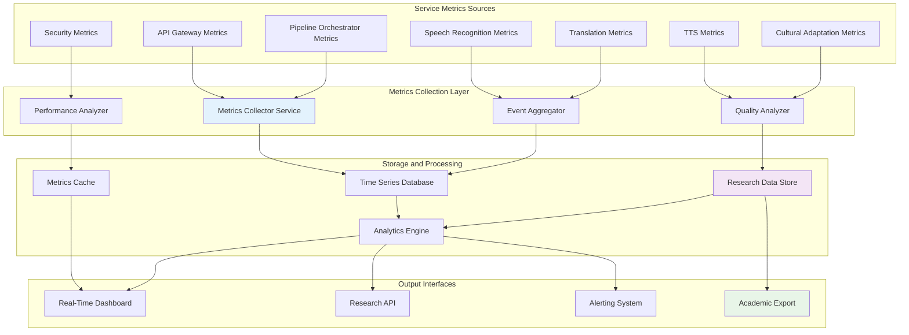
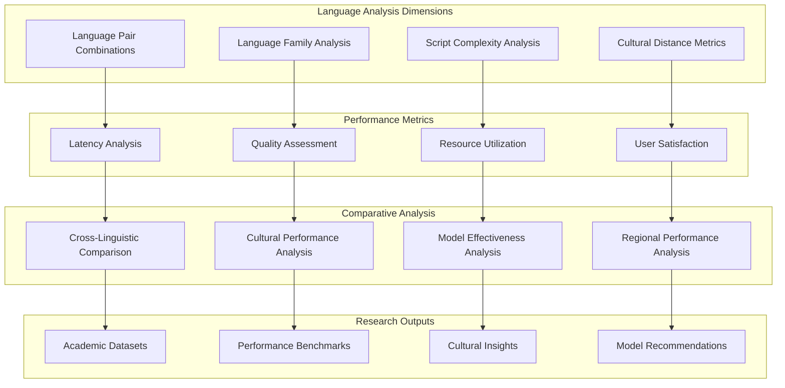
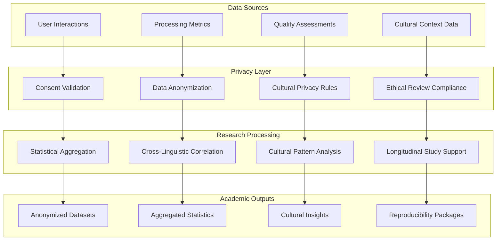
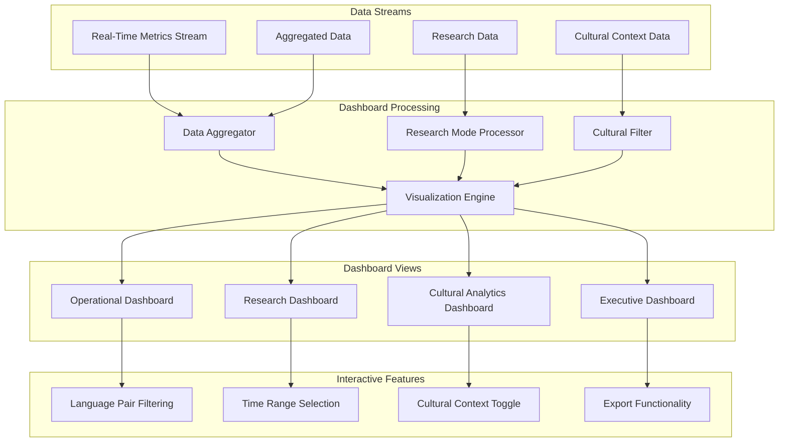
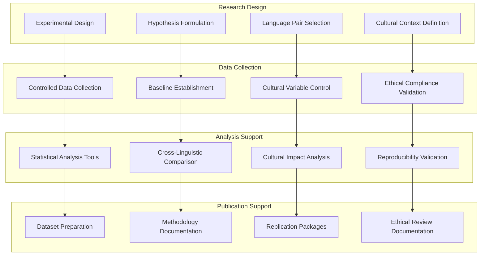
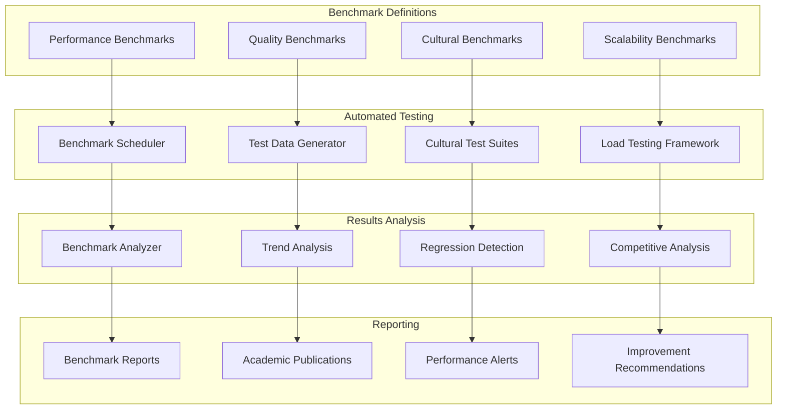
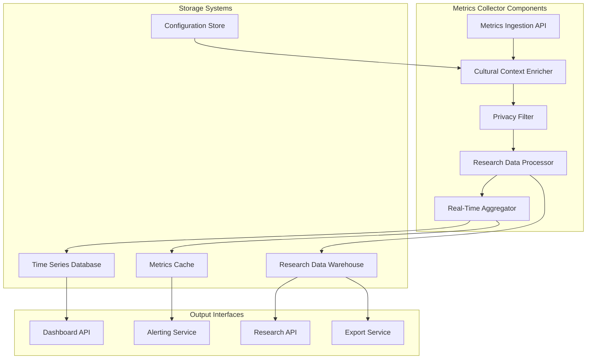

# Metrics Collection and Research Data Workflows
## Universal Speech Translation Platform

> **Research Excellence**: This document defines comprehensive workflows for metrics collection, cross-linguistic performance analysis, and academic research data aggregation that enable both operational excellence and groundbreaking multilingual research.

## Overview

This document outlines the complete metrics collection and research data architecture for the Universal Speech Translation Platform, focusing on comprehensive metrics aggregation from all services, cross-linguistic performance analysis, research data collection with privacy compliance, and real-time dashboard integration. The framework supports both operational monitoring and academic research requirements while maintaining strict privacy and cultural sensitivity standards.

### Metrics Architecture Principles

- **Academic Research Support**: Enable reproducible research across multiple languages and cultural contexts
- **Privacy-First Data Collection**: Collect research data while respecting cultural privacy requirements
- **Cross-Linguistic Analysis**: Enable comparative studies across language families and processing approaches
- **Real-Time Observability**: Provide immediate insights into system performance and quality
- **Cultural Context Awareness**: Include cultural and linguistic context in all metrics and analysis

## Comprehensive Metrics Aggregation Workflows

### Multi-Service Metrics Collection Architecture



### Metrics Collection Workflow

**Purpose**: Collect comprehensive metrics from all platform services with cultural context

**Implementation Steps**:

1. **Service Metrics Generation**
   ```mermaid
   sequenceDiagram
       participant Service as Any Platform Service
       participant MetricsLib as Metrics Library
       participant MetricsCollector as Metrics Collector
       participant CulturalContext as Cultural Context
       
       Service->>MetricsLib: Generate Metric Event
       MetricsLib->>CulturalContext: Add Cultural Context
       CulturalContext-->>MetricsLib: Cultural Metadata
       MetricsLib->>MetricsCollector: Send Enriched Metric
       MetricsCollector->>MetricsCollector: Validate & Store
       MetricsCollector-->>Service: Acknowledgment
   ```

2. **Metric Event Structure**
   ```json
   {
     "metric_id": "uuid",
     "timestamp": "2025-09-15T20:30:00Z",
     "service": "translation-service",
     "metric_type": "performance",
     "metric_name": "translation_latency",
     "value": 1.23,
     "unit": "seconds",
     "language_context": {
       "source_language": "da",
       "target_language": "en",
       "language_family": "Germanic",
       "script_complexity": "simple",
       "cultural_region": "Nordic"
     },
     "processing_context": {
       "model_used": "nllb-200-3.3B",
       "quality_score": 0.92,
       "processing_mode": "realtime",
       "user_consent_level": "standard"
     },
     "correlation_id": "request_uuid",
     "session_id": "session_uuid",
     "quality_metrics": {
       "bleu_score": 0.87,
       "cultural_appropriateness": 0.94,
       "semantic_similarity": 0.91
     }
   }
   ```

3. **Cultural Context Enrichment**
   - **Language Classification**: Automatic classification of language pairs and families
   - **Cultural Context Addition**: Addition of cultural and regional context to metrics
   - **Privacy Level Tagging**: Tagging metrics based on user consent and privacy requirements
   - **Research Consent Integration**: Separate handling based on research participation consent

## Cross-Linguistic Performance Analysis

### Language Pair Performance Matrix

**Purpose**: Enable comparative analysis across different language combinations and cultural contexts

**Analysis Architecture**:



### Cross-Linguistic Analysis Workflow

1. **Language Pair Performance Comparison**
   ```mermaid
   flowchart TD
       MetricsCollection[Metrics Collection] --> LanguageGrouping{Group by Language Pair}
       
       LanguageGrouping -->|Germanic Languages| GermanicAnalysis[Germanic Language Analysis]
       LanguageGrouping -->|Romance Languages| RomanceAnalysis[Romance Language Analysis]
       LanguageGrouping -->|Sino-Tibetan Languages| SinoTibetanAnalysis[Sino-Tibetan Analysis]
       LanguageGrouping -->|Cross-Family Pairs| CrossFamilyAnalysis[Cross-Family Analysis]
       
       GermanicAnalysis --> PerformanceComparison[Performance Comparison]
       RomanceAnalysis --> PerformanceComparison
       SinoTibetanAnalysis --> PerformanceComparison
       CrossFamilyAnalysis --> PerformanceComparison
       
       PerformanceComparison --> CulturalContextAnalysis[Cultural Context Analysis]
       CulturalContextAnalysis --> ResearchInsights[Research Insights]
   ```

2. **Cultural Performance Analysis**
   - **Cultural Distance Impact**: Analysis of how cultural distance affects translation quality
   - **Regional Performance Variations**: Performance differences across cultural regions
   - **Cultural Context Preservation**: Measurement of cultural context preservation in translations
   - **Bias Detection Across Cultures**: Detection of cultural biases in translation quality

## Research Data Collection Workflows

### Privacy-Compliant Research Data Pipeline

**Purpose**: Collect comprehensive research data while maintaining strict privacy compliance

**Research Data Architecture**:



### Research Data Collection Workflow

1. **Consent-Based Data Collection**
   ```mermaid
   sequenceDiagram
       participant User
       participant ConsentManager
       participant DataCollector
       participant ResearchDB
       participant PrivacyValidator
       
       User->>ConsentManager: Research Participation Consent
       ConsentManager->>PrivacyValidator: Validate Cultural Privacy Requirements
       PrivacyValidator-->>ConsentManager: Privacy Compliance Rules
       ConsentManager->>DataCollector: Configure Collection Parameters
       DataCollector->>ResearchDB: Store Anonymized Research Data
       ResearchDB-->>DataCollector: Storage Confirmation
       DataCollector-->>User: Data Contribution Acknowledgment
   ```

2. **Research Data Categories**
   
   **Performance Research Data**:
   ```json
   {
     "research_data": {
       "data_type": "performance_metrics",
       "collection_timestamp": "2025-09-15T20:30:00Z",
       "anonymized_session_id": "hash_uuid",
       "language_context": {
         "source_language_family": "Germanic",
         "target_language_family": "Romance",
         "script_complexity_source": "simple",
         "script_complexity_target": "simple",
         "cultural_distance_score": 0.3
       },
       "performance_metrics": {
         "end_to_end_latency": 2.1,
         "processing_stage_latencies": {
           "speech_recognition": 0.8,
           "translation": 1.0,
           "text_to_speech": 0.3
         },
         "quality_scores": {
           "overall_quality": 0.89,
           "cultural_appropriateness": 0.92,
           "semantic_accuracy": 0.87
         }
       },
       "model_information": {
         "asr_model_category": "large_multilingual",
         "translation_model_category": "neural_machine_translation",
         "tts_model_category": "neural_synthesis"
       },
       "consent_level": "full_research_participation"
     }
   }
   ```

3. **Cultural Context Research Data**
   - **Cultural Adaptation Effectiveness**: Metrics on cultural adaptation success
   - **Cross-Cultural Communication Quality**: Quality of cross-cultural communication
   - **Regional Language Variations**: Performance across regional language variants
   - **Cultural Bias Measurements**: Quantitative measurements of cultural bias

## Real-Time Dashboard Integration

### Multi-Dimensional Dashboard Architecture

**Purpose**: Provide real-time insights across operational, research, and cultural dimensions

**Dashboard Integration Workflow**:



### Dashboard Implementation Workflow

1. **Real-Time Data Processing**
   ```mermaid
   sequenceDiagram
       participant MetricsService
       participant DashboardProcessor
       participant WebSocketServer
       participant Dashboard
       participant User
       
       MetricsService->>DashboardProcessor: New Metrics Data
       DashboardProcessor->>DashboardProcessor: Process & Aggregate
       DashboardProcessor->>WebSocketServer: Processed Data
       WebSocketServer->>Dashboard: Real-Time Update
       Dashboard->>User: Visual Update
       User->>Dashboard: Filter/Drill-Down Request
       Dashboard->>DashboardProcessor: Query Request
       DashboardProcessor-->>Dashboard: Filtered Data
   ```

2. **Dashboard Views and Features**

   **Operational Dashboard**:
   - **Real-Time Performance Metrics**: Current system performance across all language pairs
   - **Service Health Status**: Health status of all platform services
   - **Quality Monitoring**: Real-time quality metrics and alerts
   - **Resource Utilization**: Current resource usage and scaling status

   **Research Dashboard**:
   - **Cross-Linguistic Performance**: Comparative performance across language pairs
   - **Cultural Context Analysis**: Cultural adaptation and bias metrics
   - **Model Effectiveness**: Performance comparison across different models
   - **Academic Data Export**: Tools for exporting research-ready datasets

   **Cultural Analytics Dashboard**:
   - **Cultural Adaptation Success**: Effectiveness of cultural adaptation across languages
   - **Bias Detection Results**: Real-time bias detection and mitigation metrics
   - **Regional Performance**: Performance variations across cultural regions
   - **Cultural Context Preservation**: Metrics on cultural context preservation

## Academic Research Support Workflows

### Reproducible Research Framework

**Purpose**: Support reproducible academic research across multiple dimensions of multilingual processing

**Research Support Architecture**:



### Academic Research Workflow

1. **Experimental Setup and Configuration**
   ```mermaid
   flowchart TD
       ResearchQuestion[Research Question] --> ExperimentalDesign[Experimental Design]
       ExperimentalDesign --> LanguageSelection{Language Pair Selection}
       
       LanguageSelection -->|Single Language Family| MonoFamilyStudy[Mono-Family Study]
       LanguageSelection -->|Cross Language Family| CrossFamilyStudy[Cross-Family Study]
       LanguageSelection -->|Cultural Focus| CulturalStudy[Cultural Study]
       
       MonoFamilyStudy --> DataCollectionSetup[Data Collection Setup]
       CrossFamilyStudy --> DataCollectionSetup
       CulturalStudy --> DataCollectionSetup
       
       DataCollectionSetup --> EthicalReview[Ethical Review Compliance]
       EthicalReview --> ResearchExecution[Research Execution]
   ```

2. **Academic Data Export Formats**
   
   **Statistical Analysis Ready Format**:
   ```json
   {
     "academic_dataset": {
       "study_id": "cross_linguistic_study_2025",
       "dataset_version": "1.0",
       "collection_period": {
         "start": "2025-09-01T00:00:00Z",
         "end": "2025-09-30T23:59:59Z"
       },
       "language_pairs": [
         {
           "source_language": "da",
           "target_language": "en",
           "language_family_pair": "Germanic-Germanic",
           "cultural_distance": 0.2,
           "sample_size": 1000
         }
       ],
       "aggregated_metrics": {
         "mean_latency": 2.1,
         "latency_std_dev": 0.3,
         "mean_quality_score": 0.89,
         "quality_std_dev": 0.05,
         "cultural_appropriateness_mean": 0.92
       },
       "statistical_metadata": {
         "confidence_interval": 0.95,
         "p_value_threshold": 0.05,
         "effect_size_measure": "cohen_d",
         "multiple_testing_correction": "bonferroni"
       },
       "ethical_compliance": {
         "irb_approval": "IRB-2025-091",
         "consent_type": "informed_opt_in",
         "data_anonymization": "full",
         "cultural_sensitivity_review": "completed"
       }
     }
   }
   ```

## Performance Benchmarking Workflows

### Automated Benchmarking System

**Purpose**: Provide automated, continuous benchmarking across languages and cultural contexts

**Benchmarking Architecture**:



### Benchmark Implementation Workflow

1. **Continuous Benchmarking Process**
   ```mermaid
   sequenceDiagram
       participant Scheduler
       participant BenchmarkExecutor
       participant Platform
       participant Analyzer
       participant ReportGenerator
       
       Scheduler->>BenchmarkExecutor: Trigger Benchmark
       BenchmarkExecutor->>Platform: Execute Test Suite
       Platform-->>BenchmarkExecutor: Results
       BenchmarkExecutor->>Analyzer: Analyze Results
       Analyzer->>Analyzer: Compare with Baselines
       Analyzer-->>ReportGenerator: Analysis Results
       ReportGenerator-->>Scheduler: Benchmark Report
   ```

2. **Cultural Benchmarking Criteria**
   - **Cultural Context Preservation**: Measurement of cultural context preservation accuracy
   - **Regional Adaptation Quality**: Quality of regional language adaptations
   - **Cultural Bias Metrics**: Quantitative measurements of cultural bias in outputs
   - **Cross-Cultural Communication Effectiveness**: Effectiveness of cross-cultural communication facilitation

## Implementation Guidelines

### Metrics Collector Service Architecture



### Deployment and Integration Considerations

1. **Privacy and Compliance Integration**
   - **GDPR Compliance**: Full compliance with European privacy regulations
   - **Cultural Privacy Respect**: Respect for diverse cultural privacy requirements
   - **Research Ethics Compliance**: Integration with institutional review board requirements
   - **Data Minimization**: Collection of only necessary data for research and operations

2. **Performance and Scalability**
   - **High-Throughput Processing**: Support for high-volume metrics collection
   - **Real-Time Processing**: Sub-second processing for dashboard updates
   - **Cross-Linguistic Scalability**: Scalable processing across multiple language pairs
   - **Cultural Context Processing**: Efficient processing of cultural context metadata

---

**Navigation**: [← Security Authentication Flows](security-authentication-flows.md) | [Cultural Adaptation Flows →](cultural-adaptation-flows.md)  
**Related Workflows**: Performance Monitoring, Cross-Linguistic Processing, Error Handling  
**Implementation Priority**: High - Required for research objectives and operational excellence  
**Academic Context**: Enables reproducible multilingual research and comparative studies  
**Last Updated**: September 2025