# Microservice Independence Architecture Documentation
## Universal Speech Translation Platform

> **Complete Service Autonomy**: This document provides comprehensive architecture documentation for service autonomy patterns, zero shared dependencies, and independent deployment workflows, demonstrating how services operate independently while maintaining coordination through event-driven communication.

## Overview

The Universal Speech Translation Platform implements a truly independent microservices architecture where each service operates with complete autonomy, zero shared dependencies, and isolated fault domains. This document details the architectural patterns and workflows that enable service independence while maintaining sophisticated coordination for complex speech translation processing.

### Independence Architecture Principles

- **Complete Service Autonomy**: Each service contains all required functionality with no external dependencies
- **Zero Shared Dependencies**: Services never import from other services or share libraries
- **Independent Deployment**: Services can be deployed, scaled, and maintained independently
- **Isolated Fault Domains**: Service failures are completely contained with no cascade effects
- **Event-Driven Coordination**: Services communicate exclusively through language-agnostic events

## Service Independence Architecture

### Independent Service Boundary Definition

```mermaid
graph TB
    subgraph "API Gateway Service (Completely Independent)"
        AGS[API Gateway Service]
        AGS --> AGAPI[Own API Layer]
        AGS --> AGConfig[Own Configuration]
        AGS --> AGAuth[Own Authentication]
        AGS --> AGValid[Own Validation]
        AGS --> AGRoute[Own Routing Logic]
        AGS --> AGCache[Own Caching]
        AGS --> AGLog[Own Logging]
        AGS --> AGMetrics[Own Metrics]
    end
    
    subgraph "Speech Recognition Service (Completely Independent)"
        SRS[Speech Recognition Service]
        SRS --> SRAPI[Own API Layer]
        SRS --> SRConfig[Own Configuration]
        SRS --> SRModels[Own AI Models]
        SRS --> SRProcessing[Own Processing]
        SRS --> SRCache[Own Caching]
        SRS --> SRLog[Own Logging]
        SRS --> SRMetrics[Own Metrics]
        SRS --> SRLang[Own Language Logic]
    end
    
    subgraph "Translation Service (Completely Independent)"
        TS[Translation Service]
        TS --> TAPI[Own API Layer]
        TS --> TConfig[Own Configuration]
        TS --> TModels[Own Translation Models]
        TS --> TProcessing[Own Processing]
        TS --> TCache[Own Caching]
        TS --> TLog[Own Logging]
        TS --> TMetrics[Own Metrics]
        TS --> TCultural[Own Cultural Logic]
    end
    
    subgraph "Event Bus (Infrastructure Only)"
        EB[Event Bus - Kafka]
        EB --> Topics[Language-Agnostic Topics]
        EB --> Schemas[Universal Event Schemas]
    end
    
    AGS -.->|Events Only| EB
    SRS -.->|Events Only| EB
    TS -.->|Events Only| EB
    
    style AGS fill:#e3f2fd
    style SRS fill:#e8f5e8
    style TS fill:#f3e5f5
    style EB fill:#fff3e0
```

### Service Self-Sufficiency Pattern

```mermaid
flowchart TD
    Service[Independent Microservice] --> SelfContained{Self-Contained?}
    SelfContained -->|Yes| IndependentComponents[Independent Components]
    SelfContained -->|No| AddDependencies[Add Required Dependencies]
    AddDependencies --> Service
    
    IndependentComponents --> API[Own API Layer]
    IndependentComponents --> Config[Own Configuration Management]
    IndependentComponents --> Processing[Own Business Logic]
    IndependentComponents --> Storage[Own Data Management]
    IndependentComponents --> Monitoring[Own Observability]
    IndependentComponents --> Models[Own AI/ML Models]
    
    API --> HTTPEndpoints[HTTP/REST Endpoints]
    API --> WebSocketHandlers[WebSocket Handlers]
    API --> InputValidation[Input Validation]
    API --> OutputFormatting[Output Formatting]
    
    Config --> EnvironmentConfig[Environment Configuration]
    Config --> LanguageConfig[Language Configuration]
    Config --> ModelConfig[Model Configuration]
    Config --> QualityConfig[Quality Thresholds]
    
    Processing --> CoreLogic[Core Processing Logic]
    Processing --> LanguageProcessing[Language-Specific Processing]
    Processing --> QualityAssessment[Quality Assessment]
    Processing --> ErrorHandling[Error Handling]
    
    Storage --> CacheManagement[Cache Management]
    Storage --> StateManagement[State Management]
    Storage --> ModelStorage[Model Storage]
    Storage --> ConfigStorage[Configuration Storage]
    
    Monitoring --> Metrics[Metrics Collection]
    Monitoring --> Logging[Structured Logging]
    Monitoring --> HealthChecks[Health Monitoring]
    Monitoring --> Tracing[Distributed Tracing]
    
    Models --> ModelLoading[Model Loading]
    Models --> ModelCaching[Model Caching]
    Models --> ModelVersioning[Model Versioning]
    Models --> ModelSelection[Dynamic Model Selection]
    
    style Service fill:#e1f5fe
    style IndependentComponents fill:#e8f5e8
    style AddDependencies fill:#ffebee
```

## Zero Shared Dependencies Architecture

### Dependency Isolation Pattern

```mermaid
graph TD
    subgraph "Traditional Microservices (Avoided Pattern)"
        TMS1[Service A]
        TMS2[Service B]
        TMS3[Service C]
        SharedLib[Shared Library]
        SharedDB[Shared Database]
        SharedConfig[Shared Configuration]
        
        TMS1 --> SharedLib
        TMS2 --> SharedLib
        TMS3 --> SharedLib
        TMS1 --> SharedDB
        TMS2 --> SharedDB
        TMS1 --> SharedConfig
        TMS2 --> SharedConfig
        TMS3 --> SharedConfig
    end
    
    subgraph "Universal Speech Platform (Implemented Pattern)"
        IMS1[Speech Recognition Service]
        IMS2[Translation Service]
        IMS3[TTS Service]
        IMS4[API Gateway Service]
        
        IMS1 --> OwnLib1[Own Complete Library Set]
        IMS2 --> OwnLib2[Own Complete Library Set]
        IMS3 --> OwnLib3[Own Complete Library Set]
        IMS4 --> OwnLib4[Own Complete Library Set]
        
        IMS1 --> OwnCache1[Own Cache/Storage]
        IMS2 --> OwnCache2[Own Cache/Storage]
        IMS3 --> OwnCache3[Own Cache/Storage]
        IMS4 --> OwnCache4[Own Cache/Storage]
        
        IMS1 --> OwnConfig1[Own Configuration]
        IMS2 --> OwnConfig2[Own Configuration]
        IMS3 --> OwnConfig3[Own Configuration]
        IMS4 --> OwnConfig4[Own Configuration]
    end
    
    subgraph "Event-Only Communication"
        EventBus[Event Bus - Kafka]
        IMS1 -.->|Language-Agnostic Events| EventBus
        IMS2 -.->|Language-Agnostic Events| EventBus
        IMS3 -.->|Language-Agnostic Events| EventBus
        IMS4 -.->|Language-Agnostic Events| EventBus
    end
    
    style TMS1 fill:#ffcdd2
    style TMS2 fill:#ffcdd2
    style TMS3 fill:#ffcdd2
    style SharedLib fill:#ffebee
    style SharedDB fill:#ffebee
    style SharedConfig fill:#ffebee
    
    style IMS1 fill:#e8f5e8
    style IMS2 fill:#e8f5e8
    style IMS3 fill:#e8f5e8
    style IMS4 fill:#e8f5e8
```

### Service-Specific Dependency Management

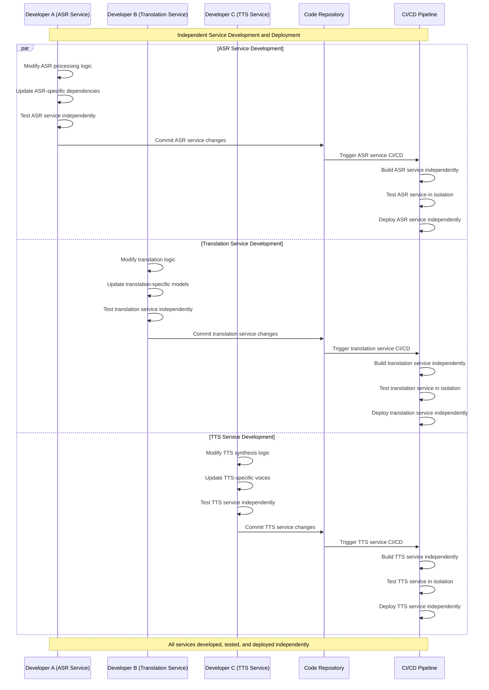

## Independent Deployment Architecture

### Service Deployment Independence Flow

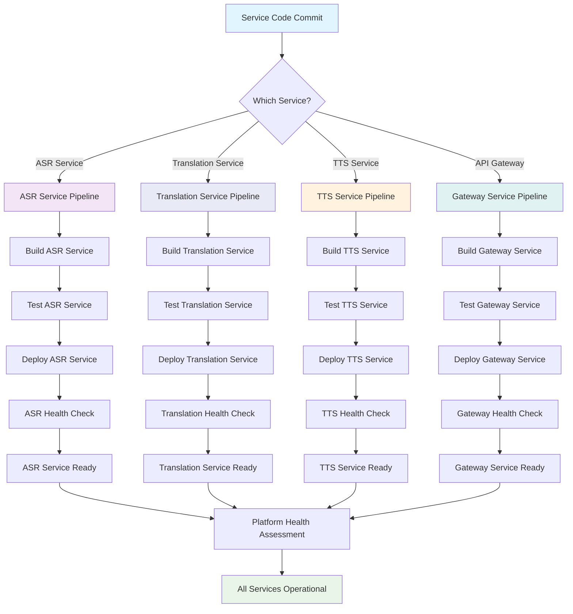

### Independent Scaling Architecture

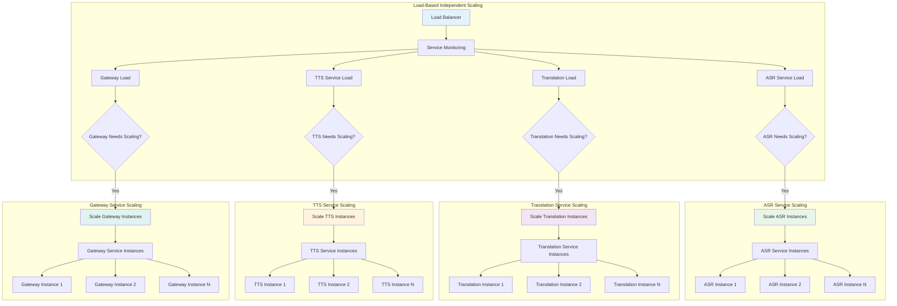

## Fault Isolation and Circuit Breaker Patterns

### Service Fault Isolation Architecture

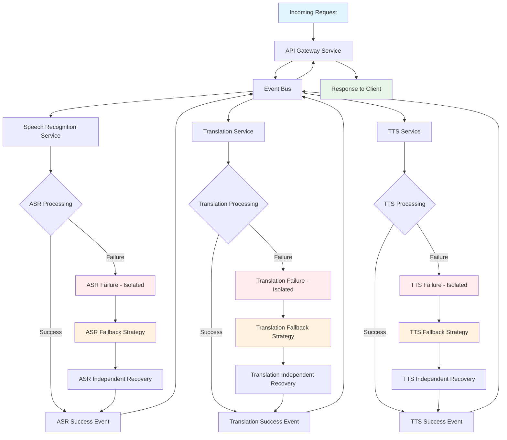

### Circuit Breaker Implementation Pattern

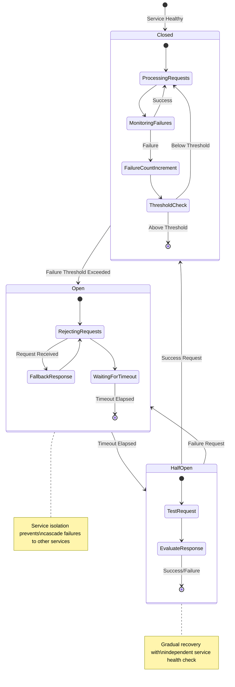

### Service Health Monitoring Independence

```mermaid
graph TD
    subgraph "Independent Service Health Monitoring"
        HSM[Health Status Monitor]
        HSM --> ASRHealth[ASR Service Health]
        HSM --> TransHealth[Translation Service Health]
        HSM --> TTSHealth[TTS Service Health]
        HSM --> GatewayHealth[Gateway Service Health]
    end
    
    subgraph "ASR Service Health Checks"
        ASRHealth --> ASREndpoint[Health Endpoint Check]
        ASRHealth --> ASRModel[Model Loading Check]
        ASRHealth --> ASRProcessing[Processing Capability Check]
        ASRHealth --> ASRMemory[Memory Usage Check]
        ASRHealth --> ASRCPU[CPU Usage Check]
        
        ASREndpoint --> ASRStatus1[Health Status]
        ASRModel --> ASRStatus1
        ASRProcessing --> ASRStatus1
        ASRMemory --> ASRStatus1
        ASRCPU --> ASRStatus1
    end
    
    subgraph "Translation Service Health Checks"
        TransHealth --> TransEndpoint[Health Endpoint Check]
        TransHealth --> TransModel[Model Loading Check]
        TransHealth --> TransProcessing[Translation Capability Check]
        TransHealth --> TransMemory[Memory Usage Check]
        TransHealth --> TransCPU[CPU Usage Check]
        
        TransEndpoint --> TransStatus[Health Status]
        TransModel --> TransStatus
        TransProcessing --> TransStatus
        TransMemory --> TransStatus
        TransCPU --> TransStatus
    end
    
    subgraph "TTS Service Health Checks"
        TTSHealth --> TTSEndpoint[Health Endpoint Check]
        TTSHealth --> TTSModel[Voice Model Check]
        TTSHealth --> TTSProcessing[Synthesis Capability Check]
        TTSHealth --> TTSMemory[Memory Usage Check]
        TTSHealth --> TTSCPU[CPU Usage Check]
        
        TTSEndpoint --> TTSStatus[Health Status]
        TTSModel --> TTSStatus
        TTSProcessing --> TTSStatus
        TTSMemory --> TTSStatus
        TTSCPU --> TTSStatus
    end
    
    subgraph "Gateway Service Health Checks"
        GatewayHealth --> GatewayEndpoint[Health Endpoint Check]
        GatewayHealth --> GatewayRouting[Routing Capability Check]
        GatewayHealth --> GatewayAuth[Authentication Check]
        GatewayHealth --> GatewayMemory[Memory Usage Check]
        GatewayHealth --> GatewayCPU[CPU Usage Check]
        
        GatewayEndpoint --> GatewayStatus[Health Status]
        GatewayRouting --> GatewayStatus
        GatewayAuth --> GatewayStatus
        GatewayMemory --> GatewayStatus
        GatewayCPU --> GatewayStatus
    end
    
    ASRStatus1 --> OverallHealth[Overall Platform Health]
    TransStatus --> OverallHealth
    TTSStatus --> OverallHealth
    GatewayStatus --> OverallHealth
    
    OverallHealth --> HealthDashboard[Health Dashboard]
    OverallHealth --> AlertSystem[Alert System]
    
    style HSM fill:#e3f2fd
    style OverallHealth fill:#e8f5e8
    style ASRStatus1 fill:#f3e5f5
    style TransStatus fill:#f3e5f5
    style TTSStatus fill:#f3e5f5
    style GatewayStatus fill:#f3e5f5
```

## Service Communication Through Events Only

### Event-Driven Service Coordination

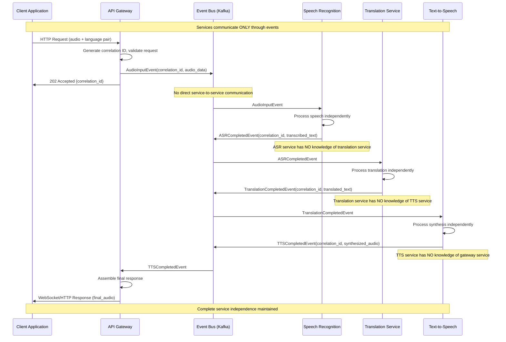

### Service Independence Validation Workflow

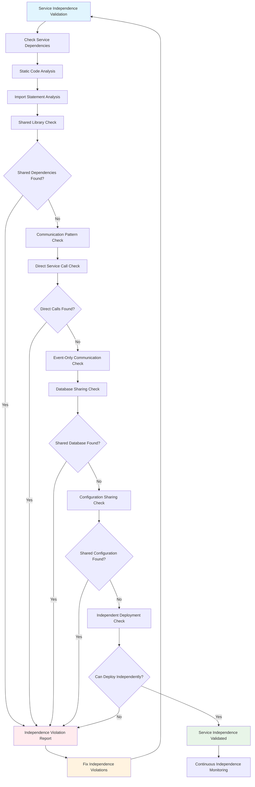

## Resource Independence and Management

### Independent Resource Allocation

```mermaid
graph TB
    subgraph "Resource Independence Architecture"
        RA[Resource Allocator]
        RA --> ASRResources[ASR Service Resources]
        RA --> TransResources[Translation Service Resources]
        RA --> TTSResources[TTS Service Resources]
        RA --> GatewayResources[Gateway Service Resources]
    end
    
    subgraph "ASR Service Resource Management"
        ASRResources --> ASRCPU[Dedicated CPU Allocation]
        ASRResources --> ASRMemory[Dedicated Memory Pool]
        ASRResources --> ASRGPU[GPU Resource Allocation]
        ASRResources --> ASRStorage[Model Storage Space]
        ASRResources --> ASRNetwork[Network Bandwidth]
        
        ASRCPU --> ASRMonitoring[ASR Resource Monitoring]
        ASRMemory --> ASRMonitoring
        ASRGPU --> ASRMonitoring
        ASRStorage --> ASRMonitoring
        ASRNetwork --> ASRMonitoring
    end
    
    subgraph "Translation Service Resource Management"
        TransResources --> TransCPU[Dedicated CPU Allocation]
        TransResources --> TransMemory[Dedicated Memory Pool]
        TransResources --> TransGPU[GPU Resource Allocation]
        TransResources --> TransStorage[Model Storage Space]
        TransResources --> TransNetwork[Network Bandwidth]
        
        TransCPU --> TransMonitoring[Translation Resource Monitoring]
        TransMemory --> TransMonitoring
        TransGPU --> TransMonitoring
        TransStorage --> TransMonitoring
        TransNetwork --> TransMonitoring
    end
    
    subgraph "TTS Service Resource Management"
        TTSResources --> TTSCPU[Dedicated CPU Allocation]
        TTSResources --> TTSMemory[Dedicated Memory Pool]
        TTSResources --> TTSGPU[GPU Resource Allocation]
        TTSResources --> TTSStorage[Voice Model Storage]
        TTSResources --> TTSNetwork[Network Bandwidth]
        
        TTSCPU --> TTSMonitoring[TTS Resource Monitoring]
        TTSMemory --> TTSMonitoring
        TTSGPU --> TTSMonitoring
        TTSStorage --> TTSMonitoring
        TTSNetwork --> TTSMonitoring
    end
    
    subgraph "Gateway Service Resource Management"
        GatewayResources --> GatewayCPU[Dedicated CPU Allocation]
        GatewayResources --> GatewayMemory[Dedicated Memory Pool]
        GatewayResources --> GatewayStorage[Session Storage Space]
        GatewayResources --> GatewayNetwork[Network Bandwidth]
        
        GatewayCPU --> GatewayMonitoring[Gateway Resource Monitoring]
        GatewayMemory --> GatewayMonitoring
        GatewayStorage --> GatewayMonitoring
        GatewayNetwork --> GatewayMonitoring
    end
    
    ASRMonitoring --> ResourceOptimization[Independent Resource Optimization]
    TransMonitoring --> ResourceOptimization
    TTSMonitoring --> ResourceOptimization
    GatewayMonitoring --> ResourceOptimization
    
    style RA fill:#e3f2fd
    style ResourceOptimization fill:#e8f5e8
    style ASRMonitoring fill:#f3e5f5
    style TransMonitoring fill:#f3e5f5
    style TTSMonitoring fill:#f3e5f5
    style GatewayMonitoring fill:#f3e5f5
```

## Service Development Independence

### Independent Development Workflow

```yaml
# Service Development Independence Configuration
service_independence:
  development:
    isolated_codebases: true
    independent_repositories: false  # Monorepo with service boundaries
    service_boundaries:
      - path: "services/api-gateway/"
        team: "gateway-team"
        technologies: ["Python", "FastAPI", "Redis"]
        dependencies: ["fastapi", "redis", "uvicorn"]
        no_shared_dependencies: true
        
      - path: "services/speech-recognition-service/"
        team: "asr-team"
        technologies: ["Python", "PyTorch", "Whisper"]
        dependencies: ["torch", "whisper", "librosa"]
        no_shared_dependencies: true
        
      - path: "services/translation-service/"
        team: "translation-team"
        technologies: ["Python", "Transformers", "NLLB"]
        dependencies: ["transformers", "torch", "sentencepiece"]
        no_shared_dependencies: true
        
      - path: "services/text-to-speech-service/"
        team: "tts-team"
        technologies: ["Python", "PyTorch", "TTS"]
        dependencies: ["torch", "TTS", "soundfile"]
        no_shared_dependencies: true
        
  deployment:
    independent_containers: true
    independent_scaling: true
    independent_health_checks: true
    independent_monitoring: true
    
  communication:
    direct_calls: false
    shared_databases: false
    shared_caches: false
    event_driven_only: true
    
  testing:
    independent_test_suites: true
    isolated_test_environments: true
    service_contract_testing: true
    integration_testing_via_events: true
    
  monitoring:
    service_specific_metrics: true
    independent_alerting: true
    distributed_tracing: true
    correlation_id_tracking: true
```

This comprehensive microservice independence documentation demonstrates the platform's complete service autonomy while maintaining sophisticated coordination through event-driven architecture, directly supporting the academic research objectives of truly independent distributed AI systems.

---

**Independence Standards**: All services maintain complete autonomy with zero shared dependencies  
**Academic Context**: Service independence supports thesis research on autonomous distributed systems  
**Maintenance**: Independence patterns continuously monitored and validated  
**Last Updated**: September 2025