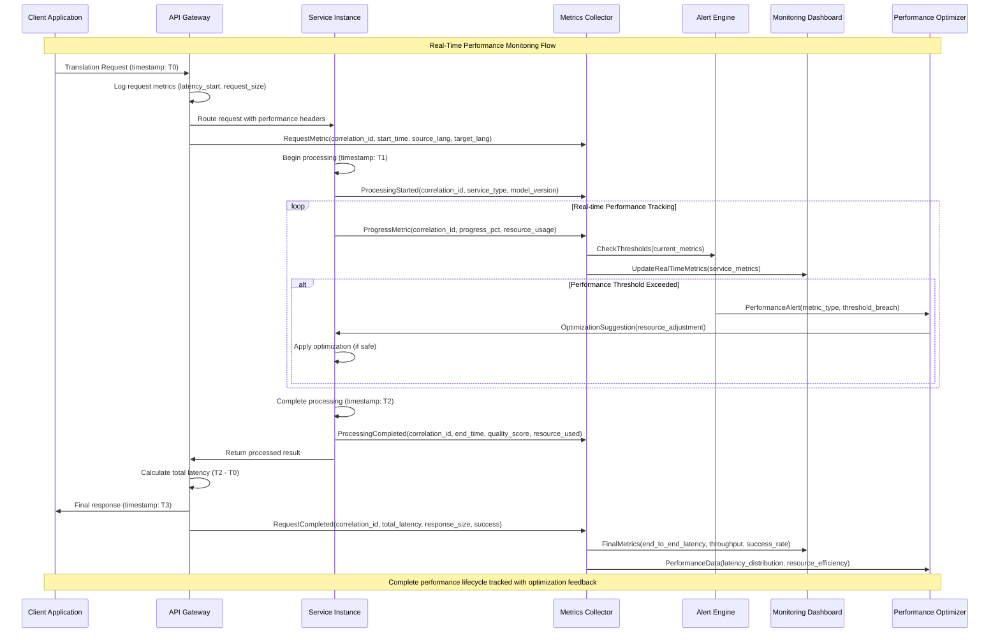
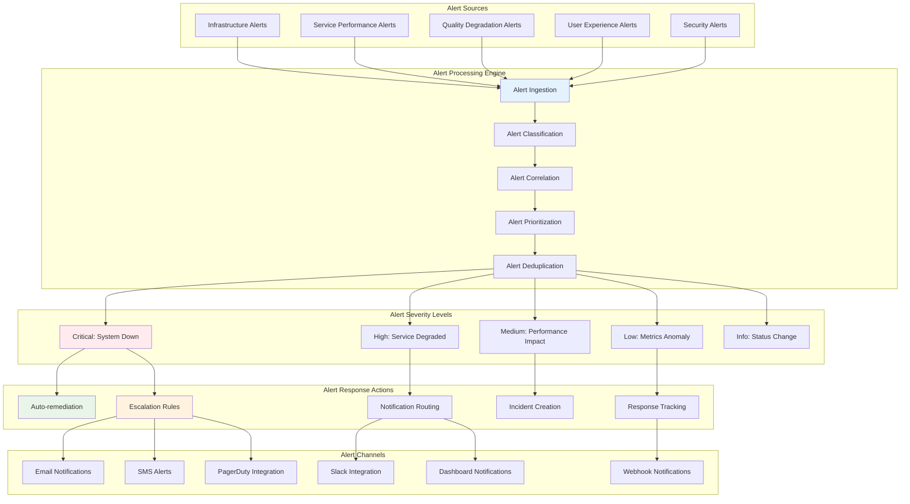
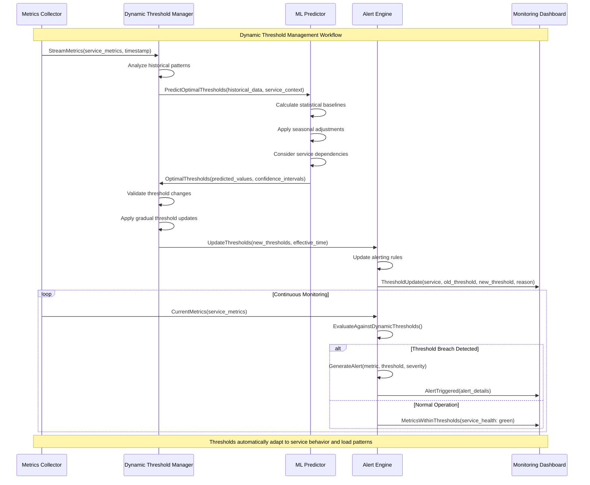
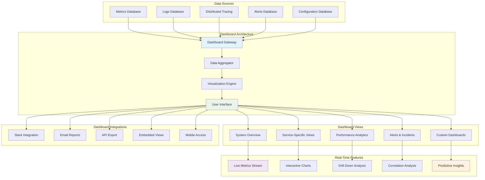
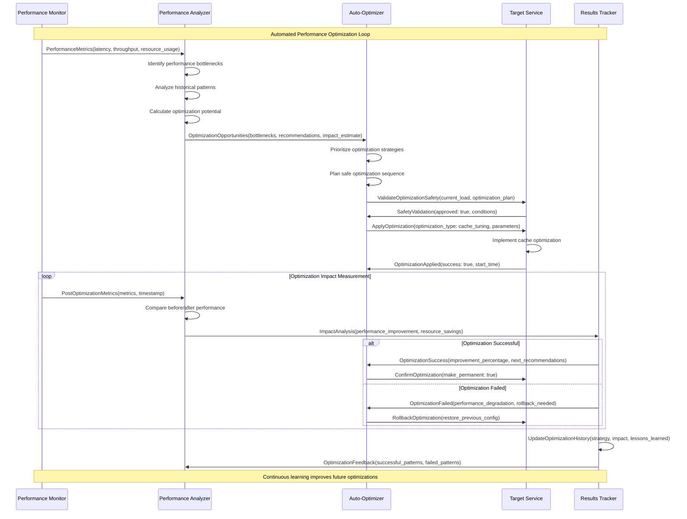
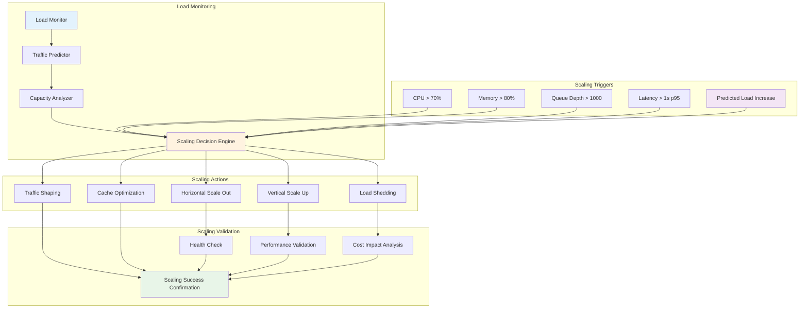
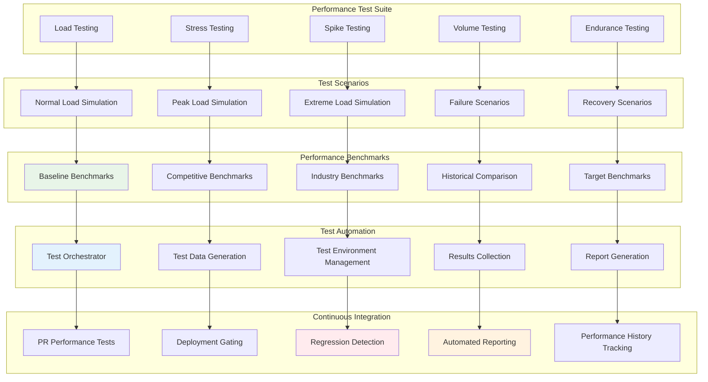

# Performance and Monitoring Workflow Documentation
## Universal Speech Translation Platform

> **Observability Excellence**: This document provides comprehensive performance and monitoring workflow documentation including real-time metrics collection, alerting thresholds, dashboard integration patterns, and observability workflows that ensure optimal system performance and proactive issue resolution.

## Overview

The Universal Speech Translation Platform implements sophisticated performance monitoring and observability workflows that ensure optimal system performance, proactive issue detection, and continuous optimization. This documentation details the comprehensive monitoring architecture that provides real-time visibility into system behavior, performance metrics, and operational health.

### Performance Monitoring Principles

- **Real-Time Observability**: Continuous real-time monitoring with millisecond-level granularity
- **Proactive Alerting**: Predictive and threshold-based alerting before issues impact users
- **Comprehensive Metrics**: Full-stack monitoring from infrastructure to application-level metrics
- **Performance Optimization**: Continuous performance analysis and automated optimization
- **Data-Driven Decisions**: Metrics-driven capacity planning and performance tuning

## Performance Metrics Architecture

### Metrics Collection Hierarchy

```mermaid
graph TB
    subgraph "Infrastructure Metrics"
        CPUMetrics[CPU Utilization]
        MemoryMetrics[Memory Usage]
        DiskMetrics[Disk I/O & Storage]
        NetworkMetrics[Network Throughput]
        ContainerMetrics[Container Resources]
    end
    
    subgraph "Service-Level Metrics"
        ASRMetrics[ASR Processing Metrics]
        TranslationMetrics[Translation Quality Metrics]
        TTSMetrics[TTS Generation Metrics]
        APIMetrics[API Gateway Metrics]
        EventMetrics[Event Bus Metrics]
    end
    
    subgraph "Business-Level Metrics"
        WorkflowMetrics[End-to-End Workflow Metrics]
        QualityMetrics[Translation Quality Scores]
        UserExperienceMetrics[User Experience Metrics]
        PerformanceKPIs[Performance KPIs]
        LanguageMetrics[Language-Specific Metrics]
    end
    
    subgraph "Metrics Collection Infrastructure"
        MetricsCollector[Metrics Collector]
        MetricsAggregator[Metrics Aggregator]
        TimeSeriesDB[Time Series Database]
        MetricsStream[Real-time Metrics Stream]
    end
    
    CPUMetrics --> MetricsCollector
    MemoryMetrics --> MetricsCollector
    DiskMetrics --> MetricsCollector
    NetworkMetrics --> MetricsCollector
    ContainerMetrics --> MetricsCollector
    
    ASRMetrics --> MetricsCollector
    TranslationMetrics --> MetricsCollector
    TTSMetrics --> MetricsCollector
    APIMetrics --> MetricsCollector
    EventMetrics --> MetricsCollector
    
    WorkflowMetrics --> MetricsCollector
    QualityMetrics --> MetricsCollector
    UserExperienceMetrics --> MetricsCollector
    PerformanceKPIs --> MetricsCollector
    LanguageMetrics --> MetricsCollector
    
    MetricsCollector --> MetricsAggregator
    MetricsAggregator --> TimeSeriesDB
    MetricsAggregator --> MetricsStream
    
    style MetricsCollector fill:#e3f2fd
    style TimeSeriesDB fill:#f3e5f5
    style MetricsStream fill:#e8f5e8
```



### Real-Time Performance Monitoring Workflow



## Service-Specific Performance Monitoring

### ASR Service Performance Monitoring

```mermaid
graph TB
    subgraph "ASR Performance Metrics"
        AudioProcessingTime[Audio Processing Time]
        ModelInferenceLatency[Model Inference Latency]
        TranscriptionAccuracy[Transcription Accuracy]
        ResourceUtilization[GPU/CPU Utilization]
        ModelLoadTime[Model Load Time]
        BatchProcessingEfficiency[Batch Processing Efficiency]
    end
    
    subgraph "ASR Quality Metrics"
        WordErrorRate[Word Error Rate (WER)]
        ConfidenceScores[Confidence Scores]
        LanguageDetectionAccuracy[Language Detection Accuracy]
        SpeakerSegmentation[Speaker Segmentation Quality]
        NoiseHandling[Background Noise Handling]
    end
    
    subgraph "ASR Operational Metrics"
        ThroughputRPS[Requests Per Second]
        ConcurrentProcessing[Concurrent Audio Streams]
        QueueDepth[Processing Queue Depth]
        ModelVersions[Active Model Versions]
        FailureRates[Processing Failure Rates]
    end
    
    subgraph "ASR Monitoring Actions"
        ModelOptimization[Model Optimization]
        ResourceScaling[Resource Auto-scaling]
        QualityTuning[Quality Threshold Tuning]
        AlertGeneration[Alert Generation]
        PerformanceDashboard[Performance Dashboard Update]
    end
    
    AudioProcessingTime --> ModelOptimization
    ModelInferenceLatency --> ResourceScaling
    TranscriptionAccuracy --> QualityTuning
    ResourceUtilization --> ResourceScaling
    
    WordErrorRate --> QualityTuning
    ConfidenceScores --> AlertGeneration
    LanguageDetectionAccuracy --> ModelOptimization
    
    ThroughputRPS --> ResourceScaling
    ConcurrentProcessing --> ResourceScaling
    QueueDepth --> AlertGeneration
    FailureRates --> AlertGeneration
    
    ModelOptimization --> PerformanceDashboard
    ResourceScaling --> PerformanceDashboard
    QualityTuning --> PerformanceDashboard
    AlertGeneration --> PerformanceDashboard
    
    style AudioProcessingTime fill:#e1f5fe
    style WordErrorRate fill:#f3e5f5
    style ThroughputRPS fill:#e8f5e8
    style PerformanceDashboard fill:#fff3e0
```

### Translation Service Performance Monitoring

```yaml
# Translation Service Performance Configuration
translation_performance_config:
  latency_metrics:
    target_p50_latency: "< 200ms"
    target_p95_latency: "< 800ms"
    target_p99_latency: "< 2000ms"
    timeout_threshold: "10000ms"
    
  quality_metrics:
    target_bleu_score: "> 0.4"
    target_comet_score: "> 0.7"
    target_chrf_score: "> 0.55"
    quality_threshold_alert: "< 0.3 BLEU"
    
  throughput_metrics:
    target_rps: "> 100"
    max_concurrent_translations: 500
    batch_size_optimization: "dynamic"
    queue_depth_alert_threshold: "> 1000"
    
  resource_metrics:
    cpu_utilization_target: "< 70%"
    memory_usage_target: "< 80%"
    gpu_utilization_target: "< 85%"
    model_cache_hit_rate: "> 90%"
    
  business_metrics:
    language_pair_performance: "track_all_pairs"
    domain_specific_quality: "track_by_domain"
    user_satisfaction_threshold: "> 4.0/5.0"
    cost_per_translation: "< $0.001"
```

### TTS Service Performance Monitoring

```mermaid
flowchart TD
    subgraph "TTS Performance Pipeline"
        TextInput[Text Input Analysis]
        VoiceSelection[Voice Model Selection]
        AudioGeneration[Audio Generation]
        QualityValidation[Quality Validation]
        AudioDelivery[Audio Delivery]
    end
    
    subgraph "Performance Metrics Collection"
        TextInput --> TextAnalysisMetrics[Text Analysis Metrics]
        VoiceSelection --> VoiceModelMetrics[Voice Model Performance]
        AudioGeneration --> AudioGenerationMetrics[Audio Generation Metrics]
        QualityValidation --> QualityMetrics[Audio Quality Metrics]
        AudioDelivery --> DeliveryMetrics[Delivery Performance]
    end
    
    subgraph "Metric Details"
        TextAnalysisMetrics --> TextComplexity[Text Complexity Score]
        TextAnalysisMetrics --> PreprocessingTime[Preprocessing Time]
        
        VoiceModelMetrics --> ModelLoadTime[Model Load Time]
        VoiceModelMetrics --> VoiceQuality[Voice Quality Score]
        
        AudioGenerationMetrics --> SynthesisLatency[Synthesis Latency]
        AudioGenerationMetrics --> RTF[Real-Time Factor]
        AudioGenerationMetrics --> ResourceUsage[Resource Usage]
        
        QualityMetrics --> AudioClarity[Audio Clarity Score]
        QualityMetrics --> Naturalness[Naturalness Rating]
        QualityMetrics --> Pronunciation[Pronunciation Accuracy]
        
        DeliveryMetrics --> CompressionRatio[Compression Efficiency]
        DeliveryMetrics --> StreamingLatency[Streaming Latency]
    end
    
    subgraph "Performance Optimization"
        OptimizationEngine[TTS Optimization Engine]
        TextComplexity --> OptimizationEngine
        ModelLoadTime --> OptimizationEngine
        SynthesisLatency --> OptimizationEngine
        AudioClarity --> OptimizationEngine
        
        OptimizationEngine --> ModelOptimization[Model Optimization]
        OptimizationEngine --> CacheOptimization[Cache Optimization]
        OptimizationEngine --> ResourceOptimization[Resource Optimization]
        OptimizationEngine --> QualityTuning[Quality Tuning]
    end
    
    style TextInput fill:#e3f2fd
    style AudioGeneration fill:#f3e5f5
    style OptimizationEngine fill:#e8f5e8
    style QualityValidation fill:#fff3e0
```



## Alerting and Threshold Management

### Intelligent Alerting System



### Dynamic Threshold Management



## Performance Dashboard Integration

### Comprehensive Monitoring Dashboard



### Performance Analytics and Reporting

```yaml
# Performance Analytics Configuration
analytics_config:
  reporting_intervals:
    real_time_updates: "1s"
    dashboard_refresh: "5s"
    hourly_reports: "60min"
    daily_summaries: "24h"
    weekly_trends: "7d"
    monthly_analysis: "30d"
    
  key_performance_indicators:
    availability:
      target: "> 99.95%"
      measurement: "uptime_percentage"
      alert_threshold: "< 99.9%"
    
    latency:
      target: "< 500ms p95"
      measurement: "end_to_end_latency"
      alert_threshold: "> 1000ms p95"
    
    throughput:
      target: "> 1000 RPS"
      measurement: "requests_per_second"
      alert_threshold: "< 500 RPS"
    
    quality:
      target: "> 0.4 BLEU score"
      measurement: "translation_quality"
      alert_threshold: "< 0.3 BLEU score"
    
    resource_efficiency:
      target: "< 70% CPU utilization"
      measurement: "average_cpu_usage"
      alert_threshold: "> 85% CPU utilization"
      
  automated_reports:
    performance_summary:
      frequency: "daily"
      recipients: ["team@example.com"]
      include_trends: true
      include_predictions: true
      
    capacity_planning:
      frequency: "weekly"
      recipients: ["capacity@example.com", "ops@example.com"]
      include_growth_projections: true
      include_scaling_recommendations: true
      
    quality_analysis:
      frequency: "daily"
      recipients: ["quality@example.com", "product@example.com"]
      include_language_breakdown: true
      include_improvement_suggestions: true
      
  dashboard_customization:
    role_based_views:
      engineering: ["system_metrics", "service_health", "error_rates"]
      operations: ["infrastructure", "alerts", "capacity"]
      product: ["user_metrics", "quality_scores", "business_kpis"]
      executive: ["availability", "performance_summary", "cost_metrics"]
```

## Performance Optimization Workflows

### Automated Performance Optimization



### Resource Scaling and Load Management



## Advanced Performance Analytics

### Machine Learning-Driven Performance Analysis

```yaml
# ML-Driven Performance Analytics Configuration
ml_performance_analytics:
  anomaly_detection:
    algorithms: ["isolation_forest", "one_class_svm", "lstm_autoencoder"]
    sensitivity: "medium"
    training_window: "30d"
    detection_threshold: "2_sigma"
    update_frequency: "daily"
    
  performance_prediction:
    prediction_horizon: "24h"
    features: ["historical_load", "time_of_day", "day_of_week", "seasonal_patterns"]
    model_type: "ensemble_regressor"
    accuracy_target: "> 85%"
    retraining_frequency: "weekly"
    
  capacity_forecasting:
    forecast_horizon: "90d"
    growth_factors: ["user_growth", "feature_expansion", "quality_improvements"]
    confidence_intervals: ["80%", "95%"]
    scenario_modeling: ["optimistic", "realistic", "pessimistic"]
    
  optimization_recommendations:
    recommendation_engine: "reinforcement_learning"
    action_space: ["scaling", "caching", "routing", "model_optimization"]
    reward_function: "weighted_performance_cost"
    exploration_rate: "10%"
    safety_constraints: "always_applied"
    
  pattern_recognition:
    workload_patterns:
      daily_cycles: "automatic_detection"
      weekly_patterns: "automatic_detection"
      seasonal_variations: "automatic_detection"
      event_driven_spikes: "automatic_detection"
    
    performance_patterns:
      degradation_predictors: ["resource_exhaustion", "model_drift", "data_skew"]
      optimization_opportunities: ["underutilized_resources", "cache_misses", "inefficient_routing"]
      failure_precursors: ["memory_leaks", "connection_exhaustion", "deadlocks"]
```

## Performance Testing and Benchmarking

### Continuous Performance Testing



This comprehensive performance and monitoring documentation provides the Universal Speech Translation Platform with complete observability, proactive optimization capabilities, and data-driven performance management that ensures optimal system performance and user experience.

---

**Performance Standards**: All monitoring follows real-time observability and proactive optimization principles  
**Academic Context**: Performance monitoring supports thesis research on observable distributed AI systems  
**Maintenance**: Performance metrics and thresholds updated automatically with system evolution  
**Last Updated**: September 2025