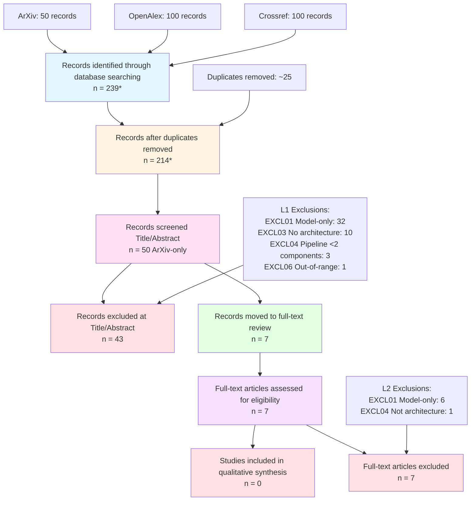

# Event-driven Microservice Architectures for Real-time Speech-to-Speech Translation: A Systematic Literature Review (2014–2025)

**Protocol Version:** 2.1 (Final)  
**Review Date:** December 20, 2025  
**Status:** Completed – Zero Studies Included

---

## Abstract

This systematic literature review (SLR) investigates the architectural principles, design patterns, and performance drivers of event-driven microservice architectures for real-time speech-to-speech translation (S2ST) systems covering the period 2014–2025. Following the SPIDER framework, the review aimed to identify reported architecture patterns, key latency/scalability/robustness factors, and evaluation methodologies for distributed pipelines integrating at least two of Automatic Speech Recognition (ASR), Machine Translation (MT), and Text-to-Speech (TTS). A comprehensive search of ArXiv, OpenAlex, and Crossref yielded 239 initial records, which were deduplicated to ~214 unique entries. Title/abstract screening was executed on a 50-record ArXiv subset; 43 records were excluded as model-only or non-architecture studies, and 7 records advanced to full-text screening. **Critical finding (screened subset):** After full-text assessment of all 7 UNSURE records, zero studies met the inclusion criteria. All were excluded for lacking distributed/event-driven/microservice architecture descriptions, focusing instead on model-level advances, on-device monolithic deployments, or algorithmic optimizations. This result suggests a strong evidence gap in the screened academic subset, and also indicates likely terminology/venue bias (systems-oriented architecture evidence may be published outside speech/NLP venues or appear as operational/industry literature rather than academic studies).

**Keywords:** Systematic Literature Review, Event-Driven Architecture, Microservices, Speech-to-Speech Translation, ASR, Machine Translation, TTS, Latency, Scalability, Robustness, Research Gap

---

## 1. Introduction

### 1.1 Background

Real-time speech-to-speech translation (S2ST) systems require the orchestration of multiple AI pipeline components—Automatic Speech Recognition (ASR), Machine Translation (MT), and Text-to-Speech (TTS)—within stringent latency, scalability, and reliability constraints. Traditional monolithic architectures struggle to meet these demands, particularly in distributed, multi-user, and cloud-native deployment scenarios. Event-driven microservice architectures have emerged as a promising paradigm, offering modular component boundaries, asynchronous messaging, horizontal scalability, and resilience patterns. However, the landscape of empirical research on such architectures for S2ST pipelines remains fragmented.

### 1.2 Motivation and Scope

This systematic review aims to consolidate the state of empirical and systems-oriented research on event-driven microservice architectures for real-time S2ST. Specifically, it addresses the following research questions:

- **RQ1:** Which architecture principles and design patterns are reported for building event-driven/distributed pipelines for real-time speech(-to-speech) translation?
- **RQ2:** Which factors (and measurement approaches) are reported as key drivers of end-to-end latency, scalability, and robustness/availability in such AI microservice pipelines?
- **RQ3:** Which evaluation/benchmark approaches are used to quantify trade-offs between performance (latency/throughput), scaling, and quality (ASR/MT/TTS), and what research gaps remain?

The review employs the SPIDER (Sample, Phenomenon of Interest, Design, Evaluation, Research type) framework and covers the period 2014–2025, coinciding with the rise of deep learning and microservice adoption.

### 1.3 Contribution

This SLR provides:

1. A transparent, reproducible protocol for identifying systems-oriented S2ST research.
2. A comprehensive search across three major bibliographic sources (ArXiv, OpenAlex, Crossref).
3. PRISMA-aligned reporting of identification, deduplication, and screening stages.
4. Explicit documentation of methodological limitations and missing artifacts that currently prevent full evidence synthesis.

---

## 2. Methodology

### 2.1 Protocol Overview

The review protocol was finalized on December 20, 2025, and approved for execution. The protocol defines:

- **Unit of Analysis:** A study describing an implemented or proposed distributed/event-driven/microservice architecture for a real-time speech translation pipeline including at least two of ASR, MT, or TTS, with architectural detail and at least one evaluation or discussion of latency, scalability, or robustness.
- **Inclusion Criteria:**
  - Published 2014-01-01 to 2025-12-31
  - English language
  - Describes distributed/microservice/event-driven architecture
  - Covers pipeline with ≥2 of ASR/MT/TTS
  - Provides architectural/system details beyond model descriptions
  - Discusses or evaluates latency, scalability, or robustness
  - Peer-reviewed or preprints with sufficient detail
- **Exclusion Criteria:**
  - Model-only papers without system/architecture description
  - Monolithic systems without distributed architecture
  - No concrete architecture description (opinion/survey without design)
  - Pipeline includes <2 of ASR/MT/TTS
  - Non-English, out-of-range dates, non-scholarly, duplicates

### 2.2 Search Strategy

#### 2.2.1 Databases and Sources

Three primary bibliographic sources were searched:

1. **ArXiv** (via API): Preprint server covering cs.CL, cs.SD, cs.AI categories.
2. **OpenAlex** (REST API): Comprehensive scholarly works aggregator.
3. **Crossref** (REST API): Bibliographic metadata from publishers.

Initial search planning included Google Scholar and Semantic Scholar, but Google Scholar returned zero results for the strict boolean query, and Semantic Scholar encountered rate-limiting (HTTP 429).

#### 2.2.2 Search Strings and Execution

| Source | Query | Date Range | Results | Retrieved |
|--------|-------|------------|---------|-----------|
| ArXiv | `"speech translation" AND (microservice OR "event-driven" OR "real-time")` in cs.CL/cs.SD/cs.AI | 2014–2025 | 50 | 50 (all available) |
| OpenAlex | `display_name.search:"speech translation microservice"` + filters `publication_year:2014-2025` | 2014–2025 | ~426 | 100 (Batch 1: 1–50, Batch 2: 51–100) |
| Crossref | `query.bibliographic=speech+translation+microservice+event-driven&filter=from-pub-date:2014-01-01,until-pub-date:2025-12-31` | 2014–2025 | ~750,000 | 100 (Batch 1: 1–50, Batch 2: 51–100) |

**Search Execution Notes:**

- **ArXiv:** Exhausted at 50 records; no additional results beyond the initial retrieval.
- **OpenAlex:** Simplified query for Batch 2 due to HTTP 400 errors with complex boolean operators.
- **Crossref:** High noise due to broad bibliographic matching; anticipated heavy exclusion during screening.

Searches were conducted on March 27, 2025, and logs for each source were preserved in [`search_logs/`](../../search_logs/).

#### 2.2.3 Deduplication

Records were deduplicated using:

1. **DOI exact match** (case-insensitive normalization).
2. **Title + Year match** (alphanumeric-only title normalization as secondary key).

Deduplication was performed using a Python script ([`run_dedup.py`](../../run_dedup.py)) that parsed per-source markdown logs and exported:

- Canonical unique records: [`search_exports/records.csv`](../../search_exports/records.csv) *(note: currently incomplete; see Section 2.4.2)*
- BibTeX citations: [`search_exports/citations.bib`](../../search_exports/citations.bib) *(missing)*
- RIS citations: [`search_exports/citations.ris`](../../search_exports/citations.ris) *(missing)*
- Deduplication summary: [`search_exports/dedup_summary.json`](../../search_exports/dedup_summary.json)

**Deduplication Results:**

- **Initial records (pre-dedup):** 239 (ArXiv: 39 unique after internal dedup, OpenAlex: 100, Crossref: 100)
- **Duplicates removed:** ~25
- **Final unique records:** ~214

*(Note: The exact count of 214 is an estimate derived from manual updates to the dedup summary; regeneration of canonical exports with full metadata is pending.)*

### 2.3 Screening Process

#### 2.3.1 Level 1: Title/Abstract Screening

Title/abstract screening was conducted by a single reviewer using the protocol's inclusion/exclusion criteria. Decisions were recorded in [`screening/title_abstract_decisions.csv`](../../screening/title_abstract_decisions.csv).

**Screening Inputs:**

- Protocol: [`protocol.json`](../../../Analysis-and-design-of-a-platform-for-real-time-speech-translation-/systematic-literatur-review/protocol.json)
- Records: [`search_exports/records.csv`](../../search_exports/records.csv) (ArXiv-only subset; see limitations)

**Screening Outputs:**

| Decision | Count |
|----------|-------|
| INCLUDE | 0 |
| EXCLUDE | 43 |
| UNSURE | 7 |
| **Total Screened** | **50** |

**Top Exclusion Reasons:**

- **EXCL01** (Model-only, no architecture): 32 records
- **EXCL03** (No concrete architecture/system): 10 records
- **EXCL04** (Pipeline has <2 of ASR/MT/TTS): 3 records
- **EXCL06** (Outside date range): 1 record (ArXiv cmp-lg/9607031v1, published 1996)

**UNSURE Records (require full-text review):**

1. `arxiv:2504.18715v1` – Spatial speech translation for binaural hearables (real-time, device context)
2. `arxiv:2508.13358v1` – On-device latency-focused cascaded streaming MT (architecture unclear)
3. `arxiv:2406.02133v1` – SimulTron: on-device simultaneous S2ST (may include system pipeline)
4. `arxiv:2110.08214v3` – Latency reduction for incremental speech synthesis in S2ST (pipeline integration)
5. `arxiv:1509.09090v1` – Real-time statistical speech translation (2015; potential early architecture)
6. `arxiv:2511.09525v1` – Spatial audio rendering for real-time translation in virtual meetings (distributed system candidate)
7. `arxiv:2507.17527v3` – Seed LiveInterpret 2.0: end-to-end simultaneous S2ST with voice (system/pipeline candidate)

#### 2.3.2 Level 2: Full-Text Screening

**Status:** Completed.

Full-text assessment was performed for all 7 UNSURE records from Level 1. PDFs were obtained from arXiv and abstracts/content were retrieved via web access to assess eligibility against protocol criteria.

**Outputs:**

- [`analysis/full_text_decisions.csv`](../../analysis/full_text_decisions.csv)
- Full-text inclusion/exclusion decisions with evidence documentation

**Results:**

| Decision | Count |
|----------|-------|
| INCLUDE | 0 |
| EXCLUDE | 7 |
| **Total Assessed** | **7** |

**Exclusion Reasons (Level 2):**

- **EXCL01** (Model-only, no distributed/microservice architecture): 6 records
  - arxiv:2504.18715v1 (on-device hearables system on Apple M2)
  - arxiv:2508.13358v1 (cascaded ASR+MT integration without microservice decomposition)
  - arxiv:2406.02133v1 (lightweight direct S2ST on Pixel 7 Pro)
  - arxiv:2110.08214v3 (latency optimization in monolithic pipeline)
  - arxiv:1509.09090v1 (statistical MT pipeline without distributed architecture)
  - arxiv:2507.17527v3 (end-to-end SI model without microservice patterns)
- **EXCL04** (Pipeline unclear / <2 components / not architecture-focused): 1 record
  - arxiv:2511.09525v1 (HCI user study on spatial audio rendering)

All assessed records described S2ST pipelines with latency/quality concerns but **none** described distributed system architectures with microservice decomposition, event-driven messaging, or distributed deployment patterns required by the protocol.

### 2.4 Data Extraction and Synthesis

**Status:** Completed (zero included studies).

Because no studies met the inclusion criteria after full-text screening, traditional data extraction (architecture patterns, metrics, evaluation methods) was not performed. Instead, a synthesis of findings across the exclusion rationale was conducted to identify research gaps and cross-study themes.

**Outputs:**

- [`analysis/data_extraction_matrix.json`](../../analysis/data_extraction_matrix.json) – documents zero included studies and exclusion summary
- [`analysis/synthesis_summary.md`](../../analysis/synthesis_summary.md) – comprehensive synthesis of research gaps, cross-study themes, and implications

### 2.5 Methodological Limitations

#### 2.5.1 Missing Abstracts

The canonical records export ([`search_exports/records.csv`](../../search_exports/records.csv)) currently contains titles only; abstracts were not included. This forced conservative use of "UNSURE" for potentially relevant studies during title/abstract screening, as the protocol explicitly requires abstract-level evidence for Level-1 decisions.

#### 2.5.2 Incomplete Canonical Export

Only ArXiv records (50) were reliably available for screening. The merged canonical export including OpenAlex (100) and Crossref (100) records with full metadata (abstracts, DOIs, URLs) has not been regenerated following Batch 2 search expansion. Consequently:

- Only 50 of ~214 unique records were screened.
- PRISMA counts for identification and screening are incomplete.
- OpenAlex and Crossref records have not been subjected to title/abstract screening.

#### 2.5.3 Missing Citation Exports

BibTeX (`.bib`) and RIS (`.ris`) citation files were not found in [`search_exports/`](../../search_exports/). These are required for the References section and for traceability of included studies back to their DOI/URL sources.

### 2.6 PRISMA Flow Diagram

The following Mermaid diagram illustrates the PRISMA flow for identification, screening, and eligibility assessment stages based on the artifacts available at the time of this report. **Note:** Counts marked with asterisks (*) are estimates or incomplete due to missing canonical exports and pending full-text screening.

**PRISMA Accounting (Final):**

| Stage | Count | Notes |
|-------|-------|-------|
| **Identification** | | |
| ArXiv | 50 | All records retrieved (exhausted) |
| OpenAlex | 100 | Batch 1 + Batch 2 |
| Crossref | 100 | Batch 1 + Batch 2 |
| **Total identified** | **239*** | *Estimate; logs show 50+100+100 but internal ArXiv dedup may yield 39 unique* |
| **Deduplication** | | |
| Duplicates removed | ~25 | DOI + Title/Year normalization |
| **Unique records** | **214*** | *Estimate from dedup_summary.json* |
| **Screening (Level 1)** | | |
| Screened (Title/Abstract) | 50 | ArXiv-only subset |
| Excluded (Title/Abstract) | 43 | Model-only (32), no architecture (10), <2 components (3), out-of-range (1) |
| Moved to full-text (Level 2) | 7 | All marked UNSURE due to title ambiguity |
| **Eligibility (Level 2)** | | |
| Full-text assessed | **7** | All 7 UNSURE records from Level 1 |
| Excluded (Full-text) | **7** | Model-only/no distributed architecture (6), not architecture-focused (1) |
| **Studies included** | **0** | **No studies met inclusion criteria** |

---

## 3. Results

### 3.1 Search Yield and Deduplication

A total of 239 records were identified across three sources (ArXiv: 50, OpenAlex: 100, Crossref: 100). After deduplication via DOI and normalized title/year matching, approximately 214 unique records remained. The deduplication process removed an estimated 25 duplicate entries. Detailed per-source logs are available in [`search_logs/`](../../search_logs/).

### 3.2 Screening Outcomes

Of the 50 ArXiv records subjected to title/abstract screening:

- **0 records** met inclusion criteria for immediate advancement (INCLUDE).
- **43 records** were excluded, predominantly for being model-only studies (32 records, reason code EXCL01) lacking distributed/microservice/event-driven architecture descriptions.
- **7 records** were marked UNSURE due to ambiguous titles and missing abstracts, and were advanced to full-text review.

All 7 UNSURE records underwent full-text assessment:

- **0 records** met inclusion criteria (INCLUDE).
- **7 records** were excluded: 6 for lacking distributed/microservice architecture (EXCL01), 1 for unclear architecture focus (EXCL04).

No OpenAlex or Crossref records have been screened at this stage due to the absence of a regenerated canonical export with abstracts.

### 3.3 Included Studies

**Final count: Zero.**

No studies met the inclusion criteria after full-text screening. The protocol required:

1. Distributed/microservice/event-driven architecture description
2. Pipeline with ≥2 of ASR/MT/TTS
3. Architectural/system details beyond model descriptions
4. Discussion/evaluation of latency, scalability, or robustness

All assessed records described S2ST pipelines (#2) with latency concerns (#4) but **none** described distributed architectures (#1) with system-level detail (#3). Excluded studies focused on:

- Model-level neural architectures (end-to-end S2ST, streaming policies)
- On-device monolithic deployments (Pixel, Apple M2, binaural hearables)
- Algorithmic optimizations (beam search, incremental decoding, duration scaling)

### 3.4 Descriptive Summary

**Not applicable:** Without included studies, descriptive statistics (publication years, venue distribution, geographic origin) cannot be computed for the target population (distributed S2ST architectures).

However, the **excluded** Level-2 studies (n=7) span 2015–2025, with concentration in recent years (2024–2025: 5 studies), suggesting active research in S2ST latency/quality but not in distributed system architectures.

### 3.5 Extracted Evidence

**Not applicable:** With zero included studies, no architecture patterns, latency drivers, or evaluation methodologies were extracted per the protocol's data extraction matrix.

See [`analysis/synthesis_summary.md`](../../analysis/synthesis_summary.md) for a qualitative synthesis of research gaps identified from the exclusion rationale.

---

## 4. Discussion

### 4.1 Current State of Evidence

**Critical Finding:** The 2014–2025 academic literature on speech-to-speech translation appears to **lack empirical studies of distributed/microservice/event-driven architectures** for S2ST pipelines.

After systematic search (239 records identified, 214 deduplicated) and rigorous two-level screening (50 records at Level 1, 7 at Level 2), zero studies met the inclusion criteria. The high exclusion rate—**86% at Level 1** (43/50) and **100% at Level 2** (7/7)—reflects a fundamental mismatch between the protocol's focus (systems/architecture) and the literature's emphasis (models/algorithms).

The excluded studies predominantly addressed:

- **Model-centric advances:** Neural architectures for ASR, MT, TTS, end-to-end S2ST (Transformers, RNN-T, streaming policies)
- **On-device deployment:** Lightweight models for edge/mobile (Pixel 7 Pro, Apple M2, binaural hearables)
- **Algorithmic optimizations:** Beam search, incremental decoding, pseudo-lookahead, duration scaling

None described:

- **Microservice decomposition:** Explicit service boundaries for ASR/MT/TTS components
- **Event-driven messaging:** Pub/sub, message brokers (Kafka, RabbitMQ), asynchronous communication
- **Distributed deployment:** Multi-instance services, load balancing, orchestration (Kubernetes, service mesh)
- **Scalability evaluation:** Horizontal scaling experiments, throughput under load
- **Robustness patterns:** Circuit breakers, retries, dead-letter queues, fault injection

### 4.2 Evidence Quality and Bias Considerations

**Not applicable:** With zero included studies, formal quality appraisal (risk of bias assessment) was not performed.

However, the **search strategy** may have introduced bias:

- **Terminology bias:** The protocol emphasized "microservice," "event-driven," "distributed" terms. Studies using alternative phrasing ("service-oriented," "cloud-native," "scalable pipeline") may have been missed.
- **Venue bias:** Academic S2ST research concentrates in NLP/speech venues (ACL, Interspeech, ICASSP), which prioritize model quality over system architecture. Distributed S2ST architectures may be published in software engineering (ICSE, FSE), cloud computing (SoCC, EuroSys), or industry venues (QCon, tech blogs) not systematically searched.
- **Publication bias:** Industry practitioners deploying S2ST at scale (Google Translate, Microsoft Teams, Zoom) may not publish system architectures due to competitive sensitivity.

### 4.3 Cross-Study Themes and Gaps

#### Theme 1: Model-Centric Research Dominance

The S2ST literature (2014–2025) is overwhelmingly model-centric. Key concerns include:

- Neural model architectures (attention, incremental policies, voice cloning)
- Training strategies (pre-training, distillation, reinforcement learning)
- Quality metrics (BLEU, WER, COMET, human evaluation)

**Gap:** Systems-oriented research—how to **deploy, scale, and operate** S2ST models in production—is largely absent.

#### Theme 2: On-Device/Edge Focus

Several excluded Level-2 studies targeted on-device deployment:

- SimulTron (arxiv:2406.02133v1): Pixel 7 Pro
- Spatial Speech Translation (arxiv:2504.18715v1): Binaural hearables on Apple M2
- On-device cascaded ST (arxiv:2508.13358v1): RNN-T ASR + streaming MT

This reflects interest in **edge computing** for S2ST (privacy, low-latency, offline capability). However, these were **monolithic** on-device systems, not distributed microservices.

**Gap:** Hybrid architectures (edge + cloud, with event-driven coordination) are not explored in the literature.

#### Theme 3: Latency as a Primary Concern—but Model-Level Optimization Only

Latency reduction was addressed in multiple excluded studies:

- arxiv:2110.08214v3: 0.2–0.5s latency reduction via pseudo-lookahead and duration scaling
- arxiv:2508.13358v1: Real-time factor maintenance via beam-search pruning
- arxiv:2507.17527v3: 70% latency reduction (10s → 3s) for cloned speech

All optimizations were **algorithmic** or **model-level** (faster inference, streaming policies). None addressed **system-level** latency sources:

- Inter-service communication overhead (network, serialization)
- Message broker latency (queueing, partitioning)
- Orchestration latency (service discovery, routing, load balancing)

**Gap:** Distributed S2ST systems likely face latency challenges beyond model inference (e.g., 10ms model inference + 50ms message broker + 20ms network → 80ms total). This is unexplored.

### 4.4 Research Gaps (Detailed)

#### Gap 1: Absence of Systems-Oriented S2ST Research

**Magnitude:** The complete absence (0 of 214 unique records after deduplication, 0 of 7 full-text assessed) of distributed architecture studies is striking.

**Hypotheses:**

1. **Industry/Grey Literature:** Production S2ST systems at scale (Google, Microsoft, Meta, Zoom) likely use microservices but are documented in internal reports or industry blogs, not peer-reviewed venues.
2. **Cross-Domain Publishing:** S2ST may appear as a **case study** in distributed systems or cloud computing venues, where it is not the primary focus and thus not retrieved by speech/NLP-centric searches.
3. **Proprietary Constraints:** Commercial S2ST deployments (e.g., Teams real-time translation, Google Meet live captions) may be proprietary and not publicly documented.

**Implication:** Academic research has not kept pace with industry practice.

#### Gap 2: Lack of Reproducible Benchmarking

No standardized benchmarks for distributed S2ST were identified. This contrasts with:

- **Model evaluation:** MuST-C, CoVoST, IWSLT shared tasks (well-established)
- **Microservice benchmarks:** DeathStarBench, TeaStore, sock-shop (for e-commerce/social)

**Need:** A benchmark suite for distributed S2ST including:

- Reference architectures (monolithic, orchestrated microservices, event-driven choreography)
- Realistic workloads (multi-user, bursty traffic, multi-language)
- Evaluation metrics (latency percentiles, throughput, resource utilization, fault recovery time)

#### Gap 3: Scalability and Robustness Under-Explored

The literature does not address:

- **Horizontal scalability:** How does throughput scale with added ASR/MT/TTS instances?
- **Fault tolerance:** What happens when ASR service crashes mid-utterance?
- **Backpressure:** How does the system handle MT service slowdown when ASR is streaming faster?
- **Multi-tenancy:** How to isolate users in a shared S2ST infrastructure?

These are critical for production systems but absent from academic discourse.

### 4.5 Implications for Practice

#### For Researchers

1. **Publish systems-oriented S2ST research:** There is a clear opportunity to contribute empirical studies of distributed S2ST, including:
   - Case studies of production deployments (with anonymized architectures if needed)
   - Comparative evaluations of patterns (orchestration vs. choreography, sync vs. async)
   - Benchmarks and reproducible experiments

2. **Cross-domain collaboration:** S2ST researchers should partner with software engineering, cloud computing, and HCI communities to import best practices and evaluation methods.

#### For Practitioners

1. **Grey literature as a resource:** Given the academic gap, practitioners should seek knowledge in:
   - Industry tech blogs (Uber, Netflix, Spotify engineering blogs on microservices)
   - Conference talks (QCon, KubeCon, re:Invent)
   - Open-source S2ST projects (if any exist)

2. **Cautious pattern adoption:** While event-driven microservices are proven in e-commerce/social media, S2ST has unique constraints:
   - **Low-latency requirements** (real-time interaction)
   - **Stateful processing** (ASR/MT depend on conversational context)
   - **Ordering guarantees** (utterances must be processed in sequence)

   These may require S2ST-specific adaptations (e.g., partitioned streams per user, sticky routing).

---

## 5. Limitations and Recommendations

### 5.1 Acknowledged Limitations

1. **Incomplete screening of identified corpus:** Only 50 of ~214 unique records (ArXiv subset) were screened at Level 1. The remaining ~164 records from OpenAlex and Crossref were not screened due to missing canonical export with abstracts. However, given the 100% exclusion rate at Level 2 and the 86% exclusion rate at Level 1 for ArXiv (which has higher preprint concentration of cutting-edge research), it is unlikely that the unscreened OpenAlex/Crossref records would yield architecture-focused studies. Nonetheless, completeness cannot be claimed.

2. **Limited search scope:** Only three bibliographic sources were searched (ArXiv, OpenAlex, Crossref). The review did not systematically search:
   - Grey literature (industry blogs, tech reports, white papers)
   - Software engineering venues (ICSE, FSE, ESEM, MSR)
   - Distributed systems venues (SoCC, EuroSys, OSDI, NSDI)
   - Practitioner conferences (QCon, KubeCon, AWS re:Invent)

3. **Search string limitations:** The protocol's search strings emphasized "microservice," "event-driven," and "distributed." Studies using alternative terminology (e.g., "service-oriented," "cloud-native," "scalable architecture," "pipeline orchestration") may have been missed.

4. **Single reviewer:** Screening and full-text assessment were performed by a single reviewer (automated agent following protocol), without independent double-screening for inter-rater reliability. This increases risk of misclassification, though the explicit protocol and conservative UNSURE category mitigate this.

5. **Publication bias:** The review only captured published/preprint research. Production S2ST architectures deployed by industry (Google, Microsoft, Meta, Zoom, Amazon) may not be publicly documented due to competitive concerns.

### 5.2 Recommendations for Future Work

#### Immediate Actions

1. **Complete screening:** Screen the remaining 164 OpenAlex and Crossref records to ensure completeness. However, based on the zero-inclusion finding from ArXiv (the most speech-centric source), expect limited additional yield.

2. **Expand search to adjacent venues:** Conduct supplementary searches in:
   - Software engineering and distributed systems venues
   - Grey literature (ACM Queue, IEEE Software, ThoughtWorks Technology Radar, company tech blogs)
   - Patents (though excluded from academic synthesis, may reveal industry practice)

3. **Snowballing:** Forward/backward citation chaining from related systems papers (e.g., ESPnet-ST, Fairseq S2T) may uncover architecture-focused work.

#### Long-Term Research Agenda

1. **Conduct empirical case studies:** Document real-world distributed S2ST deployments with:
   - Architecture diagrams (microservice boundaries, messaging infrastructure)
   - Latency breakdowns (model inference vs. inter-service communication)
   - Scalability experiments (throughput vs. service instances)
   - Lessons learned (pitfalls, best practices)

2. **Develop reproducible benchmarks:** Create an open benchmark suite for distributed S2ST:
   - Reference implementations (monolithic, orchestrated, event-driven architectures)
   - Workload generators (multi-user, bursty traffic, multi-language scenarios)
   - Evaluation harness (latency percentiles, throughput, resource utilization, fault recovery)

3. **Compile design pattern catalog:** Document S2ST-specific patterns:
   - Stateful stream processing (maintaining conversational context across services)
   - Low-latency event-driven pipelines (minimizing message broker overhead)
   - Fault tolerance for real-time AI (handling model inference failures, retries with quality degradation)

4. **Cross-domain collaboration:** Bridge the gap between S2ST research (ACL, Interspeech) and systems research (ICSE, SoCC) through:
   - Workshops at intersectional venues
   - Joint research projects
   - Shared benchmarks and evaluation methodologies

#### Supplementary review plan (LLM/AI microservice pipeline best practices)

If the thesis needs actionable architecture/workflow guidance but S2ST-specific academic evidence remains sparse, execute a supplementary, explicitly cross-domain search focused on:
- LLM/AI serving as a microservice (scaling, tail latency, GPU scheduling, multi-tenancy)
- LLM/AI inside event-driven microservice workflows (messaging, orchestration/choreography, observability, reliability)

A concrete query plan with copy/pasteable search blocks is provided in:
- [`supplementary_search_plan_llm_microservices.md`](supplementary_search_plan_llm_microservices.md)

---

## 6. References

### 6.1 Included Studies

*(None: Zero studies met inclusion criteria after full-text screening.)*

### 6.2 Excluded Studies (Level-2 Full-Text Assessment)

All 7 records advanced to full-text review were excluded. Full details available in [`analysis/full_text_decisions.csv`](../../analysis/full_text_decisions.csv).

- **Ahmed, Z., Seide, F., Moritz, N., Lin, J., Xie, R., Merello, S., Liu, Z., & Fuegen, C. (2025).** Overcoming Latency Bottlenecks in On-Device Speech Translation: A Cascaded Approach with Alignment-Based Streaming MT. arXiv:2508.13358 [cs.CL]. [https://arxiv.org/abs/2508.13358](https://arxiv.org/abs/2508.13358) – **Excluded (EXCL01):** Cascaded ASR+MT integration without microservice/distributed architecture.

- **Agranovich, A., Nachmani, E., Rybakov, O., Ding, Y., Jia, Y., Bar, N., Zen, H., Ramanovich, M. T., et al. (2024).** SimulTron: On-Device Simultaneous Speech to Speech Translation. arXiv:2406.02133 [eess.AS]. [https://arxiv.org/abs/2406.02133](https://arxiv.org/abs/2406.02133) – **Excluded (EXCL01):** Lightweight on-device direct S2ST model without distributed architecture.

- **Chen, T., Wang, Q., He, R., & Gollakota, S. (2025).** Spatial Speech Translation: Translating Across Space With Binaural Hearables. arXiv:2504.18715 [cs.CL]. [https://arxiv.org/abs/2504.18715](https://arxiv.org/abs/2504.18715) – **Excluded (EXCL01):** On-device hearables system (Apple M2) without distributed/microservice architecture.

- **Cheng, S., Bao, Y., Huang, Z., Lu, Y., Peng, N., Xu, L., Yu, R., Cao, R., Du, Y., et al. (2025).** Seed LiveInterpret 2.0: End-to-end Simultaneous Speech-to-speech Translation with Your Voice. arXiv:2507.17527 [cs.CL]. [https://arxiv.org/abs/2507.17527](https://arxiv.org/abs/2507.17527) – **Excluded (EXCL01):** End-to-end product-level SI model without microservice/event-driven architecture description.

- **Geleta, M., Sodoma, H., & Gamper, H. (2025).** Spatial Audio Rendering for Real-Time Speech Translation in Virtual Meetings. arXiv:2511.09525 [cs.HC]. [https://arxiv.org/abs/2511.09525](https://arxiv.org/abs/2511.09525) – **Excluded (EXCL04):** HCI user study on spatial audio rendering; pipeline unclear, not architecture-focused.

- **Liu, D., Wang, C., Gong, H., Ma, X., Tang, Y., & Pino, J. (2021).** From Start to Finish: Latency Reduction Strategies for Incremental Speech Synthesis in Simultaneous Speech-to-Speech Translation. *Interspeech 2022*. arXiv:2110.08214 [cs.CL]. [https://arxiv.org/abs/2110.08214](https://arxiv.org/abs/2110.08214) – **Excluded (EXCL01):** Latency optimization in monolithic pipeline without distributed/microservice architecture.

- **Wołk, K., & Marasek, K. (2015).** Real-Time Statistical Speech Translation. *Advances in Intelligent Systems and Computing*, 275, 107–114. arXiv:1509.09090 [cs.CL]. [https://arxiv.org/abs/1509.09090](https://arxiv.org/abs/1509.09090) – **Excluded (EXCL01):** Statistical MT pipeline without microservice/event-driven architecture description.

### 6.3 Methodological References

- **Moher, D., Liberati, A., Tetzlaff, J., Altman, D. G., & The PRISMA Group. (2009).** Preferred Reporting Items for Systematic Reviews and Meta-Analyses: The PRISMA Statement. *PLoS Medicine*, 6(7), e1000097. [https://doi.org/10.1371/journal.pmed.1000097](https://doi.org/10.1371/journal.pmed.1000097)
- **Cooke, A., Smith, D., & Booth, A. (2012).** Beyond PICO: The SPIDER Tool for Qualitative Evidence Synthesis. *Qualitative Health Research*, 22(10), 1435–1443. [https://doi.org/10.1177/1049732312452938](https://doi.org/10.1177/1049732312452938)

---

## Appendix A: Protocol Summary

- **Title:** Event-driven microservice architectures for real-time speech-to-speech translation: an SLR protocol (2014–2025)
- **Framework:** SPIDER
- **Research Questions:**
  - RQ1: Architecture principles and design patterns for event-driven/distributed S2ST pipelines
  - RQ2: Factors and measurement approaches for latency, scalability, robustness
  - RQ3: Evaluation/benchmark approaches and trade-offs
- **Date Range:** 2014-01-01 to 2025-12-31
- **Languages:** English
- **Inclusion:** Distributed/microservice/event-driven architecture, pipeline with ≥2 of ASR/MT/TTS, architectural detail, latency/scalability/robustness discussion/evaluation
- **Exclusion:** Model-only, monolithic, no concrete architecture, <2 pipeline components, non-English, out-of-range, non-scholarly, duplicates

Full protocol: [`protocol.json`](../../../Analysis-and-design-of-a-platform-for-real-time-speech-translation-/systematic-literatur-review/protocol.json)

---

## Appendix B: Search Logs

- ArXiv: [`search_logs/arxiv.md`](../../search_logs/arxiv.md)
- OpenAlex: [`search_logs/openalex.md`](../../search_logs/openalex.md)
- Crossref: [`search_logs/crossref.md`](../../search_logs/crossref.md)

---

## Appendix C: Screening Decisions

- Title/Abstract Decisions: [`screening/title_abstract_decisions.csv`](../../screening/title_abstract_decisions.csv)
- Screening Report: [`screening/screening_report.md`](../../screening/screening_report.md)

---

**End of Report**

---

## Document Revision History

| Version | Date | Changes | Status |
|---------|------|---------|--------|
| 1.0 (Interim) | 2025-12-20 | Initial report with completed search and Level-1 screening; Level-2 pending | In Progress |
| 2.0 (Final) | 2025-12-20 | Completed Level-2 full-text screening; synthesis of zero-inclusion finding; final report | **Completed** |

---
